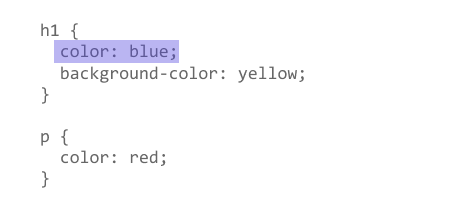
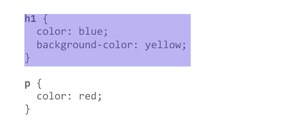
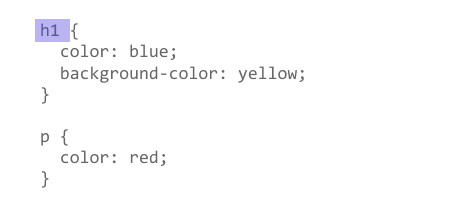

# `CSS`第一步

## 什么是`CSS`

> 基于`HTML`，对`CSS`有一个概念性的认识
>
> `CSS`是一门基于规则的语言，通过各种规则，让浏览器将`HTML`元素渲染出自定义的样式

**[`CSS`](https://developer.mozilla.org/zh-CN/docs/Glossary/CSS)** (层叠样式表) 让你可以创建好看的网页，但是它具体是怎么工作的呢？ 这篇文章通过一些很简单的例子，告诉我们什么是 `CSS`，同时还会涉及一些和 `CSS` 相关的专业术语。


在 [HTML 概述](https://developer.mozilla.org/zh-CN/docs/Learn/HTML/Introduction_to_HTML) 模块我们学习了 HTML 是什么，以及如何使用它来组成页面。 

浏览器能够解析这些页面。标题部分看起来会比正常文本更大，段落则会另起一行，并且相互之间会有一定间隔。链接通过下划线和不同的颜色与其他文本区分开来。

这些都是浏览器的默认样式——当开发者没有指定样式时，浏览器通过这些最简单的样式使页面具有基本可读性。


如果所有网站都像上图那样，互联网就会非常枯燥。但是使用 `CSS` 就可以完全控制浏览器如何显示 `HTML` 元素，从而充分展示你喜欢的设计样式。

### `CSS`用来干什么

前文提到过，`CSS` 是用来指定文档如何展示给用户的一门语言——如网页的样式、布局、等等。

一份**文档**是由标记语言组织起来的文本文件 —— [HTML](https://developer.mozilla.org/zh-CN/docs/Glossary/HTML) 是最常见的标记语言， 但你可能也听说过其他可标记语言，如 [SVG](https://developer.mozilla.org/zh-CN/docs/Glossary/SVG) 或 [XML](https://developer.mozilla.org/zh-CN/docs/Glossary/XML)。


> **备注：** 浏览器有时候也被称为 [`user agent`](https://developer.mozilla.org/zh-CN/docs/Glossary/User_agent)，大致可以当这个程序是一个存在于计算机系统中的人。当我们讨论 `CSS` 时，浏览器是 `User agent` 的主要形式，然而它并不是唯一的一个。还有其他可用的 `user agents` — 像是那些可以把 `HTML` 和 `CSS` 文档转换为可以打印的 `PDF` 文档的软件。


- `CSS` 可以用于给文档添加样式
  - 比如改变标题和链接的[颜色](https://developer.mozilla.org/zh-CN/docs/Web/CSS/color_value)及[大小](https://developer.mozilla.org/zh-CN/docs/Web/CSS/font-size)。

- 它也可用于创建布局 
  - 比如将一个单列文本变成包含主要内容区域和存放相关信息的侧边栏区域的[布局](https://developer.mozilla.org/zh-CN/docs/Web/CSS/Layout_cookbook/Column_layouts)。
- 它甚至还可以用来做一些特效
  - 比如[动画](https://developer.mozilla.org/zh-CN/docs/Web/CSS/CSS_Animations)。

### `CSS`基本语法

CSS 是一门基于规则的语言 —— 你能定义用于你的网页中特定元素样式的一组规则

比如“**我希望页面中的主标题是红色的大字**”，下面这段代码使用非常简单的 `CSS` 规则实现了这个效果：

```css
h1 {
    color: red;
    font-size: 5em;
}

```

- 语法由一个 [选择器 (selector)](https://developer.mozilla.org/zh-CN/docs/Glossary/CSS_Selector)起头。
  - 它 *选择 (selects)* 了我们将要用来添加样式的 HTML 元素。在这个例子中我们为一级标题（主标题[`h1`](https://developer.mozilla.org/en-US/docs/Web/HTML/Element/Heading_Elements)）添加样式。

- 接着输入一对大括号`{ }`。

  - 在大括号内部定义一个或多个形式为 **属性 (`property`):值 (`value`);** 的 **声明 (`declarations`)**。
  - 每个声明都指定了我们所选择元素的一个属性，之后跟一个我们想赋给这个属性的值。

  - 冒号之前是属性，冒号之后是值。不同的 `CSS` [属性 (`properties`) ](https://developer.mozilla.org/en-US/docs/Glossary/property/CSS) 对应不同的合法值。
  - 在这个例子中，我们指定了 `color` 属性，它可以接受许多[颜色值](https://developer.mozilla.org/zh-CN/docs/Learn/CSS/Building_blocks/Values_and_units#颜色)；还有 `font-size` 属性，它可以接收许多 [`size units`](https://developer.mozilla.org/zh-CN/docs/Learn/CSS/Building_blocks/Values_and_units#数字，长度和百分比) 值。

在 `MDN` 上每个属性都有单独的页面，不论你是忘记了某个属性，还是想要知道一个属性还能接受什么其它的值，这些页面都可以帮助你。

### `CSS`包含哪些内容模块

`CSS`模块

你可以通过 CSS 为许多东西添加样式，CSS 由许多*模块 (modules)* 构成。你可以在 MDN 上浏览这些模块的参考内容 (MDN reference)，许多模块都被组织在自己单独的文档页面。例如，我想查找一下 MDN reference 的 [Backgrounds and Borders](https://developer.mozilla.org/zh-CN/docs/Web/CSS/CSS_Backgrounds_and_Borders) 模块的相关内容，来了解它是用来做什么的、它还包括什么属性、它还有什么其它特性等。你也可以在 *CSS Specification* 查找（见下文），它定义了 CSS 规范。

在这个阶段你不必过于担心 CSS 是如何组织的 (how CSS is structured)，但是它能帮助你更好的掌握 CSS。例如，你注意到某个属性和另外一些属性的相似点，并且它们可能确实是相同的格式。

举个具体点的例子：如上文中的 Backgrounds and Borders 模块 — 你会发现 [`background-color`](https://developer.mozilla.org/zh-CN/docs/Web/CSS/background-color) 和 [`border-color`](https://developer.mozilla.org/zh-CN/docs/Web/CSS/border-color) 这两个属性在逻辑上相通。并且它也确实如此。


### `CSS`规范

所有的标准 `Web` 技术 (`HTML`, `CSS`,`JavaScript` 等) 都被定义在一个巨大的文档中，称作 规范 `specifications` (或者简称为 "`specs`")，它是由 (像是 [`W3C`)](https://developer.mozilla.org/en-US/docs/Glossary/W3C), [`WHATWG`](https://developer.mozilla.org/zh-CN/docs/Glossary/WHATWG), [`ECMA`](https://developer.mozilla.org/zh-CN/docs/Glossary/ECMA) 或 [`Khronos`](https://developer.mozilla.org/en-US/docs/Glossary/Khronos)) 这些规范化组织所发布的，其中还定义了各种技术是如何工作的。

`CSS` 也不例外——它是由 `W3C`(万维网联盟) 中的一个名叫 [`CSS Working Group`](https://www.w3.org/Style/CSS/) 团体发展起来的。这个团体是由浏览器厂商和其他公司中对 `CSS` 感兴趣的人作为代表组成的。也有其他的人员，比如*受邀专家 (`invited experts`)*，他们作为不从属于任何组织的独立声音加入团体。

新的 `CSS` 特性被开发出来，或是因为某个浏览器热衷于开发新功能，或是因为 `Web` 设计人员与开发者要求增加一个新特性，又或是 `CSS Working Group` 内部的讨论决定。`CSS` 始终在发展，并伴随着新的特性。然而，有一件事情从始至终都未改变，那就是不让新的改变破坏旧的网站，即使是 2000 年建立的网站，如今也能正常访问！

作为一个 `CSS` 新手，你会发现阅读 `CSS` 规范 中的内容非常吃力——它旨在为工程师在用户代理 (`user agents`) 中实现对 `CSS` 各种特性的支持，而不是作为一本为 `Web` 开发者理解 `CSS` 内容的教程。即使是有经验的开发者，也更倾向于使用 `MDN` 文档或者其它教程。但是，知晓它的存在，理解 `CSS`、规范 和 浏览器支持（见下文）之间的关系是很有价值的。

### `CSS`浏览器支持

当一个浏览器支持 CSS 后，我们就可以用它来进行 Web 开发了。这意味着我们写在 CSS 文件中的代码可以被指令执行，展示到荧幕中。在 [CSS 如何工作](https://developer.mozilla.org/zh-CN/docs/Learn/CSS/First_steps/How_CSS_works) 一节中我们会学习到更多的相关知识。但是让所有的浏览器都同时支持一个 CSS 新特性是不现实的，通常都会一个空档期——一些浏览器已经支持而另一些仍未支持。因此，查看特性的实现状态 (implementation status) 是非常有用的。在 MDN 上的每个属性的页面中都标有它们对应的状态，你可以通过这种方法来查看你是否可以去使用它。

以下是 CSS [`font-family`](https://developer.mozilla.org/zh-CN/docs/Web/CSS/font-family) 属性的兼容数据表。


## `CSS`入门

> 本篇详细的讲解了，`CSS`中各种选择器：[CSS选择器汇总 | mindcons.cn](https://mindcons.cn/sai/45915/)
>
> 能够掌握各种选择器的写法，正确的利用`CSS`选择器拿到想要的`html`元素，就算是`CSS`入门了
>
> 至于能不能写出正确的样式，那是后面的事情


在这篇文章中，我们将会拿一个简单的 HTML 文档做例子，并且在里面使用 CSS 样式

目标

- 理解 HTML 文档链接 CSS 文档的几个基本套路，
- 并能运用所学的 CSS，做些文字上的格式化操作。

### `CSS`入门案例

我们先以 HTML 文档展开叙述。如果想在自己电脑试一试，可以复制下面的代码。在你的电脑上，将代码以文件名： `index.html` 的形式保存下来。

```html
<!doctype html>
<html lang="en">
<head>
    <meta charset="utf-8">
    <title>开始学习 CSS</title>
</head>

<body>

    <h1>我是一级标题</h1>

    <p>这是一个段落文本。在文本中有一个 <span>span element</span>
并且还有一个 <a href="http://example.com">链接</a>.</p>

    <p>这是第二段。包含了一个 <em>强调</em> 元素.</p>

    <ul>
        <li>项目 1</li>
        <li>项目 2</li>
        <li>项目 <em>三</em></li>
    </ul>

</body>

</html>

```

我们最想做的就是让 HTML 文档能够遵守我们给它的 CSS 规则。其实有三种方式可以实现，而目前我们更倾向于利用最普遍且有用的方式——在文档的开头链接 CSS。

在与之前所说的 HTML 文档的相同目录创建一个文件，保存并命名为 `styles.css` 。（看后缀知道此文件就是 CSS 文件）

为了把 `styles.css` 和 `index.html` 连接起来，可以在 HTML 文档中，[`<head>`](https://developer.mozilla.org/zh-CN/docs/Web/HTML/Element/head) 语句模块里面加上下面的代码：

```html
<link rel="stylesheet" href="styles.css">
```

[`<link>`](https://developer.mozilla.org/zh-CN/docs/Web/HTML/Element/link) 语句块里面，我们用属性 `rel`，让浏览器知道有 CSS 文档存在（所以需要遵守 CSS 样式的规定），并利用属性 `href` 指定，寻找 CSS 文件的位置。 你可以做测试来验证 CSS 是否有效：在 `styles.css` 里面加上 CSS 样式并观察显示的结果。下面，用你的编辑器打出下面的代码。

```css
h1 {
  color: red;
}
```

保存 HTML 和 CSS 文档，刷新浏览器网页，不出意外你将看到网页顶层的大标题变成红色了。如果看到这个现象，恭喜你：你已经成功将某些 CSS 样式运用到 HTML 上了。当然假设没有达到预想结果，可以仔细检查每句代码是否正确，加油：）


### 样式化 `HTML` 元素

通过上一节将大标题变成红色的例子，我们已经展示了我们可以选中并且样式化 HTML 元素。我们通过触发元素选择器实现这一点——元素选择器，即直接匹配 HTML 元素的选择器。例如，若要样式化一个文档中所有的段落，只需使用选择器 `p`。若要将所有段落变成绿色，你可以利用如下方式：

```css
p {
  color: green;
}

```


用逗号将不同选择器隔开，即可一次使用多个选择器。譬如，若要将所有段落与列表变成绿色，只需：

```css
p, li {
    color: green;
}

```


### 改变元素的默认行为

只要一个 HTML 文档标记正确，即使像我们的例子那么简单，浏览器都会尽全力将其渲染至可读状态。标题默认使用大号粗体；列表旁总有项目符号。这是因为浏览器自带一个包含默认样式的样式表，默认对任何页面有效。没有了它们，所有文本会夹杂在一起变得一团糟，我们只得从头开始规定，好糟糕。话说回来，所有现代浏览器的默认样式都没什么差距。

不过你可能对浏览器的默认样式不太满意。没关系，只需选定那个元素，加一条 CSS 规则即可。就拿我们的无序列表 `<ul>`举个例子吧，它自带项目符号，不过要是你跟它有仇，你就可以这样移除它们：

```css
li {
  list-style-type: none;
}

```

把上述代码加到你的 CSS 里面试一试！


欢迎参阅 MDN 上的 `list-style-type` 属性，看看到底有哪些值被支持。 [`list-style-type`](https://developer.mozilla.org/zh-CN/docs/Web/CSS/list-style-type) 页首提供互动性示例，您可以输入不同的值来瞅一瞅它们到底有什么用。关于每个值的详细描述都规规整整地列在下面。

通过参阅上述页面，你会发现你不仅能移除项目符号——你甚至能改变它们。赶快试试 `square`，它能把默认的小黑球变成方框框。


### 使用类名

目前为止，我们通过 HTML 元素名规定样式。如果你愿意所有元素都一个样，也不是不可以，但大多数情况下，我估计你都不愿意。我知道你想干啥，你想用这种方式样式化这一片元素，又想用那种方式样式化那一片元素，真贪心。不过没关系，你可以给 HTML 元素加个类名（class），再选中那个类名，这样就可以了，大家基本上都这么用。

举个例子吧，咱们把 [class 属性](https://developer.mozilla.org/zh-CN/docs/Web/HTML/Global_attributes/class)加到表里面第二个对象。你的列表看起来应该是这样的：

```html
<ul>
  <li>项目一</li>
  <li class="special">项目二</li>
  <li>项目 <em>三</em></li>
</ul>

```

在 CSS 中，要选中这个 `special` 类，只需在选择器的开头加个西文句点（.）。在你的 CSS 文档里加上如下代码：

```css
.special {
  color: orange;
  font-weight: bold;
}

```

保存再刷新，就可以看到变化。


这个 `special` 类型可不局限于列表，它可以应用到各种元素上。举个例子，你可能也想让段落里边的 `<span>` 一起又橙又粗起来。试试把`special` 类属性加上去，保存，刷新，哇，生活就是这么美好。

有时你会发现选择器中，HTML 元素选择器跟类一起出现：

```css
li.special {
  color: orange;
  font-weight: bold; 
}

```

这个意思是说，“选中每个 `special` 类的 `li` 元素”。你真要这样，好了，它对 `<span>` 还有其它元素不起作用了。你可以把这个元素再添上去就是了：

```css
li.special,
span.special {
  color: orange;
  font-weight: bold;
}

```

你们都是懒人，肯定不想每加一个 special 类的元素就改一遍 CSS 表，你肯定想把一个类的属性应用到多个元素上。所以说，有时还是别管元素，光看类就完事了，除非你意志坚定，坚持对这个类的某一种元素创造规则，还不让其它元素用。

### 根据元素在文档中的位置确定样式

有时候，您希望某些内容根据它在文档中的位置而有所不同。这里有很多选择器可以为您提供帮助，但现在我们只介绍几个选择器。在我们的文档中有两个 `<em>`元素 ——一个在段落内，另一个在列表项内。仅选择嵌套在`<li>` 元素内的`<em>`我们可以使用一个称为**包含选择符**的选择器，它只是单纯地在两个选择器之间加上一个空格。

将以下规则添加到样式表。

```css
li em {
  color: rebeccapurple;
}

```

该选择器将选择`<li>`内部的任何`<em>`元素（`<li>`的后代）。因此在示例文档中，您应该发现第三个列表项内的`<em>`现在是紫色，但是在段落内的那个没发生变化。


另一些可能想尝试的事情是在 HTML 文档中设置直接出现在标题后面并且与标题具有相同层级的段落样式，为此需在两个选择器之间添加一个 `+` 号 (成为 **相邻选择符**)

也将这个规则添加到样式表中：

```css
h1 + p {
  font-size: 200%;
}

```

下面的示例包含了上面的两个规则。

```html
<!doctype html>
<html lang="en">
<head>
  <meta charset="utf-8">
  <title>开始学习 CSS</title>
  <link rel="stylesheet" href="styles.css">
</head>

<body>

<h1>我是一级标题</h1>

<p>这是一个段落文本。在文本中有一个 <span>span element</span>
  并且还有一个 <a href="http://example.com">链接</a>.</p>

<p>这是第二段。包含了一个 <em>强调</em> 元素.</p>

<ul>
  <li>项目 <span>1</span></li>
  <li class="special">项目 2</li>
  <li>项目 <em>三</em></li>
</ul>

</body>

</html>

```


```css
li em {
    color: rebeccapurple;
}

h1 + p {
    font-size: 200%;
}
    
```


> **备注：** 如你所见，CSS 给我们提供了几种定位元素的方法。到目前为止，我们只触及了皮毛！我们将对这些选择器进行适当的研究，更多的内容将在我们后面的[选择器](https://developer.mozilla.org/zh-CN/docs/Learn/CSS/Building_blocks/Selectors)章节中介绍。

### 根据状态确定样式

在这篇教程中我们最后要看的一种修改样式的方法就是根据标签的状态确定样式。一个直观的例子就是当我们修改链接的样式时。当我们修改一个链接的样式时我们需要定位（针对） [`<a>`](https://developer.mozilla.org/zh-CN/docs/Web/HTML/Element/a) （锚）标签。取决于是否是未访问的、访问过的、被鼠标悬停的、被键盘定位的，亦或是正在被点击当中的状态，这个标签有着不同的状态。你可以使用 CSS 去定位或者说针对这些不同的状态进行修饰——下面的 CSS 代码使得没有被访问的链接颜色变为粉色、访问过的链接变为绿色。

```css
a:link {
  color: pink;
}

a:visited {
  color: green;
}

```

你可以改变链接被鼠标悬停的时候的样式，例如移除下划线，下面的代码就实现了这个功能。

```css
a:hover {
  text-decoration: none;
}

```


我们对鼠标悬停于链接上的情况删除了下划线。你当然可以让超链接在任何情况下都没有下划线。但需要注意的是，对一个实际的站点，需要让浏览者知道“链接是链接”。为了让浏览者注意到一段文字中的某些部分是可点击的，最好保留 link 状态下的下划线。— 这是下划线的本来作用。不管你用 CSS 来做什么，都应当使得变化后的文档看上去更加清晰明了。— 在后面，当我们遇到类似的情况时，我们将适时指出。

> **备注：** 在本教程以及整个 MDN 站点中，你会经常看到“无障碍”这个词。“无障碍”一词的意思是，我们的网页应当让每一个访客都能够理解、使用。
>
> 你的访客可能在一台使用鼠标和键盘操作的计算机前，也可能正在使用带有触摸屏的手机，或者正在使用屏幕阅读软件读出文档内容，或者他们需要使用更大的字体，或者仅仅使用键盘浏览站点。
>
> 一个朴素的 HTML 文档一般来说对任何人都是可以无障碍访问的，当你开始为它添加样式，记得不要破坏这种可访问性。

### 同时使用选择器和选择符

你可以同时使用选择器和选择符。来看一些例子：

```css
/* selects any <span> that is inside a <p>, which is inside an <article>  */
article p span { ... }

/* selects any <p> that comes directly after a <ul>, which comes directly after an <h1>  */
h1 + ul + p { ... }

```

你可以将多种类型组合在一起。试试将下面的代码添加到你的代码里：

```css
body h1 + p .special {
  color: yellow;
  background-color: black;
  padding: 5px;
}

```

上面的代码为以下元素建立样式：在 `<body>` 之内，紧接在 `<h1>` 后面的 `<p>` 元素的内部，类名为 special。

在我们提供的原始 HTML 文档中，与之符合的元素只有`<span class="special">`.

如果你现在觉得这份代码太复杂了，别担心，一旦你开始编写更多的 CSS 代码，你很快就能找到窍门。

### 小结

在本教程中，我们学习了使用 CSS 为文档添加样式的几种方法。在教程的剩下部分，我们将继续这个话题。不过，你现在已经有了足够的知识为文本建立样式；根据目标元素的不同用不同的方式应用样式；在 MDN 文档中查找属性和值。

在下一节中，我们将看到样式表的结构是什么样的。

## `CSS`是如何构建的

> 本篇的介绍的与`CSS`有关若干概念

既然你已经了解了什么是 CSS，以及使用 CSS 的基础知识，是时候更深入的了解该语言本身的结构了。

我们已经见过了本页讨论的很多概念；如果在之后对某些概念感到困惑的话，可以返回至此进行回顾。

### `HTML`中引入`CSS`的三种方法

我们需要了解的第一件事情就是在文档中应用 CSS 的三种方法

#### 外部样式表

将外部样式表链接到页面，这是将 CSS 附加到文档中的最常见和最有用的方法，因为您可以将 CSS 链接到多个页面，从而允许您使用相同的样式表设置所有页面的样式。在大多数情况下，一个站点的不同页面看起来几乎都是一样的，因此您可以使用相同的规则集来获得基本的外观。

外部样式表是指将 CSS 编写在扩展名为`.css` 的单独文件中，并从 HTML `<link>` 元素引用它的情况：

```html
<!DOCTYPE html>
<html>
  <head>
    <meta charset="utf-8">
    <title>My CSS experiment</title>
    <link rel="stylesheet" href="styles.css">
  </head>
  <body>
    <h1>Hello World!</h1>
    <p>This is my first CSS example</p>
  </body>
</html>

```

CSS 文件可能如下所示：

```css
h1 {
  color: blue;
  background-color: yellow;
  border: 1px solid black;
}

p {
  color: red;
}

```

[`link`](https://developer.mozilla.org/zh-CN/docs/Web/HTML/Element/link) 元素的 `href` 属性需要引用你的文件系统中的一个文件。

在上面的例子中，CSS 文件和 HTML 文档在同一个文件夹中，但是你可以把 CSS 文件放在其他地方，并调整指定的路径以匹配，例如：

```html
<!-- Inside a subdirectory called styles inside the current directory -->
<link rel="stylesheet" href="styles/style.css">

<!-- Inside a subdirectory called general, which is in a subdirectory called styles, inside the current directory -->
<link rel="stylesheet" href="styles/general/style.css">

<!-- Go up one directory level, then inside a subdirectory called styles -->
<link rel="stylesheet" href="../styles/style.css">

```

#### 内部样式表

内部样式表是指不使用外部 CSS 文件，而是将 CSS 放在 HTML 文件[`head`](https://developer.mozilla.org/zh-CN/docs/Web/HTML/Element/head)标签里的[`style`](https://developer.mozilla.org/zh-CN/docs/Web/HTML/Element/style)标签之中。

于是 HTML 看起来就像下面这个样子：

```html
<!DOCTYPE html>
<html>
  <head>
    <meta charset="utf-8">
    <title>My CSS experiment</title>
    <style>
      h1 {
        color: blue;
        background-color: yellow;
        border: 1px solid black;
      }

      p {
        color: red;
      }
    </style>
  </head>
  <body>
    <h1>Hello World!</h1>
    <p>This is my first CSS example</p>
  </body>
</html>

```

有的时候，这种方法会比较有用（比如你使用的内容管理系统不能直接编辑 CSS 文件)，但该方法和外部样式表比起来更加低效 。在一个站点里，你不得不在每个页面里重复添加相同的 CSS，并且在需要更改 CSS 时修改每个页面文件。

#### 内联样式

内联样式表存在于 HTML 元素的 style 属性之中。其特点是每个 CSS 表只影响一个元素：

```html
<!DOCTYPE html>
<html>
  <head>
    <meta charset="utf-8">
    <title>My CSS experiment</title>
  </head>
  <body>
    <h1 style="color: blue;background-color: yellow;border: 1px solid black;">Hello World!</h1>
    <p style="color:red;">This is my first CSS example</p>
  </body>
</html>

```

<!DOCTYPE html>
<html>
  <head>
    <meta charset="utf-8">
    <title>My CSS experiment</title>
  </head>
  <body>
    <h1 style="color: blue;background-color: yellow;border: 1px solid black;">Hello World!</h1>
    <p style="color:red;">This is my first CSS example</p>
  </body>
</html>

**除非你有充足的理由，否则不要这样做！** 它难以维护（在需要更新时，你必须在修改同一个文档的多处地方），并且这种写法将文档结构和文档表现混合起来了，这使得代码变得难以阅读和理解。将不同类型的代码分开存放在不同的文档中，会让我们的工作更加清晰。

在某些地方，内联样式更常见，甚至更可取。如果您的工作环境确实很严格（也许网站管理系统 (CMS) 仅允许您编辑 HTML 正文），则可能不得不使用它们。您也会发现它们很长时间被应用在 HTML 电子邮件中，以便与尽可能多的电子邮件客户端兼容。

### 选择器

讲到 CSS 就不得不说到选择器，并且在之前的辅导教程中我们已经列举了一些不同的选择器。为了样式化某些元素，我们会通过选择器来选中 HTML 文档中的这些元素。如果你的样式没有生效，那很可能是你的选择器没有像你想象的那样选中你想要的元素。

每个 CSS 规则都以一个选择器或一组选择器为开始，去告诉浏览器这些规则应该应用到哪些元素上。以下都是有效的选择器或组合选择器的示例。

```css
h1
a:link
.manythings
#onething
*
.box p
.box p:first-child
h1, h2, .intro

```

[CSS选择器汇总 | mindcons.cn](https://mindcons.cn/sai/45915/)

### 专一性

通常情况下，两个选择器可以选择相同的 HTML 元素。考虑下面的样式表，其中我有一个规则，其中有一个将段落设置为蓝色的 p 选择器，还有一个将选定元素设置为红色的类。

```css
.special {
  color: red;
}

p {
  color: blue;
}

```

比方说，在我们的 HTML 文档中，我们有一个带有特殊类的段落。这两条规则都适用，那么谁赢了？你认为我们的段落会变成什么颜色？

```html
<p class="special">What color am I?</p>

```

CSS 语言有规则来控制在发生碰撞时哪条规则将获胜——这些规则称为级联规则和专用规则。在下面的代码块中，我们为 p 选择器定义了两个规则，但是段落最后是蓝色的。这是因为将其设置为蓝色的声明将出现在样式表的后面，而稍后的样式将覆盖以前的样式。这就是起作用的级联。

```css
p {
  color: red;
}

p {
  color: blue;
}

```

但是，在我们同时使用了类选择器和元素选择器的前一个例子中，类将获胜，使得段落变红——即使它出现在样式表的前面。一个类被描述为比元素选择器更具体，或者具有更多的特异性，所以它获胜了。

```html
<!DOCTYPE html>
<html>
<head>
  <meta charset="utf-8">
  <title>My CSS experiment</title>
  <style>
      .special {
          color: red;
      }

      p {
          color: blue;
      }

  </style>
</head>
<body>
<p class="special">What color am I?</p>
</body>
</html>

```

<!DOCTYPE html>
<html>
  <head>
    <meta charset="utf-8">
    <title>My CSS experiment</title>
  </head>
  <body>
    <p class="special">What color am I?</p>
  </body>
</html>


自己试试上面的实验——将 HTML 添加到您的实验中，然后将两个 `p{.}` 规则添加到样式表中。接下来，将第一个 `p` 选择器更改为 `.special`，以查看它如何更改样式。

一开始，具体性和层叠的规则看起来有点复杂，一旦你积累了更多的 CSS 知识，就更容易理解了。在我们的级联和继承文章 (将在下一个模块中讨论) 中，我将详细解释这一点，包括如何计算专用性。现在，请记住这是存在的，有时 CSS 可能不会像您预期的那样应用，因为样式表中的其他内容具有更高的特异性。确定一个元素可以适用不止一个规则是解决这些问题的第一步

### 属性和值

在最基本的层面上，CSS 由两个组成部分组成：

- **属性：** 人类可读的标识符，指示您想要更改的样式特征 (例如[`font-size`](https://developer.mozilla.org/zh-CN/docs/Web/CSS/font-size)、[`width`](https://developer.mozilla.org/zh-CN/docs/Web/CSS/width)、[`background-color`](https://developer.mozilla.org/zh-CN/docs/Web/CSS/background-color))。
- **值：** 每个指定的属性都有一个值，该值指示您希望如何更改这些样式特性 (例如，要将字体、宽度或背景色更改为。)

下面的图像突出显示单个属性和值。属性名为 `color`, 值为 `blue`.



与值配对的属性称为 CSS 声明。CSS 声明放在 CSS 声明块中。下一张图片显示了我们的 CSS，并突出显示了声明块。


最后，CSS 声明块与选择器配对，以生成 CSS 规则集 (或 CSS 规则)。我们的图像包含两个规则，一个用于 `h1` 选择器，另一个用于 `p` 选择器。`h1` 的规则被突出显示。



将 CSS 属性设置为特定值是 CSS 语言的核心功能。CSS 引擎计算哪些声明应用于页面的每个元素，以便适当地布局和样式它。重要的是要记住，在 CSS 中，属性和值都是区分大小写的。每对中的属性和值由冒号 (`:`) 分隔。

> **警告：** 如果属性未知或某个值对给定属性无效，则声明被视为无效，并被浏览器的 CSS 引擎完全忽略。

### 函数

虽然大多数值是相对简单的关键字或数值，但也有一些可能的值以函数的形式出现。一个例子是 calc() 函数。这个函数允许您在 CSS 中进行简单的计算，例如：

```html
<div class="outer"><div class="box">The inner box is 90% - 30px.</div></div>
```

```css
.outer {
  border: 5px solid black;
}

.box {
padding: 10px;
width: calc(90% - 30px);
background-color: rebeccapurple;
color: white;
}

```


一个函数由函数名和一些括号组成，其中放置了该函数的允许值。在上面的 `calc()` 示例中，我要求此框的宽度为包含块宽度的 90%，减去 30 像素。这不是我可以提前计算的东西，只是在 CSS 中输入值，因为我不知道 90% 会是什么。与所有值一样，MDN 上的相关页面将有使用示例，这样您就可以看到函数是如何工作的。

另一个例子是[`transform`](https://developer.mozilla.org/zh-CN/docs/Web/CSS/transform), 例如 `rotate()`.

```html
<div class="box"></div>

```

```css
.box {
  margin: 30px;
  width: 100px;
  height: 100px;
  background-color: rebeccapurple;
  transform: rotate(0.8turn)
}

```


### `@rules`

到目前为止，我们还没有遇到 [`@rules`](https://developer.mozilla.org/zh-CN/docs/Web/CSS/At-rule) (发音为 "at-rules")。这是一些特殊的规则，为 CSS 提供了一些关于如何表现的指导。有些 `@rules` 规则很简单，有规则名和值。例如，要将额外的样式表导入主 CSS 样式表，可以使用 `@import`:

```css
@import 'styles2.css';

```

您将遇到的最常见的 @rule 之一是 `@media`，它允许您使用[媒体查询](https://developer.mozilla.org/zh-CN/docs/Web/CSS/Media_Queries)来应用 CSS，仅当某些条件成立 (例如，当屏幕分辨率高于某一数量，或屏幕宽度大于某一宽度时)。

在下面的 CSS 中，我们将给 `<body>` 元素一个粉红色的背景色。但是，我们随后使用 @media 创建样式表的一个部分，该部分仅适用于视口大于 1000px 的浏览器。如果浏览器的宽度大于 1000px，则背景色将为蓝色。

```css
body {
  background-color: pink;
}

@media (min-width: 1000px) {
  body {
    background-color: blue;
  }
}

```


### 速记属性

一些属性，如 [`font`](https://developer.mozilla.org/zh-CN/docs/Web/CSS/font), [`background`](https://developer.mozilla.org/zh-CN/docs/Web/CSS/background), [`padding`](https://developer.mozilla.org/zh-CN/docs/Web/CSS/padding), [`border`](https://developer.mozilla.org/zh-CN/docs/Web/CSS/border), and [`margin`](https://developer.mozilla.org/zh-CN/docs/Web/CSS/margin) 等属性称为速记属性--这是因为它们允许您在一行中设置多个属性值，从而节省时间并使代码更整洁。

例如，这一行代码：

```css
/* In 4-value shorthands like padding and margin, the values are applied
   in the order top, right, bottom, left (clockwise from the top). There are also other
   shorthand types, for example 2-value shorthands, which set padding/margin
   for top/bottom, then left/right */
padding: 10px 15px 15px 5px;

```

与这四行代码是等价的：

```css
padding-top: 10px;
padding-right: 15px;
padding-bottom: 15px;
padding-left: 5px;
```

这一行：

```css
background: red url(bg-graphic.png) 10px 10px repeat-x fixed;

```

与这五行代码是等价的：

```css
background-color: red;
background-image: url(bg-graphic.png);
background-position: 10px 10px;
background-repeat: repeat-x;
background-attachment: fixed;

```

### 注释

与任何的代码工作一样，在编写 CSS 过程中，最好的练习方式就是添加注释。这样做可以帮助您在过了几个月后回来修改或优化代码时了解它们是如何工作的，同时也便于其他人理解您的代码。

CSS 中的注释以 `/*` 开头，以 `*/` 结尾。在下面的代码块中，注释标记了不同代码节的开始。当代码库变得更大时，这对于帮助您导航代码库非常有用——在代码编辑器中搜索注释可以高效地定位代码节。

```css
/* Handle basic element styling */
/* -------------------------------------------------------------------------------------------- */
body {
  font: 1em/150% Helvetica, Arial, sans-serif;
  padding: 1em;
  margin: 0 auto;
  max-width: 33em;
}

@media (min-width: 70em) {
  /* Let's special case the global font size. On large screen or window,
     we increase the font size for better readability */
  body {
    font-size: 130%;
  }
}

h1 {font-size: 1.5em;}

/* Handle specific elements nested in the DOM  */
/* -------------------------------------------------------------------------------------------- */
div p, #id:first-line {
  background-color: red;
  border-radius: 3px;
}

div p{
  margin: 0;
  padding: 1em;
}

div p + p {
  padding-top: 0;
}

```

“注释掉”代码这一操作常用于在测试中临时禁用一段代码。例如，如果您试图找出代码的哪一部分会导致错误。在下例中，`.special` selector 规则被“注释”掉了，也就是被禁用了。

### 空白

空白是指实际空格、制表符和新行。以与 HTML 相同的方式，浏览器往往忽略 CSS 中的大部分空白；许多空白只是为了提高可读性。

在下面的第一个示例中，我们将每个声明 (以及规则开始/结束) 都放在自己的行中--这可以说是编写 CSS 的好方法，因为它使维护和理解变得更加容易：

```css
body {
  font: 1em/150% Helvetica, Arial, sans-serif;
  padding: 1em;
  margin: 0 auto;
  max-width: 33em;
}

@media (min-width: 70em) {
  body {
    font-size: 130%;
  }
}

h1 {
  font-size: 1.5em;
}

div p,
#id:first-line {
  background-color: red;
  border-radius: 3px;
}

div p {
  margin: 0;
  padding: 1em;
}

div p + p {
  padding-top: 0;
}

```

您可以编写完全相同的 CSS，删除大部分空格--这在功能上与第一个示例相同，但我相信您肯定也觉得阅读起来有点困难：

```css
body {font: 1em/150% Helvetica, Arial, sans-serif; padding: 1em; margin: 0 auto; max-width: 33em;}
@media (min-width: 70em) { body {font-size: 130%;} }

h1 {font-size: 1.5em;}

div p, #id:first-line {background-color: red; border-radius: 3px;}
div p {margin: 0; padding: 1em;}
div p + p {padding-top: 0;}

```

您选择的代码布局通常是个人偏好，尽管当您开始在团队中工作时，您可能会发现现有团队有自己的样式指南，指定要遵循的约定。

在 CSS 中，属性和它们的值之间的空格需要小心。

例如，以下声明是有效的 CSS：

```css
margin: 0 auto;
padding-left: 10px;

```

以下内容无效：

```css
margin: 0auto;
padding- left: 10px;

```


## `CSS`是如何工作的

我们已经知道了 CSS 是做什么的以及怎么写简单的样式这样基础的 CSS，接下来我将了解到浏览器如何获取 CSS、HTML 和将他们加载成网页。

### `CSS` 究竟是怎么工作的？

当浏览器展示一个文件的时候，它必须兼顾文件的内容和文件的样式信息，下面我们会了解到它处理文件的标准的流程。需要知道的是，下面的步骤是浏览加载网页的简化版本，而且不同的浏览器在处理文件的时候会有不同的方式，但是下面的步骤基本都会出现。

1. 浏览器载入 HTML 文件（比如从网络上获取）。
2. 将 HTML 文件转化成一个 DOM（Document Object Model），DOM 是文件在计算机内存中的表现形式，下一节将更加详细的解释 DOM。
3. 接下来，浏览器会拉取该 HTML 相关的大部分资源，比如嵌入到页面的图片、视频和 CSS 样式。JavaScript 则会稍后进行处理，简单起见，同时此节主讲 CSS，所以这里对如何加载 JavaScript 不会展开叙述。
4. 浏览器拉取到 CSS 之后会进行解析，根据选择器的不同类型（比如 element、class、id 等等）把他们分到不同的“桶”中。浏览器基于它找到的不同的选择器，将不同的规则（基于选择器的规则，如元素选择器、类选择器、id 选择器等）应用在对应的 DOM 的节点中，并添加节点依赖的样式（这个中间步骤称为渲染树）。
5. 上述的规则应用于渲染树之后，渲染树会依照应该出现的结构进行布局。
6. 网页展示在屏幕上（这一步被称为着色）。

结合下面的图示更形象：


### 关于 DOM

一个 DOM 有一个树形结构，标记语言中的每一个元素、属性以及每一段文字都对应着结构树中的一个节点（Node/DOM 或 DOM node）。节点由节点本身和其他 DOM 节点的关系定义，有些节点有父节点，有些节点有兄弟节点（同级节点）。

对于 DOM 的理解会很大程度上帮助你设计、调试和维护你的 CSS，因为 DOM 是你的 CSS 样式和文件内容的结合。当你使用浏览器 F12 调试的时候你需要操作 DOM 以查看使用了哪些规则。

### `HTML`元素转化为`DOM`

不同于很长且枯燥的案例，这里我们通过一个 HTML 片段来了解 HTML 怎么转化成 DOM

以下列 HTML 代码为例：

```html
<p>
  Let's use:
  <span>Cascading</span>
  <span>Style</span>
  <span>Sheets</span>
</p>

```

在这个 DOM 中，`<p>`元素对应了父节点，它的子节点是一个 text 节点和三个对应了`<span>`元素的节点，`SPAN`节点同时也是他们中的 Text 节点的父节点。

```
P
├─ "Let's use:"
├─ SPAN
|  └─ "Cascading"
├─ SPAN
|  └─ "Style"
└─ SPAN
    └─ "Sheets"
```

上图就是浏览器怎么解析之前那个 HTML 片段——它生成上图的 DOM 树形结构并将它按照如下输出到浏览器：

<!DOCTYPE html>
<html>
  <head>
    <meta charset="utf-8">
    <title>My CSS experiment</title>
  </head>
  <body>
  <p>
    Let's use:
    <span>Cascading</span>
    <span>Style</span>
    <span>Sheets</span>
  </p>
  </body>
</html>

### 应用 CSS 到 DOM

接下来让我们看看添加一些 CSS 到文件里加以渲染，同样的 HTML 代码：

```html
<p>
  Let's use:
  <span>Cascading</span>
  <span>Style</span>
  <span>Sheets</span>
</p>

```

以下为 CSS 代码：

```css
span {
  border: 1px solid black;
  background-color: lime;
}

```

浏览器会解析 HTML 并创造一个 DOM，然后解析 CSS。可以看到唯一的选择器就是`span`元素选择器，浏览器处理规则会非常快！把同样的规则直接使用在三个`<span>`标签上，然后渲染出图像到屏幕。

现在的显示如下：


在我们下一个模块的 [Debugging CSS](https://developer.mozilla.org/zh-CN/docs/Learn/CSS/Building_blocks/Debugging_CSS) 文章中我们将会使用 F12 调试 CSS 的问题并且更进一步的了解浏览器如何解析 CSS。

### 无法解析的 CSS 代码

在[之前的文章中](https://developer.mozilla.org/zh-CN/docs/Learn/CSS/First_steps/What_is_CSS#浏览器支持)我们提到了浏览器并不会同时实现所有的新 CSS，此外很多人也不会使用最新版本的浏览器。鉴于 CSS 一直不断的开发，因此领先于浏览器可以识别的范围，那么你也许会好奇当浏览器遇到无法解析的 CSS 选择器或声明的时候会发生什么呢？

答案就是浏览器什么也不会做，继续解析下一个 CSS 样式！

如果一个浏览器在解析你所书写的 CSS 规则的过程中遇到了无法理解的属性或者值，它会忽略这些并继续解析下面的 CSS 声明。在你书写了错误的 CSS 代码（或者误拼写），又或者当浏览器遇到对于它来说很新的还没有支持的 CSS 代码的时候上述的情况同样会发生（直接忽略）。

相似的，当浏览器遇到无法解析的选择器的时候，他会直接忽略整个选择器规则，然后解析下一个 CSS 选择器。

在下面的案例中，我使用会导致属性错误的英式拼写来书写"color"，所以我的段落没有被渲染成蓝色，而其他的 CSS 代码会正常执行，只有错误的部分会被忽略。

```html
<p>I want this text to be large, bold and blue.</p>

```


```css
p {
  font-weight: bold;
  colour: blue; /* incorrect spelling of the color property */
  font-size: 200%;
}

```


这样做好处多多，代表着你使用最新的 CSS 优化的过程中浏览器遇到无法解析的规则也不会报错。当你为一个元素指定多个 CSS 样式的时候，浏览器会加载样式表中的最后的 CSS 代码进行渲染（样式表，优先级等请读者自行了解），也正因为如此，你可以为同一个元素指定多个 CSS 样式来解决有些浏览器不兼容新特性的问题（比如指定两个`width`）。

这一特点在你想使用一个很新的 CSS 特性但是不是所有浏览器都支持的时候（浏览器兼容）非常有用，举例来说，一些老的浏览器不接收`calc()`(calculate 的缩写，CSS3 新增，为元素指定动态宽度、长度等，注意此处的动态是计算之后得一个值) 作为一个值。我可能使用它结合像素为一个元素设置了动态宽度（如下），老式的浏览器由于无法解析忽略这一行；新式的浏览器则会把这一行解析成像素值，并且覆盖第一行指定的宽度。

```css
.box {
  width: 500px;
  width: calc(100% - 50px);
}

```

后面的课程我们会讨论更多关于浏览器兼容的问题。

# `CSS`构建基础

这个模块承接[学习 CSS 第一步](https://developer.mozilla.org/zh-CN/docs/Learn/CSS/First_steps)——即你对 (CSS) 语言和其语法已经足够熟悉、并且有了一些基本的使用经验，该是稍微深入点学习的时候了。

这个模块着眼于级联和继承，所有可供使用的选择器类型，单位，尺寸，背景、边框样式，调试，等等等等。

本文目标是，在你进一步了解 [为文本添加样式](https://developer.mozilla.org/zh-CN/docs/Learn/CSS/Styling_text)和[CSS 布局](https://developer.mozilla.org/zh-CN/docs/Learn/CSS/CSS_layout)之前，为你提供一个助你写出合格 CSS 和理解所有基本理论的工具箱。

## 层叠与继承

> 本文旨在让你理解 CSS 的一些最基本的概念——层叠、优先级和继承——这些概念决定着如何将 CSS 应用到 HTML 中，以及如何解决冲突。
>
> 尽管与课程的其他部分相比，完成这节课可能看起来没有那么直接的相关性，而且更学术性一些，但是理解这些东西将为您以后节省很多痛苦！我希望您仔细阅读本节，并在继续下一步学习之前，确保您是否理解了这些概念。


### 冲突规则

CSS 代表**层叠样式表 (Cascading Style Sheets)**，理解第一个词*cascading*很重要— cascade 的表现方式是理解 CSS 的关键。

在某些时候，在做一个项目过程中你会发现一些应该产生效果的样式没有生效。通常的原因是你创建了两个应用于同一个元素的规则。**cascade**, 和它密切相关的概念是 **specificity**，决定在发生冲突的时候应该使用哪条规则。设计元素样式的规则可能不是期望的规则，因此需要了解这些机制是如何工作的。

这里也有**继承**的概念，也就是在默认情况下，一些 css 属性继承当前元素的父元素上设置的值，有些则不继承。这也可能导致一些和期望不同的结果。

我们来快速的看下正在处理的关键问题，然后依次了解它们是如何相互影响的，以及如何和 css 交互的。虽然这些概念难以理解，但是随着不断的练习，你会慢慢熟悉它的工作原理。

#### 层叠

Stylesheets **cascade（样式表层叠）** — 简单的说，css 规则的顺序很重要；当应用两条同级别的规则到一个元素的时候，写在后面的就是实际使用的规则。

下面的例子中，我们有两个关于 `h1` 的规则。`h1` 最后显示蓝色 — 这些规则有相同的优先级，所以顺序在最后的生效。

```html
<h1>This is my heading.</h1>
    
```


```css
h1 { 
    color: red; 
}
h1 { 
    color: blue; 
}
    
```


#### 优先级

浏览器是根据优先级(`Specificity`)来决定当多个规则有不同选择器对应相同的元素的时候需要使用哪个规则。它基本上是一个衡量选择器具体选择哪些区域的尺度：

- 一个元素选择器不是很具体 — 会选择页面上该类型的所有元素 — 所以它的优先级就会低一些。
- 一个类选择器稍微具体点 — 它会选择该页面中有特定 `class` 属性值的元素 — 所以它的优先级就要高一点。

举例时间 ! 下面我们再来介绍两个适用于 `h1` 的规则。下面的 `h1` 最后会显示红色 — 类选择器有更高的优先级，因此就会被应用——即使元素选择器顺序在它后面。

```html
<h1 class="main-heading">This is my heading.</h1>
    
```

```css
.main-heading { 
    color: red; 
}
        
h1 { 
    color: blue; 
}
    
```


稍后我们会详细解释优先级评分和其他相关内容。

#### 继承

- 我们为一个元素设置的样式，同时也会应用到它到底后台元素上

- 继承是发生在祖先后代之间的

- 继承的设计是为了方便我们的开发，利用继承我们可以将一些通用的样式，统一设置到共同的祖先元素上，这样只需设置一次即可让所有的元素具有该样式

注意：并不是所有的样式都会被继承，比如，背景相关的，布局相关的等，这些样式都不会被继承


继承也需要在上下文中去理解 —— 一些设置在父元素上的 css 属性是可以被子元素继承的，有些则不能。

举一个例子，如果你设置一个元素的 `color` 和 `font-family` ，每个在里面的元素也都会有相同的属性，除非你直接在元素上设置属性。

```html
<p>As the body has been set to have a color of blue this is inherited through the descendants.</p>
<p>We can change the color by targeting the element with a selector, such as this <span>span</span>.</p>
    
```

```css
body {
    color: blue;
}

span {
    color: black;
}
    
```


一些属性是不能继承的 — 举个例子如果你在一个元素上设置 [`width`](https://developer.mozilla.org/zh-CN/docs/Web/CSS/width) 50% ，所有的后代不会是父元素的宽度的 50% 。如果这个也可以继承的话，CSS 就会很难使用了！

### 理解这些概念是如何协同工作的

这三个概念一起来控制 css 规则应用于哪个元素；在下面的内容中，我们将看到它们是如何协同工作的。有时候会感觉有些复杂，但是当你对 css 有更多经验的时候，你就可以记住它们，即便忘记了细节，可以在网上查到，有经验的开发人员也不会记得所有细节。

### 理解继承

我们从继承开始。下面的例子中我们有一个`ul`，里面有两个无序列表。我们已经给 `<ul>` 设置了 **border**， **padding** 和 **font color**.

**color** 应用在直接子元素，也影响其他后代 — 直接子元素`<li>`，和第一个嵌套列表中的子项。然后添加了一个 `special` 类到第二个嵌套列表，其中使用了不同的颜色。然后通过它的子元素继承。

```html
<ul class="main">
    <li>Item One</li>
    <li>Item Two
        <ul>
            <li>2.1</li>
            <li>2.2</li>
        </ul>
    </li>
    <li>Item Three
        <ul class="special">
            <li>3.1
                <ul>
                    <li>3.1.1</li>
                    <li>3.1.2</li>
                </ul>
            </li>
            <li>3.2</li>
        </ul>
    </li>
</ul>
    
```

```css
.main {
    color: rebeccapurple;
    border: 2px solid #ccc;
    padding: 1em;
}

.special {
    color: black;
    font-weight: bold;
}
    
```


像 widths (上面提到的), margins, padding, 和 borders 不会被继承。如果 borders 可以被继承，每个列表和列表项都会获得一个边框 — 可能就不是我们想要的结果！

哪些属性属于默认继承很大程度上是由常识决定的。

#### 控制继承

CSS 为控制继承提供了五个特殊的通用属性值。每个 css 属性都接收这些值。

[`inherit`](https://developer.mozilla.org/zh-CN/docs/Web/CSS/inherit)

设置该属性会使子元素属性和父元素相同。实际上，就是 "开启继承".

[`initial`](https://developer.mozilla.org/zh-CN/docs/Web/CSS/initial)

设置属性值和浏览器默认样式相同。如果浏览器默认样式中未设置且该属性是自然继承的，那么会设置为 `inherit` 。

[`revert` (en-US)](https://developer.mozilla.org/en-US/docs/Web/CSS/revert)

将应用于选定元素的属性值重置为浏览器的默认样式，而不是应用于该属性的默认值。在许多情况下，此值的作用类似于 `unset`。

[`revert-layer` (en-US)](https://developer.mozilla.org/en-US/docs/Web/CSS/revert-layer)

将应用于选定元素的属性值重置为在上一个[层叠层](https://developer.mozilla.org/zh-CN/docs/Web/CSS/@layer)中建立的值。

[`unset`](https://developer.mozilla.org/zh-CN/docs/Web/CSS/unset)

将属性重置为自然值，也就是如果属性是自然继承那么就是 `inherit`，否则和 `initial` 一样


下面的例子你可以通过修改 css 来查看它们的功能，写代码是掌握 html 和 css 最好的办法。

例子：

1. 第二个列表项有类 `my-class-1` 。它设置了内部元素来继承属性。如果你删除这个类，它会如何改变链接的颜色？
2. 你知道为什么第三个和第四个链接会是这样的颜色？ 如果不知道看看之前的内容。
3. 如果你对 `<a>` 添加一个新样式 — 例如 `a { color: red; }`，哪个链接的颜色会改变?

```html
<ul>
    <li>Default <a href="#">link</a> color</li>
    <li class="my-class-1">Inherit the <a href="#">link</a> color</li>
    <li class="my-class-2">Reset the <a href="#">link</a> color</li>
    <li class="my-class-3">Unset the <a href="#">link</a> color</li>
</ul>
    
```

```css
body {
    color: green;
}
          
.my-class-1 a {
    color: inherit;
}
          
.my-class-2 a {
    color: initial;
}
          
.my-class-3 a {
    color: unset;
}
    
```


#### 重设所有属性值

CSS 的 shorthand 属性（速记属性） `all` 可以用于同时将这些继承值中的一个应用于（几乎）所有属性。它的值可以是其中任意一个 (`inherit`, `initial`, `unset`, or `revert`)。这是一种撤销对样式所做更改的简便方法，以便回到之前已知的起点。

下面的例子中有两个**blockquote** 。第一个用元素本身的样式 ，第二个设置 `all` 为 `unset`

```html
        <blockquote>
            <p>This blockquote is styled</p>
        </blockquote>

        <blockquote class="fix-this">
            <p>This blockquote is not styled</p>
        </blockquote>
    
```

```css
blockquote {
    background-color: red;
    border: 2px solid green;
}
        
.fix-this {
    all: unset;
}
    
```


试着将 `all` 改成其他可能的值然后观察有什么不一样。

### 理解层叠

我们现在明白了为什么嵌套在 html 结构中的段落和应用于正文中的 css 颜色相同，从入门课程中，我们了解了如何将文档中的任何修改应用于某个对象的 css，无论是把 css 指定某个元素还是创建一个类。现在，我们将要了解层叠如何定义在不止一个元素的时候怎么应用 css 规则。

有三个因素需要考虑，根据重要性排序如下，前面的更重要：

1. 重要程度
2. 优先级
3. 资源顺序

我们从下往上，看看浏览器是如何决定该应用哪个 css 规则的。

#### 资源顺序

我们已经看到了顺序对于层叠的重要性。如果你有超过一条规则，而且都是相同的权重，那么最后面的规则会应用。可以理解为后面的规则覆盖前面的规则，直到最后一个开始设置样式。

#### 优先级

在你了解了顺序的重要性后，会发现在一些情况下，有些规则在最后出现，但是却应用了前面的规则。这是因为前面的有更高的**优先级** — 它范围更小，因此浏览器就把它选择为元素的样式。

就像前面看到的，类选择器的权重大于元素选择器，因此类上定义的属性将覆盖应用于元素上的属性。

这里需要注意虽然我们考虑的是选择器，以及应用在选中对象上的规则，但不会覆盖所有规则，只有相同的属性。

这样可以避免重复的 CSS。一种常见的做法是给基本元素定义通用样式，然后给不同的元素创建对应的类。举个例子，在下面的样式中我给 2 级标题定义了通用样式，然后创建了一些类只修改部分属性的值。最初定义的值应用于所有标题，然后更具体的值通过对应类来实现。

```html
<h2>Heading with no class</h2>
<h2 class="small">Heading with class of small</h2>
<h2 class="bright">Heading with class of bright</h2>
    
```

```css
h2 {
    font-size: 2em;
    color: #000;
    font-family: Georgia, 'Times New Roman', Times, serif;
}
        
.small {
    font-size: 1em;
}
        
.bright {
    color: rebeccapurple;
}         
    
```


现在让我们来看看浏览器如何计算优先级。我们已经知道一个元素选择器比类选择器的优先级更低会被其覆盖。本质上，不同类型的选择器有不同的分数值，把这些分数相加就得到特定选择器的权重，然后就可以进行匹配。

一个选择器的优先级可以说是由四个部分相加 (分量)，可以认为是个十百千 — 四位数的四个位数：

1. **千位**： 如果声明在 [`style`](https://developer.mozilla.org/zh-CN/docs/Web/HTML/Global_attributes#attr-style) 的属性（内联样式）则该位得一分。这样的声明没有选择器，所以它得分总是 1000。
2. **百位**： 选择器中包含 ID 选择器则该位得一分。
3. **十位**： 选择器中包含类选择器、属性选择器或者伪类则该位得一分。
4. **个位**：选择器中包含元素、伪元素选择器则该位得一分。

> **备注：** 通用选择器 (`*`)，组合符 (`+`, `>`, `~`, ' ')，和否定伪类 (`:not`) 不会影响优先级。
>
> **警告：** 在进行计算时不允许进行进位，例如，20 个类选择器仅仅意味着 20 个十位，而不能视为 两个百位，也就是说，无论多少个类选择器的权重叠加，都不会超过一个 ID 选择器。

下面有几个单独的例子，有空可以看看。试着思考下，理解为什么优先级是这样定的。我们还没有深入介绍选择器，不过你可以在 MDN 上面找到每个选择器的详细信息 [selectors reference](https://developer.mozilla.org/en-US/docs/Web/CSS/CSS_Selectors).


在我们继续之前，先看看这个例子。

```html
<div id="outer" class="container">
    <div id="inner" class="container">
        <ul>
            <li class="nav"><a href="#">One</a></li>
            <li class="nav"><a href="#">Two</a></li>
        </ul>
    </div>
</div>
    
```

```css

/* 1. specificity: 1-0-1 */
#outer a {
    background-color: red;
}
        
/* 2. specificity: 2-0-1 */
#outer #inner a {
    background-color: blue;
}

/* 3. specificity: 1-0-4 */
#outer div ul li a {
    color: yellow;
}

/* 4. specificity: 1-1-3 */
#outer div ul .nav a {
    color: white;
}

/* 5. specificity: 0-2-4 */
div div li:nth-child(2) a:hover {
    border: 10px solid black;
}

/* 6. specificity: 0-2-3 */
div li:nth-child(2) a:hover {
    border: 10px dashed black;
}

/* 7. specificity: 0-3-3 */
div div .nav:nth-child(2) a:hover {
    border: 10px double black;
}

a {
    display: inline-block;
    line-height: 40px;
    font-size: 20px;
    text-decoration: none;
    text-align: center;
    width: 200px;
    margin-bottom: 10px;
}

ul {
    padding: 0;
}

li {
    list-style-type: none;
}            
    
```


这里发生了什么？ 首先，我们先看看最上面的选择器规则，你会发现，我们已经把优先级计算出来放在最前面的注释里。

- 前面两个选择器都是链接背景颜色的样式 — 第二个赢了使得背景变成蓝色因为它多了一个 ID 选择器：优先级 201 vs. 101。
- 第三四个选择器都是链接文本颜色样式 — 第二个（第四个）赢了使得文本变成白色因为它虽然少一个元素选择器，但是多了一个类选择器，多了 9 分。所以优先级是 113 vs. 104。
- 第 5 到 7 个选择器都是鼠标悬停时链接边框样式。第六个显然输给第五个优先级是 23 vs. 24 — 少了个元素选择器。 第七个，比第五第六都高 — 子选择器数量相同，但是有一个元素选择器变成类选择器。所以最后优先级是 33 vs. 23 和 24。

#### `!important`

有一个特殊的 CSS 可以用来覆盖所有上面所有优先级计算，不过需要很小心的使用 — `!important`。用于修改特定属性的值， 能够覆盖普通规则的层叠。

看看这个例子，有两个段落，其中一个有 ID。

```html
<p class="better">This is a paragraph.</p>
<p class="better" id="winning">One selector to rule them all!</p>
    
```

```css

#winning {
    background-color: red;
    border: 1px solid black;
}
    
.better {
    background-color: gray;
    border: none !important;
}
    
p {
    background-color: blue;
    color: white;
    padding: 5px;
}           
    
```


让我们看看会发生什么 — 如果有什么疑问，试着删除一些属性：

1. 你会发现第三个规则 [`color`](https://developer.mozilla.org/zh-CN/docs/Web/CSS/color) 和 [`padding`](https://developer.mozilla.org/zh-CN/docs/Web/CSS/padding) 的值被应用了，但是 [`background-color`](https://developer.mozilla.org/zh-CN/docs/Web/CSS/background-color) 没有。为什么？ 应该三个都应用，因为顺序规则是后面覆盖前面。
2. 无论如何， 上面的规则赢了，因为类选择器比元素选择器有更高的优先级。
3. 两个元素都有 `better`[`class`](https://developer.mozilla.org/zh-CN/docs/Web/HTML/Global_attributes#attr-class)，但是第二个有 [`id`](https://developer.mozilla.org/zh-CN/docs/Web/HTML/Global_attributes#attr-id) 。因为 ID 选择器比类选择器优先级更高 (一个页面只能有一个独特的 ID，但是很多元素都有相同的类 — ID 对于目标非常独特)，红色背景和1像素的黑色边框， 应该都被应用到第二个元素，根据类选择器，第一个元素应该是灰色背景和没有边框。
4. 第二个元素有红色背景但是没有边框。为什么？因为 `!important` 声明在第二条规则里 — 在 `border: none` 后面，说明即使计算优先级低这个属性也使用这个值。

> **备注：** 覆盖 `!important` 唯一的办法就是另一个 `!important` 具有 相同*优先级* 而且顺序靠后，或者更高优先级。

了解 `!important` 是为了在阅读别人代码的时候知道有什么作用。 **但是，强烈建议除了非常情况不要使用它。** `!important` 改变了层叠的常规工作方式，它会使调试 CSS 问题非常困难，特别是在大型样式表中。

在一种情况下，你可能不得不使用它：当你不能编辑核心的 CSS 模块，不能用任何其他方式覆盖，而你又真的想要覆盖一个样式时。但说真的，如果可以避免的话就不要用它。

### 小结

如果您理解了本文的大部分内容，那么就做得很好了—您已经开始熟悉 CSS 的基本机制。接下来，我们将详细讨论选择器。

如果您没有完全理解层叠，优先级和继承，也请不要担心！这绝对是我们到目前为止在课程中所涉及到的最复杂的事情，即使是专业的 web 开发人员有时也会觉得棘手。我们建议您在继续学习这门课程的过程中，反复阅读这篇文章几次，并继续思考它。

如果您开始遇到样式没有按照预期应用的奇怪问题，请回到这里。这可能是一个优先级的问题。

## `CSS`选择器

[CSS选择器汇总 | mindcons.cn](https://mindcons.cn/sai/45915/)

[CSS](https://developer.mozilla.org/zh-CN/docs/Glossary/CSS)中，选择器用来指定网页上我们想要样式化的[HTML](https://developer.mozilla.org/zh-CN/docs/Glossary/HTML)元素。有 CSS 选择器提供了很多种方法，所以在选择要样式化的元素时，我们可以做到很精细的地步。本文和本文的子篇中，我们将会详细地讲授选择器的不同使用方式，并了解它们的工作原理。

### 选择器是什么？

你也许已经见过选择器了。CSS 选择器是 CSS 规则的第一部分。它是元素和其他部分组合起来告诉浏览器哪个 HTML 元素应当是被选为应用规则中的 CSS 属性值的方式。选择器所选择的元素，叫做“选择器的对象”。



前面的文章中，你也许已经遇到过几种不同的选择器，了解到选择器可以以不同的方式选择元素，比如选择诸如`h1`的元素，或者是根据 class (类) 选择例如`.special`。

CSS 中，选择器由 CSS 选择器规范加以定义。就像是 CSS 的其他部分那样，它们需要浏览器的支持才能工作。你会遇到的大多数选择器都是在[CSS 3](https://www.w3.org/TR/selectors-3/)中定义的，这是一个成熟的规范，因此你会发现浏览器对这些选择器有良好的支持。

### 选择器列表

如果你有多个使用相同样式的 CSS 选择器，那么这些单独的选择器可以被混编为一个“选择器列表”，这样，规则就可以应用到所有的单个选择器上了。例如，如果我的`h1`和`.special`类有相同的 CSS，那么我可以把它们写成两个分开的规则。

```css
h1 {
  color: blue;
}

.special {
  color: blue;
}

```

我也可以将它们组合起来，在它们之间加上一个逗号，变为选择器列表。

```css
h1, .special {
  color: blue;
}

```

空格可以在逗号前或后，你可能还会发现如果每个选择器都另起一行，会更好读些。

```css
h1,
.special {
  color: blue;
}

```

当你使用选择器列表时，如果任何一个选择器无效 (存在语法错误)，那么整条规则都会被忽略。

在下面的示例中，无效的 class 选择器会被忽略，而`h1`选择器仍会被样式化。

```css
h1 {
  color: blue;
}

..special {
  color: blue;
}

```

但是在被组合起来以后，整个规则都会失效，无论是`h1`还是这个 class 都不会被样式化。

```css
h1, ..special {
  color: blue;
}

```

### 选择器的种类

有几组不同的选择器，知道了需要哪种选择器，你会更容易正确使用它们。在本文的子篇中，我们将会来更详细地看下不同种类的选择器。

#### 类型、类和 ID 选择器

这个选择器组，第一个是指向了所有 HTML 元素`<h1>。`

```css
h1 { }
```

它也包含了一个 class 的选择器：

```css
.box { }
```

亦或，一个 id 选择器：

```css
#unique { }
```

### 标签属性选择器

这组选择器根据一个元素上的某个标签的属性的存在以选择元素的不同方式：

```css
a[title] { }
```

或者根据一个有特定值的标签属性是否存在来选择：

```css
a[href="https://example.com"] { }
```

### 伪类与伪元素

这组选择器包含了伪类，用来样式化一个元素的特定状态。例如`:hover`伪类会在鼠标指针悬浮到一个元素上的时候选择这个元素：

```css
a:hover { }
```

它还可以包含了伪元素，选择一个元素的某个部分而不是元素自己。例如，`::first-line`是会选择一个元素（下面的情况中是`<p>`）中的第一行，类似`<span>`包在了第一个被格式化的行外面，然后选择这个`<span>`。

```css
p::first-line { }
```

### 运算符

最后一组选择器可以将其他选择器组合起来，更复杂的选择元素。下面的示例用运算符（`>`）选择了`<article>`元素的初代子元素。

```css
article > p { }
```


你可以看下下面的选择器参考表，可以获得到这个学习章节——或者总体来说是 MDN 上——的各种选择器的直接链接；你也可以继续下去，开始你的了解[类型、类和 ID 选择器](https://developer.mozilla.org/zh-CN/docs/Learn/CSS/Building_blocks/Selectors/Type_Class_and_ID_Selectors)的旅程。

下面的表格让你可以浏览你可以用的选择器，还有本指南中教你如何使用每种选择器的页面的链接。我还加上了一个能查看浏览器对每个选择器的支持信息的 MDN 页面链接。你可以把这个作为回头的参考，在你以后需要查询文献中提到的选择器的时候，或者是在你广义上实验 CSS 的时候。

| 选择器                                                       | 示例                |
| :----------------------------------------------------------- | :------------------ |
| [类型选择器](https://developer.mozilla.org/zh-CN/docs/Web/CSS/Type_selectors) | `h1 { }`            |
| [通配选择器](https://developer.mozilla.org/zh-CN/docs/Web/CSS/Universal_selectors) | `* { }`             |
| [类选择器](https://developer.mozilla.org/zh-CN/docs/Web/CSS/Class_selectors) | `.box { }`          |
| [ID 选择器](https://developer.mozilla.org/zh-CN/docs/Web/CSS/ID_selectors) | `#unique { }`       |
| [标签属性选择器](https://developer.mozilla.org/zh-CN/docs/Web/CSS/Attribute_selectors) | `a[title] { }`      |
| [伪类选择器](https://developer.mozilla.org/zh-CN/docs/Web/CSS/Pseudo-classes) | `p:first-child { }` |
| [伪元素选择器](https://developer.mozilla.org/zh-CN/docs/Web/CSS/Pseudo-elements) | `p::first-line { }` |
| [后代选择器](https://developer.mozilla.org/zh-CN/docs/Web/CSS/Descendant_combinator) | `article p`         |
| [子代选择器](https://developer.mozilla.org/zh-CN/docs/Web/CSS/Child_combinator) | `article > p`       |
| [相邻兄弟选择器](https://developer.mozilla.org/zh-CN/docs/Web/CSS/Adjacent_sibling_combinator) | `h1 + p`            |
| [通用兄弟选择器](https://developer.mozilla.org/zh-CN/docs/Web/CSS/General_sibling_combinator) | `h1 ~ p`            |

## 盒模型

在 CSS 中，所有的元素都被一个个的“盒子（box）”包围着，理解这些“盒子”的基本原理，是我们使用 CSS 实现准确布局、处理元素排列的关键。

本文围绕“盒模型”为主题展开。旨在于完成学习后，您能够在“理解盒装模型原理”的基础上，完成更加复杂的布局任务。	

### 块级盒子（Block box） 和 内联盒子（Inline box）

在 CSS 中我们广泛地使用两种“盒子” —— **块级盒子** (**block box**) 和 **内联盒子** (**inline box**)。这两种盒子会在**页面流**（page flow）和元素之间的关系方面表现出不同的行为：

一个被定义成块级的（block）盒子会表现出以下行为：

- 盒子会在内联的方向上扩展并占据父容器在该方向上的所有可用空间，在绝大数情况下意味着盒子会和父容器一样宽
- 每个盒子都会换行
- [`width`](https://developer.mozilla.org/zh-CN/docs/Web/CSS/width) 和 [`height`](https://developer.mozilla.org/zh-CN/docs/Web/CSS/height) 属性可以发挥作用
- 内边距（padding）, 外边距（margin）和 边框（border）会将其他元素从当前盒子周围“推开”

除非特殊指定，诸如标题 (`<h1>`等) 和段落 (`<p>`) 默认情况下都是块级的盒子。

如果一个盒子对外显示为 `inline`，那么他的行为如下：

- 盒子不会产生换行。
- [`width`](https://developer.mozilla.org/zh-CN/docs/Web/CSS/width) 和 [`height`](https://developer.mozilla.org/zh-CN/docs/Web/CSS/height) 属性将不起作用。
- 垂直方向的内边距、外边距以及边框会被应用但是不会把其他处于 `inline` 状态的盒子推开。
- 水平方向的内边距、外边距以及边框会被应用且会把其他处于 `inline` 状态的盒子推开。

用做链接的 `<a>` 元素、 `<span>`、 `<em>` 以及 `<strong>` 都是默认处于 `inline` 状态的。

我们通过对盒子[`display`](https://developer.mozilla.org/zh-CN/docs/Web/CSS/display) 属性的设置，比如 `inline` 或者 `block` ，来控制盒子的外部显示类型。

### 内部和外部显示类型

在这里最好也解释下**内部** 和 **外部** 显示类型。如上所述， css 的 box 模型有一个外部显示类型，来决定盒子是块级还是内联。

同样盒模型还有内部显示类型，它决定了盒子内部元素是如何布局的。默认情况下是按照 **[正常文档流](https://developer.mozilla.org/zh-CN/docs/Learn/CSS/CSS_layout/Normal_Flow) **布局，也意味着它们和其他块元素以及内联元素一样 (如上所述).

但是，我们可以通过使用类似 `flex` 的 `display` 属性值来更改内部显示类型。如果设置 `display: flex`，在一个元素上，外部显示类型是 `block`，但是内部显示类型修改为 `flex`。该盒子的所有直接子元素都会成为 flex 元素，会根据[弹性盒子（Flexbox）](https://developer.mozilla.org/zh-CN/docs/Learn/CSS/CSS_layout/Flexbox)规则进行布局，稍后您将了解这些规则。

> **备注：** 想要了解更多有关显示值以及盒子在块和内联布局中的工作原理，请参阅[常规流中的块和内联布局](https://developer.mozilla.org/zh-CN/docs/Web/CSS/CSS_Flow_Layout/Block_and_Inline_Layout_in_Normal_Flow)。

当你进一步了解 css 布局的更多细节的时候，你会了解到 `flex`，和其他内部显示类型会用到的值，例如 [`grid`](https://developer.mozilla.org/zh-CN/docs/Learn/CSS/CSS_layout/Grids) 。

块级和内联布局是 web 上默认的行为 —— 正如上面所述， 它有时候被称为 *正常文档流*， 因为如果没有其他说明，我们的盒子布局默认是块级或者内联。

### 不同显示类型的例子

让我们继续看看别的例子。下面三个 html 元素，都有一个外部显示类型 `block`。第一个是一个段落，在 CSS 中加了边框。浏览器把它渲染成一个块级盒子，所以段落从新的一行开始，而且宽度占满一行。

第二个是一个列表，布局属性是 `display: flex`。 将在容器中建立一个 flex 布局，但是每个列表是一个块级元素 —— 像段落一样 —— 会充满整个容器的宽度并且换行。

下面有个块级段落，里面有两个 `<span>` 元素。正常情况下是 `inline`，但是其中一个加了 block 类，设置属性 `display: block`。

# 长度单位

- 像素
  - 屏幕（显示器）实际上是由一个一个小点点构成的
  - 不同屏幕的像素大小是不同的，像素越小的屏幕，显示效果越清晰
  - 所有同样的200px在不同的设备下显示效果不一样
- 百分比
  - 也可以降属性值设置为相对于其父元素属性的百分比
  - 设置 百分比可以使子元素跟随父元素的改变而改变
- em
  - em是相对于元素的字体大小来计算的
  - 1em = 1fontsize
  - em会根据字体大小的改变而改变
- rem
  - rem是相对于根元素的字体大小来计算

# 颜色单位

- 在css中可以直接使用颜色名，来设置各种颜色
  - 比如：red、orange、yellow...
  - 但是在css中直接使用颜色是非常的不方便
- RGB值
  - RGB通过三种颜色的不同浓度来调配出不同的颜色
  - 每一种颜色在0~255之间
  - 语法：rgb(红,绿,蓝)
- RGBA：
  - 在RGB基础上增加了不透明度
  - 1表示完全不透明，0表示完全透明，0.5表示半透明（0可以省略）
- 十六进制的RGB值
  - 颜色浓度：00~ff
  - 如果颜色两位两位重复，可以简写：#aabbcc---->#abc
- HLS
  - H（色相：0 ~ 360）
  - S（饱和度，颜色的浓度：0% ~ 100%）
  - L（亮度，颜色的亮度：0% ~ 100%）

# background

[CSS background 属性 (w3school.com.cn)](https://www.w3school.com.cn/cssref/pr_background.asp)

- 颜色渐变

  ```css
  background-image: linear-gradient(to top, #a8edea 0%, #fed6e3 100%);
  ```

  

# display

# button

# css变量

来源：[CSS变量（CSS variable） - Cloud% - 博客园 (cnblogs.com)](https://www.cnblogs.com/nyw1983/p/11628729.html)

**CSS变量** 是由CSS作者定义的实体，其中包含要在整个文档中重复使用的特定值。使用自定义属性来设置变量名，并使用特定的var()来访问。

#### 一、CSS变量的用途

​    构建大型站点时，在这些网页中，有大量的CSS样式，并且会在许多场合大量重复的使用。比如说：为了保持一种配色方案，在这个配色方案中会有一些颜色经常重复出现在CSS样式表中。如果想要修改配色方案，不论是想单独修改某个颜色或是整套配色，都不是一个简单的问题，而且很容易出错。

​    CSS可以减轻工作的复杂性，更方便修改和添加。不需要额外的编译。第二个好处就是变量本身是包含语义的信息。使CSS文件变得更易读和容易理解。main-text-color比单纯出现在文档中的#00ff00要更加容易理解，特别是有相同颜色出现在不同的文件中时。

#### 二、什么是CSS变量

**CSS变量当前有两种形式：**

- **变量**，就是拥有合法标识符和合法的值。可以被使用在任意的地方。可以使用var()函数使用函数

var(--main-size)会返回--main-size对应的值。

- **自定义属性**，这些属性使用--*where*的特殊格式作为名字

--main-size:30px; 即声明一个CSS语句，意思是：将30px赋值给--main-size变量。

**注意：自定义属性和常规属性一样，只作用在当前层级，如果没有特别定义则将从其父元素继承其值。**

在之前的标准中，自定义属性以var-作为前缀，后来才改成--前缀。Firefox 31和以后的版本遵循新标准。

#### 三、变量的声明

 **声明变量之前，变量名之前要加上两个连字符（--）**

```
body{
        --head-color:#ada5f3;
        --foot-color:#da56d4:
    }
```

在这个例子中，body选择器中出现了两个变量：--head-color 和 --foot-color。

CSS变量与color、background这些正式属性并没有什么不同，只是没有默认含义。CSS变量其实与自定义的CSS属性用法相同。CSS变量又叫做 **CSS自定义属性（CSS custom properties）**之所以选用两根连字符（--）表示CSS变量，是因为$foo 被Sass占用了，@foo被Less占用了，为了产生冲突，所以就改用（--）表示CSS变量了

**注意：变量名的大小写敏感，--head不同于--Head，这是两个不同的变量。**

**变量的作用域**

**一个变量的作用域是其对应的选择器的作用范围，div选择器对应div的范围，由于这个原因，全局的变量通常放在根元素****`:root`****里面，确保任何选择器都可以读取它们。**

**（一）声明一个局部变量**

```
element {
  --main-bg-color: brown;
}
```

**（二）声明一个全局变量**

```
:root {
  --global-color: #666;
  --pane-padding: 5px 42px;
}
```

**：root 这个伪类选择器匹配的是文档树的根元素。对于HTML来说，：root表示的是`<html>`根元素，除了优先级更高以外，与html元素选择器相同。**

使用全局变量（在全局中声明以后，其他选择器也可以调用）

```
.demo{
   color: var(--global-color);
}
```

####  四、var()函数

（一） **var( ) 函数用以读取变量**，**var（变量名）**

```
.box{
        --cor:#ddf;
        background-color: var(--cor);
        width:400px;height:40px;
    }
```


（二） **var()函数还可以使用第二个参数，表示变量的默认值。如果这个变量不存在，就会使用这个默认值**

```
.box{
        --cor:#ddf;
        background-color: var(--corlo , red);
        width:400px;height:40px;
    }
```

 在这个例子里，var()使用了两个参数，变量--corlo和默认值red，由于不存在--corlo这个变量，所以使用red默认值。

**注意：第二个参数不处理内部的逗号或是空格，都视为参数的一部分**

```
font-size: var(--sizq,40px 12px);
```


 （三） **var()函数还可以用在变量的声明**

```
.box{
        --cor:#ddf;
        --bacolor: var(--cor);
    }
```

**注意：变量只能用作属性值，不能用作属性名；**

```
.box{
        --size:font-size;
        var(--size):30px;
    }
```

在这个例子中，变量--size用作属性名，这是无效的

#### 五、变量的类型

**（一）字符串**

**如果变量值是一个字符串，可以与其他字符串进行拼串**

```
 --main-text:"hello";
 --text:var(--main-text)"world ! ";
```

**实例：**（使用两个变量值，使内容显示为hello world）


```
span:before{
        --main-text:"hello";
        --text:var(--main-text)"world ! ";
        content:"--text: "var(--text);
        background: skyblue
    }
```


表现效果为


 

**（二）数值**

**注意：如果变量的值为数值，则在使用的时候不可以与数值单位直接连用**

```
.foo {
  --gap: 20;
  /* 无效 */
  margin-top: var(--gap)px;
}
```

本例中，使用时数值与单位直接写在一起，这是无效的。必须使用 **`calc()`函数**，将它们连接。

```
span{
        background: skyblue;
        --size:30;
        font-size:calc(var(--size)*1px);
    }
```

表现效果：


**注意：如果变量赋值的时候带有单位（例如：--size:20px;），就不能写成字符串**


```
/* 无效 */
.foo {
  --foo: '20px';
  font-size: var(--foo);
}

/* 有效 */
.foo {
  --foo: 20px;
  font-size: var(--foo);
}
```

#### 六、响应式布局

CSS 是动态的，页面的任何变化，都会导致采用的规则变化。

利用这个特点，**可以在响应式布局的 `media`命令里面声明变量，使得不同的屏幕宽度有不同的变量值。**


```
body {
  --primary: #7F583F;
  --secondary: #F7EFD2;
}
a {
  color: var(--primary);
  text-decoration-color: var(--secondary);
}

@media screen and (min-width: 768px) {
  body {
    --primary:  #F7EFD2;
    --secondary: #7F583F;
  }
}
```

#### 七、兼容性处理

**浏览器兼容性**


**对于不支持CSS变量的浏览器，可采用下面的写法**（为了适应一些不支持CSS变量的浏览器，还可以在样式中另外用CSS样式单独声明以下）

```
    span{
        --size:30px;
        font-size:var(--size);
                font-size:30px;
    }
```

**可以使用 @supports 检测浏览器是否支持CSS变量**


```
@supports ( (--a: 0)) {
  /* supported */
}

@supports ( not (--a: 0)) {
  /* not supported */
}
```


####  八、JavaScript操作

JavaScript也可以检验浏览器是否支持CSS变量

[](javascript:void(0);)

```
const isSupported =
  window.CSS &&
  window.CSS.supports &&
  window.CSS.supports('--a', 0);

if (isSupported) {
  /* supported */
} else {
  /* not supported */
}
```


**JavaScript操作CSS变量的写法如下（**这表示JavaScript可以实现将任意值存入CSS样式表）：


```
// 设置变量
document.body.style.setProperty('--primary', '#7F583F');

// 读取变量
document.body.style.getPropertyValue('--primary').trim();
// '#7F583F'

// 删除变量
document.body.style.removeProperty('--primary');
```


####  实例：

为不同的元素设置颜色

**CSS样式**

[](javascript:void(0);)

```css
.one {
          color: white;
          background-color: skyblue;
          margin: 10px;
          width: 50px;
          height: 50px;
          display: inline-block;
    }
    .two{
        color:white;
        background:black;
        margin:10px;
        width:150px;
        height: 50px;
        display:inline-block;
    }
    .three{
        color:white;
        background-color:skyblue;
        margin:10px;
        width:75px;
    }
    .four{
        color:white;
        background-color:skyblue;
        margin:10px;
        width:100px; 
    }
    .five{
        background-color: skyblue;
    }
```


**HTML**


```html
 <div class="one"></div>
    <div class="two">
    Text  <span class="five">- more text</span>
    </div>
    <input class="three">
    <textarea class="four">Lorem Ipsum</textarea>
```


表现效果


 

------

 

在这个例子中我们发现CSS样式中有很多重复的 background-color：skyblue；的背景颜色样式设置，我们可以将背景颜色定义在更高的层级，然后通过CSS继承性来接解决个问题，但是有时候这个方法并不一定好用。

我们可以在：root 选择器中定义CSS变量，使用变量来减少重复的代码


```
:root {
          --main-bg-color: skyblue;
     }
    .one {
          color: white;
          background-color:var(--main-bg-color);
          margin: 10px;
          width: 50px;
          height: 50px;
          display: inline-block;
    }
    .two{
        color:white;
        background:black;
        margin:10px;
        width:150px;
        height: 50px;
        display:inline-block;
    }
    .three{
        color:white;
        background-color:var(--main-bg-color);
        margin:10px;
        width:75px;
    }
    .four{
        color:white;
        background-color:var(--main-bg-color);
        margin:10px;
        width:100px; 
    }
    .five{
        background-color: var(--main-bg-color);
    }
```


最终得到的效果是和上面一样的


 实例：

为不同的元素设置颜色

**CSS样式**

[](javascript:void(0);)

```
.one {
          color: white;
          background-color: skyblue;
          margin: 10px;
          width: 50px;
          height: 50px;
          display: inline-block;
    }
    .two{
        color:white;
        background:black;
        margin:10px;
        width:150px;
        height: 50px;
        display:inline-block;
    }
    .three{
        color:white;
        background-color:skyblue;
        margin:10px;
        width:75px;
    }
    .four{
        color:white;
        background-color:skyblue;
        margin:10px;
        width:100px; 
    }
    .five{
        background-color: skyblue;
    }
```

[](javascript:void(0);)

**HTML**

[](javascript:void(0);)

```
 <div class="one"></div>
    <div class="two">
    Text  <span class="five">- more text</span>
    </div>
    <input class="three">
    <textarea class="four">Lorem Ipsum</textarea>
```

[](javascript:void(0);)

表现效果


 

------

 

在这个例子中我们发现CSS样式中有很多重复的 background-color：skyblue；的背景颜色样式设置，我们可以将背景颜色定义在更高的层级，然后通过CSS继承性来接解决个问题，但是有时候这个方法并不一定好用。

我们可以在：root 选择器中定义CSS变量，使用变量来减少重复的代码

[](javascript:void(0);)

```
:root {
          --main-bg-color: skyblue;
     }
    .one {
          color: white;
          background-color:var(--main-bg-color);
          margin: 10px;
          width: 50px;
          height: 50px;
          display: inline-block;
    }
    .two{
        color:white;
        background:black;
        margin:10px;
        width:150px;
        height: 50px;
        display:inline-block;
    }
    .three{
        color:white;
        background-color:var(--main-bg-color);
        margin:10px;
        width:75px;
    }
    .four{
        color:white;
        background-color:var(--main-bg-color);
        margin:10px;
        width:100px; 
    }
    .five{
        background-color: var(--main-bg-color);
    }
```


最终得到的效果是和上面一样的


**关于CSS变量的继承性：**

**优先级低的继承优先级高的变量，子元素继承父元素的变量。**

定义下面的CSS：

```
.two { --test: 10px; }
.three { --test: 2em; }
```

在这个例子中，`var(--test)的结果是：`

- `class="two"` 对应的节点: `10px`
- `class="three" 对应的节点`: element: `2em`
- `class="four"` 对应的节点: `10px` (inherited from its parent)
- `class="one"` 对应的节点: *无效值*, 即此属性值为未被自定义css变量覆盖的默认值

> 参考博客：
>
> - http://www.ruanyifeng.com/blog/2017/05/css-variables.html
> - https://developer.mozilla.org/zh-CN/docs/Web/Using_CSS_custom_properties
> - https://developer.mozilla.org/zh-CN/docs/Web/:root