# `XMLHttpRequest`

`XMLHttpRequest`（XHR）对象用于与服务器交互。通过 XMLHttpRequest 可以在不刷新页面的情况下请求特定 URL，获取数据。这允许网页在不影响用户操作的情况下，更新页面的局部内容。`XMLHttpRequest` 在 [AJAX](https://developer.mozilla.org/zh-CN/docs/Glossary/AJAX) 编程中被大量使用。


尽管名称如此，`XMLHttpRequest` 可以用于获取任何类型的数据，而不仅仅是 XML。它甚至支持 [HTTP](https://developer.mozilla.org/en-US/docs/Web/HTTP) 以外的协议（包括 file:// 和 FTP），尽管可能受到更多出于安全等原因的限制。

如果您的通信流程需要从服务器端接收事件或消息数据，请考虑通过 [`EventSource`](https://developer.mozilla.org/zh-CN/docs/Web/API/EventSource) 接口使用 [server-sent events](https://developer.mozilla.org/en-US/docs/Web/API/Server-sent_events)。对于全双工的通信， [WebSocket](https://developer.mozilla.org/en-US/docs/Web/API/WebSockets_API) 可能是更好的选择。

## 构造函数

[`XMLHttpRequest()`](https://developer.mozilla.org/zh-CN/docs/Web/API/XMLHttpRequest/XMLHttpRequest)

该构造函数用于初始化一个 `XMLHttpRequest` 实例对象。在调用下列任何其他方法之前，必须先调用该构造函数，或通过其他方式，得到一个实例对象。

## 属性

*此接口继承了 [`XMLHttpRequestEventTarget`](https://developer.mozilla.org/zh-CN/docs/Web/API/XMLHttpRequestEventTarget) 和 [`EventTarget`](https://developer.mozilla.org/zh-CN/docs/Web/API/EventTarget) 的属性。*

### `XMLHttpRequest.onreadystatechange`

当 `readyState` 属性发生变化时，调用的 `event handler`。

只要 `readyState` 属性发生变化，就会调用相应的[处理函数 (en-US)](https://developer.mozilla.org/en-US/docs/Web/Events/Event_handlers)。这个回调函数会被用户线程所调用。**`XMLHttpRequest.onreadystatechange`** 会在 [`XMLHttpRequest`](https://developer.mozilla.org/zh-CN/docs/Web/API/XMLHttpRequest) 的[`readyState`](https://developer.mozilla.org/zh-CN/docs/Web/API/XMLHttpRequest/readyState) 属性发生改变时触发 `readystatechange (en-US)` 事件的时候被调用。

当一个 `XMLHttpRequest` 请求被 [abort()](https://developer.mozilla.org/en-US/docs/Web/API/XMLHttpRequest/abort) 方法取消时，其对应的 `readystatechange` 事件不会被触发。

```js
var xhr= new XMLHttpRequest(),
    method = "GET",
    url = "https://developer.mozilla.org/";

xhr.open(method, url, true);
xhr.onreadystatechange = function () {
  if(xhr.readyState === XMLHttpRequest.DONE && xhr.status === 200) {
    console.log(xhr.responseText)
  }
}
xhr.send();
```

### `XMLHttpRequest.readyState`（只读）

返回 一个无符号短整型（`unsigned short`）数字，代表请求的状态码。

XMLHttpRequest.readyState 属性返回一个 XMLHttpRequest 代理当前所处的状态。一个 XHR 代理总是处于下列状态中的一个：

| 值   | 状态             | 描述                                              |
| ---- | ---------------- | ------------------------------------------------- |
| 0    | UNSENT           | 代理被创建，但尚未调用 open() 方法。              |
| 1    | OPENED           | open() 方法已经被调用。                           |
| 2    | HEADERS_RECEIVED | send() 方法已经被调用，并且头部和状态已经可获得。 |
| 3    | LOADING          | 下载中；responseText 属性已经包含部分数据。       |
| 4    | DONE             | 下载操作已完成。                                  |

- UNSENT

  XMLHttpRequest 代理已被创建， 但尚未调用 open() 方法。

  刚刚创建`xhr`对象时

- OPENED

  open() 方法已经被触发。在这个状态中，可以通过 [setRequestHeader()](https://developer.mozilla.org/en-US/docs/Web/API/XMLHttpRequest/setRequestHeader) 方法来设置请求的头部， 可以调用 [send()](https://developer.mozilla.org/en-US/docs/Web/API/XMLHttpRequest/send) 方法来发起请求。

  刚刚调用`open`方法后

- HEADERS_RECEIVED

  send() 方法已经被调用，响应头也已经被接收。

- LOADING

  响应体部分正在被接收。如果 [responseType](https://developer.mozilla.org/en-US/docs/Web/API/XMLHttpRequest/responseType) 属性是“text”或空字符串，[responseText](https://developer.mozilla.org/en-US/docs/Web/API/XMLHttpRequest/responseText) 将会在载入的过程中拥有部分响应数据。

  `xhr.onprogress`的回调函数中

- DONE

  请求操作已经完成。这意味着数据传输已经彻底完成或失败。

  `xhr.onload`的回调函数中

```js
var xhr = new XMLHttpRequest();
console.log('UNSENT', xhr.readyState); // readyState 为 0

xhr.open('GET', '/api', true);
console.log('OPENED', xhr.readyState); // readyState 为 1

xhr.onprogress = function () {
    console.log('LOADING', xhr.readyState); // readyState 为 3
};

xhr.onload = function () {
    console.log('DONE', xhr.readyState); // readyState 为 4
};

xhr.send(null);

```


### `XMLHttpRequest.response` （只读）

[XMLHttpRequest](https://developer.mozilla.org/zh-CN/docs/Web/API/XMLHttpRequest) response 属性返回响应的正文。返回的类型为 [ArrayBuffer](https://developer.mozilla.org/zh-CN/docs/Web/JavaScript/Reference/Global_Objects/ArrayBuffer)、[Blob](https://developer.mozilla.org/zh-CN/docs/Web/API/Blob) 、 [Document](https://developer.mozilla.org/zh-CN/docs/Web/API/Document)、JavaScript [Object](https://developer.mozilla.org/zh-CN/docs/Web/JavaScript/Reference/Global_Objects/Object) 或 [DOMString](https://developer.mozilla.org/zh-CN/docs/Web/API/DOMString) 中的一个。这取决于 [responseType](https://developer.mozilla.org/zh-CN/docs/Web/API/XMLHttpRequest/responseType) 属性。

**语法**

```js
var body = XMLHttpRequest.response;
```

**取值**

一个对象，其类型取决于 [responseType](https://developer.mozilla.org/zh-CN/docs/Web/API/XMLHttpRequest/responseType) 的值。你可以尝试设置 responseType 的值，以便通过特定的类型请求数据。 responseType 要在调用 [open()](https://developer.mozilla.org/zh-CN/docs/Web/API/XMLHttpRequest/open) 初始化请求之后调用，并且要在调用 [send()](https://developer.mozilla.org/zh-CN/docs/Web/API/XMLHttpRequest/send) 发送请求到服务器之前调用。

如果请求尚未完成或未成功，则取值是 null。例外的，读取文本数据时如果将 responseType 的值设置成 "text" 或空字符串（""）且当请求状态还在是 LOADING [readyState](https://developer.mozilla.org/zh-CN/docs/Web/API/XMLHttpRequest/readyState) (3) 时，response 包含到目前为止该请求已经取得的内容。

响应的类型如下所示。

```js
{{page("/zh-CN/docs/Web/API/XMLHttpRequestResponseType", "取值")}}
```

**例子**

此例子提供了一个方法—— `load()` ，它可以从服务器加载和处理页面。它通过创建一个 [`XMLHttpRequest`](https://developer.mozilla.org/zh-CN/docs/Web/API/XMLHttpRequest) 对象并为 `readystatechange (en-US)` 事件创建一个监听器。这样的话，当 `readyState` 变成 `DONE` (4) 时就会获取 `response` 并将其传递给 `load()` 中提供的回调函数。

返回的内容会被作为原始文本数据处理（因为这里没有覆盖 [`responseType`](https://developer.mozilla.org/zh-CN/docs/Web/API/XMLHttpRequest/responseType) 的默认值）。

```js
var url = 'somePage.html'; // 一个本地页面

function load(url, callback) {
  var xhr = new XMLHttpRequest();

  xhr.onreadystatechange = function() {
    if (xhr.readyState === 4) {
      callback(xhr.response);
    }
  }

  xhr.open('GET', url, true);
  xhr.send('');
}


```

### `XMLHttpRequest.responseText`

返回一个 [`DOMString`](https://developer.mozilla.org/zh-CN/docs/Web/API/DOMString)，该 [`DOMString`](https://developer.mozilla.org/zh-CN/docs/Web/API/DOMString) 包含对请求的响应，如果请求未成功或尚未发送，则返回 `null`。


`XMLHttpRequest.responseText` 在一个请求被发送后，从服务器端返回文本。

**语法**

```js
var resultText = XMLHttpRequest.responseText;
```

**取值**

[DOMString](https://developer.mozilla.org/zh-CN/docs/Web/API/DOMString) 是 XMLHttpRequest 返回的纯文本的值。当 [DOMString](https://developer.mozilla.org/zh-CN/docs/Web/API/DOMString) 为 null 时，表示请求失败了。当[DOMString](https://developer.mozilla.org/zh-CN/docs/Web/API/DOMString) 为 "" 时，表示这个请求还没有被 [send()](https://developer.mozilla.org/zh-CN/docs/Web/API/XMLHttpRequest/send)

当处理一个异步 request 的时候，尽管当前请求并没有结束，responseText 的返回值是当前从后端收到的内容。

当请求状态 [readyState](https://developer.mozilla.org/zh-CN/docs/Web/API/XMLHttpRequest/readyState) 变为 XMLHttpRequest.DONE (4)，且 [status](https://developer.mozilla.org/zh-CN/docs/Web/API/XMLHttpRequest/status) 值为 200（"OK"）时，responseText 是全部后端的返回数据

```js
var xhr = new XMLHttpRequest();
xhr.open('GET', '/server', true);

// If specified, responseType must be empty string or "text"
xhr.responseType = 'text';

xhr.onload = function () {
    if (xhr.readyState === xhr.DONE) {
        if (xhr.status === 200) {
            console.log(xhr.response);
            console.log(xhr.responseText);
        }
    }
};

xhr.send(null);
```

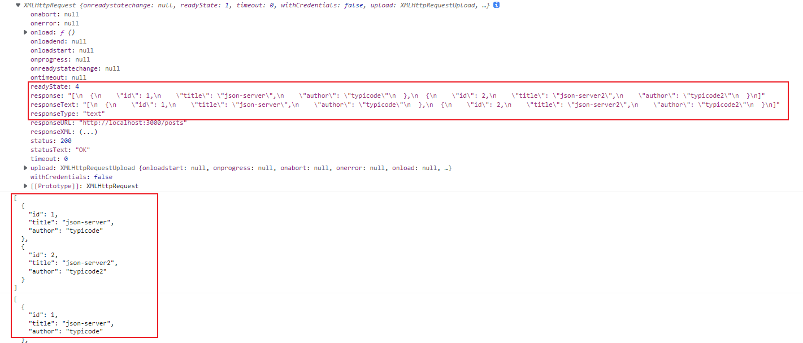

### `XMLHttpRequest.responseType`

一个用于定义响应类型的枚举值（enumerated value）。


[`XMLHttpRequest`](https://developer.mozilla.org/zh-CN/docs/Web/API/XMLHttpRequest) 属性 **`responseType`** 是一个枚举字符串值，用于指定响应中包含的数据类型。

它还允许作者更改响应类型。如果将 `responseType` 的值设置为空字符串，则会使用 `text` 作为默认值。

**语法**

```js
var type = XMLHttpRequest.responseType;

XMLHttpRequest.responseType = type;
```

**取值**

[Global_Objects/String](https://developer.mozilla.org/zh-CN/docs/Web/JavaScript/Reference/Global_Objects/String) 类型的值，指定响应包含的数据类型。它可以采用以下值：

- ""

  空的 responseType 字符串与默认类型 "text" 相同。

- "arraybuffer"

  [response](https://developer.mozilla.org/zh-CN/docs/Web/API/XMLHttpRequest/response) 是一个包含二进制数据的 JavaScript [ArrayBuffer](https://developer.mozilla.org/zh-CN/docs/Web/JavaScript/Reference/Global_Objects/ArrayBuffer)。

- "blob"

  [response](https://developer.mozilla.org/zh-CN/docs/Web/API/XMLHttpRequest/response) 是一个包含二进制数据的 [Blob](https://developer.mozilla.org/zh-CN/docs/Web/API/Blob) 对象。

- "document"

  [response](https://developer.mozilla.org/zh-CN/docs/Web/API/XMLHttpRequest/response) 是一个 [HTML](https://developer.mozilla.org/zh-CN/docs/Glossary/HTML) [Document](https://developer.mozilla.org/zh-CN/docs/Web/API/Document) 或 [XML](https://developer.mozilla.org/zh-CN/docs/Glossary/XML) [XMLDocument](https://developer.mozilla.org/zh-CN/docs/Web/API/XMLDocument)，根据接收到的数据的 MIME 类型而定。请参阅 [HTML in XMLHttpRequest](https://developer.mozilla.org/zh-CN/docs/Web/API/XMLHttpRequest/HTML_in_XMLHttpRequest) 中的 HTML，了解有关使用 XHR 获取 HTML 内容的更多信息。

- "json"

  [response](https://developer.mozilla.org/zh-CN/docs/Web/API/XMLHttpRequest/response) 是通过将接收到的数据内容解析为 [JSON](https://developer.mozilla.org/zh-CN/docs/Glossary/JSON) 而创建的 JavaScript 对象。

- "text"

  [response](https://developer.mozilla.org/zh-CN/docs/Web/API/XMLHttpRequest/response) 是 [DOMString](https://developer.mozilla.org/zh-CN/docs/Web/API/DOMString) 对象中的文本。

- "ms-stream" 

  [response](https://developer.mozilla.org/zh-CN/docs/Web/API/XMLHttpRequest/response) 是流式下载的一部分；此响应类型仅允许用于下载请求，并且仅受 Internet Explorer 支持。

> 将 responseType 设置为特定值时，作者应确保服务器实际发送的响应与该格式兼容。如果服务器返回的数据与设置的 responseType 不兼容，则 [response](https://developer.mozilla.org/zh-CN/docs/Web/API/XMLHttpRequest/response) 的值将为null .

### `XMLHttpRequest.responseURL`（只读）

只读属性XMLHttpRequest.responseURL返回响应的序列化 URL，如果 URL 为空则返回空字符串。如果 URL 有锚点，则位于 URL # 后面的内容会被删除。如果 URL 有重定向，responseURL 的值会是经过多次重定向后的最终 URL。

```js
var xhr = new XMLHttpRequest();
xhr.open('GET', 'http://example.com/test', true);
xhr.onload = function () {
  console.log(xhr.responseURL); // http://example.com/test
};
xhr.send(null);
```

### `XMLHttpRequest.responseXML` （只读）

XMLHttpRequest.responseXML 属性是一个只读值，它返回一个包含请求检索的 HTML 或 XML 的[Document](https://developer.mozilla.org/zh-CN/docs/Web/API/Document)，如果请求未成功，尚未发送，或者检索的数据无法正确解析为 XML 或 HTML，则为 null。默认是当作“text / xml” 来解析。当 [responseType](https://developer.mozilla.org/zh-CN/docs/Web/API/XMLHttpRequest/responseType) 设置为 “document” 并且请求已异步执行时，响应将被当作 “text / html” 来解析。responseXML 对于任何其他类型的数据以及 [data: URLs](https://developer.mozilla.org/en-US/docs/Web/HTTP/Basics_of_HTTP/Data_URLs) 为 null。

> responseXML 在这个属性的历史堪称神器，它可以同时在 HTML 和 XML 中工作

如果服务器没有明确指出 [Content-Type](https://developer.mozilla.org/zh-CN/docs/Web/HTTP/Headers/Content-Type) 头是 "text/xml" 还是 "application/xml", 你可以使用[XMLHttpRequest.overrideMimeType()](https://developer.mozilla.org/zh-CN/docs/Web/API/XMLHttpRequest/overrideMimeType) 强制 XMLHttpRequest 解析为 XML。

**值**

 [Document](https://developer.mozilla.org/zh-CN/docs/Web/API/Document) 中包含从 [XMLHttpRequest](https://developer.mozilla.org/zh-CN/docs/Web/API/XMLHttpRequest) 中收到的 HTML 节点或解析后的 XML 节点，也可能是在没有收到任何数据或数据类型错误的情况下返回的 null。

**例外**

InvalidStateError

[responseType](https://developer.mozilla.org/zh-CN/docs/Web/API/XMLHttpRequest/responseType) 既不是 "document" 也不是空字符串 (接收的数据应是 XML 或 HTML)。


```js
var xhr = new XMLHttpRequest();
xhr.open('GET', '/server', true);

// 如果已指明，responseType 必须是空字符串或 "document"
xhr.responseType = 'document';

// overrideMimeType() 用来强制解析 response 为 XML
xhr.overrideMimeType('text/xml');

xhr.onload = function () {
  if (xhr.readyState === xhr.DONE) {
    if (xhr.status === 200) {
      console.log(xhr.response);
      console.log(xhr.responseXML);
    }
  }
};

xhr.send(null);
```

### `XMLHttpRequest.status` （只读）

只读属性 XMLHttpRequest.status 返回了 XMLHttpRequest 响应中的数字状态码。status 的值是一个无符号短整型。在请求完成前，status 的值为 0。值得注意的是，如果 XMLHttpRequest 出错，浏览器返回的 status 也为 0。

status 码是标准的 [HTTP status codes](https://developer.mozilla.org/en-US/docs/Web/HTTP/Status)。举个例子，status 200 代表一个成功的请求。如果服务器响应中没有明确指定 status 码，XMLHttpRequest.status 将会默认为 200。

```js
var xhr = new XMLHttpRequest();
console.log('UNSENT', xhr.status);

xhr.open('GET', '/server', true);
console.log('OPENED', xhr.status);

xhr.onprogress = function () {
  console.log('LOADING', xhr.status);
};

xhr.onload = function () {
  console.log('DONE', xhr.status);
};

xhr.send(null);

/**
 * 输出如下：
 *
 * UNSENT（未发送）0
 * OPENED（已打开）0
 * LOADING（载入中）200
 * DONE（完成）200
 */

```

### `XMLHttpRequest.statusText` （只读）

只读属性 XMLHttpRequest.statusText 返回了XMLHttpRequest 请求中由服务器返回的一个[DOMString](https://developer.mozilla.org/en-US/docs/Web/API/DOMString) 类型的文本信息，这则信息中也包含了响应的数字状态码。不同于使用一个数字来指示的状态码[XMLHTTPRequest.status](https://developer.mozilla.org/en-US/docs/Web/API/XMLHTTPRequest/status)，这个属性包含了返回状态对应的文本信息，例如"OK"或是"Not Found"。如果请求的状态[readyState](https://developer.mozilla.org/en-US/docs/Web/API/XMLHttpRequest/readyState)的值为"UNSENT"或者"OPENED"，则这个属性的值将会是一个空字符串。

如果服务器未明确指定一个状态文本信息，则statusText的值将会被自动赋值为"OK"。

```js
var xhr = new XMLHttpRequest();
console.log('0 UNSENT', xhr.statusText);

xhr.open('GET', '/server', true);
console.log('1 OPENED', xhr.statusText);

xhr.onprogress = function () {
  console.log('3 LOADING', xhr.statusText);
};

xhr.onload = function () {
  console.log('4 DONE', xhr.statusText);
};

xhr.send(null);

/**
 * 输出如下：
 *
 * 0 UNSENT
 * 1 OPENED
 * 3 LOADING OK
 * 4 DONE OK
 */

```

### `XMLHttpRequest.timeout` 

XMLHttpRequest.timeout 是一个无符号长整型数，代表着一个请求在被自动终止前所消耗的毫秒数。默认值为 0，意味着没有超时。超时并不应该用在一个 [document environment](https://developer.mozilla.org/zh-CN/docs/Glossary/document_environment) 中的同步 XMLHttpRequests 请求中，否则将会抛出一个 InvalidAccessError 类型的错误。当超时发生， [timeout](https://developer.mozilla.org/zh-CN/docs/Web/API/XMLHttpRequest/timeout_event) 事件将会被触发。

在 IE 中，超时属性可能只能在调用 [open()](https://developer.mozilla.org/zh-CN/docs/Web/API/XMLHttpRequest/open) 方法之后且在调用 [send()](https://developer.mozilla.org/zh-CN/docs/Web/API/XMLHttpRequest/send) 方法之前设置。

```js
var xhr = new XMLHttpRequest();
xhr.open('GET', '/server', true);

xhr.timeout = 2000; // 超时时间，单位是毫秒

xhr.onload = function () {
  // 请求完成。在此进行处理。
};

xhr.ontimeout = function (e) {
  // XMLHttpRequest 超时。在此做某事。
};

xhr.send(null);
```

### `XMLHttpRequest.upload` 

XMLHttpRequest.upload 属性返回一个 XMLHttpRequestUpload对象，用来表示上传的进度。这个对象是不透明的，但是作为一个[XMLHttpRequestEventTarget](https://developer.mozilla.org/zh-CN/docs/Web/API/XMLHttpRequestEventTarget)，可以通过对其绑定事件来追踪它的进度。

可以被绑定在 upload 对象上的事件监听器如下：

| 事件        | 相应属性的信息类型               |
| ----------- | -------------------------------- |
| onloadstart | 获取开始                         |
| onprogress  | 数据传输进行中                   |
| onabort     | 获取操作终止                     |
| onerror     | 获取失败                         |
| onload      | 获取成功                         |
| ontimeout   | 获取操作在用户规定的时间内未完成 |
| onloadend   | 获取完成（不论成功与否）         |

## 事件处理器

作为 XMLHttpRequest 实例的属性之一，所有浏览器都支持 onreadystatechange。

后来，许多浏览器实现了一些额外的事件（onload、onerror、onprogress 等）。详见[Using XMLHttpRequest](https://developer.mozilla.org/zh-CN/docs/Web/API/XMLHttpRequest/Using_XMLHttpRequest)。

更多现代浏览器，包括 Firefox，除了可以设置 on* 属性外，也提供标准的监听器 [addEventListener()](https://developer.mozilla.org/zh-CN/docs/Web/API/EventTarget/addEventListener) API 来监听XMLHttpRequest 事件。

## 方法

### `XMLHttpRequest.abort()`

如果该请求已被发出，XMLHttpRequest.abort() 方法将终止该请求。当一个请求被终止，它的  [readyState](https://developer.mozilla.org/zh-CN/docs/Web/API/XMLHttpRequest/readyState) 将被置为 XMLHttpRequest.UNSENT (0)，并且请求的 [status](https://developer.mozilla.org/zh-CN/docs/Web/API/XMLHttpRequest/status) 置为 0。

**语法**：

```js
xhrInstance.abort();
```

**参数**：无。
**返回值**：`undefined`

```js
var xhr = new XMLHttpRequest(),
    method = "GET",
    url = "https://developer.mozilla.org/";
xhr.open(method, url, true);

xhr.send();

if (OH_NOES_WE_NEED_TO_CANCEL_RIGHT_NOW_OR_ELSE) {
  xhr.abort();
}
```

### `XMLHttpRequest.getAllResponseHeaders()`

XMLHttpRequest.getAllResponseHeaders() 方法返回所有的响应头，以 [CRLF](https://developer.mozilla.org/zh-CN/docs/Glossary/CRLF) 分割的字符串，或者 null 如果没有收到任何响应。 注意： 对于复合请求（ multipart requests ），这个方法返回当前请求的头部，而不是最初的请求的头部。

**语法**：

```js
var headers = XMLHttpRequest.getAllResponseHeaders();
```

**参数**：无
**返回值**：一个原始的 Header 头例子：

```
date: Fri, 08 Dec 2017 21:04:30 GMT\r\n
content-encoding: gzip\r\n
x-content-type-options: nosniff\r\n
server: meinheld/0.6.1\r\n
x-frame-options: DENY\r\n
content-type: text/html; charset=utf-8\r\n
connection: keep-alive\r\n
strict-transport-security: max-age=63072000\r\n
vary: Cookie, Accept-Encoding\r\n
content-length: 6502\r\n
x-xss-protection: 1; mode=block\r\n

```

每一行通过\r\n来进行分割。


```js
var request = new XMLHttpRequest();
request.open("GET", "foo.txt", true);
request.send();

request.onreadystatechange = function() {
  if(this.readyState == this.HEADERS_RECEIVED) {

    // Get the raw header string
    var headers = request.getAllResponseHeaders();

    // Convert the header string into an array
    // of individual headers
    var arr = headers.trim().split(/[\r\n]+/);

    // Create a map of header names to values
    var headerMap = {};
    arr.forEach(function (line) {
      var parts = line.split(': ');
      var header = parts.shift();
      var value = parts.join(': ');
      headerMap[header] = value;
    });
  }


```

上面的代码执行后，你可以：

```js
var contentType = headerMap["content-type"];
```


上面的变量 contentType 可以获取到 HTTP header 里的 content-type 字段值。

### `XMLHttpRequest.getResponseHeader()`

XMLHttpRequest.getResponseHeader()方法返回包含指定响应头文本的字符串。

如果在返回的响应头中有多个一样的名称，那么返回的值就会是用逗号和空格将值分隔的字符串。getResponseHeader() 方法以 UTF 编码返回值。搜索的报文名是不区分大小写的。

**语法**

```js
var myHeader = XMLHttpRequest.getResponseHeader(name);
```

**参数**

- name
  - 一个字符串，表示要返回的报文项名称。

**返回值**
报文项值，如果连接未完成，响应中不存在报文项，或者被 W3C 限制，则返回 null。

```js
var client = new XMLHttpRequest(); //新建 XMLHttpRequest 对象。
client.open("GET", "somefile.txt", true); // 采用异步，GET 方式获取 somefile.txt。
client.send(); // 发送空的 query string。
client.onreadystatechange = function() { //设定侦听器 onreadystatechange。
  if(this.readyState == this.HEADERS_RECEIVED) { // 如果 readyState 表示响应头已返回
    var contentType=client.getResponseHeader("Content-Type")); // 将此连接的 Content-Type 响应头项赋值到 contentType。
    if(contentType != my_expected_type) { // 如果这不是你的预期值
      client.abort(); // 终止连接
    }
  }
}
```

### `XMLHttpRequest.open()`

XMLHttpRequest.open() 方法初始化一个请求。该方法要从 JavaScript 代码使用；从原生代码初始化一个请求，使用 [openRequest()](https://developer.mozilla.org/en-US/docs/Mozilla/Tech/XPCOM/Reference/Interface/nsIXMLHttpRequest#openRequest()) 替代。

> 注意：为已激活的请求调用此方法（open()或openRequest() 已被调用）相当于调用abort()。

**语法**

```js
xhrReq.open(method, url);
xhrReq.open(method, url, async);
xhrReq.open(method, url, async, user);
xhrReq.open(method, url, async, user, password);
```

**参数**

- method
  要使用的 HTTP 方法，比如 GET、POST、PUT、DELETE、等。对于非 HTTP(S) URL 被忽略。

- url
  一个 DOMString 表示要向其发送请求的 URL。

- async 可选
  一个可选的布尔参数，表示是否异步执行操作，默认为 true。如果值为 false，send() 方法直到收到答复前不会返回。如果 true，已完成事务的通知可供事件监听器使用。如果 multipart 属性为 true 则这个必须为 true，否则将引发异常。

  > 注意：主线程上的同步请求很容易破坏用户体验，应该避免；实际上，许多浏览器已完全弃用主线程上的同步 XHR 支持。在 [Worker](https://developer.mozilla.org/zh-CN/docs/Web/API/Worker) 中允许同步请求

- user 可选

  可选的用户名用于认证用途；默认为 null。

- password 可选

  可选的密码用于认证用途，默认为 null。

### `XMLHttpRequest.overrideMimeType()`

XMLHttpRequest 的 overrideMimeType 方法是指定一个 MIME 类型用于替代服务器指定的类型，使服务端响应信息中传输的数据按照该指定 MIME 类型处理。例如强制使流方式处理为"text/xml"类型处理时会被使用到，即使服务器在响应头中并没有这样指定。此方法必须在 send 方法之前调用方为有效。

**语法**

```JS
XMLHttpRequest.overrideMimeType(mimeType)
```

**参数**：

- mimeType

  一个 DOMString 指定具体的 MIME 类型去代替有服务器指定的 MIME 类型. 如果服务器没有指定类型，那么 XMLHttpRequest 将会默认为 "text/xml".

**返回值**：undefined.


这个样例指定 Content-Type 为“text/plain",为接受的数据重写 ContentType

> Note: 如果服务器没有指定一个[Content-Type](https://developer.mozilla.org/en-US/docs/Web/HTTP/Headers/Content-Type) 头，[XMLHttpRequest](https://developer.mozilla.org/zh-CN/docs/Web/API/XMLHttpRequest) 默认 MIME 类型为"text/xml". 如果接受的数据不是有效的 XML，将会出现格”格式不正确“的错误。你能够通过调用 overrideMimeType() 指定各种类型来避免这种情况。

```js
// Interpret the received data as plain text

req = new XMLHttpRequest();
req.overrideMimeType("text/plain");
req.addEventListener("load", callback, false);
req.open("get", url);
req.send();

```

### `XMLHttpRequest.send()`

XMLHttpRequest.send() 方法用于发送 HTTP 请求。如果是异步请求（默认为异步请求），则此方法会在请求发送后立即返回；如果是同步请求，则此方法直到响应到达后才会返回。XMLHttpRequest.send() 方法接受一个可选的参数，其作为请求主体；如果请求方法是 GET 或者 HEAD，则应将请求主体设置为 null。

如果没有使用 [setRequestHeader()](https://developer.mozilla.org/zh-CN/docs/Web/API/XMLHttpRequest/setRequestHeader) 方法设置 [Accept](https://developer.mozilla.org/zh-CN/docs/Web/HTTP/Headers/Accept) 头部信息，则会发送带有 "* / *" 的[Accept](https://developer.mozilla.org/zh-CN/docs/Web/HTTP/Headers/Accept) 头部。

> Note: 请注意不要使用一个简单的 ArrayBuffer 对象作为参数，ArrayBuffer 已经不再是 AJAX 规范的一部分，请改用 ArrayBufferView（有关信息请参考兼容性列表。）

**语法**

```js
XMLHttpRequest.send(body)
```

**参数**

- body 可选

  - 在 XHR 请求中要发送的数据体. 可以是：

    - 可以为 Document, 在这种情况下，它在发送之前被序列化。

    - 为 XMLHttpRequestBodyInit, 从 per the Fetch spec （规范中）可以是 Blob, BufferSource (en-US), FormData, URLSearchParams, 或者 

      USVString 对象。

    - null

  - 如果 body 没有指定值，则默认值为 null .

**返回值**：undefined.

例外

| Exception         | Description                                                  |
| ----------------- | ------------------------------------------------------------ |
| InvalidStateError | send() has already been invoked for the request, and/or the request is complete. |
| NetworkError      | The resource type to be fetched is a Blob, and the method is not GET. |

```js
XMLHttpRequest.send();
XMLHttpRequest.send(ArrayBuffer data);
XMLHttpRequest.send(ArrayBufferView data);
XMLHttpRequest.send(Blob data);
XMLHttpRequest.send(Document data);
XMLHttpRequest.send(DOMString? data);
XMLHttpRequest.send(FormData data);

```


如果发送的数据是 Document 对象，需要在发送之前将其序列化。当发送一个 Document 对象时，Firefox 3 之前的版本都是使用 UTF-8 编码发送请求的；FireFox 3 则使用由 body.xmlEncoding 指定的编码格式正确的发送文档，但如果未指定编码格式，则使用 UTF-8 编码格式发送。

如果是一个 nsIInputStream 接口，它必须与 nsIUploadChannel 的 setUploadStream() 方法兼容。在这种情况下，将 Content-Length 的头部添加到请求中，它的值则使用 nsIInputStream 接口的 available() 方法获取。任何报头包括在数据流顶部的都会被当做报文主体。所以，应该在发送请求即调用 send() 方法之前使用[setRequestHeader()](https://developer.mozilla.org/zh-CN/docs/Web/API/XMLHttpRequest/send#setrequestheader()) 方法设置 Content-Type 头部来指定数据流的 MIME 类型。

发送二进制内容的最佳方法（如上传文件）是使用一个与 send() 方法结合的 [ArrayBufferView](https://developer.mozilla.org/en-US/docs/Web/JavaScript/Reference/Global_Objects/TypedArray) 或者 [Blobs](https://developer.mozilla.org/en-US/docs/Web/API/Blob)

**案例: GET**

```js
var xhr = new XMLHttpRequest();
xhr.open('GET', '/server', true);

xhr.onload = function () {
   // 请求结束后，在此处写处理代码
};

xhr.send(null);
// xhr.send('string');
// xhr.send(new Blob());
// xhr.send(new Int8Array());
// xhr.send(document);

```

**案例: POST**

```js
var xhr = new XMLHttpRequest();
xhr.open("POST", '/server', true);

//发送合适的请求头信息
xhr.setRequestHeader("Content-type", "application/x-www-form-urlencoded");

xhr.onload = function () {
    // 请求结束后，在此处写处理代码
};
xhr.send("foo=bar&lorem=ipsum");
// xhr.send('string');
// xhr.send(new Blob());
// xhr.send(new Int8Array());
// xhr.send(document);

```

### `XMLHttpRequest.setRequestHeader()`

XMLHttpRequest.setRequestHeader() 是设置 HTTP 请求头部的方法。此方法必须在 [open()](https://developer.mozilla.org/zh-CN/docs/Web/API/XMLHttpRequest/open) 方法和 [send()](https://developer.mozilla.org/zh-CN/docs/Web/API/XMLHttpRequest/send) 之间调用。如果多次对同一个请求头赋值，只会生成一个合并了多个值的请求头。

如果没有设置 [Accept](https://developer.mozilla.org/zh-CN/docs/Web/HTTP/Headers/Accept) 属性，则此发送出[send()](https://developer.mozilla.org/zh-CN/docs/Web/API/XMLHttpRequest/send) 的值为此属性的默认值：*/*。

安全起见，有些请求头的值只能由 user agent 设置：[forbidden header names](https://developer.mozilla.org/zh-CN/docs/Glossary/Forbidden_header_name) 和[forbidden response header names (en-US)](https://developer.mozilla.org/en-US/docs/Glossary/Forbidden_response_header_name)。

> 自定义一些 header 属性进行跨域请求时，可能会遇到"not allowed by Access-Control-Allow-Headers in preflight response"，你可能需要在你的服务端设置 "Access-Control-Allow-Headers"。

**语法**

```js
myReq.setRequestHeader(header, value);
```

**参数**

- header
  - 属性的名称。
- value
  - 属性的值。

## 事件

### `XMLHttpRequest`: `abort event`

当一个请求终止时 abort 事件被触发，比如程序执行 [XMLHttpRequest.abort()](https://developer.mozilla.org/zh-CN/docs/Web/API/XMLHttpRequest/abort)。

| Bubbles                | No                                                           |
| ---------------------- | ------------------------------------------------------------ |
| Cancelable             | No                                                           |
| Interface              | [ProgressEvent](https://developer.mozilla.org/zh-CN/docs/Web/API/ProgressEvent) |
| Event handler property | [onabort](https://developer.mozilla.org/zh-CN/docs/conflicting/Web/API/XMLHttpRequest/abort_event) |

`html`

```html
<div class="controls">
    <input class="xhr success" type="button" name="xhr" value="Click to start XHR (success)" />
    <input class="xhr error" type="button" name="xhr" value="Click to start XHR (error)" />
    <input class="xhr abort" type="button" name="xhr" value="Click to start XHR (abort)" />
</div>

<textarea readonly class="event-log"></textarea>
```

`js`

```js
const xhrButtonSuccess = document.querySelector('.xhr.success');
const xhrButtonError = document.querySelector('.xhr.error');
const xhrButtonAbort = document.querySelector('.xhr.abort');
const log = document.querySelector('.event-log');

function handleEvent(e) {
    log.textContent = log.textContent + `${e.type}: ${e.loaded} bytes transferred\n`;
}

function addListeners(xhr) {
    xhr.addEventListener('loadstart', handleEvent);
    xhr.addEventListener('load', handleEvent);
    xhr.addEventListener('loadend', handleEvent);
    xhr.addEventListener('progress', handleEvent);
    xhr.addEventListener('error', handleEvent);
    xhr.addEventListener('abort', handleEvent);
}

function runXHR(url) {
    log.textContent = '';

    const xhr = new XMLHttpRequest();
    addListeners(xhr);
    xhr.open("GET", url);
    xhr.send();
    return xhr;
}

xhrButtonSuccess.addEventListener('click', () => {
    runXHR('https://mdn.mozillademos.org/files/16553/DgsZYJNXcAIPwzy.jpg');
});

xhrButtonError.addEventListener('click', () => {
    runXHR('https://somewhere.org/i-dont-exist');
});

xhrButtonAbort.addEventListener('click', () => {
    runXHR('https://mdn.mozillademos.org/files/16553/DgsZYJNXcAIPwzy.jpg').abort();
});
```

### `XMLHttpRequest: error 事件`

当请求遇到错误时，将触发error 事件。

| 可冒泡           | No                                                           |
| ---------------- | ------------------------------------------------------------ |
| 可取消           | No                                                           |
| 接口             | [ProgressEvent](https://developer.mozilla.org/zh-CN/docs/Web/API/ProgressEvent) |
| 事件处理程序属性 | [onerror](https://developer.mozilla.org/zh-CN/docs/conflicting/Web/API/XMLHttpRequest/error_event) |

### `XMLHttpRequest: load event`

当一个[XMLHttpRequest](https://developer.mozilla.org/zh-CN/docs/Web/API/XMLHttpRequest)请求完成的时候会触发load 事件。

| Bubbles                | No                                                           |
| ---------------------- | ------------------------------------------------------------ |
| Cancelable             | No                                                           |
| Interface              | [ProgressEvent](https://developer.mozilla.org/zh-CN/docs/Web/API/ProgressEvent) |
| Event handler property | [onload](https://developer.mozilla.org/zh-CN/docs/conflicting/Web/API/XMLHttpRequest/load_event) |

### `loadend`

loadend 事件总是在一个资源的加载进度停止之后被触发 (例如，在已经触发 “error”，“abort” 或 “load” 事件之后)。这适用于 `XMLHttpRequest` 调用，以及 ` `或` <video> `之类元素的内容。

### `loadstart`

当程序开始加载时，loadstart 事件将被触发。这个事件可以被 `XMLHttpRequest` 调用，也适用于 ` `和 `<video>` 元素。

### `progress event`

progress事件会在请求接收到数据的时候被周期性触发。

| Bubbles                | No                                                           |
| ---------------------- | ------------------------------------------------------------ |
| Cancelable             | No                                                           |
| Interface              | [ProgressEvent](https://developer.mozilla.org/zh-CN/docs/Web/API/ProgressEvent) |
| Event handler property | [onprogress](https://developer.mozilla.org/zh-CN/docs/conflicting/Web/API/XMLHttpRequest/progress_event) |

### `timeout`

当进度由于预定时间到期而终止时，会触发timeout 事件。

| 冒泡     | 否                                                           |
| -------- | ------------------------------------------------------------ |
| 可取消   | 否                                                           |
| 目标对象 | [XMLHttpRequest](https://developer.mozilla.org/zh-CN/docs/Web/API/XMLHttpRequest) |
| 接口     | [ProgressEvent](https://developer.mozilla.org/zh-CN/docs/Web/API/ProgressEvent) |

```js
var client = new XMLHttpRequest()
  client.open("GET", "http://www.example.org/example.txt")
  client.ontimeout = function(e) {
    console.error("Timeout!!")
  }
  client.send()
```


## 同步和异步请求

[同步和异步请求 - Web API 接口参考 | MDN (mozilla.org)](https://developer.mozilla.org/zh-CN/docs/Web/API/XMLHttpRequest/Synchronous_and_Asynchronous_Requests)

`XMLHttpRequest` 支持同步和异步通信。但是，一般来说，出于性能原因，异步请求应优先于同步请求。

同步请求阻止代码的执行，这会导致屏幕上出现“冻结”和无响应的用户体验。

### 异步请求

如果你使用`XMLHttpRequest`发送异步请求，那么当请求的响应数据完全收到之时，会执行一个指定的回调函数，而在执行异步请求的同时，浏览器会正常地执行其他事务的处理。

## 2.0新特性

- 可以上传文件
- 可以设置`HTTP`请求的时限
- 可以使用`FormDataa`对象管理表单数据
- 可以请求不同域名下的数据（跨域请求）
- 可以获取服务端的二进制数据
- 可以获取数据传输的进度信息


应用：

- 进行大文件的断点续传，兼容性好

# `AJAX`

**AJAX**（Asynchronous [JavaScript](https://developer.mozilla.org/zh-CN/docs/Glossary/JavaScript) And [XML](https://developer.mozilla.org/zh-CN/docs/Glossary/XML) ）是一种使用 [XMLHttpRequest](https://developer.mozilla.org/zh-CN/docs/Glossary/XHR_(XMLHttpRequest)) 技术构建更复杂，动态的网页的编程实践。

AJAX 允许只更新一个 [HTML](https://developer.mozilla.org/zh-CN/docs/Glossary/HTML) 页面的部分 [DOM](https://developer.mozilla.org/zh-CN/docs/Glossary/DOM)，而无须重新加载整个页面。AJAX 还允许异步工作，这意味着当网页的一部分正试图重新加载时，您的代码可以继续运行（相比之下，同步会阻止代码继续运行，直到这部分的网页完成重新加载）。

通过交互式网站和现代 Web 标准，AJAX 正在逐渐被 JavaScript 框架中的函数和官方的 [`Fetch API`](https://developer.mozilla.org/zh-CN/docs/Web/API/Fetch_API) 标准取代。

# `Axios`_教程二

来源：https://www.bilibili.com/video/BV1NJ41197u6?p=1

## 1.`Http`相关

### 1.1.`MDN`文档

[HTTP | MDN (mozilla.org)](https://developer.mozilla.org/zh-CN/docs/Web/HTTP)

这个页面的每个点都可以过一下，大概花一个多小时

- [HTTP 概述](https://developer.mozilla.org/zh-CN/docs/Web/HTTP/Overview)
- [HTTP 缓存](https://developer.mozilla.org/zh-CN/docs/Web/HTTP/Caching)
- [HTTP Cookie](https://developer.mozilla.org/zh-CN/docs/Web/HTTP/Cookies)
- [跨域资源共享（CORS）](https://developer.mozilla.org/zh-CN/docs/Web/HTTP/CORS)
- [HTTP 的演变](https://developer.mozilla.org/zh-CN/docs/Web/HTTP/Basics_of_HTTP/Evolution_of_HTTP)
- [Mozilla Web 安全准则](https://wiki.mozilla.org/Security/Guidelines/Web_Security)
- [HTTP 消息](https://developer.mozilla.org/zh-CN/docs/Web/HTTP/Messages)
- [典型的 HTTP 会话](https://developer.mozilla.org/zh-CN/docs/Web/HTTP/Session)
- [HTTP/1.x 中的连接管理](https://developer.mozilla.org/zh-CN/docs/Web/HTTP/Connection_management_in_HTTP_1.x)

- [浏览器的工作原理](https://www.html5rocks.com/en/tutorials/internals/howbrowserswork/)
  - 一篇非常全面的关于浏览器内部实现与通过 HTTP 协议的请求流的文章。可以说是所有 Web 开发者的**必读内容**。

### 1.2.`HTTP`请求交互的基本过程

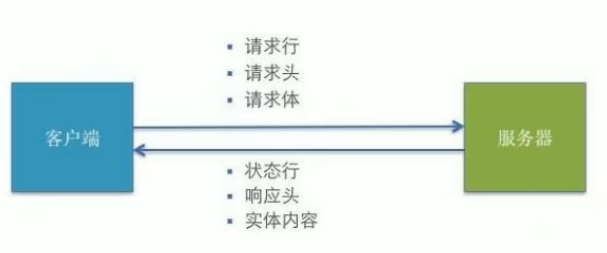

- 前台应用从浏览器端向服务器发送`HTTP`请求（请求报文）
- 后台服务器接收到请求后，调度服务器应用处理请求，向浏览器端返回`HTTP`响应（响应报文）
- 浏览器接收到响应，解析显示响应体/调用监视回调

浏览器要发`ajax`请求，有两种方式

- `XHR`对象

- `Fetch`函数：浏览器自己实现了

  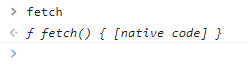

### 1.3.`HTTP`请求报文

请求报文的组成

- 请求行

  - 请求方式
  - 请求地址

  ```
  method url 
  GET /product_detail?id=2
  POST /login
  ```

- 多个请求头

  ```
  Host:www.baidu.com
  Cookie:BAIDUID=AD808SFH8;BIDUPSID=SHKJ88DS;
  Content-Type:application/x-wwww-form-urlencoded 或者 application/json 
  ```

- 请求体

  - 不同的参数类型，要告诉服务器具体的`Content-Type`

  ```
  username=tom&pwd=123
  {"username":"tom","pwd":123}
  ```

  

### 1.4.`HTTP`响应报文

- 响应状态行

  ```
  status statusText
  ```

- 多个响应头

  ```
  Content-Type:text/html;charset=8
  set-Cookie:BD_CK_SAM;path=/
  ```

- 响应体

  ```
  html 文本/json 文本/js/css/图片
  ```

  

### 1.5.`POST`请求体参数格式

- `Content-Type:application/x-www-form-urlencoded;charset=utf-8`
  - 用于键值对参数，参数的键值用`=`连接，参数之间用`&`连接
  - 例如：`name=%3D%6D%9U&age=12`
- `Content-Type:application/json;charset=utf-8`
  - 用于`json`字符串参数
  - 例如：`{"name":"sai","age":12}`
- `Content-Type:multipart/form-data`
  - 用于文件上传

### 1.6.常见的响应状态码

每个状态码对应的文本是固定的

```
200 OK 请求成功。一般用于GET和POST请求
201 Created 已创建。成功请求并创建了新的资源
401 Unauthorized 未授权/请求要求用户的身份认证
404 Not Found 服务器无法根据客户端的请求找到资源
500 Internal Server Error 服务器内部错误，无法完成请求
```

### 1.7.不同类型的请求及其作用

- `GET`：从服务器读取数据
- `POST`：向服务器添加新数据
- `PUT`：更新服务器端已有数据
- `DELETE`：删除服务器端数据


### 1.8.`API`的分类

- `REST API`：`restful`
  - 发送请求进行`CURD`那个操作由请求方式来决定
  - 同一个请求路径可以进行多个操作
  - 请求方式会用到`GET/POST/PUT/DELETE`
- 非`REST API`：`restless`
  - 请求方式不决定请求的`CURD`操作
  - 一个请求路径只对应一个操作
  - 一般只有`GET/POST`


### 1.9.`json-server`搭建`REST`接口

#### 1.9.1.`json-server`是什么

可以30秒快速搭建`REST`接口

https://github.com/typicode/json-server

#### 1.9.2.使用`json-server`

新建目录`json-server`，安装包

```
npm install json-server -D
```

目录下新建`src/db.json`

```
{
  "posts": [
    { "id": 1, "title": "json-server", "author": "typicode" }
  ],
  "comments": [
    { "id": 1, "body": "some comment", "postId": 1 }
  ],
  "profile": { "name": "typicode" }
}
```

运行

```
 npx json-server --watch ./src/db.json
```

#### 1.9.3.使用浏览器访问测试

根据提示打开浏览器

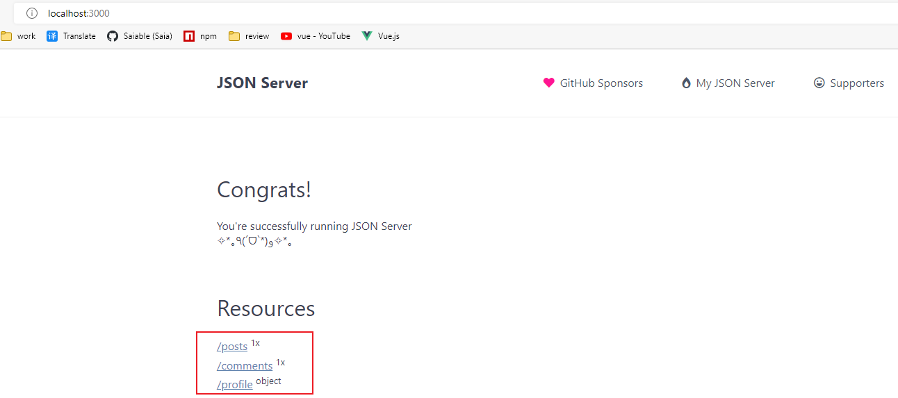

我们给数据源新增条数据，说明`GET`请求的`params`参数和`query`参数的区别

`db.json`

```json
{
  "posts": [
    { "id": 1, "title": "json-server", "author": "typicode" },
    { "id": 2, "title": "json-server2", "author": "typicode2" }
  ],
  "comments": [
    { "id": 1, "body": "some comment", "postId": 1 }
  ],
  "profile": { "name": "typicode" }
}
```

使用`params`参数查询数据1，返回的是一个新的对象

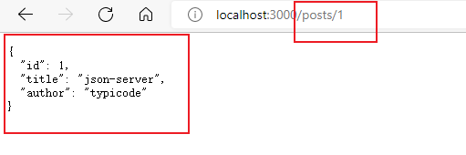

使用`query`参数查询数据1，返回的是根据参数过滤后的数据，仍然是一个数组

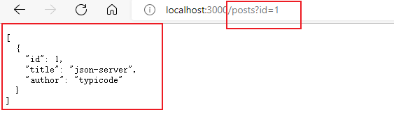

#### 1.9.4.使用`axios`访问测试

使用`axios`在线库：

```
https://cdn.bootcdn.net/ajax/libs/axios/0.27.2/axios.min.js
```

##### 测试`GET`请求

`index.html`

```html
<!DOCTYPE html>
<html>
	<head>
		<meta charset="utf-8">
		<title></title>
	</head>
	<body>
		<button onclick="testGET()">GET请求</button>
		<button onclick="testPOST()">POST请求</button>
		<button onclick="testPUT()">PUT请求</button>
		<button onclick="testDELETE()">DELETE请求</button>
	</body>
	<script src="https://cdn.bootcdn.net/ajax/libs/axios/0.27.2/axios.min.js"></script>
	<script>
		function testGET() {
			axios
				.get('http://localhost:3000/posts')
				.then(respose => {
					console.log('/posts get', respose.data)
				})
		}
	</script>
</html>
```


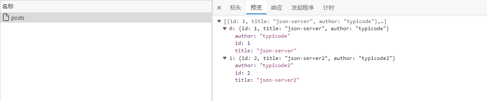

使用`params`参数

```js
		function testGET() {
			axios
				.get('http://localhost:3000/posts/1')
				.then(respose => {
					console.log('/posts get', respose.data)
				})
		}
```

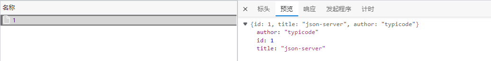

使用`query`参数

```js
		function testGET() {
			axios
				.get('http://localhost:3000/posts?id=2')
				.then(respose => {
					console.log('/posts get', respose.data)
				})
		}
```

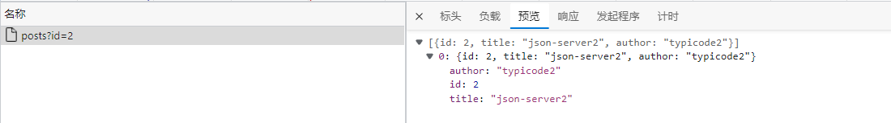

##### 测试`POST`请求

```js
		function testPOST() {
			axios
				.post(
					'http://localhost:3000/posts',
					{"title": "json-server3", "author": "typicode3" }
				)
				.then(response => {
					console.log('/posts post', response.data)
				})
		}
```

注意，新插入的数据中心，不用写`id`字段

结果：`db.json`中真被写入了一条数据

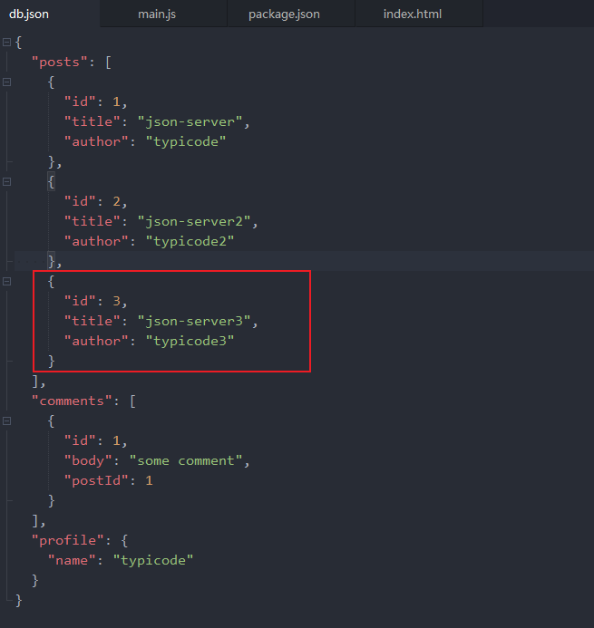

##### 测试`PUT`请求

`PUT`请求要具体到某一条数据中，同时也不要写`id`字段

```js
		function testPUT() {
			axios
				.put(
					'http://localhost:3000/posts/3',
					{"title": "json-server3-put", "author": "typicode3-put" }
				)
				.then(response => {
					console.log('/posts put', response.data)
				})
		}
```

更新某一条数据，结果如下

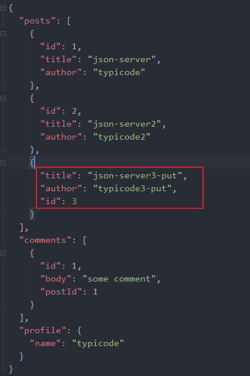

##### 测试`DELETE`请求

不需要携带参数，直接请求删除的某一条具体的数据，需要携带参数

```js
		function testDELETE() {
			axios
				.delete(
					'http://localhost:3000/posts/3'
				)
				.then(response => {
					console.log('/posts delete', response.data)
				})
		}
```

只有两条数据了

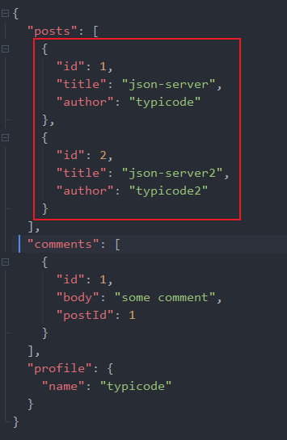

## 2.`XHR`的理解和使用

### 2.1.`MDN`文档

https://developer.mozilla.org/zh-CN/docs/Web/API/XMLHttpRequest

### 2.2.理解

- 使用`XMLHttpRequest(XHR)`对象可以与服务器进行交互，也就是发送`ajax`请求
- 前端可以获取到数据，而无需让整个页面刷新
- 这使得`web`页面可以只更新页面的布局，而不影响用户的操作

### 2.3.区别一般`http`请求和`ajax`请求

- `ajax`请求是一种特别的`http`请求
- 对服务器端来说，没有任何区别，区别在于浏览器
- 浏览器端发请求，只有`XHR`或`fetch`发出的才是`ajax`请求，其他所有的都是非`ajax`请求
- 浏览器端接受到响应
  - 一般请求：浏览器一般会直接显示响应体数据，也就是我们常说的刷新/跳转页面
  - `ajax`请求：浏览器不会对页面进行任何更新操作，只是调用监视的回调函数并传入响应相关数据

### 2.4`API`

https://developer.mozilla.org/zh-CN/docs/Web/API/XMLHttpRequest

- `XMLHttpRequest()`：创建`XHR`对象的构造函数
- `status`：响应状态码，比如200、204
- `status Text`：响应状态文本
- `readyState`：标识请求状态的只读属性
  - 0：初始
  - 1：`open()`之后
  - 2：`send()`之后
  - 3：请求中
  - 4：请求完成
    - 请求完成不代表请求成功
    - 请求完成后，需要再判定状态码
- `onreadstatechange`：绑定`readyState`改变的监听
- `responseType`：指定响应数据类型，如果是`json`，得到响应后的自动解析响应
- `response`：响应体数据，类型取决于`responseType`的指定
- `timeout`：指定请求超时时间，默认为0代表没有限制
- `ontimeout`：绑定超时的监听
- `onerror`：绑定请求网络错误的监听
- `open()`：初始化一个请求，参数为:`(method, url [, async])`
- `send(data)`：发送请求
  - 如果是同步请求，该方法会立即被执行
- `abort()`：中断请求
  - 请求已经发出去了
- `getResponseHeader(name)`：获取指定名称的响应头值
- `getAllResponseHeaders()`：获取所有响应头组成的字符串
- `setRequestHeader(name, value)`：设置请求头

### 2.5.`XHR`的`ajax`封装（简单版`axios`）

#### 2.5.1.特点

- 函数的返回值为`promise`，成功的结果为`response`，异常的结果为`error`

- 能处理多种类型的请求：`GET/POST/PUT/DELETE`

- 函数的参数为一个配置对象

  ```js
  {
      url: '', //请求地址
      method: '', // 请求方法
      params: {}, // GET/DELETE请求的query参数
      data: {}, // POST或DELETE请求的请求体参数
  }
  ```

- 响应`json`数据自动解析为`js`


当我们知道一个函数的某些特点后，能够自己封装函数实现这些特点，是一项必备的能力

#### 2.5.2.编码实现

**参数：**

- `url`是必填项
- 其他配置项可以给定一个默认值

```js
function axios({
	url,
	method='GET',
	params={},
	data={}
}) {
	
}
```

**返回值：**

- 返回值是一个`Promise`
- `Promsie`内部
  - 执行异步`ajax`请求
    - 创建`xhr`对象
    - 打开连接（初始化请求，还没有请求）
    - 发送请求
  - 如果请求成功了，调用`resolve()`
  - 如果请求失败了，调用`reject()`

```js
function axios({
	url,
	method='GET',
	params={},
	data={}
}) {
	return new Promsise((resolve, reject) => {
		
	})
}
```

**使用测试**

```html
<!DOCTYPE html>
<html>
	<head>
		<meta charset="utf-8">
		<title></title>
	</head>
	<body>
		<button onclick="testGET()">GET请求</button>
		<button onclick="testPOST()">POST请求</button>
		<button onclick="testPUT()">PUT请求</button>
		<button onclick="testDELETE()">DELETE请求</button>
		
		<script src="./js/axios.js"></script>
		<script>
			
			// console.log(new axios({url:'http://localhost:3000/posts'}))
			function testGET() {
				axios({
					url: 'http://localhost:3000/posts',
					method: 'GET'
				})
			}
		</script>
	</body>
</html>
```

结果：

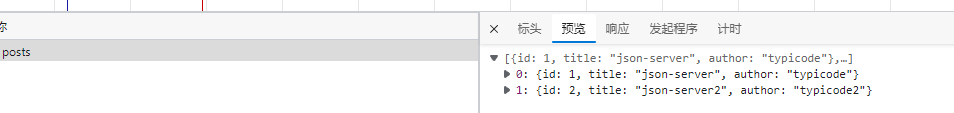

**完善参数：**

- `data`可以是`json`类型的字符串，也可以是`urlencoding`类型的字符串

  - `json`格式需要使用`JSON.stringify(data)`，同时需要添加请求头：`application/json;charset=utf-8`
  - 注意，有的后台只支持`urlencoding`格式的请求体参数，但我们这里的`json-server`是都支持的

- `post`请求发送`json`数据的逻辑完善

  `axios.js`

  ```js
  function axios({
  	url,
  	method='GET',
  	params={},
  	data={}
  }) {
  	return new Promise((resolve, reject) => {
  		const request = new XMLHttpRequest()
  		request.open(method, url, true)
  		
  		if(method === 'GET') {
  			request.send(null)
  		} else if(method === 'POST') {
  			request.setRequestHeader('Content-Type', 'application/json;charset=utf-8')
  			request.send(JSON.stringify(data))
  		}
  	})
  }
  ```

  `index.html`

  ```js
  <!DOCTYPE html>
  <html>
  	<head>
  		<meta charset="utf-8">
  		<title></title>
  	</head>
  	<body>
  		<button onclick="testGET()">GET请求</button>
  		<button onclick="testPOST()">POST请求</button>
  		<button onclick="testPUT()">PUT请求</button>
  		<button onclick="testDELETE()">DELETE请求</button>
  		
  		<script src="./js/axios.js"></script>
  		<script>
  			
  			console.log(new axios({url:'http://localhost:3000/posts'}))
  
  			function testPOST() {
  				axios({
  					url: 'http://localhost:3000/posts',
  					method: 'POST',
  					data: {
  						id: 3,
  						title: 'axios-post',
  						author: 'axios'
  					}
  				})
  			}
  		</script>
  	</body>
  </html>
  ```

  结果，新增数据成功：

  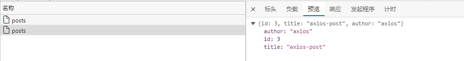

#### 2.5.3.使用测试

## 3.`axios`的理解和使用

- `axios`既可以通过`axois.get()`调用函数的方式发请求

- 也可以通过传入固定的配置对象来发请求

  ```js
  axios({
      method: 'post',
      url: '/user/12345'
      data: {
      	firstName: 'Fred',
      	lastName: 'Flintstone'
  	}
  })
  ```


### 3.1.`axios`是什么


### 3.2.`axios`特点


### 3.3.`axios`常用特点


### 3.4.难点语法的理解和使用

#### 3.4.1.`axios.create(ocnfig)`


#### 3.4.2.拦截器函数/`ajax`请求


#### 3.4.3.取消请求

## 4.`axios`源码分析

# `Axios`_教程一（基本使用和封装）

官网：

github：

## 网络请求模块的选择-axios

Vue中发送网络请求有非常多的方式

- 方式一：传统的Ajax是基于XMLHttpResponse(XHR)
  - 为什么不用它呢？
    - 配置和调用方式等非常的混乱
    - 编码起来看起来就非常蛋疼
    - 很少直接使用，而是用jQuery-Ajax
- 方式二：jQuery-Ajax
  - 为什么不用它呢？
    - 首先，我们先明确一点，在整个Vue开发中，都是不需要使用jQuery的
    - 完全没有必要，只是为了一个网络请求，就引入jQuery
- 选择三：官方在Vue1.x的时候，推出了Vue-resource
  - 在Vue2.0推出后，Vue作者在Issues中说明，去掉了Vue-resource，并且以后也不再更新
- 选择四：axios
  - Vue作者推荐


在前端开发中，我们一种常见的网络请求方式就是JSONP

- 使用JSONP最主要的原因，往往是为了解决跨域访问的问题

JSONP的原理是什么呢？

- JSONP的核心在于通过`<script>`标签的src来帮助我们请求数据
- 原因是我们的项目部署在domain1.com服务器上时，是不能直接访问domain2.com服务器上的资料的
- 这个时候，我们利用`<script>`标签的src帮助我们去服务器请求到数据，将数据当做一个javascript函数来执行，并且执行的过程中传入我们需要的json
- 所以，封装jsonp的核心就在于我们监听window上的jsonp进行回调的名称

## 为什么选择AXIOS？

- 在浏览器中发送XMLHttpRequest请求
- 在node.js中发送http请求
- 支持Promise API
- 拦截请求和相应
- 转换请求和相应数据
- 等等

## axios框架的基本使用

- 支持多种请求方式
- axios(config)
- axios.request(url, config)
- axios.get(url[,config])
- axios.delete(url[,config])
- axios.head(url[,config])
- axios.post(url[,data[,config]])
- axios.put(url[,data[,config]])
- axios.patch(url[,data[,config]])

安装axios：

```
npm install axios@0.18.0 --save
```

基本使用

main.js中导入：

```javascript
import axios from 'axios'
```

get请求

```javascript
axios({
  url:'http://152.136.185.210:7878/api/m5/home/multidata',
  method:'get'
}).then(res => {
  console.log(res)
})
```

get请求携带参数

```javascript
axios({
    url:'http://152.136.185.210:7878/home/data',
    params: {
        type: 'pop',
        page: 1
    }
}).then(res => {
    console.log(res)
})
```

## axios发送并发请求

```javascript
axios.all([axios(), axios()]).then(results => {

})
```


```javascript
axios.all([
  axios({
    url: 'http://152.136.185.210:7878/api/m5/home/multidata'
  }),
  axios({
    url:'http://152.136.185.210:7878/home/data',
    params: {
      type: 'pop',
      page: 1
    }
  })
]).then(results => {
  console.log(results)
  console.log(results[0])
})
```

将两个结果单独的拿出来：

```javascript
axios.all([
  axios({
    url: 'http://152.136.185.210:7878/api/m5/home/multidata'
  }),
  axios({
    url:'http://152.136.185.210:7878/home/data',
    params: {
      type: 'pop',
      page: 1
    }
  })
]).then(axios.spread((res1, res2) => {
  console.log(res1)
  console.log(res2)
}))
```

## axios的配置信息相关

在上面的示例中，我们的BaseUrl是固定的

- 事实上，在开发中可能很多参数都是固定的
- 这个时候我们可以进行一些抽取，也可以利用axios的全局配置

```javascript
axios.defaults.baseURL = 'http://152.136.185.210:7878'
axios.defaults.headers.post['Content-Type']='application/x-www-form-urlencoded'

axios.all([
  axios({
    url: '/api/m5/home/multidata'
  }),
  axios({
    url:'http://152.136.185.210:7878/home/data',
    params: {
      type: 'pop',
      page: 1
    }
  })
]).then(axios.spread((res1, res2) => {
  console.log(res1)
  console.log(res2)
}))
```

常见的配置选项

- 请求地址
  - url:'/user',
- 请求类型
  - method:'get',
- 请根路径
  - baseURL:'http://www.test.com/api',
- 请求前的数据处理
  - transformRequest:[function(data){}],
- 请求后的数据处理
  - transformResponse:[function(data){}],
- 自定义的请求头
  - headers:{'x-Requested-With':'XMLHttpRequest'},
- URL查询对象
  - params:{id:12},
- 查询对象序列化函数
  - paramsSerializer:function(params){}
- request body
  - data:{key:'aa'},
- 超时设置s
  - timeout:1000,
- 跨域是否带Token
  - withCredentials:false,
- 自定义请求处理
  - adapter:function(resolve,reject,config){},
- 身份验证信息
  - auth:{uname:'',pwd:'12'}
- 响应式的数据格式json/blob/document/arrarybuffer/text/stream
  - responseType:'json'

## axios的实例和模块封装

当有多个请求接口时（在不同的服务器上），可以创建实例

```javascript
const instance1 = axios.create({
    baseURL: 'http://152.136.185.210:7878'
    timeout: 5000
})

instance1({
    url: '/home/multidata'
}).then(res => {
    console.log(res)
})

instance1({
    url: '/home/data',
    params: {
        type: 'pop',
        page: 1
    }
})
// 上两个请求用实例1

const instance2 = axios.create({
    baseURL: 'http://111.111.11.1:1111'
    timeout: 1111
})

// 实例2对应另外一个服务的接口，
// 每个实例有自己独立的配置
```


**axios的封装**

/network/request.js

```javascript
import axios from 'axios'

export function request(config, success, failure) {
    //1.创建axios的实例
    const instance = axios.create({
        baseURL: 'http://111.111.11.1:1111',
        timeout: 1111
    })

    // 发送真正的网络请求
    // 将结果给调用者传出去
    instance(config, success, failure)
        .then(res =>{ // 这里的res是Promise执行成功返回的结果
            success(res) // 将执行成功返回的结果传递出去
        })
        .catch(error =>){
            failure(err)
        }
}
```

在main.js中使用

```javascript
import {request} from './network/request'

request({
    url: '/home/multidata'
    
},res => { // 这里的res只是个形参
    console.log(res) // 拿到执行成功返回的结果
},err => {
    console.log(err)
})
```

另一种写法：对象的写法

request.js

```javascript
instance(config.baseConfig)
    .then(res => {
        config.success(res)
    })
    .catch(err => {
        config.faulure(err)
    })
```

main.js

相当于把所有的配置，放在了一个大的config里面

在request.js中，对于传递的参数做一个解析

```javascript
request({
    baseConfig: {

    },
    success: function(res) {

    },
    failure: function(err) {

    }
})
```

第三种写法：Promise

request.js

```javascript
export function request(config) {    
    return new Promise((resolve, reject) => {        
        const instance = axios.create({            
            baseURL: 'http://111.111.11.1:1111',            
            timeout: 1111        
        })
        
        instance(config)            
            .then(res => {                
            resolve(res)            
        })            
            .catch(err => {                
            reject(err)            
        })    
    })
}
```

main.js中使用

```javascript
request({    
    url:'/home/multidata'
}).then(res => {    
    console.log(res)})
.catch(err => {    
    console.log(err)
})
```

第四种写法:instance本身返回的就是Promise

request.js

```javascript
export function request(config) {
    return new Promise((resolve, reject) => {
        const instance = axios.create({
            baseURL: 'http://111.111.11.1:1111',
            timeout: 1111
        })
		// 直接return instance就可以了，其本身返回的就是Promise
        return instance(config)
    })
}
```

main.js中使用

```javascript
request({    
    url:'/home/multidata'
}).then(res => {    
    console.log(res)})
.catch(err => {    
    console.log(err)
})
```

## axios的拦截器的使用

- axios提供了拦截器，用于我们每次在发送请求或者得到相应的请求后，进行对应的处理
- 如何使用拦截器呢

```javascript
//配置请求拦截
instance.interceptors.request.use(config => {
    console.log('来到了request拦截success中')
    return config
},err => {
    console.log('来到了request拦截failure中')
    return err
})
```


```javascript
//配置响应拦截
instance.interceptors.reponse.use(response => {
    console.log('来到了response拦截success中')
    return response.data
},err => {
    console.log('来到了response拦截failure中')
    return err
})
```


# `Axios`使用的最佳实践

单独封装

# 使用问题

## 怎么设置单独的headers

## 对接`elementui`上传文件时，怎么封装

