---
title:ElementUI使用与解析

---
# ElementUI

> 版本：2.15.6
>
> 官方参考链接：https://element.eleme.io/#/zh-CN/component/installation

## 安装

```
npm i element-ui -S
```


如果网络超时，重新安装一遍

## 基本使用

### 完全引入（全量引入）

在 main.js 中写入以下内容：

```javascript
import Vue from 'vue';
import ElementUI from 'element-ui';
import 'element-ui/lib/theme-chalk/index.css';
import App from './App.vue';

Vue.use(ElementUI);

new Vue({
  el: '#app',
  render: h => h(App)
});
```

以上代码便完成了 Element 的引入。需要注意的是，样式文件需要单独引入。

### 按需引入（增量引入）

借助 [babel-plugin-component](https://github.com/QingWei-Li/babel-plugin-component)，我们可以只引入需要的组件，以达到减小项目体积的目的。

首先，安装 babel-plugin-component：

```bash
npm install babel-plugin-component -D
```

然后，将 .babelrc 修改为：

```json
{
  "presets": [["es2015", { "modules": false }]],
  "plugins": [
    [
      "component",
      {
        "libraryName": "element-ui",
        "styleLibraryName": "theme-chalk"
      }
    ]
  ]
}
```

接下来，如果你只希望引入部分组件，比如 Button 和 Select，那么需要在 main.js 中写入以下内容：

```javascript
import Vue from 'vue';
import { Button, Select } from 'element-ui';
import App from './App.vue';

Vue.component(Button.name, Button);
Vue.component(Select.name, Select);
/* 或写为
 * Vue.use(Button)
 * Vue.use(Select)
 */

new Vue({
  el: '#app',
  render: h => h(App)
});
```

### 在js文件中按需引入

```javascript
import {Message} from 'element-ui';

Message({
    message:'认证失效，请重新登录',
    type: 'warning'
})
```

## 使用解析

### `layout`布局

通过基础的 24 分栏，迅速简便地创建布局。

#### 基础布局

##### 官方案例

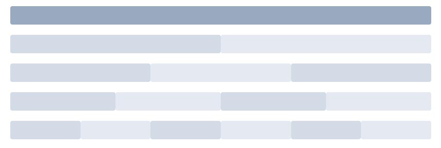

使用单一分栏创建基础的栅格布局。

通过 row 和 col 组件，并通过 col 组件的 `span` 属性我们就可以自由地组合布局。

```vue
<el-row>
  <el-col :span="24"><div class="grid-content bg-purple-dark"></div></el-col>
</el-row>
<el-row>
  <el-col :span="12"><div class="grid-content bg-purple"></div></el-col>
  <el-col :span="12"><div class="grid-content bg-purple-light"></div></el-col>
</el-row>
<el-row>
  <el-col :span="8"><div class="grid-content bg-purple"></div></el-col>
  <el-col :span="8"><div class="grid-content bg-purple-light"></div></el-col>
  <el-col :span="8"><div class="grid-content bg-purple"></div></el-col>
</el-row>
<el-row>
  <el-col :span="6"><div class="grid-content bg-purple"></div></el-col>
  <el-col :span="6"><div class="grid-content bg-purple-light"></div></el-col>
  <el-col :span="6"><div class="grid-content bg-purple"></div></el-col>
  <el-col :span="6"><div class="grid-content bg-purple-light"></div></el-col>
</el-row>
<el-row>
  <el-col :span="4"><div class="grid-content bg-purple"></div></el-col>
  <el-col :span="4"><div class="grid-content bg-purple-light"></div></el-col>
  <el-col :span="4"><div class="grid-content bg-purple"></div></el-col>
  <el-col :span="4"><div class="grid-content bg-purple-light"></div></el-col>
  <el-col :span="4"><div class="grid-content bg-purple"></div></el-col>
  <el-col :span="4"><div class="grid-content bg-purple-light"></div></el-col>
</el-row>

<style>
  .el-row {
    margin-bottom: 20px;
    &:last-child {
      margin-bottom: 0;
    }
  }
  .el-col {
    border-radius: 4px;
  }
  .bg-purple-dark {
    background: #99a9bf;
  }
  .bg-purple {
    background: #d3dce6;
  }
  .bg-purple-light {
    background: #e5e9f2;
  }
  .grid-content {
    border-radius: 4px;
    min-height: 36px;
  }
  .row-bg {
    padding: 10px 0;
    background-color: #f9fafc;
  }
</style>
```

##### 解析

- 使用简洁易懂

#### 分栏间隔

##### 官方案例

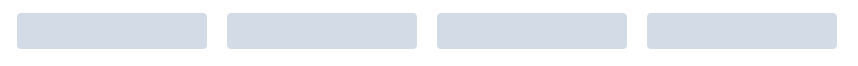

分栏之间存在间隔。

Row 组件 提供 `gutter` 属性来指定每一栏之间的间隔，默认间隔为 0。

```vue
<el-row :gutter="20">
  <el-col :span="6"><div class="grid-content bg-purple"></div></el-col>
  <el-col :span="6"><div class="grid-content bg-purple"></div></el-col>
  <el-col :span="6"><div class="grid-content bg-purple"></div></el-col>
  <el-col :span="6"><div class="grid-content bg-purple"></div></el-col>
</el-row>

<style>
  .el-row {
    margin-bottom: 20px;
    &:last-child {
      margin-bottom: 0;
    }
  }
  .el-col {
    border-radius: 4px;
  }
  .bg-purple-dark {
    background: #99a9bf;
  }
  .bg-purple {
    background: #d3dce6;
  }
  .bg-purple-light {
    background: #e5e9f2;
  }
  .grid-content {
    border-radius: 4px;
    min-height: 36px;
  }
  .row-bg {
    padding: 10px 0;
    background-color: #f9fafc;
  }
</style>
```


##### 解析

- `gutter`属性是`row`组件身上的

#### 混合布局

##### 官方案例

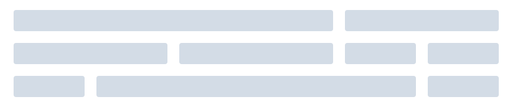

通过基础的 1/24 分栏任意扩展组合形成较为复杂的混合布局。

```vue
<el-row :gutter="20">
  <el-col :span="16"><div class="grid-content bg-purple"></div></el-col>
  <el-col :span="8"><div class="grid-content bg-purple"></div></el-col>
</el-row>
<el-row :gutter="20">
  <el-col :span="8"><div class="grid-content bg-purple"></div></el-col>
  <el-col :span="8"><div class="grid-content bg-purple"></div></el-col>
  <el-col :span="4"><div class="grid-content bg-purple"></div></el-col>
  <el-col :span="4"><div class="grid-content bg-purple"></div></el-col>
</el-row>
<el-row :gutter="20">
  <el-col :span="4"><div class="grid-content bg-purple"></div></el-col>
  <el-col :span="16"><div class="grid-content bg-purple"></div></el-col>
  <el-col :span="4"><div class="grid-content bg-purple"></div></el-col>
</el-row>

<style>
  .el-row {
    margin-bottom: 20px;
    &:last-child {
      margin-bottom: 0;
    }
  }
  .el-col {
    border-radius: 4px;
  }
  .bg-purple-dark {
    background: #99a9bf;
  }
  .bg-purple {
    background: #d3dce6;
  }
  .bg-purple-light {
    background: #e5e9f2;
  }
  .grid-content {
    border-radius: 4px;
    min-height: 36px;
  }
  .row-bg {
    padding: 10px 0;
    background-color: #f9fafc;
  }
</style>
```

##### 解析

- 保证每个`row`组件的`col`组件的`span`属性值，加起来是24即可

#### 分栏偏移

##### 官方案例

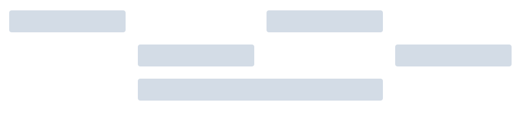

支持偏移指定的栏数。

通过制定 col 组件的 `offset` 属性可以指定分栏偏移的栏数。

```vue
<el-row :gutter="20">
  <el-col :span="6"><div class="grid-content bg-purple"></div></el-col>
  <el-col :span="6" :offset="6"><div class="grid-content bg-purple"></div></el-col>
</el-row>
<el-row :gutter="20">
  <el-col :span="6" :offset="6"><div class="grid-content bg-purple"></div></el-col>
  <el-col :span="6" :offset="6"><div class="grid-content bg-purple"></div></el-col>
</el-row>
<el-row :gutter="20">
  <el-col :span="12" :offset="6"><div class="grid-content bg-purple"></div></el-col>
</el-row>

<style>
  .el-row {
    margin-bottom: 20px;
    &:last-child {
      margin-bottom: 0;
    }
  }
  .el-col {
    border-radius: 4px;
  }
  .bg-purple-dark {
    background: #99a9bf;
  }
  .bg-purple {
    background: #d3dce6;
  }
  .bg-purple-light {
    background: #e5e9f2;
  }
  .grid-content {
    border-radius: 4px;
    min-height: 36px;
  }
  .row-bg {
    padding: 10px 0;
    background-color: #f9fafc;
  }
</style>
```


##### 解析

- `offset`属性是`col`组件身上的

#### 对齐方式（flex布局）

##### 官方案例

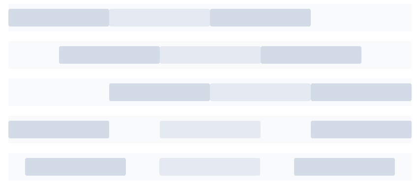

通过 `flex` 布局来对分栏进行灵活的对齐。

将 `type` 属性赋值为 'flex'，可以启用 flex 布局，并可通过 `justify` 属性来指定 start, center, end, space-between, space-around 其中的值来定义子元素的排版方式。

```vue
<el-row type="flex" class="row-bg">
  <el-col :span="6"><div class="grid-content bg-purple"></div></el-col>
  <el-col :span="6"><div class="grid-content bg-purple-light"></div></el-col>
  <el-col :span="6"><div class="grid-content bg-purple"></div></el-col>
</el-row>
<el-row type="flex" class="row-bg" justify="center">
  <el-col :span="6"><div class="grid-content bg-purple"></div></el-col>
  <el-col :span="6"><div class="grid-content bg-purple-light"></div></el-col>
  <el-col :span="6"><div class="grid-content bg-purple"></div></el-col>
</el-row>
<el-row type="flex" class="row-bg" justify="end">
  <el-col :span="6"><div class="grid-content bg-purple"></div></el-col>
  <el-col :span="6"><div class="grid-content bg-purple-light"></div></el-col>
  <el-col :span="6"><div class="grid-content bg-purple"></div></el-col>
</el-row>
<el-row type="flex" class="row-bg" justify="space-between">
  <el-col :span="6"><div class="grid-content bg-purple"></div></el-col>
  <el-col :span="6"><div class="grid-content bg-purple-light"></div></el-col>
  <el-col :span="6"><div class="grid-content bg-purple"></div></el-col>
</el-row>
<el-row type="flex" class="row-bg" justify="space-around">
  <el-col :span="6"><div class="grid-content bg-purple"></div></el-col>
  <el-col :span="6"><div class="grid-content bg-purple-light"></div></el-col>
  <el-col :span="6"><div class="grid-content bg-purple"></div></el-col>
</el-row>

<style>
  .el-row {
    margin-bottom: 20px;
    &:last-child {
      margin-bottom: 0;
    }
  }
  .el-col {
    border-radius: 4px;
  }
  .bg-purple-dark {
    background: #99a9bf;
  }
  .bg-purple {
    background: #d3dce6;
  }
  .bg-purple-light {
    background: #e5e9f2;
  }
  .grid-content {
    border-radius: 4px;
    min-height: 36px;
  }
  .row-bg {
    padding: 10px 0;
    background-color: #f9fafc;
  }
</style>
```


##### 解析

- 官方用了所谓的`对齐方式`一次，来描述`flex`布局
- 其实只实现了水平的`flex`布局的基本功能

#### 响应式布局

##### 官方案例

参照了 Bootstrap 的 响应式设计，预设了五个响应尺寸：`xs`、`sm`、`md`、`lg` 和 `xl`。

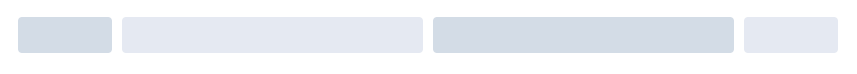

```vue
<el-row :gutter="10">
    <el-col :xs="8" :sm="6" :md="4" :lg="3" :xl="1">
        <div class="grid-content bg-purple">
            左边侧边栏
        </div>
    </el-col>
    <el-col :xs="4" :sm="6" :md="8" :lg="9" :xl="11">
        <div class="grid-content bg-purple-light">
            内容区域1
        </div>
    </el-col>
    <el-col :xs="4" :sm="6" :md="8" :lg="9" :xl="11">
        <div class="grid-content bg-purple">
            内容区域2
        </div>
    </el-col>
    <el-col :xs="8" :sm="6" :md="4" :lg="3" :xl="1">
        <div class="grid-content bg-purple-light">
            右边导航栏
        </div>
    </el-col>

</el-row>
<style>
  .el-col {
    border-radius: 4px;
  }
  .bg-purple-dark {
    background: #99a9bf;
  }
  .bg-purple {
    background: #d3dce6;
  }
  .bg-purple-light {
    background: #e5e9f2;
  }
  .grid-content {
    border-radius: 4px;
    min-height: 36px;
  }
</style>
```

##### 解析

- 基于不同的屏幕尺寸下，同一行的各列的布局分布

  | 参数 | 说明                                 |
  | ---- | ------------------------------------ |
  | xs   | <768px 响应式栅格数或者栅格属性对象  |
  | sm   | ≥768px 响应式栅格数或者栅格属性对象  |
  | md   | ≥992px 响应式栅格数或者栅格属性对象  |
  | lg   | ≥1200px 响应式栅格数或者栅格属性对象 |
  | xl   | ≥1920px 响应式栅格数或者栅格属性对象 |

#### 基于断点的隐藏类

##### 官方说明

Element 额外提供了一系列类名，用于在某些条件下隐藏元素。这些类名可以添加在任何 DOM 元素或自定义组件上。如果需要，请自行引入以下文件：

```js
import 'element-ui/lib/theme-chalk/display.css';
```

包含的类名及其含义为：

- `hidden-xs-only` - 当视口在 `xs` 尺寸时隐藏
- `hidden-sm-only` - 当视口在 `sm` 尺寸时隐藏
- `hidden-sm-and-down` - 当视口在 `sm` 及以下尺寸时隐藏
- `hidden-sm-and-up` - 当视口在 `sm` 及以上尺寸时隐藏
- `hidden-md-only` - 当视口在 `md` 尺寸时隐藏
- `hidden-md-and-down` - 当视口在 `md` 及以下尺寸时隐藏
- `hidden-md-and-up` - 当视口在 `md` 及以上尺寸时隐藏
- `hidden-lg-only` - 当视口在 `lg` 尺寸时隐藏
- `hidden-lg-and-down` - 当视口在 `lg` 及以下尺寸时隐藏
- `hidden-lg-and-up` - 当视口在 `lg` 及以上尺寸时隐藏
- `hidden-xl-only` - 当视口在 `xl` 尺寸时隐藏

##### 解析

- 在上面案例的基础上，可以通过添加类名，隐藏指定尺寸下的任意一个元素

#### 查询手册

Row Attributes

| 参数    | 说明                                  | 类型   | 可选值                                      | 默认值 |
| ------- | ------------------------------------- | ------ | ------------------------------------------- | ------ |
| gutter  | 栅格间隔                              | number | —                                           | 0      |
| type    | 布局模式，可选 flex，现代浏览器下有效 | string | —                                           | —      |
| justify | flex 布局下的水平排列方式             | string | start/end/center/space-around/space-between | start  |
| align   | flex 布局下的垂直排列方式             | string | top/middle/bottom                           | —      |
| tag     | 自定义元素标签                        | string | *                                           | div    |

Col Attributes

| 参数   | 说明                                 | 类型                                        | 可选值 | 默认值 |
| ------ | ------------------------------------ | ------------------------------------------- | ------ | ------ |
| span   | 栅格占据的列数                       | number                                      | —      | 24     |
| offset | 栅格左侧的间隔格数                   | number                                      | —      | 0      |
| push   | 栅格向右移动格数                     | number                                      | —      | 0      |
| pull   | 栅格向左移动格数                     | number                                      | —      | 0      |
| xs     | <768px 响应式栅格数或者栅格属性对象  | number/object (例如： {span: 4, offset: 4}) | —      | —      |
| sm     | ≥768px 响应式栅格数或者栅格属性对象  | number/object (例如： {span: 4, offset: 4}) | —      | —      |
| md     | ≥992px 响应式栅格数或者栅格属性对象  | number/object (例如： {span: 4, offset: 4}) | —      | —      |
| lg     | ≥1200px 响应式栅格数或者栅格属性对象 | number/object (例如： {span: 4, offset: 4}) | —      | —      |
| xl     | ≥1920px 响应式栅格数或者栅格属性对象 | number/object (例如： {span: 4, offset: 4}) | —      | —      |
| tag    | 自定义元素标签                       | string                                      | *      | div    |


### `Button`按钮

常用的操作按钮。

#### 基础用法

##### 官方案例

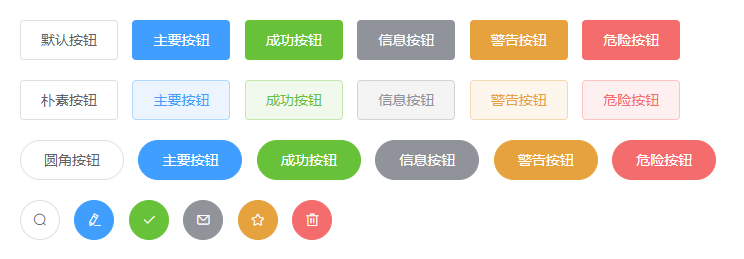

使用`type`、`plain`、`round`和`circle`属性来定义 Button 的样式。

```vue
<el-row>
  <el-button>默认按钮</el-button>
  <el-button type="primary">主要按钮</el-button>
  <el-button type="success">成功按钮</el-button>
  <el-button type="info">信息按钮</el-button>
  <el-button type="warning">警告按钮</el-button>
  <el-button type="danger">危险按钮</el-button>
</el-row>

<el-row>
  <el-button plain>朴素按钮</el-button>
  <el-button type="primary" plain>主要按钮</el-button>
  <el-button type="success" plain>成功按钮</el-button>
  <el-button type="info" plain>信息按钮</el-button>
  <el-button type="warning" plain>警告按钮</el-button>
  <el-button type="danger" plain>危险按钮</el-button>
</el-row>

<el-row>
  <el-button round>圆角按钮</el-button>
  <el-button type="primary" round>主要按钮</el-button>
  <el-button type="success" round>成功按钮</el-button>
  <el-button type="info" round>信息按钮</el-button>
  <el-button type="warning" round>警告按钮</el-button>
  <el-button type="danger" round>危险按钮</el-button>
</el-row>

<el-row>
  <el-button icon="el-icon-search" circle></el-button>
  <el-button type="primary" icon="el-icon-edit" circle></el-button>
  <el-button type="success" icon="el-icon-check" circle></el-button>
  <el-button type="info" icon="el-icon-message" circle></el-button>
  <el-button type="warning" icon="el-icon-star-off" circle></el-button>
  <el-button type="danger" icon="el-icon-delete" circle></el-button>
</el-row>
```

##### 解析

- 直接使用即可
- 按钮的图标应该可以自定义的

#### 禁用状态

你可以使用`disabled`属性来定义按钮是否可用，它接受一个`Boolean`值。

```vue
<el-button disabled>默认按钮</el-button>
```

### TimePicker 时间选择器


### DatePicker 日期选择器

用于选择或输入日期

#### 选择日

##### 官方案例

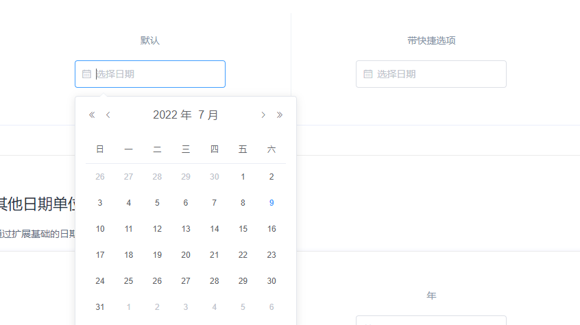

基本单位由`type`属性指定。快捷选项需配置`picker-options`对象中的`shortcuts`，禁用日期通过 `disabledDate` 设置，传入函数

```vue
<template>
  <div class="block">
    <span class="demonstration">默认</span>
    <el-date-picker
      v-model="value1"
      type="date"
      placeholder="选择日期">
    </el-date-picker>
  </div>
  <div class="block">
    <span class="demonstration">带快捷选项</span>
    <el-date-picker
      v-model="value2"
      align="right"
      type="date"
      placeholder="选择日期"
      :picker-options="pickerOptions">
    </el-date-picker>
  </div>
</template>

<script>
  export default {
    data() {
      return {
        pickerOptions: {
          disabledDate(time) {
            return time.getTime() > Date.now();
          },
          shortcuts: [{
            text: '今天',
            onClick(picker) {
              picker.$emit('pick', new Date());
            }
          }, {
            text: '昨天',
            onClick(picker) {
              const date = new Date();
              date.setTime(date.getTime() - 3600 * 1000 * 24);
              picker.$emit('pick', date);
            }
          }, {
            text: '一周前',
            onClick(picker) {
              const date = new Date();
              date.setTime(date.getTime() - 3600 * 1000 * 24 * 7);
              picker.$emit('pick', date);
            }
          }]
        },
        value1: '',
        value2: '',
      };
    }
  };
</script>
```


##### 解析

### `Form`表单

由输入框、选择器、单选框、多选框等控件组成，用以收集、校验、提交数据

#### 典型表单

##### 官方案例

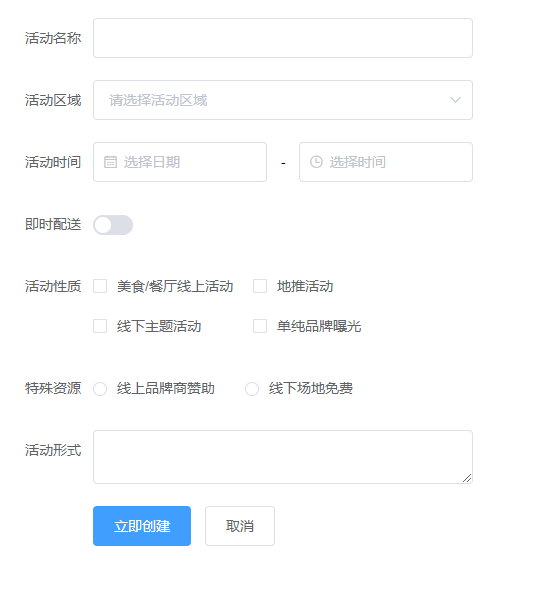

包括各种表单项，比如输入框、选择器、开关、单选框、多选框等。

> W3C 标准中有如下[规定](https://www.w3.org/MarkUp/html-spec/html-spec_8.html#SEC8.2)：
>
> *When there is only one single-line text input field in a form, the user agent should accept Enter in that field as a request to submit the form.*
>
> 即：当一个 form 元素中只有一个输入框时，在该输入框中按下回车应提交该表单。如果希望阻止这一默认行为，可以在 `<el-form>` 标签上添加 @submit.native.prevent。

在 Form 组件中，每一个表单域由一个 Form-Item 组件构成，表单域中可以放置各种类型的表单控件，包括 Input、Select、Checkbox、Radio、Switch、DatePicker、TimePicker

```vue
<el-form ref="form" :model="form" label-width="80px">
  <el-form-item label="活动名称">
    <el-input v-model="form.name"></el-input>
  </el-form-item>
  <el-form-item label="活动区域">
    <el-select v-model="form.region" placeholder="请选择活动区域">
      <el-option label="区域一" value="shanghai"></el-option>
      <el-option label="区域二" value="beijing"></el-option>
    </el-select>
  </el-form-item>
  <el-form-item label="活动时间">
    <el-col :span="11">
      <el-date-picker type="date" placeholder="选择日期" v-model="form.date1" style="width: 100%;"></el-date-picker>
    </el-col>
    <el-col class="line" :span="2">-</el-col>
    <el-col :span="11">
      <el-time-picker placeholder="选择时间" v-model="form.date2" style="width: 100%;"></el-time-picker>
    </el-col>
  </el-form-item>
  <el-form-item label="即时配送">
    <el-switch v-model="form.delivery"></el-switch>
  </el-form-item>
  <el-form-item label="活动性质">
    <el-checkbox-group v-model="form.type">
      <el-checkbox label="美食/餐厅线上活动" name="type"></el-checkbox>
      <el-checkbox label="地推活动" name="type"></el-checkbox>
      <el-checkbox label="线下主题活动" name="type"></el-checkbox>
      <el-checkbox label="单纯品牌曝光" name="type"></el-checkbox>
    </el-checkbox-group>
  </el-form-item>
  <el-form-item label="特殊资源">
    <el-radio-group v-model="form.resource">
      <el-radio label="线上品牌商赞助"></el-radio>
      <el-radio label="线下场地免费"></el-radio>
    </el-radio-group>
  </el-form-item>
  <el-form-item label="活动形式">
    <el-input type="textarea" v-model="form.desc"></el-input>
  </el-form-item>
  <el-form-item>
    <el-button type="primary" @click="onSubmit">立即创建</el-button>
    <el-button>取消</el-button>
  </el-form-item>
</el-form>
<script>
  export default {
    data() {
      return {
        form: {
          name: '',
          region: '',
          date1: '',
          date2: '',
          delivery: false,
          type: [],
          resource: '',
          desc: ''
        }
      }
    },
    methods: {
      onSubmit() {
        console.log('submit!');
      }
    }
  }
</script>
```

##### 解析

- `el-form`绑定一个对象
- `el-form-item`表示表单的每一个行，内部可以嵌套其他元素
- `label-width`属性控制的是表单字段的宽度

#### 行内表单

##### 官方案例


当垂直方向空间受限且表单较简单时，可以在一行内放置表单。

设置 `inline` 属性可以让表单域变为行内的表单域

```vue
<el-form :inline="true" :model="formInline" class="demo-form-inline">
  <el-form-item label="审批人">
    <el-input v-model="formInline.user" placeholder="审批人"></el-input>
  </el-form-item>
  <el-form-item label="活动区域">
    <el-select v-model="formInline.region" placeholder="活动区域">
      <el-option label="区域一" value="shanghai"></el-option>
      <el-option label="区域二" value="beijing"></el-option>
    </el-select>
  </el-form-item>
  <el-form-item>
    <el-button type="primary" @click="onSubmit">查询</el-button>
  </el-form-item>
</el-form>
<script>
  export default {
    data() {
      return {
        formInline: {
          user: '',
          region: ''
        }
      }
    },
    methods: {
      onSubmit() {
        console.log('submit!');
      }
    }
  }
</script>
```


##### 解析

- 在表单中实现，一行可以配置多字段，不能通过`el-col`的形式实现

#### 查询手册

Form Attributes

| 参数                    | 说明                                                         | 类型    | 可选值                | 默认值 |
| ----------------------- | ------------------------------------------------------------ | ------- | --------------------- | ------ |
| model                   | 表单数据对象                                                 | object  | —                     | —      |
| rules                   | 表单验证规则                                                 | object  | —                     | —      |
| inline                  | 行内表单模式                                                 | boolean | —                     | false  |
| label-position          | 表单域标签的位置，如果值为 left 或者 right 时，则需要设置 label-width | string  | right/left/top        | right  |
| label-width             | 表单域标签的宽度，例如 '50px'。作为 Form 直接子元素的 form-item 会继承该值。支持 auto。 | string  | —                     | —      |
| label-suffix            | 表单域标签的后缀                                             | string  | —                     | —      |
| hide-required-asterisk  | 是否隐藏必填字段的标签旁边的红色星号                         | boolean | —                     | false  |
| show-message            | 是否显示校验错误信息                                         | boolean | —                     | true   |
| inline-message          | 是否以行内形式展示校验信息                                   | boolean | —                     | false  |
| status-icon             | 是否在输入框中显示校验结果反馈图标                           | boolean | —                     | false  |
| validate-on-rule-change | 是否在 rules 属性改变后立即触发一次验证                      | boolean | —                     | true   |
| size                    | 用于控制该表单内组件的尺寸                                   | string  | medium / small / mini | —      |
| disabled                | 是否禁用该表单内的所有组件。若设置为 true，则表单内组件上的 disabled 属性不再生效 | boolean | —                     | false  |

Form Methods

| 方法名        | 说明                                                         | 参数                                                         |
| ------------- | ------------------------------------------------------------ | ------------------------------------------------------------ |
| validate      | 对整个表单进行校验的方法，参数为一个回调函数。该回调函数会在校验结束后被调用，并传入两个参数：是否校验成功和未通过校验的字段。若不传入回调函数，则会返回一个 promise | Function(callback: Function(boolean, object))                |
| validateField | 对部分表单字段进行校验的方法                                 | Function(props: array \| string, callback: Function(errorMessage: string)) |
| resetFields   | 对整个表单进行重置，将所有字段值重置为初始值并移除校验结果   | —                                                            |
| clearValidate | 移除表单项的校验结果。传入待移除的表单项的 prop 属性或者 prop 组成的数组，如不传则移除整个表单的校验结果 | Function(props: array \| string)                             |

Form Events

| 事件名称 | 说明                   | 回调参数                                                   |
| -------- | ---------------------- | ---------------------------------------------------------- |
| validate | 任一表单项被校验后触发 | 被校验的表单项 prop 值，校验是否通过，错误消息（如果存在） |

Form-Item Attributes

| 参数           | 说明                                                         | 类型    | 可选值                          | 默认值 |
| -------------- | ------------------------------------------------------------ | ------- | ------------------------------- | ------ |
| prop           | 表单域 model 字段，在使用 validate、resetFields 方法的情况下，该属性是必填的 | string  | 传入 Form 组件的 model 中的字段 | —      |
| label          | 标签文本                                                     | string  | —                               | —      |
| label-width    | 表单域标签的的宽度，例如 '50px'。支持 auto。                 | string  | —                               | —      |
| required       | 是否必填，如不设置，则会根据校验规则自动生成                 | boolean | —                               | false  |
| rules          | 表单验证规则                                                 | object  | —                               | —      |
| error          | 表单域验证错误信息, 设置该值会使表单验证状态变为error，并显示该错误信息 | string  | —                               | —      |
| show-message   | 是否显示校验错误信息                                         | boolean | —                               | true   |
| inline-message | 以行内形式展示校验信息                                       | boolean | —                               | false  |
| size           | 用于控制该表单域下组件的尺寸                                 | string  | medium / small / mini           | -      |

Form-Item Slot

| name  | 说明             |
| ----- | ---------------- |
| —     | Form Item 的内容 |
| label | 标签文本的内容   |

Form-Item Scoped Slot

| name  | 说明                                           |
| ----- | ---------------------------------------------- |
| error | 自定义表单校验信息的显示方式，参数为 { error } |

Form-Item Methods

| 方法名        | 说明                                                 | 参数 |
| ------------- | ---------------------------------------------------- | ---- |
| resetField    | 对该表单项进行重置，将其值重置为初始值并移除校验结果 | -    |
| clearValidate | 移除该表单项的校验结果                               | -    |

### `Table`表格

用于展示多条结构类似的数据，可对数据进行排序、筛选、对比或其他自定义操作。

#### 基础表格

##### 官方案例

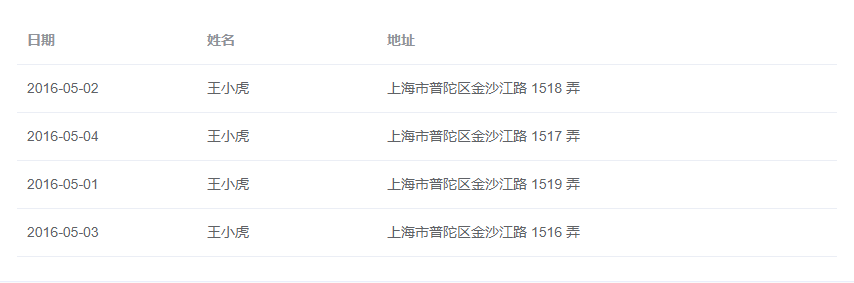

基础的表格展示用法。

当`el-table`元素中注入`data`对象数组后，在`el-table-column`中用`prop`属性来对应对象中的键名即可填入数据，用`label`属性来定义表格的列名。可以使用`width`属性来定义列宽。

```vue
  <template>
    <el-table
      :data="tableData"
      style="width: 100%">
      <el-table-column
        prop="date"
        label="日期"
        width="180">
      </el-table-column>
      <el-table-column
        prop="name"
        label="姓名"
        width="180">
      </el-table-column>
      <el-table-column
        prop="address"
        label="地址">
      </el-table-column>
    </el-table>
  </template>

  <script>
    export default {
      data() {
        return {
          tableData: [{
            date: '2016-05-02',
            name: '王小虎',
            address: '上海市普陀区金沙江路 1518 弄'
          }, {
            date: '2016-05-04',
            name: '王小虎',
            address: '上海市普陀区金沙江路 1517 弄'
          }, {
            date: '2016-05-01',
            name: '王小虎',
            address: '上海市普陀区金沙江路 1519 弄'
          }, {
            date: '2016-05-03',
            name: '王小虎',
            address: '上海市普陀区金沙江路 1516 弄'
          }]
        }
      }
    }
  </script>
```


##### 解析

- 数据源是一个对象数组，里面是多个对象

  ```js
  data() {
      return {
          tableData: [{
              date: '2016-05-02',
              name: '王小虎',
              address: '上海市普陀区金沙江路 1518 弄'
          }, {
              date: '2016-05-04',
              name: '王小虎',
              address: '上海市普陀区金沙江路 1517 弄'
          }]
      }
  }
  ```

- `el-table`

  - 需要将`tableData`传递个`el-table`

    ```vue
    <el-table :data=tableData></el-table>
    ```

  - 可以写内联样式指定表格整体长度，设置为`100%`表示撑满父组件

    但通常还要额外设置样式，以留有边距

    ```vue
    <el-table :data=tableData style="width: 100%"></el-table>
    ```

  - `el-table`的默认插槽为空，当内部标签不传递`el-table-column`时，页面没有显示

- `el-table-column`，按列渲染，每一个`el-table-column`标签，对应着一列表格数据，需要在`el-table`标签内使用

  ```vue
      <el-table
          :data="tableData"
          style="width: 100%">
        <el-table-column
            prop="date">
        </el-table-column>
        <el-table-column
            prop="name"
            label="姓名"
            width="180">
        </el-table-column>
        <el-table-column
            prop="address"
            width="10"
            label="地址">
        </el-table-column>
      </el-table>
  
  ```

  - `prop`属性，值为数据源对象里的`key`，渲染的结果是每一列的表格内容
  - `label`属性，值可以自定义，渲染结果是每一列的表格，若未指定则表格的表头为空，一般设置成`prop`对应的中文名，也可以使用`property`属性
  - `width`属性，值为数值，表示每一列的表格宽度
    - 若未指定，内部会基于父组件的容器宽度，减去指定了的数值，然后给所有未指定的表格列平均分配宽度
    - 若指定的宽度，比实际内容小了，并不会自适应调整到刚好满足内容宽度的宽度，因为每个内容的长度无法确定
      - 指定多宽就是多宽，内容会自动换行，并且有个最小宽度，测了下应该是`20px`
      - 若宽度是正常指定的，最后一列会的宽度会根据父组件的宽度变大或者变小
        - 若最后有多余空间，可以通过调整`el-table`的`style`属性来设置整体宽度，一般操作是，给个计算属性，根据列宽和列数动态指定表格宽度或者直接写死，单位为`px`

#### 带斑马纹表格

`stripe`属性可以创建带斑马纹的表格。它接受一个`Boolean`，默认为`false`，设置为`true`即为启用。

```vue
<el-table
    :data="tableData"
    stripe
    style="width: 100%">
</el-table>
```

#### 带边框表格

默认情况下，Table 组件是不具有竖直方向的边框的，如果需要，可以使用`border`属性，它接受一个`Boolean`，设置为`true`即可启用。

```vue
<el-table
    :data="tableData"
    border
    style="width: 100%">
</el-table>
```

使用注意点，最好一开始就确定好要不要加边框，不然后面还得调整宽度

#### 固定表头

纵向内容过多时，可选择固定表头。

只要在`el-table`元素中定义了`height`属性，即可实现固定表头的表格，而不需要额外的代码。

```vue
<el-table
    :data="tableData"
    height="250"
    style="width: 100%">
</el-table>
```

#### 多选

选择多行数据时使用 Checkbox。

##### 官方案例

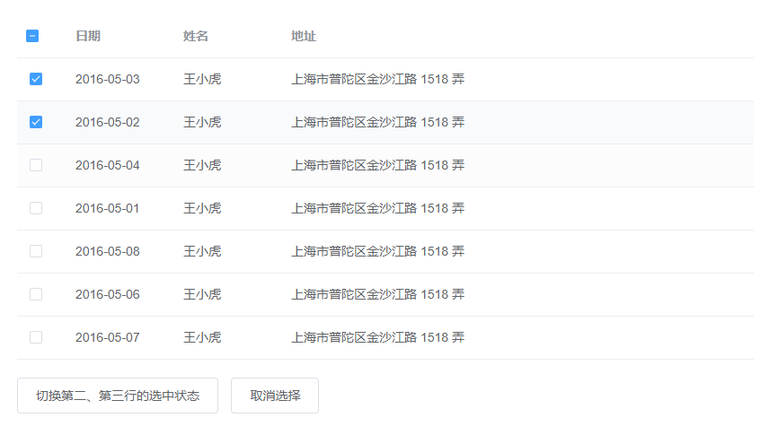

实现多选非常简单: 手动添加一个`el-table-column`，设`type`属性为`selection`即可；默认情况下若内容过多会折行显示，若需要单行显示可以使用`show-overflow-tooltip`属性，它接受一个`Boolean`，为`true`时多余的内容会在 hover 时以 tooltip 的形式显示出来。

```vue
<template>
  <el-table
    ref="multipleTable"
    :data="tableData"
    tooltip-effect="dark"
    style="width: 100%"
    @selection-change="handleSelectionChange">
    <el-table-column
      type="selection"
      width="55">
    </el-table-column>
    <el-table-column
      label="日期"
      width="120">
      <template slot-scope="scope">{{ scope.row.date }}</template>
    </el-table-column>
    <el-table-column
      prop="name"
      label="姓名"
      width="120">
    </el-table-column>
    <el-table-column
      prop="address"
      label="地址"
      show-overflow-tooltip>
    </el-table-column>
  </el-table>
  <div style="margin-top: 20px">
    <el-button @click="toggleSelection([tableData[1], tableData[2]])">切换第二、第三行的选中状态</el-button>
    <el-button @click="toggleSelection()">取消选择</el-button>
  </div>
</template>

<script>
  export default {
    data() {
      return {
        tableData: [{
          date: '2016-05-03',
          name: '王小虎',
          address: '上海市普陀区金沙江路 1518 弄'
        }, {
          date: '2016-05-02',
          name: '王小虎',
          address: '上海市普陀区金沙江路 1518 弄'
        }, {
          date: '2016-05-04',
          name: '王小虎',
          address: '上海市普陀区金沙江路 1518 弄'
        }, {
          date: '2016-05-01',
          name: '王小虎',
          address: '上海市普陀区金沙江路 1518 弄'
        }, {
          date: '2016-05-08',
          name: '王小虎',
          address: '上海市普陀区金沙江路 1518 弄'
        }, {
          date: '2016-05-06',
          name: '王小虎',
          address: '上海市普陀区金沙江路 1518 弄'
        }, {
          date: '2016-05-07',
          name: '王小虎',
          address: '上海市普陀区金沙江路 1518 弄'
        }],
        multipleSelection: []
      }
    },

    methods: {
      toggleSelection(rows) {
        if (rows) {
          rows.forEach(row => {
            this.$refs.multipleTable.toggleRowSelection(row);
          });
        } else {
          this.$refs.multipleTable.clearSelection();
        }
      },
      handleSelectionChange(val) {
        this.multipleSelection = val;
      }
    }
  }
</script>
```


##### 解析

- 添加一个`type`为`selection`的`el-table-column`即可

- 但这不是重点，重点是选中后，我们要添加自定义事件

- `el-table`绑定事件：`@selection-change="handleSelectionChange"`

  - 再定义一个空列表，`selection-change`对应回调的参数就是每个被选中的数据对象，可以直接通过是否选中，来进行其他元素的显隐或操作

    ```js
        handleSelectionChange(val) {
          this.multipleSelection = val
          console.log(this.multipleSelection)
        }
    ```

    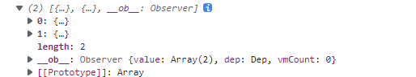

    如果根据是否多选动态显示批量删除按钮的话，用`v-if-else`，`v-else`作为新的结构占位，不然会闪屏

  - 当然也可以像案例那样，在额外的元素上绑定事件控制显隐

#### 自定义列模板

##### 官方案例

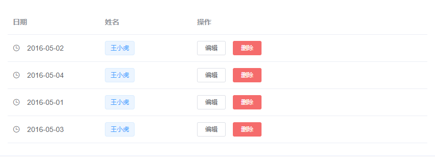

自定义列的显示内容，可组合其他组件使用。

通过 `Scoped slot` 可以获取到 row, column, $index 和 store（table 内部的状态管理）的数据，用法参考 demo。

```vue
<template>
  <el-table
    :data="tableData"
    style="width: 100%">
    <el-table-column
      label="日期"
      width="180">
      <template slot-scope="scope">
        <i class="el-icon-time"></i>
        <span style="margin-left: 10px">{{ scope.row.date }}</span>
      </template>
    </el-table-column>
    <el-table-column
      label="姓名"
      width="180">
      <template slot-scope="scope">
        <el-popover trigger="hover" placement="top">
          <p>姓名: {{ scope.row.name }}</p>
          <p>住址: {{ scope.row.address }}</p>
          <div slot="reference" class="name-wrapper">
            <el-tag size="medium">{{ scope.row.name }}</el-tag>
          </div>
        </el-popover>
      </template>
    </el-table-column>
    <el-table-column label="操作">
      <template slot-scope="scope">
        <el-button
          size="mini"
          @click="handleEdit(scope.$index, scope.row)">编辑</el-button>
        <el-button
          size="mini"
          type="danger"
          @click="handleDelete(scope.$index, scope.row)">删除</el-button>
      </template>
    </el-table-column>
  </el-table>
</template>

<script>
  export default {
    data() {
      return {
        tableData: [{
          date: '2016-05-02',
          name: '王小虎',
          address: '上海市普陀区金沙江路 1518 弄'
        }, {
          date: '2016-05-04',
          name: '王小虎',
          address: '上海市普陀区金沙江路 1517 弄'
        }, {
          date: '2016-05-01',
          name: '王小虎',
          address: '上海市普陀区金沙江路 1519 弄'
        }, {
          date: '2016-05-03',
          name: '王小虎',
          address: '上海市普陀区金沙江路 1516 弄'
        }]
      }
    },
    methods: {
      handleEdit(index, row) {
        console.log(index, row);
      },
      handleDelete(index, row) {
        console.log(index, row);
      }
    }
  }
</script>
```

##### 解析

- 使用了作用域插槽，拿到`el-table-column`传递给使用者的数据

  ```vue
        <template slot-scope="scope">
          <i class="el-icon-time"></i>
          <span style="margin-left: 10px">{{ scope.row.date }}</span>
        </template>
  ```

  可以获取到 row, column, $index 和 store（table 内部的状态管理）的数据

  - `scope.row`
    - 是数据源中的每一个对象
  - `scope.column`
    - 是数据源中的每一个对象
  - `scope.$index`
    - 表格每一行的索引
  - `scope.store`，直接这样取会报错

- 也就是说我们要在表格里写自定义的内容，要用到它这个作用域插槽，并且如果要自定义内容，就不要加`prop`属性了

#### 展开行

##### 官方案例

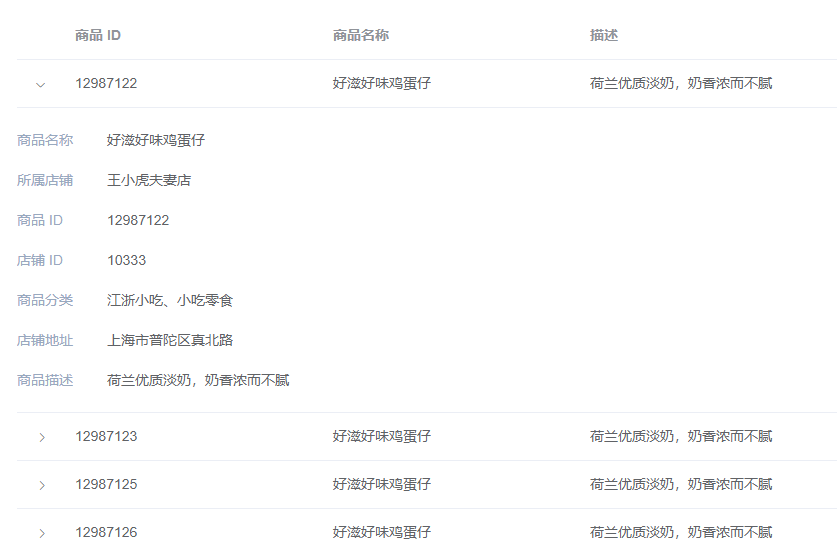

当行内容过多并且不想显示横向滚动条时，可以使用 Table 展开行功能。

通过设置 type="expand" 和 `Scoped slot` 可以开启展开行功能，`el-table-column` 的模板会被渲染成为展开行的内容，展开行可访问的属性与使用自定义列模板时的 `Scoped slot` 相同。

```vue
<template>
  <el-table
    :data="tableData"
    style="width: 100%">
    <el-table-column type="expand">
      <template slot-scope="props">
        <el-form label-position="left" inline class="demo-table-expand">
          <el-form-item label="商品名称">
            <span>{{ props.row.name }}</span>
          </el-form-item>
          <el-form-item label="所属店铺">
            <span>{{ props.row.shop }}</span>
          </el-form-item>
          <el-form-item label="商品 ID">
            <span>{{ props.row.id }}</span>
          </el-form-item>
          <el-form-item label="店铺 ID">
            <span>{{ props.row.shopId }}</span>
          </el-form-item>
          <el-form-item label="商品分类">
            <span>{{ props.row.category }}</span>
          </el-form-item>
          <el-form-item label="店铺地址">
            <span>{{ props.row.address }}</span>
          </el-form-item>
          <el-form-item label="商品描述">
            <span>{{ props.row.desc }}</span>
          </el-form-item>
        </el-form>
      </template>
    </el-table-column>
    <el-table-column
      label="商品 ID"
      prop="id">
    </el-table-column>
    <el-table-column
      label="商品名称"
      prop="name">
    </el-table-column>
    <el-table-column
      label="描述"
      prop="desc">
    </el-table-column>
  </el-table>
</template>

<style>
  .demo-table-expand {
    font-size: 0;
  }
  .demo-table-expand label {
    width: 90px;
    color: #99a9bf;
  }
  .demo-table-expand .el-form-item {
    margin-right: 0;
    margin-bottom: 0;
    width: 50%;
  }
</style>

<script>
  export default {
    data() {
      return {
        tableData: [{
          id: '12987122',
          name: '好滋好味鸡蛋仔',
          category: '江浙小吃、小吃零食',
          desc: '荷兰优质淡奶，奶香浓而不腻',
          address: '上海市普陀区真北路',
          shop: '王小虎夫妻店',
          shopId: '10333'
        }, {
          id: '12987123',
          name: '好滋好味鸡蛋仔',
          category: '江浙小吃、小吃零食',
          desc: '荷兰优质淡奶，奶香浓而不腻',
          address: '上海市普陀区真北路',
          shop: '王小虎夫妻店',
          shopId: '10333'
        }, {
          id: '12987125',
          name: '好滋好味鸡蛋仔',
          category: '江浙小吃、小吃零食',
          desc: '荷兰优质淡奶，奶香浓而不腻',
          address: '上海市普陀区真北路',
          shop: '王小虎夫妻店',
          shopId: '10333'
        }, {
          id: '12987126',
          name: '好滋好味鸡蛋仔',
          category: '江浙小吃、小吃零食',
          desc: '荷兰优质淡奶，奶香浓而不腻',
          address: '上海市普陀区真北路',
          shop: '王小虎夫妻店',
          shopId: '10333'
        }]
      }
    }
  }
</script>
```

##### 解析

- `el-table-column`使用了`type`属性，值为`expand`，同时配合作用域插槽自定义内容，官方案例中展开的结构，是用了一个表单

#### 自定义表头

表头支持自定义。

##### 官方案例

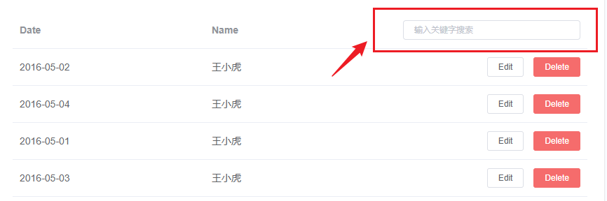

通过设置 [Scoped slot](https://cn.vuejs.org/v2/guide/components-slots.html#作用域插槽) 来自定义表头。

```vue
<template>
  <el-table
    :data="tableData.filter(data => !search || data.name.toLowerCase().includes(search.toLowerCase()))"
    style="width: 100%">
    <el-table-column
      label="Date"
      prop="date">
    </el-table-column>
    <el-table-column
      label="Name"
      prop="name">
    </el-table-column>
    <el-table-column
      align="right">
      <template slot="header" slot-scope="scope">
        <el-input
          v-model="search"
          size="mini"
          placeholder="输入关键字搜索"/>
      </template>
      <template slot-scope="scope">
        <el-button
          size="mini"
          @click="handleEdit(scope.$index, scope.row)">Edit</el-button>
        <el-button
          size="mini"
          type="danger"
          @click="handleDelete(scope.$index, scope.row)">Delete</el-button>
      </template>
    </el-table-column>
  </el-table>
</template>

<script>
  export default {
    data() {
      return {
        tableData: [{
          date: '2016-05-02',
          name: '王小虎',
          address: '上海市普陀区金沙江路 1518 弄'
        }, {
          date: '2016-05-04',
          name: '王小虎',
          address: '上海市普陀区金沙江路 1517 弄'
        }, {
          date: '2016-05-01',
          name: '王小虎',
          address: '上海市普陀区金沙江路 1519 弄'
        }, {
          date: '2016-05-03',
          name: '王小虎',
          address: '上海市普陀区金沙江路 1516 弄'
        }],
        search: ''
      }
    },
    methods: {
      handleEdit(index, row) {
        console.log(index, row);
      },
      handleDelete(index, row) {
        console.log(index, row);
      }
    },
  }
</script>
```

##### 解析

- 核心代码

  ```vue
          <template slot="header" slot-scope="scope">
            <el-button
                size="mini"
                type="danger"
                @click.native.prevent="deleteSelectedRow(userList)">移除选中
            </el-button>
          </template>
          <template slot-scope="scope">
          </template>
  ```

  通过`slot="header"`来自定义表头

  可以配合多选，来删除多条记录

  ```js
      deleteSelectedRow(userList) {
        // 必须要操作内置的userList
        userList.splice(0, userList.length)
      },
  ```

  

### Pagination 分页

当数据量过多时，使用分页分解数据。

#### 基础用法

##### 官方案例

设置`layout`，表示需要显示的内容，用逗号分隔，布局元素会依次显示。`prev`表示上一页，`next`为下一页，`pager`表示页码列表，除此以外还提供了`jumper`和`total`，`size`和特殊的布局符号`->`，`->`后的元素会靠右显示，`jumper`表示跳页元素，`total`表示总条目数，`size`用于设置每页显示的页码数量。

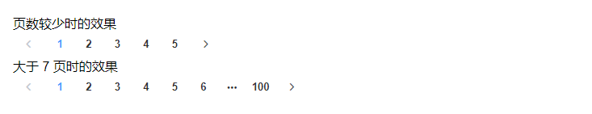

```vue
<div class="block">
  <span class="demonstration">页数较少时的效果</span>
  <el-pagination
    layout="prev, pager, next"
    :total="50">
  </el-pagination>
</div>
<div class="block">
  <span class="demonstration">大于 7 页时的效果</span>
  <el-pagination
    layout="prev, pager, next"
    :total="1000">
  </el-pagination>
</div>
```

##### 解析

- 就是一个`el-pagination`组件，接收`layout`属性，值为`prev, pager, next`

#### 设置最大页码按钮数

默认情况下，当总页数超过 7 页时，Pagination 会折叠多余的页码按钮。通过`pager-count`属性可以设置最大页码按钮数。

```vue
<el-pagination
  :page-size="20"
  :pager-count="11"
  layout="prev, pager, next"
  :total="1000">
</el-pagination>
```

就是表示可点击的页码出现几个

#### 带有背景色的分页

设置`background`属性可以为分页按钮添加背景色。

```vue
<el-pagination
  background
  layout="prev, pager, next"
  :total="1000">
</el-pagination>
```

#### 附加功能

根据场景需要，可以添加其他功能模块。

- 跳转

  - `layout`新增`jumper`

    ```vue
          <el-pagination
              :page-size="10"
              layout="prev, pager, next, jumper"
              background
              @current-change="handleCurrentChange"
              :total="total">
          </el-pagination>
        </div>
    ```

    

  - 给每页的跳转添加回调

    ```js
        handleCurrentChange($val) {
          const newPaylaod = {
            PageNum: $val,
            PageSize: 10
          }
          this.$store.dispatch('user/getUserList', newPaylaod)
        }
    ```

    这里的每一页都去重新请求下接口，一次请求十条

    也可以直接一次请求一百条，然后根据页码数判断下，什么时候要再发请求

    由于`$val`直接存的`vueX`没有做持久化，页码刷新又会重新请求第一页数据了（暂不处理）

### `Dialog`对话框

在保留当前页面状态的情况下，告知用户并承载相关操作。

#### 基本用法

##### 官方案例

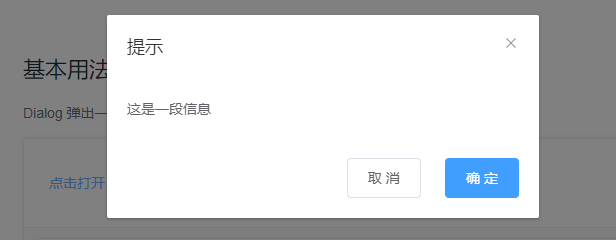

Dialog 弹出一个对话框，适合需要定制性更大的场景。

需要设置`visible`属性，它接收`Boolean`，当为`true`时显示 Dialog。

Dialog 分为两个部分：`body`和`footer`，`footer`需要具名为`footer`的`slot`。

`title`属性用于定义标题，它是可选的，默认值为空。

最后，本例还展示了`before-close`的用法。

```vue
<el-button type="text" @click="dialogVisible = true">点击打开 Dialog</el-button>

<el-dialog
  title="提示"
  :visible.sync="dialogVisible"
  width="30%"
  :before-close="handleClose">
  <span>这是一段信息</span>
  <span slot="footer" class="dialog-footer">
    <el-button @click="dialogVisible = false">取 消</el-button>
    <el-button type="primary" @click="dialogVisible = false">确 定</el-button>
  </span>
</el-dialog>

<script>
  export default {
    data() {
      return {
        dialogVisible: false
      };
    },
    methods: {
      handleClose(done) {
        this.$confirm('确认关闭？')
          .then(_ => {
            done();
          })
          .catch(_ => {});
      }
    }
  };
</script>
```

> `before-close` 仅当用户通过点击关闭图标或遮罩关闭 Dialog 时起效。如果你在 `footer` 具名 slot 里添加了用于关闭 Dialog 的按钮，那么可以在按钮的点击回调函数里加入 `before-close` 的相关逻辑。

##### 解析

- `el-dialog`
  - `title`：对话框的标题
  - `:visible`：绑定控制显隐的布尔值变量
  - `width`：控制对话框的宽度
  - `before-close`：关闭对话框的回调（注意触发条件）

#### 自定义内容

##### 官方案例

Dialog 组件的内容可以是任意的，甚至可以是表格或表单，下面是应用了 Element Table 和 Form 组件的两个样例。

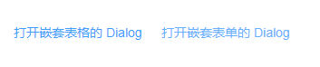

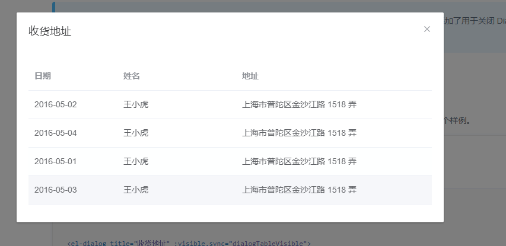

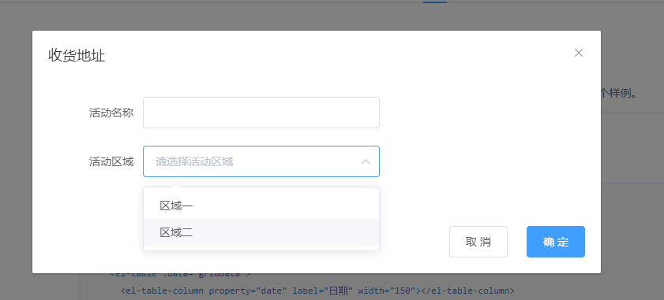


```vue
<!-- Table -->
<el-button type="text" @click="dialogTableVisible = true">打开嵌套表格的 Dialog</el-button>

<el-dialog title="收货地址" :visible.sync="dialogTableVisible">
  <el-table :data="gridData">
    <el-table-column property="date" label="日期" width="150"></el-table-column>
    <el-table-column property="name" label="姓名" width="200"></el-table-column>
    <el-table-column property="address" label="地址"></el-table-column>
  </el-table>
</el-dialog>

<!-- Form -->
<el-button type="text" @click="dialogFormVisible = true">打开嵌套表单的 Dialog</el-button>

<el-dialog title="收货地址" :visible.sync="dialogFormVisible">
  <el-form :model="form">
    <el-form-item label="活动名称" :label-width="formLabelWidth">
      <el-input v-model="form.name" autocomplete="off"></el-input>
    </el-form-item>
    <el-form-item label="活动区域" :label-width="formLabelWidth">
      <el-select v-model="form.region" placeholder="请选择活动区域">
        <el-option label="区域一" value="shanghai"></el-option>
        <el-option label="区域二" value="beijing"></el-option>
      </el-select>
    </el-form-item>
  </el-form>
  <div slot="footer" class="dialog-footer">
    <el-button @click="dialogFormVisible = false">取 消</el-button>
    <el-button type="primary" @click="dialogFormVisible = false">确 定</el-button>
  </div>
</el-dialog>

<script>
  export default {
    data() {
      return {
        gridData: [{
          date: '2016-05-02',
          name: '王小虎',
          address: '上海市普陀区金沙江路 1518 弄'
        }, {
          date: '2016-05-04',
          name: '王小虎',
          address: '上海市普陀区金沙江路 1518 弄'
        }, {
          date: '2016-05-01',
          name: '王小虎',
          address: '上海市普陀区金沙江路 1518 弄'
        }, {
          date: '2016-05-03',
          name: '王小虎',
          address: '上海市普陀区金沙江路 1518 弄'
        }],
        dialogTableVisible: false,
        dialogFormVisible: false,
        form: {
          name: '',
          region: '',
          date1: '',
          date2: '',
          delivery: false,
          type: [],
          resource: '',
          desc: ''
        },
        formLabelWidth: '120px'
      };
    }
  };
</script>
```


##### 解析

- 可以在`el-dialog`中加入任何自己想要自定义的内容

- 注意点

  > Dialog 的内容是懒渲染的，即在第一次被打开之前，传入的默认 slot 不会被渲染到 DOM 上。因此，如果需要执行 DOM 操作，或通过 `ref` 获取相应组件，请在 `open` 事件回调中进行。

  > 如果 `visible` 属性绑定的变量位于 Vuex 的 store 内，那么 `.sync` 不会正常工作。此时需要去除 `.sync` 修饰符，同时监听 Dialog 的 `open` 和 `close` 事件，在事件回调中执行 Vuex 中对应的 mutation 更新 `visible` 属性绑定的变量的值。

## 源码分析

参考：https://www.bilibili.com/video/BV1kR4y1x7hc

### element-ui源码下载

地址：https://github.com/ElemeFE/element/tree/dev

克隆下来或者下载压缩包


# ElementPlus

## 安装

## Vue3中使用ElementPlus