# `ES6`+核心知识和源码分析

## 模块化发展历程：`AMD、CMD、CommonJS、ES Module`

[toc]

# JS模块化

## 1.理解

### 1.1.什么是模块/模块化

#### 1.1.1.目的

- 将一个复杂的程序，依据一定的规则（规范）封装成几个块（文件），并进行组合在一起；
  - 解耦
  - 功能点明确，方便后期维护（不可能在一个文件里写一万行代码吧）
  - 避免污染全局环境

- 块的内部数据/实现，是私有的，但会向外暴露一些接口（方法）与外部其他模块通信；

#### 1.1.2.模块化的进化史

- 最早我们是这样写代码的

  - 这样会导致Global被污染，很容易命名冲突

  ```javascript
  function foo() {
  	...
  }
  
  function bar() {
  	...
  }
  ```

- 接着，进行简单封装：`Namespace模式`

  - 减少Global上的变量数量
  - 本质是对象，但在JS中，我们可以直接修改对象的属性，一点都不安全

  ```javascript
  <script>
      let myModule = {
          data: 'www.baidu.com',
          foo() {
              console.log(`foo() ${this.data}`)
          },
          bar() {
              console.log(`bar() ${this.data}`)
          }
      }
      myModule.foo() // www.baidu.com
      myModule.data = "change data"
      myModule.foo() // change data
  </script>
  ```

  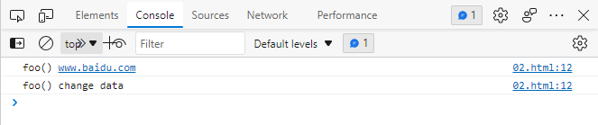

- 接着，使用匿名闭包：`IIFE模式`，匿名函数自调用(闭包)

  - 函数是JS唯一的LocalScope
  - 作用: 数据是私有的, 外部只能通过暴露的方法操作
  - 编码: 将数据和行为封装到一个函数内部, 通过给window添加属性来向外暴露接口
  - 问题: 如果当前这个模块依赖另一个模块怎么办?
  - 我的理解：
    - 就是在构建的私有作用域（闭包）中，给全局对象添加属性


  module.js

  ```javascript
(function (window) {
    // 定义在闭包内的私有数据
    let data = 'www.baidu.com'
    // 私有函数
    function innerFunc() {
        console.log('innerFunc()')
        console.log(arguments.callee.caller)
    }
    // 向外暴露私有数据的函数
    function foo() {
        console.log(`foo():${data}`)
    }
    function bar() {
        console.log(`bar():${data}`)
        innerFunc()
    }
    // 给传入的window实参，添加myModule属性
    window.myModule = {
        foo,
        bar
    }
})(window)
  ```

  index.html

  ```html
<!doctype html>
<html lang="en">
<head>
    <meta charset="UTF-8">
    <meta name="viewport"
          content="width=device-width, user-scalable=no, initial-scale=1.0, maximum-scale=1.0, minimum-scale=1.0">
    <meta http-equiv="X-UA-Compatible" content="ie=edge">
    <title>Document</title>
</head>
<body>
<!--引入自定义的module模块-->
    <script src="./module.js"></script>
    <script>
        // 使用自定义模块中，向外暴露的方法
        // 能用是因为module.js中，已经给window加了myModule属性
        myModule.foo()
        myModule.bar()
    </script>
</body>
</html>
  ```

  效果：

  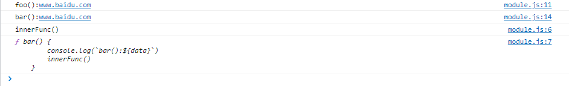

  window对象上，多了一个myModule属性

  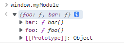

- 接着，再增强一点：`引入依赖`

  - 这就是`模块模式`，也是现代模块实现的基石

  module.js

  ```javascript
  (function (window, $) {
      // 定义在闭包内的私有数据
      let data = 'www.baidu.com'
      // 私有函数
      function innerFunc() {
          console.log('innerFunc()')
          console.log(arguments.callee.caller)
      }
      // 向外暴露私有数据的函数
      function foo() {
          console.log(`foo():${data}`)
          $('body').css('background', 'pink')
      }
      function bar() {
          console.log(`bar():${data}`)
          innerFunc()
      }
      // 给传入的window实参，添加myModule属性
      window.myModule = {
          foo,
          bar
      }
  })(window,jQuery)
  ```

  index.html

  ```html
  <!doctype html>
  <html lang="en">
  <head>
      <meta charset="UTF-8">
      <meta name="viewport"
            content="width=device-width, user-scalable=no, initial-scale=1.0, maximum-scale=1.0, minimum-scale=1.0">
      <meta http-equiv="X-UA-Compatible" content="ie=edge">
      <title>Document</title>
  </head>
  <body>
  <!--先引入jquery全局对象-->
      <script src="./jquery-3.6.0.min.js"></script>
  <!--再引入自定义的module模块-->
      <script src="./module.js"></script>
      <script>
          // 使用自定义模块中，向外暴露的方法
          // 能用是因为module.js中，已经给window加了myModule属性
          myModule.foo()
          myModule.bar()
          console.log(myModule.data) // undefined
      </script>
  </body>
  </html>
  ```

  效果：

  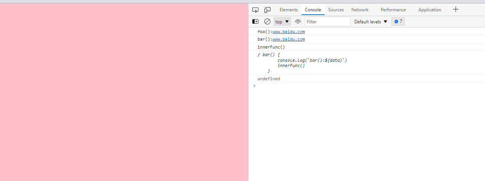

  上述例子在自定义模块中，通过jquery方法将页面的背景颜色改成粉色，所以必须先引入jQuery库，就把这个库当作参数传入。此时window对象，已经挂载了jQuery属性

  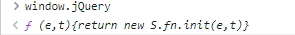

  **这样做除了保证模块的独立性，还使得模块之间的依赖关系变得明显。**

  我的理解：

  可以给自定义模块，传递任意多个全局对象属性，作为自定义模块的参数，事实上，只要传递一个window对象就已经可以了，但为了调用书写方便，以及看上去直观，我们用到哪个库，就会把它作为参数传递一下，显示强调自定义模块在**引入依赖**

  只要保证jQuery对象，在html中先被引入，如下通过window.jQuery调用也是可以的：

  ```javascript
  (function (window) {
  	...
      function foo() {
          window.jQuery('body').css('background', 'pink')
      }
  	...
  })(window)
  ```

  

### 1.2.为什么要模块化

- Web sites are turning into Web Apps
- Code complexity(复杂度) grows as the site gets bigger
- Highly decoupled(解耦) JS files/modules is wanted
- Deployment(部署) wants optimized(优化) code in few HTTP calls

### 1.3.模块化的好处

- 避免命名冲突(减少命名空间污染)
- 更好的分离, 按需加载
- 更高复用性
- 高可维护性

### 1.4.页面引入加载script

引入多个`<script>`后出现的问题

- 请求过多

首先我们要依赖多个模块，那样就会发送多个请求，导致请求过多

- 依赖模糊

我们不知道他们的具体依赖关系是什么，也就是说很容易因为不了解他们之间的依赖关系导致加载先后顺序出错。

- 难以维护

以上两种原因就导致了很难维护，很可能出现牵一发而动全身的情况导致项目出现严重的问题。

 模块化固然有多个好处，然而一个页面需要引入多个js文件，就会出现以上这些问题。而这些问题可以通过模块化规范来解决，下面介绍开发中最流行的commonjs, AMD, ES6, CMD规范。


我的理解：可以有一个黑盒子，在本地先将多个模块，上线时封装成一个模块，同时这个黑盒子可以自己管理每个文件具体的依赖。作为开发者，前期只要知道这个黑盒子的使用及维护即可。

## 2.模块化规范

### 2.1.CommonJS

#### 2.1.1.概述

- Node 应用由模块组成，采用 CommonJS 模块规范。

- 每个js文件就是一个模块，有自己的作用域。在一个文件里面定义的变量、函数、类，都是私有的，对其他文件不可见。
- 在服务器端，模块的加载是运行时同步加载的。
- 在浏览器端，模块需要提前编译打包处理。

#### 2.1.2.特点

- 所有代码都运行在模块作用域，不会污染全局作用域。
- 模块可以多次加载，但是只会在第一次加载时运行一次，然后运行结果就被缓存了，以后再加载，就直接读取缓存结果。要想让模块再次运行，必须清除缓存。
- 模块加载的顺序，按照其在代码中出现的顺序。

#### 2.1.3.基本语法

- **暴露模块**：`module.exports = value`或`exports.xxx = value`
- 引入模块：`require(xxx)`，如果是第三方模块，xxx为模块名；如果是自定义模块，xxx为模块文件路径

**CommonJS暴露的模块到底是什么?**

新建一个js文件：

```javascript
console.log('我是module：',module)
```

在根目录执行`node filename`结果如下：

```
D:\workspace\github\md\web\code\模块化\CommmonJS>node 1.module对象是什么.js
我是module： Module {
  id: '.',
  path: 'D:\\workspace\\github\\md\\web\\code\\模块化\\CommmonJS',
  exports: {},
  filename: 'D:\\workspace\\github\\md\\web\\code\\模块化\\CommmonJS\\1.module对象是什么.js',
  loaded: false,
  children: [],
  paths: [
    'D:\\workspace\\github\\md\\web\\code\\模块化\\CommmonJS\\node_modules',
    'D:\\workspace\\github\\md\\web\\code\\模块化\\node_modules',
    'D:\\workspace\\github\\md\\web\\code\\node_modules',
    'D:\\workspace\\github\\md\\web\\node_modules',
    'D:\\workspace\\github\\md\\node_modules',
    'D:\\workspace\\github\\node_modules',
    'D:\\workspace\\node_modules',
    'D:\\node_modules'
  ]
}

```

上述信息，表示当前这个js模块（文件），所包含的一些固有信息

- id
- path：文件所在目录绝对路径
- filename：文件名绝对路径
- exports：
- loaded：
- children
- path

CommonJS规范规定，每个模块内部，module变量代表当前模块。这个变量是一个对象，它的exports属性（即module.exports）是对外的接口。**加载某个模块，其实是加载该模块的module.exports属性**。（更深刻的理解了万物皆对象，就是key:value的一种数据结构）

```javascript
// 2.给exports属性添加值.js
var x = 5;
var addX = function (value) {
    return value + x;
};
module.exports.x = x; //给当前文件的module.exports属性中，添加x
module.exports.addX = addX; ////给当前文件的module.exports属性中，addX

console.log(module)
```

可以很直观的看到，module.exports属性里，多了`x`和`addX`，exports结果如下：`exports: { x: 5, addX: [Function: addX] },`，完整打印如下：

```
D:\workspace\github\md\web\code\模块化\CommmonJS>node 2.给exports属性添加值.js
Module {
  id: '.',
  path: 'D:\\workspace\\github\\md\\web\\code\\模块化\\CommmonJS',
  exports: { x: 5, addX: [Function: addX] },
  filename: 'D:\\workspace\\github\\md\\web\\code\\模块化\\CommmonJS\\2.给exports属性添加值.js',
  loaded: false,
  children: [],
  paths: [
    'D:\\workspace\\github\\md\\web\\code\\模块化\\CommmonJS\\node_modules',
    'D:\\workspace\\github\\md\\web\\code\\模块化\\node_modules',
    'D:\\workspace\\github\\md\\web\\code\\node_modules',
    'D:\\workspace\\github\\md\\web\\node_modules',
    'D:\\workspace\\github\\md\\node_modules',
    'D:\\workspace\\github\\node_modules',
    'D:\\workspace\\node_modules',
    'D:\\node_modules'
  ]
}
```

我的思考：

- 单独的一个js文件，是不能直接拖进浏览器执行的，之所以会有Module对象这么个东西，是Node将CommonJS的规范实现了，是基于Node执行了`node filename`语句后，才会有Module对象的存在的吗？
- 还是说Module对象，是从设计层而言，就已经是这个Js文件的固有属性了呢？
- 得细品一下：Node的模块化规范，是基于CommonJS的
- 应该是前者，这个Module对象，本身不属于JS文件，只是在Node对其编译后，读取了内部的语法，基于这个JS文件，创建了包含各种附加信息的Module对象，这些个附加信息，如位置、包含的导出模块等，用以增强这个JS文件的功能。

所以**CommonJS暴露的模块到底是什么?**，这个问题，应该作如下回答：

- 在CommonJS规范的Node实现中，写在js文件内部的`module.exports = value`语句，通过Node解析，其导出的value存储在依赖执行文件的Module对象中。从代码层面来说，`暴露模块 == 给module.exports赋值`，事实上`module.exports = value`的确就是一个赋值语句。


require命令用于加载模块文件。**require命令的基本功能是，读入并执行一个JavaScript文件，然后返回该模块的exports对象。如果没有发现指定模块，会报错**。

先注释调文件2的console语句，再新建

```javascript
// 3.通过require引入模块.js
var requireModule = require('./2.给exports属性添加值')

console.log(requireModule.exports, requireModule.x)
```

结果：

```
undefined 5
```

- 我们发现，通过require函数，引入指定模块后，返回的是一个该模块对应的exports属性，而不是Module属性

- 上述代码中，`requireModule`相当于指向了文件2对应的Module对象的exports属性罢了，类似逻辑如下

  ```javascript
  var Module = {
  	exports: {
          x: 5,
          addX(value) {
              return value + x
          }
      }
  }
  var requireModule = Module.exports
  console.log(requireModule, requireModule.x)
  ```

  结果如下：

  ```
  { x: 5, addX: [Function: addX] } 5
  ```

- 只不过现在是在两个文件中，通过node实现了这样类似的逻辑

我们现在试图，更改文件2模块里的x

```javascript
// 3.通过require引入模块.js
var requireModule = require('./2.给exports属性添加值')

// 尝试修改其他其他模块的值
requireModule.x = 6
console.log(requireModule.x)
```

结果:

```
6
```

咦，怎么变了，不是说模块内的变量，修改不了的吗？

请看下一小节

#### 2.1.4.模块的加载机制

**CommonJS模块的加载机制是，输入的是被输出的值的拷贝。也就是说，一旦输出一个值，模块内部的变化就影响不到这个值。**

这点与ES6模块化有重大差异（下文会介绍），请看下面这个例子：


```javascript
// 5.模块的加载机制.js
var counter = 3;
function incCounter() {
    counter++;
}
module.exports = {
    counter: counter,
    incCounter: incCounter,
};


```


```javascript
// 6.导入5.js
var counter = require('./5.模块的加载机制').counter;
var incCounter = require('./5.模块的加载机制').incCounter;

console.log(counter);  // 3
incCounter();
console.log(counter); // 3
counter++
console.log(counter) // 4

```

上面代码说明，counter输出以后，文件5模块内部的变化就影响不到counter了。**这是因为counter是一个原始类型的值，会被缓存。除非写成一个函数，才能得到内部变动后的值**。

我的问题：

- 上一小节提出的问题，应该被接受成事实，直接在其他模块中，修改引入的模块变量，其require对应的exports值是会改变的
- 可以这样理解
  - 导出模块后，通过require引用的，是一份值的拷贝
  - 实际上，counter++改变后是拷贝后值，甚至require导入的exports对象，也是一份值的拷贝，而不会是引用的拷贝
  - 初始模块的exports该是多少还是多少


#### 2.1.5.CommonJS服务器端实现

1.下载安装node.js

2.创建项目结构

注意：用npm init 自动生成package.json时，package name（包名）不能有中文和大写

- `package.json`一般都在项目的根目录下
  - 必须要有的两个字段：`name`、`version`

```
|-modules
  |-module1.js
  |-module2.js
  |-module3.js
|-app.js
|-package.json
  {
    "name": "commonjs-node",
    "version": "1.0.0"
  }

```

3.下载第三方模块

该模块用作数据去重：`npm install uniq --save`

- npm5以上，`npm install uniq`，默认是`--save`属性的
- 下载完`uniq`后，可以去`node_modules`文件夹下，看看里面具体的内容

4.定义模块代码

```javascript
// module1.js
module.exports = {
    msg: 'module1',
    foo() {
        console.log(this.msg)
    }
}
//console.log(module)
```


```javascript
// module2.js
module.exports = function() {
    console.log('module2')
}

//console.log(module)
```


```javascript
// module3.js
exports.foo = function () {
    console.log('foo() module3')
}

exports.arr =  [1,2,3,2,3]

//console.log(module)
```


```javascript
// app.js

// 引入第三方库，写在最开始的地方
let uniq = require('uniq')
//console.log(uniq)
let module1 = require('./modules/module1')
let module2 = require('./modules/module2')
let module3 = require('./modules/module3')

module1.foo() // module1
module2() // module2
module3.foo() // foo() module3
console.log(uniq(module3.arr)) // [1,2,3]
```

重点是要理解，模块暴露的过程

#### 2.1.6.CommonJS浏览器端实现

借助Browserify

1.创建项目结构

```
|-js
  |-dist //打包生成文件的目录
  |-src //源码所在的目录
  	|- modules
      |-module1.js
      |-module2.js
      |-module3.js
    |-app.js //应用主源文件
|-index.html //运行于浏览器上
|-package.json
  {
    "name": "browserify-test",
    "version": "1.0.0"
  }

```

2.下载browserify

要安装两次

- 全局：`npm install browserify -g`
- 局部：`npm install browserify --save-dev`

装完后，`node_modules`文件夹下，有好多包，找到`browserify`的`package.json`，大致浏览一下

3.定义模块代码（同服务器端）

注意：`index.hml`文件要运行在浏览器上，	需要借助`browserify`将`app.js`文件打包编译，如果直接在`index.html`引入`app.js`会报错！

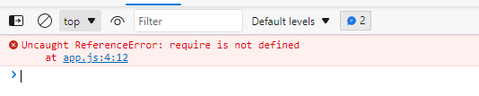

4.打包处理js

再当前的目录下，再重新安装下之前的`uniq`

然后在根目录下运行`browserify js/src/app.js -o js/dist/bundle.js`

打包后的bundle.js的具体内容如下（已经将代码格式化了）：

```javascript
(function () {
    function r(e, n, t) {
        function o(i, f) {
            if (!n[i]) {
                if (!e[i]) {
                    var c = "function" == typeof require && require;
                    if (!f && c) return c(i, !0);
                    if (u) return u(i, !0);
                    var a = new Error("Cannot find module '" + i + "'");
                    throw a.code = "MODULE_NOT_FOUND", a
                }
                var p = n[i] = {exports: {}};
                e[i][0].call(p.exports, function (r) {
                    var n = e[i][1][r];
                    return o(n || r)
                }, p, p.exports, r, e, n, t)
            }
            return n[i].exports
        }

        for (var u = "function" == typeof require && require, i = 0; i < t.length; i++) o(t[i]);
        return o
    }

    return r
})()({
    1: [function (require, module, exports) {
// app.js

// 引入第三方库，写在最开始的地方
        let uniq = require('uniq')
//console.log(uniq)
        let module1 = require('./modules/module1')
        let module2 = require('./modules/module2')
        let module3 = require('./modules/module3')

        module1.foo()
        module2()
        module3.foo()
        console.log(uniq(module3.arr))
    }, {"./modules/module1": 2, "./modules/module2": 3, "./modules/module3": 4, "uniq": 5}],
    2: [function (require, module, exports) {
// module1.js
        module.exports = {
            msg: 'module1',
            foo() {
                console.log(this.msg)
            }
        }
//console.log(module)
    }, {}],
    3: [function (require, module, exports) {
// module2.js
        module.exports = function () {
            console.log('module2')
        }

//console.log(module)
    }, {}],
    4: [function (require, module, exports) {
// module3.js
        exports.foo = function () {
            console.log('foo() module3')
        }

        exports.arr = [1, 2, 3, 2, 3]

//console.log(module)
    }, {}],
    5: [function (require, module, exports) {
        "use strict"

        function unique_pred(list, compare) {
            var ptr = 1
                , len = list.length
                , a = list[0], b = list[0]
            for (var i = 1; i < len; ++i) {
                b = a
                a = list[i]
                if (compare(a, b)) {
                    if (i === ptr) {
                        ptr++
                        continue
                    }
                    list[ptr++] = a
                }
            }
            list.length = ptr
            return list
        }

        function unique_eq(list) {
            var ptr = 1
                , len = list.length
                , a = list[0], b = list[0]
            for (var i = 1; i < len; ++i, b = a) {
                b = a
                a = list[i]
                if (a !== b) {
                    if (i === ptr) {
                        ptr++
                        continue
                    }
                    list[ptr++] = a
                }
            }
            list.length = ptr
            return list
        }

        function unique(list, compare, sorted) {
            if (list.length === 0) {
                return list
            }
            if (compare) {
                if (!sorted) {
                    list.sort(compare)
                }
                return unique_pred(list, compare)
            }
            if (!sorted) {
                list.sort()
            }
            return unique_eq(list)
        }

        module.exports = unique

    }, {}]
}, {}, [1]);

```

- 此时在index.html中引入，浏览器可以识别并正常输出
  - 上述打包的过程，相当于一个翻译的过程
- 格式化之前，该打包文件的注释、换行以及完整变量名，是没有经过处理的

我们从宏观层面上，看一下bundle.js

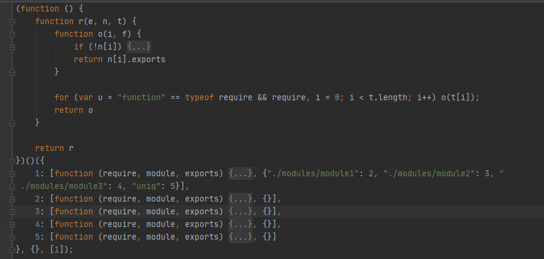

- 这是一个带有3个参数的立即执行函数，这个立即执行函数是先返回了一个r函数，然后再调用r函数）

  - 第一个实参是一个对象，该对象的第一个键值包含了入口文件信息，剩余键值包含了各模块信息
  - 第二个实参是一个空对象
  - 第三个实参是一个数组，（我猜是）指定入口文件，与第一个实参关联

- 核心代码是`o函数`和for循环

  - for循环
    - 定义`u`，是一个布尔值，值为对`require`判断是否为`function`的结果；定义`i`，初始值为0
    - 循环条件为`t`的长度，t就是第三个传入的实参`[1]`，由于`i++`这个循环只会执行一次
    - 方法体为，实参为`t[i]`的o函数
  - o函数
    - 内部有一条连续赋值的语句。[js中变量的连续赋值 ](https://www.cnblogs.com/qiujianmei/p/7135428.html)
    - 其他细节（待添加）

- 给bundle.js打断点。[ 6 种JavaScript的打断点的方式](https://www.php.cn/js-tutorial-488885.html)

  我们一步步的执行，然后在执行`foo()`函数之前，看一下bundle.js为我们做了哪些

  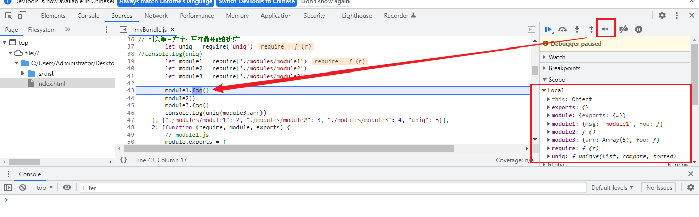

  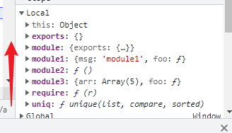

  

  我的大致理解：

  - 递归找到`i`的值，最终读取的结果，都放在了本地变量中
  - `browserify`读取文件依赖并打包后的`bundle.js`，本质是多个闭包组成的运行的环境，闭包的实参被设计成`key`为数值，`value`为数组的的实参，依赖模块作为该`value`的第一项，依赖路径被作为第二项
  - 可以多看看断点运行的每一步，每个变量值的变化及作用域的变化

- 请注意：bundle.js的执行流程是同步的

- `bundle.js`形成依赖于哪些没必要深究，即`browserify js/src/app.js -o js/dist/bundle.js`，即这个命令下做了哪些事情我们没必要知道，只要知道他是个转换器，可以让我们以模块化的方式写代码即可。

  - 但`bundle.js`里面的js代码是如何运行的，起码要知道个大概，即要知道我们一模块化写的代码，最后在生产环境是以怎样的方式运行的


### 2.2.AMD

- CommonJS规范加载模块是同步的，也就是说，只有加载完成，才能执行后面的操作。

- AMD规范则是非同步加载模块，允许指定回调函数。
- 由于Node.js主要用于服务器编程，模块文件一般都已经存在于本地硬盘，所以加载起来比较快，不用考虑非同步加载的方式，所以CommonJS规范比较适用。
- 但是，如果是浏览器环境，要从服务器端加载模块，这时就必须采用非同步模式，因此浏览器端一般采用AMD规范。此外AMD规范比CommonJS规范在浏览器端实现要来的早。

#### 2.2.1.AMD规范的基本语法

**定义暴露模块：**

```javascript
//定义没有依赖的模块
define(function(){
   return 模块
})
```


```javascript
//定义有依赖的模块
define(['module1', 'module2'], function(m1, m2){
   return 模块
})
```


**引入使用模块：**

```javascript
require(['module1', 'module2'], function(m1, m2){
   使用m1/m2
})
```

#### 2.2.2.未使用AMD规范与使用require.js

通过比较两者的实现方法，来说明使用AMD规范的好处。

- 未使用AMD规范

1.创建目录结构

```
|-NoAMD
  |-js
  	|-modules
      |-dataService.js
      |-alerter.js
    |-main.js
  |-index.html
```

2.定义模块代码

```javascript
// dataService.js文件
(function (window) {
    let msg = 'www.baidu.com'
    function getMsg() {
        return msg.toUpperCase()
    }
    window.dataService = {getMsg}
})(window)

```


```javascript
// alerter.js文件
(function (window, dataService) {
    let name = 'Tom'
    function showMsg() {
        alert(dataService.getMsg() + ', ' + name)
    }
    window.alerter = {showMsg}
})(window, dataService)

```


```javascript
// main.js文件
(function (alerter) {
    alerter.showMsg()
})(alerter)

```


```html
// index.html文件
<div><h1>Module Demo 1: 未使用AMD(require.js)</h1></div>
<script type="text/javascript" src="js/modules/dataService.js"></script>
<script type="text/javascript" src="js/modules/alerter.js"></script>
<script type="text/javascript" src="js/main.js"></script>

```


3.结果


4.小结

这种方式缺点很明显：**首先会发送多个请求，其次引入的js文件顺序不能搞错，否则会报错！**

在没有模块化规范时，自己设计就是如上类似的过程，给window全局对象添加属性。

但是依赖一旦变多，会容易出错。

- 使用`require.js`

RequireJS是一个工具库，主要用于客户端的模块管理。它的模块管理遵守AMD规范，**RequireJS的基本思想是，通过define方法，将代码定义为模块；通过require方法，实现代码的模块加载**。 接下来介绍AMD规范在浏览器实现的步骤：

1.下载`require.js`

- 官网: `https://requirejs.org/`
- github : `https://github.com/requirejs/requirejs`

然后将require.js导入项目:` js/libs/require.js`

2.创建项目结构

```
|-js
  |-libs
    |-require.js
  |-modules
    |-alerter.js
    |-dataService.js
  |-main.js
|-index.html

```

3.定义require.js的代码

```javascript
// dataService.js
// 定义没有依赖的模块
define(function () {
    let msg = "www.baidu.com"
    function getMsg() {
        return msg.toUpperCase()
    }
    return { getMsg } // 暴露模块
})
```


```javascript
// alerter.js
// 定义有依赖的模块
define(['dataService'], function (dataService) {
    let name = "Tom"
    function showMsg() {
        alert(dataService.getMsg() + ', ' + name)
    }
    // 暴露模块
    return { showMsg }
})
```


```javascript
// main.js

(function () {
    require.config({
        baseUrl: 'js', // 基本路径
        paths: { // 配置路径
            dataService: './modules/dataService', // 不要加js后缀，require.js自己给你加了
            alerter: './modules/alerter'
        }
    })

    requirejs(['alerter'], function (alerter) {
        alerter.showMsg() // 主文件不需要再暴露了
    })
})()
```


```html
<!doctype html>
<html lang="en">
<head>
    <title>Module RequireJS</title>
</head>
<body>
<!--引入require.jg并指定js主文件入口-->
<script data-main="./js/main.js" src="./js/libs/require.js"></script>
<script>
    /**
     * 1.先找的是require.js文件
     * 2.require.js发挥作用后，找data-main这个自定义节点，去找入口文件（主模块）
     */
</script>
</body>
</html>
```


#### 2.2.3.如何引入第三方库

第三方库写在`main.js`中的`paths`配置中

引入jquery

```javascript
// main.js

(function () {
    require.config({
        baseUrl: 'js/', // 基本路径，出发点在根目录下。最后是要和paths里面的路径拼接的。如果注释了baseUrl，则从main.js的所在路径出发（就不验证了，只要保证路径没问题即可）
        paths: { // 配置路径
            dataService: './modules/dataService', // 不要加js后缀，require.js自己给你加了
            alerter: './modules/alerter',
            // 第三方模块
            jquery: './libs/jquery-3.6.0' // 不能大写
        }
    })

    requirejs(['alerter'], function (alerter) {
        alerter.showMsg() // 主文件不需要再暴露了
    })
})()
```

使用jquery

```javascript
// alerter.js
// 定义有依赖的模块
define(['dataService', 'jquery'], function (dataService, $) { // jquery不能大写
    let name = "Tom"
    function showMsg() {
        alert(dataService.getMsg() + ', ' + name)
    }
    $('body').css('background', 'green')
    // 暴露模块
    return { showMsg }
})
```

jquery不能大写的原因：

下载jquery-3.6.0，我们看jquery源码的最后一部分：

```javascript
if ( typeof define === "function" && define.amd ) {
	define( "jquery", [], function() {
		return jQuery;
	} );
}

```

它会判断当前代码是否支持AMD规范，如果支持，就自己定义了一个小写的`jquery`模块，把本身的大写的`jQuery`暴露出去

所以在AMD中，引入jquery时，只要引入它暴露的`jquery`即可

问题：是不是所有第三方模块都支持AMD规范呢？

```javascript
// main.js

(function () {
    const requireConfig = require.config({
        baseUrl: 'js/', // 基本路径，出发点在根目录下。最后是要和paths里面的路径拼接的。如果注释了baseUrl，则从main.js的所在路径出发（就不验证了，只要保证路径没问题即可）
        paths: { // 配置路径
            dataService: './modules/dataService', // 不要加js后缀，require.js自己给你加了
            alerter: './modules/alerter',
            // 第三方模块
            jquery: './libs/jquery-3.6.0',
            // 引入angular
            angular: './libs/angular'
        },
        shim: {
            angular: {
                deps: [],
                exports: 'angular'
            }
        }
    })
    console.log(requireConfig)

    const requireJs = requirejs(['alerter'], function (alerter) {
        console.log('alerter被引入了', alerter)

        alerter.showMsg() // 主文件不需要再暴露了
    })
    console.log(requireJs)

})()
```

angular需要额外的shim配置

RequireJS中如果使用AMD规范,在使用的过程中没有太多的问题,如果加载非AMD规范的JS文件,就需要使用Require中的shim，

(1) paths 中配置文件加载的路径, JSON中的 Key值可以随意,尽量有意义，JSON中的Value是文件的加载路径,这个不必多说

(2) shim 中定义一个JSON对象, Key 值(angular) 与paths中定义的名字一样

(3) shim中的JSON对象有两个属性: deps,exports ;  deps 为数组,表示其依赖的库, exports 表示输出的对象名


requirejs可以实现js的延时加载, 在方法调用的时候加载JS,也就是在function 中require 某个模块的信息


```javascript
define(function(){
    var ProductManager={
        Create:function(){
            console.log("创建产品");

            require(["cate"],function(cate){
                cate.Write();
                cate.Add();
            });
        }
	}

	return ProductManager;
});
```


#### 2.2.4.我的理解

- 不同于CommonJS在浏览器端还需要打包，AMD规范通过require.js，来对按照其规范书写的代码，直接进行解析

- CommonJS中，定义模块时将数据存到module.exports中，那么requre.js呢

  我们在每个js文件，定义各自的打印语句

  ```javascript
  // dataService.js
  // 定义没有依赖的模块
  define(function () {
      let msg = "www.baidu.com"
      function getMsg() {
          return msg.toUpperCase()
      }
      console.log('dataService被定义了')
      return { getMsg } // 暴露模块
  })
  
  // alerter.js
  // 定义有依赖的模块
  define(['dataService', 'jquery'], function (dataService, $) {
      console.log('dataService被引入了', dataService)
      console.log('jquery被引入了', $)
      let name = "Tom"
      function showMsg() {
          alert(dataService.getMsg() + ', ' + name)
      }
      $('body').css('background', 'skyblue')
  
      console.log('alerter被暴露了')
      // 暴露模块
      return { showMsg }
  })
  
  // main.js
  
  (function () {
      const requireConfig = require.config({
          baseUrl: 'js/', // 基本路径，出发点在根目录下。最后是要和paths里面的路径拼接的。如果注释了baseUrl，则从main.js的所在路径出发（就不验证了，只要保证路径没问题即可）
          paths: { // 配置路径
              dataService: './modules/dataService', // 不要加js后缀，require.js自己给你加了
              alerter: './modules/alerter',
              // 第三方模块
              jquery: './libs/jquery-3.6.0'
          }
      })
      console.log(requireConfig)
  
      const requireJs = requirejs(['alerter'], function (alerter) {
          console.log('alerter被引入了', alerter)
  
          alerter.showMsg() // 主文件不需要再暴露了
      })
      console.log(requireJs)
  
  })()
  ```

​      结果如下：

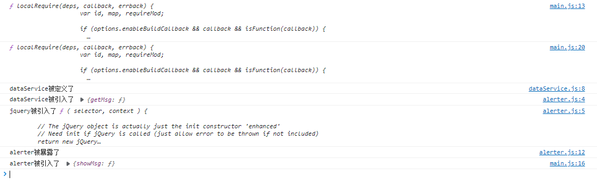

可以直观的看到，通过`define()`和`requirejs()`引入第三方模块时，每个第三方模块的变量，都各自指向一个被暴露的对象

其他的看不出啥了

仍然存在很多问题，理解的不如CommonJS清晰，但暴露模块、引入自定义和第三方模块在语法使用层面没多大问题了

### 2.3.CMD

#### 2.3.1CMD规范基本语法

专门用于浏览器端，模块的加载是异步的

模块在使用时才会加载执行

定义暴露模块:

```
define()
exports
module.exports
```

依赖模块：

```
require()
```


```javascript
// 定义没有依赖的模块
define(function(require, exports, module) {
    exports.xxx =  value
    module.exports = value
})

// 定义有依赖的模块
define(function(require, exports, module) {
    // 同步引入依赖
    var module2 = require("./module2")

    // 异步引入依赖
    require.async("./module3", function (m3) {

    })

    // 暴露模块
    exports.xxx =  value
    module.exports = value
})
```

引入使用模块：

```javascript
define(function (require) {
  var m1 = require('./module1')
  var m4 = require('./module4')
  m1.show()
  m4.show()
})

```

如何使用模块：

```html
<script type="text/javascript">
  seajs.use('./js/modules/main')
</script>
```


#### 2.3.2 sea.js简单使用

**下载sea.js并引入**

- 官网: [seajs.org/](https://link.juejin.cn/?target=http%3A%2F%2Fseajs.org%2F) （已经凉了）
- github : [github.com/seajs/eajs](https://link.juejin.cn/?target=https%3A%2F%2Fgithub.com%2Fseajs%2Fseajs)

然后将`sea.js`导入项目:` js/libs/sea.js`

**创建项目结构**

```
|-js
  |-libs
    |-sea.js
  |-modules
    |-module1.js
    |-module2.js
    |-module3.js
    |-module4.js
    |-main.js
|-index.html

```

 **定义sea.js的模块代码**

```javascript
// module1.js文件
define(function (require, exports, module) {
  //内部变量数据
  var data = 'atguigu.com'
  //内部函数
  function show() {
    console.log('module1 show() ' + data)
  }
  //向外暴露
  exports.show = show
})

```


```javascript
// module2.js文件
define(function (require, exports, module) {
  module.exports = {
    msg: 'I Will Back'
  }
})

```


```javascript
// module3.js文件
define(function(require, exports, module) {
  const API_KEY = 'abc123'
  exports.API_KEY = API_KEY
})

```


```javascript
// main.js文件
define(function (require) {
  var m1 = require('./module1')
  var m4 = require('./module4')
  m1.show()
  m4.show()
})

```

**在index.html中引入**

```javascript
<script type="text/javascript" src="js/libs/sea.js"></script>
<script type="text/javascript">
  seajs.use('./js/modules/main')
</script>

```


### 2.4.ES6

教程参考：https://es6.ruanyifeng.com/#docs/module

ES6 模块的设计思想是尽量的静态化，使得编译时就能确定模块的依赖关系，以及输入和输出的变量。

CommonJS 和 AMD 模块，都只能在运行时确定这些东西。比如，CommonJS 模块就是对象，输入时必须查找对象属性。


#### 2.4.1.ES6模块化语法

`export`命令用于规定模块的对外接口，`import`命令用于输入其他模块提供的功能。

- 解构赋值：https://es6.ruanyifeng.com/#docs/destructuring

```javascript
/** 定义模块 math.js **/
var basicNum = 0;
var add = function (a, b) {
    return a + b;
};
export { basicNum, add };
/** 引用模块 **/
import { basicNum, add } from './math';
// 引入模块，是以对象的解构赋值的形式来拿的
// 类似于 {basicNum, add} = {basicNum, add}
// {导入定义的变量} = {导出定义的变量}
function test(ele) {
    ele.textContent = add(99 + basicNum);
}

```

如上例所示，使用`import`命令的时候，用户需要知道所要加载的变量名或函数名，否则无法加载。

为了给用户提供方便，让他们不用阅读文档就能加载模块，就要用到`export default`命令，为模块指定默认输出，称为**默认暴露**。

```javascript
// export-default.js
export default function () {
  console.log('foo');
}

```

导入默认暴露的模块

```javascript
// import-default.js
import customName from './export-default';
customName(); // 'foo'
//此时自己定义的customName就是一个函数

```

模块默认输出, 其他模块加载该模块时，`import`命令可以为该匿名函数指定任意名字。

默认暴露，只能写一次，如果想要默认暴露很多数据，都写在一个对象里面就可以了。

如果多个`import`语句之间有其他代码，`vue-cli`执行时会把所有的`import`语句汇总在最上方再执行，所以要注意插件的安装时机和使用时机

#### 2.4.2.实现（浏览器端）

**使用Babel将ES6编译为ES5代码**：ES6本身的语法，有的浏览器并不支持

- 官网：https://www.babeljs.cn/docs/

**使用Browserify编译打包js**：进行模块化处理（思考：浏览器端ES6和CommonJS都用到了browserify，那么两者有什么区别呢）


步骤：

- 定义package.json文件

  ```json
   {
     "name" : "es6-babel-browserify",
     "version" : "1.0.0"
   }
  ```

- 安装babel相关的模块：https://www.babeljs.cn/docs/usage

  ```
    老教程，可以忽略了：
    //全局安装babel-cli和browserify
    npm install babel-cli browserify -g
    npm install babel-preset-es2015 --save-dev
    
    //自己摸索的
    // 这个命令是官网上的
    npm install -save-dev @babel/core @babel/cli @babel/preset-env
    // 不过还要全局安装@babel-cli，不然babel命令出不来，官网上说 `可以利用 npm@5.2.0 所自带的 npm 包运行器将 ./node_modules/.bin/babel 命令缩短为 npx babel`，但是并没有
    
    // 咱还是全局安装一下吧
    npm install @babel/cli browserify -g
    
  
  ```

  安装之后，本地的`package.json`内容如下：

  

  ```json
  {
    "name": "es6-babel-browserify",
    "version": "1.0.0",
    "devDependencies": {
      "@babel/cli": "^7.17.6", // 负责解析babel相关的命令行
      "@babel/core": "^7.17.7",
      "@babel/preset-env": "^7.16.11" // preset：一组预先设定的插件，env：名称为env的preset
    }
  }
  
  ```

  

- 定义.babelrc文件，`rc`表示`run control`，`运行控制`，这是`babel`的运行控制文件

  ```
  {
    "presets": ["es2015"]
  }
  ```

  - 如果没有`.babelrc`文件，直接执行babel的打包命令，表示**不依赖任何预设环境**（将来的环境完全支持新特性的语法），代码将原样输出，相当于做了个复制文件的操作
  - `.babelrc`和`babel-preset-es2015`对应，不过官方已经不推荐使用`babel-preset-es2015`模块了，推荐使用`@babel/preset-env`

- 可以看官网最新的指南，这里定义`babel.config.json`，同理，该文件也相当于`babel`的运行控制文件

  - 就相当于告诉babel编译器，你要把你写的模块化的代码，运行在哪些环境上，因为老环境和新环境支持的特性是不一样的
  - 现在，名为 `env` 的 preset 只会为目标浏览器中没有的功能加载转换插件。

  ```json
   {
      "presets": [
        [
          "@babel/preset-env",
          {
            "targets": {
              "edge": "17",
              "firefox": "60",
              "chrome": "67",
              "safari": "11.1"
            },
            "useBuiltIns": "usage", // 只包含所需要的 polyfill
            "corejs": "3.6.5"
          }
        ]
      ]
    }
  ```

- 定义模块代码

  module1.js

  ```javascript
  //module1.js文件
  // 分别暴露
  export function foo() {
      console.log('foo() module1')
  }
  export function bar() {
      console.log('bar() module1')
  }
  
  ```

  module2.js

  ```javascript
  //module2.js文件
  // 统一暴露
  function fun1() {
      console.log('fun1() module2')
  }
  function fun2() {
      console.log('fun2() module2')
  }
  export { fun1, fun2 }
  
  ```

  module3.js

  ```javascript
  //module3.js文件
  // 默认暴露 可以暴露任意数据类项，暴露什么数据，接收到就是什么数据
  export default () => {
      console.log('默认暴露')
  }
  
  ```

  main.js

  ```javascript
  // main.js文件
  import { foo, bar } from './module1'
  import { fun1, fun2 } from './module2'
  import module3 from './module3'
  foo()
  bar()
  fun1()
  fun2()
  module3()
  
  ```

  index.html

  ```html
  <!DOCTYPE html>
  <html lang="en">
  <head>
      <meta charset="UTF-8">
      <title>Title</title>
  </head>
  <body>
      <script src="./js/src/main.js"></script>
  </body>
  </html>
  ```

  直接引入看控制台，报如下错误：

  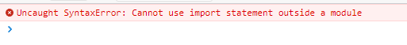

  我们需要使用babel命令，将ES6新特性语法转换成ES5的

  `babel js/src/ -d js/lib`，`-d`表示`--out-dir`，可以通过`babel -help`查看

  转换后的代码如下：

  module1.js

  ```javascript
  "use strict";
  
  Object.defineProperty(exports, "__esModule", {
    value: true
  });
  exports.bar = bar;
  exports.foo = foo;
  
  //module1.js文件
  // 分别暴露
  function foo() {
    console.log('foo() module1');
  }
  
  function bar() {
    console.log('bar() module1');
  }
  ```

  module2.js

  ```javascript
  "use strict";
  
  Object.defineProperty(exports, "__esModule", {
    value: true
  });
  exports.fun1 = fun1;
  exports.fun2 = fun2;
  
  //module2.js文件
  // 统一暴露
  function fun1() {
    console.log('fun1() module2');
  }
  
  function fun2() {
    console.log('fun2() module2');
  }
  ```

  module3.js

  ```javascript
  "use strict";
  
  Object.defineProperty(exports, "__esModule", {
    value: true
  });
  exports.default = void 0;
  
  //module3.js文件
  // 默认暴露 可以暴露任意数据类项，暴露什么数据，接收到就是什么数据
  var _default = () => {
    console.log('默认暴露');
  };
  
  exports.default = _default;
  ```

  main.js

  ```javascript
  "use strict";
  
  var _module = require("./module1");
  
  var _module2 = require("./module2");
  
  var _module3 = _interopRequireDefault(require("./module3"));
  
  function _interopRequireDefault(obj) { return obj && obj.__esModule ? obj : { default: obj }; }
  
  // main.js文件
  (0, _module.foo)();
  (0, _module.bar)();
  (0, _module2.fun1)();
  (0, _module2.fun2)();
  (0, _module3.default)();
  ```

- babel转换后的主入口模块，用到了require语法（包含了CommonJS语法）

  - 根据前面的知识，使用browserify再转换一下

    - 在`js`目录下新建`dist`目录

    - 执行命令`browserify js/lib/main.js -o js/dist/bundle.js`

    - 又看到了当初熟悉的代码

      ```javascript
      (function () {
          function r(e, n, t) {
              function o(i, f) {
                  if (!n[i]) {
                      if (!e[i]) {
                          var c = "function" == typeof require && require;
                          if (!f && c) return c(i, !0);
                          if (u) return u(i, !0);
                          var a = new Error("Cannot find module '" + i + "'");
                          throw a.code = "MODULE_NOT_FOUND", a
                      }
                      var p = n[i] = {exports: {}};
                      e[i][0].call(p.exports, function (r) {
                          var n = e[i][1][r];
                          return o(n || r)
                      }, p, p.exports, r, e, n, t)
                  }
                  return n[i].exports
              }
      
              for (var u = "function" == typeof require && require, i = 0; i < t.length; i++) o(t[i]);
              return o
          }
      
          return r
      })()({
          1: [function (require, module, exports) {
              "use strict";
      
              var _module = require("./module1");
      
              var _module2 = require("./module2");
      
              var _module3 = _interopRequireDefault(require("./module3"));
      
              function _interopRequireDefault(obj) {
                  return obj && obj.__esModule ? obj : {default: obj};
              }
      
      // main.js文件
              (0, _module.foo)();
              (0, _module.bar)();
              (0, _module2.fun1)();
              (0, _module2.fun2)();
              (0, _module3.default)();
          }, {"./module1": 2, "./module2": 3, "./module3": 4}], 2: [function (require, module, exports) {
              "use strict";
      
              Object.defineProperty(exports, "__esModule", {
                  value: true
              });
              exports.bar = bar;
              exports.foo = foo;
      
      //module1.js文件
      // 分别暴露
              function foo() {
                  console.log('foo() module1');
              }
      
              function bar() {
                  console.log('bar() module1');
              }
          }, {}], 3: [function (require, module, exports) {
              "use strict";
      
              Object.defineProperty(exports, "__esModule", {
                  value: true
              });
              exports.fun1 = fun1;
              exports.fun2 = fun2;
      
      //module2.js文件
      // 统一暴露
              function fun1() {
                  console.log('fun1() module2');
              }
      
              function fun2() {
                  console.log('fun2() module2');
              }
          }, {}], 4: [function (require, module, exports) {
              "use strict";
      
              Object.defineProperty(exports, "__esModule", {
                  value: true
              });
              exports.default = void 0;
      
      //module3.js文件
      // 默认暴露 可以暴露任意数据类项，暴露什么数据，接收到就是什么数据
              var _default = () => {
                  console.log('默认暴露');
              };
      
              exports.default = _default;
          }, {}]
      }, {}, [1]);
      
      ```

      

- 在index.html中引入，效果如下：

  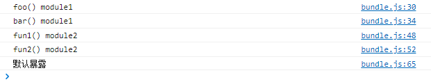

- 回顾

  - 使用Babel将ES6编译为ES5代码(但包含CommonJS语法) : `babel js/src -d js/lib`
    - 实操完之后，关于这三个模块的详细描述，及相互之间的关系，可以再看一遍babel官网：https://www.babeljs.cn/docs/usage，以进一步加深理解
  - 使用Browserify编译js : `browserify js/lib/main.js -o js/dist/bundle.js`


**引入第三方库**

jquery2版本和3版本的针对的是高版本浏览器，2版本已经不更新，只维护了，3版本仍在更新

一般使用1版本就够了，安装1版本最新的：`npm install jquery@1`

在`main.js`中引入

```javascript
// main.js文件
import { foo, bar } from './module1'
import { fun1, fun2 } from './module2'
import module3 from './module3'
import $ from 'jquery'

foo()
bar()
fun1()
fun2()
module3()
$('body').css('background', 'pink')
```

重新打包引入，效果如下：


#### 2.4.4.ES6和CommonJS的差异

- CommonJS 模块输出的是一个值的拷贝，ES6 模块输出的是值的引用。

  - ES6 模块的运行机制与 CommonJS 不一样。**ES6 模块是动态引用，并且不会缓存值，模块里面的变量绑定其所在的模块**。

  - CommonJS例子

    ```javascript
    // lib.js
    export let counter = 3;
    export function incCounter() {
      counter++;
    }
    // main.js
    import { counter, incCounter } from './lib';
    console.log(counter); // 3
    incCounter();
    console.log(counter); // 4
    
    ```

    

- CommonJS 模块是运行时加载，ES6 模块是编译时输出接口。

  - 第二个差异是因为 CommonJS 加载的是一个对象（即module.exports属性），该对象只有在脚本运行完才会生成。
  - 而 ES6 模块不是对象，它的对外接口只是一种静态定义，在代码静态解析阶段就会生成。

- 我的理解：我不理解

### 2.5.小结

- CommonJS规范主要用于服务端编程，加载模块是同步的，这并不适合在浏览器环境，因为同步意味着阻塞加载，浏览器资源是异步加载的，因此有了AMD CMD解决方案。

- AMD规范在浏览器环境中异步加载模块，而且可以并行加载多个模块。不过，AMD规范开发成本高，代码的阅读和书写比较困难，模块定义方式的语义不顺畅。

- CMD规范与AMD规范很相似，都用于浏览器编程，依赖就近，延迟执行，可以很容易在Node.js中运行。不过，依赖SPM 打包，模块的加载逻辑偏重

- **ES6 在语言标准的层面上，实现了模块功能，而且实现得相当简单，完全可以取代 CommonJS 和 AMD 规范，成为浏览器和服务器通用的模块解决方案**。

## 3.扩展阅读

package.lock.json是什么？

- 这是npm5的特征

