[toc]

# JS模块化

## 1.理解

### 1.1.什么是模块/模块化

#### 1.1.1.目的

- 将一个复杂的程序，依据一定的规则（规范）封装成几个块（文件），并进行组合在一起；
  - 解耦
  - 功能点明确，方便后期维护（不可能在一个文件里写一万行代码吧）
  - 避免污染全局环境

- 块的内部数据/实现，是私有的，但会向外暴露一些接口（方法）与外部其他模块通信；

#### 1.1.2.模块化的进化史

- 最早我们是这样写代码的

  - 这样会导致Global被污染，很容易命名冲突

  ```javascript
  function foo() {
  	...
  }
  
  function bar() {
  	...
  }
  ```

- 接着，进行简单封装：`Namespace模式`

  - 减少Global上的变量数量
  - 本质是对象，但在JS中，我们可以直接修改对象的属性，一点都不安全

  ```javascript
  <script>
      let myModule = {
          data: 'www.baidu.com',
          foo() {
              console.log(`foo() ${this.data}`)
          },
          bar() {
              console.log(`bar() ${this.data}`)
          }
      }
      myModule.foo() // www.baidu.com
      myModule.data = "change data"
      myModule.foo() // change data
  </script>
  ```

  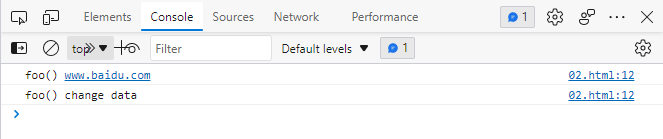

- 接着，使用匿名闭包：`IIFE模式`，匿名函数自调用(闭包)

  - 函数是JS唯一的LocalScope
  - 作用: 数据是私有的, 外部只能通过暴露的方法操作
  - 编码: 将数据和行为封装到一个函数内部, 通过给window添加属性来向外暴露接口
  - 问题: 如果当前这个模块依赖另一个模块怎么办?
  - 我的理解：
    - 就是在构建的私有作用域（闭包）中，给全局对象添加属性


  module.js

  ```javascript
(function (window) {
    // 定义在闭包内的私有数据
    let data = 'www.baidu.com'
    // 私有函数
    function innerFunc() {
        console.log('innerFunc()')
        console.log(arguments.callee.caller)
    }
    // 向外暴露私有数据的函数
    function foo() {
        console.log(`foo():${data}`)
    }
    function bar() {
        console.log(`bar():${data}`)
        innerFunc()
    }
    // 给传入的window实参，添加myModule属性
    window.myModule = {
        foo,
        bar
    }
})(window)
  ```

  index.html

  ```html
<!doctype html>
<html lang="en">
<head>
    <meta charset="UTF-8">
    <meta name="viewport"
          content="width=device-width, user-scalable=no, initial-scale=1.0, maximum-scale=1.0, minimum-scale=1.0">
    <meta http-equiv="X-UA-Compatible" content="ie=edge">
    <title>Document</title>
</head>
<body>
<!--引入自定义的module模块-->
    <script src="./module.js"></script>
    <script>
        // 使用自定义模块中，向外暴露的方法
        // 能用是因为module.js中，已经给window加了myModule属性
        myModule.foo()
        myModule.bar()
    </script>
</body>
</html>
  ```

  效果：

  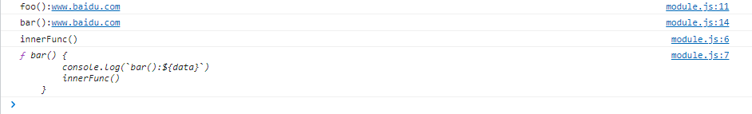

  window对象上，多了一个myModule属性

  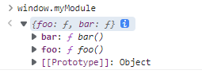

- 接着，再增强一点：`引入依赖`

  - 这就是`模块模式`，也是现代模块实现的基石

  module.js

  ```javascript
  (function (window, $) {
      // 定义在闭包内的私有数据
      let data = 'www.baidu.com'
      // 私有函数
      function innerFunc() {
          console.log('innerFunc()')
          console.log(arguments.callee.caller)
      }
      // 向外暴露私有数据的函数
      function foo() {
          console.log(`foo():${data}`)
          $('body').css('background', 'pink')
      }
      function bar() {
          console.log(`bar():${data}`)
          innerFunc()
      }
      // 给传入的window实参，添加myModule属性
      window.myModule = {
          foo,
          bar
      }
  })(window,jQuery)
  ```

  index.html

  ```html
  <!doctype html>
  <html lang="en">
  <head>
      <meta charset="UTF-8">
      <meta name="viewport"
            content="width=device-width, user-scalable=no, initial-scale=1.0, maximum-scale=1.0, minimum-scale=1.0">
      <meta http-equiv="X-UA-Compatible" content="ie=edge">
      <title>Document</title>
  </head>
  <body>
  <!--先引入jquery全局对象-->
      <script src="./jquery-3.6.0.min.js"></script>
  <!--再引入自定义的module模块-->
      <script src="./module.js"></script>
      <script>
          // 使用自定义模块中，向外暴露的方法
          // 能用是因为module.js中，已经给window加了myModule属性
          myModule.foo()
          myModule.bar()
          console.log(myModule.data) // undefined
      </script>
  </body>
  </html>
  ```

  效果：

  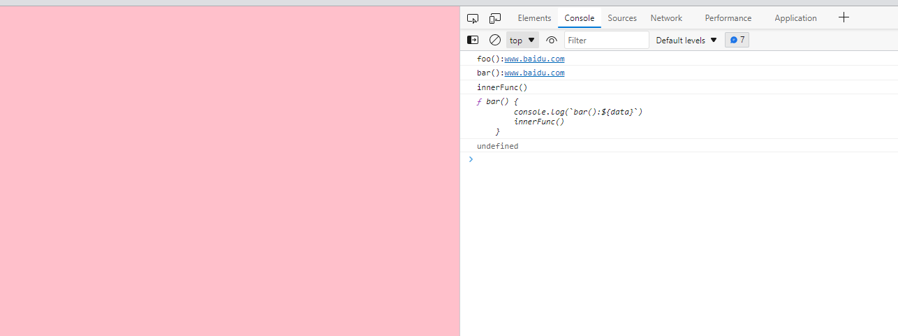

  上述例子在自定义模块中，通过jquery方法将页面的背景颜色改成粉色，所以必须先引入jQuery库，就把这个库当作参数传入。此时window对象，已经挂载了jQuery属性

  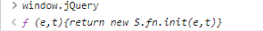

  **这样做除了保证模块的独立性，还使得模块之间的依赖关系变得明显。**

  我的理解：

  可以给自定义模块，传递任意多个全局对象属性，作为自定义模块的参数，事实上，只要传递一个window对象就已经可以了，但为了调用书写方便，以及看上去直观，我们用到哪个库，就会把它作为参数传递一下，显示强调自定义模块在**引入依赖**

  只要保证jQuery对象，在html中先被引入，如下通过window.jQuery调用也是可以的：

  ```javascript
  (function (window) {
  	...
      function foo() {
          window.jQuery('body').css('background', 'pink')
      }
  	...
  })(window)
  ```

  

### 1.2.为什么要模块化

- Web sites are turning into Web Apps
- Code complexity(复杂度) grows as the site gets bigger
- Highly decoupled(解耦) JS files/modules is wanted
- Deployment(部署) wants optimized(优化) code in few HTTP calls

### 1.3.模块化的好处

- 避免命名冲突(减少命名空间污染)
- 更好的分离, 按需加载
- 更高复用性
- 高可维护性

### 1.4.页面引入加载script

引入多个`<script>`后出现的问题

- 请求过多

首先我们要依赖多个模块，那样就会发送多个请求，导致请求过多

- 依赖模糊

我们不知道他们的具体依赖关系是什么，也就是说很容易因为不了解他们之间的依赖关系导致加载先后顺序出错。

- 难以维护

以上两种原因就导致了很难维护，很可能出现牵一发而动全身的情况导致项目出现严重的问题。

 模块化固然有多个好处，然而一个页面需要引入多个js文件，就会出现以上这些问题。而这些问题可以通过模块化规范来解决，下面介绍开发中最流行的commonjs, AMD, ES6, CMD规范。


我的理解：可以有一个黑盒子，在本地先将多个模块，上线时封装成一个模块，同时这个黑盒子可以自己管理每个文件具体的依赖。作为开发者，前期只要知道这个黑盒子的使用及维护即可。

## 2.模块化规范

### 2.1.CommonJS

#### 2.1.1.概述

- Node 应用由模块组成，采用 CommonJS 模块规范。

- 每个js文件就是一个模块，有自己的作用域。在一个文件里面定义的变量、函数、类，都是私有的，对其他文件不可见。
- 在服务器端，模块的加载是运行时同步加载的。
- 在浏览器端，模块需要提前编译打包处理。

#### 2.1.2.特点

- 所有代码都运行在模块作用域，不会污染全局作用域。
- 模块可以多次加载，但是只会在第一次加载时运行一次，然后运行结果就被缓存了，以后再加载，就直接读取缓存结果。要想让模块再次运行，必须清除缓存。
- 模块加载的顺序，按照其在代码中出现的顺序。

#### 2.1.3.基本语法

- **暴露模块**：`module.exports = value`或`exports.xxx = value`
- 引入模块：`require(xxx)`，如果是第三方模块，xxx为模块名；如果是自定义模块，xxx为模块文件路径

**CommonJS暴露的模块到底是什么?**

新建一个js文件：

```javascript
console.log('我是module：',module)
```

在根目录执行`node filename`结果如下：

```
D:\workspace\github\md\web\code\模块化\CommmonJS>node 1.module对象是什么.js
我是module： Module {
  id: '.',
  path: 'D:\\workspace\\github\\md\\web\\code\\模块化\\CommmonJS',
  exports: {},
  filename: 'D:\\workspace\\github\\md\\web\\code\\模块化\\CommmonJS\\1.module对象是什么.js',
  loaded: false,
  children: [],
  paths: [
    'D:\\workspace\\github\\md\\web\\code\\模块化\\CommmonJS\\node_modules',
    'D:\\workspace\\github\\md\\web\\code\\模块化\\node_modules',
    'D:\\workspace\\github\\md\\web\\code\\node_modules',
    'D:\\workspace\\github\\md\\web\\node_modules',
    'D:\\workspace\\github\\md\\node_modules',
    'D:\\workspace\\github\\node_modules',
    'D:\\workspace\\node_modules',
    'D:\\node_modules'
  ]
}

```

上述信息，表示当前这个js模块（文件），所包含的一些固有信息

- id
- path：文件所在目录绝对路径
- filename：文件名绝对路径
- exports：
- loaded：
- children
- path

CommonJS规范规定，每个模块内部，module变量代表当前模块。这个变量是一个对象，它的exports属性（即module.exports）是对外的接口。**加载某个模块，其实是加载该模块的module.exports属性**。（更深刻的理解了万物皆对象，就是key:value的一种数据结构）

```javascript
// 2.给exports属性添加值.js
var x = 5;
var addX = function (value) {
    return value + x;
};
module.exports.x = x; //给当前文件的module.exports属性中，添加x
module.exports.addX = addX; ////给当前文件的module.exports属性中，addX

console.log(module)
```

可以很直观的看到，module.exports属性里，多了`x`和`addX`，exports结果如下：`exports: { x: 5, addX: [Function: addX] },`，完整打印如下：

```
D:\workspace\github\md\web\code\模块化\CommmonJS>node 2.给exports属性添加值.js
Module {
  id: '.',
  path: 'D:\\workspace\\github\\md\\web\\code\\模块化\\CommmonJS',
  exports: { x: 5, addX: [Function: addX] },
  filename: 'D:\\workspace\\github\\md\\web\\code\\模块化\\CommmonJS\\2.给exports属性添加值.js',
  loaded: false,
  children: [],
  paths: [
    'D:\\workspace\\github\\md\\web\\code\\模块化\\CommmonJS\\node_modules',
    'D:\\workspace\\github\\md\\web\\code\\模块化\\node_modules',
    'D:\\workspace\\github\\md\\web\\code\\node_modules',
    'D:\\workspace\\github\\md\\web\\node_modules',
    'D:\\workspace\\github\\md\\node_modules',
    'D:\\workspace\\github\\node_modules',
    'D:\\workspace\\node_modules',
    'D:\\node_modules'
  ]
}
```

我的思考：

- 单独的一个js文件，是不能直接拖进浏览器执行的，之所以会有Module对象这么个东西，是Node将CommonJS的规范实现了，是基于Node执行了`node filename`语句后，才会有Module对象的存在的吗？
- 还是说Module对象，是从设计层而言，就已经是这个Js文件的固有属性了呢？
- 得细品一下：Node的模块化规范，是基于CommonJS的
- 应该是前者，这个Module对象，本身不属于JS文件，只是在Node对其编译后，读取了内部的语法，基于这个JS文件，创建了包含各种附加信息的Module对象，这些个附加信息，如位置、包含的导出模块等，用以增强这个JS文件的功能。

所以**CommonJS暴露的模块到底是什么?**，这个问题，应该作如下回答：

- 在CommonJS规范的Node实现中，写在js文件内部的`module.exports = value`语句，通过Node解析，其导出的value存储在依赖执行文件的Module对象中。从代码层面来说，`暴露模块 == 给module.exports赋值`，事实上`module.exports = value`的确就是一个赋值语句。


require命令用于加载模块文件。**require命令的基本功能是，读入并执行一个JavaScript文件，然后返回该模块的exports对象。如果没有发现指定模块，会报错**。

先注释调文件2的console语句，再新建

```javascript
// 3.通过require引入模块.js
var requireModule = require('./2.给exports属性添加值')

console.log(requireModule.exports, requireModule.x)
```

结果：

```
undefined 5
```

- 我们发现，通过require函数，引入指定模块后，返回的是一个该模块对应的exports属性，而不是Module属性

- 上述代码中，`requireModule`相当于指向了文件2对应的Module对象的exports属性罢了，类似逻辑如下

  ```javascript
  var Module = {
  	exports: {
          x: 5,
          addX(value) {
              return value + x
          }
      }
  }
  var requireModule = Module.exports
  console.log(requireModule, requireModule.x)
  ```

  结果如下：

  ```
  { x: 5, addX: [Function: addX] } 5
  ```

- 只不过现在是在两个文件中，通过node实现了这样类似的逻辑

我们现在试图，更改文件2模块里的x

```javascript
// 3.通过require引入模块.js
var requireModule = require('./2.给exports属性添加值')

// 尝试修改其他其他模块的值
requireModule.x = 6
console.log(requireModule.x)
```

结果:

```
6
```

咦，怎么变了，不是说模块内的变量，修改不了的吗？

请看下一小节

#### 2.1.4.模块的加载机制

**CommonJS模块的加载机制是，输入的是被输出的值的拷贝。也就是说，一旦输出一个值，模块内部的变化就影响不到这个值。**

这点与ES6模块化有重大差异（下文会介绍），请看下面这个例子：


```javascript
// 5.模块的加载机制.js
var counter = 3;
function incCounter() {
    counter++;
}
module.exports = {
    counter: counter,
    incCounter: incCounter,
};


```


```javascript
// 6.导入5.js
var counter = require('./5.模块的加载机制').counter;
var incCounter = require('./5.模块的加载机制').incCounter;

console.log(counter);  // 3
incCounter();
console.log(counter); // 3
counter++
console.log(counter) // 4

```

上面代码说明，counter输出以后，文件5模块内部的变化就影响不到counter了。**这是因为counter是一个原始类型的值，会被缓存。除非写成一个函数，才能得到内部变动后的值**。

我的问题：

- 上一小节提出的问题，应该被接受成事实，直接在其他模块中，修改引入的模块变量，其require对应的exports值是会改变的
- 可以这样理解
  - 导出模块后，通过require引用的，是一份值的拷贝
  - 实际上，counter++改变后是拷贝后值，甚至require导入的exports对象，也是一份值的拷贝，而不会是引用的拷贝
  - 初始模块的exports该是多少还是多少


#### 2.1.5.CommonJS服务器端实现

1.下载安装node.js

2.创建项目结构

注意：用npm init 自动生成package.json时，package name（包名）不能有中文和大写

- `package.json`一般都在项目的根目录下
  - 必须要有的两个字段：`name`、`version`

```
|-modules
  |-module1.js
  |-module2.js
  |-module3.js
|-app.js
|-package.json
  {
    "name": "commonjs-node",
    "version": "1.0.0"
  }

```

3.下载第三方模块

该模块用作数据去重：`npm install uniq --save`

- npm5以上，`npm install uniq`，默认是`--save`属性的
- 下载完`uniq`后，可以去`node_modules`文件夹下，看看里面具体的内容

4.定义模块代码

```javascript
// module1.js
module.exports = {
    msg: 'module1',
    foo() {
        console.log(this.msg)
    }
}
//console.log(module)
```


```javascript
// module2.js
module.exports = function() {
    console.log('module2')
}

//console.log(module)
```


```javascript
// module3.js
exports.foo = function () {
    console.log('foo() module3')
}

exports.arr =  [1,2,3,2,3]

//console.log(module)
```


```javascript
// app.js

// 引入第三方库，写在最开始的地方
let uniq = require('uniq')
//console.log(uniq)
let module1 = require('./modules/module1')
let module2 = require('./modules/module2')
let module3 = require('./modules/module3')

module1.foo() // module1
module2() // module2
module3.foo() // foo() module3
console.log(uniq(module3.arr)) // [1,2,3]
```

重点是要理解，模块暴露的过程

#### 2.1.6.CommonJS浏览器端实现

借助Browserify

1.创建项目结构

```
|-js
  |-dist //打包生成文件的目录
  |-src //源码所在的目录
  	|- modules
      |-module1.js
      |-module2.js
      |-module3.js
    |-app.js //应用主源文件
|-index.html //运行于浏览器上
|-package.json
  {
    "name": "browserify-test",
    "version": "1.0.0"
  }

```

2.下载browserify

要安装两次

- 全局：`npm install browserify -g`
- 局部：`npm install browserify --save-dev`

装完后，`node_modules`文件夹下，有好多包，找到`browserify`的`package.json`，大致浏览一下

3.定义模块代码（同服务器端）

注意：`index.hml`文件要运行在浏览器上，	需要借助`browserify`将`app.js`文件打包编译，如果直接在`index.html`引入`app.js`会报错！

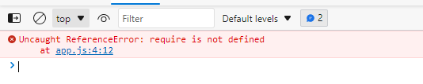

4.打包处理js

再当前的目录下，再重新安装下之前的`uniq`

然后在根目录下运行`browserify js/src/app.js -o js/dist/bundle.js`

打包后的bundle.js的具体内容如下（已经将代码格式化了）：

```javascript
(function () {
    function r(e, n, t) {
        function o(i, f) {
            if (!n[i]) {
                if (!e[i]) {
                    var c = "function" == typeof require && require;
                    if (!f && c) return c(i, !0);
                    if (u) return u(i, !0);
                    var a = new Error("Cannot find module '" + i + "'");
                    throw a.code = "MODULE_NOT_FOUND", a
                }
                var p = n[i] = {exports: {}};
                e[i][0].call(p.exports, function (r) {
                    var n = e[i][1][r];
                    return o(n || r)
                }, p, p.exports, r, e, n, t)
            }
            return n[i].exports
        }

        for (var u = "function" == typeof require && require, i = 0; i < t.length; i++) o(t[i]);
        return o
    }

    return r
})()({
    1: [function (require, module, exports) {
// app.js

// 引入第三方库，写在最开始的地方
        let uniq = require('uniq')
//console.log(uniq)
        let module1 = require('./modules/module1')
        let module2 = require('./modules/module2')
        let module3 = require('./modules/module3')

        module1.foo()
        module2()
        module3.foo()
        console.log(uniq(module3.arr))
    }, {"./modules/module1": 2, "./modules/module2": 3, "./modules/module3": 4, "uniq": 5}],
    2: [function (require, module, exports) {
// module1.js
        module.exports = {
            msg: 'module1',
            foo() {
                console.log(this.msg)
            }
        }
//console.log(module)
    }, {}],
    3: [function (require, module, exports) {
// module2.js
        module.exports = function () {
            console.log('module2')
        }

//console.log(module)
    }, {}],
    4: [function (require, module, exports) {
// module3.js
        exports.foo = function () {
            console.log('foo() module3')
        }

        exports.arr = [1, 2, 3, 2, 3]

//console.log(module)
    }, {}],
    5: [function (require, module, exports) {
        "use strict"

        function unique_pred(list, compare) {
            var ptr = 1
                , len = list.length
                , a = list[0], b = list[0]
            for (var i = 1; i < len; ++i) {
                b = a
                a = list[i]
                if (compare(a, b)) {
                    if (i === ptr) {
                        ptr++
                        continue
                    }
                    list[ptr++] = a
                }
            }
            list.length = ptr
            return list
        }

        function unique_eq(list) {
            var ptr = 1
                , len = list.length
                , a = list[0], b = list[0]
            for (var i = 1; i < len; ++i, b = a) {
                b = a
                a = list[i]
                if (a !== b) {
                    if (i === ptr) {
                        ptr++
                        continue
                    }
                    list[ptr++] = a
                }
            }
            list.length = ptr
            return list
        }

        function unique(list, compare, sorted) {
            if (list.length === 0) {
                return list
            }
            if (compare) {
                if (!sorted) {
                    list.sort(compare)
                }
                return unique_pred(list, compare)
            }
            if (!sorted) {
                list.sort()
            }
            return unique_eq(list)
        }

        module.exports = unique

    }, {}]
}, {}, [1]);

```

- 此时在index.html中引入，浏览器可以识别并正常输出
  - 上述打包的过程，相当于一个翻译的过程
- 格式化之前，该打包文件的注释、换行以及完整变量名，是没有经过处理的

我们从宏观层面上，看一下bundle.js

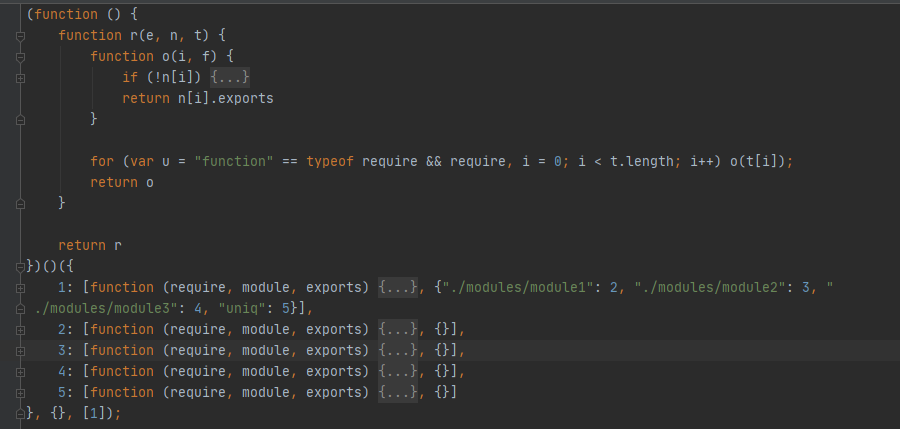

- 这是一个带有3个参数的立即执行函数，这个立即执行函数是先返回了一个r函数，然后再调用r函数）
  - 第一个实参是一个对象，该对象的第一个键值包含了入口文件信息，剩余键值包含了各模块信息
  - 第二个实参是一个空对象
  - 第三个实参是一个数组，（我猜是）指定入口文件，与第一个实参关联
  
- 核心代码是`o函数`和for循环
  - for循环
    - 定义`u`，是一个布尔值，值为对`require`判断是否为`function`的结果；定义`i`，初始值为0
    - 循环条件为`t`的长度，t就是第三个传入的实参`[1]`，由于`i++`这个循环只会执行一次
    - 方法体为，实参为`t[i]`的o函数
  - o函数
    - 内部有一条连续赋值的语句。[js中变量的连续赋值 ](https://www.cnblogs.com/qiujianmei/p/7135428.html)
    - 其他细节（待添加）
  
- 给bundle.js打断点。[ 6 种JavaScript的打断点的方式](https://www.php.cn/js-tutorial-488885.html)

  我们一步步的执行，然后在执行`foo()`函数之前，看一下bundle.js为我们做了哪些

  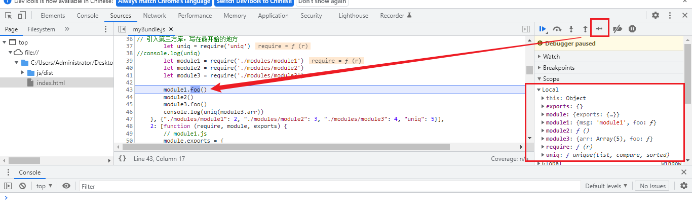

  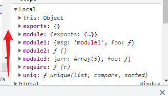

  

  我的大致理解：

  - 递归找到`i`的值，最终读取的结果，都放在了本地变量中
  - `browserify`读取文件依赖并打包后的`bundle.js`，本质是多个闭包组成的运行的环境，闭包的实参被设计成`key`为数值，`value`为数组的的实参，依赖模块作为该`value`的第一项，依赖路径被作为第二项
  - 可以多看看断点运行的每一步，每个变量值的变化及作用域的变化

- 请注意：bundle.js的执行流程是同步的

- `bundle.js`形成依赖于哪些没必要深究，即`browserify js/src/app.js -o js/dist/bundle.js`，即这个命令下做了哪些事情我们没必要知道，只要知道他是个转换器，可以让我们以模块化的方式写代码即可。

  - 但`bundle.js`里面的js代码是如何运行的，起码要知道个大概，即要知道我们一模块化写的代码，最后在生产环境是以怎样的方式运行的


### 2.2.AMD

- CommonJS规范加载模块是同步的，也就是说，只有加载完成，才能执行后面的操作。

- AMD规范则是非同步加载模块，允许指定回调函数。
- 由于Node.js主要用于服务器编程，模块文件一般都已经存在于本地硬盘，所以加载起来比较快，不用考虑非同步加载的方式，所以CommonJS规范比较适用。
- 但是，如果是浏览器环境，要从服务器端加载模块，这时就必须采用非同步模式，因此浏览器端一般采用AMD规范。此外AMD规范比CommonJS规范在浏览器端实现要来的早。

#### 2.2.1.AMD规范的基本语法

**定义暴露模块：**

```javascript
//定义没有依赖的模块
define(function(){
   return 模块
})
```


```javascript
//定义有依赖的模块
define(['module1', 'module2'], function(m1, m2){
   return 模块
})
```


**引入使用模块：**

```javascript
require(['module1', 'module2'], function(m1, m2){
   使用m1/m2
})
```

#### 2.2.2.未使用AMD规范与使用require.js

通过比较两者的实现方法，来说明使用AMD规范的好处。

- 未使用AMD规范

1.创建目录结构

```
|-NoAMD
  |-js
  	|-modules
      |-dataService.js
      |-alerter.js
    |-main.js
  |-index.html
```

2.定义模块代码

```javascript
// dataService.js文件
(function (window) {
    let msg = 'www.baidu.com'
    function getMsg() {
        return msg.toUpperCase()
    }
    window.dataService = {getMsg}
})(window)

```


```javascript
// alerter.js文件
(function (window, dataService) {
    let name = 'Tom'
    function showMsg() {
        alert(dataService.getMsg() + ', ' + name)
    }
    window.alerter = {showMsg}
})(window, dataService)

```


```javascript
// main.js文件
(function (alerter) {
    alerter.showMsg()
})(alerter)

```


```html
// index.html文件
<div><h1>Module Demo 1: 未使用AMD(require.js)</h1></div>
<script type="text/javascript" src="js/modules/dataService.js"></script>
<script type="text/javascript" src="js/modules/alerter.js"></script>
<script type="text/javascript" src="js/main.js"></script>

```


3.结果


4.小结

这种方式缺点很明显：**首先会发送多个请求，其次引入的js文件顺序不能搞错，否则会报错！**

在没有模块化规范时，自己设计就是如上类似的过程，给window全局对象添加属性。

但是依赖一旦变多，会容易出错。

- 使用`require.js`

RequireJS是一个工具库，主要用于客户端的模块管理。它的模块管理遵守AMD规范，**RequireJS的基本思想是，通过define方法，将代码定义为模块；通过require方法，实现代码的模块加载**。 接下来介绍AMD规范在浏览器实现的步骤：

1.下载`require.js`

- 官网: `https://requirejs.org/`
- github : `https://github.com/requirejs/requirejs`

然后将require.js导入项目:` js/libs/require.js`

2.创建项目结构

```
|-js
  |-libs
    |-require.js
  |-modules
    |-alerter.js
    |-dataService.js
  |-main.js
|-index.html

```

3.定义require.js的代码

```javascript
// dataService.js
// 定义没有依赖的模块
define(function () {
    let msg = "www.baidu.com"
    function getMsg() {
        return msg.toUpperCase()
    }
    return { getMsg } // 暴露模块
})
```


```javascript
// alerter.js
// 定义有依赖的模块
define(['dataService'], function (dataService) {
    let name = "Tom"
    function showMsg() {
        alert(dataService.getMsg() + ', ' + name)
    }
    // 暴露模块
    return { showMsg }
})
```


```javascript
// main.js

(function () {
    require.config({
        baseUrl: 'js', // 基本路径
        paths: { // 配置路径
            dataService: './modules/dataService', // 不要加js后缀，require.js自己给你加了
            alerter: './modules/alerter'
        }
    })

    requirejs(['alerter'], function (alerter) {
        alerter.showMsg() // 主文件不需要再暴露了
    })
})()
```


```html
<!doctype html>
<html lang="en">
<head>
    <title>Module RequireJS</title>
</head>
<body>
<!--引入require.jg并指定js主文件入口-->
<script data-main="./js/main.js" src="./js/libs/require.js"></script>
<script>
    /**
     * 1.先找的是require.js文件
     * 2.require.js发挥作用后，找data-main这个自定义节点，去找入口文件（主模块）
     */
</script>
</body>
</html>
```


#### 2.2.3.如何引入第三方库

第三方库写在`main.js`中的`paths`配置中

引入jquery

```javascript
// main.js

(function () {
    require.config({
        baseUrl: 'js/', // 基本路径，出发点在根目录下。最后是要和paths里面的路径拼接的。如果注释了baseUrl，则从main.js的所在路径出发（就不验证了，只要保证路径没问题即可）
        paths: { // 配置路径
            dataService: './modules/dataService', // 不要加js后缀，require.js自己给你加了
            alerter: './modules/alerter',
            // 第三方模块
            jquery: './libs/jquery-3.6.0' // 不能大写
        }
    })

    requirejs(['alerter'], function (alerter) {
        alerter.showMsg() // 主文件不需要再暴露了
    })
})()
```

使用jquery

```javascript
// alerter.js
// 定义有依赖的模块
define(['dataService', 'jquery'], function (dataService, $) { // jquery不能大写
    let name = "Tom"
    function showMsg() {
        alert(dataService.getMsg() + ', ' + name)
    }
    $('body').css('background', 'green')
    // 暴露模块
    return { showMsg }
})
```

jquery不能大写的原因：

下载jquery-3.6.0，我们看jquery源码的最后一部分：

```javascript
if ( typeof define === "function" && define.amd ) {
	define( "jquery", [], function() {
		return jQuery;
	} );
}

```

它会判断当前代码是否支持AMD规范，如果支持，就自己定义了一个小写的`jquery`模块，把本身的大写的`jQuery`暴露出去

所以在AMD中，引入jquery时，只要引入它暴露的`jquery`即可

问题：是不是所有第三方模块都支持AMD规范呢？

```javascript
// main.js

(function () {
    const requireConfig = require.config({
        baseUrl: 'js/', // 基本路径，出发点在根目录下。最后是要和paths里面的路径拼接的。如果注释了baseUrl，则从main.js的所在路径出发（就不验证了，只要保证路径没问题即可）
        paths: { // 配置路径
            dataService: './modules/dataService', // 不要加js后缀，require.js自己给你加了
            alerter: './modules/alerter',
            // 第三方模块
            jquery: './libs/jquery-3.6.0',
            // 引入angular
            angular: './libs/angular'
        },
        shim: {
            angular: {
                deps: [],
                exports: 'angular'
            }
        }
    })
    console.log(requireConfig)

    const requireJs = requirejs(['alerter'], function (alerter) {
        console.log('alerter被引入了', alerter)

        alerter.showMsg() // 主文件不需要再暴露了
    })
    console.log(requireJs)

})()
```

angular需要额外的shim配置

RequireJS中如果使用AMD规范,在使用的过程中没有太多的问题,如果加载非AMD规范的JS文件,就需要使用Require中的shim，

(1) paths 中配置文件加载的路径, JSON中的 Key值可以随意,尽量有意义，JSON中的Value是文件的加载路径,这个不必多说

(2) shim 中定义一个JSON对象, Key 值(angular) 与paths中定义的名字一样

(3) shim中的JSON对象有两个属性: deps,exports ;  deps 为数组,表示其依赖的库, exports 表示输出的对象名


requirejs可以实现js的延时加载, 在方法调用的时候加载JS,也就是在function 中require 某个模块的信息


```javascript
define(function(){
    var ProductManager={
        Create:function(){
            console.log("创建产品");

            require(["cate"],function(cate){
                cate.Write();
                cate.Add();
            });
        }
	}

	return ProductManager;
});
```


#### 2.2.4.我的理解

- 不同于CommonJS在浏览器端还需要打包，AMD规范通过require.js，来对按照其规范书写的代码，直接进行解析

- CommonJS中，定义模块时将数据存到module.exports中，那么requre.js呢

  我们在每个js文件，定义各自的打印语句

  ```javascript
  // dataService.js
  // 定义没有依赖的模块
  define(function () {
      let msg = "www.baidu.com"
      function getMsg() {
          return msg.toUpperCase()
      }
      console.log('dataService被定义了')
      return { getMsg } // 暴露模块
  })
  
  // alerter.js
  // 定义有依赖的模块
  define(['dataService', 'jquery'], function (dataService, $) {
      console.log('dataService被引入了', dataService)
      console.log('jquery被引入了', $)
      let name = "Tom"
      function showMsg() {
          alert(dataService.getMsg() + ', ' + name)
      }
      $('body').css('background', 'skyblue')
  
      console.log('alerter被暴露了')
      // 暴露模块
      return { showMsg }
  })
  
  // main.js
  
  (function () {
      const requireConfig = require.config({
          baseUrl: 'js/', // 基本路径，出发点在根目录下。最后是要和paths里面的路径拼接的。如果注释了baseUrl，则从main.js的所在路径出发（就不验证了，只要保证路径没问题即可）
          paths: { // 配置路径
              dataService: './modules/dataService', // 不要加js后缀，require.js自己给你加了
              alerter: './modules/alerter',
              // 第三方模块
              jquery: './libs/jquery-3.6.0'
          }
      })
      console.log(requireConfig)
  
      const requireJs = requirejs(['alerter'], function (alerter) {
          console.log('alerter被引入了', alerter)
  
          alerter.showMsg() // 主文件不需要再暴露了
      })
      console.log(requireJs)
  
  })()
  ```

​      结果如下：

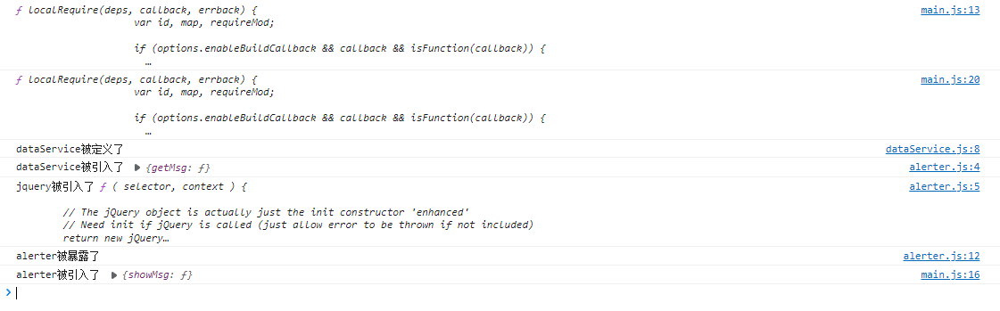

可以直观的看到，通过`define()`和`requirejs()`引入第三方模块时，每个第三方模块的变量，都各自指向一个被暴露的对象

其他的看不出啥了

仍然存在很多问题，理解的不如CommonJS清晰，但暴露模块、引入自定义和第三方模块在语法使用层面没多大问题了

### 2.3.CMD

#### 2.3.1CMD规范基本语法

专门用于浏览器端，模块的加载是异步的

模块在使用时才会加载执行

定义暴露模块:

```
define()
exports
module.exports
```

依赖模块：

```
require()
```


```javascript
// 定义没有依赖的模块
define(function(require, exports, module) {
    exports.xxx =  value
    module.exports = value
})

// 定义有依赖的模块
define(function(require, exports, module) {
    // 同步引入依赖
    var module2 = require("./module2")

    // 异步引入依赖
    require.async("./module3", function (m3) {

    })

    // 暴露模块
    exports.xxx =  value
    module.exports = value
})
```

引入使用模块：

```javascript
define(function (require) {
  var m1 = require('./module1')
  var m4 = require('./module4')
  m1.show()
  m4.show()
})

```

如何使用模块：

```html
<script type="text/javascript">
  seajs.use('./js/modules/main')
</script>
```


#### 2.3.2 sea.js简单使用

**下载sea.js并引入**

- 官网: [seajs.org/](https://link.juejin.cn/?target=http%3A%2F%2Fseajs.org%2F) （已经凉了）
- github : [github.com/seajs/eajs](https://link.juejin.cn/?target=https%3A%2F%2Fgithub.com%2Fseajs%2Fseajs)

然后将`sea.js`导入项目:` js/libs/sea.js`

**创建项目结构**

```
|-js
  |-libs
    |-sea.js
  |-modules
    |-module1.js
    |-module2.js
    |-module3.js
    |-module4.js
    |-main.js
|-index.html

```

 **定义sea.js的模块代码**

```javascript
// module1.js文件
define(function (require, exports, module) {
  //内部变量数据
  var data = 'atguigu.com'
  //内部函数
  function show() {
    console.log('module1 show() ' + data)
  }
  //向外暴露
  exports.show = show
})

```


```javascript
// module2.js文件
define(function (require, exports, module) {
  module.exports = {
    msg: 'I Will Back'
  }
})

```


```javascript
// module3.js文件
define(function(require, exports, module) {
  const API_KEY = 'abc123'
  exports.API_KEY = API_KEY
})

```


```javascript
// main.js文件
define(function (require) {
  var m1 = require('./module1')
  var m4 = require('./module4')
  m1.show()
  m4.show()
})

```

**在index.html中引入**

```javascript
<script type="text/javascript" src="js/libs/sea.js"></script>
<script type="text/javascript">
  seajs.use('./js/modules/main')
</script>

```


### 2.4.ES6

教程参考：https://es6.ruanyifeng.com/#docs/module

ES6 模块的设计思想是尽量的静态化，使得编译时就能确定模块的依赖关系，以及输入和输出的变量。

CommonJS 和 AMD 模块，都只能在运行时确定这些东西。比如，CommonJS 模块就是对象，输入时必须查找对象属性。


#### 2.4.1.ES6模块化语法

`export`命令用于规定模块的对外接口，`import`命令用于输入其他模块提供的功能。

- 解构赋值：https://es6.ruanyifeng.com/#docs/destructuring

```javascript
/** 定义模块 math.js **/
var basicNum = 0;
var add = function (a, b) {
    return a + b;
};
export { basicNum, add };
/** 引用模块 **/
import { basicNum, add } from './math';
// 引入模块，是以对象的解构赋值的形式来拿的
// 类似于 {basicNum, add} = {basicNum, add}
// {导入定义的变量} = {导出定义的变量}
function test(ele) {
    ele.textContent = add(99 + basicNum);
}

```

如上例所示，使用`import`命令的时候，用户需要知道所要加载的变量名或函数名，否则无法加载。

为了给用户提供方便，让他们不用阅读文档就能加载模块，就要用到`export default`命令，为模块指定默认输出，称为**默认暴露**。

```javascript
// export-default.js
export default function () {
  console.log('foo');
}

```

导入默认暴露的模块

```javascript
// import-default.js
import customName from './export-default';
customName(); // 'foo'
//此时自己定义的customName就是一个函数

```

模块默认输出, 其他模块加载该模块时，`import`命令可以为该匿名函数指定任意名字。

默认暴露，只能写一次，如果想要默认暴露很多数据，都写在一个对象里面就可以了。

如果多个`import`语句之间有其他代码，`vue-cli`执行时会把所有的`import`语句汇总在最上方再执行，所以要注意插件的安装时机和使用时机

#### 2.4.2.实现（浏览器端）

**使用Babel将ES6编译为ES5代码**：ES6本身的语法，有的浏览器并不支持

- 官网：https://www.babeljs.cn/docs/

**使用Browserify编译打包js**：进行模块化处理（思考：浏览器端ES6和CommonJS都用到了browserify，那么两者有什么区别呢）


步骤：

- 定义package.json文件

  ```json
   {
     "name" : "es6-babel-browserify",
     "version" : "1.0.0"
   }
  ```

- 安装babel相关的模块：https://www.babeljs.cn/docs/usage

  ```
  
    老教程，可以忽略了：
    //全局安装babel-cli和browserify
    npm install babel-cli browserify -g
    npm install babel-preset-es2015 --save-dev
    
    //自己摸索的
    // 这个命令是官网上的
    npm install -save-dev @babel/core @babel/cli @babel/preset-env
    // 不过还要全局安装@babel-cli，不然babel命令出不来，官网上说 `可以利用 npm@5.2.0 所自带的 npm 包运行器将 ./node_modules/.bin/babel 命令缩短为 npx babel`，但是并没有
    
    // 咱还是全局安装一下吧
    npm install @babel/cli browserify -g
    
  
  ```
  
  安装之后，本地的`package.json`内容如下：
  
  
  
  ```json
  {
    "name": "es6-babel-browserify",
    "version": "1.0.0",
    "devDependencies": {
      "@babel/cli": "^7.17.6", // 负责解析babel相关的命令行
      "@babel/core": "^7.17.7",
      "@babel/preset-env": "^7.16.11" // preset：一组预先设定的插件，env：名称为env的preset
    }
  }
  
  ```
  
  
  
- 定义.babelrc文件，`rc`表示`run control`，`运行控制`，这是`babel`的运行控制文件

  ```
  {
    "presets": ["es2015"]
  }
  ```

  - 如果没有`.babelrc`文件，直接执行babel的打包命令，表示**不依赖任何预设环境**（将来的环境完全支持新特性的语法），代码将原样输出，相当于做了个复制文件的操作
  - `.babelrc`和`babel-preset-es2015`对应，不过官方已经不推荐使用`babel-preset-es2015`模块了，推荐使用`@babel/preset-env`

- 可以看官网最新的指南，这里定义`babel.config.json`，同理，该文件也相当于`babel`的运行控制文件

  - 就相当于告诉babel编译器，你要把你写的模块化的代码，运行在哪些环境上，因为老环境和新环境支持的特性是不一样的
  - 现在，名为 `env` 的 preset 只会为目标浏览器中没有的功能加载转换插件。

  ```json
   {
      "presets": [
        [
          "@babel/preset-env",
          {
            "targets": {
              "edge": "17",
              "firefox": "60",
              "chrome": "67",
              "safari": "11.1"
            },
            "useBuiltIns": "usage", // 只包含所需要的 polyfill
            "corejs": "3.6.5"
          }
        ]
      ]
    }
  ```

- 定义模块代码

  module1.js

  ```javascript
  //module1.js文件
  // 分别暴露
  export function foo() {
      console.log('foo() module1')
  }
  export function bar() {
      console.log('bar() module1')
  }
  
  ```

  module2.js

  ```javascript
  //module2.js文件
  // 统一暴露
  function fun1() {
      console.log('fun1() module2')
  }
  function fun2() {
      console.log('fun2() module2')
  }
  export { fun1, fun2 }
  
  ```

  module3.js

  ```javascript
  //module3.js文件
  // 默认暴露 可以暴露任意数据类项，暴露什么数据，接收到就是什么数据
  export default () => {
      console.log('默认暴露')
  }
  
  ```

  main.js

  ```javascript
  // main.js文件
  import { foo, bar } from './module1'
  import { fun1, fun2 } from './module2'
  import module3 from './module3'
  foo()
  bar()
  fun1()
  fun2()
  module3()
  
  ```

  index.html

  ```html
  <!DOCTYPE html>
  <html lang="en">
  <head>
      <meta charset="UTF-8">
      <title>Title</title>
  </head>
  <body>
      <script src="./js/src/main.js"></script>
  </body>
  </html>
  ```

  直接引入看控制台，报如下错误：

  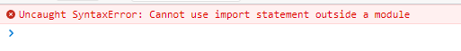

  我们需要使用babel命令，将ES6新特性语法转换成ES5的

  `babel js/src/ -d js/lib`，`-d`表示`--out-dir`，可以通过`babel -help`查看

  转换后的代码如下：

  module1.js

  ```javascript
  "use strict";
  
  Object.defineProperty(exports, "__esModule", {
    value: true
  });
  exports.bar = bar;
  exports.foo = foo;
  
  //module1.js文件
  // 分别暴露
  function foo() {
    console.log('foo() module1');
  }
  
  function bar() {
    console.log('bar() module1');
  }
  ```

  module2.js

  ```javascript
  "use strict";
  
  Object.defineProperty(exports, "__esModule", {
    value: true
  });
  exports.fun1 = fun1;
  exports.fun2 = fun2;
  
  //module2.js文件
  // 统一暴露
  function fun1() {
    console.log('fun1() module2');
  }
  
  function fun2() {
    console.log('fun2() module2');
  }
  ```

  module3.js

  ```javascript
  "use strict";
  
  Object.defineProperty(exports, "__esModule", {
    value: true
  });
  exports.default = void 0;
  
  //module3.js文件
  // 默认暴露 可以暴露任意数据类项，暴露什么数据，接收到就是什么数据
  var _default = () => {
    console.log('默认暴露');
  };
  
  exports.default = _default;
  ```

  main.js

  ```javascript
  "use strict";
  
  var _module = require("./module1");
  
  var _module2 = require("./module2");
  
  var _module3 = _interopRequireDefault(require("./module3"));
  
  function _interopRequireDefault(obj) { return obj && obj.__esModule ? obj : { default: obj }; }
  
  // main.js文件
  (0, _module.foo)();
  (0, _module.bar)();
  (0, _module2.fun1)();
  (0, _module2.fun2)();
  (0, _module3.default)();
  ```

- babel转换后的主入口模块，用到了require语法（包含了CommonJS语法）

  - 根据前面的知识，使用browserify再转换一下

    - 在`js`目录下新建`dist`目录

    - 执行命令`browserify js/lib/main.js -o js/dist/bundle.js`

    - 又看到了当初熟悉的代码

      ```javascript
      (function () {
          function r(e, n, t) {
              function o(i, f) {
                  if (!n[i]) {
                      if (!e[i]) {
                          var c = "function" == typeof require && require;
                          if (!f && c) return c(i, !0);
                          if (u) return u(i, !0);
                          var a = new Error("Cannot find module '" + i + "'");
                          throw a.code = "MODULE_NOT_FOUND", a
                      }
                      var p = n[i] = {exports: {}};
                      e[i][0].call(p.exports, function (r) {
                          var n = e[i][1][r];
                          return o(n || r)
                      }, p, p.exports, r, e, n, t)
                  }
                  return n[i].exports
              }
      
              for (var u = "function" == typeof require && require, i = 0; i < t.length; i++) o(t[i]);
              return o
          }
      
          return r
      })()({
          1: [function (require, module, exports) {
              "use strict";
      
              var _module = require("./module1");
      
              var _module2 = require("./module2");
      
              var _module3 = _interopRequireDefault(require("./module3"));
      
              function _interopRequireDefault(obj) {
                  return obj && obj.__esModule ? obj : {default: obj};
              }
      
      // main.js文件
              (0, _module.foo)();
              (0, _module.bar)();
              (0, _module2.fun1)();
              (0, _module2.fun2)();
              (0, _module3.default)();
          }, {"./module1": 2, "./module2": 3, "./module3": 4}], 2: [function (require, module, exports) {
              "use strict";
      
              Object.defineProperty(exports, "__esModule", {
                  value: true
              });
              exports.bar = bar;
              exports.foo = foo;
      
      //module1.js文件
      // 分别暴露
              function foo() {
                  console.log('foo() module1');
              }
      
              function bar() {
                  console.log('bar() module1');
              }
          }, {}], 3: [function (require, module, exports) {
              "use strict";
      
              Object.defineProperty(exports, "__esModule", {
                  value: true
              });
              exports.fun1 = fun1;
              exports.fun2 = fun2;
      
      //module2.js文件
      // 统一暴露
              function fun1() {
                  console.log('fun1() module2');
              }
      
              function fun2() {
                  console.log('fun2() module2');
              }
          }, {}], 4: [function (require, module, exports) {
              "use strict";
      
              Object.defineProperty(exports, "__esModule", {
                  value: true
              });
              exports.default = void 0;
      
      //module3.js文件
      // 默认暴露 可以暴露任意数据类项，暴露什么数据，接收到就是什么数据
              var _default = () => {
                  console.log('默认暴露');
              };
      
              exports.default = _default;
          }, {}]
      }, {}, [1]);
      
      ```

      

- 在index.html中引入，效果如下：

  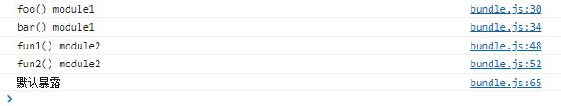

- 回顾

  - 使用Babel将ES6编译为ES5代码(但包含CommonJS语法) : `babel js/src -d js/lib`
    - 实操完之后，关于这三个模块的详细描述，及相互之间的关系，可以再看一遍babel官网：https://www.babeljs.cn/docs/usage，以进一步加深理解
  - 使用Browserify编译js : `browserify js/lib/main.js -o js/dist/bundle.js`


**引入第三方库**

jquery2版本和3版本的针对的是高版本浏览器，2版本已经不更新，只维护了，3版本仍在更新

一般使用1版本就够了，安装1版本最新的：`npm install jquery@1`

在`main.js`中引入

```javascript
// main.js文件
import { foo, bar } from './module1'
import { fun1, fun2 } from './module2'
import module3 from './module3'
import $ from 'jquery'

foo()
bar()
fun1()
fun2()
module3()
$('body').css('background', 'pink')
```

重新打包引入，效果如下：


#### 2.4.4.ES6和CommonJS的差异

- CommonJS 模块输出的是一个值的拷贝，ES6 模块输出的是值的引用。

  - ES6 模块的运行机制与 CommonJS 不一样。**ES6 模块是动态引用，并且不会缓存值，模块里面的变量绑定其所在的模块**。

  - CommonJS例子

    ```javascript
    // lib.js
    export let counter = 3;
    export function incCounter() {
      counter++;
    }
    // main.js
    import { counter, incCounter } from './lib';
    console.log(counter); // 3
    incCounter();
    console.log(counter); // 4
    
    ```

    

- CommonJS 模块是运行时加载，ES6 模块是编译时输出接口。
  - 第二个差异是因为 CommonJS 加载的是一个对象（即module.exports属性），该对象只有在脚本运行完才会生成。
  - 而 ES6 模块不是对象，它的对外接口只是一种静态定义，在代码静态解析阶段就会生成。

- 我的理解：我不理解

### 2.5.小结

- CommonJS规范主要用于服务端编程，加载模块是同步的，这并不适合在浏览器环境，因为同步意味着阻塞加载，浏览器资源是异步加载的，因此有了AMD CMD解决方案。

- AMD规范在浏览器环境中异步加载模块，而且可以并行加载多个模块。不过，AMD规范开发成本高，代码的阅读和书写比较困难，模块定义方式的语义不顺畅。

- CMD规范与AMD规范很相似，都用于浏览器编程，依赖就近，延迟执行，可以很容易在Node.js中运行。不过，依赖SPM 打包，模块的加载逻辑偏重

- **ES6 在语言标准的层面上，实现了模块功能，而且实现得相当简单，完全可以取代 CommonJS 和 AMD 规范，成为浏览器和服务器通用的模块解决方案**。

## 3.扩展阅读

package.lock.json是什么？

- 这是npm5的特征

# 包管理工具

## Npm


## Yarn

# 构建工具

## Webpack

本章环境参数：

```
Node：10版本以上
Webpack：4.26版本以上

webpack-cli@3.3.11
webpack@4.41.6
style-loader@1.1.3
css-loader@3.4.1
less-loader@5.0.0
html-webpack-plugin@3.2.0
url-loader@3.0.0
file-loader@5.0.2
html-loader@0.5.5
webpack-dev-server@3.10.3
mini-css-extract-plugin@0.9.0
postcss-loader@3.0.0
postcss-preset-env@6.7.0
optimize-css-assets-webpack-plugin@5.0.3
eslint@6.8.0
eslint-loader@3.0.3
eslint-plugin-import@2.20.1
eslint-config-airbnb-base@14.0.0
babel-loader@8.0.6
@babel/preset-env@7.8.4
@babel/core@7.8.4
@babel/polyfill@7.8.3
core-js@3.6.4

若有如下报错：
Could not find plugin "proposal-class-static-block". Ensure there is an entry in ./available-plugins.js for it. 
解决方法是修改版本如下：
@babel/core@7.14.6
@babel/preset-env@7.14.7
```

### 1.Webpack简介

创建目录结构

```
|----index.html
|----index.less
|----index.js
```

index.html

```html
<!doctype html>
<html lang="en">
<head>
  <meta charset="UTF-8">
  <meta name="viewport"
        content="width=device-width, user-scalable=no, initial-scale=1.0, maximum-scale=1.0, minimum-scale=1.0">
  <meta http-equiv="X-UA-Compatible" content="ie=edge">
  <title>Document</title>
  <link rel="stylesheet" href="./index.less">
</head>
<body>
  <h1>Hello Webpack</h1>
</body>
</html>
```

index.less

```less
h2 {
  color: pink;
}
```

样式未生效：


浏览器不认识less文件，需要转成css文件。类比于浏览器不支持es6、模块化语法，需要babel、browserify进行转化

当我们使用css预处理器来写样式代码时，需要一个工具将less代码，转换成css代码


做些其他操作：

`npm init`初始化一个包

`npm install jquery`下载jquery

index.js

```javascript
import $ form 'jquery'

$('#title').click(() => {
    $('body').css('backgroundColor', 'deepPink')
})
```

index.html

```html
<!doctype html>
<html lang="en">
<head>
  <meta charset="UTF-8">
  <meta name="viewport"
        content="width=device-width, user-scalable=no, initial-scale=1.0, maximum-scale=1.0, minimum-scale=1.0">
  <meta http-equiv="X-UA-Compatible" content="ie=edge">
  <title>Document</title>
  <link rel="stylesheet" href="./index.less">
</head>
<body>
  <h1 id="title">Hello Webpack</h1>
  <script src="./index.js"></script>
</body>
</html>
```

同样的，引入js文件，由于使用了es6的模块化语法，并不能被浏览器解析，也没有生效


同理，我们也需要一个工具，将es6的模块化语法转化成浏览器识别的。（前面已经学过了，可以用babel和browserify来处理）

将来还有很多这样的情况，如vue文件，也需要转化处理等等

问提：

- 一个个小工具，自己维护起来将会非常的麻烦
- 由此引出一个概念：**构建工具**
  - 构建工具包含了上述的所有的小工具
  - webpack就是构建工具的一种，同时也是一种静态资源打包器

#### 1.1.Webpack是什么

Webpack是一种前端资源构建器，一个静态资源打包器（module bundle）。

在Webpack看来，前端的所有资源文件（js/json/css/img/less/...）都会作为模块处理。

它将根据模块的依赖关系进行静态分析，打包生成对应的静态资源（bundle）


我们告诉`webpack`入口文件的位置，`wepack`会以入口文件作为起点开始打包，它会将入口文件中的每一个依赖记录好，形成依赖关系树状结构图，然后根据依赖关系，依此将资源全部引进来，形成一个chunk（代码块）。

然后再对`chunk`进行各项处理，比如说将`less`编译成`css`，`jsES6`语法编译成`ES5`语法等等，这些操作统一概括一下，称为`打包`。

处理好的资源，输出出去，称为`bundle`。整体大概就是这样一个流程


相关概念

- 构建工具
- chunk
- 打包
- bundle

#### 1.2.Webpack五个核心概念

##### 1.2.1.Entry

入口（`Entry`）指示`Webpack`以哪个文件为入口起点开始打包，分析构建内部依赖图。

**webpack.config.js**

```js
module.exports = {
  entry: './path/to/my/entry/file.js',
};
```

##### 1.2.2.Output

输出（`Output`）指示`Webpack`打包后的资源`bundles`输出到哪里去，以及如何命名。

**webpack.config.js**

```javascript
const path = require('path');

module.exports = {
  entry: './path/to/my/entry/file.js',
  output: {
    path: path.resolve(__dirname, 'dist'),
    filename: 'my-first-webpack.bundle.js',
  },
};
```


##### 1.2.3.Loader

`Loader`让`Webpack`能够去处理那些非`Javascript`文件（Webpack自身只理解`Javascript`）

**webpack.config.js**

```javascript
const path = require('path');

module.exports = {
  output: {
    filename: 'my-first-webpack.bundle.js',
  },
  module: {
    rules: [{ test: /\.txt$/, use: 'raw-loader' }],
  },
};
```


##### 1.2.4.Plugins

插件（`Plugin`）可以用于执行范围更广的任务，插件的范围包括，从打包优化和压缩，一直到重新定义环境中的变量等。

**webpack.config.js**

```javascript
const HtmlWebpackPlugin = require('html-webpack-plugin');
const webpack = require('webpack'); //to access built-in plugins

module.exports = {
  module: {
    rules: [{ test: /\.txt$/, use: 'raw-loader' }],
  },
  plugins: [new HtmlWebpackPlugin({ template: './src/index.html' })],
};
```


##### 1.2.5.Mode

模式（`Mode`）指示`Webpack`使用相应模式的配置

| 选项        | 描述                                                         | 特点                       |
| ----------- | ------------------------------------------------------------ | -------------------------- |
| development | 会将 `process.env.NODE_ENV`的值设为`development`。<br />启用`NamedChunksPlugin`和`NamedModulesPlugin`。 | 能让代码本地调试运行的环境 |
| production  | 会将 `process.env.NODE_ENV`的值设为`production`。<br />启用`FlagDependencyUsagePlugin`，`FlagIncludedChunksPlugin`，`ModuleConcatentionPlugin`，`NoEmitOnErrorPlugin`，`OccurenceOrderPlugin`，`SideEffectFlagPlugin`和`UglifyJsPlugin` | 能让代码优化上线运行的环境 |


```javascript
module.exports = {
  mode: 'production',
};
```


 

### 2.Webpack初体验

新建目录，项目目录结构

```
|----build // 打包后的输出目录
|----src // 开发目录
	|----index.js // 入口文件
```

- 工具准备

全局安装webpack4：`npm i webpack@4.41.6 webpack-cli@3.3.11 -g`

再本地安装，并添加到开发依赖：`npm i webpack@4.41.6 webpack-cli@3.3.11 -D`


#### 验证JS文件（支持）

- 测试代码

  ```javascript
  // index.js
  /*
      index.js: webpack入口文件
   */
  
  function add(x, y) {
      return x + y
  }
  
  console.log(add(1, 2))
  ```

- 运行指令

  - 开发环境：`webpack ./src/index.js -o ./build/built.js --mode=development`

  - 上述表示webpack会以`./src/index.js`为入口文件进行打包，打包后输出到`./buid/built.js`，整体打包环境是开发环境

    - 可以使用`webpack --help`，查看支持哪些参数，`-o`表示` --output-path `，指定输出目录
    - 实操中输出的是./build/built.js目录下，有个main.js文件，可能是webpack版本的问题
  
  - 执行命令后，结果如下：
  
    ```
    Hash: dae31a30deff8bcefbb6
    Version: webpack 4.46.0
    Time: 123ms
    Built at: 2022/03/18 上午7:06:32
      Asset      Size  Chunks             Chunk Names
    main.js  4.22 KiB    main  [emitted]  main
    Entrypoint main = main.js
    [0] multi ./src/index.js 28 bytes {main} [built]
    [./src/index.js] 113 bytes {main} [built]
    	
    ```
  
  - 执行生产环境打包命令：``webpack ./src/index.js -o ./build --mode=production`，webpack4中， 打包后的bundle是进行压缩过的
  
    - 可以直接通过node指令执行
    - 可以通过html引入

#### 验证JSON文件（支持）

src目录下，新建`data.json`

```json
{
  "name": "jack",
  "age": "18"
}
```

入口文件中引入：

```javascript
/*
    index.js: webpack入口文件
 */
import data from "./data.json"
console.log(data)
function add(x, y) {
    return x + y
}

console.log(add(1, 2))
```

运行开发环境命令，重新打包，经测试在node环境和浏览器环境，都可以正常显示


能够支持json文件，是因为javascript本身就有json文件解析的api，打包后的文件有这么一行语句：

```javascript
e.exports = JSON.parse('{"name":"jack","age":"18"}')
```

解析json文件的过程，就是读取`data.json`的内容，然后使用parse方法解析。

#### 验证CSS文件（不支持）

src目录下，新建index.css

```css
body {
    background-color: #BBFFAA;
}

```

入口文件中引入，并打包

报了异常：


webpack将index.css的内容复制到chunk中，准备解析的时候，发现css的这种语法是不支持的。

#### 小结

webpack支持js/json资源，不支持css/img等其他资源。

打包命令将es6模块化语法，编译成浏览器能识别的模块化。

生产环境打包命令，比开发环境打包命令多了一个压缩js代码的过程。

### 3.开发环境配置

#### 打包样式资源

要支持样式文件的模块化，需要定义`webpack.config.js`配置文件

- 作用：以配置的形式，指示`webpack`干哪些活
  - 当运行`webpack`指令时，`webpack`会加载配置文件的信息，以里面的配置来干活

那么配置怎么写呢？

- 所有的构建工具，都是基于Node平台运行的

  - 采用CommonJS模块化规范

    ```javascript
    const { resolve } = require('path')
    
    module.exports = {
        // webpack配置
        // 入口起点
        entry: './src/index.js',
        // 输出
        output: {
            // 输出文件名
            filename: 'built.js',
            // 输出路径，一般是绝对路径
            path: resolve(__dirname, 'build') // __dirname是nodejs的变量，代表当前文件所在目录的绝对路径
        },
        // loader的配置
        module: {
            rules: [
                // 详细loader配置
            ]
        },
        // plugins的配置
        plugin: [
            //详细plugins配置
        ],
        // 模式
        mode: 'development' // 也可以是mode: 'production'
    }
    ```

    

- 而`src`是写项目的代码，采用ES6吗，模块化规范


#### 处理css文件

使用`css-loader`、`style-loader`

`webpack.config.js`

```javascript
const { resolve } = require('path')

module.exports = {
    entry: './src/index.js',
    output: {
        filename: 'built.js',
        path: resolve(__dirname, 'build')
    },
    module: {
        rules: [
            // 详细loader配置
            {
                // 匹配哪些文件
                test: /\.css$/, //遍历所有的文件，使用正则去匹配以.css结尾的文件名
                use :[ // 匹配成功后，使用use中配置的loader去处理，执行顺序是从下往上，从后往前
                    'style-loader', // 2.创建<style></style>标签，将js中的css样式资源插入进去，添加到<head></head>中生效。
                    'css-loader' // 1.将css文件以字符串的形式，变成commonjs的模块，加载到js中，
                ]
            }
        ]
    },
    plugins: [
    ],
    mode: 'development'
}
```

为了避免将来重复下载，我们在上级目录下载包，如下：


下载`webpack`、`webpack-cli`： `npm i webpack webpack-cli -D`

下载`css-loader`、`style-loader`： `npm i css-loader@3.4.2 style-loader@1.1.3 -D`

输入`webpack`命令进行打包

- 如果打包不通过，把配置文件的`plugin`注释掉

打包后的文件中，可以看到css文件以字符串的形式，变成了commonjs模块：


新建`index.html`并引入js文件，可以看到样式已经生效了。


#### 配置文件流程分析

`webpack`首先解析`entry`字段，加载`index.js`，然后分析入口文件内部的依赖图，发现里面有一个`index.css资源`，至此已经有了两个资源`index.js`、`index.css`。

每一个资源会经过`rules`里面的`loader`进行处理，`js`资源先进来，发现`test`的规则不匹配，于是跳过。然后进来`css`资源，与`test`规则命中后，使用`use`中的`loader`进行处理，处理的顺序是`从下往上，从后往前`。

先用`css-loader`进行处理，将`css`资源以`commonjs`的方式，加载到`js`中，然后用`style-loader`进行处理，创建`style`标签，将`js`中的样式资源插入，并添加到`head`中生效。

最后的输出路径，是由`output`来指定的。

#### 处理less文件

`src`目录下，新建`index.less`

```less
h2 {
  color: pink;
}
```

在`index.js`中引入并打包，毫无疑问，`webpack`会报错：


我们之前配置的`loader`只针对`css`资源，不同的资源需要使用不同的`loader`来处理

所以我们需要再写一个`loader`配置

```javascript
const { resolve } = require('path')

module.exports = {
    entry: './src/index.js',
    output: {
        filename: 'built.js',
        path: resolve(__dirname, 'build')
    },
    module: {
        rules: [
            // 详细loader配置
            {
                // 匹配哪些文件
                test: /\.css$/, //遍历所有的文件，使用正则去匹配以.css结尾的文件名
                use :[ // 匹配成功后，使用use中配置的loader去处理，执行顺序是从下往上，从后往前
                    'style-loader', // 2.创建<style></style>标签，将js中的css样式资源插入进去，添加到<head></head>中生效
                    'css-loader' // 1.将css文件以字符串的形式，变成commonjs的模块，加载到js中，
                ]
            },
            {
                test:/\.less$/,
                use: [
                    'style-loader',
                    'css-loader',
                    'less-loader', // 1.将less文件，编译成css文件
                ]
            }
        ]
    },
    // plugins: [
    // ],
    mode: 'development'
}
```

然后下载`less-loader`和`less`，`npm i less-loader@5.0.0 less@3.11.1 -D`

然后打包并引入看效果：


两个样式的`loader`最后各自插入了`style`标签

#### 打包html文件

新建04/src目录，新建`index.html`和`index.js`

`index.html`

```html
<!doctype html>
<html lang="en">
<head>
    <meta charset="UTF-8">
    <meta name="viewport"
          content="width=device-width, user-scalable=no, initial-scale=1.0, maximum-scale=1.0, minimum-scale=1.0">
    <meta http-equiv="X-UA-Compatible" content="ie=edge">
    <title>Document</title>
</head>
<body>
    <h1 id="title">hello html</h1>
</body>
</html>
```

`index.js`

```javascript
function add(x, y) {
    return x + y
}

console.log(add(2,3))
```


- 下载：`npm i html-webpack-plugin@3.2.0 -D`

- 引入

  ```
  const HtmlWebpackPlugin = require('html-webpack-plugin')
  ```

- 调用

  ```javascript
  // ...
  plugins: [
      new HtmlWebpackPlugin()
  ]
  ```

`webpack.config.js`

```javascript
const {resolve} = require('path')
const HtmlWebpackPlugin = require('html-webpack-plugin')
module.exports = {
    entry: './src/index.js',
    output: {
        filename: 'built.js',
        path: resolve(__dirname, 'build')
    },
    module: {
        rules: []
    },
    plugins: [
        // plugins配置
        // html-webpack-plugin使用
        new HtmlWebpackPlugin()
    ],
    mode: 'development'

}
```

打包看下效果：


会连`html`一起打包，并在`index.html`中引入`built.js`，还删除了我们之前写的`id`名

小结1：

- 默认会创建一个空的`HTML`，自动引入打包输出的所有资源（`JS/CSS`）
- 需求：我们需要有结构的`HTML`文件

需要加一个选项：

```javascript
// ...
plugins: [
    new HtmlWebpackPlugin({
        // 复制该文件，并自动引入打包输出所有资源
        template: './src/index.html'
    })
]
```

添加后重新打包，效果：


loader：

- 1.下载、2.使用（配置Loader）
- loader是文件加载器，能够加载资源文件，并对这些文件进行一些处理，诸如编译、压缩等，最终一起打包到指定的文件中
  - 处理一个文件可以使用多个loader，loader的执行顺序和配置中的顺序是相反的，即最后一个loader最先执行，第一个loader最后执行
  - 第一个执行的loader接收源文件内容作为参数，其它loader接收前一个执行的loader的返回值作为参数，最后执行的loader会返回此模块的JavaScript源码
-  loader，是一个转换器
  - 将A文件进行编译形成B文件，这里操作的是文件，比如将 A.scss 转换为 A.css，是单纯的文件转换过程。

plugin:

- 1.下载、2.引入、3.使用
- 在webpack运行的生命周期中会广播出许多事件，plugin可以监听这些事件，在合适的时机通过webpack提供的API改变输出果。
- plugin 是插件扩展器
  - 针对webpack打包的过程，它不直接操作文件，而是基于事件机制工作，会监听webpack打包过程中的某些事件钩子，执行任务。plugin 比loader 强大，通过plugin 可以访问 compliler和compilation过程，通过钩子拦截 webpack 的执行。

我的理解：

- loader的处理，更偏向句法词法分析这种，如less转css等。
- plugin的处理，更偏向将人工的新建、引入等操作自动化这种，如复制文件、引入标签等
- 更多：
  - https://blog.csdn.net/jiang7701037/article/details/98887179
  - https://cloud.tencent.com/developer/article/1772916

#### 打包图片文件

目录结构如下：


准备3张图片

index.less

```less
#box1 {
  width: 100px;
  height: 100px;
  background-image: url('../imgs/vue.png');
  background-repeat: no-repeat;
  background-size: 100% 100%;
}

#box2 {
  width: 200px;
  height: 200px;
  background-image: url('../imgs/react.jpg');
  background-repeat: no-repeat;
  background-size: 100% 100%;
}

#box3 {
  width: 300px;
  height: 300px;
  background-image: url('../imgs/angular.png');
  background-repeat: no-repeat;
  background-size: 100% 100%;
}

```

index.html

```html
<!DOCTYPE html>
<html lang="en">
<head>
    <meta charset="UTF-8">
    <title>Title</title>
</head>
<body>
<div id="box1"></div>
<div id="box2"></div>
<div id="box3"></div>
</body>
</html>
```

main.js

```javascript
import './css/index.less'
```

webpack.config.js

```javascript
const {resolve} = require('path')
const HtmlWebpackPlugin = require('html-webpack-plugin')
module.exports = {
    entry: './src/main.js',
    output: {
        filename: './src/main.js',
        path: resolve(__dirname, './build')
    },
    module: {
        rules: [
            {
                test: /\.less$/,
                use: [
                    'style-loader',
                    'css-loader',
                    'less-loader'
                ]
            }
        ]
    },
    plugins: [
        new HtmlWebpackPlugin({
            template: './src/index.html'
        })
    ],
    mode: 'development'

}
```

打包后的效果如下：


我这里用的webpack版本变成了5,，和教程里的不太一样，没有配置图片的loader也能转换图片，应该默认就有配置了

后面重新删除了node_modules文件夹，下载所有的包指定版本号重新过了一遍

配置图片相关的Loader：

```javascript
            {
                test: /\.(jpg|png|gif)$/, // 匹配图片资源
                loader: 'url-loader', // 如果只要使用一个loader，就可以这样写，不用写use
                options: { // loader的配置
                    limit: 8 * 1024 // 图片大小小于8kb，就会被base64处理
                    // 优点：减少请求数量（减轻服务器压力）
                    // 缺点：图片体积会更大（文件请求速度变慢）
                    // 一般不会对大图片进行base64处理，一般对8~12kb以下的图片，进行base64处理，都是没有问题的
                    // 根据实际情况设置
                }
            }
```

下载包的时候，要下载`url-loader`和`file-loader`，因为`url-loader`依赖于`file-loader`

`npm i url-loader@3.0.0 file-loader@5.0.2 -D`

可以看到，limit的设置，将会对vue图片进行base64处理：


我们还会在`html`标签中，通过`img`引入图片，上述方式默认是解析不到的

还需要加一个`html-loader`，这个`loader`是处理`html`中的`img`图片的（负责引入img），从而被`url-loader`进行处理

`npm i html-loader@0.5.5 -D`

在`index.html`中新增

```html

```

如果不配置`html-loader`重新打包后的`img`的路径，是不会变的

`webpack.config.js`中配置`html-loader`：

```javascript
            {
                test: /\.html$/,
                // 处理html文件中的img图片路径（负责引入img，从而被url-loader进行处理）
                loader: 'html-loader'
            }
```

重新打包后看`index.html`的内容

```html

```

出现上述结果，是因为`url-loader`使用的是ES6模块化规范来处理各个模块，而`html-loader`使用的是CommonJS模块化规范，用ES6来解析CommonJS是解析不了的

解决办法：在`url-loader`的配置中，关闭ES6模块解析方式，使用CommonJS方式去解析

```javascript
         {
                test: /\.(jpg|png|gif)$/,
                loader: 'url-loader',
                options: { // loader的配置
                    limit: 8 * 1024,
                    esModule: false // 关闭ES6模块解析方式，使用CommonJS方式去解析
                }
            },
```

结果解析出来的，是一个正确的图片路径：


备注：如果引入的图片小于limit设置，也会被处理成base64

如果不想图片那么长的话，可以配置命名规则：

```javascript
             {
                test: /\.(jpg|png|gif)$/,
                loader: 'url-loader',
                options: { // loader的配置
                    limit: 8 * 1024,
                    esModule: false,
                    name: '[hash:10].[ext]' // [hash:10]取图片的前10位，[ext]取文件原来的扩展名
                }
            },

```

#### 打包其他资源

阿里图标库上，先下载几个图标，并通过类名引入，先看下效果

index.html

```html
<html>
<head>
<title></title>
</head>
<link rel="stylesheet" href="./font/iconfont.css">
<body>
    <span class="iconfont icon-rili3"></span>
    <span class="iconfont icon-shoucang"></span>
    <span class="iconfont icon-qiehuan"></span>
    <span class="iconfont icon-normal1"></span>
</body>
</html>

```


iconfont.css中，引入了字体文件

```css
@font-face {
  font-family: "iconfont"; /* Project id  */
  src: url('iconfont.ttf?t=1650525200949') format('truetype');
}

.iconfont {
  font-family: "iconfont" !important;
  font-size: 16px;
  font-style: normal;
  -webkit-font-smoothing: antialiased;
  -moz-osx-font-smoothing: grayscale;
}

.icon-rili3:before {
  content: "\e89e";
}

.icon-shoucang:before {
  content: "\e61e";
}

.icon-qiehuan:before {
  content: "\e688";
}

.icon-normal1:before {
  content: "\e7dc";
}

```

取消`index.html`中的`link`引入，新建入口文件，通过入口文件引入：

index.html

```html
<!DOCTYPE html>
<html lang="en">
<head>
  <meta charset="UTF-8">
  <meta name="viewport" content="width=device-width,initial-scale=1.0">
  <title>webpack</title>
</head>
<body>
    <span class="iconfont icon-rili3"></span>
    <span class="iconfont icon-shoucang"></span>
    <span class="iconfont icon-qiehuan"></span>
    <span class="iconfont icon-normal1"></span>
</body>
</html>

```


index.js

```js
import './font/iconfont.css'
```


最终我们要打包的有html资源、css资源和字体图标资源

编写`webpack.config.js`

```js
const {resolve} = require('path')
const HtmlWebpackPlugin = require('html-webpack-plugin')

module.exports = {
  entry: './src/index.js',
  output: {
    filename: 'built.js',
    path: resolve(__dirname, 'build')
  },
  module: {
    rules: [
      {
        test: /\.css$/,
        use: [
          'style-loader',
          'css-loader'
        ]
      },
      {
        // 打包其他资源（除了css/js/html资源以外的资源）
        exclude: /\.(css|js|html)$/,
        loader: 'file-loader', // 其他资源都通过file-loader进行处理
        options: { // 文件名长度的配置
          name: '[hash:10].[ext]'
        }
      }
    ]
  },
  plugins: [
    new HtmlWebpackPlugin({
      template: './src/index.html'
                                       
```

#### devServer

开发服务器`devServer`，用来自动化（自动编译、打开浏览器、刷新浏览器）

配置与上面的五个配置同级：

```js

devServer: {
    host: "0.0.0.0", // 如果是linux系统，要配置ip，否则会以localhost运行
    contentBase: resolve(__dirname, 'build'), // 构建后的目录
    compress: true, // 启动gzip压缩，让代码更小，运行更快
    port: 8082, // 指定端口号，如果是云服务器，需要先开启防火墙
    open: true
}
```

更多配置：[webpack-devServer的详细配置 - keyeking - 博客园 (cnblogs.com)](https://www.cnblogs.com/keyeking/p/15471047.html)

特点：只会在内存中编译打包，不会有任何输出

启动`devServer`指令为：`webpack-dev-server`

安装：`npm i webpack-dev-server@3.10.3 -D`

启动：`npx webpack-dev-server`，因为没有全局安装，所以用`npx`，也没必要全局安装

编译信息：

```
[root@VM-4-12-centos 07.devServer]# npx webpack-dev-server
ℹ ｢wds｣: Project is running at http://0.0.0.0:8081/
ℹ ｢wds｣: webpack output is served from /
ℹ ｢wds｣: Content not from webpack is served from /root/hh_git/md/web/code/webpack/07.devServer/build
ℹ ｢wdm｣: Hash: 19f6a0a0ae89773263f1
Version: webpack 4.41.6
Time: 642ms
Built at: 04/21/2022 6:46:52 PM
         Asset       Size  Chunks             Chunk Names
5ea7b72be6.ttf    2.5 KiB          [emitted]  
      built.js    384 KiB    main  [emitted]  main
    index.html  440 bytes          [emitted]  
Entrypoint main = built.js
[0] multi ../node_modules/webpack-dev-server/client?http://0.0.0.0:8081 ./src/index.js 40 bytes {main} [built]
[../node_modules/ansi-html/index.js] 4.16 KiB {main} [built]
[../node_modules/ansi-regex/index.js] 135 bytes {main} [built]
[../node_modules/css-loader/dist/cjs.js!./src/font/iconfont.css] 1.04 KiB {main} [built]
[../node_modules/strip-ansi/index.js] 161 bytes {main} [built]
[../node_modules/webpack-dev-server/client/index.js?http://0.0.0.0:8081] ../node_modules/webpack-dev-server/client?http://0.0.0.0:8081 4.29 KiB {main} [built]
[../node_modules/webpack-dev-server/client/overlay.js] 3.51 KiB {main} [built]
[../node_modules/webpack-dev-server/client/socket.js] 1.53 KiB {main} [built]
[../node_modules/webpack-dev-server/client/utils/createSocketUrl.js] 2.91 KiB {main} [built]
[../node_modules/webpack-dev-server/client/utils/log.js] 964 bytes {main} [built]
[../node_modules/webpack-dev-server/client/utils/reloadApp.js] 1.59 KiB {main} [built]
[../node_modules/webpack-dev-server/client/utils/sendMessage.js] 402 bytes {main} [built]
[../node_modules/webpack/hot sync ^\.\/log$] ../node_modules/webpack/hot sync nonrecursive ^\.\/log$ 170 bytes {main} [built]
[./src/font/iconfont.css] 576 bytes {main} [built]
[./src/index.js] 52 bytes {main} [built]
    + 25 hidden modules
Child html-webpack-plugin for "index.html":
     1 asset
    Entrypoint undefined = index.html
    [../node_modules/html-webpack-plugin/lib/loader.js!./src/index.html] 597 bytes {0} [built]
    [../node_modules/lodash/lodash.js] 531 KiB {0} [built]
    [../node_modules/webpack/buildin/global.js] 472 bytes {0} [built]
    [../node_modules/webpack/buildin/module.js] 497 bytes {0} [built]
ℹ ｢wdm｣: Compiled successfully.

```


效果如下：


更改文件内容：

index.js

```
import './font/iconfont.css'

console.log('new vlaue')

```

效果：


验证只在内存中编译，我们删掉`build`目录重新启动，目录如下：


仍可正常运行。

备注：如果有如下警告信息：


`devServer`同级新增`devtool`配置相关：

```js
devtool: 'inline-source-map'
```

重新启动即可，警告消失：


#### 开发环境基本配置

项目目录


`webpack.config.js`

```json
/*
 *开发环境配置
 * */

const {resolve} = require('path')
const HtmlWebpackPlugin = require('html-webpack-plugin')

module.exports = {
    entry: './src/js/index.js',
    output: {
        filename: 'built.js',
        path: resolve(__dirname, 'build')
    },
    module: {
        rules: [
            {
                test: /\.less$/,
                use: ['style-loader', 'css-loader', 'less-loader']
            },
            {
                test: /\.css$/,
                use: ['style-loader', 'css-loader']
            },
            {
                test: /\.(jpg|png|gif)$/,
                loader: 'url-loader',
                options: {
                    limit: 8 * 1024,
                    name: '[hash:10].[ext]',
                    esModule: false
                }
            },
            {
                test: /\.html$/,
                loader: 'html-loader'
            },
            {
                exclude: /\.(html|js|css|less|jpg|png|gif)$/,
                loader: 'file-loader',
                options: {
                    name: '[hash:10].[ext]'
                }
            }
        ]
    },
    plugins: [
        new HtmlWebpackPlugin({
            template: './src/index.html'
        })
    ],
    mode: 'development',
    devServer: {
        contentBase: resolve(__dirname, 'build'),
        compress: true,
        port: 8002,
        open: true
    }
}

```

项目指令

- `webpack`：会将打包结果输出出去
- `npx webpack-dev-server`：只会在内存中编译打包，没有输出

我们希望js文件输出到js目录，应该怎么做呢？

```json
filename: 'js/built.js',
```

输出路径增加前缀即可，打包后效果如下：


类似的，图片资源在`options`下增加`outputPath`字段：

```json
options: {
    limit: 8 * 1024,
    name: '[hash:10].[ext]',
    esModule: false,
    outputPath: 'imgs' // 指定图片资源输出路径
}
```

打包后效果如下：


其他资源，也是同样的配置：

```json
{
    exclude: /\.(html|js|css|less|jpg|png|gif)$/,
    loader: 'file-loader',
    options: {
        name: '[hash:10].[ext]',
        outputPath: 'assets' // 其他资源路径
    }
}
```

打包后效果如下：


而`css`文件，经过`css-loade`被打包在了`js`文件中去了

开发环境最终配置：

```js
/*
 *开发环境配置
 * */

const {resolve} = require('path')
const HtmlWebpackPlugin = require('html-webpack-plugin')

module.exports = {
    entry: './src/js/index.js',
    output: {
		filename: 'js/built.js',
        path: resolve(__dirname, 'build')
    },
    module: {
        rules: [
            {
                test: /\.less$/,
                use: ['style-loader', 'css-loader', 'less-loader']
            },
            {
                test: /\.css$/,
                use: ['style-loader', 'css-loader']
            },
            {
                test: /\.(jpg|png|gif)$/,
                loader: 'url-loader',
                options: {
                    limit: 8 * 1024,
                    name: '[hash:10].[ext]',
                    esModule: false,
                    outputPath: 'imgs' // 指定图片资源输出路径
                }
            },
            {
                test: /\.html$/,
                loader: 'html-loader'
            },
            {
                exclude: /\.(html|js|css|less|jpg|png|gif)$/,
                loader: 'file-loader',
                options: {
                    name: '[hash:10].[ext]',
                    outputPath: 'assets' // 其他资源路径

                }
            }
        ]
    },
    plugins: [
        new HtmlWebpackPlugin({
            template: './src/index.html'
        })
    ],
    mode: 'development',
    devServer: {
        contentBase: resolve(__dirname, 'build'),
        compress: true,
        port: 8002,
        open: true
    }
}

```


### 4.生产环境配置

#### 生产环境配置

- 将`css`从`js`中抽离出来
- 代码压缩
  - html
  - css
  - js

- 兼容性处理
  - css
  - js


#### 提取css成单独文件

基本配置：

```json
const {resolve} = require('path')
const HtmlWebpackPlugin = require('html-webpack-plugin')
module.exports = {
    entry: './src/js/index.js',
    output: {
        filename: 'js/built.js',
        path: resolve(__dirname, 'build')
    },
    module: {
        rules: [
            {
                test: /\.css$/,
                use: [
                    'style-loader',
                    'css-loader'
                ]
            }
        ]
    },
    plugins: [
        new HtmlWebpackPlugin({
            template: './src/index.html'
        })
    ],
    mode: 'development'
}
```

效果如下：


下载插件：`npm i mini-css-extract-plugin@0.9.0 -D`

```json
const {resolve} = require('path')
const HtmlWebpackPlugin = require('html-webpack-plugin')
const MiniCssExtractPlugin =require('mini-css-extract-plugin')

module.exports = {
    entry: './src/js/index.js',
    output: {
        filename: 'js/built.js',
        path: resolve(__dirname, 'build')
    },
    module: {
        rules: [
            {
                test: /\.css$/,
                use: [
                    // 这个loader取代style-loader，作用：提取js中的css成单独的文件
                    MiniCssExtractPlugin.loader,
                    // 'style-loader', // 创建style标签，将样式放入
                    'css-loader' // 将css文件整合到js文件中
                ]
            }
        ]
    },
    plugins: [
        new HtmlWebpackPlugin({
            template: './src/index.html'	
        }),
        new MiniCssExtractPlugin({

        })
    ],
    mode: 'development'
}
```

重新打包后的效果如下：

```html
<link href="main.css" rel="stylesheet"></head>
```


在输出的`index.html`中，会自动引入抽取出来的`css`文件

对输出的文件进行路径配置：

```json
        new MiniCssExtractPlugin({
            filename: 'css/built.css'
        })
```

效果如下：


#### css兼容性处理

> `css`兼容性处理：
>
> 用到`postcss`，要在`webpack`中使用，要用到`postcss-loader`
>
> 还需要使用 `postcss-preset-env`，可以让`postcss`识别指定环境，加载指定配置，能够让我们的兼容性做到，精确到某一个浏览器的版本。帮助`postcss`找到`package.json`中的`browserlist`里面的配置，通过配置加载指定`css`兼容性样式

下载：`npm i postcss-loader@3.0.0 postcss-preset-env@6.7.0 -D`

配置信息：

```json
const {resolve} = require('path')
const HtmlWebpackPlugin = require('html-webpack-plugin')
const MiniCssExtractPlugin = require('mini-css-extract-plugin')
// 设置nodejs环境变量
// process.env.NODE_ENV = 'development';

module.exports = {
    entry: './src/js/index.js',
    output: {
        filename: 'js/built.js',
        path: resolve(__dirname, 'build')
    },
    module: {
        rules: [
            {
                test: /\.css$/,
                use: [
                    // 这个loader取代style-loader，作用：提取js中的css成单独的文件
                    MiniCssExtractPlugin.loader,
                    // 'style-loader', // 创建style标签，将样式放入
                    'css-loader', // 将css文件整合到js文件中
                    /*
                        css兼容性处理：用到postcss，要在webpack中使用，要用到postcss-loader
                        还需要使用 postcss-preset-env,可以让postcss识别指定环境，加载指定配置，能够让我们的兼容性做到，精确到某一个浏览器的版本
                            帮助postcss找到package.json中的browserlist里面的配置，通过配置加载指定css兼容性样式
                     */
                    // 使用loader的默认配置，只需要写个名称即可
                    // 'postcss-loader'
                    {
                        loader: 'postcss-loader',
                        // 写成对象形式，可以自定义配置
                        options: {
                            ident: 'postcss', // 固定写法
                            plugins: () => [ // 这里是方括号，不是花括号
                                // postcss的插件，可以看官网，有很多postcss插件
                                require('postcss-preset-env')()
                            ]
                        }
                    }
                ]
            },

        ]
    },
    plugins: [
        new HtmlWebpackPlugin({
            template: './src/index.html'
        }),
        new MiniCssExtractPlugin({
            filename: 'css/built.css'
        })
    ],
    mode: 'development'
}
```

在`package.json`中写`browserlist`：

```json
  "browserslist": {
    // 开发环境
    "development": [
      "last 1 chrome version",
      "last 1 firefox version",
      "last 1 safari version"
    ],
    // 生产环境（默认），和mode里的配置是没有关系的
    // 需要设置node环境变量才可更改：process.env.NODE_ENV = 'development'
    "production": [
      ">0.2%",
      "not dead",
      "not op_mini all"
    ]
  }
```

更多配置见`github`

样式文件中，加入一些存在兼容性问题的样式

```css
.box1 {
    width: 100px;
    height: 100px;
    background-color: #5daf34;

    /*新增*/
    display: flex;
    backface-visibility: hidden;
}
```

保持node环境变量为默认开发环境，打包后查看`css`文件：

```css
.box1 {
    width: 100px;
    height: 100px;
    background-color: #5daf34;

    /*新增*/
    display: flex;
    -webkit-backface-visibility: hidden;
            backface-visibility: hidden;
}

```

#### 压缩css

下载：`npm i optimize-css-assets-webpack-plugin@5.0.3 -D`

配置：

```json
const {resolve} = require('path')
const HtmlWebpackPlugin = require('html-webpack-plugin')
const MiniCssExtractPlugin = require('mini-css-extract-plugin')
const OptimizeCssAssetsWebpackPlugin = require('optimize-css-assets-webpack-plugin')

module.exports = {
    entry: './src/js/index.js',
    output: {
        filename: 'js/built.js',
        path: resolve(__dirname, 'build')
    },
    module: {
        rules: [
            {
                test: /\.css$/,
                use: [
                    MiniCssExtractPlugin.loader,
                    'css-loader',
                    {
                        loader: 'postcss-loader',
                        options: {
                            ident: 'postcss',
                            plugins: () => [
                                require('postcss-preset-env')()
                            ]
                        }
                    }
                ]
            },

        ]
    },
    plugins: [
        new HtmlWebpackPlugin({
            template: './src/index.html'
        }),
        new MiniCssExtractPlugin({
            filename: 'css/built.css'
        }),
        // 压缩css
        new OptimizeCssAssetsWebpackPlugin()
    ],
    mode: 'development'
}
```

未启用压缩：


启用压缩：


`css`体积减少了35%


体积越小，网络请求的速度越快，用户体验就越好


#### js语法检查eslint

> 一般使用`eslint`进行语法检查，`webpack`中使用`eslint-loader`，其依赖于`eslint`库
>
> 在`package.json`中`eslintConfig`中设置，推荐使用`airbnb`规则 ，其对应的库是`eslint-config-airbnb-base`，这个库依赖于`eslint`和`eslint-plugin-import`

下载：`npm i eslint-loader@3.0.3 eslint@6.8.0 eslint-config-airbnb-base@14.0.0 eslint-plugin-import@2.20.1 -D`

`package.json`中新增：

```json
  "eslintConfig": {
    "extends": "airbnb-base"
  }
```

添加代码：

`index.js`

```js
// 代码风格故意写的不规范
function add(x,y) {
    return x+y
}

console.log(add(2,3))
```

配置信息：

```json
const { resolve } = require('path')
const HtmlWebpackPlugin = require('html-webpack-plugin')

module.exports = {
    entry: './src/js/index.js',
    output: {
        filename: 'built.js',
        path: resolve(__dirname, 'build')

    },
    module:{
        rules: [
            // 语法检查
            //
            {
                test: /\.js$/,
                exclude: /node_modules/, // 只检查用户自己写的源代码，第三方库是不需要的
                loader: 'eslint-loader',
                options: {

                }
            }
        ]
    },
    plugins: [
        new HtmlWebpackPlugin({
            template: './src/index.html'
        })
    ],
    mode: 'development'
}
```


输入`webpack`测试效果：


也就是说，我们自己写的`index.js`有这么多的代码风格错误

这么多规则不可能一个一个修复，我们可以新增配置选项，自动修复有问题的代码风格

```json
            {
                test: /\.js$/,
                exclude: /node_modules/, // 只检查用户自己写的源代码，第三方库是不需要的
                loader: 'eslint-loader',
                options: {
					fix: true //自动修复eslint提示的错误
                }
            }
```

重新输入`webpack`后，错误会自动修复，我们的`index.js`中的代码风格自己改变了：


但仍提示了一个`警告`：


可以在`console`语句上，添加注释`// eslint-disable-next-line`，表示下一行忽略`eslint`检查

#### js兼容性处理eslint

##### babel-loader

**问题描述：**

如果在源代码中写了箭头函数，如果不处理，会原样输出，而有些浏览器是根本不认识的

**问题验证：**

index.js

```js
const add =  (x, y) => {
  return x + y
}
console.log(add(1, 3))

```

打包后查看`built.js`


ie浏览器是不认识的

**解决方案：**

使用`babel`进行语法兼容性处理，在`webpack`中对应`babel-loader`

下载：`npm i babel-loader@8.0.6 @babel/core@7.14.6 @babel/preset-env@7.14.7 -D`

配置：

```json
{
    loader: 'babel-loader',
    options: {
        // 预设：指示babel做怎么样的兼容性处理
        presets: ['@babel/preset-env']
    }
}
```

重新打包，查看打包文件，箭头函数已经变成了正常的函数：


##### @babel/polyfill

**问题验证：**

在`index.js`中写入`Promise`相关语法，是不能够被`@babel/preset-env`所处理的：

```js
const add = (x, y) => {
	return x + y
}
console.log(add(2, 3))

const promise = new Promise(resolve => {
	setTimeout(() => {
		console.log('定时器执行完了')		
	}, 1000)
})
console.log(promise)
```

打包后输出结果：


**解决方案：**

在`index.js`中引入`@babel/polyfill`即可

```js
import '@babel/polyfill'

const add = (x, y) => {
	return x + y
}
console.log(add(2, 3))

const promise = new Promise(resolve => {
	setTimeout(() => {
		console.log('定时器执行完了')		
	}, 1000)
})
console.log(promise)
```

打包后输出结果：


##### core-js

**问题描述：**

`@babel/polyfill`将所有的兼容性代码都引入，代码体积太大了

使用`@babel/polyfill`进行兼容性处理的打包js文件大小：


我希望按需加载

使用`core-js`

配置：

先注释掉`@babel/polyfill`的`import`语句

在`babel-loader`下添加额外的配置

```
{
    loader: 'babel-loader',
    options: {
        presets: [
        	[
        		'@babel/preset-env',
        		{
        			// 按需加载
        			useBuiltIns: 'usage',
        			// 指定core-js版本
        			corejs: {
        				version: 3
        			},
        			// 指定兼容性做到那个浏览器版本
        			targets: {
        				chrome: '60',
        				firefox: '60',
        				ie: '9',
        				safari: '10',
        				edge: '17'
        			}
        		}
        	]
        ]
    }
}
```

重新打包后的js文件大小：


按需加载后，打包体积由`514kb`减少至`104kb`，体积减少了80%


##### 小结

- 基本`js`兼容性处理
  - `@babel/preset-env`
  - 下载：`npm i babel-loader@8.0.6 @babel/core@7.14.6 @babel/preset-env@7.14.7 -D`
  - 问题：只能转换基本的语法，如`Promise`高级语法就不能转换
- 全部`js`兼容性处理
  - `@babel/polyfill`
  - 下载：`npm i @babel/polyfill@7.8.3 -D`
  - 原理
    - 将所有的方法，自己定义好，直接挂在到对应的对象上，是`Array`的方法就挂载到`Array`上
    - 问题：我只要解决部分兼容性问题，但是将所有兼容性代码全部引入，代码体积太大了
- 需要做兼容性处理的就做：按需加载
  - `core-js`
  - 下载：`npm i core-js@3.6.4 -D`

#### js / html压缩

`js`压缩

只需要将`mode`设置为`production`即可压缩`js`，`webpack`默认使用的是`UglifyJsPlugin`插件

`html`压缩

`html`不需要做兼容性处理，不认识就是不认识

在`HtmlWebpackPlugin`的配置对象中，新增配置：

```
    new HtmlWebpackPlugin({
      template: './src/index.html',
      minify: {
        // 折叠空行
        collapseWhitespace: true,
        // 移除注释
        removeComments: true
      }
    }),
```

压缩前大小：


压缩后大小：


#### 生产环境基本配置

正常来讲，一种文件只能被一个`loader`处理，当一种文件被多个`loader`处理，那么一定要注意执行的先后顺序

先执行`eslint`，再执行`babel`，优先执行使用`enforce: pre`配置项

```js
const {resolve} = require('path')
const MiniCssExtractPlugin = require('mini-css-extract-plugin')
const OptimizeCssAssetsWebpackPlugin = require('optimize-css-assets-webpack-plugin')
const HtmlWebpackPlugin = require('html-webpack-plugin')

const commonCssLoader = [
    MiniCssExtractPlugin.loader,
    'css-loader',
    {
        loader: 'postcss',
        options: {
            ident: 'postcss-loader',
            plugins: () => [
                require('postcss-preset-env')()
            ]
        }
    }
]
module.exports = {
    entry: './src/js/index.js',
    output: {
        filename: 'built.js',
        path: resolve(__dirname, 'build')
    },
    module: {
        rules: [
            {
                test: /\.css$/,
                use: [...commonCssLoader]
            },
            {
              test: /\.less$/,
              use: [...commonCssLoader, 'less-loader']
            },
            {
                test: /\.js$/,
                exclude: /node_modules/,
                enforce: 'pre',
                loader: 'eslint-loader',
                options: {
                    fix: true
                }
            },
            {
                test: /\.js$/,
                exclude: /node_modules/,
                loader: 'babel-loader',
                options: {
                    presets: [
                        [
                            '@babel/preset-env',
                            {
                                useBuiltIns: 'usage',
                                corejs: {
                                    version: 3
                                },
                                targets: {
                                    chrome: '60',
                                    firefox: '60',
                                    ie: '9',
                                    safari: '10',
                                    edge: '17'
                                }
                            }
                        ]
                    ]
                }
            },
            {
                test: /\.(jpg|png|gif)$/,
                loader: 'url-loader',
                options: {
                    limit: 8 * 1024,
                    name: '[hash:10].[ext]',
                    outputPath: 'imgs',
                    esModule: false
                }
            },
            {
                test: /\.html$/,
                loader: 'html-loader'
            },
            {
                exclude: /\.(js|css|less|html|jpg|png|gif)$/,
                loader: 'file-loader',
                options: {
                    outputPath: 'assets',
                    name: '[hash:10].[ext]'
                }
            }
        ]
    },
    plugins: [
        new MiniCssExtractPlugin({
            filename: 'css/built.css'
        }),
        new OptimizeCssAssetsWebpackPlugin(),
        new HtmlWebpackPlugin({
            template: './src/index.html',
            minify: {
                collapseWhitespace: true,
                removeComments: true
            }
        }),
    ],
    mode: 'production'
}
```

### 5.优化性能介绍

- 开发环境性能优化

  - 优化构建打包速度

  - 优化代码调试

- 生产环境性能优化

  - 优化构建打包速度
  - 优化代码运行性能

#### 开发环境优化

##### `HMR`热模块替换

拿到开发环境的最终配置

```js
/*
 *开发环境配置
 * */

const {resolve} = require('path')
const HtmlWebpackPlugin = require('html-webpack-plugin')

module.exports = {
    entry: './src/js/index.js',
    output: {
		filename: 'js/built.js',
        path: resolve(__dirname, 'build')
    },
    module: {
        rules: [
            {
                test: /\.less$/,
                use: ['style-loader', 'css-loader', 'less-loader']
            },
            {
                test: /\.css$/,
                use: ['style-loader', 'css-loader']
            },
            {
                test: /\.(jpg|png|gif)$/,
                loader: 'url-loader',
                options: {
                    limit: 8 * 1024,
                    name: '[hash:10].[ext]',
                    esModule: false,
                    outputPath: 'imgs' // 指定图片资源输出路径
                }
            },
            {
                test: /\.html$/,
                loader: 'html-loader'
            },
            {
                exclude: /\.(html|js|css|less|jpg|png|gif)$/,
                loader: 'file-loader',
                options: {
                    name: '[hash:10].[ext]',
                    outputPath: 'assets' // 其他资源路径

                }
            }
        ]
    },
    plugins: [
        new HtmlWebpackPlugin({
            template: './src/index.html'
        })
    ],
    mode: 'development',
    devServer: {
        host: '0.0.0.0', // 如果是linux环境，可以这样配置
        contentBase: resolve(__dirname, 'build'),
        compress: true,
        port: 8002,
        open: true
    }
}

```

问题：现在我只要修改其中某一个模板，其他所有的模块都会被重新打包，（修改`css`时，`js`文件也会被重新打包）

`index.js`

```js
import '../assets/font/iconfont.css'
import '../css/index.less'
function add(x, y) {
  return x + y
}

console.log(add(1, 2))

let localstorage = localStorage.getItem('reload')
if(!localstorage) {
  console.log('第一次加载')
  localStorage.setItem('reload', 'first')
} else {
  console.log('重新加载')
  localStorage.setItem('reload', 'reload')
}

```


修改可以生效的样式文件后：


解决方案：

- `HMR`：`hot module replacement`，热模块替换

  - 作用：一个模块发生变化，只会重新打包这个模块（而不是打包所有模块）

  - 添加新配置：`hot: true`

    ```js
        devServer: {
            contentBase: resolve(__dirname, 'build'),
            compress: true,
            port: 8081,
            open: true,
            hot: true // 开启HMR
        }
    ```

  - 配置`HMR`后，再次更新的效果如下：

    

  - 小结：

    - 样式文件：可以使用`HMR`功能，因为`style-loader`内部实现了

    - `js`文件：默认不能使用`HMR`功能

      - 解决方案：

        - 需要修改`js`代码，添加支持`HMR`功能的代码

        - 先额外新增一个`js`文件，路径为`src/print.js`

          `print.js`

          ```js
          console.log('print.js被加载了~')
          function print() {
              const content = 'hello world'
              console.log(content)
          }
          
          export default print
          ```

          `index.js`

          ```js
          import '../assets/font/iconfont.css'
          import '../css/index.less'
          import print from './print'
          function add(x, y) {
            return x + y
          }
          print()
          console.log(add(1, 2))
          
          let localstorage = localStorage.getItem('reload')
          if(!localstorage) {
            console.log('第一次加载')
            localStorage.setItem('reload', 'first')
          } else {
            console.log('重新加载')
            localStorage.setItem('reload', 'reload')
          }
          
          
          if(module.hot) { // 一旦module对象上有了hot属性，说明开启了HMR功能，接下来我们要让HMR代码生效
            module.hot.accept('./print.js', function () { //会监听依赖的print.js文件的变化，一旦该文件发生变化，其他模块不会重新打包构建，会执行后面的回调函数
              print() // 重新调用依赖模块的方法
            })
          }
          ```

        - 更改`print.js`后的效果：

          

      - 注意：`HMR`功能只能处理非入口`js`文件的其他文件

      - 感觉会存在的问题

        - 如果有很多个`js`依赖，那么处理`HMR`的代码就会变得很冗余

    - `html`：默认不能使用`HMR`功能，并且会导致`html`文件不能热更新了

      - 更改`entry`的写法，写成数组的形式引入`html`文件（解决热更新的问题）

        ```js
        ...
        entry: ['./src/js/index.js', './src/index.html']
        ...
        ```

      - 开发时，`html`只有一个文件，根本用不着做`HMR`功能

##### `sourceMap`

- `sourceMap`是一种提供源代码到构建后代码映射技术

  - 如果构建后代码出错了，通过映射可以追踪到源代码错误

- 配置文件最外层新增：`devtool: 'source-map'`

  - 执行`webpack`后，打包后的`build/js`目录下，会新增一个`.map`文件：

    


### webpack版本一览

