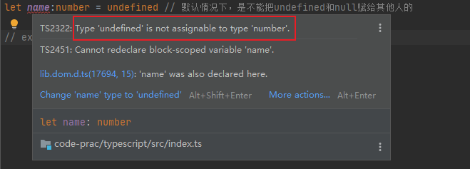

[TOC]


# 环境配置和搭建

## 什么是`TypeScript`

`TypeScript`是`JavaScript`的超集，遵循最新的`ES5/ES6`规范。`TypeScript`扩展了`JavaScript`语法

为什么要有`TS`

- `TS`更像后端语言，如`JAVA`，可以开发大型企业应用
- `TS`提供的类型系统，可以帮助我们在写代码时提供丰富的语法提示
- 在编写代码时，会对代码进行类型检查从而避免很多线上错误

> `TypeScript`不会取代`js`，两者是相互共存的
>
> 尤雨溪：我认为将类型添加到`js`本身是一个漫长的过程。让委员会设计一个类型系统是（根据`TC39`的经历来判断）不切实际的
>
> 我也是这么认为的


## 环境配置

### 全局编译`TS`文件

全局安装`typescript`对`ts`进行编译

```bash
npm i typescript -g
tsc --init # 生成tsconfig.json
```

```bash
tsc # 可以将ts文件编译成js文件
tsc --watch # 监控ts文件变化生成js文件
```

本地安装

```bash
npm i typescript -D
npx tsc --init
```

创建`tsconfig.json`，以下是默认生成的配置

```bash
npx tsc --init

Created a new tsconfig.json with:                                                                                       
                                                                                                                     TS 
  target: es2016
  module: commonjs
  strict: true
  esModuleInterop: true
  skipLibCheck: true
  forceConsistentCasingInFileNames: true


You can learn more at https://aka.ms/tsconfig

```

新建`src/1.ts`

```ts
let string:String = 'hello'
```

会根据配置文件，将其转为`js`语法

使用`tsc`指令，将文件转化为`js`语法，默认不添加文件名，会将当前目录及子目录下，所有的`ts`文件全部转为`js`文件，如果是局部安装，则使用`npx tsc`指令


`1.js`

```js
"use strict";
let string = 'hello';

```

但我们希望的是实时编译，使用`npx tsc --watch`指令

```bash
D:\workspace\github\code\project-workshop\code-prac\typescript>npx tsc --watch
[下午10:44:16] File change detected. Starting incremental compilation...

[下午10:44:16] Found 0 errors. Watching for file changes.

```

修改`1.ts`，是会实时编译的

```ts
let string:String = 'hello1'
let hello:String = 'hello'
```

`1.js`

```js
"use strict";
let string = 'hello1';
let hello = 'hello';

```

### `code runner + ts-node`

现在我们还希望，直接运行`ts`文件，比如打印下`string`变量，目前可行的办法是，编译成`js`后，运行`js`文件

但很麻烦，借助于`code runner`插件（需要在`vscode`插件市场搜索安装），并安装`npm install ts-node -g`，必须装在全局

`1.ts`

```ts
let string:String = 'hello1'

let hello:String = 'hello' // 选中
console.log(hello) // 选中
```

然后选择`1.ts`中的代码，右键运行`Run Code`，控制台会打印输出`hello`

同级目录下，会生成`tempCodeRunnerFile.js`，内容是选中的内容，然后借助了`ts-node`环境执行了该文件


无论是全局编译还是使用code runner + ts-code`来处理`ts`文件，在我们真正写代码时，还是不能满足需求的，所以要借助构建工具

可以使用`webpack`或`rollup`

### 构建工具来处理`ts`

由于学习`ts`的过程中，并不会处理图片等资源，这里的构建工具暂不选取`webpack`，而使用`rollup`

拓展：解析`ts`的方式有两种

- `ts`插件来解析
- 通过`babel`来解析

在`rollup`中，会采用`rollup-plugin-typescript2`包，配合当前配置文件来解析`ts`

在`webpack`中，会采用`ts-loader`或者`babel-plugin-typescript`包来解析

#### `rollup`来处理`ts`

新建`rollup.config.js`

本地安装

- `rollup`
- `typescript`
- `rollup-plugin-typescript2`：连接`rollup`和`typescript`的桥梁
- `@rollup/plugin-node-resolve`：以`node`的方式导入第三方包
- `rollup-plugin-serve`：起服务相关

在根路径下，`npm init -y`初始化`package.json`

根目录下安装

```bash
npm i rollup typescript rollup-plugin-typescript2 @rollup/plugin-node-resolve rollup-plugin-serve -D
```

安装后的`package.json`

```json
{
  "name": "typescript",
  "version": "1.0.0",
  "description": "",
  "main": "index.js",
  "scripts": {
    "test": "echo \"Error: no test specified\" && exit 1"
  },
  "keywords": [],
  "author": "",
  "license": "ISC",
  "devDependencies": {
    "@rollup/plugin-node-resolve": "^13.3.0",
    "rollup": "^2.77.0",
    "rollup-plugin-serve": "^2.0.0",
    "rollup-plugin-typescript2": "^0.32.1",
    "typescript": "^4.7.4"
  }
}

```

新建`src/index.ts`文件

配置`rollup.config.js`

```js
import {nodeResolve} from "@rollup/plugin-node-resolve"

import ts from "rollup-plugin-typescript2"
import serve from "rollup-plugin-serve"
import path from "path"

export default {
    input:'src/index.ts',
    output: {
        file: path.resolve(__dirname, 'dist/bundle.js'),
        format: 'iife', // 告诉rollup，打包后的代码是可以执行的，所以打包成立即执行函数
        // 常见的有global(弄个全局变量来接受)
        // cjs（会变成module.exports）
        // esm（会变成 import export的es6语法）
        // umd（兼容amd + commonjs，不支持es6导入）
        // rollup的配置文件，支持es6语法，它就是根据es6的语法来解析的
        sourcemap: true // ts的配置文件也得配，ts配置文件中，搜索sourceMap，取消注释即可
    },
    plugins: [
        // 1.先拿到ts文件
        nodeResolve({
            extensions: ['.js', '.ts'] // 默认解析ts文件
        }),
        // 2.根据配置文件解析
        ts({
            // 指定好ts的配置文件
            tsconfig: path.resolve(__dirname, 'tsconfig.json')
        }),
        // 3.最后提供服务
        serve({
            port: 3000, // 指定服务的端口号
            contentBase: '', // 指定根目录
            openPage: '/public/index.html' // 需要新建该目录和文件，并在index.html中引入`dist/bundle.js`
        })
    ]

}
```

备注：`ts`的配置文件也得配`sourceMap`，搜索`sourceMap`，取消注释即可

`package.json`中新增`script`

```json
  "scripts": {
    "test": "echo \"Error: no test specified\" && exit 1",
    "dev": "rollup -cw"
  },
```

执行`npm run dev`

报错：

```bash
[!] Error: Incompatible tsconfig option. Module resolves to 'CommonJS'. This is incompatible with rollup, please use 'module: "ES2015"' or 'module: "ESNext"'.
Error: Incompatible tsconfig option. Module resolves to 'CommonJS'. This is incompatible with rollup, please use 'module: "ES2015"' or 'module: "ESNext"'.

```

将`ts`的配置文件的`module`字段的值，改为`ESNext`（默认的是`commonjs`）

再次执行`npm run dev`

成功：

```bash
bundles src/index.ts → dist/bundle.js...
rpt2: options error TS6053: File 'D:/workspace/github/code/project-workshop/code-prac/typescript/src/index.ts' not found.
  The file is in the program because:
    Root file specified for compilation
http://localhost:3000 -> D:\workspace\github\code\project-workshop\code-prac\typescript
(!) Generated an empty chunk
index
created dist/bundle.js in 4.5s

```

目前我们是没有写任何`ts`代码的，所以会有如上提示

在`src/index.ts`中写点内容

```ts
let str:String = "hello"
console.log(str)

```

注意要打印该变量（使用该变量），因为`rollup`默认开启了`tree-shaking`

保存后查看`dist/bundle.js`

```js
(function () {
	'use strict';

	let str = "hello";
	console.log(str);

})();
//# sourceMappingURL=bundle.js.map

```


# `ts`中的基本类型

- 最基本的类型有，数字、字符、布尔
- 所有的类型都在冒号后面，`ts`的核心：一切都以安全为准
- 什么时候可以不用类型（推导）

基本演示

```ts
// 基础类型，基本演示
let num:number = 1
let str:string = 'sai'
let bool:boolean = true

```

## 数字类型

```ts
// 数字类型
// 分清小写`number`和大写`Number`的区别（`js`基础）
let num2:Number = 2 // 类，也可以当做类型
let num3:number = Number(1)
let num4:Number = new Number(1)

```

`bundle.js`

```js
(function () {
	'use strict';

	// 数字类型
	// 分清小写`number`和大写`Number`的区别（`js`基础）
	let num2 = 2; // 类，也可以当做类型
	let num3 = Number(1);
	let num4 = new Number(1);
	console.log(num2, num3, num4);

})();
//# sourceMappingURL=bundle.js.map

```

## 数组类型

```ts
// 数组类型，数组的概念：一类类型的集合
const arr:number[]  = [] // 声明只放数字的数组
const arr2:(number | string)[] = ['a', 1] // 联合类型，声明既可以放数字，也可以放字符串的数组（并集）
const arr3:any[] = ['', 1, {}] // 如果数组里放的内容就是不规律的
const arr4:Array<boolean> = [true, false] // 利用泛型来定义数组

```

`bundle.js`

```js
(function () {
	'use strict';

	// 数组类型，数组的概念：一类类型的集合
	const arr = []; // 声明只放数字的数组
	const arr2 = ['a', 1]; // 联合类型，声明既可以放数字，也可以放字符串的数组（并集）
	const arr3 = ['', 1, {}]; // 如果数组里放的内容就是不规律的
	const arr4 = [true, false]; // 利用泛型来定义数组
	console.log(arr, arr2, arr3, arr4);

})();
//# sourceMappingURL=bundle.js.map

```

## 元组类型

```ts
// 元组，内容固定，类型固定
const tuple:[string, boolean, number] = ['a', true, 2] // 初始化的时候，必须按照要填入数据
let r = tuple.pop() // r的类型，三种都有可能，还有可能是undefined
console.log(r)
tuple.push('bb', 1) // 在放入的时候，只能放入元组中定义的类型
// tuple[3] = 100 // 不能通过索引来更改元组

// 应用场景：数据交换（要用到泛型，后面再说）

```

`bundle.js`

```js
(function () {
	'use strict';

	// 元组，内容固定，类型固定
	const tuple = ['a', true, 2]; // 初始化的时候，必须按照要填入数据
	let r = tuple.pop(); // r的类型，三种都有可能，还有可能是undefined
	console.log(r);
	tuple.push('bb', 1); // 在放入的时候，只能放入元组中定义的类型
	// tuple[3] = 100 // 不能通过索引来更改元组
	// 应用场景：数据交换（要用到泛型，后面再说）

})();
//# sourceMappingURL=bundle.js.map

```

## 枚举类型

`ts`最终编译成的`js`是没有类型的，只是在开发时使用，分为普通枚举、异构枚举和常量枚举

- 普通枚举

  ```ts
  // 普通枚举
  enum ROLE { // 大写是规范
      USER,
      ADMIN,
      MANAGE
  }
  
  console.log(ROLE) // 值是默认加上的，可以通过USER取0，ADMIN取1
  // 同时还可以反举，通过0来取USER，2取ADMIN
  // {
  //     '0': 'USER',
  //     '1': 'ADMIN',
  //     '2': 'MANAGE',
  //     USER: 0,
  //     ADMIN: 1,
  //     MANAGE: 2
  // }
  ```

  `bundle.js`

  ```js
  (function () {
      'use strict';
  
      // 普通枚举
      var ROLE;
      (function (ROLE) {
          ROLE[ROLE["USER"] = 0] = "USER";
          ROLE[ROLE["ADMIN"] = 1] = "ADMIN";
          ROLE[ROLE["MANAGE"] = 2] = "MANAGE";
      })(ROLE || (ROLE = {}));
      console.log(ROLE); // 值是默认加上的，可以通过USER取0，ADMIN取1
      // 同时还可以反举，通过0来取USER，2取ADMIN（仅限于数字）
      // {
      //     '0': 'USER',
      //     '1': 'ADMIN',
      //     '2': 'MANAGE',
      //     USER: 0,
      //     ADMIN: 1,
      //     MANAGE: 2
      // }
  
  })();
  //# sourceMappingURL=bundle.js.map
  
  ```

- 异构枚举

  ```ts
  // 异构枚举
  enum ROLE {
      USER = 'USER', // 放字符串是不支持反举的
      ADMIN = 5,
      MANAGE // 会根据上一个的值，自动进行推断，值默认往后加一
  }
  
  console.log(ROLE)
  // { '5': 'ADMIN', '6': 'MANAGE', USER: 'USER', ADMIN: 5, MANAGE: 6 }
  
  ```

  `bundle.js`

  ```js
  (function () {
      'use strict';
  
      // 异构枚举
      var ROLE;
      (function (ROLE) {
          ROLE["USER"] = "USER";
          ROLE[ROLE["ADMIN"] = 5] = "ADMIN";
          ROLE[ROLE["MANAGE"] = 6] = "MANAGE";
      })(ROLE || (ROLE = {}));
      console.log(ROLE);
  
  })();
  //# sourceMappingURL=bundle.js.map
  
  ```

  加上`const`后，不会生成一个对象（更简洁），没有反举了

  ```ts
  // 异构枚举
  const enum ROLE {
      USER = 'USER',
      ADMIN = 5,
      MANAGE
  }
  
  console.log(ROLE.USER) // USER
  
  ```

  `bundle.js`

  ```js
  (function () {
      'use strict';
  
      console.log("USER" /* ROLE.USER */);
  
  })();
  //# sourceMappingURL=bundle.js.map
  
  ```

## `null`和`undefined`

`null`和`undefined`是任何类型的子类型，可以赋值给其他类型

```ts
let name:number = undefined // 默认情况下，是不能把undefined和null赋给其他人的
```



修改`ts`的配置文件，取消`strictNullChecks`字段的注释，设置为`false`，或者不用改这里，直接取消严格模式

由于`name`变量已经在`ts`的全局环境中定义了，所以导出当前的变量

```ts
let name:number = undefined // 默认情况下，是不能把undefined和null赋给其他人的

export {} // ts默认全局下已经有了一个name，导出防止模块间的数据共享类型
```

`bundle.js`

```js
(function () {
	'use strict';

	let name = undefined; // 默认情况下，是不能把undefined和null赋给其他人的
	console.log(name);

})();
//# sourceMappingURL=bundle.js.map

```

我们回复对`ts`配置文件的修改，在严格模式下，`undefined`赋值给`undefined`，`null`赋值给`null`，是没有问题的

```ts
let u:undefined = undefined
let n:null = null
console.log(u, n)
```

`bundle.js`

```js
(function () {
	'use strict';

	let u = undefined;
	let n = null;
	console.log(u, n);

})();
//# sourceMappingURL=bundle.js.map

```

## `never`

表示代码无法达到终点（无法执行到），也是任何类型的子类型

- 出错

  ```ts
  // 应用场景：出错了，我希望抛个错，错误函数的类型，可以设置成never类型
  function throwError():never { // never可以赋值给void，因为它是任意类型的子类型
      throw new Error()
  }
  
  let xxx:string = throwError() // never可以赋值给任意类型
  ```

  

- 死循环

  ```ts
  function whileTrue():never { // 代码本身是不知道内部有没有死循环的，所以要明确指出，返回值就是never
      while(true) {
  
      }
  }
  ```

- 永远走不到的判断

- 做代码的完整性校验

  ```ts
  function setVal(val:string) {
      if(typeof val === 'string') {
  
      } else {
          // 这里永远走不到，因为入参已经限制死了
          // 帮我们代码做完整校验，走不到else中，val就是never
          val 
      }
  }
  ```

  

## `void`

`void`一般用来描述函数返回值，也可以描述变量

只能把`undefined`和`null`赋值给`void`

```ts
function getVoid():void { // 指定返回值为void时
    // return undefined 并且函数内部啥都不写，相当于返回undefined，undefined是可以赋值给void的，写法时兼容的
    // 那么返回null呢？可以取消严格模式，或者设置ts配置文件的`strictNullChecks`字段为false,就可以将null赋值给void，但一般不会这么写（都会在严格模式下写代码）
}
a = getVoid() // 当a的类型是void时，就知道该方法没有返回值了
```

## `object`

非原始数据，后面泛型约束，会大量使用`object`

```ts
function create(obj:object) {

}
create({})
create(function () {

})
create([])


```

## `symbol`和`bigint`

`js`本身有的类型，并不是`ts`提供的

**`Symbol`**

```ts
let s1:symbol = Symbol(1)
let s2:symbol = Symbol(2)
console.log(s1 === s2) // false
```

无法编译成`es5`，会原样输出

`bundle.js`

```js
(function () {
	'use strict';

	let s1 = Symbol(1);
	let s2 = Symbol(2);
	console.log(s1 === s2); // false

})();
//# sourceMappingURL=bundle.js.map

```

**`bigint`**

```ts
let max = Number.MAX_SAFE_INTEGER
console.log(max + 1 === max + 2); // true 取到js中的最大值，然后相加，结果为true，很明显是有问题的
let r1:bigint = BigInt(max)
console.log(BigInt(max) + BigInt(1) === BigInt(max) + BigInt(2)) // false
```

`bundle.js`

```js
(function () {
	'use strict';

	let max = Number.MAX_SAFE_INTEGER;
	console.log(max + 1 === max + 2); // true 取到js中的最大值，然后相加，结果为true，很明显是有问题的
	BigInt(max);
	console.log(BigInt(max) + BigInt(1) === BigInt(max) + BigInt(2)); // false

})();
//# sourceMappingURL=bundle.js.map

```


