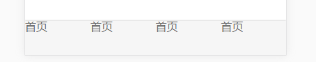
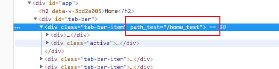
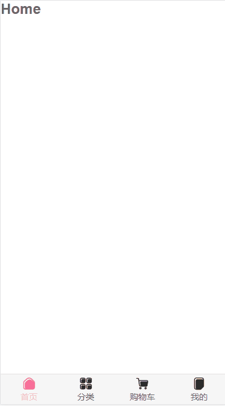
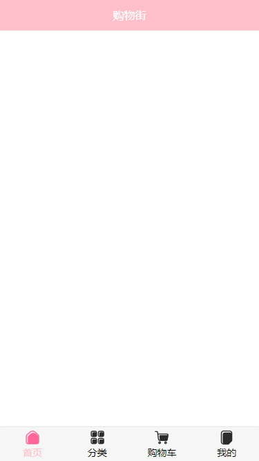

[TOC]


# vue基础

## Vue是什么？

一套用于构建用户界面的`渐进式`Javascript框架

### Vue的特点

1.采用组件化模式，提高代码复用率、且代码更好维护

2.声明式编码，让编码人员无需直接操作DOM，提高开发效率

### 官网使用指南

API：https://cn.vuejs.org/v2/api/

风格指南：https://cn.vuejs.org/v2/style-guide/

## vue安装

- 直接cdn引入
- 下载和引入
- npm安装


- 下载开发版本，链接：https://cn.vuejs.org/js/vue.js
- 下载调试插件，链接：https://www.aliyundrive.com/s/c6MCJCh3hku
- 关闭生产提示

```html
<!doctype html>
<html lang="en">
<head>
    <meta charset="UTF-8">
    <meta name="viewport"
          content="width=device-width, user-scalable=no, initial-scale=1.0, maximum-scale=1.0, minimum-scale=1.0">
    <meta http-equiv="X-UA-Compatible" content="ie=edge">
    <title>初始vue</title>
<!--    引入vue-->
    <script type="text/javascript" src="js/vue.js"></script>
</head>
<body>
<!--准备一个容器-->
    <div id="root">
    </div>

<script>
    Vue.config.productionTip = false //阻止vue在启动时的生产提示
</script>
</body>
</html>
```

## Vue初体验

### hello world

```html
<!doctype html>
<html lang="en">
<head>
    <meta charset="UTF-8">
    <meta name="viewport"
          content="width=device-width, user-scalable=no, initial-scale=1.0, maximum-scale=1.0, minimum-scale=1.0">
    <meta http-equiv="X-UA-Compatible" content="ie=edge">
    <title>初始vue</title>
<!--    引入vue-->
    <script type="text/javascript" src="js/vue.js"></script>
</head>
<body>
<!--准备一个容器-->
    <div id="root">
        <h1>Hello {{name}}.{{address}}.{{Date.now()}}</h1>
    </div>

<script>
    Vue.config.productionTip = false //阻止vue在启动时的生产提示

    // 创建Vue实例
    new Vue(
        {
            el: '#root', // el用于指定当前Vue实例为哪个容器服务，值通常为css选择器字符串
            data: {
                // data中用于存储数据，数据供el所指定的容器去使用，值我们暂时先写成一个对象
                name:'akira',
                address:'Ocean'
            }
        }
    )
</script>
</body>
</html>
```

效果如下：

我们可以动态更改数据


### Vue列表的展示

```html
<!DOCTYPE html>
<html lang="en">
<head>
    <meta charset="UTF-8">
    <title>Title</title>
</head>
<body>

<div id="app">
    <ul>
        <li v-for="item in movies">{{item}}</li>
    </ul>
</div>

<script src="js/vue.js"></script>
<script>
    const app = new Vue({
        //用于挂载需要管理的元素
        el: '#app',
        //定义数据
        data: {
            message: '你好啊',
            movies: ['aaaa','bbbb','cccc','dddd']
        }
    })
</script>
</body>
</html>
```

### Vue计数器

```html
<!DOCTYPE html>
<html lang="en">
<head>
    <meta charset="UTF-8">
    <title>Title</title>
</head>
<body>

<div id="app">
    <h2>当前计数: {{counter}}</h2>
    <button v-on:click="add">+</button>
    //简写
    <button @click="sub">-</button>
</div>

<script src="js/vue.js"></script>
<script>
    const app = new Vue({
        //用于挂载需要管理的元素
        el: '#app',
        //定义数据
        data: {
            counter: 0
        },
        methods:{
            add(){
                this.counter++
            },
            sub(){
                this.counter--
            }
        }
    })
</script>
</body>
</html>
```

## Vue的mvvm

- 计数器的mvvm
  - 我们的计数器中，就有严格的mvvm思想
    - View依然使我们的dom
    - Model就是我们抽离出来的obj
    - ViewModel就是我们创建的Vue对象实例
  - 它们之间如何工作呢？
    - 首先ViewModel通过DataBinding让obj中的数据实时在Dom中显示
    - 其次ViewModel通过Dom Listener来监听DOM事件，并且通过methods中的操作，来改变obj中的 数据
- 有了Vue帮助我们完成VueModel层的任务，在后续的研发，我们就可以专注于数据的处理，以及DOM的编写工作了


vm就对应vue实例

事实上，所有出现在vm身上的，view中都可以调用，vue实例对象原型上的也都可以调用

```html
<!doctype html>
<html lang="en">
<head>
    <meta charset="UTF-8">
    <meta name="viewport"
          content="width=device-width, user-scalable=no, initial-scale=1.0, maximum-scale=1.0, minimum-scale=1.0">
    <meta http-equiv="X-UA-Compatible" content="ie=edge">
    <title>初始vue</title>
    <!--    引入vue-->
    <script type="text/javascript" src="js/vue.js"></script>
</head>
<body>
<!--准备一个容器-->
<div id="root">
    <div>data中有的：</div>
    <h1>{{name}}</h1>
    <div>data中没有，vue实例中有的：</div>
    <h1>{{$options}}</h1>
    <div>data中没有，vue实例对象的原型对象有的：</div>
    <h1>{{_c}}</h1>
<!--    -->
</div>

<script>
    Vue.config.productionTip = false //阻止vue在启动时的生产提示

    // 创建Vue实例
    const vm = new Vue(
        {
            data: {
                // data中用于存储数据，数据供el所指定的容器去使用，值我们暂时先写成一个对象
                name: 'akira',
                engine: {
                    name: 'google',
                    url: 'www.google.com'
                }
            }
        }
    )

    vm.$mount('#root')
</script>
</body>
</html>
```


### Vue的options选项

- el:
- data:
- method:
- 生命周期函数:

### Vue生命周期

#### Vue的生命周期函数有哪些

# 基础语法
## 数据绑定

v-bind是单向数据绑定

v-model是双向数据绑定

- v-model只能应用在表单类元素（输入类元素）

```html
双向数据绑定：<input type="text" v-model="name"><br>
```


```html
<!doctype html>
<html lang="en">
<head>
    <meta charset="UTF-8">
    <meta name="viewport"
          content="width=device-width, user-scalable=no, initial-scale=1.0, maximum-scale=1.0, minimum-scale=1.0">
    <meta http-equiv="X-UA-Compatible" content="ie=edge">
    <title>初始vue</title>
    <!--    引入vue-->
    <script type="text/javascript" src="js/vue.js"></script>
</head>
<body>
<!--准备一个容器-->
<div id="root">
    单向数据绑定：<input type="text" v-bind:value="name"><br>
    双向数据绑定：<input type="text" v-model:value="name"><br>

    <hr>
    简写：<br>
    单向数据绑定：<input type="text" :value="name"><br>
    双向数据绑定：<input type="text" v-model="name"><br>

    <!--        下面一行是错误的，因为v-model只能应用在表单类元素（输入类元素）-->
    <!--        <h2 v-model:x="name">hello</h2>-->

</div>

<script>
    Vue.config.productionTip = false //阻止vue在启动时的生产提示

    // 创建Vue实例
    new Vue(
        {
            el: '#root', // el用于指定当前Vue实例为哪个容器服务，值通常为css选择器字符串
            data: {
                // data中用于存储数据，数据供el所指定的容器去使用，值我们暂时先写成一个对象
                name: 'akira',
                engine: {
                    name: 'google',
                    url: 'www.google.com'
                }
            }
        }
    )
</script>
</body>
</html>
```

### el和data的两种写法

- el的两种写法

1.一开始就要想好，为哪个容器服务

```html
<script>
	new Vue({
        el:'#root',
        data:{
            
        }
    })
</script>
```


2.写完之后，再去指定服务的容器

```html
<script>
	const v = new Vue({
        data: {
            
        }
    })
    
    v.$mount('#root')
</script>
```

- data的两种写法

1.对象式

```html
<script>
	new Vue({
        el:'#root',
        data: {
            name:'akira'
        }
    })
</script>
```

2.函数式

data函数不能写成箭头函数，否则里面的this，是window，而不是vue实例

由vue管理的函数，一定不要写成箭头函数

```html
<script>
	new Vue({
        el:'#root',
		data: function() {
            name:'akira'
        }
    })
</script>

// 简写：
<script>
	new Vue({
        el:'#root',
		data() {
            name:'akira'
        }
    })
</script>
```

### 数据代理

#### Object.defineProperty

基本配置项

```
Object.defineProperty('person','age',{
    value: 18.
    enumerable: true, // 控制属性是否可以被枚举，默认false
    writable: true, // 控制属性是否可以被修改，默认false
    configurable:true //控制属性是否可以被删除，默认false
})
```


```html
<!doctype html>
<html lang="en">
<head>
    <meta charset="UTF-8">
    <meta name="viewport"
          content="width=device-width, user-scalable=no, initial-scale=1.0, maximum-scale=1.0, minimum-scale=1.0">
    <meta http-equiv="X-UA-Compatible" content="ie=edge">
    <title>初始vue</title>
    <!--    引入vue-->
    <script type="text/javascript" src="js/vue.js"></script>
</head>
<body>
<!--准备一个容器-->
<div id="root">

</div>

<script>
    Vue.config.productionTip = false //阻止vue在启动时的生产提示
    let person = {
        name: 'akira',
        age: 18
    }

    Object.defineProperty('person','age',{
        value: 18.
        enumerable: true, // 控制属性是否可以被枚举，默认false
        writable: true, // 控制属性是否可以被修改，默认false
        configurable:true //控制属性是否可以被删除，默认false
    })
</script>
</body>
</html>
```

高级配置项

```html
    Object.defineProperty(person,'age',{

        // 当有人读取person的age属性时，get函数(getter)就会被调用，且返回值就是age的值
        get () {
            return number
        },
        // 当有人修改person的age属性时，set函数(setter)就会被调用，且返回值就是age的值
        set(value) {
            num = value
        }
    })
```

#### 数据代理

数据代理：通过一个对象代理另一个对象中属性的操作（读/写）

我可以直接操作obj的属性，但我也可以通过obj2来操作obj的属性：

```html
<script>
    let obj = {x:100}
    let obj2 = {y:200}

    Object.defineProperty('obj2','x',{

        get () {
            return obj.x
        },
        set(value) {
            obj.x = value
        }
    })
</script>
```


```html
<script>
    Vue.config.productionTip = false //阻止vue在启动时的生产提示
    data = {
        name: 'akira',
        age: '18'
    }
    // 创建Vue实例
    const vm = new Vue(
        {
            el: '#root',
            data
        }
    )
</script>
```


Vue实例传入的是options对象，options有el、data等属性

vm里面的`_data`属性，就是自己定义的data，`vm._data = options.data = data`

通过vm对象，来代理data对象


数据代理图示


Vue中数据代理的好处：

- 更加方便操作data中的数据

数据代理的基本原理：

- 通过Object.defineProperty()把data对象中所有属性添加到vm中
- 为每一个添加到vm上的属性，都指定一个getter/setter
- 在getter/setter内部去操作（读/写）data中对应的属性

_data里面的属性，并不是直接赋值的，还有一层数据代理，以实现响应式：更改name，页面就有变化


## 模板语法

```html
<h3>Hello {{name}}</h3>
<a v-bind:href="engine.url.toUpperCase()">click me to search</a>
<a :href="engine.url.toUpperCase()">click me to search {{engine.name}}</a>
```


```html
<!doctype html>
<html lang="en">
<head>
    <meta charset="UTF-8">
    <meta name="viewport"
          content="width=device-width, user-scalable=no, initial-scale=1.0, maximum-scale=1.0, minimum-scale=1.0">
    <meta http-equiv="X-UA-Compatible" content="ie=edge">
    <title>初始vue</title>
<!--    引入vue-->
    <script type="text/javascript" src="js/vue.js"></script>
</head>
<body>
<!--准备一个容器-->
    <div id="root">
        <h1>差值语法</h1>
        <h3>Hello {{name}}</h3>
        <hr>

        <h1>指令语法</h1>
        <a v-bind:href="engine.url.toUpperCase()">click me to search</a>
        <br>
        <a :href="engine.url.toUpperCase()">click me to search {{engine.name}}</a>

    </div>

<script>
    Vue.config.productionTip = false //阻止vue在启动时的生产提示

    // 创建Vue实例
    new Vue(
        {
            el: '#root', // el用于指定当前Vue实例为哪个容器服务，值通常为css选择器字符串
            data: {
                // data中用于存储数据，数据供el所指定的容器去使用，值我们暂时先写成一个对象
                name:'akira',
                engine:{
                    name:'google',
                    url:'www.google.com'
                }
            }
        }
    )
</script>
</body>
</html>
```


## v-bind

```html
<!DOCTYPE html>
<html lang="en">
<head>
    <meta charset="UTF-8">
    <title>Title</title>
</head>
<body>

<div id="app">
    
<!--    简写-->
    <a :href="hrefURL">百度一下</a>
</div>

<script src="js/vue.js"></script>
<script>
    const app = new Vue({
        //用于挂载需要管理的元素
        el: '#app',
        //定义数据
        data: {
            message: 'hello world',
            imgURL: 'https://cdn.cnbj1.fds.api.mi-img.com/mi-mall/cb8859c31e431fe84c8977705d1bd442.jpg?w=2452&h=920',
            hrefURL: 'https://www.baidu.com'
        }
    })
</script>
</body>
</html>
```

### v-bind_动态绑定class（对象语法）

```html
<!DOCTYPE html>
<html lang="en">
<head>
    <meta charset="UTF-8">
    <title>Title</title>
    <style>
        .active{
            color: red;
        }
    </style>
</head>
<body>

<div id="app">
    <h2 v-bind:class="{active: isActive, line: isLine}">{{message}}</h2>
    <button v-on:click="btnClick">按钮</button>
</div>

<script src="js/vue.js"></script>
<script>
    const app = new Vue({
        //用于挂载需要管理的元素
        el: '#app',
        //定义数据
        data: {
            message: 'hello world',
            isActive: true,
            isLine: true
        },
        methods:{
            btnClick: function () {
                this.isActive = !this.isActive
            }
        }
    })
</script>

</body>
</html>
```

### v-bind_动态绑定class（数组语法）

```html
<!DOCTYPE html>
<html lang="en">
<head>
    <meta charset="UTF-8">
    <title>Title</title>
    <style>
        .active{
            color: red;
        }
    </style>
</head>
<body>

<div id="app">
    <h2 v-bind:class="getClass()">{{message}}</h2>
</div>

<script src="js/vue.js"></script>
<script>
    const app = new Vue({
        //用于挂载需要管理的元素
        el: '#app',
        //定义数据
        data: {
            message: 'hello world',
            active: 'aaa',
            line: 'bbb'
        },
        methods:{
            getClass: function () {
                return [this.active,this.line]
            }
        }
    })
</script>

</body>
</html>
```

### v-bind_动态绑定style（对象语法）

```html
<!DOCTYPE html>
<html lang="en">
<head>
    <meta charset="UTF-8">
    <title>Title</title>
    <style>
        .active{
            color: red;
        }
    </style>
</head>
<body>

<div id="app">
    <h2 v-bind:style="getStyle()">{{message}}</h2>
</div>

<script src="js/vue.js"></script>
<script>
    const app = new Vue({
        //用于挂载需要管理的元素
        el: '#app',
        //定义数据
        data: {
            message: 'hello world',
            finalColor: 'red',
            finalSize: '100px'
        },
        methods: {
            getStyle: function () {
                return {color : this.finalColor, fontSize : this.finalSize}
            }
        }
    })
</script>

</body>
</html>
```

### v-bind_动态绑定style（数组语法）

```html
<!DOCTYPE html>
<html lang="en">
<head>
    <meta charset="UTF-8">
    <title>Title</title>
    <style>
        .active{
            color: red;
        }
    </style>
</head>
<body>
<div id="app">
    <h2 v-bind:style="[baseStyle,baseStyle1]">{{message}}</h2>
</div>

<script src="js/vue.js"></script>
<script>
    const app = new Vue({
        //用于挂载需要管理的元素
        el: '#app',
        //定义数据
        data: {
            message: 'hello world',
            baseStyle: {backgroundColor:'red'},
            baseStyle1: {fontSize:"30px"}
        }
    })
</script>
</body>
</html>
```

### 其他指令使用

v-html

v-text

v-pre

v-cloak

```html
    <div id="app">
        <p v-cloak>{{ msg }}</p>
        <p v-text="msg"></p>
        <p v-html="msg"></p>
    </div>

    <script type="text/javascript">
        var vm = new Vue({
            el : "#app",
            data : {
                msg : "<h1>这是一个h1元素内容</h1>"
            }
        });
    </script>
```


## 事件处理

#### 不传参

```html
        <button v-on:click="showInfo1">点我提示信息（不传参）</button>
```

简写`@`

```html
        <button @click="showInfo1">点我提示信息（不传参）</button>
```


```html
<script>
    Vue.config.productionTip = false //阻止vue在启动时的生产提示

    // 创建Vue实例
    new Vue(
        {
            el: '#root',
            data: {
                name:'akira',
            },
            methods:{
                showInfo(event) {
                    alert('hello')
                    console.log(event)	
					// MouseEvent {isTrusted: true, screenX: 126, screenY: 117, clientX: 126, clientY: 23, …}
                }
            }

        }
    )
</script>
```

当不传参时，函数默认是有一个event参数的

#### js event对象

**一、event对象使用说明**

1、event代表事件的状态，例如触发event对象的元素、鼠标的位置及状态、按下的键等等；

2、firefox里的event跟IE里的不同，IE里的是全局变量，随时可用；firefox里的要用参数引导才能用，是运行时的临时变量。

3、在IE/Opera中是window.event，在Firefox中是event；而事件的对象，在IE中是window.event.srcElement，在Firefox中是event.target，Opera中两者都可用。

4、下面两句效果相同

var evt = (evt) ? evt : ((window.event) ? window.event : null);
var evt = evt || window.event; 

5、IE中事件的起泡

IE中事件可以沿着包容层次一点点起泡到上层，也就是说，下层的DOM节点定义的事件处理函数，到了上层的节点如果还有和下层相同事件类型的事件处理函数，那么上层的事件处理函数也会执行。例如， li 标签包含了 a ，如果这两个标签都有onclick事件的处理函数，那么执行的情况就是先执行标签 a 的onclick事件处理函数，再执行 li 的事件处理函数。如果希望的事件处理函数执行完毕之后，不希望执行上层的 li 的onclick的事件处理函数了，那么就把cancelBubble设置为true即可。

**二、js Event属性和方法**

1、type

事件的类型，如onlick中的click；

2、srcElement/target

事件源，就是发生事件的元素；

3、button

声明被按下的鼠标键，整数，1代表左键，2代表右键，4代表中键，如果按下多个键，酒把这些值加起来，所以3就代表左右键同时按下；（firefox中 0代表左键，1代表中间键，2代表右键）

4、clientX/clientY

事件发生的时候，鼠标相对于浏览器窗口可视文档区域的左上角的位置；(在DOM标准中，这两个属性值都不考虑文档的滚动情况，也就是说，无论文档滚动到哪里，只要事件发生在窗口左上角，clientX和clientY都是 0，所以在IE中，要想得到事件发生的坐标相对于文档开头的位置，要加上document.body.scrollLeft和 document.body.scrollTop)

5、offsetX,offsetY/layerX,layerY

事件发生的时候，鼠标相对于源元素左上角的位置；

6、x,y/pageX,pageY

检索相对于父要素鼠标水平坐标的整数；

7、altKey,ctrlKey,shiftKey等

返回一个布尔值；

8、keyCode

返回keydown何keyup事件发生的时候按键的代码，以及keypress 事件的Unicode字符；(firefox2不支持 event.keycode，可以用 event.which替代 )

9、fromElement,toElement

前者是指代mouseover事件中鼠标移动过的文档元素，后者指代mouseout事件中鼠标移动到的文档元素；

10、cancelBubble

一个布尔属性，把它设置为true的时候，将停止事件进一步起泡到包容层次的元素；(e.cancelBubble = true; 相当于 e.stopPropagation();)

11、returnValue

一个布尔属性，设置为false的时候可以组织浏览器执行默认的事件动作；(e.returnValue = false; 相当于 e.preventDefault();)

12、attachEvent(),detachEvent()/addEventListener(),removeEventListener

为制定DOM对象事件类型注册多个事件处理函数的方法，它们有两个参数，第一个是事件类型，第二个是事件处理函数。在
attachEvent()事件执行的时候，this关键字指向的是window对象，而不是发生事件的那个元素；

13、screenX、screenY

鼠标指针相对于显示器左上角的位置，如果你想打开新的窗口，这两个属性很重要；

#### 传参

```html
        <button @click="showInfo2(666)">点我提示信息（传参）</button>
```


```html
<script>
    Vue.config.productionTip = false //阻止vue在启动时的生产提示

    // 创建Vue实例
    new Vue(
        {
            el: '#root',
            data: {
                name:'akira',
            },
            methods:{
                showInfo2(value,event){
                    alert('world')
                    console.log(event) // undefined
                }
            }

        }
    )
</script>
```

事件传参时，需要通过`$event`关键词，告诉vue来管理event对象，参数位置无所谓前后

```html
        <button @click="showInfo2($event,666)">点我提示信息（传参）</button>
```

下面的event对象就可以捕获到了

```html
<script>
    Vue.config.productionTip = false //阻止vue在启动时的生产提示

    // 创建Vue实例
    new Vue(
        {
            el: '#root',
            data: {
                name:'akira',
            },
            methods:{
                showInfo2(event,value){
                    alert('world')
                    console.log(value) //666
                    console.log(event) //MouseEvent {isTrusted: true, screenX: 266, screenY: 109, clientX: 266, clientY: 15, …}
                }
            }

        }
    )
</script>
```

#### 事件中this的指向

methods的事件函数，正常写的时候，this指向当前vue实例，如果写成箭头函数，则this指向window对象

```html
<script>
    Vue.config.productionTip = false //阻止vue在启动时的生产提示

    // 创建Vue实例
    new Vue(
        {
            el: '#root',
            data: {
                name:'akira',
            },
            methods:{
                showInfo1(event) {
                    console.log(this)
                    // Vue实例
					// Vue {_uid: 0, _isVue: true, $options: {…}, _renderProxy: Proxy, _self: Vue, …}
                },
                showInfo2:(event,value) => {
                    console.log(this)
                    // Window对象
                    // Window {postMessage: ƒ, blur: ƒ, focus: ƒ, close: ƒ, parent: Window, …}
                }
            }

        }
    )
</script>
```

#### 事件修饰符

**vue中的事件修饰符**

- `prevent`：阻止默认事件（常用）

- `stop`：阻止事件冒泡（常用）
- `once`：事件只触发一次（常用）
- `capture`：使用事件的捕获模式
- `self`：只有`event.target`是当前操作的元素时才触发事件
- `passive`：事件的默认行为立即执行，无需等待事件回调完毕执行

**`prevent`**

js中通过event阻止事件的默认行为

通过调用`event`的`preventDefault()`标签的默认行为，即阻止`a`标签跳转：

```html
<body>
<!--准备一个容器-->
    <div id="root">
        <a href="http:www.baidu.com" @click="showInfo">点击我提示信息</a>
    </div>

<script>
    Vue.config.productionTip = false //阻止vue在启动时的生产提示

    // 创建Vue实例
    new Vue(
        {
            el: '#root',
            data: {
                name:'akira',
            },
            methods:{
                showInfo(event) {
                    event.preventDefault()
                    alert('hello')
                }
            }

        }
    )
</script>
</body>
```

vue中阻止事件的默认行为

```html
<a href="http:www.baidu.com" @click.prevent="showInfo2">点击我提示信息2</a>
```

**`stop`**

js中通过event阻止事件冒泡

```html
<body>
<!--准备一个容器-->
    <div id="root">
        <h1>阻止事件冒泡</h1>
        <div class="demo1" @click="showInfo3">
            <button @click="showInfo3">点击我提示信息3</button>
        </div>
    </div>

<script>
    // 创建Vue实例
    new Vue(
        {
            el: '#root',
            data: {
                name:'akira',
            },
            methods:{
                showInfo3(event) {
                    // 阻止事件冒泡，否则点击button，会弹出两次弹窗
                    event.stopPropagation()
                    alert('hello')
                }

            }

        }
    )
</script>
</body>
```

vue中阻止事件冒泡

```html
<button @click.stop="showInfo3">点击我提示信息3</button>
```

**`once`**

事件只触发一次，增加该属性后，第二次及以后点击并不会有弹窗

```html
<button @click.once="showInfo3">点击我提示信息3</button>
```

**`capture`**

js的事件捕获与事件冒泡

先触发事件捕获，捕获阶段是由外往内的

再触发事件冒泡，冒泡阶段是由内往外的，事件的真正处理，是在冒泡阶段的

我现在想在捕获阶段，就处理事件（使用事件的捕获模式）

```html
        <h1>事件捕获</h1>
        <div class="box1" @click="showMessage($event, 1)">
            <div class="box2" @click="showMessage($event, 2)">

            </div>
        </div>
```

```javascript
                showMessage(event, value){
                    console.log(value)
                }
```

点击内部的`box2`，控制台的输出顺序是先输出2，再输出1，这是符合上述描述的：事件的真正处理，是在冒泡阶段


若我们希望，事件在捕获阶段就处理，就可以使用`capture`修饰符

```html
        <div class="box1" @click.capture="showMessage($event, 1)">
            <div class="box2" @click="showMessage($event, 2)">

            </div>
        </div>
```

此时`box1`的事件，在捕获阶段就开始处理了，如果再点击`box2`，控制台输出的结果，是先输出1，再输出2

**`self`**

只有`event.target`是当前操作的元素时才触发事件

```html
    <div id="root">
        <h1>阻止事件冒泡</h1>
        <div class="demo1" @click.self="showInfo3">
            <button @click="showInfo3">点击我提示信息3</button>
        </div>
    </div>
```

如果没有`self`，点击`button`时，仍然会触发冒泡，但加了`self`之后，由于你再点`button`，当前操作的元素不是`div`，所以并不会触发`div`的冒泡，只会弹窗一次

**`passive`**

事件的默认行为立即执行，无需等待事件回调完毕执行

以滚轮事件为例

```html
       <ul @wheel="demo" class="list">
            <li>1</li>
            <li>2</li>
            <li>3</li>
            <li>4</li>
            <li>5</li>
            <li>6</li>
            <li>7</li>
            <li>8</li>
        </ul>
```

```javascript
                demo() {
                    for (let i = 0;i < 10000; i++){
                        console.log('#')
                    }
                    console.log('I am tired')
                }
```

在界面上，我们滑动鼠标滚轮，但是页面上的滚动条并没有往下走，

因为需要先触发`demo()`事件，`demo()`执行需要时间，等执行完之后，页面才会开始滚动

而`passive`，就是让事件的默认行为立即执行，无需等待回调完毕再执行

所以页面的效果是，滚动的同时，控制台也在持续的打印

#### 键盘事件

拿到输入的值


event的按键编码


.enter


常用的按键别名

- 回车：`enter`


查看键盘的按键


特殊的键

`tab`：需要配合`keydown`使用


系统修饰键

- 配合`keyup`使用：按下修饰键的同时，再按下其他键，随后释放其他键，事件才被触发
- 配合`keydown`使用：正常触发事件


`ctrl`：

`alt`：

`shift`：

`meta/win键`


`keycode`（不推荐，已废弃）

有些键盘的编码不统一


自定义按键别名

`Vue.config.keyCodes.自定义键名 = 键码`

#### 事件总结

- 修饰符可以连续写
- 系统修饰键可以加指定组合键
  - `@keyup.ctrl.y`

## 计算属性 computed

### 计算属性的基本使用

```html
<!DOCTYPE html>
<html lang="en">
<head>
    <meta charset="UTF-8">
    <title>Title</title>
    <style>
        .active{
            color: red;
        }
    </style>
</head>
<body>
<div id="app">
    <h2>{{message}}</h2>
    <h2>{{firstName + ' ' + lastName}}</h2>
    <h2>{{firstName}} {{lastName}}</h2>
    <h2>{{getFullName()}}</h2>
    <h2>{{FullName}}</h2>
</div>

<script src="js/vue.js"></script>
<script>
    const app = new Vue({
        //用于挂载需要管理的元素
        el: '#app',
        //定义数据
        data: {
            message: 'hello world',
            firstName: 'John',
            lastName: 'Cena'
        },
        methods:{
            getFullName(){
                return this.firstName + ' ' + this.lastName
            }
        },
        computed:{
            FullName:function () {
                return this.firstName + ' ' + this.lastName
            }
        }
    })
</script>
</body>
</html>
```

### 计算属性的复杂操作

```html
<!DOCTYPE html>
<html lang="en">
<head>
    <meta charset="UTF-8">
    <title>Title</title>
    <style>
        .active {
            color: red;
        }
    </style>
</head>
<body>
<div id="app">
    <h2>总价格是：{{totalPrice}}</h2>
</div>

<script src="js/vue.js"></script>
<script>
    const app = new Vue({
        //用于挂载需要管理的元素
        el: '#app',
        //定义数据
        data: {
            message: 'hello world',
            books: [
                {id: 100, name: 'Unix编程艺术', price: 119},
                {id: 110, name: '代码大全', price: 105},
                {id: 120, name: '深入理解计算机系统', price: 98},
                {id: 130, name: '现代操作系统', price: 100}
            ]
        },
        computed: {
            totalPrice: function () {
                let result = 0
                for (let i = 0; i < this.books.length; i++) {
                    result += this.books[i].price
                }
                return result

            }
        }

    })
</script>
</body>
</html>
```

### 计算属性setter和getter

```html
<!DOCTYPE html>
<html lang="en">
<head>
    <meta charset="UTF-8">
    <title>Title</title>
    <style>
        .active {
            color: red;
        }
    </style>
</head>
<body>
<div id="app">
    <h2>{{fullName}}</h2>
    <h2>{{fullName2}}</h2>
</div>

<script src="js/vue.js"></script>
<script>
    const app = new Vue({
        //用于挂载需要管理的元素
        el: '#app',
        //定义数据
        data: {
            message: 'hello world',
            firstName: 'John',
            lastName: 'Cena'
        },
        computed: {
          fullName: {
              set: function (newValue) {
                const names = newValue.split(' ')
                this.firstName = names[0]
                this.lastName = names[1]
              },
              get: function () {
                return this.firstName + ' ' + this.lastName
               }
          },
          //简写
          fullName2:function () {
              return this.firstName + ' ' + this.lastName
          }
        }
    })
</script>

</body>
</html>
```

### 计算属性和methods的对比

computed只会调用一次

### 块级作用域_let和var

块级作用域 JS中使用var来声明一个对象时，变量的作用域主要是和函数的定义有关

针对于其他块定义来说，是没有作用域的，比如if/for等，这在开发中往往会引起一些问题

```javascript
// if 和 for 里面没有块级作用域
var btns = document.getElementsByTagName("button")
for (var i = 0;i < btns.length;i++){    
	btns[i].addEventListener('click',function () 
	{        
		console.log('第'+i+'个按钮被点击')
		//第4个按钮被点击    
	})
}
```

使用闭包，因为函数是一个作用域

```javascript
    // if 和 for 里面没有块级作用域
    var btns = document.getElementsByTagName("button")
    for (var i = 0; i < btns.length; i++) {
        (function (i) {
            btns[i].addEventListener('click', function () {
                console.log('第' + i + '个按钮被点击')
            })
        })(i)
    }
```

ES6中的写法

```javascript
    const btns = document.getElementsByTagName("button")
    for (let i = 0; i < btns.length; i++) {
        btns[i].addEventListener('click', function () {
            console.log('第' + i + '个按钮被点击')
        })
    }
```

#### 闭包

### const的使用和注意点

在es6的开发中，优先使用const

一旦给const修饰的标识符被赋值后，不能修改

```javascript
const name = 'xiaoming'name = 'abc'console.log(name)
```

在使用const定义标识符，必须进行赋值

```javascript
const name;
```

const指向对象时不能修改，但是可以改变对象内部的属性

```javascript
const obj = {name: 'xiaoing', age: 10, height: 1.88}
obj.name = 'xiaohong'
obj.age = 11
obj.height = 1.89
console.log(obj);//{ name: 'xiaohong', age: 11, height: 1.89 }
```

### ES6对象字面量增强写法

属性的增强写法

```javascript
const name = "xiaoming"
const age = 18
const height = 1.88
//es5的写法
const obj = {    name: name,    age: age,    height: height}
console.log(obj);
//{ name: 'xiaoming', age: 18, height: 1.88 }
//es6的写法，属性增强写法
const obj2 = {    name,    age,    height}
console.log(obj2);
//{ name: 'xiaoming', age: 18, height: 1.88 }
```

函数属性的增强写法

```javascript
//es5的写法
const obj = {
    eat: function () {
        console.log('eat1')
    }
}
obj.eat()//eat1


//es6写法
const obj2 = {
    eat() {
        console.log('eat2');
    }
}
obj2.eat()//eat2
```

## v-on

### v-on的基本使用和语法糖

在前端开发中，我们经常需要和用户交互

这个时候就必须监听用户发生的事件，比如点击、拖拽等

在Vue中如何使用事件监听呢？ v-on指令，缩写 @

可以将事件指向一个在methods中的函数

```html
<!DOCTYPE html>
<html lang="en">
<head>
    <meta charset="UTF-8">
    <title>Title</title>
    <style>
        .active {
            color: red;
        }
    </style>
</head>
<body>
<div id="app">
    <h2>{{message}}</h2>
    <h2>{{counter}}</h2>
    <button @click="increament">+</button>
    <button @click="decrement">-</button>
</div>

<script src="js/vue.js"></script>
<script>
    const app = new Vue({
        //用于挂载需要管理的元素
        el: '#app',
        //定义数据
        data: {
            message: 'hello world',
            counter: 0
        },
        methods: {
            increament () {
                return this.counter++
            },
            decrement () {
                return this.counter--
            }
        }
    })
</script>


<script src="js/vue.js"></script>
</body>
</html>
```

### v-on的参数传递

当通过methods中定义方法，以供@click调用时，需要注意参数问题

1.如果该方法不需要额外参数，那么方法后的()可以不添加。但是需要注意：如果方法本身有一个参数，那么会默认将原生事件event参数传递进去。

2.如果需要同时传入某个参数，同时需要event时，可以通过$event传入事件。

```html
<!DOCTYPE html>
<html lang="en">
<head>
    <meta charset="UTF-8">
    <title>Title</title>
</head>
<body>
<div id="app">
    <h2>{{message}}</h2>
    <!--    事件调用的方法中没有参数-->
    <button @click="btnClick1()">btn0</button>
    <!--    省略括号-->
    <button @click="btnClick1">btn1</button>
    <br/>
    <!--    正常传参输出-->
    <button @click="btnClick2(123)">btn2</button>
    <!--    需要传入一个参数，此时省略了括号，但是方法本身是需要传入一个参数的，此时，vue会默认将浏览器产生的event事件对象传入到方法中-->
    <button @click="btnClick2">btn3</button>
    <!--    此时输出打印的是一个MouseEvent对象-->
    <!--    如果加了括号，但是没有传递参数，则会返回undefined-->
    <button @click="btnClick2()">btn4</button>
    <br/>
    <!--    定义方法时，我们需要event对象，同时又需要其他参数的时候，应该这样写-->
    <!--    在调用方法时，如何手动的获取到浏览器参数的event对象呢   $event-->
    <button @click="btnClick3(123, $event)">btn5</button>
    <button>btn6</button>
    <button>btn5</button>
</div>
<script src="js/vue.js"></script>
<script>
    const app = new Vue({
        //用于挂载需要管理的元素        
        el: '#app',
        //定义数据        
        data: {
            message: 'hello world',
        },
        methods: {
            btnClick1() {
                console.log('我没有参数');
            },
            btnClick2(event) {
                //有单个参数时，一般取名为event                
                console.log(event)
            },
            btnClick3(abc, event) {
                console.log(abc, event)
                //没有加$之前，此时默认的将event对象传入第一个形参            
            }
        }
    })
</script>
<script src="js/vue.js"></script>
</body>
</html>
```

拓展：如果函数需要参数，但是没有传入，那么函数的形参为undefined

```javascript
function test (aa) 
{    
	console.log(aa);
}
test()//undefined
```

### v-on修饰符的使用

vue提供了修饰符来帮助我们方便的处理一些事情：

- .stop 调用event.stopPropagation()
- .prevent 调用event.preventDefault()
- .{keyCode | keyAlias} 只当事件是从特定键触发时才触发回调
- .native 监听组件根元素的原生事件
- .once 只触发一次回调

.stop修饰符的使用

```html
<!DOCTYPE html>
<html lang="en">
<head>
    <meta charset="UTF-8">
    <title>Title</title>
</head>
<body>
<div id="app">
    <h2>{{message}}</h2>
    <div @click = "divClick">
        aaaaa
        <button @click.stop="btnClick">click</button>
    </div>
</div>

<script src="js/vue.js"></script>
<script>
    const app = new Vue({
        //用于挂载需要管理的元素
        el: '#app',
        //定义数据
        data: {
            message: 'hello world',
        },
        methods:{
            divClick () {
                console.log("divClick");
            },
            btnClick () {
                console.log("btnClick");
            }
        }
    })
</script>


<script src="js/vue.js"></script>
</body>
</html>
```

.prevent修饰符的使用

```html
<!DOCTYPE html>
<html lang="en">
<head>
    <meta charset="UTF-8">
    <title>Title</title>
</head>
<body>
<div id="app">
    <h2>{{message}}</h2>
    <form action="baidu">
<!--        此时点击提交，将会阻止页面的默认提交动作，进行打印-->
        <input type="submit" value="提交" @click.prevent = subClick>
    </form>
</div>

<script src="js/vue.js"></script>
<script>
    const app = new Vue({
        //用于挂载需要管理的元素
        el: '#app',
        //定义数据
        data: {
            message: 'hello world',
        },
        methods:{
            subClick () {
                console.log('subClick');
            }
        }
    })
</script>

<script src="js/vue.js"></script>
</body>
</html>
```

监听键盘的点击 @keyup @enter @keydown

```html
<!DOCTYPE html>
<html lang="en">
<head>
    <meta charset="UTF-8">
    <title>Title</title>
</head>
<body>
<div id="app">
    <h2>{{message}}</h2>
    <input type="text" @keyup="keyUp">
</div>
<script src="js/vue.js"></script>
<script>
    const app = new Vue({
        //用于挂载需要管理的元素        
        el: '#app',
        //定义数据        
        data: {
            message: 'hello world',
        },
        methods: {
            keyUp() {
                console.log('keyUp')
            }
        }
    })</script>
<script src="js/vue.js"></script>
</body>
</html>
```

.once 修饰符的使用

```html
<!DOCTYPE html>
<html lang="en">
<head>
    <meta charset="UTF-8">
    <title>Title</title></head>
<body>
<div id="app"><h2>{{message}}</h2>
    <!--    只会输出打印一次-->
    <button @click.once="btnOnce">提交</button>
</div>
<script src="js/vue.js"></script>
<script>    const app = new Vue({
    //用于挂载需要管理的元素        
    el: '#app',
    //定义数据        
    data: {message: 'hello world',}, methods: {
        btnOnce() {
            console.log('btnOnce')
        }
    }
})</script>
<script src="js/vue.js"></script>
</body>
</html>
```

## v-if

### v-if和v-else-if和v-else

v-if 如果是false，最后渲染是通过注释代码来隐藏的

```html
<!DOCTYPE html>
<html lang="en">
<head>
    <meta charset="UTF-8">
    <title>Title</title>
    <script src="js/vue.js"></script>
</head>
<body>
<div id="app">
    <h2>{{message}}</h2>
    <div v-if="show()"> {{message}}</div>
    <div v-if="isShow"> {{message}}</div>
</div>
<script>    const app = new Vue({
    //用于挂载需要管理的元素
    el: '#app',
    //定义数据
    data: {message: 'hello world', isShow: false}, methods: {
        show() {
            return false
        }
    }
})</script>
</body>
</html>
```

v-else

```html
<!DOCTYPE html>
<html lang="en">
<head>
    <meta charset="UTF-8">
    <title>Title</title>
    <script src="js/vue.js"></script>

</head>
<body>
<div id="app">
    <h2>{{message}}</h2>
    <div v-if="isShow">
        {{message}}
    </div>
    <div v-else>
        v-else显示我
    </div>
</div>

<script>
    const app = new Vue({
        //用于挂载需要管理的元素
        el: '#app',
        //定义数据
        data: {
            message: 'hello world',
            isShow : false//如果用methods的函数来传参的话，v-else则不会生效
        }
    })
</script>
</body>
</html>
```

v-else-if的使用

```html
<!DOCTYPE html>
<html lang="en">
<head>
    <meta charset="UTF-8">
    <title>Title</title>

</head>
<body>
<div id="app">
    <h2>{{message}}</h2>
    <h2 v-if="score >=90">优秀</h2>
    <h2 v-else-if="score >= 80">良好</h2>
    <h2 v-else-if="60">及格</h2>
    <h2 v-else>不及格</h2>
</div>

<script src="js/vue.js"></script>
<script>
    const app = new Vue({
        //用于挂载需要管理的元素
        el: '#app',
        //定义数据
        data: {
            message: 'hello world',
            score : 88,
        }
    })
</script>
</body>
</html>
```

上述情况，一般推荐使用computed

```html
<!DOCTYPE html><html lang="en"><head>    <meta charset="UTF-8">    <title>Title</title></head><body><div id="app">    <h2>{{message}}</h2>    {{result}}</div><script src="js/vue.js"></script><script>    const app = new Vue({        //用于挂载需要管理的元素        el: '#app',        //定义数据        data: {            message: 'hello world',            score: 80        },        computed: {            result() {                let showMessage = ""                if (this.score >= 90) {                    showMessage = "优秀"                } else if (this.score >= 80) {                    showMessage = "良好"                } else if (this.score >= 60) {                    showMessage = "及格"                } else {                    showMessage = "不及格"                }                return showMessage            }        }    })</script></body></html>
```

### 登陆切换的小案例

```html
<!DOCTYPE html>
<html lang="en">
<head>
    <meta charset="UTF-8">
    <title>Title</title></head>
<body>
<div id="app">
    <h2>{{message}}</h2>
    <span v-if="isUser">        
        <label for="username">用户账号</label>        
        <input type="text" id="username" placeholder="用户账号">    
    </span>
    <span v-else>        
        <label for="email">用户邮箱</label>        
        <input
                type="text" id="email" placeholder="用户邮箱">    
    </span>
    <button @click="isUser = !isUser">切换</button>
</div>
<script src="js/vue.js"></script>
<script>    
    const app = new Vue({
    //用于挂载需要管理的元素        
    el: '#app',
    //定义数据        
    data: {
        message: 'hello world', 
        isUser: true,
    }
})
</script>
</body>
</html>
```

### 登陆切换的input复用问题

需要给不同的input指定不同的key，告诉vue不需要复用input

```html
<!DOCTYPE html>
<html lang="en">
<head>
    <meta charset="UTF-8">
    <title>Title</title>

</head>
<body>
<div id="app">
    <h2>{{message}}</h2>    
    <span v-if="isUser">        
        <label for="username">用户账号</label>        
        <input
        type="text" id="username" placeholder="用户账号" key="username">    
    </span> 
    <span v-else>        
        <label for="email">用户邮箱</label>        
        <input
        type="text" id="email" placeholder="用户邮箱" key="email">    
    </span>
    <button @click="isUser = !isUser">切换</button>
</div>
<script src="js/vue.js"></script>
<script>    
    const app = new Vue({
    //用于挂载需要管理的元素        
    el: '#app',
    //定义数据        
    data: {message: 'hello world', isUser: true,}
})
    </script>
</body>
</html>
```

### v-show的使用以及和v-if的区别

v-if：当条件为false时，包含v-if指令的元素，根本就不会存在于dom中（被注释了）

v-show：当条件为false时，v-show只是给我们元素添加一个行内样式：display:none

```html
<!DOCTYPE html>
<html lang="en">
<head>
    <meta charset="UTF-8">
    <title>Title</title>
</head>
<body>
<div id="app">
    <h2>{{message}}</h2>
    <div v-show="!isShow">{{message}}</div>
</div>
<script src="js/vue.js"></script>
<script>    
    const app = new Vue({
    //用于挂载需要管理的元素        
    el: '#app',
    //定义数据        
    data: {message: 'hello world', isShow: true}
})
    </script>
</body>
</html>
```

开发中如何选择呢？

当需要显示和隐藏之间切换很频繁时，用v-show；次数很少时，用v-if

## v-for

### v-for遍历数组和对象

1.在遍历的过程中，没有使用索引值

```html
<!DOCTYPE html>
<html lang="en">
<head>
    <meta charset="UTF-8">
    <title>Title</title>

</head>
<body>
<div id="app">
    <h2>{{message}}</h2>
    <ul>
        <li v-for="item in names">{{item}}</li>
    </ul>
</div>

<script src="js/vue.js"></script>
<script>
    const app = new Vue({
        //用于挂载需要管理的元素
        el: '#app',
        //定义数据
        data: {
            message: 'hello world',
            names : ['1','2','3','4']
        }
    })
</script>
</body>
</html>
```

2.在遍历过程中，使用索引值

```html
<!DOCTYPE html>
<html lang="en">
<head>
    <meta charset="UTF-8">
    <title>Title</title>

</head>
<body>
<div id="app">
    <h2>{{message}}</h2>
    <ul>
        <li v-for="(item,index) in names">{{index + 1}}.{{item}}</li>
    </ul>
</div>

<script src="js/vue.js"></script>
<script>
    const app = new Vue({
        //用于挂载需要管理的元素
        el: '#app',
        //定义数据
        data: {
            message: 'hello world',
            names : ['1','2','3','4']
        }
    })
</script>
</body>
</html>
```

3.在遍历对象的过程中，如果只是获取一个值，那么获取的是value

```html
<!DOCTYPE html>
<html lang="en">
<head>
    <meta charset="UTF-8">
    <title>Title</title>

</head>
<body>
<div id="app">
    <h2>{{message}}</h2>
    <ul>
        <li v-for="item in person">{{item}}</li>
    </ul>
</div>

<script src="js/vue.js"></script>
<script>
    const app = new Vue({
        //用于挂载需要管理的元素
        el: '#app',
        //定义数据
        data: {
            message: 'hello world',
            person : {
                name : 'xiaoming',
                age : 18,
                height : 1.8
            }
        }
    })
</script>
</body>
</html>
```

4.获取key和value的语法

```html
<!DOCTYPE html>
<html lang="en">
<head>
    <meta charset="UTF-8">
    <title>Title</title>
</head>
<body>
<div id="app">
    <h2>{{message}}</h2>
    <ul>
        <!--        <li v-for="item in person">{{item}}</li>-->
        <li v-for="(key, value) in person">{{key}} - {{value}}</li>
    </ul>
</div>
<script src="js/vue.js"></script>
<script>    
    const app = new Vue({
    //用于挂载需要管理的元素        
    el: '#app',
    //定义数据        
    data: {
        message: 'hello world', 
        person: {name: 'xiaoming', age: 18, height: 1.88}}
})
    </script>
</body>
</html>
```

### v-for绑定和非绑定的区别

在使用v-for的时候，最好给对应的元素或者组件添加一个:key属性

为什么需要？

这个和vue的虚拟dom的diff算法有关系

我们需要使用key来给每个节点做一个唯一标识，diff算法就可以正确识别此节点，就可以找到正确的位置区插入新的节点

总结：key的作用主要是为了高效的更新虚拟dom

```html
<!DOCTYPE html>
<html lang="en">
<head>
    <meta charset="UTF-8">
    <title>Title</title>

</head>
<body>
<div id="app">
    <h2>{{message}}</h2>
    <ul>
        <li v-for="item in letters" :key="item">{{item}}</li>
    </ul>
</div>

<script src="js/vue.js"></script>
<script>
    const app = new Vue({
        //用于挂载需要管理的元素
        el: '#app',
        //定义数据
        data: {
            message: 'hello world',
            letters : ['a','b','c','d','e']
        }
    })
</script>
</body>
</html>
```

### 数组中哪些方法是响应式的

push()

pop() 删除数组中的最后一个元素

shift() 删除数组中的第一个元素

unshift() 在数组最前面添加元素

splice()

sort()

reverse()


## v-model

### v-model的使用及原理

- 表单控件在实际开发中是非常常见的。特别是对于用于数据的提交，需要大量的表单。
- Vue中使用v-model指令，来实现表单元素和数据的双向绑定。v-model只能应用在表单类元素（输入类元素）

- 数据绑定

  ```html
  单向数据绑定：<input type="text" v-bind:value="name"><br>
  双向数据绑定：<input type="text" v-model:value="name"><br>
  ```

- v-model的本质

  - 先做了value的单向数据绑定，只要更改data中定义的变量时，value会改变

    -  我们在控制台，直接修改message的值时，会发现页面的h2会发生变化

      

  - 再监听了表单元素的input事件，只要input事件发生了，就将input改变的值（原生JS通过event.target.value获取该值），赋值给data中定义的变量

    - 由于第一步做了单向数据绑定，此时绑定的value值，将被更新为input改变的值

    ```vue
    <!--准备一个容器-->
    <div id="root">
        <input type="text" :value="message" @input="valueChange">
        <h2>{{message}}</h2>
    </div>
    
    <script>
        Vue.config.productionTip = false //阻止vue在启动时的生产提示
    
        // 创建Vue实例
        new Vue(
            {
                el: '#root', // el用于指定当前Vue实例为哪个容器服务，值通常为css选择器字符串
                data: {
                    message: 'hello world'
                },
                methods: {
                    valueChange(event) {
                        this.message = event.target.value
                    }
                }
            }
        )
    </script>
    ```

### v-model结合radio使用

### v-model结合checkbox类型

### v-model结合select类型

### input中值的绑定

### v-model修饰符使用

```html
<!doctype html>
<html lang="en">
<head>
    <meta charset="UTF-8">
    <meta name="viewport"
          content="width=device-width, user-scalable=no, initial-scale=1.0, maximum-scale=1.0, minimum-scale=1.0">
    <meta http-equiv="X-UA-Compatible" content="ie=edge">
    <title>Document</title>
</head>
<body>
<div id="app">
    使用及原理
    <input type="text" v-model="message">
    <h2>{{message}}</h2>
    <input type="text" :value="message" @input="message = $event.target.value">

    结合radio使用
    <label for="">
        <input type="radio" name="sex" id="male" value="男" v-model="sex">男
    </label>
    <label for="">
        <input type="radio" name="sex" id="female" value="女" v-model="sex">女
    </label>
    <h2>您选择的性别是{{sex}}</h2>

    结合checkbox类型
    <label for="">
        <input type="checkbox" v-model="fruits" value="苹果">苹果
        <input type="checkbox" v-model="fruits" value="香蕉">香蕉
        <input type="checkbox" v-model="fruits" value="梨子">梨子
    </label>
    <h2>您选择的水果是{{fruits}}</h2>

    结合select类型
    <label for="">
        <select name="" id="" v-model="fruits2" multiple>
            <option value="苹果">苹果</option>
            <option value="香蕉">香蕉</option>
            <option value="梨子">梨子</option>
        </select>
    </label>
    <h2>您选择的水果是{{fruits2}}</h2>

    input中值的绑定
    <label v-for="item in sports">
        <input type="checkbox" :value="item" name="sex" v-model="sport">{{item}}
    </label>

    <h2>您选择的是{{sport}}</h2>

    v-model修饰符

    懒加载
    <input type="text" v-model.lazy="test">
    {{test}}
    限制输入类型
    <input type="text" v-model.number="test1">
    {{test1}}
    去除空行
    <input type="text" v-model.trim="test2">
    {{test2}}
</div>
<script src="js/vue.js"></script>
<script>
    const app = new Vue({
        el: "#app",
        data : {
            message: 'helloworld',
            sex:'男',
            fruits:[],
            fruits2:[],
            sports: ['篮球','羽毛球','乒乓球'],
            sport:[],
            test:'',
            test1: 0,
            test2:'',
        }
    })
</script>
</body>
</html>
```

# 组件化

## 组件化基础

### 组件化的实现和使用步骤

什么是组件化

- 如果我们将一个页面中，所有逻辑处理全部放在一起，处理起来就会变得非常复杂，而且不利于后续的管理和扩展
- 但如果，我们将一个页面拆分成一个个小的功能块，每个功能块完成属于自己这部分独立的功能，那么整个页面的管理和维护就变得非常容易了

组件化是vue.js中的重要思想

- 它提供了一种抽象，让我们可以开发出一个个独立可复用的小组件来构造我们的应用
- 任何的应用都会被抽象成一颗组件树

组件的使用分为三个步骤

- 创建组件构造器
- 注册组件
- 使用组件

调用Vue.extends()，创建组件构造器

调用Vue.component()，注册组件

在Vue实例的作用范围内使用组件


**注册组件步骤解析**

- 1.Vue.extend()
  - 调用Vue.extend()创建的是一个组件构造器
  - 通常在创建组件构造器时，传入template代表我们自定义组件的模板
  - 该模板就是使用到组件的地方，要显示的html代码
  - 事实上，这种写法在Vue2.x的文档中几乎已经看不到了，它会直接使用下面讲到的语法糖，但是很多资料还是会提到这种方式，并且这种方式是学习后面方式的基础
- 2.Vue.component()
  - 调用Vue.component()是将刚才的组件构造器注册为一个组件，并且给它起一个组件的标签名称
  - 所以需要传递两个参数：1、注册组件的标签名 2、组件构造器
  - 该方式注册的组件是全局组件，所有的Vue实例都可以使用
- 3.组件必须挂载在某个Vue实例下面，否则它不会生效

### 组件化的基本使用过程

1.创建组件构造器

```javascript
    // 1.创建组件构造器对象
    const cpnC = Vue.extend({
        template:`
            <div>
                <h1>title</h1>
                <div>content</div>
            </div>
        `
    })
```

2.注册组件

传两个参数：组件的标签名和组件的构造器对象

```javascript
    // 2.注册组件
    Vue.component('my-cpn',cpnC)
```

3.在Vue实例的作用范围内使用组件

即在被Vue实例管理的`div`中使用

```html
<div id="root">
	<!--使用组件-->
    <my-cpn></my-cpn>
</div>
```


全部代码：

```html
<!doctype html>
<html lang="en">
<head>
    <meta charset="UTF-8">
    <meta name="viewport"
          content="width=device-width, user-scalable=no, initial-scale=1.0, maximum-scale=1.0, minimum-scale=1.0">
    <meta http-equiv="X-UA-Compatible" content="ie=edge">
    <title>初始vue</title>
    <!--    引入vue-->
    <script type="text/javascript" src="js/vue.js"></script>
</head>
<body>
<!--准备一个容器-->
<div id="root">
<!--    使用组件-->
    <my-cpn></my-cpn>
</div>

<script>

    // 1.创建组件构造器对象
    const cpnC = Vue.extend({
        template:`
            <div>
                <h1>title</h1>
                <div>content</div>
            </div>
        `
    })

    // 2.注册组件
    Vue.component('my-cpn',cpnC)
    // 创建Vue实例
    new Vue(
        {
            el: '#root', // el用于指定当前Vue实例为哪个容器服务，值通常为css选择器字符串
            data: {
                // data中用于存储数据，数据供el所指定的容器去使用，值我们暂时先写成一个对象
                name:'akira',
                address:'Ocean'
            }
        }
    )
</script>
</body>
</html>
```


前台显示效果：


### 全局组件和局部组件

上一节创建的是全局组件，

有两个vue实例对象，如果在第二步注册组件时，写在了某一个Vue实例的components中，这个就是局部组件，只能由该实例管理的div使用

```html
<!doctype html>
<html lang="en">
<head>
    <meta charset="UTF-8">
    <meta name="viewport"
          content="width=device-width, user-scalable=no, initial-scale=1.0, maximum-scale=1.0, minimum-scale=1.0">
    <meta http-equiv="X-UA-Compatible" content="ie=edge">
    <title>初始vue</title>
    <!--    引入vue-->
    <script type="text/javascript" src="js/vue.js"></script>
</head>
<body>
<!--准备一个容器-->
<div id="root1">
    <!--    使用组件-->
    <my-cpn-all></my-cpn-all>
    <cpn1></cpn1>
</div>

<div id="root2">
    <my-cpn-all></my-cpn-all>
    <cpn1></cpn1>
</div>
<script>
    //阻止vue在启动时的生产提示
    Vue.config.productionTip = false
    // 1.创建组件构造器对象，将作为全局组件注册
    const cpnC_all = Vue.extend({
        template: `
            <div>
                <h1>title_all</h1>
                <div>content_all</div>
                <hr>
            </div>
        `
    })

    // 1.创建组件构造器对象，将作为root1的局部组件注册
    const cpnC1 = Vue.extend({
        template: `
            <div>
                <h1>title_1</h1>
                <div>content_1</div>
                <hr>
            </div>
        `
    })

    // 2.注册组件，这个是全局组件
    Vue.component('my-cpn-all', cpnC_all)
    // 创建Vue实例
    const app1 = new Vue(
        {
            el: '#root1', // el用于指定当前Vue实例为哪个容器服务，值通常为css选择器字符串
            data: {
            },
            components: {
                cpn1: cpnC1
            }
        }
    )

    const app2 = new Vue(
        {
            el: '#root2', // el用于指定当前Vue实例为哪个容器服务，值通常为css选择器字符串
            data: {
            }
        }
    )
</script>
</body>
</html>
```

我们看到，单独给root1注册的组件，在root2中是使用不了的：


### 父组件和子组件的区分

我们第一步创建组件的时候，创建两个组件`cpnC1`和`cpnC2`

然后组件构造器中的extend的对象参数，也是可以有`components`属性的，我们利用此将`cpnC1`注册为`cpnC2`的组件，

不同于全局组件和局部组件，这里两者的关系是父子组件关系

在`cpnC2`中调用`cpnC1`，而将`cpnC2`作为`app`实例的局部组件

```html
<!doctype html>
<html lang="en">
<head>
    <meta charset="UTF-8">
    <meta name="viewport"
          content="width=device-width, user-scalable=no, initial-scale=1.0, maximum-scale=1.0, minimum-scale=1.0">
    <meta http-equiv="X-UA-Compatible" content="ie=edge">
    <title>Document</title>
</head>
<body>
    <div id="app">
        <mycpn2></mycpn2>
    </div>

    <script src="../js/vue.js"></script>
    <script>
        const cpnC1 = Vue.extend({
            template:`
                <div>
                    <h2>cpnC1</h2>
                </div>
            `
        })

        const cpnC2 = Vue.extend({
            template:`
                <div>
                    <h2>cpnC2</h2>
                    <mycpn1></mycpn1>
                </div>

            `,
            components:{
                mycpn1: cpnC1
            }
        })


        const app = new Vue({
            el:"#app",
            data:{

            },
            components: {
                mycpn2: cpnC2
            }
        })
    </script>
</body>
</html>
```

### 注册组件的语法糖写法

直接把第一步和第二步合并在一起了，不显示声明组件构造器对象了，但本质还是先调用extend()方法

```html

<script>
    //阻止vue在启动时的生产提示
    Vue.config.productionTip = false 
    

	// 1.创建组件构造器对象
    // 2.注册全局组件组件
    Vue.component('my-cpn',{
        template:`
            <div>
                <h1>title</h1>
                <div>content</div>
            </div>
        `
    })
    // 创建Vue实例
    new Vue(
        {
            el: '#root', 
            data: {
            }
        }
    )
</script>
```

同理，局部组件也可以这样写：

```html

<script>
    //阻止vue在启动时的生产提示
    Vue.config.productionTip = false 
    
    // 创建Vue实例
    new Vue(
        {
            el: '#root', 
            data: {
            },
            // 1.创建组件构造器对象
    		// 2.注册全局组件组件
            components:{
                cpn2:{
                	template:`
            			<div>
                			<h1>title</h1>
                			<div>content</div>
            			</div>
        			`
                }
            }
        }
    )
</script>
```

这里虽然有语法糖，但是整体看上去有点乱

没关系，我们下一节讲如何处理

### 组件模板抽离的写法

- 上一节，我们通过语法糖简化了Vue组件的注册过程，另外还有一个地方比较麻烦，就是template模块写法
- 如果我们能将其中的HTML分离出来写，然后挂载到对应的组件上，结构必然会非常清晰
- Vue提供了两种方案来定义html模块内容：
  - 使用`<script>`标签
  - 使用`template`标签

```html
<!DOCTYPE html>
<html lang="en">
<head>
    <meta charset="UTF-8">
    <title>Title</title>
</head>
<body>
<div id="app">
    <cpn></cpn>
</div>
    
<!--第一种写法-->
<script type="text/x-template" id="cpn">
    <div>
        <h2>
            hello world
            hello world
        </h2>
    </div>
</script>

<!--第二种写法-->
<template id="cpn2">
    <div>
        <h2>
            hello world2
            hello world2
        </h2>
    </div>
</template>

<script src="../js/vue.js"></script>
<script>
    Vue.component('cpn',{
        template: '#cpn2'
    })

    const app = new Vue({
        el:"#app"
    })
</script>
</body>
</html>
```

### 为什么组件data必须是函数

组件中不可以直接访问Vue实例中data里面的数据，而且即使可以访问，也不应该将所有数据放在Vue示例中，否则会非常臃肿。

组件自己的数据存放在哪里呢？

```
组件对象也有一个data属性（也可以有methods等属性）
只是这个data属性必须是一个函数
而且这个函数返回一个对象，对象内部保存着数据
```

如果直接返回一个对象，则会出现不同的组件实例，指向相同的问题

```html
<template id="cpn">
	<div>
        <h2>
            {{title}}
        </h2>
    </div>
</template>

<script>
	Vue.component('cpn',{
        template:'#cpn',
        data() {
            return {
                title: 'abc'
            }
        }
    })
</script>
```


## 父子组件通信

- 在上一小节中，我们提到了子组件是不能引用父组件或者Vue实例的数据的
- 但是，在开发中，往往一些数据确实需要从上层传递到下层：
  - 比如，在一个页面中，我们从服务器请求到了很多的信息
  - 其中一部分数据，并非是我们整个页面的大组件来展示的，而是需要下面的子组件进行展示
  - 这个时候，并不会让子组件再次发送一个网络请求，而是直接让大组件（父组件）将数据传递给小组件（子组件）
- 如何进行父子间通信呢？
  - 通过props向子组件传递数据
  - 通过事件向父组件发送消息
- 下面的代码中，直接将Vue实例当做父组件，并且其中包含子组件来简化代码
- 真实开发中，Vue实例和子组件的通信和父组件与子组件的通信过程是一样的

### 父子组件通信-父传子props

props的基本用法

- 在组件中，使用选项props来声明，需要从父级接收到的数据
- props的值有两种方式：
  - 方式一：字符串数组，数组中的字符串就是传递时的名称
  - 方式二：对象，对象可以设置传递时的类型，也可以设置默认值等


简单示例：

注意点：

- 子组件的data函数必须返回一个对象
- template必须用一个div包裹
- 子组件的props可以写成数组的形式

通过v-bind，将父组件的data中的变量，赋值给子组件中props定义的变量

然后在template中使用props中定义的变量

```html
<!doctype html>
<html lang="en">
<head>
    <meta charset="UTF-8">
    <meta name="viewport"
          content="width=device-width, user-scalable=no, initial-scale=1.0, maximum-scale=1.0, minimum-scale=1.0">
    <meta http-equiv="X-UA-Compatible" content="ie=edge">
    <title>初始vue</title>
    <!--    引入vue-->
    <script type="text/javascript" src="js/vue.js"></script>
</head>
<body>
    
<div id="app">
    <!--    使用组件-->
    <cpn v-bind:cmovies="movies" :cmessage="message"></cpn>
</div>

<template id="cpn">
    <div>
        <h1>{{cmessage}}</h1>
        {{cmovies}}
    </div>
</template>
<script>
    Vue.config.productionTip = false

    const cpn = {
        template: '#cpn',
        props: ['cmovies','cmessage'],
        data(){
            return {}
        },
        methods: {

        }
    }
    // 创建Vue实例
    const app1 = new Vue(
        {
            el: '#app',
            data: {
                movies: ['aa','bb','cc'],
                message: 'hello'
            },
            components: {
                cpn
            }
        }
    )

</script>
</body>
</html>
```

效果：


当然了，如果我们不写v-bind语法，就是将字符串传递给了子组件的变量，这和普通的赋值一样


**props的对象写法：**

除了数组之外，我们也可以使用对象，当需要对props进行验证时，就需要对象写法了

验证支持以下数据类型：

- String
- Number
- Boolean
- Array
- Object
- Date
- Function
- Symbol

当我们有自定义构造函数时，验证也支持自定义的类型

```html
<!DOCTYPE html>
<html lang="en">
<head>
    <meta charset="UTF-8">
    <title>Title</title>
</head>
<body>
<div id="app">
    <cpn></cpn>
    <cpn :cmovies="movies" :cmessage="message"></cpn>
</div>
    
<template id="cpn">
<div>
    <ul v-for="item in cmovies">
        <li>{{item}}</li>
    </ul>
    <h2>{{cmessage}}</h2>
</div>
</template>

<script src="../js/vue.js"></script>
<script>
    const cpn = {
        template:'#cpn',
        // props:['cmovies','cmessage']
        props:{
            cmovies:{
                type:Array,
                required: false,
                default() {
                    return []
                }
            },
            cmessage:{
                type:String,
                default:'isDefault'
            }
        }
    }

    const app = new Vue({
        el: "#app",
        data:{
            movies:['aa','bb','cc'],
            message:'hello world'
        },
        components:{
            cpn//这里用到了对象字面量的增强写法，以及注册子组件的语法糖
        }
    })
</script>
</body>
</html>
```


### 父子组件通信-props驼峰标识

在props中变量名如果是驼峰的话，

在使用的时候，html中要用“-”连接，并转为小写

### 父子组件通信-子传父（自定义事件）

- props用于父组件向子组件传递数据，还有一种比较常见的是，子组件传递数据或事件到父组件中
- 应该如何处理呢？这个时候，我们需要使用自定义事件来完成
- 什么时候需要自定义事件呢？
  - 当子组件需要向父组件传递数据时，就要用到自定义事件了
  - 我们之前学习的v-on不仅仅可以用于监听DOM事件，也可以用于组件间的自定义事件
- 自定义事件流程
  - 在子组件中，通过$emit()来触发事件
  - 在父组件中，通过v-on来监听子组件事件


- 首先子组件中，我们要知道点击了谁
- 然后在子组件的`$emit`中，向父组件发射一个事件，发射事件的同时，可以传递参数
- 父组件通过`@item-click="cpnClick`来监听事件
  - 父组件的`cpnClick`方法，监听了子组件的`item-click`方法
  -  之前`v-on`监听的是默认事件，`v-on`也可以监听子组件发射出来的事件

```html
<!DOCTYPE html>
<html lang="en">
<head>
    <meta charset="UTF-8">
    <title>Title</title>
</head>
<body>
<!-- 父组件模板 -->
<div id="app">
    <cpn @item-click="cpnClick"></cpn>
<!--    这里没有浏览器产生的事件对象的，所以没有传参的话，会自动将item传进去-->
</div>

<!-- 子组件模板 -->
<template id="cpn">
    <div>
        <button v-for="item in categories"
                @click="btnClick(item)"
            {{item.name}}</button>
    </div>
</template>

<script src="../js/vue.js"></script>
<script>
    const cpn = {
        template:'#cpn',
        data() {
            return {
                categories : [
                    {id :1,name:'aa'},
                    {id :2,name:'bb'}
                ]
            }
        },
        methods:{
            btnClick(item) {
                //发射事件
                this.$emit('item-click',item)
            }
        }
    }

    const app = new Vue({
        el: "#app",
        components:{
            cpn
        },
        methods: {
            cpnClick(item){
                console.log('cpnClick',item)
            }
        }
    })
</script>
</body>
</html>
```

响应式变化存在的问题：值传递是无法实现【响应式变化】为此对应props的值传参给data,必须重新包裹封装成一个对象【实现引用传参】才能解决响应式的问题

### 父子组件通信-结合双向绑定

如果子组件想要实现与父组件数据的双向绑定

需要在子组件的data中，初始化props的数据

```javascript
                data() {
                    return {
                        dnumber1: this.number1,
                        dnumber2: this.number2
                    }
                },
```

然后再使用v-model（该章节讲解过，v-model的本质就是v-bind和v-on的结合）

```html
<input type="text" :value="dnumber1">
```

下面的代码逻辑，

先是通过父传子，将数据单向绑定，传递给子组件，

然后因为想用双向绑定，要求子组件中必须加一个data，内部先复制一下，从props转向data，

然后在子组件的input事件中，实现了两个功能，一个是实现了双向绑定，一个是向父组件发射了事件

父组件监听后，根据子组件的值，再修改一开始单向绑定时传递的值即可


备注，拿到input的值之后，一般是会给父组件发射一个事件，传递出去的，因为你数据一开始是从父组件拿的，不要妄图修改子组件中自定义的data中的值，那个只是个中介，语法上必须写的东西而已，如果直接传递event.target.value会报错，data中变量的作用仅此而已

```html
<!doctype html>
<html lang="en">
<head>
    <meta charset="UTF-8">
    <meta name="viewport"
          content="width=device-width, user-scalable=no, initial-scale=1.0, maximum-scale=1.0, minimum-scale=1.0">
    <meta http-equiv="X-UA-Compatible" content="ie=edge">
    <title>Document</title>
</head>
<body>
<div id="app">
<cpn  :number1="num1" :number2="num2"  @input1emit="input1receive" @input2emit="input2receive"></cpn>
</div>
<template id="cpn">
    <div>
        <h2>props:{{number1}}</h2>
        <h2>data:{{dnumber1}}</h2>
        <input type="text" :value="dnumber1"  @input="input1change">

        <h2>props:{{number2}}</h2>
        <h2>data:{{dnumber2}}</h2>
        <input type="text" :value="dnumber2" @input="input2change">
    </div>
</template>
<script src="js/vue.js"></script>
<script>
    const app = new Vue({
        el: "#app",
        data: {
            num1: 1,
            num2: 0
        },
        methods: {
          input1receive(value) {
              this.num1 = parseFloat(value)
          },
          input2receive(value){
              this.num2 = parseFloat(value)
          }
        },
        components: {
            cpn : {
                template: "#cpn",
                props: {
                    number1: {
                        type: Number
                    },
                    number2: {
                        type: Number
                    }
                },
                data() {
                    return {
                        dnumber1: this.number1,
                        dnumber2: this.number2
                    }
                },
                methods: {
                    input1change(event) {
                        // 1.将input中的value值复制到dnumer1中
                        this.dnumber1 = event.target.value
                        // 2.为了让父组件可以修改值，发出一个事件
                        this.$emit('input1emit', this.dnumber1)
                        
                        // 3.通过修改dnumber2的值
                        this.dnumber2 = this.dnumber1 * 100
                        this.$emit('input2emit', this.dnumber2)
                    },
                    input2change(event) {
                        this.dnumber2 = event.target.value
                        this.$emit('input2emit', this.dnumber2)
                        this.dnumber1 = this.dnumber2 / 100
                        this.$emit('input1emit', this.dnumber1)
                    }
                }
            }
        }
    })
</script>
</body>
</html>
```

### 结合双向绑定-画图分析

理清v-model的原理即可

### 结合双向绑定-watch实现

上面的例子，我们是将子组件中的v-model拆解了，利用了v-model的原理，实现了子组件的数据与父组件数据之间的双向绑定

其实可以不用拆解v-model，并且可以用`watch`来监听子组件data中数据的变化

watch是用来监听某个属性的改变，想监听哪个就写哪个，以监听的属性值作为函数名，形参表示变化后的newValue，方法体中写发射事件，告诉父组件更改单向绑定到子组件的值，也可以附带做其他任何想做的事情


```html
<!doctype html>
<html lang="en">
<head>
    <meta charset="UTF-8">
    <meta name="viewport"
          content="width=device-width, user-scalable=no, initial-scale=1.0, maximum-scale=1.0, minimum-scale=1.0">
    <meta http-equiv="X-UA-Compatible" content="ie=edge">
    <title>Document</title>
</head>
<body>
<div id="app">
<cpn  :number1="num1" :number2="num2"  @input1emit="input1receive" @input2emit="input2receive"></cpn>
</div>
<template id="cpn">
    <div>
        <h2>props:{{number1}}</h2>
        <h2>data:{{dnumber1}}</h2>
        <input type="text" v-model="dnumber1">

        <h2>props:{{number2}}</h2>
        <h2>data:{{dnumber2}}</h2>
        <input type="text" v-model="dnumber2">
    </div>
</template>
<script src="js/vue.js"></script>
<script>
    const app = new Vue({
        el: "#app",
        data: {
            num1: 1,
            num2: 0
        },
        methods: {
          input1receive(value) {
              this.num1 = parseFloat(value)
          },
          input2receive(value){
              this.num2 = parseFloat(value)
          }
        },
        components: {
            cpn : {
                template: "#cpn",
                props: {
                    number1: {
                        type: Number
                    },
                    number2: {
                        type: Number
                    }
                },
                data() {
                    return {
                        dnumber1: this.number1,
                        dnumber2: this.number2
                    }
                },
                watch: {
                    dnumber1(newValue) {
                        // 一旦dnumber1发生了改变，就把新的值乘以100，并且赋值给dnumber2
                        this.dnumber2 = newValue * 100
                        this.$emit('input2emit', newValue)
                    },
                    // 这里同时又监听了dnumber2的改变，所以，上面一旦赋值了，这里也是可以监听到的
                    dnumber2(newValue) {
                        this.dnumber1 = newValue / 100
                        this.$emit('input1emit', this.newValue)
                    }
                }
                //methods: {
                    //input1change(event) {
                        // 1.将input中的value值复制到dnumer1中
                        //this.dnumber1 = event.target.value
                        // 2.为了让父组件可以修改值，发出一个事件
                        //this.$emit('input1emit', this.dnumber1)
                        
                        // 3.通过修改dnumber2的值
                        //this.dnumber2 = this.dnumber1 * 100
                        //this.$emit('input2emit', this.dnumber2)
                   // },
                    //input2change(event) {
                     //   this.dnumber2 = event.target.value
                     //   this.$emit('input2emit', this.dnumber2)
                       // this.dnumber1 = this.dnumber2 / 100
                      //  this.$emit('input1emit', this.dnumber1)
                   // }
               // }
            }
        }
    })
</script>
</body>
</html>
```


### 父访问子-children-refs

- 有些时候，我们需要父组件直接访问子组件，子组件直接访问父组件，或者是子组件访问根组件
  - 父组件访问子组件：使用`$children`或`$refs`
  - 子组件访问父组件：使用`$parent`
- 我们先来看下`$children`的访问
  - this.$children是一个数组类型，它包含所有子组件对象
  - 我们这里通过一个遍历，取出所有子组件的message状态

我们可以直接打印$children

```html
<!doctype html>
<html lang="en">
<head>
    <meta charset="UTF-8">
    <meta name="viewport"
          content="width=device-width, user-scalable=no, initial-scale=1.0, maximum-scale=1.0, minimum-scale=1.0">
    <meta http-equiv="X-UA-Compatible" content="ie=edge">
    <title>初始vue</title>
    <!--    引入vue-->
    <script type="text/javascript" src="js/vue.js"></script>
</head>
<body>
<!--准备一个容器-->
<div id="root">
    <div>
        <h2>hello</h2>
        <cpn></cpn>
        <cpn></cpn>
        <button @click="show">show children</button>
    </div>
</div>

<template id="cpn">
    <h2>world</h2>
</template>


<script>
    Vue.config.productionTip = false //阻止vue在启动时的生产提示
    const cpn = {
        template: '#cpn'
    }
    // 创建Vue实例
    new Vue(
        {
            el: '#root', // el用于指定当前Vue实例为哪个容器服务，值通常为css选择器字符串
            data: {
                // data中用于存储数据，数据供el所指定的容器去使用，值我们暂时先写成一个对象

            },
            components: {
                cpn
            },
            methods: {
                show() {
                    console.log(this.$children)
                }
            }
        }
    )
</script>
</body>
</html>
```

打印效果：


我们可以通过下标的方式获取某一个子组件，但这样不方便

 这里顺带打印一下vue实例：


看到它是有$refs属性的


我们如果直接打印`$refs`，是没有东西的，默认是一个空对象，需要我们手动在组件上指定

```html
<cpn ref="aaa"></cpn>
```

可以指定组件去取数据

```javascript
console.log(this.$refs.aaa)
```


实际使用我一般会使用ref，因为如果用下标取的话，不具有拓展性

### 子访问父-parent-root


在子组件中直接使用即可：

```javascript
console.log(this.$parent)
// 可以直接拿到父组件data中，定义的name属性，可以看下面的例子
console.log(this.$parent.name.default)
console.log(this.$root)
```

一般不咋用，会导致组件耦合性太高

```html
<!doctype html>
<html lang="en">
<head>
    <meta charset="UTF-8">
    <meta name="viewport"
          content="width=device-width, user-scalable=no, initial-scale=1.0, maximum-scale=1.0, minimum-scale=1.0">
    <meta http-equiv="X-UA-Compatible" content="ie=edge">
    <title>Document</title>
</head>
<body>
<div id="app">
<cpn1></cpn1>
</div>

<template id="cpn1">
    <div>
        <h2>我是cpn1组件</h2>
        <cpn2></cpn2>
    </div>
</template>

<template id="cpn2">
    <div>
        <h2>我是cpn2组件</h2>
        <button @click="btnClick">click me</button>
    </div>
</template>
<script src="../js/vue.js"></script>
<script>
    const app = new Vue({
        el: "#app",
        data: {
            message: "hello world"
        },
        components: {
            cpn1: {
                template: "#cpn1",
                data() {
                    return {
                        name: {
                            type: String,
                            default: '我是name'
                        }
                    }
                },
                components: {
                    cpn2: {
                        template: "#cpn2",
                        methods: {
                            btnClick() {
                                console.log(this.$parent)
                                console.log(this.$parent.name.default)
                                console.log(this.$root)
                            }
                        }
                    }
                }
            }
        }
    })
</script>
</body>
</html>
```

## 组件的插槽

### slot-插槽的基本使用

- `slot`翻译为插槽
- 组件的插槽
  - 组件的插槽是为了让我们封装的组件更加具有扩展性
  - 让使用者可以决定组件内部的一些内容，到底是展示什么
- 例子：导航栏
  -  移动开发中，几乎每个页面都有导航栏
  - 导航栏我们必然会封装成一个组件，比如nav-bar组件
  - 一旦有了这个组件，我们就可以在多个页面中复用了
  - 问题是：每个页面的导航栏是一样的嘛？不是 


插槽的最基本使用

slot相当于占位符，在实际使用时，指定实际的标签即可

```html
<!--准备一个容器-->
<div id="root">
    <div>
        <cpn></cpn>
        <cpn><button>我是按钮</button></cpn>
        <cpn><span>我是span</span></cpn>
    </div>
</div>

<template id="cpn">
    <div>
        <h2>hello</h2>
        <slot></slot>
    </div>

</template>

```

效果如下：


我们是可以给插槽指定默认值的：

```html
<slot><button>我是默认值</button></slot>
```

当使用组件时，没有给插槽传递标签时，则使用默认标签，效果如下：


如果在使用组件时，写了2个及以上的标签，并且只定义了一个插槽，则会全部替换

### slot-具名插槽

组件的模板中，可以定义多个插槽，在使用组件的时候，如果写了一个标签，则所有的插槽都会被替换

可以在定义模板插槽的时候，指定name属性：

```html
<slot name='left'><button>我是左边</button></slot>
<slot name='center'><button>我是中间</button></slot>
<slot><button>我是右边</button></slot>
```

此时如果你在使用组件的时候，保持默认：

```html
<cpn><span>我换成了span</span></cpn>
```

则没有指定name的插槽会被替换：


我们发现，含有name属性的，就不会被替换了，

如果要替换指定的插槽，则在替换的标签中，加上slot属性，值为要替换的name值即可

```html
<cpn><span slot='center'>我换成了span</span></cpn>
```

效果如下：


### 编译作用域的概念

在根标签中使用组件时，如果组件用到了变量，该变量的作用域是vue实例

在定义的模板中，如果模板用到了变量，该变量的作用域是组件对象

父组件模板的所有东西，都会在父级作用域内编译，子模板组件的所有东西都会在子级作用域内编译

### 作用域插槽的使用

父组件替换插槽的标签，但是内容由子组件提供


我们先提一个需求：

- 子组件中包含一组数据，比如pLanguages:['js','py','go']
- 需要在多个页面展示：
  - 某些页面是水平方向的
  - 某些页面时列表
  - 某些页面直接展示一个数组
- 内容在子组件中，而希望父组件告诉我们如何展示
  - 利用slot作用域插槽就可以了


子组件的数据如下：

```javascript
            components: {
                cpn1: {
                    template: "#cpn1",
                    data() {
                        return {
                            Language: ['c','c++','java']
                        }
                    }
                }
            }
```

现在在使用子组件的数据时，我想换一个展示方式：

模板中，绑定自定义的一个属性：

```html
    <template id="cpn1">
        <div>
            <slot :data="Language">
                // ul是默认的展示方式
                <ul>
                    <li v-for="item in Language">{{item}}</li>
                </ul>
            </slot>
        </div>
    </template>
```

在使用时，传一个`slot-scope`属性，值为自定义的，然后我们使用`slot-scope值`.`:绑定属性`，这里是`slot.data`的方式，取出子组件的`data`，并用`-`拼接

```html
        <cpn1></cpn1>
        <cpn1>
            <template slot-scope="slot">
                <span>{{slot.data.join(' - ')}}</span>
            </template>
        </cpn1>
```

`template`是2.5.x以下的固定写法


```html
<!doctype html>
<html lang="en">
<head>
    <meta charset="UTF-8">
    <meta name="viewport"
          content="width=device-width, user-scalable=no, initial-scale=1.0, maximum-scale=1.0, minimum-scale=1.0">
    <meta http-equiv="X-UA-Compatible" content="ie=edge">
    <title>Document</title>
</head>
<body>
    <div id="app">
        <h2>{{message}}</h2>
        <cpn1></cpn1>
        <cpn1>
            <template slot-scope="slot">
                <span>{{slot.data.join(' - ')}}</span>
            </template>
        </cpn1>
    </div>
    <template id="cpn1">
        <div>
            <slot :data="Language">
                <ul>
                    <li v-for="item in Language">{{item}}</li>
                </ul>
            </slot>
        </div>
    </template>
    <script src="js/vue.js"></script>
    <script>
        const app = new Vue({
            //用于挂载需要管理的元素
            el: '#app',
            //定义数据
            data: {
                message: 'hello world',
            },
            components: {
                cpn1: {
                    template: "#cpn1",
                    data() {
                        return {
                            Language: ['c','c++','java']
                        }
                    }
                }
            }
        })
    </script>
</body>
</html>
```

# 模块化开发

## 前端代码复杂带来的问题

- 在网页开发的早期，js只作为一种脚本，做一些简单的表单验证或动画实现等，那个时候代码量还是很少的

  - 那个时候的代码是怎么写的呢？
    - 直接将代码写在`<script>`标签中即可

- 随着ajax异步请求的出现，慢慢形成了前后端的分离

  - 客户端需要完成的事情越来越多，代码量与日俱增
  - 为了应对代码量的剧增，我们通常会将代码组织在多个js文件中，进行维护
  - 但是这种维护方式，依然不能避免一些灾难性的问题

- 比如全局变量同名的问题

  aaa.js / 小明

  ```javascript
  flag = true
  ```

  bbb.js /小红

  ```javascript
  flag = false
  ```

  main.js 

  小明发现下面的代码不能正常运行

  ```javascript
  if (flag) {
  	console.log('aaa')
  }
  ```

- 另外，上述代码的编写方式，对js文件的依赖顺序几乎是强制性的

  - 但是，当js文件过多，比如有几十个时，弄清楚它们的顺序是一件比较痛苦的事情
  - 而且，即使弄清楚顺序了，也不能避免出现上面的问题

## 前端模块化雏形和CommonJS

### 匿名函数的解决方案

aa.js

```javascript
;(function() {
    function sum(a, b) {
    	return a + b
	}
    
    var name = 'xiaoming'
    var age = 22
    
    var flag = true
    if(flag) {
    console.log(sum(10,20))
	}
})()
```

main.js

虽然匿名函数解决了变量重名的问题，但是导致了代码不能够复用

main.js是用不了aa.js中的求和函数和变量的

```javascript
;(function() {
    if (flag) {
    	console.log('hello')
	}
})()
```

### ES5的解决方案

先用ES5的语法实现（ES5没有模块化，ES6自带模块化）

index.html

```html
<!doctype html>
<html lang="en">
<head>
    <meta charset="UTF-8">
    <meta name="viewport"
          content="width=device-width, user-scalable=no, initial-scale=1.0, maximum-scale=1.0, minimum-scale=1.0">
    <meta http-equiv="X-UA-Compatible" content="ie=edge">
    <title>Document</title>
</head>
<body>
<script src="aa.js"></script>
<script src="main.js"></script>
</body>
</html>
```

aa.js

封装属性值到一个空对象中，并返回

```javascript
var ModuleA = (function() {
    obj = {}

    function sum(a, b) {
        return a + b
    }

    var name = 'xiaoming'
    var age = 22

    var flag = true
    if(flag) {
        console.log(sum(10,20))
    }

    obj.flag = flag
    obj.sum = sum

    return obj
})()
```

main.js

```javascript
;(function() {
    if (ModuleA.flag) {
        console.log('hello')
    }

    ModuleA.sum(1,2)
})()
```

控制台输出结果如下：

```
30
hello
```

同理，如果还有bb.js，里面也有flag，我们也可以将bb.js封装成一个模块

只要模块的命名不冲突即可

小结：

- 我们可以将需要暴露在外面的变量，使用一个模块作为出口
- 做了什么呢？
  - 在匿名函数内部，定义一个对象
  - 给对象添加各种需要暴露在外面的属性和方法（不需要暴露的直接定义即可）
  - 最后将这个对象返回，并且在外面使用了一个ModuleA接受
- 接下来我们在main.js中怎么使用呢？
  - 我们只需要使用属于自己模块的属性和方法即可

- 这就是模块最基础的封装，事实上模块的封装还有很多高级的话题
  - 我们这里就是认识一下为什么需要模块，以及模块的最初原型
  - 幸运的是，前端模块化已经有了很多的既定的规范，以及对应的实现方案

- 常见的模块化规范：
  - CommonJS、AMD、CMD、也有ES6的Modules

### CommonJS

模块化有两个核心：导入和导出

CommonJS导出

```javascript
module.exports = {
    flag: true,
    test(a, b) {
        return a + b
    },
    demo(a, b) {
        return a * b
    }
}
```

CommonJS导入

```javascript
//CommonJS模块
let (test, demo, flag) = require(‘moduleA)

//等同于
let _MA = require('moduleA')
let test = _MA.test
let demo = _MA.demo
let flag = _MA.flag
```


## ES6模块化的实现

### export的基本使用

```javascript
var a = 10
var b = 20
function sum1(a,b) {
    return a + b
}
//导出方式一
export {
    a, sum1
}

//导出方式二
export var num1 = 10

//导出函数或者类
export function sum2(a, b) {
    return a + b
}

//export default
const address = '北京市'
export default address
import {a, sum1} from './aa.js'
console.log(a)
console.log(sum1(1,2))

```


### import的基本使用

- 我们使用export指令导出了模块对外提供的接口，下面我们就可以通过import命令来加载这个模块了

- 首先，我们需要在HTML代码中，引入两个js文件，并且类型设置为module

  ```html
  <script src='info.js' type='module'></script>
  <script src='main.js' type='module'></script>
  ```

- import指令用于导入模块中的内容，比如main.js的代码

  ```javascript
  import {name,age,height} form './info.js'
  
  //自定义名称
  import random from './aa.js'
  console.log(random)//对应export default
  ```

- 如果我们希望，某个模块中的所有信息都导入，一个个导入显然有些麻烦

  - 通过*可以导入模块中所有的export变量
  - 但是通常情况下我们需要给*起一个别名，方便后续的使用

  ```javascript
  //统一全部导入
  import * as aa from './aa.js'
  console.log(aa.num1)
  ```

  

## Webpack

### 认识webpack

- webpack是一个现代的Javascript应用的静态模块打包工具
- 核心：**模块**和**打包**


前端模块化：

- 在前面的学习中，已经解释了为什么前端需要模块化
- 也提到了前端模块化的一些主流方案：AMD、CMD、CommonJS、ES6
- 在ES6之前，我们想要进行模块化开发，就必须借助其他的工具，让我们可以拿个模块化开发
- 并且在通过模块化开发完成了项目以后，还需要处理模块之间的各种依赖，并且将其进行整合打包
- 而webpack其中的一个核心就是让我们可能进行模块化开发，并且会帮助我们处理模块之间的依赖关系
- 而且不仅仅是Javascript文件，我们的css、图片、json文件等等，在webpack中都可以被当做模块来使用，这就是webpack中模块化的概念

打包如何理解？

- 理解了webpack可以帮助我们进行模块化，并且处理各个模块之间的复杂关系后，打包的概念就非常好理解了
- 就是将webpack中的各种资源模块进行打包合并成一个或多个包（Bundle）
- 并且在打包的过程中，还可以对资源进行处理，比如压缩图片，将TypeScript转成 JavaScript等等操作
- 但是打包的操作似乎grunt/gulp也可以帮我们完成，它们有什么不同呢？


**和GRUNT和GULP的对比**

- grunt和gulp的核心是Task

  - 我们可以配置一系列的task，并且定义task要处理的事务（例如ES6、ts转化、图片压缩、scss转css）
  - 之后让grunt/gulp来依次执行这些task，而且整个流程自动化
  - 所以，grunt/gulp也被称为前端自动化任务管理工具

- 来看一个gulp的task

  - 下面的task就是将src下面的所有js转为ES5的语法，并且最终输出到dist文件夹中

    ```html
    const gulp = require('gulp')
    const babel = require('gulp-babel')
    
    gulp.task('js', () => {
    	gulp.src('src/*.js')
    		.pipe(babel({
    			presets: ['es2015']
    		}))
    		.pipe(gulp.dest('dist'))
    })
    ```

- 什么时候用grunt/gulp呢？

  - 如果你的工程依赖非常简单，甚至没有用到模块化的概念
  - 只需要进行简单的合并、压缩

- 但是如果整个项目使用了模块化管理，而且相互依赖非常强，我们就可以使用更加强大的webpack了

- 所以，grunt/gulp和webpack有什么不同呢？

  - grunt/gulp更加强调的是前端流程的自动化，模块化不是它的核心
  - webpack更加强调模块化开发管理，而文件压缩合并、预处理等功能，是它附带的功能

### webpack的安装

下载node.js 

win7上有版本限制的，建议用win8以上系统

查看自己的node版本

```
node -v
//v.12.16.2
```

全局安装指定版本的webpack

这里先指定版本号为3.6.0，因为vue-cli2依赖该版本

```
npm -v
npm install webpack@3.6.0 -g
```

局部安装webpack

`--save-dev`是开发时依赖，项目打包后不需要使用的

```
cd 对应目录
npm install webpack@3.6.0 --save-dev
```

查看webpack版本

```
webpack --version
```

为什么全局安装后，还要局部安装呢？

- 在终端直接执行webpack命令，使用的是全局安装的webpack
- 当在package.json中定义了scripts时，其中包含了webpack命令，那么使用的是局部webpack


### webpack更新

不建议更新，有各种问题

转载：[老vue项目webpack3升级到webpack5全过程记录(一) - webhmy - 博客园 (cnblogs.com)](https://www.cnblogs.com/webhmy/p/14791194.html)

#### 背景

19年新建的vue项目，使用的是webpack3，随着项目的积累，组件的增多导致本地构建，线上打包等操作速度极慢，非常影响开发效率和部署效率，基于此问题，本次对webpack及相关插件进行了优化和升级。本博文分为2篇，第 1 篇 会直接附上可运行的代码（去除了一些业务代码配置），直接粘贴复制即可使用（注意是基于vue2.0项目原配置基础上的修改哦，在网上找了一堆都是升级过程的各种坑说明，不如直接粘贴复制运行来的爽丫~~~），第 2 篇也会对相关的修改和遇到的坑进行描述说明。

#### 升级效果

1、本地构建
第一次构建 5分钟 缩短至 1.5分钟左右， **构建时间提升近 4 倍**；
更新构建 由 5-10s 缩短至 1-5s ，**构建提升 2 倍**；
2、线上打包
执行npm run build 由10-15分钟 缩短至 3-5分钟，**构建时间提升近4倍**；


#### 升级过程

##### 1. 更新webpack依赖

```js
yarn upgrade webpack@5.37.0
yarn add webpack-dev-server webpack-cli -D
```

更新其他相关的组件，这里不需要一个个找了，可以使用`npm-check-updates`一键升级所需的组件，不再赘述怎么用的了，百度一下，你就知道，实在不会就一个个install吧~

##### 2. `package.json`启动命令修改

```js
  "scripts": {
    "dev": "npx webpack serve --config build/webpack.dev.conf.js --color --progress",
    "build": "node build/build.js",
    "dll": "npx webpack --config build/webpack.dll.conf.js",
    "start": "npm run dev"
  }
```

##### 3、`webpack.base.conf.js`配置修改

```js
'use strict'
const path = require('path')
const utils = require('./utils')
const config = require('../config')
const webpack = require('webpack')
const vueLoaderConfig = require('./vue-loader.conf')
const { VueLoaderPlugin } = require('vue-loader');

function resolve (dir) {
    return path.join(__dirname, '..', dir)
}

module.exports = {
    context: path.resolve(__dirname, '../'),
    entry: {
        app: './src/main.ts'
    },
    output: {
        path: config.build.assetsRoot,
        filename: '[name].js',
        publicPath: process.env.NODE_ENV === 'production' ? config.build.assetsPublicPath : config.dev.assetsPublicPath
    },
    resolve: {
        extensions: ['.js', '.vue', '.json', '.ts'],
        alias: {
            vue$: 'vue/dist/vue.esm.js',
            '@': resolve('src'),
            pages: resolve('src/pages')
        }
    },
    module: {
        rules: [
            {
                test: /\.vue$/,
                use: {
                    loader: 'vue-loader'
                }
            },
            {
                test: /\.tsx?$/,
                exclude: resolve('node_modules'),
                use: [
                    {
                        loader: 'babel-loader'
                    },
                    {
                        loader: "ts-loader",
                        options: { appendTsxSuffixTo: [/\.vue$/], transpileOnly: true }
                    }
                ]
            },
            {
                test: /\.js$/,
                use: {
                    loader: 'babel-loader'
                },
                exclude: resolve('node_modules'),
                include: resolve('src')
            },
            {
                test: /\.(png|jpe?g|gif|svg)(\?.*)?$/,
                type: 'asset',
                parser: {
                    dataUrlCondition: {
                        maxSize: 10 * 1024 // 10kb
                    }
                },
                generator: {
                    filename: utils.assetsPath('img/[name].[hash:7].[ext]')
                }
            }
        ]
    },
    node: {
        global: false
    },
    plugins: [
        new VueLoaderPlugin(),
        new webpack.ProvidePlugin({
            jQuery: 'jquery',
            $: 'jquery'
        }),
        new webpack.DllReferencePlugin({
            context: __dirname,
            manifest: path.resolve(__dirname, './vendors.manifest.json')
        })
    ]
}
```

##### 4、`webpack.dev.conf.js`配置修改

```js
'use strict'
const utils = require('./utils')
const webpack = require('webpack')
const config = require('../config')
const { merge } = require('webpack-merge')
const path = require('path')
const baseWebpackConfig = require('./webpack.base.conf')
const CopyWebpackPlugin = require('copy-webpack-plugin')
const HtmlWebpackPlugin = require('html-webpack-plugin')
const FriendlyErrorsPlugin = require('friendly-errors-webpack-plugin')
const portfinder = require('portfinder')

const HOST = process.env.HOST
const PORT = process.env.PORT && Number(process.env.PORT)

const devWebpackConfig = merge(baseWebpackConfig, {
  mode: 'development',
  module: {
    rules: utils.styleLoaders({ sourceMap: config.dev.cssSourceMap, usePostCSS: true })
  },
  devtool: config.dev.devtool,
  devServer: {
    clientLogLevel: 'warning',
    historyApiFallback: {
      rewrites: [
        { from: /.*/, to: path.posix.join(config.dev.assetsPublicPath, 'index.html') },
      ],
    },
    hot: true,
    contentBase: false, 
    compress: true,
    host: HOST || config.dev.host,
    port: PORT || config.dev.port,
    open: config.dev.autoOpenBrowser,
    overlay: config.dev.errorOverlay ? { warnings: false, errors: true } : false,
    publicPath: config.dev.assetsPublicPath,
    proxy: config.dev.proxyTable,
    quiet: true, 
    watchOptions: {
      poll: config.dev.poll,
    }
  },
  plugins: [
    new webpack.DefinePlugin({
      'process.env': require('../config/dev.env')
    }),
    new webpack.HotModuleReplacementPlugin(),
    new HtmlWebpackPlugin({
      filename: 'index.html',
      template: 'index.html',
      inject: 'body',
      scriptLoading: 'blocking',
      minify: {
        removeComments: true
      }
    }),
    new CopyWebpackPlugin({
      patterns: [
        {
          from: path.resolve(__dirname, '../static'),
          to: config.dev.assetsSubDirectory,
          globOptions: {
            dot: true,
            gitignore: true,
            ignore: ['.*'],
          }
        },
      ]
    })
  ]
})

module.exports = new Promise((resolve, reject) => {
  portfinder.basePort = process.env.PORT || config.dev.port
  portfinder.getPort((err, port) => {
    if (err) {
      reject(err)
    } else {
      process.env.PORT = port
      devWebpackConfig.devServer.port = port
      // Add FriendlyErrorsPlugin
      devWebpackConfig.plugins.push(new FriendlyErrorsPlugin({
        compilationSuccessInfo: {
          messages: [`Your application is running here: http://${devWebpackConfig.devServer.host}:${port}`],
        },
        onErrors: config.dev.notifyOnErrors  ? utils.createNotifierCallback() : undefined
      }))
      resolve(devWebpackConfig)
    }
  })
})
```

##### 5、`webpack.prod.conf.js`配置修改

```js
'use strict'
const path = require('path')
const utils = require('./utils')
const webpack = require('webpack')
const config = require('../config')
const { merge } = require('webpack-merge')
const baseWebpackConfig = require('./webpack.base.conf')
const CopyWebpackPlugin = require('copy-webpack-plugin')
const HtmlWebpackPlugin = require('html-webpack-plugin')
const OptimizeCSSPlugin = require('optimize-css-assets-webpack-plugin');
const TerserWebpackPlugin = require('terser-webpack-plugin');
const MiniCssExtractPlugin = require("mini-css-extract-plugin");
const env = require('../config/prod.env')

const webpackConfig = merge(baseWebpackConfig, {
    mode: "production",
    module: {
        rules: utils.styleLoaders({
            sourceMap: false,
            extract: true,
            usePostCSS: true
        })
    },
    devtool: config.build.devtool,
    output: {
        path: config.build.assetsRoot,
        filename: utils.assetsPath('js/[name].[chunkhash].js'),
        chunkFilename: utils.assetsPath('js/[id].[chunkhash].js'),
        clean: true
    },
    optimization: {
        minimize: true,
        minimizer: [
            new TerserWebpackPlugin(),
            new OptimizeCSSPlugin(),
        ],
        runtimeChunk: { name: 'runtime' },
        concatenateModules: true,
        splitChunks: {
            cacheGroups: {
                vendor: {
                    test: /[\\/]node_modules[\\/]/,
                    name: 'vendor',
                    chunks: 'all',
                    priority: -10
                },
                'async-vendors': {
                    test: /[\\/]node_modules[\\/]/,
                    minChunks: 2,
                    chunks: 'async',
                    name: 'async-vendors'
                }
            },
        },
        moduleIds: 'deterministic'
    },
    plugins: [
        new webpack.DefinePlugin({
            'process.env': env
        }),
        new MiniCssExtractPlugin({
            filename: utils.assetsPath('css/[name].[contenthash].css'),
            chunkFilename: utils.assetsPath('css/[name].[contenthash].css')
        }),
        new HtmlWebpackPlugin({
            filename: config.build.index,
            template: 'index.html',
            inject: true,
            scriptLoading: 'blocking',
            minify: {
                removeComments: true,
                collapseWhitespace: true,
                removeAttributeQuotes: true
            },
            chunksSortMode: 'auto'
        }),
        new CopyWebpackPlugin({
            patterns: [
                {
                    from: path.resolve(__dirname, '../static'),
                    to: config.build.assetsSubDirectory,
                    globOptions: {
                        dot: true,
                        gitignore: true,
                        ignore: ['.*'],
                    }
                },
            ]
        })
    ]
})

if (config.build.productionGzip) {
    const CompressionWebpackPlugin = require('compression-webpack-plugin');
    webpackConfig.plugins.push(
        new CompressionWebpackPlugin({
            filename: '[path][base].gz[query]',
            algorithm: 'gzip',
            test: /\.(js|css|json|txt|html|ico|svg)(\?.*)?$/i,
            threshold: 10240,
            minRatio: 0.8,
            deleteOriginalAssets: true
        })
    )
}

if (config.build.bundleAnalyzerReport) {
    const BundleAnalyzerPlugin = require('webpack-bundle-analyzer').BundleAnalyzerPlugin
    webpackConfig.plugins.push(new BundleAnalyzerPlugin())
}

module.exports = webpackConfig
```

##### 6、`utils.js`配置修改

```js
'use strict'
const path = require('path')
const config = require('../config')
const MiniCssExtractPlugin = require("mini-css-extract-plugin");
const packageConfig = require('../package.json')

exports.assetsPath = function (_path) {
  const assetsSubDirectory = process.env.NODE_ENV === 'production' ?  config.build.assetsSubDirectory : config.dev.assetsSubDirectory;
  return path.posix.join(assetsSubDirectory, _path)
}

exports.cssLoaders = function (options) {
  options = options || {}
  const cssLoader = {
    loader: 'css-loader',
    options: {
      sourceMap: options.sourceMap
    }
  }

  const postcssLoader = {
    loader: 'postcss-loader',
    options: {
      sourceMap: options.sourceMap
    }
  }

  // generate loader string to be used with extract text plugin
  function generateLoaders (loader, loaderOptions) {
    const loaders = options.usePostCSS ? [cssLoader, postcssLoader] : [cssLoader]

    if (loader) {
      loaders.push({
        loader: loader + '-loader',
        options: Object.assign({}, loaderOptions, {
          sourceMap: options.sourceMap
        })
      })
    }

    // Extract CSS when that option is specified
    // (which is the case during production build)
    if (options.extract) {
      return [
        {
          loader: MiniCssExtractPlugin.loader,
        }
      ].concat(loaders)
    } else {
      return [
        {
          loader: 'style-loader'
        }
      ].concat(loaders)
    }
  }

  // https://vue-loader.vuejs.org/en/configurations/extract-css.html
  return {
    css: generateLoaders(),
    postcss: generateLoaders(),
    less: generateLoaders('less'),
    // sass: generateLoaders('sass', { indentedSyntax: true }),
    // scss: generateLoaders('sass'),
    // stylus: generateLoaders('stylus'),
    // styl: generateLoaders('stylus')
  }
}

// Generate loaders for standalone style files (outside of .vue)
exports.styleLoaders = function (options) {
  const output = []
  const loaders = exports.cssLoaders(options)

  for (const extension in loaders) {
    const loader = loaders[extension];

    // console.log("css-loader", loader)
    output.push({
      test: new RegExp('\\.' + extension + '$'),
      use: loader
    })
  }

  return output
}

exports.createNotifierCallback = () => {
  const notifier = require('node-notifier')

  return (severity, errors) => {
    if (severity !== 'error') return

    const error = errors[0]
    const filename = error.file && error.file.split('!').pop()

    notifier.notify({
      title: packageConfig.name,
      message: severity + ': ' + error.name,
      subtitle: filename || '',
      icon: path.join(__dirname, 'logo.png')
    })
  }
}
```

### webpack的基本使用流程

新建目录结构

```
项目文件夹 - dist
          - src
            - main.js
          - index.html
```

index.html中引入main.js

```html
<body>
    <script src="./src/main.js"></script>
</body>
```

以后在src中写js代码，就可以通过模块化的方式来开发了

如定义src/mathUtils.js

```javascript
function add(num1, num2) {
    return num1 + num2
}
function mul(num1, num2) {
    return num1 * num2
}

// 导出代码：
// 见下面
```

**1.使用commonjs的模块化规范**

src/mathUtils.js导出：

```javascript
module.exports = {
	add,
	mul
}
```

main.js导入：

```javascript
const {add, mul} = require('./mathUtils.js')

console.log(add(20,30))
```


此时index.html不是再引用各种js文件了，而是先用webpack打包成一个js文件，然后引用打包后的文件即可

打包命令：

webpack 目标文件 输出文件

` webpack ./src/main.js ./dist/bundle.js`

main.js中存在依赖，webpack会自动处理各种模块之间的依赖

```
F:\workspace\git\code\vue_bookmark\frontend>webpack ./src/main.js ./dist/bundle.js
Hash: 642cf8c7d6b29e02687f
Version: webpack 3.6.0
Time: 62ms
    Asset     Size  Chunks             Chunk Names
bundle.js  2.77 kB       0  [emitted]  main
   [0] ./src/main.js 71 bytes {0} [built]
   [1] ./src/mathUtils.js 150 bytes {0} [built]

```

此时，dist文件夹下会多出一个bundle.js

dist/bundle.js

到这里后面暂时就不深究了，有时间再看下下面代码的核心：`__webpack_require__`

```javascript
/******/ (function(modules) { // webpackBootstrap
/******/ 	// The module cache
/******/ 	var installedModules = {};
/******/
/******/ 	// The require function
/******/ 	function __webpack_require__(moduleId) {
/******/
/******/ 		// Check if module is in cache
/******/ 		if(installedModules[moduleId]) {
/******/ 			return installedModules[moduleId].exports;
/******/ 		}
/******/ 		// Create a new module (and put it into the cache)
/******/ 		var module = installedModules[moduleId] = {
/******/ 			i: moduleId,
/******/ 			l: false,
/******/ 			exports: {}
/******/ 		};
/******/
/******/ 		// Execute the module function
/******/ 		modules[moduleId].call(module.exports, module, module.exports, __webpack_require__);
/******/
/******/ 		// Flag the module as loaded
/******/ 		module.l = true;
/******/
/******/ 		// Return the exports of the module
/******/ 		return module.exports;
/******/ 	}
/******/
/******/
/******/ 	// expose the modules object (__webpack_modules__)
/******/ 	__webpack_require__.m = modules;
/******/
/******/ 	// expose the module cache
/******/ 	__webpack_require__.c = installedModules;
/******/
/******/ 	// define getter function for harmony exports
/******/ 	__webpack_require__.d = function(exports, name, getter) {
/******/ 		if(!__webpack_require__.o(exports, name)) {
/******/ 			Object.defineProperty(exports, name, {
/******/ 				configurable: false,
/******/ 				enumerable: true,
/******/ 				get: getter
/******/ 			});
/******/ 		}
/******/ 	};
/******/
/******/ 	// getDefaultExport function for compatibility with non-harmony modules
/******/ 	__webpack_require__.n = function(module) {
/******/ 		var getter = module && module.__esModule ?
/******/ 			function getDefault() { return module['default']; } :
/******/ 			function getModuleExports() { return module; };
/******/ 		__webpack_require__.d(getter, 'a', getter);
/******/ 		return getter;
/******/ 	};
/******/
/******/ 	// Object.prototype.hasOwnProperty.call
/******/ 	__webpack_require__.o = function(object, property) { return Object.prototype.hasOwnProperty.call(object, property); };
/******/
/******/ 	// __webpack_public_path__
/******/ 	__webpack_require__.p = "";
/******/
/******/ 	// Load entry module and return exports
/******/ 	return __webpack_require__(__webpack_require__.s = 0);
/******/ })
/************************************************************************/
/******/ ([
/* 0 */
/***/ (function(module, exports, __webpack_require__) {

const {add, mul} = __webpack_require__(1)

console.log(add(20,30))

/***/ }),
/* 1 */
/***/ (function(module, exports) {

function add(num1, num2) {
    return num1 + num2
}
function mul(num1, num2) {
    return num1 * num2
}
module.exports = {
    add,
    mul
}

/***/ })
/******/ ]);
```

我们最后，只需要在index.html中，引入dist/bundle.js即可

**2.使用es6的模块化规范**

src/info.js导出：

```javascript
export const name = 'akira'
export age = 18
export const height = 1.88
```

main.js导入：

```javascript
import {name,age,height} from "./info.js";

console.log(name)
console.log(age)
console.log(height)
```

然后重新打包即可

#### webpack.config.js配置

项目根目录创建`webpack.config.js`

**配置路径的入口和出口**

```javascript
module.exports = {
    entry: "./src/main.js",
    output: {
        path: "./dist",
        filename: "bundle.js"
    }
}
```

上面的path，要动态获取路径，此时要写一点node的语法

```javascript
const path = require('path')
```

在此之前，多说一点，如果代码需要安装一些包

执行`npm init`，生成`package.json`的文件

该文件描述项目的详细配置信息，是node用来管理包的

我们可以在项目目录，直接输入`npm install`，就会安装`package.json`中的所有的依赖

```javascript
{
  "name": "meetwebpack",
  "version": "1.0.0",
  "description": "",
  "main": "index.js",
  "scripts": {
    "test": "echo \"Error: no test specified\" && exit 1"
  },
  "author": "",
  "license": "ISC"
}
```

继续配置webpack.config.js，

```javascript
const path = require('path')

module.exports ={
    entry:'./src/main.js',
    output:{
        // path:'./dist',//应该是动态获取的路径
        path: path.resolve(__dirname,'dist'),
        filename:'bundle.js'
    },
}
```

删除一开始的dist/bundle.js，直接输入webpack命令进行打包，发现也正常打包了

相当于执行`webpack ./src/man.js ./dist/bundle.js`

#### package.json配置，使用npm进行打包

实际开发使用的配置，不会直接敲`webpack`，而是让其等价于npm形式的命令，需要在`package.json`中再做一层映射

在script键中配置：

```
    "build": "webpack"
```

`package.json`：

```javascript
{
  "name": "meetwebpack",
  "version": "1.0.0",
  "description": "",
  "main": "index.js",
  "scripts": {
    "test": "echo \"Error: no test specified\" && exit 1",
    "build": "webpack"//在这里配置
  },
  "author": "",
  "license": "ISC"
}
```

此时我们输入`npm run build`，也是相当于执行打包命令

但还是和直接输入`webpack`打包命令有所区别的

执行npm命令时，会优先在本地找`webpack`执行，而直接在终端运行`webpack`的话，找的是全局的

所以要在本地安装`webpack`包，不要使用全局的`webpack`包

只安装开发时依赖`webpack install webpack@3.6.0 --save-dev`，项目真正运行时，并不需要`webpack`

```
npm install webpack@3.6.0 --save-dev
```

### loader

- loader是webpack非常核心的概念
- webpack用来做什么呢？
  - 在我们之前的实例中，我们主要利用的是webpack来处理我们写的js代码，并且webpack会自动处理js之间相关的依赖
  - 但是，在开发中我们不仅仅有基本的js代码处理，我们也需要加载css、图片，也包括一些高级的将ES6转成ES5代码，将TS转成ES5代码，将scss、less转成css，将.jsx、.vue文件转成js文件等等
  - 对于webpack本身的能力来说，这些转化是不支持的
  - 那怎么办呢？给webpack扩展对应的loader就可以啦
- loader使用过程：
  - 步骤一：通过npm安装需要使用的loader
  - 步骤二：在webpack.config.js中的modules关键字下进行配置
- 大部分loader我们都可以在webpack的官网中找到，并且学习对应的用法

#### webpack中使用css文件

src/css/normal.css

```css
body {
    background-color: pink;
}
```

- 在项目开发过程中

添加css依赖，只有依赖的文件，才会进行打包

安装loader，https://webpack.docschina.org/loaders/css-loader/

下面指定版本，是为了和视频教程中保持一致

```
npm install --save-dev css-loader@2.0.2
npm install --save-dev style-loader@0.23.1
```

安装完后，在`webpack.config.js`中进行配置

```javascript
const path = require('path')

module.exports ={
    entry:'./src/main.js',
    output:{
        // path:'./dist',//应该是动态获取的路径
        path: path.resolve(__dirname,'dist'),
        filename:'bundle.js'
    },
    //在这里进行配置，记得加上一行的逗号
    module:{
        rules:[
            {
                test: /\.css$/,
                //css-loader只负责将文件加载   @2.0.2
                //style-loader负责将样式添加到dom中   @0.23.1
                //使用多个loader时，是从右向左
                use: ['style-loader', 'css-loader']
            }
        ]
    }
}
```

在`main.js`引入css文件，而不是在html文件中引用，要有模块化的思想，css也是一个模块

main.js

```javascript
require('./css/normal.css')
```

`npm run build`打包后，最后在index.html中引入bundle.js

效果如下，背景已经设置了颜色：


#### webpack-less文件的处理

添加./src/special.less

```less
@fontSize:50px;
@fontColor: skyblue;

body {
  font-size: @fontSize;
  color: @fontColor;
}

```

在入口文件main.js中，添加less的依赖

```javascript
//依赖less文件
require('./css/special.less')
// 添加测试代码
document.writeln('hello world')
```

再安装less-loader

```javascript
npm install --save-dev less-loader@4.1.0 less
```

配置webpack.config.js

```javascript
const path = require('path')

module.exports ={
    entry:'./src/main.js',
    output:{
        // path:'./dist',//应该是动态获取的路径
        path: path.resolve(__dirname,'dist'),
        filename:'bundle.js'
    },
    module:{
        rules:[
            {
                test: /\.css$/,
                //css-loader只负责将文件加载   @2.0.2
                //style-loader负责将样式添加到dom中   @0.23.1
                //使用多个loader时，是从右向左
                use: ['style-loader', 'css-loader']
            },
            // 配置Less-loader   @4.1.0
            // 注意顺序
            {
                test: /\.less$/,
                loader: [ // compiles Less to CSS
                    "style-loader",
                    "css-loader",
                    "less-loader",
                ]
            }
        ]
    },

}
```

效果：


#### webpack-图片文件的处理

安装url-loader

```
npm install url-loader@1.1.2 --save-dev
```

配置webpack.config.js

```javascript
const path = require('path')

module.exports ={
    entry:'./src/main.js',
    output:{
        // path:'./dist',//应该是动态获取的路径
        path: path.resolve(__dirname,'dist'),
        filename:'bundle.js'
    },
    module:{
        rules:[
            {
                test: /\.css$/,
                //css-loader只负责将文件加载   @2.0.2
                //style-loader负责将样式添加到dom中   @0.23.1
                //使用多个loader时，是从右向左
                use: ['style-loader', 'css-loader']
            },
            //配置Less-loader
            {
                test: /\.less$/,
                loader: [ // compiles Less to CSS
                    "style-loader",
                    "css-loader",
                    "less-loader",
                ]
            },
            //配置url-loader
            {
                test: /\.(png|jpg|gif|jpeg)$/,
                use: [
                    {
                        loader: 'url-loader',
                        options: {
                            limit: 8192,
                        },
                    },
                ],
            }
        ]
    },
}
```

当加载的图片小于limit的时候，会将图片变异成base64，这种情况下不需要单独的文件夹进行处理

我们在css文件中，引入图片作为背景：

./src/normal.css

```css
body {
    /*background: url("src/img/OIP-C.jpg");*/
    background: url("../img/OIP-C.jpg");
}
```

注意，路径不能是第一个，只能是第二个，否则打包会报错的，

路径要以当前文件为出发点


当加载的图片大于limit的时候，需要使用file-loader模块进行加载 @3.0.1，

```
npm install file-loader@3.0.1 --save-dev
```

这种情况下需要处理下文件夹及命名，否则图片文件会默认打包在dist文件夹下

需要在entry下添加`publicPath`字段，所有涉及url的东西，都会拼接一个publicPath的字段值

```javascript
    output:{
        // path:'./dist',//应该是动态获取的路径
        path: path.resolve(__dirname,'dist'),
        filename:'bundle.js',
        //添加publicPath字段
        publicPath: 'dist/'
    },
```

**图片命名**

处理图片打包后所在的文件夹及文件名

- 我们发现webpack自动帮助我们生成一个非常长的名字
  - 这是一个32位的hash值，目的是防止名字重复
  - 但是，真实开发中，我们可能对打包的图片名字有一定的要求
  - 比如，将所有的图片放在一个文件夹中，跟上图片原来的名称，同时也要防止重复img/name
- 所以，我们可以在options中添加上如下选项：
  - img：文件要打包的文件夹
  - name：获取图片原来的名字，放在该位置
  - hash8：为了防止图片名称冲突，依然使用hash，但是我们只保留8位
  - ext：使用图片原来的扩展名
- 但是，我们发现图片并没有显示出来，这是因为图片使用的路径不正确
  - 默认情况下，webpack会将生成的路径直接返回给使用者
  - 但是，我们整个程序是打包在dist文件夹下的，所以这里我们需要在路径下再添加一个dist/

```javascript
            //配置url-loader
            {
                test: /\.(png|jpg|gif|jpeg)$/i,
                use: [
                    {
                        loader: 'url-loader',
                        options: {
                            //当加载的图片小于limit的时候，会将图片变异成base64
                            //当加载的图片大于limit的时候，需要使用file-loader模块进行加载  @3.0.1
                            limit: 15000,
                            //设置图片所在文件夹及文件名
                            name: 'img/[name].[hash:8].[ext]'
                        },

                    },
                ],
            }
```

我们更换为分辨率大一点的图片，然后调整limit值，使其小于文件大小，重新打包

后台显示如下图：


前台显示如下图：


#### webpack-ES6转ES5的babel

如果希望ES6的语法转为ES5，那么就需要使用babel 

安装babel-loader

`npm install --save-dev babel-loader@7.1.5 babel-core@6.26.3 babel-preset-es2015@6.24.1`

配置webpack.config.js

```javascript
    // 配置babel
	{
        test: /\.m?js$/,
        exclude: /(node_modules|bower_components)/,
        use: {
            loader: 'babel-loader',
            options: {
                // presets: ['@babel/preset-env']
                //es2015就是es6
                presets: ['es2015']
            }
        }
    }
```

重新打包，此时`bundle.js`中的语法变为了es5的语法

更详细的配置，可以查看官方文档

#### webpack-使用vue的配置

可以把vue当做一个模块，单独安装

安装vue，注意不要加开发时依赖

[vue的github](https://github.com/vuejs/vue)

```
npm install vue@2.5.21 -save
```


在main.js中导入vue进行使用

```javascript
import Vue from 'vue'
const app = new Vue({
    el: "#app",
    data: {
        message: 'hello webpack'
    }
})
```

在`index.html`中引用`message`


运行后，控制台会有提示，需要在`webpack.config.js`的`ouput`同级配置下`resolve`字段，指定vue的版本，否则默认情况使用的是vue.runtime.js

runtime-only:代码中，不能有任何的template

runtime-compiler:可以有template

```javascript
    resolve: {
        alias: {
            'vue$': 'vue/dist/vue.esm.js'
        }
    }
```


##### 创建Vue时template和el的关系


后面再写Vue代码的时候，不用赋值给一个变量了

实际开发中，index.html是不写的，而是写在vue实例中了

vue实例的options，是单独有一个tamplate属性的

template和el同时存在的时候，最后vue在编译的时候，**会将template的值替换掉index.html中的div标签**

这样替换的好处是，一开始的index.html中啥都不写的，只挂一个id，也不用修改

```javascript
import Vue from 'vue'
new Vue({
    el: "#app",
    data: {
        message: 'hello webpack',
        name:'aa'
    },
    template: `
        <div>
            <div>{{message}}</div>
            <button>click me</button>
            <div>{{name}}</div>
        </div>
    `
})
```

##### Vue的终极使用方案

###### 第一层抽象：代码写在子组件中

但很明显，我们在vue实例中，不能写太多的template代码

我们将上面写的进行第一层第一层抽象：

我们将能抽取的都放在一个组件中，然后在vue实例中使用该组件

vue实例中的`template`的写法，就相当于与之前使用组件的这一步，最终template会替换掉el，真正展示在html中

```html
<script>
    const App = {
        template: `
            <div>
                <div>{{message}}</div>
                <button>click me</button>
                <div>{{name}}</div>
            </div>
        `,
        data() {
            return {
                message: 'hello webpack',
                name: 'aa'
            }
        },
        methods: {
            btnClick() {

            }
        }
    }

    // 创建Vue实例
    new Vue(
        {
            el: '#root',
            template: `<App/>`,
            components: {
                App
            },

        }
    )
</script>
```

为验证template的确替换了el，补充代码：

```html
<!doctype html>
<html lang="en">
<head>
    <meta charset="UTF-8">
    <meta name="viewport"
          content="width=device-width, user-scalable=no, initial-scale=1.0, maximum-scale=1.0, minimum-scale=1.0">
    <meta http-equiv="X-UA-Compatible" content="ie=edge">
    <title>初始vue</title>
    <!--    引入vue-->
    <script type="text/javascript" src="js/vue.js"></script>
</head>
<body>
<!--准备一个容器-->
<div id="root">
    <div>
        <cpn><span slot='center'>我换成了span</span></cpn>
    </div>
</div>

<template id="cpn">
    <div>
        <h2>hello</h2>
        <slot name='left'>
            <button>我是左边</button>
        </slot>
        <slot name='center'>
            <button>我是中间</button>
        </slot>
        <slot>
            <button>我是右边</button>
        </slot>
    </div>

</template>


<script>
    const App = {
        template: `
            <div>
                <div>{{message}}</div>
                <button>click me</button>
                <div>{{name}}</div>
            </div>
        `,
        data() {
            return {
                message: 'hello webpack',
                name: 'aa'
            }
        },
        methods: {
            btnClick() {

            }
        }
    }

    // 创建Vue实例
    new Vue(
        {
            el: '#root',
            template: `<App/>`,
            components: {
                App
            },

        }
    )
</script>
</body>
</html>
```

效果如下：


我们发现，我们新增在`root`下的代码，并没有显示，因为最终会被template替换

###### 第二层抽象：封装子组件代码并导出

src目录下，新建vue/app.js

将App的代码导出

vue/app.js

```javascript
export default {
    template: `
        <div>
            <div>{{message}}</div>
            <button @click="btnClick">click me</button>
            <div>{{name}}</div>
        </div>
    `,
    data() {
        return {
            message: 'hello webpack',
            name:'aa'
        }
    },
    methods: {
        btnClick(){
            console.log('hello')
        }
    }
}
```

在man.js中导入使用，这样保证了main.js没有过多的代码

值得注意的是，这里的导入的名称，是自己自定义的，自定义完直接使用即可

main.js

```javascript
import Vue from 'vue'
import App from './vue/app.js'//default导入，就不需要使用大括号了
new Vue({
    el: "#app",
    template: "<App/>",//去找有没有App组件
    components: {
        App
    }

})
```

###### 第三层抽象：抽离模板和js代码

但这里还存在一个问题，就是模板和js没有分离

在src目录下，创建vue/App.vue

将原来的app.js中的代码，按位置放入下面的地方

```vue
//这里放模板
<template>
    <div>
        <div class="title">{{message}}</div>
        <button @click="btnClick">click me</button>
        <div>{{name}}</div>
    </div>
</template>

//这里放脚本
<script>
    // 这里有默认导出
    export default {
        name: "App",
        data() {
            return {
                message: 'hello webpack',
                name:'aa'
            }
        },
        methods: {
            btnClick(){
                console.log('hello')
            }
        }
    }
</script>

// 这里还可以对template中的html标签写样式
<style scoped>
.title {
    color: blue;
}
</style>
```

main.js

```javascript
import Vue from 'vue'

import App from './vue/App.vue'
new Vue({
    el: "#app",
    template: "<App/>",
    components: {
        App
    }

})
```

使用前，安装vue对应的loader

```
npm install vue-loader@15.4.2 vue-template-compiler@2.5.21 --save-dev
```

vue-loader中从14的版本开始，要想使用还要额外下载一个插件

所以可以安装13的版本

```
npm install vue-loader@13 vue-template-compiler@2.5.21 --save-dev
```

也可以直接修改package.json中的版本为13.0.，webstrom会提示重新安装的

在webpack.config.js中配置

```javascript
    {
        test: /\.vue$/,
        use: ['vue-loader']
    }
```

导入时如何省略后缀名文件

在resolve中配置extensions

```javascript
    resolve: {
        alias: {
            'vue$': 'vue/dist/vue.esm.js'
        },
        extensions: ['.js','.css','.vue']
    }
```

打包一下，可以正常编译

### Plugin

- loader和plugin的区别
  - loader主要是 用于转换某些类型的模块，它是一个转换器。
  - plugin是插件，它是对webpack本身的扩展，是一个扩展器
- plugin使用步骤
  - 步骤一：通过npm安装
  - 步骤二：在`webpack.config.js`中的`plugins`中配置
- 可以让webpack变得更好用

#### webpack-横幅Plugin的使用

在`webpack.config.js`中

```javascript
//版权声明，BannerPlugin是webpack自带的，直接导入即可，然后在moudle.exports中添加字段（和entry同级）
const webpack = require("webpack")

plugins: [
    new webpack.BannerPlugin('最终版权归aaa所有')
]
```


#### webpack-HtmlWebpackPlugin的使用

- 目前，我们的index.html文件是存放在跟目录下的
  -  我们知道，在真实项目发布时，发布的是dist文件夹的内容，但是dist文件夹中如果没有index.html，那么打包的js文件等也就没有意义了
  - 所以，我们需要将index.html文件打包到dist文件夹中，这个时候就可以使用HtmlWebpackPlugin插件

- HtmlWebpackPlugin插件可以为我们做这些事： 
  - 自动生成一个index.html文件（可以指定模板来生成）
  - 将打包的js文件，自动通过script标签插入到body中

- 安装：

```
npm install html-webpack-plugin@3.2.0 --save-dev
```

使用：

修改webpack.config.js文件中plugin部分的内容如下：

- tempalte表示根据哪个文件来生成index.html

- 另外，还需要删除之前在output中添加的publicPath属性，否则插入的script标签中的src会有问题

  ```javascript
  dist文件夹中，index.html和bundle.js是同级的
  // 之前的路径，这个是错误的
  <script type="text/javascript" src="dist/bundle.js">
  
  // 修改之后的路径
  <script type="text/javascript" src="bundle.js">
  
  ```

`webpack.config.js`

```javascript
// 引入
const HtmlWebpackPlugin = require("html-webpack-plugin")

    plugins: [
        new webpack.BannerPlugin('最终版权归aaa所有'),
        new HtmlWebpackPlugin({
            // 传入template参数，指定模板
            // 引用的是根目录下的index.html，此时里面不用导入bundle.js，打包完会自动引入
            template: "index.html"
        })
    ]
```

#### webpack-UglifyjsWebpackPlugin的使用

需求：

- 在项目发布之前，对打包的js文件进行压缩
- 这里使用第三方插件`uglifyjs-webpack-plugin`，并且指定版本号为1.1.1，与CLI2保持一致

安装：

```
npm install uglifyjs-webpack-plugin@1.1.1 --save-dev
```

使用：

- 修改webpack.config.js文件

  ```javascript
  // 引入
  const uglifyJsPlugin = require('uglifyjs-webpack-plugin')
  
  
      plugins: [
          new webpack.BannerPlugin('最终版权归aaa所有'),
          new HtmlWebpackPlugin({
              template: "index.html"
          }),
          // 使用
          new uglifyJsPlugin()
      ]
  ```

查看打包后的bundle.js文件，是已经被压缩过了的：


#### webpack-dev-server搭建本地服务器

webpack提供了一个可选的本地开发服务器，其基于`node.js`搭建，内部使用`express`框架，可以实现浏览器自动刷新

安装： 

```
npm install --save-dev webpack-dev-server@2.9.1
```

使用：

`devserver`也是作为`webpack`的一个选项，选项本身可以进行如下设置：

- `contentBase`:为哪一个文件提供本地服务，默认是根文件夹，我们这里要填写./dist
- `port`:端口号
- `inline`:页面实时刷新
- `historyApiFallback`:在SPA页面中，依赖HTML5的history模式 

webpack.config.js文件配置修改如下：

```javascript
// 和entry同一级
devServer: {
    contentBase: './dist',
    inline: true
}
```

配置package.json

```javascript
"script":{
    ...
    "dev": "webpack-dev-server --open"
}
```

我们可以再配置另外一个scripts： --open表示直接打开浏览器

至此，我们在终端输入`npm run dev`就可以打开浏览器了

我们更新man.js里的内容，会实时更新，但是更新app.vue里的内容好像没有变

#### 配置文件的分离

开发阶段，不建议使用丑化代码的功能，只有在发布的时候才需要

这里要形成一个概念，开发时依赖的配置，和发布时依赖的配置


在dist同级目录即根目录下

创建文件夹和文件 - build/base.config.js

这里放开发和发布时都需要的配置，先复制原来的完整的配置，然后先注释掉丑化代码和devServer的配置

```javascript
const path = require("path")
const webpack = require("webpack")
const HtmlWebpackPlugin = require("html-webpack-plugin")

// 并没有使用
const unglifyJsPlugin = require("uglifyjs-webpack-plugin")

module.exports = {
    entry: "./src/main.js",
    output: {
        path: path.resolve(__dirname, 'dist'),
        filename: 'bundle.js'
        // publicPath: 'dist/'
    },
    module: {
        rules: [
            {
                test: /\.css$/,
                use: ['style-loader','css-loader']
            },
            {
                test: /\.less$/,
                loader: [ // compiles Less to CSS
                    "style-loader",
                    "css-loader",
                    "less-loader",
                ]
            },
            {
                test: /\.(png|jpg|gif|jpeg)$/,
                use: [
                    {
                        loader: 'url-loader',
                        options: {
                            limit: 1,
                            name: 'img/[name].[hash:8].[ext]'
                        }
                    }
                ]
            },
            {
                test: /\.m?js$/,
                exclude: /(node_modules|bower_components)/,
                use: {
                    loader: 'babel-loader',
                    options: {
                        // presets: ['@babel/preset-env']
                        presets: ['es2015']
                    }
                }
            },
            {
                test: /\.vue$/,
                use: ['vue-loader']
            }
        ]
    },
    resolve: {
        alias: {
            'vue$': 'vue/dist/vue.esm.js'
        },
        extensions: ['.js','.css','.vue']
    },
    plugins: [
        new webpack.BannerPlugin('最终版权归aaa所有'),
        new HtmlWebpackPlugin({
            template: "index.html"
        })
    ]
}
```

- build/prod.config.js

这里放发布时依赖的配置

```javascript
const unglifyJsPlugin = require("uglifyjs-webpack-plugin")

module.exports = {
     plugins: [
        new unglifyJsPlugin()
    ]
}
```

- build/dev.config.js

这里放开发时依赖的配置

```javascript
module.exports = {
    devServer: {
        contentBase: './dist',
        inline: true
    }
}
```

还需要安装webpack-merge来处理配置文件的合并 

```
npm install webpack-merge@4.1.5
```


在`prod.config.js`中，合并`base.config.js`

```javascript
const unglifyJsPlugin = require("uglifyjs-webpack-plugin")
const webpackMerge = require("webpack-merge")
const baseConfig = require("./base.config.js")

module.exports = webpackMerge(baseConfig,{
    plugins: [
        new unglifyJsPlugin()
    ]
})
```

在`dev.config.js`中，合并`base.config.js`

```javascript
const webpackMerge = require("webpack-merge")
const baseConfig = require("./base.config.js")

module.exports = webpackMerge(baseConfig,    {
    devServer: {
        contentBase: './dist',
        inline: true
    }
})
```

然后删除`webpack.config.js`文件，

同时配置`scripts`中的`build`和`dev`指令，指定各自依赖的配置文件:

```javascript
  "scripts": {
    ...
    "build": "webpack --config ./build/prod.config.js",
    "dev": "webpack-dev-server --open --config ./build/dev.config.js"
  }
```

这里执行`npm run build`，

虽然打包成功了，但打包的位置不对，打包到`build`目录下了，

需要改下`base.config.js`中的`output`字段，更改输出文件夹的路径：

```
    output: {
        path: path.resolve(__dirname, '../dist'),
        filename: 'bundle.js'
        // publicPath: 'dist/'
    },
```

再测试下`npm run dev`，此时只会调用`dev.config.js`中的配置

## Vite


# Vuecli

## vuecli-脚手架的介绍和安装

- 如果你只是写几个Vue的demo程序，那么你不需要Vuecli
- 如果你在开发大型项目，那么你必然需要使用Vuecli
  - 使用Vue.js开发大型项目时，我们需要考虑代码目录结构、项目结构和部署、热加载、代码单元测试等事情
  - 如果每个项目都要手动完成这些事情，那无疑效率比较低效，所以通常我们会使用一些脚手架工具来帮助完成这些事情
- CLI是什么意思
  - Command-Line Interface，翻译为命令行界面，但是俗称脚手架
  - Vue CLI，是一个官方发布的Vue.js项目脚手架（命令行界面）
  - 使用Vuecli可以快速搭建Vue开发环境，以及对应的webpack配置

- 使用前提

  - 安装NodeJS

    - 可以直接在官方网站中下载安装

  - Node环境要求8.9以上或更高版本

    ```
    node -v
    v12.16.2
    
    npm -v
    6.14.4
    
    ```

  - Webpack

    - Vue.js官方脚手架工具使用了webpack模板
      - 对所有资源会进行压缩等优化操作
      - 它在开发过程中，提供了一套完整的功能，能够使得我们开发过程变得非常高效
    - Webpack全局安装
      - npm install webpack -g

- 什么是npm
  - Node Package Manage
  - 是一个NodeJS包管理和分发工具，已经成为了非官方的发布Node模块（包）的标准
  - 后续我们使用npm来安装一些开发过程中的依赖包
  - cnpm安装
    - npm install -g cnpm --registry=https://registry.npm.taobao.org
    - cnpm install [name]
- 什么是yarn
  - npm刚推出来的时候，非常不好用
    - 大公司联合起来推出了yarn
    - 现在npm用起来还行

- 脚手架的使用

  - 安装Vue脚手架 ，安装在全局就可以了

    ```
    npm install -g @vue/cli@3.2.1
    
    // 查看vue的版本
    vue --version
    3.2.1
    
    ```

  - Vue CLI-3和旧版使用了相同的vue命令，所以Vue CLI-2(vue-cli)被覆盖了，如果你仍需要使用旧版本的vue init功能，你可以安装一个桥接工具

    ```
    npm install -g @vue/cli-init
    // vue init的运行效果，会和vue-cli@2.x效果相同
    vue init webpack my-project
    ```

  - 我们这里虽然安装的是脚手架3，但先讲脚手架2，再讲脚手架3

    - 安装桥接工具

      ```
      // 这里的3.2.0指的是该工具的版本，和脚手架的版本没有关系
      npm install -g @vue/cli-init@3.2.0
      
      // 装完之后，我们既可以用脚手架2的方式创建项目，也可以用脚手架3的方式创建项目了
      ```

  - 初始化项目

    - Vue-Cli2初始化项目 

      ```
      // 参数webpack，一般是固定的
      // 参数my-project，表示项目名
      
      vue init webpack my-project
      ```

    - Vue-Cli3初始化项目 

      ```
      vue create my-project
      ```

## vuecli-CLI2初始化项目过程

```
vue init webpack vuecli2test
```


```
vue init webpack vuecli2test // 运行之后，会自己下载一些模板，它是先创建了一个文件夹

?project name(vuecli2test) // 让你输入项目的名字，一般和上一个文件夹的名称保持一致，直接敲回车

?project description(A Vue.js project)vuecli2test // A Vue.js project是默认描述，我们自己输入vuecli2test，信息最后存在package.json中

?Author(Administrator<24**91@qq.com>)myemail@test.com // 这里默认值是读取git的全局配置，git基础文档已出：https://gitee.com/mindcons-g/tools

 Runtime + Compiler:recommand for most users
>Runtime-only:about 6KB lighter min+gzip, but template(or any Vue-specific HTML) are ONLY allowed in .vue files -render functions are required elsewhere // 实际选择第二个，但这里只是个测试，就选择第一个了

?Install vue-router?(Y/N)n // 暂时选择n

?Use EsLint to lint your code?(Y/N)n // 强制代码规范，暂时选择n

?Set up unit tests(Y/N)n // 不使用单元测试，选择n

?Setup e2e tests with Nightwatch?(Y/N)n // Nightwatch可以结合selenium，一般是测试来写测试脚本的，选择n

?Should we run `npm install` for you after the project has benn created?(recommended)(Use arrow keys)
>Yes,use NPM
 Yes,use Yarn
 No,I will handle that myself // 选择NPM
```

## vuecli-CLI2的目录结构解析

先来看看，我们学习webpack时，自己的目录结构

```
fronted
----build
----dist
----node_modules
----index.html
----package.json
----package-lock.json
```

使用脚手架创建的目录结构

```
vuecli2test
----build
----config
----node_modules
----src
----static
----.babelrc
----.editorconfig
----.gitignore
----.postcssrc.js
----index.html
----package.json
----package-lock.json
----README.md
```

详解：

我们来读一读配置文件，不要直接一个一个看，找到`package.json`，找到`scripts`属性：

node可以直接执行js文件，是使用c++，直接将js编译成二进制，

这是我们执行npm run build，相当于执行node build/build.js

```
  "scripts": {
    "dev": "webpack-dev-server --inline --progress --config build/webpack.dev.conf.js",
    "start": "npm run dev",
    "build": "node build/build.js"
  },
```

 build/build.js做了那些事情呢，整体思路和将webpack时差不多的事情，具体看源码

配置文件中，还引入很多之前我们没有讲过的插件，如抽离css等，想要去了解其他插件的功能，可以自己查阅相关文档

但是，我们不用专门去学这些东西，就把webpack当做一个黑盒子，就认识成它是一个打包工具即可

详细的讲解，这一小节还是建议看下视频：https://www.bilibili.com/video/BV15741177Eh?p=93

config/

```
定义了一些配置的基础变量
```

src/

```
以后实际写代码的地方
```

static/

```
放静态资源的地方，到时候会原封不动的复制到dist文件夹中
```

.babelrc

```
如果安装的有babel-preset-env、babel-preset-stage-2则需要单独在.babelrc中配置
定义是否进行es语法转化
```

.editconfig

```
对代码风格进行统一
```

.eslintignore

```
某些代码进行格式忽略检测
```

index.html

```
模板文件
```

## 安装CLI错误和ESLint规范

安装不成功

```
如果是通过cmd命令安装的，最好以管理员身份执行删除 Users/Adminstrator/AppData/Romaning/npm-cache 或者npm clean cache -force
```

Eslint会对所有的代码进行规范检测

build/index.js 中可以配置eslint是否开启

## runtime-compiler和runtime-only

两者的区别，只在main.js文件 runtime-compiler/main.js

```javascript
new Vue({
    el:'#app',
    template:'<App/>'
    components: { App }
})
```

runtime-only/main.js

```javascript
new Vue({
    el:'#app',
	render: h => h(App)
})
```

```
render: h => h(App)
相当于
render: function(h) {
	return h(App)
}
```

Vue程序运行过程

- 当我们定义的template传递给vue的时候，vue实例将其保存在vm.options.template中
- 然后将vm.options.template进行parse（解析）成ast（抽象语法树）
- 然后将ast编译成render函数，通过render函数转成vdom（虚拟dom）
- 最终通过vdom渲染成真实dom


runtime-compiler

compiler所对应的代码就是`template -> ast -> render`这一步骤

```
template -> ast -> render ->vdom -> UI
```

runtime-only：性能更高，代码更少，实际开发时，选择该模式

```
render -> vdom -> UI
```

### render函数是什么

- 如果render函数中，createElement自己写了东西的话，则会用自己写的标签，替换掉挂载的app 

- createElement可以嵌套，效果如下：

  

- createElement还可以传入组件对象

```javascript
const cpn = {
    template: `<div>{{message}}</div>`
    data() {
        return {
            message: '我是一个组件'
        }   
    }   
}

import Vue from './vue'
//也可以导入一个组件，然后给createElement调用
import App from './App'

new Vue({
    el:'#app',
    // render的函数内部
    render: function (createElement) {
        //1.createElement('标签名称',{标签属性},['标签内容'])，有三个参数
        return createElement('h2', // 参数一
            {class:box},// 参数二
            ['hello world',createElement('button',['按钮'])])// 参数三， 会用h2替换掉挂载的app，并且还可以嵌套createElement

        //2.传入上面定义的组件对象
        return createElement(cpn)
        //3.传入导入的App组件对象
        return createElement(App)
    }
})

```

此时，我们上面的代码，和官方的代码结构，已经一模一样了

```javascript
import Vue from './vue'
import App from './App'
new Vue({
    el:'#app',
    render: function (createElement) {
        return createElement(App)
    }
})

```


runtime-only → src/main.js

```javascript
import Vue from './vue'
import App from './App'

new Vue({
    el: "#data",
    render: function (h) {
        return h(App)
    }
})
```

即使导入的App包含template，但实际拿到的时候，已经没有template了，

```javascript
console.log(App)

//在解析.vue文件的时候，object中有render()函数，多了一个render
```

那么，App.vue文件中的template是谁来处理的呢？

之前我们安装过的`vue-template-compiler`，这是一个开发时依赖

所以我们在使用vue的时候，没有必要使用`runtime-compiler`，因为所有的vue文件，最终都是不包含`template`的

```
npm install vue-loader@13 vue-template-compiler@2.5.21 --save-dev
```


## VueCLI3创建项目和目录结构

npm run build的解析过程


npm run dev的解析过程


### 修改别名配置

webpack.base.conf.js

```javascript
resolve: {
    extensions:['.js','.vue','.json'],
    alias:{
        '@': resolve('src'),
        'pages':resolve('src/pages'),
        'common':resolve('src/common'),
        'components':resolve('src/components')，
        'network':resolve('src/network')
    }
}
```

   

vue-cli3与2有很大区别 

- vue-cli3 是基于webpack4打造，vue-cli2 还是webpack3 
- vue-cli3 的设计原则是“0配置”，移除了配置文件根目录下的，build和config目录 
- vue-cli3 提供了vue ui命令，提供了可视化配置，更加人性化 
- 移除了static文件夹，新增了public 文件夹，并且index.html移动到了public中

vue-cli2初始化项目

```
vue init webpack my-project
```

vue-cli3初始化项目

```
vue create my-project
```


如果将当前的选项存储了模板，保存在.vuerc的文件中，路径：C：/User/Administrator

main.js

```javascript
import Vue from 'vue'
import App from './App.vue'

# 如果发布的时候，想看构建了哪些东西，可以改成true
Vue.config.productionTip = false

new Vue({
  render: h => h(App),
}).$mount('#app')//el的本质都是挂载，和之前只是写法不同
```

配置更少了，通过vue/cli-service来管理了

package.json

```javascript
{
  "name": "my-porject",
  "version": "0.1.0",
  "private": true,
  "scripts": {
    "serve": "vue-cli-service serve",
    "build": "vue-cli-service build"
  },
  "dependencies": {
    "core-js": "^3.6.5",
    "vue": "^2.6.11"
  },
  "devDependencies": {
    "@vue/cli-plugin-babel": "^4.5.0",
    "@vue/cli-service": "^4.5.0",
    "vue-template-compiler": "^2.6.11"
  }
}

```

public/

```
相当于cli2中的static目录
```

src/

```
源代码，以后就在这里写
```

.browserslistrc

```
浏览器相关支持情况
```

.gitignore

```
git忽略的文件
```

babel.config.js

```
ES语法转化
```

postcss.config.js

```
css相关转换
```

## vuecli配置文件的查看和修改

- `vue ui` UI可以查看配置

  - 可以在终端中，直接执执行

  

  

可以去modules中找到vue.js，看里面的package.json，或者看vue.esm.js，查看确切的版本

其他地方的配置位置

- `node_modules/@vue/cli-service/lib/Service.js`

```
模块这边也可以看配置位置
```

- 在根目录创建`vue.config.js`

这里放自己的配置，最后会将vuecli-service那边的配置文件合并

```
modules.exports = {
    
}
```


## 箭头函数的使用和this指向

箭头函数中的this引用就是最近作用域中的this

- 箭头函数中的this是如何查找的？
  - 向外层作用域中，一层层查找this，直到this有定义

# Vue-Router

## 什么是路由和其中映射关系

路由，就是通过互联的网络把信息从源地址传输到目的地址的活动

路由器提供了两种机制：路由和传送 

- 路由是决定数据包从来源到目的地的路径 
- 转送将输入端数据转移到合适的输出端

路由中有一个非常重要的概念叫路由表 

- 路由表的本质上就是一个映射表，决定了数据包的指向

内容概述 

- 认识路由 
- vue-router基本使用 
- vue-router嵌套路由 
- vue-router参数传递 
- vue-router导航守卫 
- keep-alive

创建vue-cli2项目来演示 选择安装vue-router

## 前端渲染、后端渲染和前端路由、后端路由

后端渲染 

- jsp:java server page

### 后端路由

- 后端处理url和页面之间的映射关系

早期的网站开发整个HTML页面是由服务器来渲染的 

- 服务器直接生产渲染好对应的HTML页面，返回给客户端进行展示

但是，一个网站，这么多页面服务器如何处理呢？ 

- 一个页面有自己对应的网址，也就是URL 
- URL会发送到服务器，服务器会通过正则对该URL进行匹配，并且最后交给一个Controller进行处理 - Controller进行各种处理，最终生成HTML或者数据，返回给前端 
- 这就完成了一个IO操作

上面的这种操作，就是后端路由 

- 当我们页面中需要请求不同的路径内容时，交给服务器来进行吹了，服务器渲染好整个页面，并且将页面返回给客户端。 
- 这种情况下渲染好的页面，不需要单独加载任何的js和css，可以直接交个浏览器展示，这样也利于seo优化。

后端路由的缺点 

- 一种情况是整个页面的模板有后端人员来编写和维护的。 
- 另一种情况是前端开发人员如果要开发页面，需要通过PHP和Java等语言来编写页面代码。 
- 而且通常情况下HTML代码和数据以及对应的逻辑会混在一起，编写和维护都是非常糟糕的事情

### 前后端分离

后端只负责提供数据，不负责任何借阶段的内容

前端渲染 

- 在地址栏输入的地址，先是通过ajax请求静态资源服务器，返回API接口，然后向提供API接口的服务器，请求数据，这些数据中包含了大量的js代码

- 浏览器中显示的网页中的大部分内容，都是由前端写的js代码在浏览器中执行，最终渲染出来的网页

### 前后端分离阶段

- 随着Ajax的出现，有了前后端分离的开发模式
- 后端只提供API来返回数据，前端通过Ajax获取数据，并且可以通过js将数据渲染到页面中
- 这样做最大的优点就是前后端责任的清晰，后端专注于数据上，前端专注于交互和可视化上
- 并且当移动端出现后，后端不需要进行任何处理，依然使用之前的一套API即可
- 目前很多的网站依然采用这种模式开发

### SPA页面

将一套html+css+js资源从静态资源服务器中，请求下来

前端路由中配置映射关系 

- url:sai/home 不会再向服务器发送请求，而是根据js中的判断，从本地资源中抽取需要显示的内容

单页面富应用阶段 

- 其实SPA最主要的特点就是在前后端分离的基础上加了一层前段路由 
- 也就是前段来维护一套路由规则

前段路由的核心是什么呢？ 

- 改变URL，但是整体页面不进行刷新 
- 如何实现呢

## url的hash和html5的history

URL的hash 

- URL的hash也就是锚点(#)，本质上是改变`window.location`的href属性 

- 我们可以直接通过赋值location.hash来改变href，但是页面不刷新 
- vue-router会监听location.hash

HTML5的history模式：`pushState `

- `history.pushState({},'','home') `把这些url压入到栈结构中（入栈） ，这样是可以返回的
- `history.back() `移除掉栈顶(出栈) 
- `history.replaceState() `不能再点击返回按钮了 
- `history.go() `
  - -1(相当于出栈 .back()) 
  - -2（出栈2个） 
  - 2（入栈2个）....

## vue-router安装和配置方式

目前前端流行的三大框架，都是有自己的路由实现 

- Angular的ngRouter
- React的ReactRouter 
- Vue的VueRouter

当然，我们的重点是vue-router 

- vue-router是Vue.js官方的路由插件，它和vue.js是深度集成的，适合用于构建单页面富应用 
- 我们可以访问其官方网站进行学习：https://router.vuejs.org/zh/ ，官方文档上其实说的很清楚

vue-router是基于路由和组件的 

- 路由用于设定访问路径，将路径和组件映射起来 
- 在vue-router的单页面应用中，页面的路径的改变就是组件的切换

安装和使用vue-router

因为我们已经学习了webpack，后续开发中，我们主要是通过工程化的方式进行开发的，这里通过vuecli2来学习vue-router 

- 所以在后续，我们直接使用npm来安装路由即可

- 步骤一：安装vue-router 

  ````
  npm install vue-router@3.0.1 --save
  ````

  再用vue-cli2的方式，创建项目，选中vue-router，会多一个router的文件夹

  我们来逐一了解router文件夹中的内容，如果没有，可以自己创建的

- 步骤二：在模块化工程使用它（因为它是一个插件，所以可以通过Vue.use()来安装路由功能）

```
第一步：导入路由对象，并且调用Vue.use(VueRouter)
第二步：创建路由实例，并且传入路由映射配置
第三步：在VUe实例中挂载创建的路由实例
```

使用vue-router步骤

创建router/index.js

```javascript
// 配置路由相关的信息
// 导入路由
import VueRouter from 'vue-router'
import Vue from 'vue'
import Home from '../components/Home'
import About from '../components/About'


//1.通过Vue.use(插件)安装插件
Vue.use(VueRouter)

//2.创建路由对象
// 一般抽离出来
const routes = [
 //4.最后在这里设置映射关系
 // 注意component没有s
 {
  path: '/home',
  component: Home
 },
 {
  path: '/about',
  component: About
 }
]

const router =  new VueRouter({
 //配置路由和组件之间的映射关系
 routes
})

//3.将routers对象传入到Vue实例中
exports default router
```


main.js中导入传递的router对象

```javascript

import Vue from 'vue'
import App from './App'

// 如果参数是一个文件夹，则会自动找index.js的文件的
import router from './router'


vue.config.productionTip = false

new Vue({
 el: "#app",
 // 简写
 router,
 render: h => h(App) 
})
```


## 路由映射配置和呈现出来

此时我们来具体配置映射关系

配置映射关系的步骤：

- 第一步：创建路由组件，因为一个路径就对应一个组件的
  - src下的components文件夹创建`Abount.vue`和`Home.vue`
- 第二步：配置路由映射：组件和路径的映射关系
  - 配置的时候，需要在router/index.js中引入组件
  - 只有两个属性
    - `path`
    - `component`
- 第三步：使用路由：通过`<router-linK>`和`<router-view>`
  - 决定路径什么时候显示
  - 这两个是是vue中自动注册的全局组件
  - 如果只有router-link，只是url发生变化了
  - 如果想要组件里的template显示出来，需要再加上router-view，这个就相当于一个占位符

app.vue

```vue
<template>
  <div id = "app">
<!--    //最终会被渲染成<a>标签-->
    <router-link to = "/home">首页</router-link>
    <router-link to = "/about">关于</router-link>
<!--    //相当于是个占位符，放在下面就会在下面显示-->
    <router-view></router-view>
  </div>
</template>

<script>
 export default = {
  name: "App"
 }
</script>
```

components/About.vue

```vue
<template>
 <div>
  <h2>我是关于</h2>
  <div>我是关于内容</div>
 </div>
</template>

<script>
 export default {
  name: "About"
 }
</script>

<style scoped>

</style>
```

components/Home.vue

```vue
<template>
 <div>
  <h2>我是首页</h2>
  <div>我是首页内容</div>
 </div>
</template>

<script>
 export default {
  name: 'Home'
 }
</script>

<style scoped>

</style>
```

## 路由的默认值和修改为history模式

路由的默认值，可以放在第一个映射

相当于做了一个重定向

```javascript
//新增一个路由
{
 path: '',
 //redirect
 redirect:'/home'
}
```

router/index.js中在创建router实例时，更改mode属性

将默认的hash模式，改为html5的history模式，效果为去除掉路径中的"#"

```javascript
const router = new VueRouter({
 routes,
 mode: 'history'
})
```

## router-link的其他属性补充

### tag属性

不使用router-link默认渲染出的a标签，如果我想渲染成其他标签，使用tag属性


```vue
<template> 
	<div id="app">  
    	<h2>我是App组件</h2>  
    	<router-link to='/home' tag='button'>首页</router-link>  
    	<router-link to='/about' tag='button replace'>关于</router-link> 
    </div>
</template>
```

请注意：tag属性在Vue Router 4中已经被移除了，

上述代码的控制台报错：

```
vue-router.esm.js?fe87:16 
 [vue-router] <router-link>'s tag prop is deprecated and has been removed in Vue Router 4. Use the v-slot API to remove this warning: 
```

主要原因：vue-routerv3.1.x以上版本，新增“`v-slot`”，推荐使用‘custom v-slot’代替‘tag="li"’

解决方案：

```
Vue Router3.1.0以下 以前
<router-link to="/about" tag="li">About Us</router-link>
 
Vue Router3.1.0以上 现在
<router-link to="/about" custom v-slot="{ navigate }">
  <li @click="navigate" @keypress.enter="navigate" role="link">About Us</li>
</router-link>
```

所以我们自己的代码需要修改成：

```vue
<template> 
	<div id="app">  
    	<h2>我是App组件</h2>  
        <router-link to="/about" custom v-slot="{ navigate }">
          <li @click="navigate" @keypress.enter="navigate" role="link">About Us</li>
        </router-link>
        
    </div>
</template>
```

Vue Router4还需要一层a标签包裹，详细写法可以自行查阅官方文档

### replace属性

设置不能通过浏览器按钮返回，添加`replace`

```vue
    <router-link to = "/home" replace>首页</router-link>
    <router-link to = "/about" replace>关于</router-link>
```

好像并没有生效，先不管了，不重要

### active-class属性

点击后，会自动新增一个类名.router-link-active

在app.vue中，我们可以直接写属性，下面表示点击的会变颜色：

```vue
<style>
.router-link-active {
  color: red;
}
</style>

```

效果：


当然，这个类名还是有点长的，可以在router-link中设置active-class属性,更改上面的类名，比如改成了active

```vue
    <router-link to = "/home" replace active-class="active">首页</router-link>
    <router-link to = "/about" replace active-class="active">关于</router-link>
```

```vue
<style>
.active {
  color: red;
}
</style>
```

也是可以达到一样的效果的

如果很多地方需要修改，需要在路由的index.js里面配置`linkActiveClass`属性即可

```javascript
const router = new VueRouter({ 
    routes, 
    mode: 'history', 
    linkActiveClass: 'active'
})
```

### exact-active-class

类似于active-class，只是在精准匹配下才会出现的class

后面讲到路由嵌套的时候，再看一下

## 通过代码实现路由跳转

我现在不想写router-link，也希望能够跳转到各自的组件去

不要绕过vue-router去修改路径，也就是说不要用history.pushState()

所有的组件中，其实都有一个`$router`属性，我们通过`this.$router`拿到这个属性

通过`this.$router`的`push`方法，实现路径的跳转

App.vue

```vue
<template>
  <div id="app"><h2>我是网站的标题</h2>
    <button @click="linkToHome">首页</button>
    <button @click="linkToAbout">关于</button>
    <router-view></router-view>
  </div>
</template>
<script>
  export default {
  name: "App",
    methods: {
      linkToHome() {
      # 注意这里的路径前缀，不能加 / 斜杠符号
      this.$router.push('home')
      },
      linkToAbout() {
      this.$router.push('about')
    }
  }
}
</script>

```

## vue-router动态路由的使用

在某些情况下，一个页面的path路径可能是不确定的，比如我们进入用户界面时，希望是如下的路径： 

- user/aaa或user/bbb 
- 除了有前面的/user之外，后面还跟上了用户的id 
- 这种path和components的匹配关系，我们称之为动态路由（也是路由传递的一种方式）

新建User.vue，并且配置好映射关系

User.vue

```vue
<template>
  <div>
    <h2>我是用户</h2>
    <div>我是用户内容</div>
  </div>
</template>

<script>
  export default {
    name: 'User'
  }
</script>

<style scoped>

</style>

```

index.js

配置User的动态路由

```javascript
import User from '../components/User'
const routes = 
      { ... 
       			// 配置动态路由
                {  path: '/user/:userid',  
                 component: User 
                } 
       ...}
```

App.vue

给user组件动态传参

```vue
<template>
  <div id="app">
    <h2>我是App组件</h2>
    <router-link to='/home'>首页</router-link>
    <router-link to='/about'>关于</router-link>
     <!-- 注意这里的跳转路径，user后面是要跟参数才能匹配的，实际开发中，后面的参数是动态获取的 -->
    <router-link to='/user/123'>用户</router-link>
    <router-view></router-view>
  </div>
</template>

<script>
  export default {
    name: 'App'
  }
</script>

<style scoped>

</style>

```

我们也可以通过动态绑定传参

```vue
<template>
  <div id="app">
    <h2>我是App组件</h2>
    <router-link to='/home'>首页</router-link>
    <router-link to='/about'>关于</router-link>
    <router-link :to= "'/user/' + userId">用户</router-link>
    <router-view></router-view>
  </div>
</template>

<script>
  export default {
    name: 'App',
    data() {
      return {
        userId: '456'
      }
    }
  }
</script>

<style scoped>

</style>

```

需求：我现在想在User的界面中，展示对应路由的userId值

使用`$route`对象

注意：`$router`是整个大的路由活跃对象，上一节有讲，`$route`是当前活跃的路由对象

可以拿到`this.$route`的参数`params`，根据`params`拿到`userId`，这个变量名是我们在router/index.js中给User配置的`path`属性值

User.vue

```vue
<template>
  <div>
    <h2>我是用户</h2>
    <div>我是用户内容</div>
    <div>
      直接拿到我自己的路由传递的userId为：{{$route.params.userId}}
      <br>
      通过计算属性，拿到我自己的路由传递的userId为：{{ userId }}
    </div>
  </div>
</template>

<script>
  export default {
    name: 'User',
    computed: {
      userId() {
        // 计算属性中，要通过this拿
        return this.$route.params.userId
      }
    }
  }
</script>

<style scoped>

</style>

```

效果：


## vue-router-打包文件的解析

打包后的文件夹：

`/dist/static/js/app*.js `

- 当前应用开发的所有业务代码

`/dist/static/js/vendor*.js `

- 引用的第三方的代码，vue属于第三方

`/dist/static/js/manifest*.js `

- 为我们打包的代码做底层支撑的（**webpack_require**)

## vue-router路由懒加载的使用

- 当打包构建应用时，js包会变得非常大，影响页面加载。
- 如果我们能把不同路由对应的组件分割成不同的代码块，然后当路由被访问的时候才加载对应组件，这样就更加高效了
- 路由的懒加载做了什么
  - 将路由对应的组件，打包成一个个js代码块
  - 只有在这个路由被访问到的时候，才加载对应的组件
- 上一节我们看到，打包的js文件，是没有进行分包的，按照下面的写法，打包的时候是会分包的

```javascript
const routes = [
  {
    path: '',
    //redirect
    redirect:'/home'
  },
  {
    path: '/home',
    component: () => import('../components/Home')
  },
  {
    path: '/about',
    component: () => import('../components/About')
  },
  {
    path: '/user/:userId',
    component: () => import('../components/User')
  },

]
```

懒加载的方式

方式一：结合Vue的异步组件和Webpack的代码分析

```
const Home = resolve => {require.ensure(['../components/Home.vue'],() => {resolve(require('../components/Home.vue'))})}
```

方式二：AMD写法

```
const About = resolve => require(['../components/About.vue'], resolve)
```

方式三：在ES6中，我们可以有**更加简单**的方法来组织Vue异步组件和Webpack的代码分割

```
const Home = () => import('../components/Home.vue')
```

抽象一下，更清晰的写法：

```javascript
const Home = () => import('../components/Home')
const About = () => import('../components/About')
const User = () => import('../components/User')

Vue.use(Router)

const routes = [
  {
    path: '',
    //redirect
    redirect:'/home'
  },
  {
    path: '/home',
    component: Home
  },
  {
    path: '/about',
    component: About
  },
  {
    path: '/user/:userId',
    component: User
  },

]
```


## vue-router路由的嵌套使用

嵌套路由是一个很常见的功能 

- 比如在home页面中，我们希望通过/home/news和/home/message访问一些内容 
- 一个路径映射一个组件，访问这两个路径也会分别渲染链各个组件

实现嵌套路由有两个步骤： 

- 创建对应的子组件，并且在路由映射中配置对应的子路由 
- 在组件内部使用`<router-view>`标签

创建components/Homenews.vue

```vue
<template>
  <div>
    <ul>
      <li>我是News</li>
      <li>我是News</li>
      <li>我是News</li>
    </ul>
  </div>
</template>

<script>
  export default {
    name: 'HomeNews'
  }
</script>

<style scoped>

</style>

```

创建components/HomeMessages.vue

```vue
<template>
  <div>
    <ul>
      <li>我是Messages</li>
      <li>我是Messages</li>
      <li>我是Messages</li>
    </ul>
  </div>
</template>

<script>
  export default {
    name: 'HomeMessages'
  }
</script>

<style scoped>

</style>

```

index.js配置映射关系

```javascript
const Home = () => import('../components/Home')
const HomeNews = () => import('../components/HomeNews')
const HomeMessages = () => import('../components/HomeMessages')

  {
    path: '/home',
    component: Home,
    children: [
      {
        path: 'news',
        component: HomeNews
      },
      {
        path: 'messages',
        component: HomeMessages
      }
    ]
  },
```

子路由的`router-view`写在`Home.vue`中，

`Home.vue`

```vue
<template>
  <div id="app">
    <h2>我是首页</h2>
    <div>我是首页内容</div>
    <router-link to="/home/news">新闻</router-link>
    <router-link to="/home/messages">消息</router-link>
    <router-view></router-view>
  </div>
</template>
<script>
  export default {
    name: 'Home'
  }
</script>

<style scoped>

</style>

```

## vue-router参数传递（一）

传递参数主要有两种类型：`params`和`query`

`params`的类型： 

- 配置路由格式：`/router/:id `
- 传递的方式：在`path`后面跟上对应的值 
- 传递后形成的路径：`/router/123`，`/router/abc`
- 之前已有示例

query的类型： 

- 配置路由格式：`/router`，也就是普通配置 
- 传递的方式：对象中使用`query`的`key`作为传递方式 
- 传递后形成的路径：`/router?id=123`，`/router?id=abc`

query的类型示例：创建Profile.vue

```vue
<template>
  <div>
    <h2>我是Profile</h2>
    <div>我是Profile内容</div>
  </div>
</template>

<script>
  export default  {
    name: 'Profile'
  }
</script>

<style scoped>

</style>

```

index.js中配置路由映射，就是最基础的配置

```javascript
  {
    path: '/profile',
    component: Profile
  },
```

App.vue中配置router-link

```
    <router-link to='/profile'>档案</router-link>
```

现在我们想要把url中的参数给传递过来：

必须传递给`to`一个对象，通过v-bind使得能够解析成对象：

```
    <router-link :to='{}'>档案</router-link>
```

同时，加上path属性：

```
    <router-link :to="{path:'/profile'}">档案</router-link>
```

上述写法，和一开始直接传一个字符串，效果是一样的

在此基础上，我们加一个`query`属性

```
    <router-link :to="{path:'/profile',query:{name:'sai',age:18,height:180}}">档案</router-link>
```

我们可以看一下前台的url参数，效果如下


在Profile.vue组件中，取到App.vue传递的参数

```vue
<template>
  <div>
    <h2>我是Profile</h2>
    <div>我是Profile内容</div>
    <h2>{{$route.query}}</h2>
    <h2>{{$route.query.name}}</h2>
    <h2>{{$route.query.age}}</h2>
    <h2>{{$route.query.height}}</h2>
  </div>
</template>

<script>
  export default {
    name: 'Profile'
  }
</script>

<style scoped>

</style>

```

效果如下：


## vue-router参数传递（二）

需求：

前我们讲过，可以通过代码实现路由跳转：使用`$router.push()`

这种方法，也是可以传递参数的：

App.vue

```vue
<template>
  <div id="app">
    <h2>我是App组件</h2>
    <router-link to='/home'>首页</router-link>
    <router-link to='/about'>关于</router-link>
      
<!--    <router-link :to= "'/user/' + userId">用户</router-link>-->
<!--    <router-link :to="{path:'/profile',query:{name:'sai',age:18,height:180}}">档案</router-link>-->
      
    <button @click="userClick">用户</button>
    <button @click="profileClick">档案</button>
    <router-view></router-view>
  </div>
</template>

<script>
  export default {
    name: 'App',
    data() {
      return {
        userId: '456'
      }
    },
    methods: {
      userClick() {
        this.$router.push('/user/' + this.userId)
      },
      profileClick() {
        this.$router.push({
          path: '/profile',
          query: {
            name: 'sai',
            age: 18,
            height: 180,
          }
        })
      }
    }
  }
</script>

<style scoped>

</style>

```

效果如下：


## vue-router中的router和route的由来

index.js中导出的router对象

和

User.vue中的$router对象，

它们两个是一个东西，我们分别在main.js中，和User.vue中打印输出一下

遗憾的是，js中并不能打印内存地址，只能看一下里面的属性是否一致

我们可以按住ctrl键，查看VueRouter类，它又导入了个VueRouter，按ctrl查看，里面有很多我们之前用过的方法

```typescript
  beforeEach(guard: NavigationGuard): Function
  beforeResolve(guard: NavigationGuard): Function
  afterEach(hook: (to: Route, from: Route) => any): Function
  push(location: RawLocation): Promise<Route>
  replace(location: RawLocation): Promise<Route>
  push(
    location: RawLocation,
    onComplete?: Function,
    onAbort?: ErrorHandler
  ): void
  replace(
    location: RawLocation,
    onComplete?: Function,
    onAbort?: ErrorHandler
  ): void
  go(n: number): void
  back(): void
  forward(): void
  match (raw: RawLocation, current?: Route, redirectedFrom?: Location): Route
  getMatchedComponents(to?: RawLocation | Route): Component[]
  onReady(cb: Function, errorCb?: ErrorHandler): void
  onError(cb: ErrorHandler): void
  addRoutes(routes: RouteConfig[]): void

  addRoute(parent: string, route: RouteConfig): void
  addRoute(route: RouteConfig): void
  getRoutes(): RouteRecordPublic[]
```

而在User.vue中，打印$route对象，

输出的是当前处于活跃的路由，哪一个活跃，就把这个对象赋值给它


那么为什么能够调$router和$route呢

源码解析视频：https://www.bilibili.com/video/BV15741177Eh?p=114


我们之前讲过，调用任何插件的时候，必须使用use方法

Vue.use(VueRouter) 

- 内部会执行传递参数的的install方法
- 即会执行VueRouter的install方法


为什么能够用`<router-link>`和`<router-view>`

- 源码中，在`install.js`中注册了全局组件
- 注册的时候用驼峰命名法，实际使用可以用小写，并用-连接

```
(<router-link>、<router-view>)
Vue.component('RouterView',View)
Vue.component('RouterView',View)
```

我们要有一个概念，所有的组件继承自Vue类的原型（源码），下面我们给Vue的原型加了一个test方法

此时不仅仅是Vue多了test方法，所有的组件都有了test方法

main.js

```
Vue.prototype.test = function() { 
	console.log('test')}
```

我们在User.vue中的methods，是可以写一个方法，来调用test()方法的：

```
this.test()
```

同理，在main.js中定义：

```
Vue.prototype.$name = 'hahaha'
```

之后，所有的vue组件，也是可以调用this.name的


继续看源码，vue2中用到是`Object.defineProperty`来实现响应式的

```
Object.defineProperty(obj,'age',18) 
```

该方法是vue响应式的核心

```javascript
Object.defineProperty(Vue.prototype, '$router',{
	get() {return this._routerRoot._router}
})

Object.defineProperty(Vue.prototype, '$route',{
	get() {return this._routerRoot._route}
})
```

相当于如下代码：

```
Vue.prototype.$router = return this._routerRoot._router
Vue.prototype.$route = return this._routerRoot._route
```

至于`this._routerRoot._router`是怎么拿到的，涉及到`混入mixin`

我们在Vue实例中，挂载的`router`，最终会到上面的`_router`中的

```vue
Vue.mixin({
	beforeCreate() {
		if(isDef(this.$options.router)) {
			// 把vue实例，传给_routerRoot
			this._routerRoot = this
			// $options就是传递给Vue实例的参数，$options.router就是我们自己手动挂载的，传递给了_router
			this._router = this.$options.router
			...
		}...
	}
})
```

所以上述代码中，`_router`最终存的是我们挂载的router，而`_router`又传给了`Vue.prototype.$router`

所以`$router`和我们自己写的`router` 对象，其实是一个东西


route和router是有区别的

- `router`为VueRouter实例，想要导航到不同URL，则使用`router.push`方法
- `$route`为当前`router`跳转对象里面可以获取`name`、`path`、`query`、`params`等

使用熟练后，再去看看vue源码

## vue-router全局导航守卫

需要对来回跳转的过程进行监听

我们来考虑一个需求：在一个SPA应用中，如何改变网页的标题呢？

- 网页标题是通过`<title>`显示的，但是SPA只有一个固定的HTML，切换不同的页面时，标题并不会改变
- 但是我们可以通过js来修改title的内容`window.document.title='new tilte'`
- 那么在vue项目中，在哪里修改？什么时候修改比较合适呢

1.利用`created()`、`mounted()`、`updated()`、`destoryed()`生命周期函数

请了解一下vue的源码以及生命周期函数

```vue
created() { 
	document.title = 'new title'
}
```

问题：需要改很多次

优化：每次跳转都是路由的跳转，监听路由的跳转，然后修改标题就可以了

那么怎么监听呢？使用全局导航守卫

index.js


```vue
router.beforeEach()
//参数是有三个参数的函数
router.beforEach(function(to,from,next){

})

//可以写成箭头函数
router.beforeEach((to, from, next) => { 
	//从from跳转到to，类型是Route类型，就是定义的一个一个路由 
	//需要给每个组件，定义meta属性
	document.title = to.meta.title 
	
	//如果是嵌套路由的话，可能会有点问题 
	//需要修改成以下代码，永远取第一个
	document.title = to.matched[0].meta.title 
	
	//可以打印下to对象，查看一下 
	console.log(to) 
	//必须调用next，目的仅仅是为了调用next，以重写系统自带的 
	//调用该方法后，才能进入下一个钩子 
	next()
})
```

index.js

```javascript
import Vue from 'vue'
import VueRouter from 'vue-router'

const Home = () => import('../components/Home')
const HomeNews = () => import('../components/HomeNews')
const HomeMessages = () => import('../components/HomeMessages')


const About = () => import('../components/About')
const User = () => import('../components/User')
const Profile = () => import('../components/Profile')

Vue.use(VueRouter)

const routes = [
  {
    path: '',
    //redirect
    redirect:'/home'
  },
  {
    path: '/home',
    component: Home,
    meta: {
      title: 'Home'
    },
    children: [
      {
        path: 'news',
        component: HomeNews,
        meta: {
          title: 'HomeNews'
        }
      },
      {
        path: 'messages',
        component: HomeMessages,
        meta: {
          title: 'HomeMessages'
        }
      }
    ]
  },
  {
    path: '/about',
    component: About,
    meta: {
      title: 'About'
    }
  },
  {
    path: '/user/:userId',
    component: User,
    meta: {
      title: 'User'
    }
  },
  {
    path: '/profile',
    component: Profile,
    meta: {
      title: 'Profile'
    }
  },

]
const router =  new VueRouter({
  routes,
  mode: 'history'
})

router.beforeEach((to, from, next) => {
  //从from跳转到to，类型是Route类型，就是定义的一个一个路由
  //需要给每个组件，定义meta属性
  document.title = to.meta.title

  //如果是嵌套路由的话，可能会有点问题
  //需要修改成以下代码，永远取第一个
  // document.title = to.matched[0].meta.title

  //可以打印下to对象，查看一下
  console.log(to)
  //必须调用next，目的仅仅是为了调用next，以重写系统自带的
  //调用该方法后，才能进入下一个钩子
  next()
})

export default router

```

## vue-router导航守卫的补充

上一节我们讲了前置守卫（guard），接下来讲一下后置钩子（hook）

如果是后置钩子，也就是afterEach，不需要主动调用next()函数

index.js

```
router.afterEach((to, from) => {

})
```

上面我们使用的导航守卫，被称之为全局守卫，还有 

- 路由独享的守卫 

  - 只有进到了某一个路由里面

    ```javascript
    routes: [
    	{
    		path:'/foo',
    		component:Foo,
    		beforeEnter:(to, from, next) => {
    			//...
    		}
    	}
    ]
    ```

- 组件内的守卫

  ```
  const Foo = {
  	template: `...`,
  	beforeRouteEnter(to. from, next) {
  	// 在渲染该组件的对应路由被confirm前调用
  	// 不能获取组件实例this
  	// 因为当守卫执行时，组件还没被创建
  	},
      beforeRouteUpdate(to. from, next) {
  	// 在当前路由改变，但是该组件被复用时调用
  	// 举例来说，对于一个带有动态参数的路径/foo/:id（/foo/1和/foo/2）之间跳转的时候
  	// 由于会渲染同样的Foo组件，因此组件实例会被复用，而这个钩子就会在这个情况下被调用
  	// 可以访问组件实例 this
  	},
      beforeRouteLeave(to. from, next) {
      // 导航离开该组件的对应路由时调用
      // 可以访问组件实例 this
      }
  }
  ```

  

可以通过官方网站来学习，需要使用的时候看官网的api

## vue-router keep-alive及其他问题

`router-view`也是一个组件，如果直接被包在`keep-alive`里面，所有路径匹配到的视图组件都会被缓存

`keep-alive`是Vue内置的一个组件，可以使被包含的组件保留状态，或避免重新渲染

我们希望进入home的时候，就打开news组件，除了重定向之外，可以在Home.vue的created()的生命周期函数中写：

```
created() {
	this.$router.push('/home/news')
}
```

但是，我们不希望每次切换的时候，都会创建一个新的组件，就可以使用keep-alive

App.vue

```
//之前的写法<router-view></router-view>

//现在有keep-alive的写法
<keep-alive>
	<router-view></router-view>
</keep-alive>

//可以写成单标签
<keep-alive>
	<router-view/>
</keep-alive>
```

路由嵌套缺省值可能会引起一些问题 

解决方案一： 不直接写缺省值，而是在父路径的created()第一次创建时，push一下自路径，但仍然不行，切换回来路由传的还是父路径

解决方案二： `activated(){}`： 页面处于活跃状态时，执行该函数 deactivated(){} 页面不处于活跃状态时，执行该函数

这两个函数，只有组件被keep-alive包裹时才是有效的

```
activated() { 
	//先给一个默认值 
	this.$router.push(this.path)},
	deactivated() { 
		//离开之前，获取一下 
		this.path = this.$route.path 
		//但实际上，跳转之后，这里已经变成了跳转之后的path，因为$route记录的是活跃的路由，跳转后活跃路由发生了改变，所以仍然不行 
		console.log(this.$route.path)
	}
```

解决方案三：Home.vue中使用组件内导航守卫，同时配合着`activated`使用

```javascript
<script>
  export default {
    name: 'Home',
    data() {
      return{
        path:'/home/news'
      }
    },
    activated() {
      this.$router.push(this.path)
    },
    beforeRouteLeave(to, from, next) {
      console.log(this.$route.path)
      this.path = this.$route.path
      next()
    },
  }
</script>

```

就可以避免组件重新渲染了

上述代码可能会报路由重复点击的错误：

```
vue-router.esm.js?8c4f:2065 Uncaught (in promise) NavigationDuplicated: Avoided redundant navigation to current location: "/home/news".
```

有两种解决办法：

1.在router的配置文件index.js中，加入如下代码：

```jsx
//router/index.js

import Router from "vue-router"

const originalPush = Router.prototype.push
Router.prototype.push = function push(location) {
   return originalPush.call(this, location).catch(err => err)
}
```

2.在调用$router.push()时，后边接一个catch：

```dart
this.$router.push({}).catch(err => {})
```

## vue-router keep-alive属性介绍

需求：有一个单独的组件，就是需要频繁的创建和销毁

`keep-alive`是Vue内置的一个组件，可以使被包含的组件保留状态，或避免重新渲染 

- 它们有两个非常重要的属性 
- include 字符串或正则表达式，只有匹配的组件才会被缓存 
- exclude 字符串或正则表达式，任何匹配的组件都不会被缓存

`router-view`也是一个组件，如果直接被包在`keep-alive`里面，所有路径匹配到的视图都会被缓存

APP.vue

```
<keep-alive exclude='Profile,User'>
//这里写子组件的name属性，这里逗号不要加空格 
<router-view/>

</keep-alive>
```

可以通过`created()`来验证

## 官网案例

> 版本：v 3.x

- 基本使用：[Edit fiddle - JSFiddle - Code Playground](https://jsfiddle.net/saijojo/ym43b9Lk/1/)

## 路由白名单

```javascript
 const whiteList = ['/login', '/home']
 let auth = localStorage.getItem('Authorization')
 router.beforeEach((to, from, next) => {
   if (auth) {
     if (to.path === '/login') {
       next({ path: '/login' })
     } else {
       next()
     }
   } else {
     /* has no token */
     if (whiteList.indexOf(to.path) !== -1) {
       next()
     } else {
       next('login')
     }
   }
 })

 router.afterEach((to, from) => {

 })
```


# Promise

## Promise的介绍和基本使用

Promise到底是什么 

- Promise是一种异步解决方案

那么，什么时候会处理异步事件呢？ 

- 一种很常见的场景就是异步请求 
- 我们封装一个网络请求的函数，因为不能立即拿到结果，所以不能简单的3+5=8一样将结果返回 
- 所以往往我们会传入另外一个参数，在数据请求成功时，将数据通过传入的参数回调出去 
- 如果只是一个简单的网络请求，那么这种方案不会给我们带来很大麻烦

但是，当网络请求非常复杂的时候时，就会出现回调地狱，这样的代码难看而且不容易维护

- 如何做呢，就是使用Promise

## Promise的三种状态和另外处理方式

- `pending`:等待状态，比如正在进行网络请求，或者定时器没有到时间
- `fulfill`:满足状态，当我们主动回调了`resolve`时，就处于该状态，并且回调`.then()`
- `reject`:拒绝状态，当我们主动回调了`reject`时，就处于该状态，并且回调`.catch()`

```javascript
new Promise((resolve, reject) => {
    // 这里就是写网络请求的，不要写处理代码
    setTimeout(function() {
      //resolve('hello world')
        reject('Error Data')
    },1000)
    // 处理代码写在then中
}).then(data => {
        console.log(data)
},error =>{
        console.log(error)
}
)
```

## Promise的链式调用

我们在看Promise的流程图时，发现无论是`then`还是`catch`都可以返回一个`Promise`对象。

所以，我们的代码其实是可以通过链式调用的：

这里我们直接通过`Promise`包装了一下新的数据，将`Promise`对象返回了 

- `Promise.resolve()`:将数据包装成`Promise`对象，并且在内部回调`resolve()`函数 
- `Promise.reject()`:将数据包装成`Promise`对象，并且在内部回调`reject()`函数

```javascript
//链式调用的代码
new Promise((resolve, reject) => {
    setTimeout(function() {
      resolve('hello world')
    },1000)
}).then(data => {
    console.log(data)//hello world
    // 这里不用new了，直接提供了API 
    return Promise.resolve(data + '111')
}).then(data => {
    console.log(data)//hello world111
    return Promise.resolve(data + '222')
}).then(data => {
    console.log(data)//hello world111222
    return Promise.reject(data + 'error')
}).then(data => {
    console.log(data)//这里没有输出，这部分代码不会执行
    return Promise.resolve(data + '333')
}).then(data => {
    console.log(data)//hello world111222error
    return Promise.resolve(data + '444')
}).then(data => {
    console.log(data)//hello world111222error444
})
```

## Promised的all方法使用

需求：拿到两个请求结果后，才可以继续

普通方式：

```javascript
let isRes1 = false
let isRes2 = false

// 请求一
$ajax({
    url:'',
    success:fuction() {
    	console.log('res1')
		isRes1 = true
		handleRes()
	}
})

// 请求二
$ajax({
    url:'',
    success:fuction() {
    	console.log('res2')
		isRes2 = true
		handleRes()
	}
})

function handleRes() {
    if (isRes1 && isRes2) {
        // ....
    }
}
```


`Promise.all()`的方式：

传入一个可迭代对象

```javascript
Promise.all([
    //Promise1
    //Promise2
]).then(results => {//等待两个Promise都执行完，才会调用then
    console.log(results)//以数组的形式，打印两个Promise返回的结果
})
```

# VueX

## VueX概念和作用

官方解释：VueX是一个转为Vue.js应用程序开发的**状态管理模式** 

- 它采用集中式存储管理应用的所有组件的状态，并以相应的规则保证状态以一种可预测的方式发生变化 
- VueX也集成到Vue的官方调试工具`devtools.extension`，并提供了诸如零配置的`time-travel`调试、状态快照导入导出等高级调试功能

状态管理是什么 

- 可以简单的将其看成多个组件共享的变量，全部存储在一个对象里面 

- 然后，将这个对象放在顶层的Vue实例中，让其他组件可以使用 
- 那么，多个组件是不是可以共享这个对象中的所有变量属性了呢？

虽然我们可以自己封装一个对象，但是不能保证它里面所有的属性都是响应式的，VueX就是为了提供这样一个在多个组件共享状态的插件

管理什么状态呢？ 

- 用户的登陆状态（如token）、用户名称、头像、地理位置等等 
- 商品的收藏、购车车中的物品等等 
- 这些的状态信息都是响应式的，我们都可以放在同一的地方，对它进行保存和管理，而且它们还是响应式的

## Vue-X单界面到多界面状态管理

单页面状态管理

State: 

- 就是状态，可以理解成data中的属性

View: 

- 视图层，可以针对State的变化，显示不同的信息

Actions: 

- 主要是用户的各种操作：点击、输入等，会导致状态的改变

安装VueX

```
npm install vuex@3.0.1 --save
```

在/src文件夹下，新建/store文件，放vuex的代码

/store/index.js

```javascript
// /store/index.js
import Vue from 'vue'
import Vuex from 'vuex'

//1.安装插件
Vue.use(Vuex)

//2.创建对象
const store = new Vuex.Store({
  state: {
    counter: 1000
  },
  mutations: {

  },
  actions: {

  },
  getters: {

  },
  modules: {

  }
})

//3.导出store独享
export default store

```

在main.js中挂载

```javascript
import Vue from 'vue'
import App from './App'
import router from './router'
import store from "./store";
Vue.config.productionTip = false

/* eslint-disable no-new */
new Vue({
  el: '#app',
  router,
  store,
  render: h => h(App)
})

```

一旦挂载完之后，所有的组件都有`$store`对象了，就可以拿到`$stroe.state.counter`里面的数据了

如果在子组件中使用，需要加this关键字

HelloVuex.vue

```vue

<template>
  <div>
	{{counter}}
  </div>
</template>

<script>

export default {
  name: 'HelloVuex',
}
</script>

<style>

</style>
```

App.vue

```vue

<template>
  <div id="app">
    <h2>{{message}}</h2>
            
    <!-- 该方式的数据传递，属于vuex方式的管理 -->
    <h2>{{$store.state.counter}}</h2>
    <button @click="counter++">+</button>
    <button @click="counter--">-</button>
      
    <!-- 该方式的数据传递，属于父子组件之间的数据传递 -->
    <hello-vuex :counter=counter></hello-vuex>
  </div>
</template>

<script>
  import HelloVuex from "./components/HelloVuex";
export default {
  name: 'App',
  components: {
    HelloVuex
  },
  data() {
    return  {
      message: '我是App组件',
      counter: 0
    }
  }
}
</script>

<style>

</style>
```

 

## 多界面状态管理

Vue已经帮我们做好了单个界面的状态管理，但是如果是多个界面呢？

- 多个视图都依赖同一个状态
- 不同界面的Actions都想修改同一个状态（Home.vue需要修改，Profile.vue也需要修改)

也就是说对于某些状态（1/2/3）来说，只属于一个视图，但是也有一些状态（a/b/c）属于多个视图想要共同维护的

- 1/2/3放在自己的房间中管理，没问题
- 但是a/b/c希望交给一个人统一进行管理
- Vuex就是这样的管理工具

全局单例模式

- 将共享的状态抽取出来，进行统一管理
- 之后每个视图，按照**规定好的**规则，进行访问和修改操作
- 这就是Vuex背后的思想

不建议直接在`Components`中修改`State`，通过`Components` `Dispatch`到`Actions`中，然后通过`Actions` `Commit`到`Mutations`中，再通过`Mutations` `Mutate`到`State`，再从`State` `Render`到`Components`里

上述过程可以通过`Devtolols`工具来实现

## vuex - devtools和Mutations

devtools for chrome下载

通过`mutations`来修改`state`

index.js

在mutations中定义需要操作counter的方法

```javascript
import Vue from 'vue'
import Vuex from 'vuex'

//1.安装插件
Vue.use(Vuex)

//2.创建对象
const store = new Vuex.Store({
  state: {
    counter: 1000
  },
  mutations: {
    //方法
    increment(state) {
      state.counter++
    },
    decrement(state){
      state.counter--
    }
  },
  actions: {

  },
  getters: {

  },
  modules: {

  }
})

//3.导出store独享
export default store
```

App.vue

虽然我们可以直接拿到counter，但不建议直接对齐操作，否则vuedevtools无法对其管理

```vue
<button @click=$store.state.counter++>
```

定义methods方法，在methods中创建的方法中commit在index.js中mutations里创建的方法

```vue

<template>
  <div id="app">
    <h2>{{message}}</h2>
            
    <!-- 该方式的数据传递，属于vuex方式的管理 -->
    <h2>{{$store.state.counter}}</h2>
    <!-- 但是如果希望改变数据，需要通过mutations进行commit -->
    <button @click="addition">+</button>
    <button @click="substraction">-</button>
      
    <!-- 该方式的数据传递，属于父子组件之间的数据传递 -->
    <hello-vuex :counter=counter></hello-vuex>
  </div>
</template>

<script>
  import HelloVuex from "./components/HelloVuex";
export default {
  name: 'App',
  components: {
    HelloVuex
  },
  data() {
    return  {
      message: '我是App组件',
      counter: 0
    }
  },
  methods () {
      addition() {
          this.$store.commit('increment')
      },
      substraction() {
          this.$store.commit('decrement')
      }
  }
}
</script>

<style>

</style>
```


## state单一状态树的理解

Vuex里几个比较核心的概念

- State
- Getters
- Mutations
- Action
- Module

Vuex提出使用单一状态树，什么是单一状态树呢？

- Single Source of Truth

但是，它是什么呢？我们来看生活中的一个例子

- 在国内，我们有很多的信息需要被记录，比如上学时的档案，工作后的社保记录，公积金记录，结婚后的婚姻信息，以及其他相关的户口、医疗、文凭、房产记录等等
- 这些信息被分散到很多地方进行管理，有一天你需要办理某一个业务时（比如入户某个城市），你会发现你要到各个对应的地点去打印、盖章等，最后到一个地方提交
- 这种保存信息的方式，不仅低效，也不方便管理，以及维护也是一个庞大的工作（现在已经有所改观）

这个和开发应用比较相似：

- 如果状态信息保存到多个store中，那么之后的管理和维护工作会变得十分困难
- 所以Vuex也使用了单一状态树来管理应用层级的全部状态
- 单一状态树能够让我们最直接的方式找到某个状态的片段，而且在之后的维护和调试过程中，也会很方便


## getters使用详解

如果要对state中的变量，进行计算，使用getters

类似于computed计算属性


```javascript
state: {
  students: [
      {id:100,name:'aa',age:17},
      {id:101,name:'bb',age:18},
      {id:102,name:'cc',age:19},
      {id:103,name:'dd',age:20},
  ]  
},
getters: {
    powerCounter(state) {
        return state.counter * state.counter
    },
    //获取年龄大于20岁的学生
    more20stu(state) {
        return state.students.filter(s => s.age > 20)
    },

}
```

App.vue

getters相关信息：

```vue
<template>
  <div id="app">
    <h2>{{ $store.getters.more20stu }}</h2>

  </div>
</template>
```

getters传参：

- getters中的方法，可以传递getters参数
- 使用getters中的方法时，也可以传递一个参数

```vue
getters: {
    powerCounter(state) {
        return state.counter * state.counter
    },
    //获取年龄大于20岁的学生
    more20stu(state) {
        return state.students.filter(s => s.age > 20)
    },
    
    
    //获取年龄大于20岁学生的个数
    //getters中的方法，可以传递getters参数
    more20stuLength(state,getters) {
        return getters.more20stu.length
    },
    //使用getters中的方法时，也可以传递一个参数
    moreAgeStu(state) {
        return function(age) {
            return state.students.filter(s => s.age > age)
        }
    }
}
    

```

使用`moreAgeStu`，这里我们指定了参数

```vue
<template>
  <div id="app">
    <h2>{{ $store.getters.moreAgeStu(8) }}</h2>

  </div>
</template>
```

## Mutations的携带参数

Mutations状态更新

Vuex的store状态更新的唯一方式：提交Mutations

Mutations主要包括两部分：

- 字符串的事件类型（type）
- 一个回调函数（handler），该回调函数的第一个参数就是state

事件类型：

```
incrementCount
```

回调函数：

```
	(state,count){
        state.counter += count
     }
```

index.js

Mutations的定义：

```
mutataions: {
     incrementCount(state,count){
        state.counter += count
     }
}
```

通过Mutations更新，上面讲过了


但是，我们希望，**每次修改的时候，可以指定参数**：

index.js

```javascript
import Vue from 'vue'
import Vuex from 'vuex'

//1.安装插件
Vue.use(Vuex)

//2.创建对象
const store = new Vuex.Store({
  state: {
    counter: 1000,
    student: [
      {name:'aa',age:11}
    ]
  },
  mutations: {
    //方法
    increment(state) {
      state.counter++
    },
    decrement(state){
      state.counter--
    },
    add(state, number){
      state.counter += number
    },
    //如果有多个参数需要传递的时候，放在对象里面，代码看下面的使用
    addStudent(state, stu) {
      state.student.push(stu)
    }
  },
  actions: {

  },
  getters: {

  },
  modules: {

  }
})

//3.导出store独享
export default store
```

App.vue

```vue
<template>
  <div id="app">
    <h2>{{message}}</h2>
    <h2>{{$store.state.counter}}</h2>
    <button @click="addition">+</button>
    <button @click="substraction">-</button>
    <button @click="addCount(5)">+5</button>
    <hello-vuex></hello-vuex>
    <h2>{{$store.state.student}}</h2>
    <button @click="addStu">add</button>
  </div>
</template>

<script>
  import HelloVuex from "./components/HelloVuex";
export default {
  name: 'App',
  components: {
    HelloVuex
  },
  data() {
    return  {
      message: '我是App组件',
      counter: 0
    }
  },
  methods: {
    addition() {
      this.$store.commit('increment')
    },
    substraction() {
      this.$store.commit('decrement')
    },
    addCount(number) {
      this.$store.commit('add', number)
    },
    addStu() {
      const stu = {name:'bbb',age:22}
      this.$store.commit('addStudent',stu)
    }
  }
}
</script>

<style>

</style>
```

- 参数被称为是mutations的载荷（payload）
- 如果参数不是一个，我们通常会以对象的形式传递，也就是说payload是一个对象

## Mutations的提交风格

- 通过commit进行提交是一种普通的方式
- Vue还提供了另外一种风格，它是一个包含type属性的对象
  - 我们之前讲过，Mutations中定义的函数名，被称之为类型
  - 在提交的时候，如果还有携带了参数，可以写成对象的属性，如下（ES6语法可以简写）：

```javascript
methods() {
	addCounter(count) {
		this.$store.commit({ 
		type: 'changeCount', 
		count
		})
	}
}

```

一旦我们以上述方式提交了，Mutations中对应回调函数的count参数，就不能直接参与计算使用，因为它是一个对象了

```javascript
mutations: {
	changeCount(state, count) {
		// 第一种提交方式的话，count传值多少，打印的就是多少
		// 第二种提交方式的话，count打印出来的是一个对象
		console.log(count)
	}
}
```

第二种提交方式，是将整个commit的对象，作为payload传递给了回调函数：

```javascript
mutations: {
	// 第二种提交方式中，回调函数的类型字面量，一般写作payload
	changeCount(state, payload) {
		console.log(payload)
        // 修改counter数据的话，取出payload中的数据，再进行修改
        state.counter += payload.count
	}
}
```

## Vuex数据的响应式原理

Vuex的store中的state是响应式的，当state中的数据发生改变时，Vuex组件会自动更新

这就要求我们必须遵守一些Vuex对应的规则：

- 提前在store中初始化好所需需的属性
- 当给state中的对象添加新属性时，使用下面的方式：
  - 方式一：使用`Vue.set(obj,'newProp',123)`
  - 方式二：用新对象给旧对象重新赋值

```javascript
state: {
	info:[
		name:'sai'
	]
},

Mutations: {
    updateInfo(state) {    
        state.info.name='aaa'
        
        // info中没有address，所以不是响应式的
        state.info['address'] = 'bbb'    
        // 通过下面的方式改变，是响应式的
        Vue.set(state.info, 'address','bbb')
        
        // 不是响应式的
        delete state.info.age
        // 是响应式的
        Vue.delete(state.info,'age')
    }
}


```

## Mutation的类型常量

我们来考虑下面的问题：

- 在mutations中，我们定义了很多事件类型（也就是其中的方法名称）
- 当我们的项目增大时，Vuex管理的状态越来越多，需要更新状态的情况越来越多，那么意味着Mutations中的方法越来越多
- 方法过多，使用者需要花费大量的精力去记住这些方法，甚至是多个文件间来回切换查看方法名称，甚至如果不是复制的时候，可能还会出现写错的情况

解决办法：

将Mutations中的type，放在一个单独的文件中

store/mutation-types.js

注意，这个没有导出defalut，所以导入的时候，需要加大括号

```
export const INCREMENT = 'increament'
```

使用

App.vue中使用

```vue
<script>
	import {
        INCREMENT
    } from 	'./store/mutation-types'
    
    export default {
        name: 'App',
        methods: {
            additon() {
                this.$store.commit(INCREMENT)
            }
        }
    }
</script>    
```

index.js中使用

```javascript
import {INCREMENT} from './mutation-types.js'

mutations: {    
	[INCREMENT](state) {        
		state.counter++    
	}
}
```


## vuex-actions的使用详解

通常情况下，Vuex要求我们Mutations中的方法必须是同步方法

- 主要原因是，当我们使用devtools时，可以帮助我们捕捉mutations的快照

- 我们强调，mutations中不建议进行异步操作, devtools不能进行很好的跟踪
  - 但是某些情况，我们确实希望在Vuex中进行一些异步操作，比如网络请求
  - action类似于mutation，是用来代替mutation进行异步操作的

action的代码如下：

一：

index.js

context参数，就可以理解为是store对象，就相当于$store

我们在里面修改`state`，但是不能通过`context.state`来修改，修改state的唯一途径是`mutation`

所以在action中，我们可以通过`context.commit`提交类型来更改state

也是可以接收传递过来的参数的

```javascript
actions: {    
	aUpdateInfo(context,payload) {        
        setTimeout(() => {            
            context.commit('updateinfo')
            console.log(payload)
            },1000)    
        }
}
```

App.vue

```html
<button @click="updateInfo">click</button>
```

 App.vue中就不能用`commit`了，而是用`dispatch`，使其能够通过`actions`中定义的`aUpdateInfo`

dispatch也是可以传递参数的

```javascript
updateInfo() {
	// this.$store.commit('aupdateInfo')
	this.$store.dispatch('aupdateInfo','我是payload')
}
```

二：

因为是个异步操作，还要通知一下别人，自己已经成功执行了

index.js

```javascript
actions: {    
	aUpdateInfo(context,payload){        
		setTimeout(() => {            
			context.commit('updateInfo')            
			console.log(payload.message)            
			payload.success()        
		},1000)    
	}
}
```

App.vue

使用时候，payload传递

```javascript
updateInfo(){    
	this.$store.dispatch('aUpdateInfo',{        
		message:'我是携带的信息',        
		success: () => {            
			console.log('里面已经完成了')        
		}    
	})
}
```

三：

把异步操作，放在Promise里面

index.js

```javascript
aUpdateInfo(context,payload) {    
	return new Promise((resolve,reject) => {        
		setTimeout(() => {            
			context.commit('updateInfo')            
			console.log(payload)            
			resolve('1111')        
		},1000)    
	})
}
```

App.vue

由上面的代码可以，`dispatch`返回的是`Promise`

使用的时候，写`then`

```javascript
updateInfoe() {    
	this.$store
		.dispatch('aUpdateInfo','我是携带的信息')    
		.then(res => {        
			console.log('里面完成了提交')        
			console.log(res)    
        	// 打印了1111
		})
}
```


```
	this.$store
		.dispatch('aUpdateInfo','我是携带的信息')   
```

上述的这一部分代码，调用了`aUpdateInfo`的`dispath`，而`aUpdateInfo`返回的是`Promise`对象

所以上面的这一部分代码，就相当于是一个`Promise`对象，所以可以`.then`

## vuex-modules详解

Module是模块的意思，为什么在Vuex中使用模块呢？

- Vue使用单一状态树，那么也就意味着很多状态都会交给Vuex来管理
- 当应用变得非常复杂的时候，store对象就有可能变得非常臃肿
- 为了解决这个问题，Vuex允许我们将store分割成模块（Module），而每个模块拥有自己的state、mutation、action、getters等等

```
moudules: { 
	a:{  
		state: {},  
		mutations: {}  
		actions: {}  
		getters: {} 
	}, 
	b: { }
}
```

index.js

```javascript
const moudleA = { 
	state:{  
        name: 'zhagnsan' 
    }, 
    mutation:{  
        updateName(state,payload){   
            state.name = payload  
        } 
    }, 
    actions:{  
        aUpdateName(context) {   
            console.log(context)            
            setTimeout(() => {                
                context.commit('updateName','wangwu')            
            }, 1000)  
        } 
    }, 
    getters:{  
        fullname(state){   
            return state.name + '111'  },  
        fullname2(state, getters) {   
            return getters.fullname + '222'  },  
        fullname3(state,getters,rootState){   
            return getters.fullname2 + rootState.counter  
        } 
    }
}

const store = new Vuex.Store({ 
    state:{  
        counter:1000 
    }, 
    mutation:{}, 
    actions:{}, 
    getters:{} 
    moudules:{  
    	a: mouduleA 
	}
})
```

App.vue

module中有state的话，$store.state中可以直接拿到a

```html
  <h2>{{$store.state.a.name}}</h2>
```

module中有mutation的话，提交的话，也是直接commit，注意提交的名字不能重复

先会去总的里面找，然后再去模块里面找

```javascript
    updateName() {  
        this.$store.commit('updateName','lisi') 
    }, 
```

module中有getter的话，可以直接使用，不关心你定义在哪里

模块里的getter中，可以有第三个参数，表示根的参数

```javascript
        fullname3(state,getters,rootState){   
            return getters.fullname2 + rootState.counter  
        } 
```

module中有action的话，action内部commit是自己的类型

**actions的另一种写法：**

- 接收一个context参数对象
  - 局部状态通过context.state暴露出来，根节点状态为context.rootState

    ```javascript
    consot ModuleA = {
    	// ...
        actions: {
            incrementIfOddOnRootSum({state, commit, rootState}) {
                if ((state.count + rootState.count) % 2 === 1) {
                    commit('increment')
                }
            }
        }
    }
    ```

- 如果getters中也需要使用全局的状态，可以接收更多的参数

  ```javascript
  consot ModuleA = {
  	// ...
      getters: {
          sumWithRootCount({state, getters, rootState}) {
  			return state.count += rootState.count
          }
      }
  }
  ```

- 这个其实是ES6的一个语法：对象的解构

App.vue

```vue
<template> 
    <h2>{{$store.state.a.name}}</h2>

    <button @click="updateName">modify</button> 

    <h2>{{$store.getters.fullname}}</h2> 
    <h2>{{$store.getters.fullname2}}</h2> 
    <h2>{{$store.getters.fullname3}}</h2> 
    <button @click="asyncUpateName">异步修改名字</button>
</template>

<script> 
    updateName() {  
        this.$store.commit('updateName','lisi') 
    }, 
    asyncUpdateName() {  
        this.$store.dispatch('aUpdateName') }
</script>
```

## vuex-store文件将的目录组织

可以把context写成{state,commit,rootState}

这属于ES6对象解构的写法

- 当我们的Vuex帮助我们管理过多的内容时，好的项目结构可以让我们的代码更清晰

store

- index.js

  ```javascript
  import Vue from 'vue'
  import Vuex from 'vuex'
  
  import mutation from './mutations'
  import actions from './actions'
  import getters from './getters'
  import moduleA from './modules/moduleA'
  
  Vue.use(Vuex)
  
  // 一般state不用抽，可以直观的看到管理了哪些状态
  const state = {
      // ...
  }
  
  const store = new Vuex.Store({
    state,
    mutations,
    actions,
    getters,
    modules: {
  	a: moduleA
    }
  })
  
  export default store
  
  ```

- actions.js

  ```javascript
  export default {
  	// ...
  }
  ```

- mutations.js

  ```javascript
  export default {
  	// ...
  }
  ```

- getters.js
  
  ```javascript
  export default {
  	// ...
  }
  ```
  
- modules
  
  - moduleA.js
  
    ```javascript
    export default {
    	// ...
    }
    ```
  

## 封装Vuex和本地存储

背景：登录用户的token信息，不能直接存在vuex的state变量中，因为vuex的变量是运行在内存的，浏览器一刷新，内存数据就没了

解决方案：存放在localstorage或者cookie里面

方案一：

把本地存储的操作单独封装，在和认证操作相关的地方调用即可

/src/utils/auth.js

```javascript
import Cookies from 'js-cookie'
import Config from '@/config'

const TokenKey = Config.TokenKey

export function getToken () {
  return localStorage.getItem('token')
}
// export function getToken() {
//   return Cookies.get(TokenKey)
// }

export function setToken (token, rememberMe) {
  if (rememberMe) {
    return Cookies.set(TokenKey, token, { expires: Config.tokenCookieExpires })
  } else return Cookies.set(TokenKey, token)
}

export function removeToken () {
  return Cookies.remove(TokenKey)
}
```

方案二：

利用get和set方法，设置state的访问器属性

导出一个访问器

/src/utils/auth.js

```javascript
export default {
  get userAuth() {
    return localStorage.getItem('Authorization')
  },
  set userAuth(value) {
    localStorage.setItem('Authorization', value)
  }
}
```

vuex中我们抽离出token.js的module

/src/store/modules/token.js

```javascript
import state from "@/utils/auth";
import {LOGIN_IN, LOGIN_OUT} from "../mutation-types";

export default  {
  state,
  mutations: {
    [LOGIN_IN](state, auth) {
      state.userAuth= auth
    },
    [LOGIN_OUT](state) {
      state.userAuth = ''
    },
  }
}
```

要访问抽离出来的token.js中的state，可以使用this.$store.state.[moduleName].[stateName]

不清楚的话，可以打印下`this.$store.state`看看具体应该怎么取值即可


从后台获取到token以及登出时，提交对应的mutation即可

# 练习汇总

## 练习_购物车

### 购物车作业的回顾和实现

v-for中，点击切换颜色

```
<!DOCTYPE html><html lang="en"><head>    <meta charset="UTF-8">    <title>Title</title>    <style>        .active{            color :red;        }    </style></head><body><div id="app">    <h2>{{message}}</h2>    <ul>        <li v-for="(item,index) in books" :class="{active: currentIndex === index}" @click = liClick(index)>{{index + 1}} - {{item}}</li>    </ul></div><script src="js/vue.js"></script><script>    const app = new Vue({        //用于挂载需要管理的元素        el: '#app',        //定义数据        data: {            message: 'hello world',            books :['人民的名义','论持久战','天上最亮的星星','黑洞','Java语言精粹'],            active : "active",            currentIndex : 0        },        methods : {            liClick (index) {                this.currentIndex = index//不能写成this.index ，这个的值是undefined            }        }    })</script></body></html>
```

- 购物车案例-界面搭建
- 过滤器的使用
- 购物车案例-改变购买数量
- 高阶函数

```
<!doctype html>
<html lang="en">
<head>
    <meta charset="UTF-8">
    <meta name="viewport"
          content="width=device-width, user-scalable=no, initial-scale=1.0, maximum-scale=1.0, minimum-scale=1.0">
    <meta http-equiv="X-UA-Compatible" content="ie=edge">
    <title>Document</title>
    <style>
        [v-cloak] {
            display: none !important;
        }

        table{
            border: 1px solid #e9e9e9;
            border-spacing: 0;
            border-collapse: collapse;
        }

        th, td{
            border: 1px solid #e9e9e9;
            padding: 8px 16px;
            text-align: center;
        }
        th{
            font-weight: 600;
            background-color: grey;
            color: white;
        }
    </style>

</head>
<body>
    <div id="app" v-cloak>
        <table>
            <thead>
                <tr>
                    <th></th>
                    <th>名称</th>
                    <th>发布时间</th>
                    <th>价格</th>
                    <th>数量</th>
                    <th>操作</th>
                </tr>

            </thead>
            <tbody>
                <tr v-for="(item,index) in books">
                    <td>{{item.id}}</td>
                    <td>{{item.name}}</td>
                    <td>{{item.publishTime}}</td>
                    <td>{{item.price | getPrice}}</td>
                    <td>
                        <button @click="decre(idnex)" :disabled="item.count <= 1">-</button>
                        {{item.count}}
                        <button @click="incre(index)">+</button>
                    </td>
                    <td>
                        <button @click="rmData(index)">移除</button>
                    </td>
                </tr>
            </tbody>
        </table>
        <h2>总价格：{{totalPrice | getPrice}}</h2>
    </div>
    <script src="js/vue.js"></script>
    <script>
        const app = new Vue({
            el: "#app",
            data: {
                books: [
                    {id:1,name:'aa',publishTime:'1990-01',price:40,count:1},
                    {id:1,name:'bb',publishTime:'1990-01',price:40,count:1},
                    {id:1,name:'cc',publishTime:'1990-01',price:40,count:1},
                    {id:1,name:'dd',publishTime:'1990-01',price:40,count:1},
                ]
            },
            filters : {
                getPrice(price) {
                    return "￥" + price.toFixed(2)
                }
            },
            computed: {
                totalPrice() {
                    return this.books.reduce(function (preValue, book) {
                        return preValue + book.count * book.price
                    },0)
                }
            },
            methods: {
                decre(index) {
                    this.books[index].count--
                },
                incre(index) {
                    this.books[index].count++
                },
                rmData(index) {
                    this.books.splice(index,1)
                }
            }
        })
    </script>
</body>
</html>
```

### 购物车案例_界面搭建

### 购物车案例_过滤器的使用

### 购物车案例_改变购买数量

### 购物车案例_移除按钮、最终价格

### 购物车案例_高阶函数的使用-


## 练习_手机商城

### 接口文档

```
vue create mall
```

### 准备

#### 创建项目和项目托管

```
git remote add origin https://gitee.com/mindcons/vue_supermall.git
git push -u origin master
```

#### 划分目录结构

- src/

- assets

- components
  - common  通用组件
  - content  业务相关的组件
  
- views

- network

- common
  - common.js
  - utils.js
  - mixin.js
  
- store

- router 路由管理

  ```
  ```

  

#### 初始化CSS文件的引入 

- base.css

  ```css
  @import "./normalize.css";
  ```

  

- normalize.css

  在App.vue中的style标签中引用

  在`css`中`import`需要加`@`，最后要加一个分号的
  
  ```vue
  <style>
    @import "./assets/css/normalize.css";
  </style>
  ```

base.css

```css
@import "./normalize.css";

/*:root -> 获取根元素html*/
:root {
    --color-text: #666;
    --color-high-text: #ff5777;
    --color-tint: #ff8198;
    --color-background: #fff;
    --font-size: 14px;
    --line-height: 1.5;
}

*,
*::before,
*::after {
    margin: 0;
    padding: 0;
    box-sizing: border-box;
}

body {
    font-family: "Helvetica Neue", Helvetica, "PingFang SC", "Hiragino Sans GB", "Microsoft YaHei", "微软雅黑", Arial, sans-serif;
    user-select: none; /* 禁止用户鼠标在页面上选中文字/图片等 */
    -webkit-tap-highlight-color: transparent; /* webkit是苹果浏览器引擎，tap点击，highlight背景高亮，color颜色，颜色用数值调节 */
    background: var(--color-background);
    color: var(--color-text);
    /* rem vw/vh */
    width: 100vw;
}

a {
    color: var(--color-text);
    text-decoration: none;
}


.clear-fix::after {
    clear: both;
    content: '';
    display: block;
    width: 0;
    height: 0;
    visibility: hidden;
}

.clear-fix {
    zoom: 1;
}

.left {
    float: left;
}

.right {
    float: right;
}

```

normalize.css

```css
/*! normalize.css v8.0.1 | MIT License | github.com/necolas/normalize.css */

/* Document
   ========================================================================== */

/**
 * 1. Correct the line height in all browsers.
 * 2. Prevent adjustments of font size after orientation changes in iOS.
 */

html {
    line-height: 1.15; /* 1 */
    -webkit-text-size-adjust: 100%; /* 2 */
}

/* Sections
   ========================================================================== */

/**
 * Remove the margin in all browsers.
 */

body {
    margin: 0;
}

/**
 * Render the `main` element consistently in IE.
 */

main {
    display: block;
}

/**
 * Correct the font size and margin on `h1` elements within `section` and
 * `article` contexts in Chrome, Firefox, and Safari.
 */

h1 {
    font-size: 2em;
    margin: 0.67em 0;
}

/* Grouping content
   ========================================================================== */

/**
 * 1. Add the correct box sizing in Firefox.
 * 2. Show the overflow in Edge and IE.
 */

hr {
    box-sizing: content-box; /* 1 */
    height: 0; /* 1 */
    overflow: visible; /* 2 */
}

/**
 * 1. Correct the inheritance and scaling of font size in all browsers.
 * 2. Correct the odd `em` font sizing in all browsers.
 */

pre {
    font-family: monospace, monospace; /* 1 */
    font-size: 1em; /* 2 */
}

/* Text-level semantics
   ========================================================================== */

/**
 * Remove the gray background on active links in IE 10.
 */

a {
    background-color: transparent;
}

/**
 * 1. Remove the bottom border in Chrome 57-
 * 2. Add the correct text decoration in Chrome, Edge, IE, Opera, and Safari.
 */

abbr[title] {
    border-bottom: none; /* 1 */
    text-decoration: underline; /* 2 */
    text-decoration: underline dotted; /* 2 */
}

/**
 * Add the correct font weight in Chrome, Edge, and Safari.
 */

b,
strong {
    font-weight: bolder;
}

/**
 * 1. Correct the inheritance and scaling of font size in all browsers.
 * 2. Correct the odd `em` font sizing in all browsers.
 */

code,
kbd,
samp {
    font-family: monospace, monospace; /* 1 */
    font-size: 1em; /* 2 */
}

/**
 * Add the correct font size in all browsers.
 */

small {
    font-size: 80%;
}

/**
 * Prevent `sub` and `sup` elements from affecting the line height in
 * all browsers.
 */

sub,
sup {
    font-size: 75%;
    line-height: 0;
    position: relative;
    vertical-align: baseline;
}

sub {
    bottom: -0.25em;
}

sup {
    top: -0.5em;
}

/* Embedded content
   ========================================================================== */

/**
 * Remove the border on images inside links in IE 10.
 */

img {
    border-style: none;
}

/* Forms
   ========================================================================== */

/**
 * 1. Change the font styles in all browsers.
 * 2. Remove the margin in Firefox and Safari.
 */

button,
input,
optgroup,
select,
textarea {
    font-family: inherit; /* 1 */
    font-size: 100%; /* 1 */
    line-height: 1.15; /* 1 */
    margin: 0; /* 2 */
}

/**
 * Show the overflow in IE.
 * 1. Show the overflow in Edge.
 */

button,
input { /* 1 */
    overflow: visible;
}

/**
 * Remove the inheritance of text transform in Edge, Firefox, and IE.
 * 1. Remove the inheritance of text transform in Firefox.
 */

button,
select { /* 1 */
    text-transform: none;
}

/**
 * Correct the inability to style clickable types in iOS and Safari.
 */

button,
[type="button"],
[type="reset"],
[type="submit"] {
    -webkit-appearance: button;
}

/**
 * Remove the inner border and padding in Firefox.
 */

button::-moz-focus-inner,
[type="button"]::-moz-focus-inner,
[type="reset"]::-moz-focus-inner,
[type="submit"]::-moz-focus-inner {
    border-style: none;
    padding: 0;
}

/**
 * Restore the focus styles unset by the previous rule.
 */

button:-moz-focusring,
[type="button"]:-moz-focusring,
[type="reset"]:-moz-focusring,
[type="submit"]:-moz-focusring {
    outline: 1px dotted ButtonText;
}

/**
 * Correct the padding in Firefox.
 */

fieldset {
    padding: 0.35em 0.75em 0.625em;
}

/**
 * 1. Correct the text wrapping in Edge and IE.
 * 2. Correct the color inheritance from `fieldset` elements in IE.
 * 3. Remove the padding so developers are not caught out when they zero out
 *    `fieldset` elements in all browsers.
 */

legend {
    box-sizing: border-box; /* 1 */
    color: inherit; /* 2 */
    display: table; /* 1 */
    max-width: 100%; /* 1 */
    padding: 0; /* 3 */
    white-space: normal; /* 1 */
}

/**
 * Add the correct vertical alignment in Chrome, Firefox, and Opera.
 */

progress {
    vertical-align: baseline;
}

/**
 * Remove the default vertical scrollbar in IE 10+.
 */

textarea {
    overflow: auto;
}

/**
 * 1. Add the correct box sizing in IE 10.
 * 2. Remove the padding in IE 10.
 */

[type="checkbox"],
[type="radio"] {
    box-sizing: border-box; /* 1 */
    padding: 0; /* 2 */
}

/**
 * Correct the cursor style of increment and decrement buttons in Chrome.
 */

[type="number"]::-webkit-inner-spin-button,
[type="number"]::-webkit-outer-spin-button {
    height: auto;
}

/**
 * 1. Correct the odd appearance in Chrome and Safari.
 * 2. Correct the outline style in Safari.
 */

[type="search"] {
    -webkit-appearance: textfield; /* 1 */
    outline-offset: -2px; /* 2 */
}

/**
 * Remove the inner padding in Chrome and Safari on macOS.
 */

[type="search"]::-webkit-search-decoration {
    -webkit-appearance: none;
}

/**
 * 1. Correct the inability to style clickable types in iOS and Safari.
 * 2. Change font properties to `inherit` in Safari.
 */

::-webkit-file-upload-button {
    -webkit-appearance: button; /* 1 */
    font: inherit; /* 2 */
}

/* Interactive
   ========================================================================== */

/*
 * Add the correct display in Edge, IE 10+, and Firefox.
 */

details {
    display: block;
}

/*
 * Add the correct display in all browsers.
 */

summary {
    display: list-item;
}

/* Misc
   ========================================================================== */

/**
 * Add the correct display in IE 10+.
 */

template {
    display: none;
}

/**
 * Add the correct display in IE 10.
 */

[hidden] {
    display: none;
}

```

#### 配置vue.config.js和.editorconfig

cli3的配置隐藏在了modules中了，配置**别名**

在**项目根目录**下，需要创建vue.config.js

```javascript
export default {
    configureWebpack: {
        resolve: {
            alias: {
                // '@': 'src'// 默认的配置
                'assets': '@/assets',
                'common': '@/common',
                'components': '@/components',
                'network': '@/network',
                'views': '@views'
            }
        }
    }
}
```

**别名语法已经修改了，需要注意下**

若上述配置未生效，请自行搜索`vue-cli3配置别名`

```javascript
const path = require('path');

function resolve(dir) {
  return path.join(__dirname, dir);
}
console.log(__dirname)
console.log(path.join(__dirname,'src/assets'))
module.exports = {
  lintOnSave: true,
  chainWebpack: (config) => {
    config.resolve.alias
      .set('@',resolve('src'))
      .set('assets',resolve('src/assets'))
      .set('common',resolve('src/common'))
      .set('components',resolve('src/components'))
      .set('network',resolve('src/network'))
      .set('views',resolve('src/views'))
  }
};
```

另外，修改别名后，在webstorm会出现按`CTRL`+左键无法跳转的情况，可以进行以下配置

这时，我们只需要在项目根目录创建一个文件 `alias.config.js`：

```javascript
/**
 * 由于 Vue CLI 3 不再使用传统的 webpack 配置文件，故 WebStorm 无法识别别名
 * 本文件对项目无任何作用，仅作为 WebStorm 识别别名用
 * 进入 WebStorm preferences -> Language & Framework -> JavaScript -> Webpack，选择这个文件即可
 * */
const resolve = dir => require('path').join(__dirname, dir);

module.exports = {
  resolve: {
    alias: {
      '@': resolve('src'),
      'assets': '@/assets',
      'common': '@/common',
      'components': '@/components',
      'network': '@/network',
      'views': '@views'
    }
  }
};
```

如果以上不生效，可以把wepack configuration file配置成类似`d:\project-name\node_modules\_@vue_cli-service@3.12.1@@vue\cli-service\alias.config.js`的形式

这里的配置还是得写成老语法


mall/.editorconfig

```
root = true

[*]
charset = utf-8
indent_style = space
indent_size = 2
end_of_line = lf
insert_final_newline = true
trim_trailing_whitespace = true
```

### 功能模块

这个是一开始单独开发的组件，用的是vue-cli2创建项目的方式

```
vue init webpack tabbar
```


#### 导航栏开发

##### 实现思路

1.如果在下方有一个单独的TabBar组件，如何封装

- 自定义TabBar组件，在App中使用
- 让TabBar处于底部，并且设置相关样式

2.TabBar中显示的内容由外部决定 

- 定义插槽 
- flex布局平分TabBar

3.自定义TabBaritem，可以传入图片和文字

- 自定义TabBarItem，并且定义两个插槽：图片、文字 

- 给两个插槽外层包装div，用于设置样式 
- 填充插槽，实现底部TabBar效果

4.传入高亮图片 

- 定义另一个插槽，插入active-icon的数据 
- 定义一个变量isActive，通过v-show来决定是否显示对象的icon

5.TabBarItem绑定路由数据 

- 安装路由：

  ```
  npm install vue-router --save
  ```

- 完成router/index.js的内容，以及创建对应的组件 

- main.js中注册router 

- App中加入组件

6.点击item跳转到对应路由，并且动态决定isActive 

- 监听item的点击，通过this.route.replace()替换路由路径 
- 通过this.route.path.indexOf(this.link) !== -1 来判断是否是active

7.动态计算active样式 

- 封装新的计算属性：this.isActive ? {'color':'red"'}:{}

```
vue init webpack TabBar
```

##### tabbar 基本结构搭建

App.vue

```vue
<template>
  <div id="app">
    <div id="tab-bar">
      <div class="tab-bar-item">首页</div>
      <div class="tab-bar-item">首页</div>
      <div class="tab-bar-item">首页</div>
      <div class="tab-bar-item">首页</div>
    </div>
  </div>
</template>

<script>
export default {
  name: 'App'
}
</script>

<style>
  @import './assets/css/base.css';
  #tab-bar {
    display: flex;
    height: 49px;
    background-color: #f6f6f6;

    position: fixed;
    left: 0;
    bottom: 0;
    right: 0;

    box-shadow: 0 -1px 1px rgba(100,100,100,.2);
  }
  .tab-bar-item {
    flex: 1;
  }
</style>

```

```
num run dev
```

测试效果如下：



##### tabbar TabBar和TabBarItem组件的封装

components文件夹下，应该对每个功能，单独新建文件夹，新建tabbar文件

将上述的业务代码，剪切，至tabbar/TabBar.vue文件中，

tabbar/TabBar.vue

```vue
<template>
  <div id="tab-bar">
    <div class="tab-bar-item">首页</div>
    <div class="tab-bar-item">首页</div>
    <div class="tab-bar-item">首页</div>
    <div class="tab-bar-item">首页</div>
  </div>
</template>

<script>
  export default {
    name: 'tabBar'
  }
</script>

<style>
  #tab-bar {
    display: flex;
    height: 49px;
    background-color: #f6f6f6;

    position: fixed;
    left: 0;
    bottom: 0;
    right: 0;

    box-shadow: 0 -1px 1px rgba(100, 100, 100, .2);
  }

  .tab-bar-item {
    flex: 1;
  }
</style>

```

在App.vue中导入、挂载并使用TabBar组件

App.vue

```vue
<template>
  <div id="app">
    <tab-bar></tab-bar>
  </div>
</template>

<script>
  import TabBar from './components/tabbar/TabBar'
export default {
  name: 'App',
  components: {
    TabBar
  }
}
</script>

<style>
  @import './assets/css/base.css';

</style>

```

我们的tabbar还要用到图片，创建对应的文件夹

asserts/img/tabbar

在tabbar组件新增图片，并且设置样式

tabbar/TabBar.vue

```vue
<template>
  <div id="tab-bar">
      <div class="tab-bar-item">
        
          首页
      </div>
      <div class="tab-bar-item">
        
          首页
      </div>
      <div class="tab-bar-item">
        
          首页
      </div>
      <div class="tab-bar-item">
        
          首页
      </div>
  </div>
</template>

<script>
  export default {
    name: 'tabBar'
  }
</script>

<style>
  #tab-bar {
    display: flex;
    height: 49px;
    background-color: #f6f6f6;

    position: fixed;
    left: 0;
    bottom: 0;
    right: 0;

    box-shadow: 0 -1px 1px rgba(100, 100, 100, .2);
  }

  .tab-bar-item {
    flex: 1;
  }
  .tab-bar-item img{
    width: 24px;
    height: 24px;
  }
</style>

```

但是我们发现，此时这里面的东西有点乱，item相关的东西，不应该交给tabbar来管理

所以，我们给tabbar整一个插槽，让别人在用我的时候，自己指定内容就可以了

TabBar.vue:

```vue
<template>
  <div id="tab-bar">
    <slot></slot>
  </div>
</template>
```

App.vue

注意，此时的img的路径，引用是要修改的，就很麻烦

后面我们会讲到文件路径的引用问题

```vue
<template>
  <div id="app">
    <tab-bar>
      <div class="tab-bar-item">
        
          首页
      </div>
      <div class="tab-bar-item">
        
          首页
      </div>
      <div class="tab-bar-item">
        
          首页
      </div>
      <div class="tab-bar-item">
        
          首页
      </div>
    </tab-bar>
  </div>
</template>

<script>
  import TabBar from './components/tabbar/TabBar'
export default {
  name: 'App',
  components: {
    TabBar
  }
}
</script>

<style>
  @import './assets/css/base.css';

  .tab-bar-item {
    flex: 1;
  }
  .tab-bar-item img{
    width: 24px;
    height: 24px;
  }
</style>

```

但是，此时App.vue里面的代码，又变得臃肿起来了

所以，我们就可以再封装一个组件,tabbaritem

并且，给文字包一个div，使其与图片上下显示

此时

tabbar/TabBarItem.vue

```vue
<template>
  <div class="tab-bar-item">
    
    <div>
        首页
    </div>
  </div>
</template>

<script>
  export default {
    name: 'TabBarItem'
  }
</script>

<style>
  .tab-bar-item {
    flex: 1;
  }

  .tab-bar-item img {
    width: 24px;
    height: 24px;
    margin-top: 3px;
    vertical-align: middle;
    margin-bottom: 2px;
  }
</style>

```

在App.vue中，引入tabbaritem，然后在tabbar的插槽中，使用4次即可

APP.vue

```vue
<template>
  <div id="app">
    <tab-bar>
      <tab-bar-item></tab-bar-item>
      <tab-bar-item></tab-bar-item>
      <tab-bar-item></tab-bar-item>
      <tab-bar-item></tab-bar-item>
    </tab-bar>
  </div>
</template>

<script>
  import TabBar from './components/tabbar/TabBar'
  import TabBarItem from "./components/tabbar/TabBarItem";
export default {
  name: 'App',
  components: {
    TabBar,
    TabBarItem,
  }
}
</script>

<style>
  @import './assets/css/base.css';
</style>

```

但是，很明显我们将tabbaritem里面的内容那个写死了，

需要改成具名插槽，在APP.vue中使用的时候，再指定slot即可

效果如下：


App.vue

```vue
<template>
  <div id="app">
    <tab-bar>
      <tab-bar-item>
        
        <div slot="item-text">首页</div>
      </tab-bar-item>
      <tab-bar-item>
        
        <div slot="item-text">分类</div>
      </tab-bar-item>
      <tab-bar-item>
        
        <div slot="item-text">购物车</div>
      </tab-bar-item>
      <tab-bar-item>
        
        <div slot="item-text">我的</div>
      </tab-bar-item>
    </tab-bar>
  </div>
</template>

<script>
  import TabBar from './components/tabbar/TabBar'
  import TabBarItem from "./components/tabbar/TabBarItem";

  export default {
    name: 'App',
    components: {
      TabBar,
      TabBarItem,
    }
  }
</script>

<style>
  @import './assets/css/base.css';

</style>

```

TabBar.vue

```vue
<template>
  <div id="tab-bar">
    <slot></slot>
  </div>
</template>

<script>
  export default {
    name: 'tabBar'
  }
</script>

<style>
  #tab-bar {
    display: flex;
    height: 49px;
    background-color: #f6f6f6;

    position: fixed;
    left: 0;
    bottom: 0;
    right: 0;

    box-shadow: 0 -1px 1px rgba(100, 100, 100, .2);
  }

</style>

```

TabBarItem.vue

```vue
<template>
  <div class="tab-bar-item">
    <slot name="item-icon"></slot>
    <slot name="item-text"></slot>
  </div>
</template>

<script>
  export default {
    name: 'TabBarItem'
  }
</script>

<style>
  .tab-bar-item {
    flex: 1;
    text-align: center;
    height: 49px;
    font-size: 14px;
  }

  .tab-bar-item img {
    width: 24px;
    height: 24px;
    margin-top: 3px;
    vertical-align: middle;
    margin-bottom: 2px;
  }
</style>

```

##### 给TabBarItem传入active图片

当处于活跃状态时，更改图片状态

我们需要先将，激活与未激活的图片都放在对应的位置

TabBarItem.vue中再整一个插槽，App.vue中传入激活的图片

TabBarItem.vue

```vue
<template>
  <div class="tab-bar-item">
    <slot name="item-icon"></slot>
    <slot name="item-icon-activate"></slot>
    <slot name="item-text"></slot>
  </div>
</template>
```

App.vue

注意，两个插槽的slot不一样的

```vue
<template>
  <div id="app">
    <tab-bar>
      <tab-bar-item>
        
        
        <div slot="item-text">首页</div>
      </tab-bar-item>
      <tab-bar-item>
        
        
        <div slot="item-text">分类</div>
      </tab-bar-item>
      <tab-bar-item>
        
        
        <div slot="item-text">购物车</div>
      </tab-bar-item>
      <tab-bar-item>
        
        
        <div slot="item-text">我的</div>
      </tab-bar-item>
    </tab-bar>
  </div>
</template>
```

效果如下：


此时我们需要定义一个变量，控制激活的状态

TabBarItem.vue

```vue
<template>
  <div class="tab-bar-item">
    <slot v-if="!isActive" name="item-icon"></slot>
    <slot v-else name="item-icon-activate"></slot>
    <slot name="item-text"></slot>
  </div>
</template>

<script>
  export default {
    name: 'TabBarItem',
    data() {
      return {
        isActive: false
      }
    }
  }
</script>
```

此时效果v-if的判断是true，只显示item-icon的插槽：


如果我们将isActive的值，改为true，则v-else条件激活：


我们发现，字体的颜色，是没有跟着改变的，我们要动态的决定，要不要给文字的div加某一个类，用v-bind

TabBarItem.vue / template

```vue
    <slot :class="{active:isActive}" name="item-text"></slot>
```

TabBarItem.vue / style

```css
  .active {
    color: pink;
  }
```

我们给tabbaritem的插槽，动态绑定了class，但是看前台，字体并没有更改颜色

因为插槽最后，是被App.vue中的内容完全替换掉了

解决方案：把插槽放在一个div内，给这个div动态绑定class

TabBarItem.vue / template

```vue
    <div :class="{active:isActive}" >
      <slot name="item-text"></slot>
    </div>
```

最后渲染的页面，div是没有被替换的，效果如下：


同理，我们将所有的插槽，都包装一个div

TabBarItem.vue / template

```vue
<template>
  <div class="tab-bar-item">
    <div v-if="!isActive">
      <slot name="item-icon"></slot>
    </div>
    <div v-else >
      <slot name="item-icon-activate"></slot>
    </div>
    <div :class="{active:isActive}" >
      <slot name="item-text"></slot>
    </div>
  </div>
</template>

```

##### TabBarItem和路由结合效果

我们在前台的点击事件，要和路由跳转对应起来

之前创建项目的时候，没有选中的话，可以手动安装vue-router

```
npm install vue-router@3.0.1 --save
```

 详细步骤看vue-router那一小节

然后src下创建views文件夹，再分别创建home/category/cart/profile四个文件夹，同时创建Home.vue、Category.vue、Cart.vue、Profile.vue

如下结构：


各自的temaplate做一下标识：

```vue
<template>
  <h2>Profile</h2>
</template>

```

有了组件之后，

在main.js中挂载router

然后在router/index.js中创建映射关系

同时更改路由模式为history

/router/index.js

```javascript
import Vue from 'vue'
import Router from 'vue-router'

const Home = () => import('../views/home/Home')
const Category = () => import('../views/category/Category')
const Cart = () => import('../views/cart/Cart')
const Profile = () => import('../views/profile/Profile')
Vue.use(Router)
const routes = [
  {
    path: '/',
    redirect: '/home',
  },
  {
    path: '/home',
    component: Home

  },
  {
    path: '/category',
    component: Category

  },
  {
    path: '/cart/',
    component: Cart

  },
  {
    path: '/profile',
    component: Profile

  }
]
export default new Router({
  routes,
  mode: 'history',
})

```

我们需要监听点击事件，不用在App.vue中监听，直接到TabBarItem组件内部监听即可

监听点击的目的，是为了获得所点击的path，我们可以在tabbaritem中，定义props，之后在app.vue中使用的会后，给其传参即可

TabBarItem.vue / script

```vue
<script>
  export default {
    name: 'TabBarItem',
    data() {
      return {
        isActive: true
      }
    },
    props: {
      path: String
    },
    methods: {
      itemClick() {
        this.$router.replace(this.path)
      }
    }

  }
</script>

```

App.vue中，传递固定的字符串给path

App.vue / template

加一个router-view

```vue
<template>
  <div id="app">
    <router-view></router-view>
    <tab-bar>
      <tab-bar-item path="/home">
        
        
        <div slot="item-text">首页</div>
      </tab-bar-item>
      <tab-bar-item path="/category">
        
        
        <div slot="item-text">分类</div>
      </tab-bar-item>
      <tab-bar-item path="/cart">
        
        
        <div slot="item-text">购物车</div>
      </tab-bar-item>
      <tab-bar-item path="/profile">
        
        
        <div slot="item-text">我的</div>
      </tab-bar-item>
    </tab-bar>
  </div>
</template>

```

解释一下，path属性是在tabbaritem的props中定义好的，所以会进行传递

如果是一个没有定义的变量，最终渲染时，只会原样输出

```vue
     <tab-bar-item path="/home" path_test="/home_test">
```

前台渲染效果如下：



就不就相当于，给html标签，整个自定义类名么，不难理解


##### TabBarItem的颜色动态控制

上面的isActive是写死的，我们用计算属性，判断当前的路由，和传递过来的路由是否一致

TabBarItem.vue

```vue
<template>
  <div class="tab-bar-item" @click="itemClick">
    <div v-if="!isActive">
      <slot name="item-icon"></slot>
    </div>
    <div v-else >
      <slot name="item-icon-activate"></slot>
    </div>
    <div :class="{active:isActive}" >
      <slot name="item-text"></slot>
    </div>
  </div>
</template>

<script>
  export default {
    name: 'TabBarItem',
    data() {
      return {
      }
    },
    props: {
      path: String
    },
    methods: {
      itemClick() {
        console.log(this.$route.path)
        console.log(this.path)
        this.$router.replace(this.path)
      }
    },
    computed :{
      isActive() {
        return this.$route.path.indexOf(this.path) !== -1
      }

    }

  }
</script>

<style>
  .tab-bar-item {
    flex: 1;
    text-align: center;
    height: 49px;
    font-size: 14px;
  }

  .tab-bar-item img {
    width: 24px;
    height: 24px;
    margin-top: 3px;
    vertical-align: middle;
    margin-bottom: 2px;
  }

  .active {
    color: pink;
  }
</style>

```

效果如下：



控制台打印两个路由：

```javascript
        console.log(this.$route.path)
        console.log(this.path)
```


此时还有另外一个问题，就是字体的颜色，也不希望写死，希望我在使用的时候，能够自己指定

在tabbaritem中，定义一个activeColor的props属性，给一个默认值，然后动态绑定style即可

TabBarItem.vue / template

```vue
    <div :style="activeStyle" >
      <slot name="item-text"></slot>
    </div>
```

TabBarItem.vue / script

```javascript
    props: {
      path: String,
      activeColor: {
        type: String,
        default: 'red',
      }
    },    
	computed: {
      isActive() {
        return this.$route.path.indexOf(this.path) !== -1
      },
      activeStyle() {
        return this.isActive ? {color: this.activeColor} : {}
      }

    }
```

App.vue

 默认的颜色是red，使用的时候可以指定文字的激活颜色

```vue
<tab-bar-item path="/home" active-color="pink">
```

此时，我们看到App.vue的文件中，又有很多代码，我们再做一层抽象

components/中新建MainTabBar.vue，因为这一层代码是业务相关的，所以放在components目录下即可

MainTabBar.vue

```vue
<template>
    <tab-bar>
      <tab-bar-item path="/home" active-color="pink">
        
        
        <div slot="item-text">首页</div>
      </tab-bar-item>
      <tab-bar-item path="/category" active-color="pink">
        
        
        <div slot="item-text">分类</div>
      </tab-bar-item>
      <tab-bar-item path="/cart" active-color="pink">
        
        
        <div slot="item-text">购物车</div>
      </tab-bar-item>
      <tab-bar-item path="/profile" active-color="pink">
        
        
        <div slot="item-text">我的</div>
      </tab-bar-item>
    </tab-bar>
</template>

<script>
  import TabBar from './TabBar'
  import TabBarItem from "./TabBarItem";
  export default {
    name: 'MainTabBar',
    components: {
      TabBar,
      TabBarItem,
    },

  }
</script>

<style>

</style>

```

此时的App.vue中，代码量就非常少了

App.vue

```vue
<template>
  <div id="app">
    <router-view></router-view>
    <main-tab-bar></main-tab-bar>
  </div>
</template>

<script>
  import MainTabBar from "./components/tabbar/MainTabBar";
  import router from './router'
  export default {
    name: 'App',
    components: {
      MainTabBar
    },
    router,
  }
</script>

<style>
  @import './assets/css/base.css';

</style>

```

##### 文件路径的引用问题

build/webpack.base.config.js

```javascript
  resolve: {    
      extensions: ['.js', '.vue', '.json'],    
          alias: {      
              '@': resolve('src'),      
              'asserts': resolve('src/asserts'),      
              'components': resolve('src/components'),      
              'views': resolve('src/views')    
          }  
  },
```

如果是import里的路径引用，则可以直接用别名，

```
```


如果是html里的src路径引用，则需要加波浪号`~`

```
```

vue-cli2中配置了，使用时没有生效，直接用@代替了src目录即可

```vue
        
```


##### 其他项目中引入tabbar

封装的tabbar文件夹，放在components/common文件夹下

与业务相关的MainTabBar.vue放在components/content/mainTabBar文件夹下

注意各种导入路径的问题即可

这里还是写相对路径吧，别名问题暂时没有解决

##### favicon.ico小图标的修改

我们换成自己小图标就可以了

mall/public/favicon.ico

备注：public文件夹，会原封不到的打包到dist文件夹下的，相当于复制

#### 首页页面开发

##### 首页-导航栏的封装和使用（nav-bar）

在components/common下新建navbar/NavBar.vue	

```vue
<template>
  <div class="nav-bar">
    <div class="left">
      <slot name="left"></slot>
    </div>
    <div class="center">
      <slot name="center"></slot>
    </div>
    <div class="right">

    </div>
  </div>

</template>

<script>
    export default {
        name: "NavBar.vue"
    }
</script>

<style scoped>
  .nav-bar {
    display: flex;
    line-height: 44px;
  }
  .right, .left {
    width: 60px;
  }
  .center {
    flex: 1;
    background-color: pink;
  }
</style>

```

在views/Home.vue中引用

```vue
<template>
  <div id="home">
    <nav-bar></nav-bar>
  </div>
</template>

<script>
  import NavBar from "../../components/common/navbar/NavBar";
    export default {
        name: "Home",
      components: {
          NavBar
      }
    }
</script>

<style scoped>

</style>

```

我们发现啥也没有显示，要学会调试，

先用vuedevtools看组件有没有出来，然后看具体的元素有没有被渲染出来

经过排查发现，是navbar没有给高度，设置后出来了

```css
  .nav-bar {
    display: flex;
    line-height: 44px;
    height: 44px;
     
    text-align: center;
  }
```


Home.vue中使用插槽，并设置样式：

Home.vue

```vue
<template>
  <div id="home">
    <nav-bar class="home-nav">
      <div slot="center">购物街</div>
    </nav-bar>
  </div>
</template>

<script>
  import NavBar from "../../components/common/navbar/NavBar";
    export default {
        name: "Home",
      components: {
          NavBar
      }
    }
</script>

<style scoped>
  .home-nav {
    /*background-color: var(--color-tint);*/
    background-color: pink;
    color: white;
  }
</style>

```

效果如下：



##### 首页-请求首页的多个数据

network/request.js

安装axios

request.js

```javascript
import axios from 'axios'

export function request(config) {
  //1.创建axios的实例
  const instance = axios.create({
    baseURL: 'http://152.136.185.210:7878/api/m5',
    timeout: 5000
  })
  //2.axios的拦截器
  //请求拦截
  instance.interceptors.request.use(config => {
    return config
  },err => {
    // console.log(err)
  })

  //响应拦截
  instance.interceptors.response.use(res => {
    return res.data
  }, err => {
    console.log(err)
  })

  //3.发送真正的网络请求
  return instance(config)
}
```

再封装一层home.js

```javascript
import {request} from "./request"

export function getHomeMultidata() {
  return request({url: '/home/multidata'})
}

```

在Home.vue中导入 

````vue
import {getHomeMultidata} from 'network/home'
````

那么什么时候发送请求呢？

Home.vue中使用生命周期函数，来发送请求：

```javascript
        created() {            
			//1. 请求多个数据            
			getHomeMultidata().then(res => {                
				console.log(res)            
			})        
		}
```

第一反应是，创建result用来接收数据

```javascript
        data() {            
			return {                
				result: null            
			}        
		},        

		created() {            
			//1. 请求多个数据            
			getHomeMultidata.then(res= => {                
				console.log(res)                
				this.result = res            
			})        
		}
```

但一般情况下，不会用一个变量来保存：

```javascript
        data() {            
        	return {                
                // result: null                
                banners: [],                
                recommends: []            
        	}        
        },        
        created() {            
        	//1. 请求多个数据            
        	getHomeMultidata.then(res= => {                
                // console.log(res)                
                // this.result = res                
                this.banners = res.data.banner.list                
                this.recommends = res.data.recommend.list            
        	})        
        }
```

#### 九、首页-轮播图的展示[¶](#-_2)

轮播图的封装，导入轮播图组件，并挂载组件

```
import {Swiper, SwiperItem} from 'components/common/swiper'
```

vue有很多UI库，可以直接使用，但在学习阶段中，不建议直接使用，得自己学会封装

在home.vue的template中使用轮播图组件

```
  <swiper>    <swiper-item v-for="item in banners">      <a :href="item.link">              </a>    </swiper-item>  </swiper>
```

但是，我们一般还是会抽离出单独的组件

新建home/childrenComponents/HomeSwiper.vue

```
<template>  <swiper>    <swiper-item v-for="item in banners">      <a :href="item.link">              </a>    </swiper-item>  </swiper></template><script>  import {Swiper, SwiperItem} from 'components/common/swiper'  export default {        name: "HomeSwiper",        components: {          Swiper,          SwiperItem        },        props: {          banners: {            type: Array,            default() {              return []            }          }        }    }</script><style scoped></style>
```

#### 十、首页-推荐信息的展示[¶](#-_3)

childrenComponens/HomeRecommendView.vue

```
<template>  <div class="recommend">    <div v-for="item in recommends" class="recommend-item">      <a :href="item.link">                <div>{{item.title}}</div>      </a>    </div>  </div></template><script>    export default {        name: "HomeRecomendView",        props: {          recommends: {            type: Array,            default() {              return []            }          }        }    }</script><style scoped>  .recommend{    display: flex;    width: 100%;    text-align: center;    font-size: 12px;    padding: 10px 0 20px;    border-bottom: 8px solid #eee;  }  .recommend-item{    flex: 1;  }  .recommend-item img{    width: 80%;    margin-bottom: 10px;  }</style>
```

#### 十之一、首页-FeatureView的封装[¶](#-featureview)

childrenComponents/FeatureView.vue

```
<template>  <div class="feature">    <a href="#">          </a>  </div></template><script>    export default {        name: "FeatureView"    }</script><style scoped>  .feature img{    width: 100%;  }</style>
```

#### 十之二、首页-TabControl的封装[¶](#-tabcontrol)

- 只是文字不一样的情况下，没有必要用插槽
- 点击切换颜色
- 吸顶效果

```
<template>  <div class="tab-control">    <div v-for="(item,index) in titles"         class="tab-control-item"         :class="{active: index === currentIndex}" @click="itemClick(index)">      <span>        {{item}}      </span>    </div>  </div></template><script>    export default {        name: "TabControl",        props: {          titles: {            type: Array,            default() {              return []            }          }        },        data() {          return {            currentIndex: 0          }        },        methods: {          itemClick(index) {            this.currentIndex = index          }        }    }</script><style scoped>  .tab-control{    display: flex;    text-align: center;    /*justify-content: center   ;*/    height: 44px;    line-height: 44px;    font-size: 15px;  }  .tab-control-item{    flex: 1;  }  .tab-control-item span {    padding-bottom: 5px;  }  .active{    color: var(--color-high-text);  }  .active span{    border-bottom: 3px solid var(--color-tint)  }</style>
```

#### 十之三、首页-保存商品的数据结构设计[¶](#-_4)

数据保存的模型

```
goods: {    'pop': {page: 0, list: []},    'news': {page: 0, list: []},    'sell': {page: 0, list: []}}
```

#### 十之四、首页-数据的请求和保存[¶](#-_5)

home.js

```
import {request} from "./request"export function getHomeMultidata() {  return request({    url: '/home/multidata'  })}export function getHomeGoods(type,page) {  return request({    url: 'home/data',    params: {      type,      page    }  })}
```

Home.vue

```
<template>  <div id="home">    <nav-bar class="home-nav"><div slot="center">购物街</div></nav-bar>    <home-swiper :banners="banners"></home-swiper>    <home-recomend-view :recommends="recommends"></home-recomend-view>    <feature-view></feature-view>    <tab-control :titles="['流行','新款','精选']"                 class="tab-control"></tab-control>    <div class="temp"></div>  </div></template><script>  import NavBar from "components/common/navBar/NavBar";  import TabControl from "@/components/common/tabControl/TabControl";  import HomeSwiper from "views/home/childrenComponents/HomeSwiper";  import HomeRecomendView from "@/views/home/childrenComponents/HomeRecomendView";  import FeatureView from "@/views/home/childrenComponents/FeatureView";  import {getHomeMultidata, getHomeGoods} from 'network/home';    export default {        name: "Home",        components: {          NavBar,          TabControl,          HomeSwiper,          HomeRecomendView,          FeatureView,        },        data() {          return{            banners: [],            recommends: [],            goods: {              'pop': {page: 0, list: []},              'new': {page: 0, list: []},              'sell': {page: 0, list: []}            }          }        },        created() {          //1. 请求多个数据          this.getHomeMultidata()          //2.请求goods数据          this.getHomeGoods('pop')          this.getHomeGoods('new')          this.getHomeGoods('sell')        },        methods: {          getHomeMultidata() {            getHomeMultidata().then(res => {              // console.log(res)              this.banners = res.data.banner.list              this.recommends = res.data.recommend.list            })          },          getHomeGoods(type) {            const page = this.goods[type].page + 1            getHomeGoods(type,page).then(res => {              // console.log(res)              this.goods[type].list.push(...res.data.list)              this.goods[type].page += 1            })          }        }    }</script><style scoped>  #home{    padding-top: 44px;  }  .home-nav {    background-color: var(--color-tint);    color: white;    position: fixed;    top: 0;    left: 0;    right: 0;    z-index: 9;  }  .temp {    height: 900px;  }  .tab-control{    position: sticky;    top: 44px;    background-color: #ffffff;  }</style>
```

#### 十之五、首页商品的展示[¶](#_4)

GoodList.vue

```
<template>  <div class="goods">    <good-list-item v-for="item in goods" :goods-item="item"></good-list-item>  </div></template><script>    import GoodListItem from "@/components/content/goods/GoodListItem";    export default {        name: "GoodsList",        props: {          goods: {            type: Array,            default() {              return []            }          }        },        components: {          GoodListItem        }    }</script><style scoped>  .goods {    /*width: 100%;*/    display: flex;    flex-wrap: wrap;    justify-content: space-evenly;  }</style>
```

GoodListItem.vue

```
<template>  <div class="goods-item">        <div class="goods-info">      <p>{{goodsItem.title}}</p>      <span class="price">{{goodsItem.price}}</span>      <span class="collect">{{goodsItem.cfav}}</span>    </div>  </div></template><script>    export default {        name: "GoodListItem",        props: {          goodsItem: {            type: Object,            default() {              return {}            }          }        }    }</script><style scoped>  .goods-item{    padding-bottom: 40px;    position: relative;    width: 48%;  }  .goods-item img{    width: 100%;    border-radius: 5px;  }  .goods-info {    font-size: 12px;    position: absolute;    left: 0;    right: 0;    bottom: 5px;    overflow: hidden;    text-align: center;  }  .goods-info p{    overflow: hidden;    text-overflow: ellipsis;    white-space: nowrap;    margin-bottom: 3px;  }  .goods-info .price{    color: var(--color-high-text);    margin-right: 20px;  }  .goods-info .collect{    position: relative;  }  .goods-info .collect::before{    content: '';    position: absolute;    left: -15px;    top: -1px;    width: 14px;    height: 14px;    background: url("~@/assets/img/common/collect.svg") 0 0/14px 14px;  }</style>
```

#### 十之六、首页-TabControl点击切换商品[¶](#-tabcontrol_1)

```
          /**           * 事件监听相关的方法           */          tabClick(index) {            // console.log(index)            switch (index) {              case 0:                this.currentType = 'pop'                break              case 1:                this.currentType = 'new'                break              case 2:                this.currentType = 'sell'                break            // this.currentType = Object.keys(this.goods)[index]            }          },
```

#### 十之七、首页-Scroll的安装和使用[¶](#-scroll)

```
npm install better-scroll@1.13.2 --save
```

备注：不能再created()函数中那tamplate的dom元素

#### 十之八、Better-scroll的基本使用解析[¶](#better-scroll)

使用两个进行嵌套，再把需要滚动的内容放在里面

```
<div>    <div class="content">        ul>li{列表数据$}*100    </div></div><script src="bscroll.js"></script><script>    const bscroll = new Bscroll(document.querySelector(".content"))</script>
```

**监听用户滚动到哪个位置**

probeType

- 0/1：都是不侦测
- 2：在手指滚动的过程中侦测，手指离开后的惯性滚动不侦测
- 3：只要是滚动，都侦测

```
  const bscroll = new BScroll(document.querySelector('.content'),{    probeType: 2  })  bscroll.on('scroll',(position) => {    console.log(position)  })
```

**click**

- better-scroll会默认阻止浏览器的原生click事件，当设置为true时，会派发一个click事件，我们会给派发的event参数加一个私有属性_constructed，值为true

**pullUpload**

- 上拉加载更多

```
{    pullUpload:true}bscroll.on('pullingup',() => {    console.log('上拉加载更多')    //请求数据并展示完成    setTimeout(() =>{        bscroll.finishPullUp()    },2000)})
```

#### 十之九、首页-Scroll在Vue中项目中使用过程[¶](#-scrollvue)

为了防止有一天BetterScroll不再维护了，需要对其进行封装

#### 十之十、首页-BScroll的封装以及使用[¶](#-bscroll)

在vue中，如果明确的想要拿到某一个元素，用ref，不要用query

100vh： 100%视口高度

scroll.vue

```
<template>  <div class="wrapper" ref="wrapper">    <div class="content">      <slot></slot>    </div>  </div></template><script>    import BScroll from 'better-scroll'    export default {        name: "Scroll",        data() {          return {            scroll: null          }        },        mounted() {          this.scroll = new BScroll(this.$refs.wrapper, {          })        }    }</script><style scoped></style>
```

在home.vue中需要调整外层的高度

```
  #home{    padding-top: 44px;    height: 100vh;    position: relative;  }    .content{    /*height: calc(100% - 93px);*/    /*overflow: hidden;*/    /*margin-top: 44px;*/    /*height: 300px;*/    overflow: hidden;    position: absolute;    top: 44px;    bottom: 49px;    left: 0;    right: 0;  }
```

#### 十之十一、首页-BackTop组件的封装和使用[¶](#-backtop)

组件是不能直接监听点击的，需要加.native修饰符

```
//在home中通过$refs属性，拿到scroll组件，再调用scroll对象中的方法this.$refs.scroll.scroll.scrollTo(0,0,500)
```

#### 十之十二、首页-BackTop的显示和隐藏[¶](#-backtop_1)

子传父，监听滚动的y坐标，对指定高度进行布尔值判断传给v-show属性

```
          //监听滚动的位置          this.scroll.on('scroll', (position) => {            // console.log(position)            this.$emit('scroll',position)          })
```

#### 十之十三、首页- 完成上拉加载更多[¶](#-_6)

```
          loadMore(){            // console.log('aa')            this.getHomeGoods(this.currentType)            this.$refs.scroll.scroll.refresh()          }
```

#### 十之十四、首页-滚动区域的Bug分析和解决[¶](#-bug)

监听图片是否加载完成

- 原生js

```
javascript img.onload = function() {}
```

- vue中

```
@load = "方法名"          //3.监听item中图片加载完成          this.$bus.$on('itemImageLoad', () => {            // console.log('111')            this.$refs.scroll.refresh()          })
```

#### 十之十五、首页-refresh函数找不到的bug[¶](#-refreshbug)

在mouted中监听图片是否加载完

使用&&操作符，检测scroll对象是否存在

```
        mounted() {          //3.监听item中图片加载完成          this.$bus.$on('itemImageLoad', () => {            this.$refs.scroll && this.$refs.scroll.refresh()          })        },
```

#### 十之十六、首页-刷新频繁的防抖函数的处理[¶](#-_7)

```
          debounce(func, delay) {            let timer = null            return function(...args) {              if(timer) clearTimeout(timer)              timer = setTimeout(() => {                func.apply(this.args)              },delay)            }        mounted() {          const refresh = this.debounce(this.$refs.scroll && this.$refs.scroll.refresh)          //3.监听item中图片加载完成          this.$bus.$on('itemImageLoad', () => {            console.log('111')            refresh()          })
```

#### 十之十七、首页-上拉加载更多的完成[¶](#-_8)

监听底部的滚动

scroll默认加载一次，需要在获取完数据后，执行一次finishPullUp

#### 十之十八、首页-tabControl的offsetTop的获取[¶](#-tabcontroloffsettop)

```
          //获取tabControl的offsetTop          //所有组件都有一个$el属性，用于获取元素的          console.log(this.$refs.tabControl.$el.offsetTop)
```

#### 十之十九、首页-tabControl的吸顶效果[¶](#-tabcontrol_2)

- 获取offsetTop

```
swiperImageLoad() { //获取tabControl的offsetTop //所有组件都有一个$el属性，用于获取元素的 // console.log(this.$refs.tabControl.$el.offsetTop) this.tabOffsetTop = this.$refs.tabControl.$el.offsetTop },
```

- 监听滚动，并且同步两个tabControl的状态

```
vue this.$refs.tabControl1.currentType = index this.$refs.tabControl2.currentType = index
```

#### 十之二十、首页-Home离开时记录状态[¶](#-home)

- keep-alive
- 离开时保存一个位置信息，进来时设置回去

```
        activated() {          // this.$refs.scroll.scrollTo(0,this.saveY,0)          // this.$refs.scroll.scrollTo(0,this.saveY,0)          // this.$refs.scroll.refresh()          // console.log('activated')          this.$refs.scroll.refresh()          this.$refs.scroll.scrollTo(0,this.saveY,0)        },        deactivated() {          // this.saveY = this.$refs.scroll.getScrollY()          // console.log('deactivated')          this.saveY = this.$refs.scroll.getScrollY()        },
```

#### 十之二十一、跳转到详情页并且携带id[¶](#id)

创建detail.vue路由

```
<template>    <div>  {{iid}}    </div></template><script>    export default {        name: "Detail",        data(){          return {            iid: null          }        },        created() {          this.iid = this.$route.params.iid        }    }</script><style scoped></style>
```

#### 十之二十二、导航栏的封装[¶](#_5)

DetailNavBar.vue

```
<template>  <nav-bar>    <div slot="left" class="back" @click="backClick">          </div>    <div slot="center" class="title">      <div v-for="(item,index) in titles"           class="title-item"           :class="{active: index === currentIndex}" @click="titleClick(index)">        {{item}}      </div>    </div>  </nav-bar></template><script>  import NavBar from "@/components/common/navBar/NavBar";  export default {        name: "DetailNavBar",        components: {          NavBar        },        data() {          return {            titles: ['商品','参数','评论','推荐'],            currentIndex:0          }        },        methods:{          titleClick(index) {            this.currentIndex = index          },          backClick() {            this.$router.back()          }        }    }</script><style scoped>  .title{    display: flex;    font-size: 14px;  }  .title-item{    flex: 1;  }  .active{    color: var(--color-high-text);  }  .back img{    vertical-align: middle;  }</style>
```

#### 十之二十三、数据请求以及轮播图展示[¶](#_6)

DetailSwiper.vue

```
<template>    <swiper class="detail-swipper">      <swiper-item v-for="item in topImages">              </swiper-item>    </swiper></template><script>    import {Swiper, SwiperItem} from 'components/common/swiper'    export default {        name: "DetailSwiper",        components: {          Swiper,          SwiperItem        },        props: {          topImages: {            type: Array,            default() {              return []            }          }        }    }</script><style scoped>.detail-swipper{  height: 300px;  overflow: hidden;}</style>
```

#### 十之二十四、商品基本信息的展示&店铺信息的解析[¶](#_7)

封装对应的组件即可

#### 十之二十五、加入滚动效果的scroll[¶](#scroll)

引入betterscroll，并设置顶部nav的样式

#### 十之二十六、商品详情页数据展示[¶](#_8)

#### 十之二十七、商品参数信息的展示[¶](#_9)

#### 十之二十八、从首页跳转到详情页[¶](#_10)

## 练习_书签

### 接口文档

### 准备

#### 划分目录结构

- src/

- assets

- components
  - common  通用组件
  - content  业务相关的组件

- views

- network

- common
  - common.js
  - utils.js
  - mixin.js

- store

- router 路由管理

### 功能模块

#### 背景图模块


#### input各种的交互状态

先看效果：


代码如下：

```javascript
import {TIMECLICK, COVERCLICK, INPUTCLICK} from "../mutation-types";

export default {
  state: {
    input: false, // 点击input输入框时，对应的状态
    engine: false, // 控制搜索引擎
    time: false, // 点击time模块对应的状态
    inputIndex: true, // 点击time模块时，input所有组件的显示状态
  },
  mutations: {
    [INPUTCLICK](state) {
      state.input = true // 激活input状态
      state.engine = true // 显示搜索引擎
    },
    [COVERCLICK](state) {
      if (state.input) {
        state.input = false // 取消input激活状态
        state.engine = false // 隐藏搜索引擎
      }
      state.time = false // 取消time激活状态
      state.inputIndex = true // 显示input组件
    },
    [TIMECLICK](state) {
      state.time = !state.time // time激活状态的双向切换
      state.inputIndex = !state.inputIndex // input组件显示或隐藏的双向切换
    },
  }
}

```

点击input、点击cover以及点击time三个状态，其他组件的v-show以及动态绑定的类，需要根据操作状态的情况，来显示，可以利用条件运算符

如计算属性中动态绑定的样式：

```javascript
      blurImage() {
        let isVague = this.$store.state.token.userAuth ? this.config.vague : true
        return {
          // 只要input和time其中有一个为true，就始终激活模糊
          focus: isVague ? (this.$store.state.isClick.input || this.$store.state.isClick.time) : false,
        };
      },
```

我们给三个操作状态，commit了三个mutation，

input状态绑定了isVague的样式的显示与隐藏、time绑定了nav的显示与隐藏，这两个能这样绑定，是因为input与isVague的状态是双向互通的（点了，就模糊，不点，就不模糊），time与nav的状态同理

motto组件的显隐：点击input隐藏motto，点击cover显示motto

motto计算属性如下：

```vue
    computed: {
      isShow() {
        //motto的显示与隐藏，与input的激活状态相反
        return !this.$store.state.isClick.input && !this.$store.state.isClick.time
      }
    },
```

而input组件的显示，需要单独定义一个变量inputIndex，是因为，隐藏与显示的两个状态，需要操作两个不同的对象

最后，在上述逻辑的基础上，我们简化下代码的编写

直接将input组件的显示，绑定到time变量上

```
    computed: {
      isShow() {
        return !this.$store.state.isClick.time
      }
    },
```

engine和input的所有状态，都是一样的，可以共用，修改engine组件的计算属性

```
    computed: {
      isShow() {
      	// return this.$store.state.isClick.engine
        return this.$store.state.isClick.input
      }
    },
```


修改后的完整代码如下：

```javascript
import {TIMECLICK, COVERCLICK, INPUTCLICK} from "../mutation-types";

export default {
  state: {
    input: false, // 点击input输入框时，对应的状态
    engine: false, // 控制搜索引擎
    time: false, // 点击time模块对应的状态
  },
  mutations: {
    [INPUTCLICK](state) {
      state.input = true // 激活input状态
      state.engine = true // 显示搜索引擎
    },
    [COVERCLICK](state) {
      if (state.input) {
        state.input = false // 取消input激活状态
        state.engine = false // 隐藏搜索引擎
      }
      state.time = false // 取消time激活状态
    },
    [TIMECLICK](state) {
      state.time = !state.time // time激活状态的双向切换
    },
  }
}

```


### 知识点

#### Vue鼠标移入移出事件

#### focusin 事件| focusout事件


# 命名规范

## 一、命名规范

市面上常用的命名规范：

- `camelCase`（小驼峰式命名法 —— 首字母小写）
- `PascalCase`（大驼峰式命名法 —— 首字母大写）
- `kebab-case`（短横线连接式）
- `Snake`（下划线连接式）

### 1.1 项目文件命名

#### 1.1.1 项目名

全部采用小写方式， 以**短横线**分隔。例：`my-project-name`。

#### 1.1.2 目录名

**参照项目命名规则，有复数结构时，要采用复数命名法**。例：docs、assets、components、directives、mixins、utils、views。

```
my-project-name/
|- BuildScript    // 流水线部署文件目录
|- docs           // 项目的细化文档目录（可选）
|- nginx          // 部署在容器上前端项目 nginx 代理文件目录
|- node_modules   // 下载的依赖包
|- public         // 静态页面目录
    |- index.html // 项目入口
|- src            // 源码目录
    |- api        // http 请求目录
    |- assets     // 静态资源目录，这里的资源会被wabpack构建
        |- icon   // icon 存放目录
        |- img    // 图片存放目录
        |- js     // 公共 js 文件目录
        |- scss   // 公共样式 scss 存放目录
            |- frame.scss   // 入口文件
            |- global.scss  // 公共样式
            |- reset.scss   // 重置样式
    |- components     // 组件
    |- plugins        // 插件
    |- router         // 路由
    |- routes         // 详细的路由拆分目录（可选）
        |- index.js
    |- store          // 全局状态管理
    |- utils          // 工具存放目录
        |- request.js // 公共请求工具
    |- views          // 页面存放目录
    |- App.vue        // 根组件
    |- main.js        // 入口文件
    |- tests          // 测试用例
    |- .browserslistrc// 浏览器兼容配置文件
    |- .editorconfig  // 编辑器配置文件
    |- .eslintignore  // eslint 忽略规则
    |- .eslintrc.js   // eslint 规则
    |- .gitignore     // git 忽略规则
    |- babel.config.js // babel 规则
    |- Dockerfile // Docker 部署文件
    |- jest.config.js
    |- package-lock.json
    |- package.json // 依赖
    |- README.md // 项目 README
    |- vue.config.js // webpack 配置
复制代码
```

#### 1.1.3 图像文件名

全部采用小写方式， 优先选择单个单词命名，多个单词命名以**下划线**分隔。

```
banner_sina.gif
menu_aboutus.gif
menutitle_news.gif
logo_police.gif
logo_national.gif
pic_people.jpg
pic_TV.jpg
复制代码
```

#### 1.1.4 HTML 文件名

全部采用小写方式， 优先选择单个单词命名，多个单词命名以**下划线**分隔。

```
|- error_report.html
|- success_report.html
复制代码
```

#### 1.1.5 CSS 文件名

全部采用小写方式， 优先选择单个单词命名，多个单词命名以**短横线**分隔。

```
|- normalize.less
|- base.less
|- date-picker.scss
|- input-number.scss
复制代码
```

#### 1.1.6 JavaScript 文件名

全部采用小写方式， 优先选择单个单词命名，多个单词命名以**短横线**分隔。

```
|- index.js
|- plugin.js
|- util.js
|- date-util.js
|- account-model.js
|- collapse-transition.js
复制代码
```

> 上述规则可以快速记忆为“静态文件下划线，编译文件短横线”。

### 1.2 Vue 组件命名

#### 1.2.1 单文件组件名

文件扩展名为 `.vue` 的 `single-file components` (单文件组件)。单文件组件名应该始终是**单词大写开头** (PascalCase)。

```
components/
|- MyComponent.vue
复制代码
```

#### 1.2.2 单例组件名

**只拥有单个活跃实例的组件应该以 `The` 前缀命名，以示其唯一性。**

这不意味着组件只可用于一个单页面，而是_每个页面_只使用一次。这些组件永远不接受任何 prop，因为它们是为你的应用定制的。如果你发现有必要添加 prop，那就表明这实际上是一个可复用的组件，_只是目前_在每个页面里只使用一次。

比如，头部和侧边栏组件几乎在每个页面都会使用，不接受 prop，该组件是专门为该应用所定制的。

```
components/
|- TheHeading.vue
|- TheSidebar.vue
复制代码
```

#### 1.2.3 基础组件名

> 基础组件：不包含业务，独立、具体功能的基础组件，比如**日期选择器**、**模态框**等。这类组件作为项目的基础控件，会被大量使用，因此组件的 API 进行过高强度的抽象，可以通过不同配置实现不同的功能。

应用特定样式和约定的基础组件(也就是展示类的、无逻辑的或无状态、不掺杂业务逻辑的组件) 应该全部以一个特定的前缀开头 —— Base。**基础组件在一个页面内可使用多次，在不同页面内也可复用，是高可复用组件。**

```
components/
|- BaseButton.vue
|- BaseTable.vue
|- BaseIcon.vue
复制代码
```

#### 1.2.4 业务组件

> 业务组件：它不像基础组件只包含某个功能，而是在业务中被多个页面复用的（具有可复用性），它与基础组件的区别是，业务组件只在当前项目中会用到，不具有通用性，而且会包含一些业务，比如数据请求；而基础组件不含业务，在任何项目中都可以使用，功能单一，比如一个具有数据校验功能的输入框。

**掺杂了复杂业务的组件（拥有自身 `data`、`prop` 的相关处理）即业务组件**应该以 `Custom` 前缀命名。业务组件在一个页面内比如：某个页面内有一个卡片列表，而样式和逻辑跟业务紧密相关的卡片就是业务组件。

```
components/
|- CustomCard.vue
复制代码
```

#### 1.2.5 紧密耦合的组件名

**和父组件紧密耦合的子组件应该以父组件名作为前缀命名。** 因为编辑器通常会按字母顺序组织文件，所以这样做可以把相关联的文件排在一起。

```
components/
|- TodoList.vue
|- TodoListItem.vue
|- TodoListItemButton.vue
复制代码
```

#### 1.2.6 组件名中单词顺序

**组件名应该以高级别的 (通常是一般化描述的) 单词开头，以描述性的修饰词结尾。** 因为编辑器通常会按字母顺序组织文件，所以现在组件之间的重要关系一目了然。如下组件主要是用于搜索和设置功能。

```
components/
|- SearchButtonClear.vue
|- SearchButtonRun.vue
|- SearchInputQuery.vue
|- SearchInputExcludeGlob.vue
|- SettingsCheckboxTerms.vue
|- SettingsCheckboxLaunchOnStartup.vue
复制代码
```

还有另一种多级目录的方式，把所有的搜索组件放到“search”目录，把所有的设置组件放到“settings”目录。我们只推荐在非常大型 (如有 100+ 个组件) 的应用下才考虑这么做，因为在多级目录间找来找去，要比在单个 components 目录下滚动查找要花费更多的精力。

#### 1.2.7 完整单词的组件名

**组件名应该倾向于而不是缩写。** 编辑器中的自动补全已经让书写长命名的代价非常之低了，而其带来的明确性却是非常宝贵的。不常用的缩写尤其应该避免。

```
components/
|- StudentDashboardSettings.vue
|- UserProfileOptions.vue
复制代码
```

### 1.3 代码参数命名

#### 1.3.1 name

**组件名应该始终是多个单词，应该始终是 PascalCase 的。** 根组件 App 以及 `<transition>`、`<component>` 之类的 Vue 内置组件除外。这样做可以避免跟现有的以及未来的 HTML 元素相冲突，因为所有的 HTML 元素名称都是单个单词的。

```
export default {
  name: 'ToDoList',
  // ...
}
复制代码
```

#### 1.3.2 prop

**在声明 prop 的时候，其命名应该始终使用 camelCase，而在模板和 JSX 中应该始终使用 kebab-case**。我们单纯的遵循每个语言的约定，在 JavaScript 中更自然的是 camelCase。而在 HTML 中则是 kebab-case。

```
<WelcomeMessage greeting-text="hi"/>
复制代码
export default {
  name: 'MyComponent',
  // ...
  props: {
    greetingText: {
      type: String,
      required: true,
      validator: function (value) {
        return ['syncing', 'synced',].indexOf(value) !== -1
      }
    }
  }
}
复制代码
```

#### 1.3.3 router

**Vue Router Path 命名采用 kebab-case 格式。** 用 Snake（如：`/user_info`）或 camelCase（如：`/userInfo`)的单词会被当成一个单词，搜索引擎无法区分语义。

```
// bad
{
  path: '/user_info', // user_info 当成一个单词
  name: 'UserInfo',
  component: UserInfo,
  meta: {
    title: ' - 用户',
    desc: ''
  }
},

// good
{
  path: '/user-info', // 能解析成 user info
  name: 'UserInfo',
  component: UserInfo,
  meta: {
    title: ' - 用户',
    desc: ''
  }
},
复制代码
```

#### 1.3.4 模板中组件

**对于绝大多数项目来说，在单文件组件和字符串模板中组件名应该总是 PascalCase 的，但是在 DOM 模板中总是 kebab-case 的。**

```
<!-- 在单文件组件和字符串模板中 --> 
<MyComponent/>

<!-- 在 DOM 模板中 --> 
<my-component></my-component>
复制代码
```

#### 1.3.5 自闭合组件

**在单文件组件、字符串模板和 JSX 中没有内容的组件应该是自闭合的——但在 DOM 模板里永远不要这样做。**

```
<!-- 在单文件组件和字符串模板中 -->
<MyComponent/>

<!-- 在所有地方 -->
<my-component></my-component>
复制代码
```

#### 1.3.6 变量

- 命名方法：camelCase
- 命名规范：类型 + 对象描述或属性的方式

```
// bad
var getTitle = "LoginTable"

// good
let tableTitle = "LoginTable"
let mySchool = "我的学校"
复制代码
```

#### 1.3.7 常量

- 命名方法：全部大写下划线分割
- 命名规范：使用大写字母和下划线来组合命名，下划线用以分割单词

```
const MAX_COUNT = 10
const URL = 'http://test.host.com'
复制代码
```

#### 1.3.8 方法

- 命名方法：camelCase
- 命名规范：统一使用动词或者动词 + 名词形式

```
// 1、普通情况下，使用动词 + 名词形式
// bad
go、nextPage、show、open、login

// good
jumpPage、openCarInfoDialog

// 2、请求数据方法，以 data 结尾
// bad
takeData、confirmData、getList、postForm

// good
getListData、postFormData

// 3、单个动词的情况
init、refresh
复制代码
```

| 动词 | 含义                         | 返回值                                                  |
| :--- | :--------------------------- | :------------------------------------------------------ |
| can  | 判断是否可执行某个动作 (权 ) | 函数返回一个布尔值。true：可执行；false：不可执行；     |
| has  | 判断是否含有某个值           | 函数返回一个布尔值。true：含有此值；false：不含有此值； |
| is   | 判断是否为某个值             | 函数返回一个布尔值。true：为某个值；false：不为某个值； |
| get  | 获取某个值                   | 函数返回一个非布尔值                                    |
| set  | 设置某个值                   | 无返回值、返回是否设置成功或者返回链式对象              |

#### 1.3.9 自定义事件

**自定义事件应始终使用 kebab-case 的事件名。**

不同于组件和 prop，事件名不存在任何自动化的大小写转换。而是触发的事件名需要完全匹配监听这个事件所用的名称。

```
this.$emit('my-event')
复制代码
<MyComponent @my-event="handleDoSomething" />
复制代码
```

不同于组件和 prop，事件名不会被用作一个 JavaScript 变量名或 property 名，所以就没有理由使用 camelCase 或 PascalCase 了。并且 `v-on` 事件监听器在 DOM 模板中会被自动转换为全小写 (因为 HTML 是大小写不敏感的)，所以 `v-on:myEvent` 将会变成 `v-on:myevent`——导致 `myEvent` 不可能被监听到。

- **原生事件参考列表**[1]

由原生事件可以发现其使用方式如下：

```
<div
  @blur="toggleHeaderFocus"
  @focus="toggleHeaderFocus"
  @click="toggleMenu"
  @keydown.esc="handleKeydown"
  @keydown.enter="handleKeydown"
  @keydown.up.prevent="handleKeydown"
  @keydown.down.prevent="handleKeydown"
  @keydown.tab="handleKeydown"
  @keydown.delete="handleKeydown"
  @mouseenter="hasMouseHoverHead = true"
  @mouseleave="hasMouseHoverHead = false">
</div>
复制代码
```

而为了区分_原生事件_和_自定义事件_在 Vue 中的使用，建议除了多单词事件名使用 kebab-case 的情况下，命名还需遵守为 **`on` + 动词** 的形式，如下：

```
<!-- 父组件 -->
<div
  @on-search="handleSearch"
  @on-clear="handleClear"
  @on-clickoutside="handleClickOutside">
</div>
复制代码
// 子组件
export default {
  methods: {
    handleTriggerItem () {
      this.$emit('on-clear')
    }
  }
}
复制代码
```

#### 1.3.10 事件方法

- 命名方法：camelCase
- 命名规范：handle + 名称（可选）+ 动词

```
<template>
  <div
    @click.native.stop="handleItemClick()"
    @mouseenter.native.stop="handleItemHover()">
  </div>
</template>

<script>

export default {
  methods: {
    handleItemClick () {
      //...
    },
    handleItemHover () {
      //...
    }
  }
}
</script>
复制代码
```

## 二、代码规范

### 2.1 Vue

#### 2.1.1 代码结构

```
<template>
  <div id="my-component">
    <DemoComponent />
  </div>
</template>

<script>
import DemoComponent from '../components/DemoComponent'

export default {
  name: 'MyComponent',
  components: {
    DemoComponent
  },
  mixins: [],
  props: {},
  data () {
    return {}
  },
  computed: {},
  watch: {}
  created () {},
  mounted () {},
  destroyed () {},
  methods: {},
}
</script>

<style lang="scss" scoped>
#my-component {
}
</style>
复制代码
```

#### 2.1.2 data

**组件的 `data` 必须是一个函数。**

```
// In a .vue file
export default {
  data () {
    return {
      foo: 'bar'
    }
  }
}
复制代码
```

#### 2.1.3 prop

**Prop 定义应该尽量详细。**

```
export default {
  props: {
    status: {
      type: String,
      required: true,
      validator: function (value) {
        return [
          'syncing', 
          'synced',
          'version-conflict',
          'error'
        ].indexOf(value) !== -1
      }
    }
  }
}
复制代码
```

#### 2.1.4 computed

**应该把复杂计算属性分割为尽可能多的更简单的属性。** 小的、专注的计算属性减少了信息使用时的假设性限制，所以需求变更时也用不着那么多重构了。

```
// bad
computed: { 
  price: function () { 
    var basePrice = this.manufactureCost / (1 - this.profitMargin) 
    return ( 
      basePrice - 
      basePrice * (this.discountPercent || 0) 
    ) 
  } 
}

// good
computed: {
  basePrice: function () {
    return this.manufactureCost / (1 - this.profitMargin)
  },
  discount: function () {
    return this.basePrice * (this.discountPercent || 0)
  },
  finalPrice: function () {
    return this.basePrice - this.discount
  }
}
复制代码
```

#### 2.1.5 为 `v-for` 设置键值

**在组件上必须用 `key` 搭配 `v-for`**，以便维护内部组件及其子树的状态。甚至在元素上维护可预测的行为，比如动画中的**对象固化 \(object constancy\)**[2]。

```
<ul>
  <li
    v-for="todo in todos"
    :key="todo.id">
      {{ todo.text }}
  </li>
</ul>
复制代码
```

#### 2.1.6 `v-if` 和 `v-for` 互斥

**永远不要把 `v-if` 和 `v-for` 同时用在同一个元素上。**

```
<!-- bad：控制台报错 -->
<ul>
  <li
    v-for="user in users"
    v-if="shouldShowUsers"
    :key="user.id">
      {{ user.name }}
  </li>
</ul>
复制代码
```

一般我们在两种常见的情况下会倾向于这样做：

- 为了过滤一个列表中的项目 (比如 `v-for="user in users" v-if="user.isActive"`)。在这种情形下，请将 `users` 替换为一个计算属性 (比如 `activeUsers`)，让其返回过滤后的列表。

```
computed: {
  activeUsers: function () {
    return this.users.filter((user) => {
      return user.isActive
    })
  }
}
复制代码
<ul>
  <li
    v-for="user in activeUsers"
    :key="user.id">
      {{ user.name }}
  </li>
</ul>
复制代码
```

- 为了避免渲染本应该被隐藏的列表 (比如 `v-for="user in users" v-if="shouldShowUsers"`)。这种情形下，请将 `v-if` 移动至容器元素上 (比如 `ul`, `ol`)。

```
<!-- bad -->
<ul>
  <li
    v-for="user in users"
    v-if="shouldShowUsers"
    :key="user.id">
      {{ user.name }}
  </li>
</ul>

<!-- good -->
<ul v-if="shouldShowUsers">
  <li
    v-for="user in users"
    :key="user.id">
      {{ user.name }}
  </li>
</ul>
复制代码
```

#### 2.1.7 多个 attribute 的元素

**多个 attribute 的元素应该分多行撰写，每个 attribute 一行。**

```
<!-- bad -->

<MyComponent foo="a" bar="b" baz="c"/>
复制代码
<!-- good -->


<MyComponent
  foo="a"
  bar="b"
  baz="c"/>
复制代码
```

#### 2.1.8 模板中简单的表达式

**组件模板应该只包含简单的表达式，复杂的表达式则应该重构为计算属性或方法。**

复杂表达式会让你的模板变得不那么声明式。我们应该尽量描述应该出现的**是什么**，而非**如何**计算那个值。而且计算属性和方法使得代码可以重用。

```
// bad
{{
  fullName.split(' ').map((word) => {
    return word[0].toUpperCase() + word.slice(1)
  }).join(' ')
}}
复制代码
```

更好的做法：

```
<!-- 在模板中 -->
{{ normalizedFullName }}
复制代码
// 复杂表达式已经移入一个计算属性
computed: {
  normalizedFullName: function () {
    return this.fullName.split(' ').map(function (word) {
      return word[0].toUpperCase() + word.slice(1)
    }).join(' ')
  }
}
复制代码
```

#### 2.1.9 带引号的 attribute 值

**非空 HTML 特性值应该始终带双引号。**

```
<!-- bad -->
<input type=text>
<AppSidebar :style={width:sidebarWidth+'px'}>
复制代码
<!-- good -->
<input type="text">
<AppSidebar :style="{ width: sidebarWidth + 'px' }">
复制代码
```

#### 2.1.10 指令缩写

- **用 `:` 表示 `v-bind:`**
- **用 `@` 表示 `v-on:`**
- **用 `#` 表示 `v-slot:`**

```
<input
  :value="newTodoText"
  :placeholder="newTodoInstructions">

<input
  @input="onInput"
  @focus="onFocus">

<template #header>
  <h1>Here might be a page title</h1>
</template>

<template #footer>
  <p>Here's some contact info</p>
</template>
复制代码
```

### 2.2 HTML

#### 2.2.1 文件模板

HTML5 文件模板：

```
<!DOCTYPE html>
  <html lang="zh-CN">
  <head>
    <meta charset="UTF-8">
    <title>HTML5标准模版</title>
  </head>
  <body>
  </body>
</html>
复制代码
```

移动端：

```
<!DOCTYPE html>
<html lang="zh-CN">
<head>
    <meta charset="UTF-8">
    <meta name="viewport"
        content="width=device-width, initial-scale=1.0, maximum-scale=1.0, user-scalable=no, shrink-to-fit=no">
    <meta name="format-detection" content="telephone=no">
    <title>移动端HTML模版</title>

    <!-- S DNS预解析 -->
    <link rel="dns-prefetch" href="">
    <!-- E DNS预解析 -->

    <!-- S 线上样式页面片，开发请直接取消注释引用 -->
    <!-- #include virtual="" -->
    <!-- E 线上样式页面片 -->

    <!-- S 本地调试，根据开发模式选择调试方式，请开发删除 -->
    <link rel="stylesheet" href="css/index.css">
    <!-- /本地调试方式 -->

    <link rel="stylesheet" href="http://srcPath/index.css">
    <!-- /开发机调试方式 -->
    <!-- E 本地调试 -->

</head>
<body>
</body>
</html>
复制代码
```

PC 端：

```
<!DOCTYPE html>
<html lang="zh-CN">
<head>
    <meta charset="UTF-8">
    <meta name="keywords" content="your keywords">
    <meta name="description" content="your description">
    <meta name="author" content="author,email address">
    <meta name="robots" content="index,follow">
    <meta http-equiv="X-UA-Compatible" content="IE=Edge,chrome=1">
    <meta name="renderer" content="ie-stand">
    <title>PC端HTML模版</title>

    <!-- S DNS预解析 -->
    <link rel="dns-prefetch" href="">
    <!-- E DNS预解析 -->

    <!-- S 线上样式页面片，开发请直接取消注释引用 -->
    <!-- #include virtual="" -->
    <!-- E 线上样式页面片 -->

    <!-- S 本地调试，根据开发模式选择调试方式，请开发删除 -->
    <link rel="stylesheet" href="css/index.css">
    <!-- /本地调试方式 -->

    <link rel="stylesheet" href="http://srcPath/index.css">
    <!-- /开发机调试方式 -->
    <!-- E 本地调试 -->
</head>
<body>
</body>
</html>
复制代码
```

#### 2.2.2 元素及标签闭合

HTML 元素共有以下5种：

- 空元素：area、base、br、col、command、embed、hr、img、input、keygen、link、meta、param、source、track、wbr
- 原始文本元素：script、style
- RCDATA 元素：textarea、title
- 外来元素：来自 MathML 命名空间和 SVG 命名空间的元素
- 常规元素：其他 HTML 允许的元素都称为常规元素

为了能让浏览器更好的解析代码以及能让代码具有更好的可读性，有如下约定：

- 所有具有开始标签和结束标签的元素都要写上起止标签，某些允许省略开始标签或和束标签的元素亦都要写上。
- 空元素标签都不加 “/” 字符。

```
<!-- good -->
<div>
    <h1>我是h1标题</h1>
    <p>我是一段文字，我有始有终，浏览器能正确解析</p>
</div>
 
<br data-tomark-pass>

<!-- bad -->
<div>
    <h1>我是h1标题</h1>
    <p>我是一段文字，我有始无终，浏览器亦能正确解析
</div>

<br/>
复制代码
```

#### 2.2.3 代码嵌套

元素嵌套规范，每个块状元素独立一行，内联元素可选。

```
<!-- good -->
<div>
    <h1></h1>
    <p></p>
</div> 
<p><span></span><span></span></p>

<!-- bad -->
<div>
    <h1></h1><p></p>
</div> 
<p> 
    <span></span>
    <span></span>
</p>
复制代码
```

段落元素与标题元素只能嵌套内联元素。

```
<!-- good -->
<h1><span></span></h1>
<p><span></span><span></span></p>

<!-- bad -->
<h1><div></div></h1>
<p><div></div><div></div></p>
复制代码
```

### 2.3 CSS

#### 2.3.1 样式文件

样式文件必须写上 `@charset` 规则，并且一定要在样式文件的第一行首个字符位置开始写，编码名用 `“UTF-8”`。

- 推荐：

```
@charset "UTF-8";
.jdc {}
复制代码
```

- 不推荐：

```
/* @charset规则不在文件首行首个字符开始 */
@charset "UTF-8";
.jdc {}

/* @charset规则没有用小写 */
@CHARSET "UTF-8";
.jdc {}

/* 无@charset规则 */
.jdc {}
复制代码
```

#### 2.3.2 代码格式化

样式书写一般有两种：一种是紧凑格式 （Compact），一种是展开格式（Expanded）。

- 推荐：展开格式（Expanded）

```
.jdc {
  display: block;
  width: 50px;
}
复制代码
```

- 不推荐：紧凑格式 （Compact）

```
.jdc { display: block; width: 50px;}
复制代码
```

#### 2.3.3 代码大小写

样式选择器，属性名，属性值关键字全部使用小写字母书写，属性字符串允许使用大小写。

- 推荐：

```
.jdc {
  display: block;
}
复制代码
```

- 不推荐：

```
.JDC {
  DISPLAY: BLOCK;
}
复制代码
```

#### 2.3.4 代码易读性

1. 左括号与类名之间一个空格，冒号与属性值之间一个空格。

- 推荐：

```
.jdc {
  width: 100%;
}
复制代码
```

- 不推荐：

```
.jdc{
  width:100%;
}
复制代码
```

1. 逗号分隔的取值，逗号之后一个空格。

- 推荐：

```
.jdc {
  box-shadow: 1px 1px 1px #333, 2px 2px 2px #ccc;
}
复制代码
```

- 不推荐：

```
.jdc {
  box-shadow: 1px 1px 1px #333,2px 2px 2px #ccc;
}
复制代码
```

1. 为单个 CSS 选择器或新声明开启新行。

- 推荐：

```
.jdc, .jdc_logo, .jdc_hd {
  color: #ff0;
}

.nav{
  color: #fff;
}
复制代码
```

- 不推荐：

```
.jdc, .jdc_logo, .jdc_hd {
  color: #ff0;
}.nav{
  color: #fff;
}
复制代码
```

1. 颜色值 `rgb()` `rgba()` `hsl()` `hsla()` `rect()` 中不需有空格，且取值不要带有不必要的 0。

- 推荐：

```
.jdc {
  color: rgba(255,255,255,.5);
}
复制代码
```

- 不推荐：

```
.jdc {
  color: rgba( 255, 255, 255, 0.5 );
}
复制代码
```

1. 属性值十六进制数值能用简写的尽量用简写。

- 推荐：

```
.jdc {
  color: #fff;
}
复制代码
```

- 不推荐：

```
.jdc {
  color: #ffffff;
}
复制代码
```

1. 不要为 `0` 指明单位。

- 推荐：

```
.jdc {
  margin: 0 10px;
}
复制代码
```

- 不推荐：

```
.jdc {
  margin: 0px 10px;
}
复制代码
```

#### 2.3.5 属性值引号

CSS 属性值需要用到引号时，统一使用单引号。

- 推荐：

```
.jdc {
  font-family: 'Hiragino Sans GB';
}
复制代码
```

- 不推荐：

```
.jdc {
  font-family: "Hiragino Sans GB";
}
复制代码
```

#### 2.3.6 属性书写建议

建议遵循以下顺序：

1. 布局定位属性：display / position / float / clear / visibility / overflow
2. 自身属性：width / height / margin / padding / border / background
3. 文本属性：color / font / text-decoration / text-align / vertical-align / white- space / break-word
4. 其他属性（CSS3）：content / cursor / border-radius / box-shadow / text-shadow / background: linear-gradient …

```
.jdc {
  display: block;
  position: relative;
  float: left;
  width: 100px;
  height: 100px;
  margin: 0 10px;
  padding: 20px 0;
  font-family: Arial, 'Helvetica Neue', Helvetica, sans-serif;
  color: #333;
  background: rgba(0,0,0,.5);
  -webkit-border-radius: 10px;
  -moz-border-radius: 10px;
  -o-border-radius: 10px;
  -ms-border-radius: 10px;
  border-radius: 10px;
}
复制代码
```

#### 3.3.7 CSS3 浏览器私有前缀

CSS3 浏览器私有前缀在前，标准前缀在后。

```
.jdc {
  -webkit-border-radius: 10px;
  -moz-border-radius: 10px;
  -o-border-radius: 10px;
  -ms-border-radius: 10px;
  border-radius: 10px;
}
复制代码
```

### 2.4 JavaScript

#### 2.4.1 单行代码块

在单行代码块中使用空格。

- 不推荐：

```
function foo () {return true}
if (foo) {bar = 0}
复制代码
```

- 推荐：

```
function foo () { return true }
if (foo) { bar = 0 }
复制代码
```

#### 2.4.2 大括号风格

在编程过程中，大括号风格与缩进风格紧密联系，用来描述大括号相对代码块位置的方法有很多。在 JavaScript 中，主要有三种风格，如下：

- **【推荐】One True Brace Style**

```
if (foo) {
  bar()
} else {
  baz()
}
复制代码
```

- **Stroustrup**

```
if (foo) {
  bar()
}
else {
  baz()
}
复制代码
```

- **Allman**

```
if (foo)
{
  bar()
}
else
{
  baz()
}
复制代码
```

#### 2.4.3 代码中的空格

1. 逗号前后的空格可以提高代码的可读性，团队约定在逗号后面使用空格，逗号前面不加空格。

- 推荐：

```
var foo = 1, bar = 2
复制代码
```

- 不推荐：

```
var foo = 1,bar = 2

var foo = 1 , bar = 2

var foo = 1 ,bar = 2
复制代码
```

1. 对象字面量的键和值之间不能存在空格，且要求对象字面量的冒号和值之间存在一个空格。

- 推荐：

```
var obj = { 'foo': 'haha' }
复制代码
```

- 不推荐：

```
var obj = { 'foo' : 'haha' }
复制代码
```

1. 代码块前要添加空格。

- 推荐：

```
if (a) {
  b()
}

function a () {}
复制代码
```

- 不推荐：

```
if (a){
  b()
}

function a (){}
复制代码
```

1. 函数声明括号前要加空格。

- 推荐：

```
function func (x) {
  // ...
}
复制代码
```

- 不推荐：

```
function func(x) {
  // ...
}
复制代码
```

1. 在函数调用时，禁止使用空格。

- 推荐：

```
fn()
复制代码
```

- 不推荐：

```
fn ()

fn
()
复制代码
```

1. 在操作符前后都需要添加空格。

- 推荐：

```
var sum = 1 + 2
复制代码
```

- 不推荐：

```
var sum = 1+2
复制代码
```

## 三、注释规范

**注释的目的：**

- **提高代码的可读性，从而提高代码的可维护性**

**注释的原则：**

- **如无必要，勿增注释 ( As short as possible )**
- **如有必要，尽量详尽 ( As long as necessary )**

### 3.1 HTML 文件注释

#### 3.1.1 单行注释

**一般用于简单的描述，如某些状态描述、属性描述等。**

注释内容前后各一个空格字符，注释位于要注释代码的上面，单独占一行。

- 推荐：

```
<!-- Comment Text -->
<div>...</div>
复制代码
```

- 不推荐

```
<div>...</div><!-- Comment Text -->

<div><!-- Comment Text -->
  ...
</div>
复制代码
```

#### 3.1.2 模块注释

**一般用于描述模块的名称以及模块开始与结束的位置。**

注释内容前后各一个空格字符， `<!-- S Comment Text \-->`表示模块开始， `<!-- E Comment Text \-->`表示模块结束，模块与模块之间相隔一行。

- 推荐：

```
<!-- S Comment Text A --> 
<div class="mod_a">
  ...
</div>
<!-- E Comment Text A -->
 
<!-- S Comment Text B --> 
<div class="mod_b">
  ...
</div>
<!-- E Comment Text B -->
复制代码
```

- 不推荐

```
<!-- S Comment Text A -->
<div class="mod_a">
  ...
</div>
<!-- E Comment Text A -->
<!-- S Comment Text B --> 
<div class="mod_b">
  ...
</div>
<!-- E Comment Text B -->
复制代码
```

#### 3.1.3 嵌套模块注释

当模块注释内再出现模块注释的时候，为了突出主要模块，嵌套模块不再使用。

```
<!-- S Comment Text -->
<!-- E Comment Text -->
复制代码
```

而改用

```
<!-- /Comment Text -->
复制代码
```

注释写在模块结尾标签底部，单独一行。

```
<!-- S Comment Text A -->
<div class="mod_a">
  
    <div class="mod_b">
        ...
    </div>
    <!-- /mod_b -->
     
    <div class="mod_c">
     ...
    </div>
    <!-- /mod_c -->
  
</div>
<!-- E Comment Text A -->
复制代码
```

### 3.2 CSS 文件注释

#### 3.2.1 单行注释

注释内容第一个字符和最后一个字符都是一个空格字符，单独占一行，行与行之间相隔一行。

- 推荐：

```
/* Comment Text */ 
.jdc {} 

/* Comment Text */ 
.jdc {}
复制代码
```

- 不推荐：

```
/*Comment Text*/
.jdc {
  display: block;
}

.jdc {
  display: block;/*Comment Text*/
}
复制代码
```

#### 3.2.2 模块注释

注释内容第一个字符和最后一个字符都是一个空格字符，`/*` 与 模块信息描述占一行，多个横线分隔符 `-` 与 `*/` 占一行，行与行之间相隔两行。

- 推荐：

```
/* Module A
---------------------------------------------------------------- */
.mod_a {}


/* Module B
---------------------------------------------------------------- */
.mod_b {}
复制代码
```

- 不推荐：

```
/* Module A ---------------------------------------------------- */
.mod_a {}
/* Module B ---------------------------------------------------- */
.mod_b {}
复制代码
```

#### 3.2.3 文件注释

在样式文件编码声明 `@charset` 语句下面注明页面名称、作者、创建日期等信息。

```
@charset "UTF-8";
/**
 * @desc File Info
 * @author Author Name
 * @date 2015-10-10
 */
复制代码
```

### 3.3 JavaScript 文件注释

#### 3.3.1 单行注释

单行注释使用 `//`，注释应单独一行写在被注释对象的上方，不要追加在某条语句的后面。

- 推荐：

```
// is current tab
const active = true
复制代码
```

- 不推荐：

```
const active = true // is current tab
复制代码
```

注释行的上方需要有一个空行（**除非注释行上方是一个块的顶部**），以增加可读性。

- 推荐：

```
function getType () {  
  console.log('fetching type...')
  
  // set the default type to 'no type'
  const type = this.type || 'no type'
  return type
}
复制代码
// 注释行上面是一个块的顶部时不需要空行
function getType () {  
  // set the default type to 'no type'
  const type = this.type || 'no type'   
  return type
}
复制代码
```

- 不推荐：

```
function getType () {  
  console.log('fetching type...')
  // set the default type to 'no type'
  const type = this.type || 'no type'
  return type
}
复制代码
```

#### 3.3.2 多行注释

多行注释使用 `/** ... */`，而不是多行的 `//`。

- 推荐：

```
/**
 * make() returns a new element
 * based on the passed-in tag name
 */
function make (tag) {
  // ...

  return element
}
复制代码
```

- 不推荐：

```
// make() returns a new element
// based on the passed in tag name
function make (tag) {
  // ...

  return element
}
复制代码
```

#### 3.3.3 注释空格

注释内容和注释符之间需要有一个空格，以增加可读性。eslint: `spaced-comment`。

- 推荐：

```
// is current tab
const active = true

/**
 * make() returns a new element
 * based on the passed-in tag name
 */
function make(tag) {  
  // ...

  return element
}
复制代码
```

- 不推荐：

```
//is current tab
const active = true

/**
 *make() returns a new element
 *based on the passed-in tag name
 */
function make(tag) {  
  // ...

  return element
}
复制代码
```

#### 3.3.4 特殊标记

有时我们发现某个可能的 bug，但因为一些原因还没法修复；或者某个地方还有一些待完成的功能，这时我们需要使用相应的特殊标记注释来告知未来的自己或合作者。常用的特殊标记有两种：

- `// FIXME` : 说明问题是什么

- - `// TODO` : 说明还要做什么或者问题的解决方案

```
class Calculator extends Abacus {
  constructor () {
    super ()

      // FIXME: shouldn’t use a global here
      total = 0

      // TODO: total should be configurable by an options param
      this.total = 0
  }
}
复制代码
```

#### 3.3.5 文档类注释

文档类注释，如函数、类、文件、事件等；都使用 jsdoc 规范。

```
/**
 * Book类，代表一个书本.
 * @constructor
 * @param {string} title - 书本的标题.
 * @param {string} author - 书本的作者.
 */
function Book (title, author) {
  this.title = title
  this.author = author
}

Book.prototype = {
  /**
   * 获取书本的标题
   * @returns {string|*}
   */
  getTitle: function () {
    return this.title
  },
  /**
   * 设置书本的页数
   * @param pageNum {number} 页数
   */
  setPageNum: function (pageNum) {
    this.pageNum=pageNum
  }
}
复制代码
```

#### 3.3.6 注释工具

`ESLint` 是当下最流行的 JS 代码检查工具，`ESLint` 中有一些注释相关的规则，用户可选择开启：

- `valid-jsdoc`
- `require-jsdoc`
- `no-warning-comments`
- `capitalized-comments`
- `line-comment-position`
- `lines-around-comment`
- `multiline-comment-style`
- `no-inline-comments`
- `spaced-comment`

## 四、其它

- 缩进换行请使用两个空格。
- 大型团队多人协作项目推荐 JavaScript 代码末尾加分号。
- 小型个人创新练手项目可尝试使用 JavaScript 代码末尾不加分号的风格，更加清爽简练。

