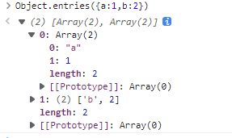
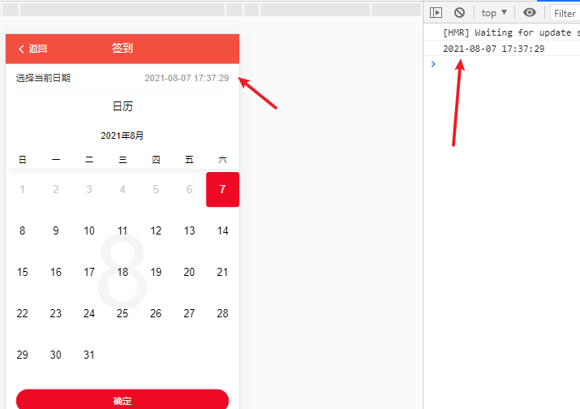

[toc]

# 打包自定义工具库


# 各种自定义

## 函数相关


## 数组相关

### 扁平结构与树形结构互转

[树形多级菜单数据源嵌套结构与扁平结构互转](https://www.cnblogs.com/wangjiachen666/p/10241493.html)

#### 扁平结构转树形结构

```javascript
// 数据源格式
const data =[
  { id:1,   pid:0,  name:"父节点1"     },           
  { id:11,  pid:1,  name:"父节点11"    },
  { id:111, pid:11, name:"叶子节点111" },
  { id:112, pid:11, name:"叶子节点112" },
  { id:113, pid:11, name:"叶子节点113" },
  { id:114, pid:11, name:"叶子节点114" },
  { id:12,  pid:1,  name:"父节点12"    },
  { id:121, pid:12, name:"叶子节点121" },
  { id:122, pid:12, name:"叶子节点122" },
  { id:123, pid:12, name:"叶子节点123" },
  { id:124, pid:12, name:"叶子节点124" },
  { id:13,  pid:1,  name:"父节点13"    },
  { id:2,   pid:0,  name:"父节点2"     },
  { id:21,  pid:2,  name:"父节点21"    },
  { id:211, pid:21, name:"叶子节点211" },
  { id:212, pid:21, name:"叶子节点212" },
  { id:213, pid:21, name:"叶子节点213" },
  { id:214, pid:21, name:"叶子节点214" },
  { id:22,  pid:2,  name:"父节点22"    },
  { id:221, pid:22, name:"叶子节点221" },
  { id:222, pid:22, name:"叶子节点222" },
  { id:223, pid:22, name:"叶子节点223" },
  { id:224, pid:22, name:"叶子节点224" },
  { id:23,  pid:2,  name:"父节点23"    },
  { id:231, pid:23, name:"叶子节点231" },
  { id:232, pid:23, name:"叶子节点232" },
  { id:233, pid:23, name:"叶子节点233" },
  { id:234, pid:23, name:"叶子节点234" },
  { id:3,   pid:0,  name:"父节点3"     }
];

/**
 * 将一个普通的节点数组（带有指向父节点的指针）转换为嵌套的数据结构。
 * @param {*} data  一组数据
 * @param {*} option 包含以下字段的对象：
 *      parentProperty（String）：可以找到父节点链接的属性的名称。默认值：'pid'。
 *      childrenProperty（String）：将存储子节点的属性的名称。默认值：'children'。
 *      idProperty（String）：唯一的节点标识符。默认值：'id'。
 *      nameProperty（String）：节点的名称。默认值：'name'。
 */
function FlatToNested(data, option) {
  option = option || {};
  let idProperty = option.idProperty || 'id';
  let parentProperty = option.parentProperty || 'pid';
  let childrenProperty = option.childrenProperty || 'children';
  let res = [],
    tmpMap = [];
  for (let i = 0; i < data.length; i++) {
    tmpMap[data[i][idProperty]] = data[i];
    if (tmpMap[data[i][parentProperty]] && data[i][idProperty] != data[i][parentProperty]) {
      if (!tmpMap[data[i][parentProperty]][childrenProperty])
        tmpMap[data[i][parentProperty]][childrenProperty] = [];
      tmpMap[data[i][parentProperty]][childrenProperty].push(data[i]);
    } else {
      res.push(data[i]);
    }
  }
  return res;
}
```

可配置项

```javascript
// 源数据
const data =[
    { _id:1,   parentID:0,  text:"父节点1"     },           
    { _id:11,  parentID:1,  text:"父节点11"    },
    { _id:111, parentID:11, text:"叶子节点111" },
    { _id:112, parentID:11, text:"叶子节点112" },
    { _id:113, parentID:11, text:"叶子节点113" },
    { _id:114, parentID:11, text:"叶子节点114" },
    { _id:12,  parentID:1,  text:"父节点12"    },
    { _id:121, parentID:12, text:"叶子节点121" },
    { _id:122, parentID:12, text:"叶子节点122" }
    //...
  ];

```

可以这样调用

```javascript
FlatToNested(nodes,{
    idProperty:'_id',            //唯一的节点标识符。
    nameProperty:'text',         //节点的名称。
    parentProperty:'parentID',  //可以找到父节点链接的属性的名称。
    childrenProperty:'son'      //将存储子节点的属性的名称。
})
```


#### 树形结构转扁平结构

```
```

### 数组过滤掉后面几个值


### 给定索引，然后挪到第一位（最后一位）

先`splice`删除，再新增

```js
function addSearchHistory(key,value) {
    var oldArr = store.get(key);
    if(oldArr){
        for (var i = 0; i < oldArr.length; i++) {
            if (oldArr[i] === value) {
                oldArr.splice(i, 1); // 如果数据组存在该元素，则把该元素删除
                break;
            }
        }
        oldArr.unshift(value); // 再添加到第一个位置
        store.set(key,oldArr);
    } else {
        var newArr = new Array();
        newArr.unshift(value);
        store.set(key,newArr);
    }
}
```

### `for in`和`for of`

- `for in`是`ES5`标准，遍历**对象**的键名：`key`

  - 想遍历对象的属性，可以用`for in`循环, 或内建的`Object.keys()`方法

    ```js
    let person1 = {
        age: '19',
        name: 'sai',
        address: 'beijing'
    }
    
    for(let key in person1) {
        console.log(key) // age name address
        console.log(person1[key]) // 19 sai beijing
    }
    ```

  - **`Object.keys(myObject)`获取对象的实例属性组成的数组，不包括原型方法和属性**

    ```js
    let person1 = {
        age: '19',
        name: 'sai',
        address: 'beijing'
    }
    
    let res = Object.keys(person1)
    console.log(res) // ['age', 'name', 'address']
    ```

    

- `for of`是`ES6`标准，遍历**数组**的值：`value`

  - **`for of`不支持普通对象**，

  - `for in`会遍历**数组**所有的可枚举属性，包括原型。例如的原型方法`method`和`name`属性

    ```js
    Object.prototype.objCustom = function () {}; 
    Array.prototype.arrCustom = function () {};
    
    let iterable = [3, 5, 7];
    iterable.foo = "hello";
    
    for (let i in iterable) {
      console.log(i); //  0, 1, 2, "foo", "arrCustom", "objCustom"
    }
    
    
    for (let i of iterable) {
      console.log(i); // 3, 5, 7
    ```

    - 故而一般用**`for in`遍历对象而不用来遍历数组** 这也就是`for of`存在的意义了,**`for of `不遍历`method`和`name`,适合用来遍历数组**

    - 如果非要用`for in`遍历数组，得到的是索引

      - 索引是字符串型的数字，因而不能直接进行几何运算

        ```js
        let person2 = [
            'name', 'age', 'address'
        ]
        
        for(let key in person2) {
            console.log(typeof key) // string
            console.log(person2[key]) // name age address
        }
        ```

      - 遍历顺序可能不是实际的内部顺序

## 对象相关

### 过滤掉不需要的key / 只取需要的key

```javascript
  let device = {
        name: '设备1',
        code: '867725031691391',
        date: '1525835791000'
      }
      
  const obj = (({name, date}) => ({name, date}))(device)
  console.log(obj) // { name: '设备1', date: '1525835791000' }
  
  let { code, ...obj } = device
  console.log(obj)  // { name: '设备1', date: '1525835791000' }
```

### 替换key的名称

```javascript
// 源数据
const data = [
    {x: "井盖传感器", y: "20", s: "45"},
    {x: "垫底", y: "20", s: "99"}
]


data.map((item, index) => {
    return {name: item.x, value: item.y, price: item.s}
})


```

结果：

```javascript
[
	{
		name: "井盖传感器",
        price: 45,
        value: 20
	},
	{
       	name: "垫底",
        price: 99,
        value: 20 
    }
]
```

### 交换指定索引位置的值

源代码

```javascript
let swap = (arr, i, j) => {
  [arr[i], arr[j]] = [arr[j], arr[i]];
}
```

测试

```javascript
let arr = Array.from(Array(10), (_, k) => k)
console.log(arr)
swap(arr, 1, 3)
console.log(arr)
```

测试结果

```javascript
[ 0, 1, 2, 3, 4, 5, 6, 7, 8, 9 ]
[ 0, 3, 2, 1, 4, 5, 6, 7, 8, 9 ]
```

## `Object`

`Object.entries`

遍历对象的，将`key-value`的形式，转换成二维数组



`Object.keys`

`Object.values`

`forEach`

## 日期相关

Date对象用于处理日期和时间。

创建Date对象的语法：

```
var myDate=new Date()
```

注释：Date 对象会自动把当前日期和时间保存为其初始值。

date对象获取时间日期的方法如下：

```
// 获取当前日期时间
var myDate = new Date();
myDate.toLocaleDateString();                //获取当前日期
var mytime=myDate.toLocaleTimeString();     //获取当前时间
myDate.toLocaleString( );                   //获取日期与时间
 
myDate.getYear();                //获取当前年份(2位)
myDate.getFullYear();            //获取完整的年份(4位,1970-????)
myDate.getMonth();               //获取当前月份(0-11,0代表1月)
myDate.getDate();                //获取当前日(1-31)
myDate.getDay();                 //获取当前星期X(0-6,0代表星期天)
myDate.getTime();                //获取当前时间(从1970.1.1开始的毫秒数)
myDate.getHours();               //获取当前小时数(0-23)
myDate.getMinutes();             //获取当前分钟数(0-59)
myDate.getSeconds();             //获取当前秒数(0-59)
myDate.getMilliseconds();        //获取当前毫秒数(0-999)

// 获取当前日期时间
function getDatetime() {
    var now = new Date();
    var year = now.getFullYear();       
    var month = now.getMonth() + 1;     
    var day = now.getDate();            
    var hh = now.getHours();            
    var mm = now.getMinutes();          
    var ss = now.getSeconds();          
    var clock = year + "-";
    if (month < 10)
        clock += "0";
    clock += month + "-";
    if (day < 10)
        clock += "0";
    clock += day + " ";
    if (hh < 10)
        clock += "0";
    clock += hh + ":";
    if (mm < 10) clock += '0';
    clock += mm + ":";
    if (ss < 10) clock += '0';
    clock += ss;
    return clock;}

// 获取当前日期时间
function timestampToTime(timestamp) {
    var date = new Date(timestamp);
    var Y = date.getFullYear() + '-';
    var M = (date.getMonth() + 1 < 10 ? '0' + (date.getMonth() + 1) : date.getMonth() + 1) + '-';
    var D = date.getDate() < 10 ? '0' + date.getDate() : date.getDate() + ' ';
    var hh = date.getHours() < 10 ? '0' + date.getHours() : date.getHours() + ':';
    var mm = date.getMinutes() < 10 ? '0' + date.getMinutes() : date.getMinutes() + ':';
    var ss = date.getSeconds() < 10 ? '0' + date.getDate() : date.getSeconds() ;
    return Y + M + D + hh + mm + ss;}
```


踩过这个坑，还有下一个坑等着你，这一路就是给自己填坑，坑填多了，也就习惯了，直到这一路平坦了，也就无怨无悔了。

转载 ： https://www.cnblogs.com/xiaofeilin/p/14468107.html

 

\-------------------------------------------------------------------------


```
  onConfirm(date) {
      const date1 = this.timestampToTime(date);
      console.log(date1);
      this.text = ` ${date1} `;
    },
    onSubmit(values) {
      console.log("submit", values);
    },
    onClickLeft() {
      this.$router.push({
        path: "/home/index",
      });
    },
    // 获取当前日期时间
    timestampToTime(timestamp) {
      var date = new Date(timestamp);
      var Y = date.getFullYear() + "-";
      var M =
        (date.getMonth() + 1 < 10
          ? "0" + (date.getMonth() + 1)
          : date.getMonth() + 1) + "-";
      var D = date.getDate() < 10 ? "0" + date.getDate() : date.getDate() + " ";
      var text = " ";
      var hh =
        date.getHours() < 10 ? "0" + date.getHours() : date.getHours() + ":";
      var mm =
        date.getMinutes() < 10
          ? "0" + date.getMinutes()
          : date.getMinutes() + ":";
      var ss =
        date.getSeconds() < 10 ? "0" + date.getDate() : date.getSeconds();
      return Y + M + D + text + hh + mm + ss;
    }
```


 



 


```
onConfirm(date) {
      var now = new Date();
      var Today = now.getDate();

      const date2 = date.getDate(); //签到的时间
      if (Today != date2) {
        Toast.fail("请选择今天日期,签到！");
      } else {
        const date1 = this.timestampToTime(date);
        this.text = ` ${date1} `;
        Toast.success("签到成功");
      }
    },
```


