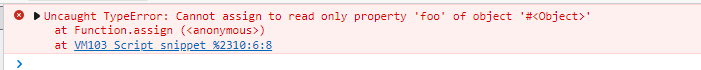

[toc]

# 打包自定义工具库


# 自定义功能

## 函数相关


## 数组相关

### 扁平结构与树形结构互转

[树形多级菜单数据源嵌套结构与扁平结构互转](https://www.cnblogs.com/wangjiachen666/p/10241493.html)

#### 扁平结构转树形结构

```javascript
// 数据源格式
const data =[
  { id:1,   pid:0,  name:"父节点1"     },           
  { id:11,  pid:1,  name:"父节点11"    },
  { id:111, pid:11, name:"叶子节点111" },
  { id:112, pid:11, name:"叶子节点112" },
  { id:113, pid:11, name:"叶子节点113" },
  { id:114, pid:11, name:"叶子节点114" },
  { id:12,  pid:1,  name:"父节点12"    },
  { id:121, pid:12, name:"叶子节点121" },
  { id:122, pid:12, name:"叶子节点122" },
  { id:123, pid:12, name:"叶子节点123" },
  { id:124, pid:12, name:"叶子节点124" },
  { id:13,  pid:1,  name:"父节点13"    },
  { id:2,   pid:0,  name:"父节点2"     },
  { id:21,  pid:2,  name:"父节点21"    },
  { id:211, pid:21, name:"叶子节点211" },
  { id:212, pid:21, name:"叶子节点212" },
  { id:213, pid:21, name:"叶子节点213" },
  { id:214, pid:21, name:"叶子节点214" },
  { id:22,  pid:2,  name:"父节点22"    },
  { id:221, pid:22, name:"叶子节点221" },
  { id:222, pid:22, name:"叶子节点222" },
  { id:223, pid:22, name:"叶子节点223" },
  { id:224, pid:22, name:"叶子节点224" },
  { id:23,  pid:2,  name:"父节点23"    },
  { id:231, pid:23, name:"叶子节点231" },
  { id:232, pid:23, name:"叶子节点232" },
  { id:233, pid:23, name:"叶子节点233" },
  { id:234, pid:23, name:"叶子节点234" },
  { id:3,   pid:0,  name:"父节点3"     }
];

/**
 * 将一个普通的节点数组（带有指向父节点的指针）转换为嵌套的数据结构。
 * @param {*} data  一组数据
 * @param {*} option 包含以下字段的对象：
 *      parentProperty（String）：可以找到父节点链接的属性的名称。默认值：'pid'。
 *      childrenProperty（String）：将存储子节点的属性的名称。默认值：'children'。
 *      idProperty（String）：唯一的节点标识符。默认值：'id'。
 *      nameProperty（String）：节点的名称。默认值：'name'。
 */
function FlatToNested(data, option) {
  option = option || {};
  let idProperty = option.idProperty || 'id';
  let parentProperty = option.parentProperty || 'pid';
  let childrenProperty = option.childrenProperty || 'children';
  let res = [],
    tmpMap = [];
  for (let i = 0; i < data.length; i++) {
    tmpMap[data[i][idProperty]] = data[i];
    if (tmpMap[data[i][parentProperty]] && data[i][idProperty] != data[i][parentProperty]) {
      if (!tmpMap[data[i][parentProperty]][childrenProperty])
        tmpMap[data[i][parentProperty]][childrenProperty] = [];
      tmpMap[data[i][parentProperty]][childrenProperty].push(data[i]);
    } else {
      res.push(data[i]);
    }
  }
  return res;
}
```

可配置项

```javascript
// 源数据
const data =[
    { _id:1,   parentID:0,  text:"父节点1"     },           
    { _id:11,  parentID:1,  text:"父节点11"    },
    { _id:111, parentID:11, text:"叶子节点111" },
    { _id:112, parentID:11, text:"叶子节点112" },
    { _id:113, parentID:11, text:"叶子节点113" },
    { _id:114, parentID:11, text:"叶子节点114" },
    { _id:12,  parentID:1,  text:"父节点12"    },
    { _id:121, parentID:12, text:"叶子节点121" },
    { _id:122, parentID:12, text:"叶子节点122" }
    //...
  ];

```

可以这样调用

```javascript
FlatToNested(nodes,{
    idProperty:'_id',            //唯一的节点标识符。
    nameProperty:'text',         //节点的名称。
    parentProperty:'parentID',  //可以找到父节点链接的属性的名称。
    childrenProperty:'son'      //将存储子节点的属性的名称。
})
```


#### 树形结构转扁平结构

```
```

### 数组过滤掉后面几个值


### 给定索引，然后挪到第一位（最后一位）

先`splice`删除，再新增

```js
function addSearchHistory(key,value) {
    var oldArr = store.get(key);
    if(oldArr){
        for (var i = 0; i < oldArr.length; i++) {
            if (oldArr[i] === value) {
                oldArr.splice(i, 1); // 如果数据组存在该元素，则把该元素删除
                break;
            }
        }
        oldArr.unshift(value); // 再添加到第一个位置
        store.set(key,oldArr);
    } else {
        var newArr = new Array();
        newArr.unshift(value);
        store.set(key,newArr);
    }
}
```

## 对象相关

### 过滤掉不需要的key / 只取需要的key

```javascript
  let device = {
        name: '设备1',
        code: '867725031691391',
        date: '1525835791000'
      }
      
  const obj = (({name, date}) => ({name, date}))(device)
  console.log(obj) // { name: '设备1', date: '1525835791000' }
  
  let { code, ...obj } = device
  console.log(obj)  // { name: '设备1', date: '1525835791000' }
```

### 替换key的名称

```javascript
// 源数据
const data = [
    {x: "井盖传感器", y: "20", s: "45"},
    {x: "垫底", y: "20", s: "99"}
]


data.map((item, index) => {
    return {name: item.x, value: item.y, price: item.s}
})


```

结果：

```javascript
[
	{
		name: "井盖传感器",
        price: 45,
        value: 20
	},
	{
       	name: "垫底",
        price: 99,
        value: 20 
    }
]
```

### 交换指定索引位置的值

源代码

```javascript
let swap = (arr, i, j) => {
  [arr[i], arr[j]] = [arr[j], arr[i]];
}
```

测试

```javascript
let arr = Array.from(Array(10), (_, k) => k)
console.log(arr)
swap(arr, 1, 3)
console.log(arr)
```

测试结果

```javascript
[ 0, 1, 2, 3, 4, 5, 6, 7, 8, 9 ]
[ 0, 3, 2, 1, 4, 5, 6, 7, 8, 9 ]
```

### 对象合并

对象合并的多种方式（对于通过接口获取数据之后赋值给本地对象的时候极其有用）

#### 第一种：手动赋值(很捞)

```js
const obj1 = {
  name: "zs",
  age: 13,
};
const obj2 = {
  name: "ls",
  sex: "女",
};
obj1.name = obj2.name;
obj1.sex = obj2.sex;
console.log(obj1) // {name: 'ls', age: 13, sex: '女'}
```

这种方法时最简单的，但是日常项目中一个对象的属性是非常多的，如果还是用这种方法的话就会有点繁琐了

#### 第二种：扩展运算符

```js
const obj1 = {
  name: "zs",
  age: 13,
};
const obj2 = {
  name: "ls",
  sex: "女",
};
const newObj = { ...obj1, ...obj2 };
console.log(newObj === obj1); // false
console.log(newObj === obj2); // false
console.log(newObj) // {name: 'ls', age: 13, sex: '女'}
```

通过扩展运算符的特性可以快速的进行对象的合并，缺点就是需要用一个新的变量来接收

#### 第三种：`Object.assign() `(最推荐)

```js
const obj1 = {
  name: "zs",
  age: 13,
};
const obj2 = {
  name: "ls",
  sex: "女",
};
const newObj = Object.assign(obj1, obj2);
console.log(newObj === obj1); // true
console.log(newObj === obj2); // false
console.log(newObj); // {name: 'ls', age: 13, sex: '女'}

// 实际在合并的时候，可以直接
Object.assign(obj1, obj2)
console.log(obj1) // 并不需要用新的变量接收，上面只是演示
```

`Object.assign()`方法可以接收一个目标对象和一个或者多个源对象作为参数，如果对象中有一样的属性，后面对象的属性会覆盖掉前面对象的那个属性。

> 其原理是将后面的对象通过`set` 访问属性来添加进目标对象，所以最后返回的值其实就是第一个目对象，可以在目标对象上添加访问属性来见识覆盖过程

```js
const obj1 = {
  set a(val) {
    console.log(val);
  },
};
Object.assign(obj1, { a: "tom" }, { a: "jerry" }, { a: "dog" });
// tom
// jerry
// dog
```

这个方法的使用场景有很多，都特别好用，例如：

**1.vue 项目清空表单** 

日常有些同学清空表单可能会给 `form` 里面的数据一个一个的赋空值来进行表单的清空操作，其实效率是非常低的,但是如果使用 `Object.assign()`和`$options` 配合的话，效率就很高

```js
// 日常
this.ruleForm.name='';
this.ruleForm.phone='';
this.ruleForm.imgUrl='';
this.ruleForm.des='';
...此处省略一万字
// 使用Object.assign和$options
Object.assign(this.ruleForm, this.$options.data)
```

如果用的`element`的`el-form`，也是一个道理

**Tips**： `$options` 存储的是 `Vue` 实例的初始值，所以通过 `Object.assign()`覆盖值的特性，可以快速的做到重置表单

同理，如果是在进行表单数据修改的时候也能对页面的` ruleForm` 进行快速的赋值

```js
const { data } = await xxxApi.getList();
Object.assign(this.ruleForm, data);
```

# API

## `Object`

### `Object.create()`

### `Object.entries`

遍历对象的，将`key-value`的形式，转换成二维数组


### `Object.keys()`

### `Object.values`


### `Object.assign()`

https://developer.mozilla.org/zh-CN/docs/Web/JavaScript/Reference/Global_Objects/Object/assign

#### 语法

```js
Object.assign(target, ...sources) 
```

- 参数

  - `target`

    目标对象，接收源对象属性的对象，也是修改后的返回值。

  - `sources`

    源对象，包含将被合并的属性。

- 返回值

  - 目标对象，即函数的返回值是合并后的`target`

#### 描述

如果目标对象与源对象具有相同的 [key](https://developer.mozilla.org/zh-CN/docs/Web/JavaScript/Reference/Global_Objects/Object/keys)，则目标对象中的属性将被源对象中的属性覆盖，后面的源对象的属性将类似地覆盖前面的源对象的属性。

`Object.assign` 方法只会拷贝源对象 *可枚举的* 和 *自身的* 属性到目标对象。该方法使用源对象的 `[[Get]]` 和目标对象的 `[[Set]]`，它会调用 [getters](https://developer.mozilla.org/zh-CN/docs/Web/JavaScript/Reference/Functions/get) 和 [setters](https://developer.mozilla.org/zh-CN/docs/Web/JavaScript/Reference/Functions/set)。故它分配属性，而不仅仅是复制或定义新的属性。如果合并源包含 getters，这可能使其不适合将新属性合并到原型中。

为了将属性定义（包括其可枚举性）复制到原型，应使用 [`Object.getOwnPropertyDescriptor()`](https://developer.mozilla.org/zh-CN/docs/Web/JavaScript/Reference/Global_Objects/Object/getOwnPropertyDescriptor) 和 [`Object.defineProperty()`](https://developer.mozilla.org/zh-CN/docs/Web/JavaScript/Reference/Global_Objects/Object/defineProperty)，基本类型 [`String`](https://developer.mozilla.org/zh-CN/docs/Web/JavaScript/Reference/Global_Objects/String) 和 [`Symbol`](https://developer.mozilla.org/zh-CN/docs/Web/JavaScript/Reference/Global_Objects/Symbol) 的属性会被复制。

如果赋值期间出错，例如如果属性不可写，则会抛出 [`TypeError`](https://developer.mozilla.org/zh-CN/docs/Web/JavaScript/Reference/Global_Objects/TypeError)；如果在抛出异常之前添加了任何属性，则会修改 `target` 对象（译者注：换句话说，`Object.assign()` 没有“回滚”之前赋值的概念，它是一个尽力而为、可能只会完成部分复制的方法）。

> **备注：** `Object.assign()` 不会在 `source` 对象值为 [`null`](https://developer.mozilla.org/zh-CN/docs/Web/JavaScript/Reference/Operators/null) 或 [`undefined`](https://developer.mozilla.org/zh-CN/docs/Web/JavaScript/Reference/Global_Objects/undefined) 时抛出错误。

#### 示例

##### 复制对象

```js
const obj = { a: 1 };
const copy = Object.assign({}, obj);
console.log(copy); // { a: 1 }

```

##### 深拷贝问题

针对[深拷贝 (en-US)](https://developer.mozilla.org/en-US/docs/Glossary/Deep_copy), 需要使用其他办法，因为 `Object.assign()` 只复制属性值。

假如源对象是一个对象的引用，它仅仅会复制其引用值。

```js
function test() {
  'use strict';

  let obj1 = { a: 0 , b: { c: 0}};
  let obj2 = Object.assign({}, obj1);
  console.log(JSON.stringify(obj2)); // { "a": 0, "b": { "c": 0}}

  obj1.a = 1;
  console.log(JSON.stringify(obj1)); // { "a": 1, "b": { "c": 0}}
  console.log(JSON.stringify(obj2)); // { "a": 0, "b": { "c": 0}}

  obj2.a = 2;
  console.log(JSON.stringify(obj1)); // { "a": 1, "b": { "c": 0}}
  console.log(JSON.stringify(obj2)); // { "a": 2, "b": { "c": 0}}

  obj2.b.c = 3;
  console.log(JSON.stringify(obj1)); // { "a": 1, "b": { "c": 3}}
  console.log(JSON.stringify(obj2)); // { "a": 2, "b": { "c": 3}}

  // Deep Clone
  obj1 = { a: 0 , b: { c: 0}};
  let obj3 = JSON.parse(JSON.stringify(obj1));
  obj1.a = 4;
  obj1.b.c = 4;
  console.log(JSON.stringify(obj3)); // { "a": 0, "b": { "c": 0}}
}

test();

```

##### 合并对象

```js
const o1 = { a: 1 };
const o2 = { b: 2 };
const o3 = { c: 3 };

const obj = Object.assign(o1, o2, o3);
console.log(obj); // { a: 1, b: 2, c: 3 }
console.log(o1);  // { a: 1, b: 2, c: 3 }, target object itself is changed.
console.log(o1 === obj) // true
```

##### 合并具有相同属性的对象

```js
const o1 = { a: 1, b: 1, c: 1 };
const o2 = { b: 2, c: 2 };
const o3 = { c: 3 };

const obj = Object.assign({}, o1, o2, o3);
console.log(obj); // { a: 1, b: 2, c: 3 }

```

属性会被后续参数中具有相同属性的其他对象覆盖。

##### 拷贝 `Symbol` 类型属性

```js
const o1 = { a: 1 };
const o2 = { [Symbol('foo')]: 2 };

const obj = Object.assign({}, o1, o2);
console.log(obj); // { a : 1, [Symbol("foo")]: 2 } (cf. bug 1207182 on Firefox)
Object.getOwnPropertySymbols(obj); // [Symbol(foo)]

```

##### 原型链上的属性和不可枚举属性不能被复制

```js
const obj = Object.create({ foo: 1 }, { // foo is on obj's prototype chain.
  bar: {
    value: 2  // bar is a non-enumerable property.
  },
  baz: {
    value: 3,
    enumerable: true  // baz is an own enumerable property.
  }
});

console.log(obj) // {baz: 3, bar: 2} 另外：{foo: 1}在obj的原型链上

const copy = Object.assign({}, obj);
console.log(copy); // { baz: 3 }
```

##### 基本类型会被包装为对象

```js
const v1 = 'abc';
const v2 = true;
const v3 = 10;
const v4 = Symbol('foo');

const obj = Object.assign({}, v1, null, v2, undefined, v3, v4);
// Primitives will be wrapped, null and undefined will be ignored.
// Note, only string wrappers can have own enumerable properties.
console.log(obj); // { "0": "a", "1": "b", "2": "c" }

```

##### 异常会打断后续拷贝任务

```js
const target = Object.defineProperty({}, 'foo', {
  value: 1,
  writable: false
}); // target.foo is a read-only property

Object.assign(target, { bar: 2 }, { foo2: 3, foo: 3, foo3: 3 }, { baz: 4 });
// TypeError: "foo" is read-only
// The Exception is thrown when assigning target.foo

console.log(target.bar);  // 2, the first source was copied successfully.
console.log(target.foo2); // 3, the first property of the second source was copied successfully.
console.log(target.foo);  // 1, exception is thrown here.
console.log(target.foo3); // undefined, assign method has finished, foo3 will not be copied.
console.log(target.baz);  // undefined, the third source will not be copied either.

```



##### 拷贝访问器

如果源对象里有`getter`，正常情况下会返回`getters`的值

现在希望把`getters`的访问器属性也整到目标对象中，定义了`completeAssign`方法

```js
const obj = {
  foo: 1,
  get bar() {
    return 2;
  }
};

let copy1 = Object.assign({}, obj);
console.log(copy1);
// { foo: 1, bar: 2 }
// The value of copy.bar is obj.bar's getter's return value.

// This is an assign function that copies full descriptors
function completeAssign(target, ...sources) {
  sources.forEach(source => {
    let descriptors = Object.keys(source).reduce((descriptors, key) => {
      descriptors[key] = Object.getOwnPropertyDescriptor(source, key);
      return descriptors;
    }, {});

    // By default, Object.assign copies enumerable Symbols, too
    Object.getOwnPropertySymbols(source).forEach(sym => {
      let descriptor = Object.getOwnPropertyDescriptor(source, sym);
      if (descriptor.enumerable) {
        descriptors[sym] = descriptor;
      }
    });
    Object.defineProperties(target, descriptors);
  });
  return target;
}

copy2 = completeAssign({}, obj);
console.log(copy2);
// { foo:1, get bar() { return 2 } }

```

#### 参见

- [Polyfill of `Object.assign` in `core-js`](https://github.com/zloirock/core-js#ecmascript-object)
- [`Object.defineProperties()`](https://developer.mozilla.org/zh-CN/docs/Web/JavaScript/Reference/Global_Objects/Object/defineProperties)
- [属性的可枚举性和所有权](https://developer.mozilla.org/zh-CN/docs/Web/JavaScript/Enumerability_and_ownership_of_properties)
- [构造字面量对象时使用展开语法](https://developer.mozilla.org/zh-CN/docs/Web/JavaScript/Reference/Operators/Spread_syntax#构造字面量对象时使用展开语法)

## `Date`

Date对象用于处理日期和时间。

创建Date对象的语法：

```
var myDate=new Date()
```

注释：Date 对象会自动把当前日期和时间保存为其初始值。

date对象获取时间日期的方法如下：

```
// 获取当前日期时间
var myDate = new Date();
myDate.toLocaleDateString();                //获取当前日期
var mytime=myDate.toLocaleTimeString();     //获取当前时间
myDate.toLocaleString( );                   //获取日期与时间
 
myDate.getYear();                //获取当前年份(2位)
myDate.getFullYear();            //获取完整的年份(4位,1970-????)
myDate.getMonth();               //获取当前月份(0-11,0代表1月)
myDate.getDate();                //获取当前日(1-31)
myDate.getDay();                 //获取当前星期X(0-6,0代表星期天)
myDate.getTime();                //获取当前时间(从1970.1.1开始的毫秒数)
myDate.getHours();               //获取当前小时数(0-23)
myDate.getMinutes();             //获取当前分钟数(0-59)
myDate.getSeconds();             //获取当前秒数(0-59)
myDate.getMilliseconds();        //获取当前毫秒数(0-999)

// 获取当前日期时间
function getDatetime() {
    var now = new Date();
    var year = now.getFullYear();       
    var month = now.getMonth() + 1;     
    var day = now.getDate();            
    var hh = now.getHours();            
    var mm = now.getMinutes();          
    var ss = now.getSeconds();          
    var clock = year + "-";
    if (month < 10)
        clock += "0";
    clock += month + "-";
    if (day < 10)
        clock += "0";
    clock += day + " ";
    if (hh < 10)
        clock += "0";
    clock += hh + ":";
    if (mm < 10) clock += '0';
    clock += mm + ":";
    if (ss < 10) clock += '0';
    clock += ss;
    return clock;}

// 获取当前日期时间
function timestampToTime(timestamp) {
    var date = new Date(timestamp);
    var Y = date.getFullYear() + '-';
    var M = (date.getMonth() + 1 < 10 ? '0' + (date.getMonth() + 1) : date.getMonth() + 1) + '-';
    var D = date.getDate() < 10 ? '0' + date.getDate() : date.getDate() + ' ';
    var hh = date.getHours() < 10 ? '0' + date.getHours() : date.getHours() + ':';
    var mm = date.getMinutes() < 10 ? '0' + date.getMinutes() : date.getMinutes() + ':';
    var ss = date.getSeconds() < 10 ? '0' + date.getDate() : date.getSeconds() ;
    return Y + M + D + hh + mm + ss;}
```


踩过这个坑，还有下一个坑等着你，这一路就是给自己填坑，坑填多了，也就习惯了，直到这一路平坦了，也就无怨无悔了。

转载 ： https://www.cnblogs.com/xiaofeilin/p/14468107.html

 

\-------------------------------------------------------------------------


```
  onConfirm(date) {
      const date1 = this.timestampToTime(date);
      console.log(date1);
      this.text = ` ${date1} `;
    },
    onSubmit(values) {
      console.log("submit", values);
    },
    onClickLeft() {
      this.$router.push({
        path: "/home/index",
      });
    },
    // 获取当前日期时间
    timestampToTime(timestamp) {
      var date = new Date(timestamp);
      var Y = date.getFullYear() + "-";
      var M =
        (date.getMonth() + 1 < 10
          ? "0" + (date.getMonth() + 1)
          : date.getMonth() + 1) + "-";
      var D = date.getDate() < 10 ? "0" + date.getDate() : date.getDate() + " ";
      var text = " ";
      var hh =
        date.getHours() < 10 ? "0" + date.getHours() : date.getHours() + ":";
      var mm =
        date.getMinutes() < 10
          ? "0" + date.getMinutes()
          : date.getMinutes() + ":";
      var ss =
        date.getSeconds() < 10 ? "0" + date.getDate() : date.getSeconds();
      return Y + M + D + text + hh + mm + ss;
    }
```


 


 


```
onConfirm(date) {
      var now = new Date();
      var Today = now.getDate();

      const date2 = date.getDate(); //签到的时间
      if (Today != date2) {
        Toast.fail("请选择今天日期,签到！");
      } else {
        const date1 = this.timestampToTime(date);
        this.text = ` ${date1} `;
        Toast.success("签到成功");
      }
    },
```


## `for in & for of`

- `for in`是`ES5`标准，遍历**对象**的键名：`key`

  - 想遍历对象的属性，可以用`for in`循环, 或内建的`Object.keys()`方法

    ```js
    let person1 = {
        age: '19',
        name: 'sai',
        address: 'beijing'
    }
    
    for(let key in person1) {
        console.log(key) // age name address
        console.log(person1[key]) // 19 sai beijing
    }
    ```

  - **`Object.keys(myObject)`获取对象的实例属性组成的数组，不包括原型方法和属性**

    ```js
    let person1 = {
        age: '19',
        name: 'sai',
        address: 'beijing'
    }
    
    let res = Object.keys(person1)
    console.log(res) // ['age', 'name', 'address']
    ```

    

- `for of`是`ES6`标准，遍历**数组**的值：`value`

  - **`for of`不支持普通对象**，

  - 如果非要用`for in`遍历数组，会遍历**数组**所有的可枚举属性，包括原型。例如的原型方法`method`和`name`属性

    ```js
    Object.prototype.objCustom = function () {}; 
    Array.prototype.arrCustom = function () {};
    
    let iterable = [3, 5, 7];
    iterable.foo = "hello";
    
    for (let i in iterable) { // 如果非要用`for in`遍历数组，得到的是索引，及所有可枚举的属性，包括原型
      console.log(i); //  0, 1, 2, "foo", "arrCustom", "objCustom"
    }
    
    
    for (let i of iterable) {
      console.log(i); // 3, 5, 7
    ```

    - 故而一般不用**`for in`遍历数组而用来遍历对象** ，这也就是`for of`存在的意义了,**`for of `不遍历`method`和`name`,适合用来遍历数组**

    - 如果非要用`for in`遍历数组，得到的是索引，及所有可枚举的属性，包括原型

      - 索引是字符串型的数字，因而不能直接进行几何运算

        ```js
        let person2 = [
            'name', 'age', 'address'
        ]
        
        for(let key in person2) {
            console.log(typeof key) // string
            console.log(person2[key]) // name age address
        }
        ```

      - 遍历顺序可能不是实际的内部顺序

      - 别用`for in`遍历数据就行了

## 

