# 背景


# 环境搭建


# 基本使用

## 索引操作

### 创建索引

在Postman中，向es发送PUT请求

对比关系型数据库，创建索引就等同于创建数据库

```
http://120.132.96.181:9200/shopping
```


响应：

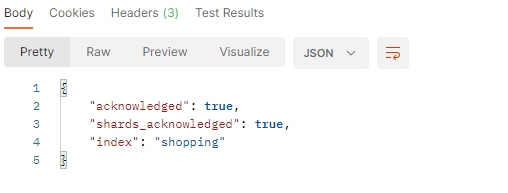

PUT具有幂等性，再发一次的话，结果是已经存在的

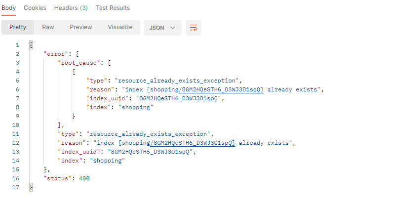

### 查看索引

#### 查看指定索引

请求方式变为GET


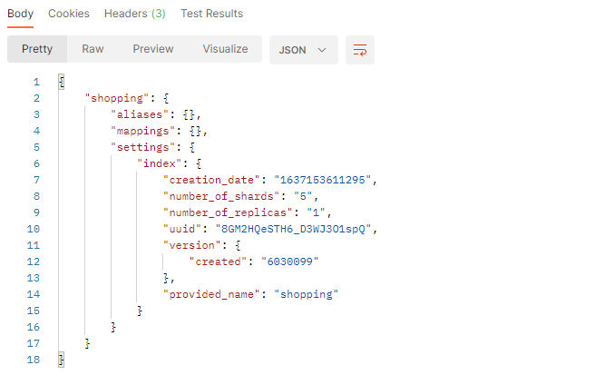

#### 查看全部索引

路径如下：

```
http://120.132.96.181:9200/_cat/indices/?v
```

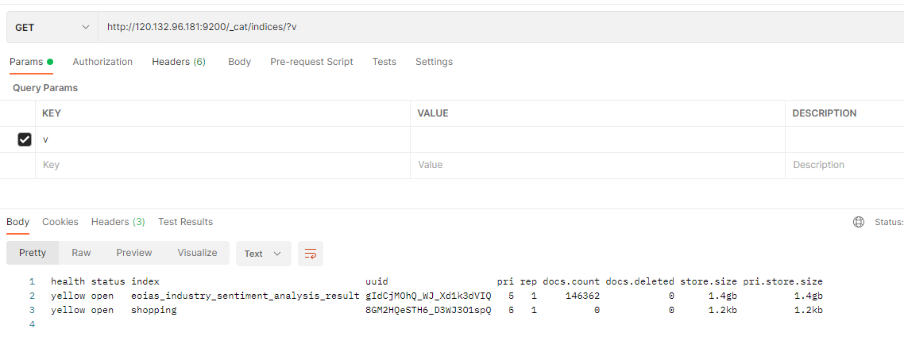

### 删除索引

DELETE

```
http://120.132.96.181:9200/shopping
```

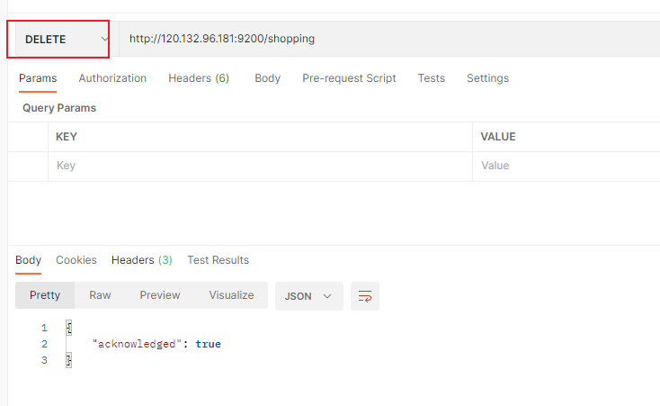

删除后再查看所有索引

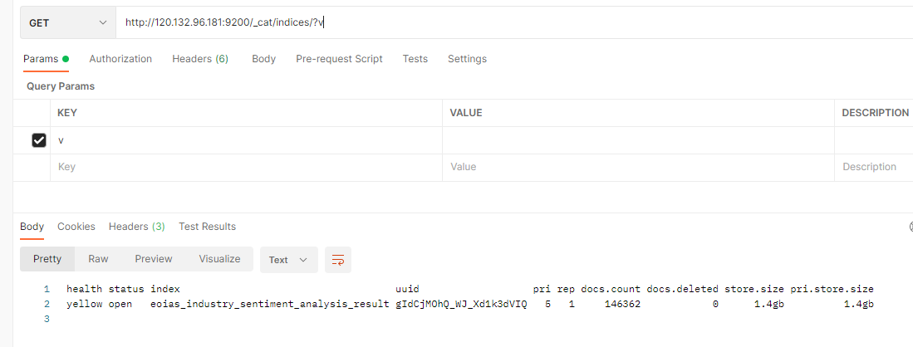

之前创建的索引已经没有了

## 文档操作

### 创建文档

新版的es是没有表的概念的


索引已经创建好了，接下来我们创建文档，并添加数据

这里的文档可以类比关系型数据库中的表数据，添加的数据格式为JSON格式

发送POST请求，路径

```
http://120.132.96.181:9200/shopping/_doc
```

请求体内容为

```json
{
    "title":"小米手机",
    "category":"小米",
    "price":"3999.0",
    "images":"https://tse4-mm.cn.bing.net/th/id/OIP-C.LVlWYge93-BzZWq38jd67gHaEc?pid=ImgDet&rs=1"
}
```

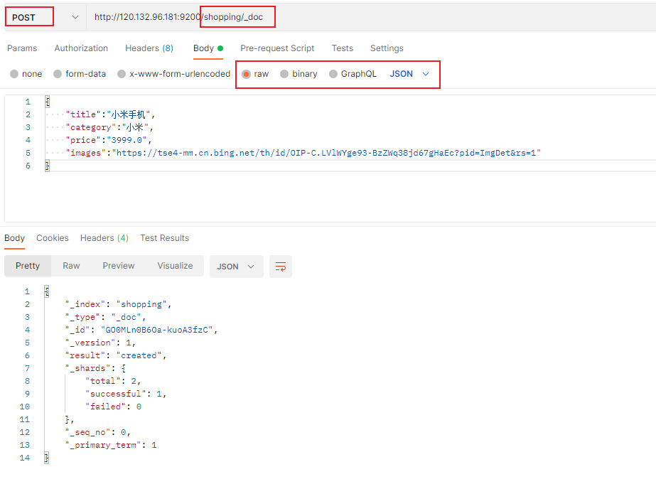

不能用PUT创建文档：

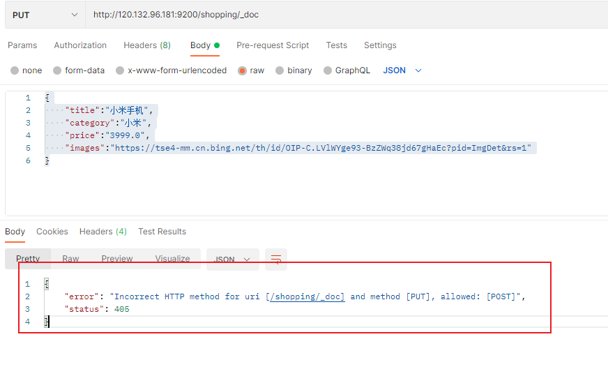

当我们用POST，发送多个请求时，返回的_id的值是不一样的

我们也可以自己指定id

```
http://120.132.96.181:9200/shopping/_doc/1001
```


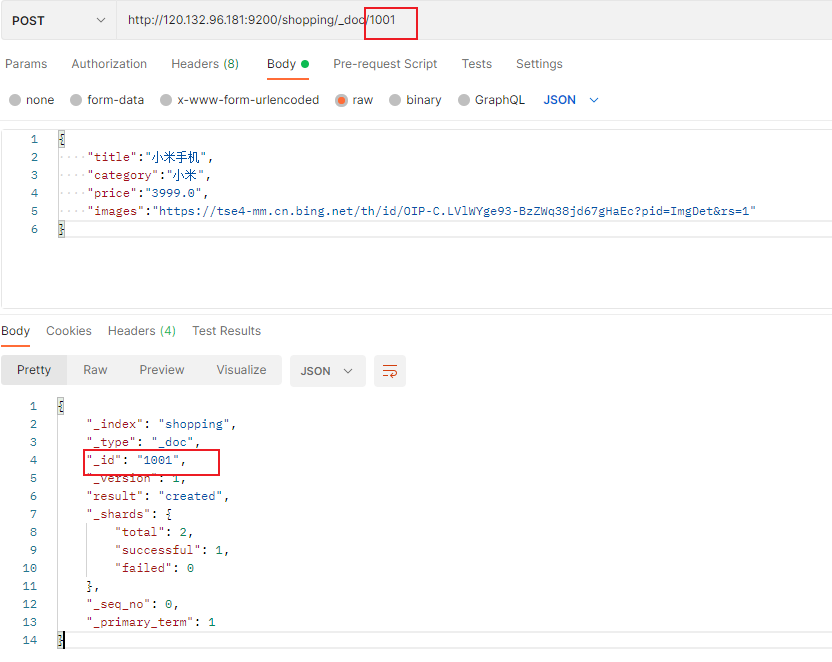


### 查询文档

#### 主键查询

GET请求

```
http://120.132.96.181:9200/shopping/_doc/1001
```

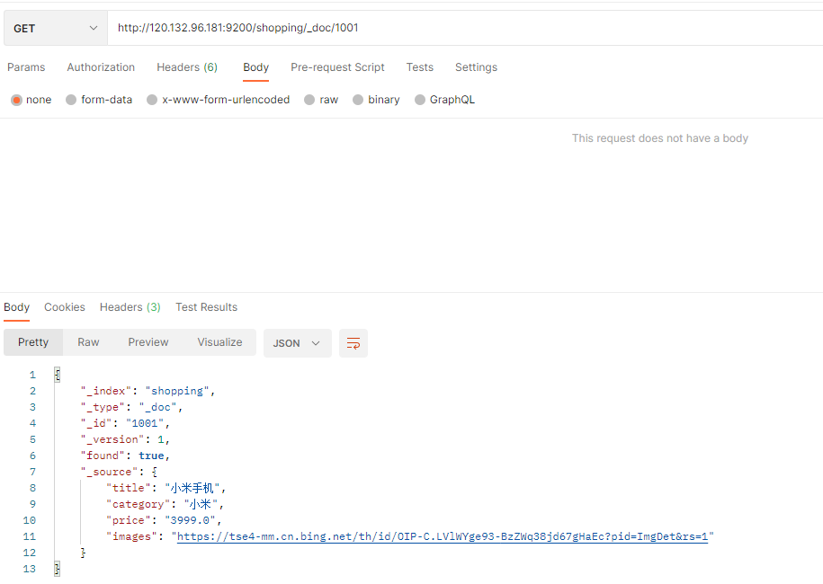

#### 全查询

GET请求

```
http://120.132.96.181:9200/shopping/_search
```


### 修改文档

#### 全量修改

全量更新，完全覆盖，用PUT请求，这个请求时幂等性的

```
http://120.132.96.181:9200/shopping/_doc/1001
```

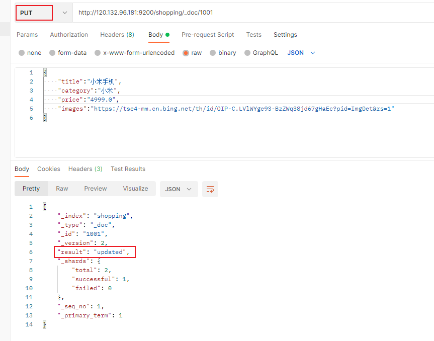

#### 局部修改

局部更新用POST

```
http://120.132.96.181:9200/shopping/_doc/1001
```

body中，指定修改的字段

```json
{
    "doc": {
        "title": "华为手机"
    }
}
```

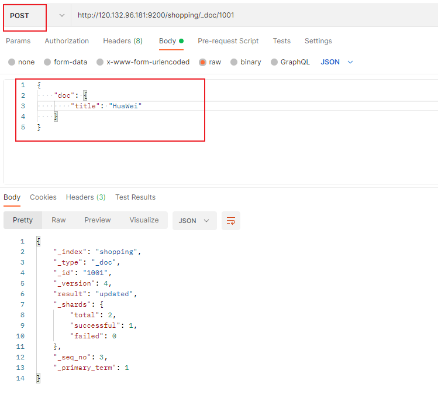

### 删除文档

DELETE

```
http://120.132.96.181:9200/shopping/_doc/1001
```

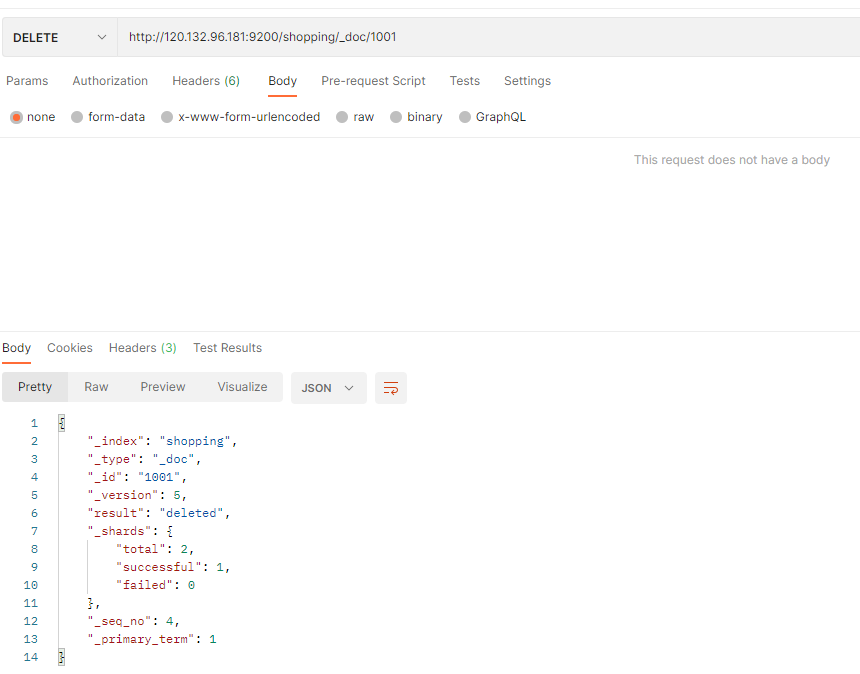

## 查询操作

### 条件查询

GET请求

添加请求参数

```
http://120.132.96.181:9200/shopping/_search?q=category:小米
```

但是一般参数是放在请求体中

GET请求

请求路径

```
http://120.132.96.181:9200/shopping/_search
```

请求体

```json
{
    "query": {
        "match": {
            "category": "小米"
        }
    }
}
```

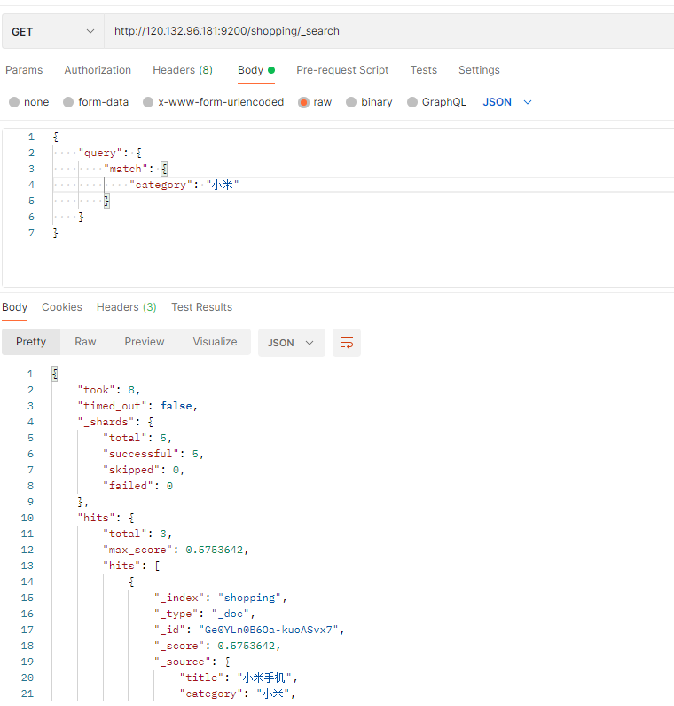

全量查询

请求体中，改变match关键字

```
http://120.132.96.181:9200/shopping/_search
```


```json
{
    "query": {
        "match_all": {

        }
    }
}
```

但全量查询的数据量太大了

### 分页查询

body请求体中，加入from和size字段

```json
{
    "query": {
        "match_all": {

        }
    },
    "from": 0,
    "size": 2
}
```

上述设置中，我们从位置0开始，每页只查2条数据

这样就只查询出来两条数据

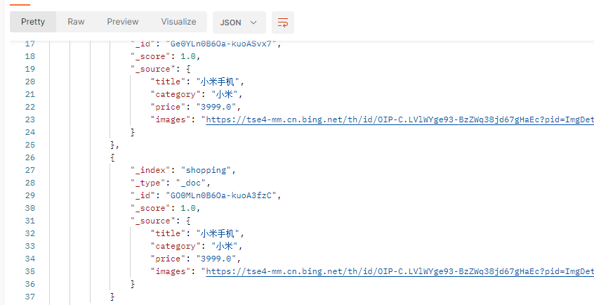

如果要查第二页，只要更改from字段即可

计算公式为：（页码 - 1）* 每页数据条数，要查第二页，每页2条，计算得出from的值为2

#### 分页查询过滤字段

对_source字段进行控制

请求体

```json
{
    "query": {
        "match_all": {

        }
    },
    "from": 0,
    "size": 2,
    "_source": [
        "title"
    ]
}
```

这样查询出来的结果，就只有title字段了

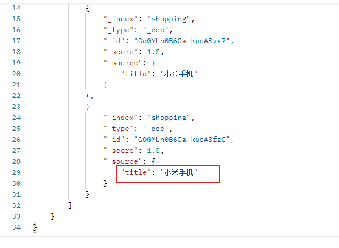

#### 分页查询排序结果

指定关键词sort

下面是对price字段进行降序

```json
{
    "query": {
        "match_all": {

        }
    },
    "from": 0,
    "size": 2,
    "_source": [
        "title"
    ],
    "sort": {
        "price": {
            "order": "desc"
        }
    }
}
```


order的可选值为`asc`、`desc`，分别是升序和降序

### 多条件查询

条件参数bool，值填must

must是一个数组

#### 查询价格为3999.0的小米手机

```json
{
    "query": {
        "bool": {
            "must": [
                {                    
                    "match": {
                        "category": "小米"
                    }
                },
                {                    
                    "match": {
                        "price": "3999.0"
                    }
                }
            ]
        }
    }
}
```

#### 查询小米手机和华为手机

```json
{
    "query": {
        "bool": {
            "must": [
                {                    
                    "match": {
                        "category": "小米"
                    }
                },
                {                    
                    "match": {
                        "category": "HuaWei"
                    }
                }
            ]
        }
    }
}
```

### 范围查询

filter字段

查询价格大于5000的小米和华为手机

```json
{
    "query": {
        "bool": {
            "must": [
                {                    
                    "match": {
                        "category": "小米"
                    }
                },
                {                    
                    "match": {
                        "category": "HuaWei"
                    }
                }
            ],
            "filter": {
                "range": {
                    "price": {
                        "gt": 5000
                    }
                }
            }
        }
    }
}
```

### 全文检索

注意一个现象

我们查询关键字如果是`小华`的话，es会默认分词`小`和`华`，然后再进行查询的

```
{
    "query": {
        "match": {
            "category": "小华"
        }
    }
}
```

上面这种的是全文检索匹配

如果想完全匹配的话，用match_phrase

```json
{
    "query": {
        "match_phrase": {
            "category": "小米"
        }
    }
}
```

### 高亮显示

对查询结果的字段，进行高亮显示

使用highlight字段

完全匹配查询小米，并将其类别字段进行高亮显示

```json
{
    "query": {
        "match_phrase": {
            "category": "小米"
        }
    },
    "highlight": {
        "fields": {
            "category": {}
        }
    } 
}
```

查询结果对其加了css样式

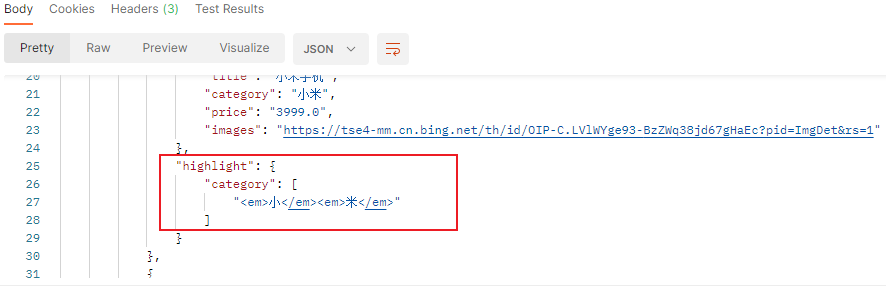

### 聚合查询

如果需要对查询结果进行分组或者统计分析

