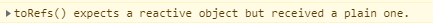

[TOC]

教程来源：[https://www.bilibili.com/video/BV1C3411s7bV](https://www.bilibili.com/video/BV1C3411s7bV)

# Vue3介绍

## Vue3简介

- Vue3提供了更好的性能，更小的捆绑包体积，更好的TS集成，用于处理大规模用例的新API
- 3.0版本开发周期长达两年多，期间产生了30+RFCS、2600+commits、628 pull requests，以及核心仓库之外的大量开发和文档工作
- Vue3.0的发布标志着此框架已处于可用状态，尽管框架的某些子项目，可能仍需要进一步开发才能达到稳定状态（特别是devtools中的路由和VueX集成），不过现在仍然是开始使用vue3启动项目的合适时机

## Vue3优势

- 3.0比2.0快2倍
- 3.0新加入了TS以及PWA的支撑
- 3.0没有beforeCreated、created，用setup替代
- 单功能可以抽离，watch、component
- 没有眼花缭乱的this
- 强大的Proxy实现响应式
- 响应式方面，性能得到很大的提升，不用初始化的时候就递归遍历属性
- 3.0的compsition api可以和2.0的options api同时存在
- 代码更利于封装和维护

# 安装Vue/cli

安装最新脚手架

```
npm install -g @vue/cli
```

安装成功查看脚手架版本

```
vue -V
```

创建项目

```
vue create 'project-name'
```

选择vue3.x，选择Babel、Router和VueX

package.json

粗略版本信息如下：

```json
  "dependencies": {
    "core-js": "^3.6.5",
    "vue": "^3.0.0",
    "vue-router": "^4.0.0-0",
    "vuex": "^4.0.0-0"
  },
```

# setup函数

初始化一下代码

App.vue

```vue
<template>
    <div>
        <hello-world></hello-world>
    </div>
</template>

<script>
    import HelloWorld from "./components/HelloWorld";
    export default {
        name: "App",
        components: {
            HelloWorld,
        }
    }
</script>

<style scoped>

</style>
```

Helloworld.vue

```vue
<template>
    <div>
        hello world
    </div>
</template>

<script>
export default {
  name: 'HelloWorld',
}
</script>

<style scoped>

</style>

```

## setup使用

- setup函数是Compositon API（组合API）的入口
- setup函数是启动页面后，自动执行的第一个函数
  - 比任何生命周期函数还要提前
- 项目中定义的所有变量、方法等，都要在setup中
- 在setup中定义的变量和方法，都需要return出去，否则无法在视图中使用

## setup定义数据并展示

不同于vue2，数据层不再写在data函数中，而是要写在setup中，并手动return出去，如下：

HelloWorld.vue

```vue
<template>
    <div>
        {{message}}
        <div v-for="(item, index) in arr_test" :key="index">
            {{item}}
        </div>
        <button @click="btn">click</button>
    </div>
</template>

<script>
    export default {
        name: 'HelloWorld',
        setup() {
            const message = 'hello my world'
            const arr_test = ['a','b','c']
            function btn() {
                console.log('aa')
            }
            return {
                message,
                arr_test,
                btn,
            }
        }
    }
</script>

<style scoped>

</style>

```

展示效果：


对于函数，有另外一种写法

```vue
setup() {
    const btn = () => {
        console.log('bb')
    }
    return {
        btn
    }
}
```


# 响应式数据

## ref函数

- 当ref里的值发生改变时，视图层会自动更新
- ref可操作基本数据类型，也可以操作复杂数据类型：数组、对象
- 建议：ref用来操作基本数据类型：数字、字符串、布尔值
- 修改操作的话，必须通过`.value`获取
- 使用按需引入

```vue
import {ref} from 'vue'

ref('sai')
```

演示案例：

```vue
<template>
    <div>
        <h2>{{name}}</h2>
        <h2>{{age}}</h2>
        <h2>{{obj}}</h2>
        <h2>{{arr}}</h2>
        <button @click="changeValue">change</button>
    </div>
</template>

<script>
    import {ref} from 'vue'
    export default {
        name: 'HelloWorld',
        setup() {
            const name = ref('sai')
            const age = ref(10)
            const obj = ref({
                name: 'obj_sai',
                age: 30,
            })
            const arr = ref([
                {name: 'arr_sai'}
            ])
            const changeValue = () => {
                name.value = 'saiChange'
                age.value = 20
                obj.value.name = 'obj_sai_Change'
                arr.value[0].name = 'arr_sai_Change'
                console.log(name)
                console.log(age)
                console.log(obj)
                console.log(arr)
            }
            return {
                name,
                age,
                obj,
                arr,
                changeValue,
            }
        }
    }
</script>

<style scoped>

</style>

```


## reactive函数

- reactive同样为我们创建了一个响应式引用
- 定义基本数据类型，**不能用**reactive，用ref
- reactive主要定义复杂数据类型，比如数组、对象
- reactive可响应深层次的数据，比如多维数组
- 直接操作数据
- 使用按需引入

```vue
import {reactive} from 'vue'

ractive({
	name: 'sai',
})
```

演示案例

```vue
<template>
    <div>
        <h2>{{obj.name}}</h2>
        <h2>{{obj.age}}</h2>
        <h2>{{obj.product}}</h2>
        <h2>{{obj.deep}}</h2>
        <button @click="changeValue">change</button>
    </div>
</template>

<script>
    import {reactive} from 'vue'
    export default {
        name: 'HelloWorld',
        setup() {
            const name = 'sai'
            const age = 10
            const product = 'go'
            const obj = reactive({
                name,
                age,
                product,
                deep: {
                    a: {
                        b: [
                            'I am Deep Data',
                        ]
                    }
                }
            })
            const changeValue = () => {
                obj.name = 'saiChange'
                obj.deep.a.b[0] = 'Deep Data Changed'
                console.log(obj)
            }
            return {
                obj,
                changeValue,
            }
        }
    }
</script>

<style scoped>

</style>

```


## toRef函数

- toRef也可以创建一个响应式数据
  - toRef的本质是引用，与原始数据交互，**修改响应式数据会影响到原数据，但是不更新视图层**
  - 原数据，指的的刚开始的基本数据类型
- ref本质是**拷贝粘贴**一份数据，脱离了与原数据的交互
  - ref函数将对象中的属性，变成响应式数据，**修改响应式数据不会影响到原数据，但会更新视图层**
- 使用按需引入


```vue
import {toRef} from 'vue'

// toRef接受两个参数，第一个参数是要接收的对象，第二个参数是对象的某个属性

const obj = {
	name: 'sai'
}

toRef(obj, 'name')
```

toRef演示案例

```vue
<template>
    <div>
        <h2>{{obj}}</h2>
        <button @click="changeValue">change</button>
    </div>
</template>

<script>
    import {toRef} from 'vue'
    export default {
        name: 'HelloWorld',
        setup() {
            const obj = {name: 'sai', age: 10}

            // toRef接受两个参数，第一个参数是要接收的对象，第二个参数是对象的某个属性
            const res = toRef(obj, 'name') //这里的key要加引号
            
            console.log(res)
            const changeValue = () => {
                console.log(res)
                res.value = 'saiChange' // 通过.value来修改数据
                console.log(obj) // 原数据是改变的，但是视图层不会更新

            }
            return {
                obj,
                changeValue,
            }
        }
    }
</script>

<style scoped>

</style>

```


ref演示案例

```vue
<template>
    <div>
        <h2>{{num}}</h2>
        <h2>{{ref_test}}</h2>
        <button @click="changeValue">change</button>
    </div>
</template>

<script>
    import {ref, toRef} from 'vue'
    export default {
        name: 'HelloWorld',
        setup() {
            const num = 0
            const ref_test = ref(num) // 将num复制进来，后面的任何操作，和num没有关系了
            const changeValue = () => {
                ref_test.value++
                console.log(num) // 打印查看原数据
                console.log(ref_test)
            }
            return {
                num,
                ref_test,
                changeValue,
            }
        }
    }
</script>

<style scoped>

</style>

```


## toRefs函数

- 用于批量设置多个数据为响应式数据

- toRefs与原始数据有交互，**修改响应式数据会影响到原数据，但是不会更新视图层**

- toRefs还可以与其他响应式函数交互，更方便处理视图层数据

  - toRefs应该接受的是一个响应式对象（被其他响应式函数包装过的）

    - 如果直接传一个对象，会有如下警告：

      

      错误示例如下：

      ```vue
                  const obj = {
                      name: 'sai',
                      age: 10,
                  }
      
                  const obj_toRefs = toRefs(obj)
      ```

    - 给toRefs传递被reactive包装后的对象

      正确示例如下：

      ```
                  const obj = {
                      name: 'sai',
                      age: 10,
                  }
                  const obj_reactive = reactive(obj)
                  const obj_toRefs = toRefs(obj_reactive)
      ```

      

  - 取值的时候，通过`.value`来取值，不能直接`.name`、`.age`来取，否则拿到的是字符串，可以打印查看下`ojb_roRefs`

    

    - 但是，我们一般不对外直接返回toRefs包装过的对象，否则引用时，存在层级嵌套的引用，不美观 

      ```
                  return {
                      obj,
                      // obj_toRefs, // 一般不直接返回，toRefs包装的对象
                      changeValue,
                  }
      ```

    - 通过`...toRefs(obj)`解构赋值的写法，导出后引用时，就不需要写包装对象的对象名来使用了，可以直接用属性名来使用

      ```vue
      <template>
          <div>
              <h2>obj: {{obj}}</h2>
              <div>{{name}}</div>
              <div>{{age}}</div>
          </div>
      </template>
      
      <script>
          import {toRefs,reactive} from 'vue'
          export default {
              name: 'HelloWorld',
              setup() {
                  const obj = {
                      name: 'sai',
                      age: 10,
                  }
                  const obj_reactive = reactive(obj)
                  
                  return {
                      obj,
                      ...toRefs(obj_reactive),
                  }
              }
          }
      </script>
      
      <style scoped>
      
      </style>
      
      ```

      

- 使用按需引入


```vue
import {toRefs} from 'vue'

return {
	...toRefs(reactiveObj)
}
```


# computed计算属性

- 与Vue2一致，均是用来监听数据变化的
- 使用按需引入


```vue
<template>
    <div>
        小明的年龄：<input type="text" v-model="xiaoming"><br>
        小红的年龄：<input type="text" v-model="xiaohong"><br>
        年龄总和：<input type="text" v-model="sum"><br>

    </div>
</template>
<script>
    import {computed, reactive, toRefs} from 'vue'

    export default {
        name: "App",
        setup() {
            const xiaoming = 0, xiaohong = 0
            const res = reactive({xiaoming, xiaohong})

            const sum = computed(() => {
                return res.xiaoming + res.xiaohong
            })

            return {...toRefs(res), sum}
        },

    }
</script>

<style scoped>

</style>
```


# watch监听器

- 与vue2一致

- 使用按需引入

  ```vue
  import { watch } from 'vue'
  ```

- `{}`：进入页面，就立即开始监听

- 基础页面

  ```vue
  <template>
      <div>
          <h1>{{p1}}</h1>
          <button @click="p1++">p++</button>
      </div>
  </template>
  <script>
      import {ref} from 'vue'
  
      export default {
          name: "App",
          setup() {
              const p1 = ref(0)
              return {p1}
          },
  
      }
  </script>
  
  <style scoped>
  
  </style>
  ```

  

- 监听一个ref数据的变化

  ```vue
  <template>
      <div>
          <h1>{{p1}}</h1>
          <button @click="p1++">p++</button>
      </div>
  </template>
  <script>
      import {ref, watch} from 'vue'
  
      export default {
          name: "App",
          setup() {
              const p1 = ref(0)
  
              // 监听一个ref数据变化
              watch(p1, (newVal, oldVal) => {
                  // newVal：最新的结果
                  // oldVal：上一次的结果
                  console.log(newVal, oldVal)
              })
              return {p1}
          },
  
      }
  </script>
  
  <style scoped>
  
  </style>
  ```
  
  


- 监听多个ref数据的变化

  ```vue
  <template>
      <div>
          <h1>{{p1}}</h1>
          <button @click="p1++">p++</button>
          <button @click="p2+=2">p+2</button>
      </div>
  </template>
  <script>
      import {ref, watch} from 'vue'
  
      export default {
          name: "App",
          setup() {
              const p1 = ref(0)
              const p2 = ref(1)
  
              // 监听多个ref数据变化
              watch([p1, p2], (newVal, oldVal) => {
                  // newVal：最新的结果
                  // oldVal：上一次的结果
                  console.log(newVal, oldVal)
              })
              return {p1,p2}
          },
  
      }
  </script>
  
  <style scoped>
  
  </style>
  ```
  
  


- 监听reactive响应式数据的变化
  - 监听**整个**reactive响应式数据的变化，只能监听到最新的结果，上一次的数据是监听不到的

    ```vue
    <template>
        <div>
            <h1>{{p1}}</h1>
            <button @click="p1++">p++</button>
            <button @click="p2+=2">p+2</button>
            <h2>监听一个对象的变化：{{ p3.age.num }}</h2>
            <button @click="p3.age.num++">更改响应式的数据p3</button>
    
        </div>
    </template>
    <script>
        import {ref, watch, reactive} from 'vue'
    
        export default {
            name: "App",
            setup() {
                const p1 = ref(0)
                const p2 = ref(1)
                const p3 = reactive({
                    name: 'sai',
                    age: {
                        num: 4,
                    }
                })
                // 监听整个reactive响应式数据的变化
                watch(p3, (newVal, oldVal) => {
                    console.log(newVal, oldVal)
                })
                return {p1, p2, p3}
            },
    
        }
    </script>
    
    <style scoped>
    
    </style>
    ```
  
    
  
  - 监听reactive响应式数据中，**某一个值**的变化，最新结果和上一次结果，都可以得到
  
    - 写法，要把需要监听的放在方法体内
  
      ```vue
      <template>
          <div>
              <h1>{{p1}}</h1>
              <button @click="p1++">p++</button>
              <button @click="p2+=2">p+2</button>
              <h2>监听一个对象的变化：{{ p3.age.num }}</h2>
              <button @click="p3.age.num++">更改响应式的数据p3</button>
      
          </div>
      </template>
      <script>
          import {ref, watch, reactive} from 'vue'
      
          export default {
              name: "App",
              setup() {
                  const p1 = ref(0)
                  const p2 = ref(1)
                  const p3 = reactive({
                      name: 'sai',
                      age: {
                          num: 4,
                      }
                  })
                  // 监听某一个reactive响应式数据的变化
                  watch(() => p3.age.num, (newVal, oldVal) => {
                      console.log(newVal, oldVal)
                  })
                  return {p1, p2, p3}
              },
      
          }
      </script>
      
      <style scoped>
      
      </style>
      ```
      
      


- 进入界面立即获取监听的变量的值

  ```vue
              watch(() => p3.age.num, (newVal, oldVal) => {
                  console.log(newVal, oldVal)
              }, {immediate: true})
  ```

  

## watchEffect监听器

- watchEffect如果存在的话，在组件初始化的时候就会执行一次用以收集依赖

- watch可以获得新值和旧值（更新前的值），而watchEffect是获取不到的

- watchEffect不需要指定监听的属性，它会自动收集依赖，只要我们在回调中引用到了响应式的属性

  - 那么当这些属性变更的时候，这个回调都会执行，而watch只能监听指定的属性而作出变更

- 使用按需引入

  ```vue
  <template>
      <div>
          <h1>{{p1}}</h1>
          <button @click="p1++">p++</button>
          <button @click="p2+=2">p+2</button>
          <h2>监听一个对象的变化：{{ p3.age.num }}</h2>
          <button @click="p3.age.num++">更改响应式的数据p3</button>
  
      </div>
  </template>
  <script>
      import {ref, watch, reactive, watchEffect} from 'vue'
  
      export default {
          name: "App",
          setup() {
              const p1 = ref(0)
              const p2 = ref(1)
              const p3 = reactive({
                  name: 'sai',
                  age: {
                      num: 4,
                  }
              })
  
              const res = watchEffect(() => {
                  console.log('watchEffect')
                  const a = p1.value
                  const b = p3.age.num
                  console.log(a, b)
              })
              return {p1, p2, p3}
          },
  
      }
  </script>
  
  <style scoped>
  
  </style>
  ```

  初始化打印

  

值变化时，打印


- 停止监听

  ```vue
  // 调用函数即可停止监听，页面只在初始化的时候，打印一次
  res()
  ```

## shallowReactive与shallowRef

**shallowReactive**

- **只处理**第一层数据

- 按需引入

  ```vue
  <template>
      <div>
          <h1>姓名：{{ name}}</h1>
          <br>
          <h1>年龄：{{ age.num }}</h1>
  <!--        这里的点击事件，并不会改变被shollowReactive封装的值-->
          <button @click="age.num++">点击shallowReactive处理的数据</button>
  <!--        这里的点击事件，是会拼接字符串的-->
          <button @click="name += 'string'">点击，拼接第一层数据</button>
      </div>
  </template>
  <script>
      import { shallowReactive, shallowRef, toRefs } from 'vue'
  
      export default {
          name: "App",
          setup() {
              // shallowReactive只处理第一层数据
              const p1 = shallowReactive({
                  name: 'sai',
                  age: {
                      num: 1,
                  }
              })
              return {...toRefs(p1)}
          },
  
      }
  </script>
  
  <style scoped>
  
  </style>
  ```

  

**shallowRef**

- **只处理**基本类型数据

- 按需引入

  ```vue
  <template>
      <div>
          <h1>p2年龄：{{ p2.num }}</h1>
          <button @click="p2.num++">点击shallowRef处理复杂数据类型</button>
          <br>
          <h1>p3年龄：{{ p3 }}</h1>
          <button @click="p3++">点击shallowRef处理基本数据类型</button>
      </div>
  </template>
  <script>
      import { shallowReactive, shallowRef, toRefs } from 'vue'
  
      export default {
          name: "App",
          setup() {
              // shallowRef：只处理基本类型数据
              // p2传的是对象，点击事件处理程序未生效
              const p2 = shallowRef({
                  num: 0
              })
              // 此时封装的是基本数据类型，可以被事件处理程序响应
              const p3 = shallowRef(0)
              return {p2, p3}
          },
  
      }
  </script>
  
  <style scoped>
  
  </style>
  ```

  


# 组件的传值

## 父组件传值给子组件

vue2中的传值方式，还是适用的

### 页面加载自动传值

父组件：App.vue

```vue
<template>
    <div>
        <div class="fat-cpn">
            我是父组件 <br>
            姓名：{{name}}
            年龄：{{age}}
        </div>
        <sub-cpn></sub-cpn>
    </div>
</template>
<script>
    import { reactive, toRefs, provide } from 'vue'
    import SubCpn from "./components/SubCpn";
    export default {
        name: "App",
        components: {SubCpn},
        setup() {
            const obj = reactive({
                name: 'sai',
                age: 12
            })
            //使用provide关键字向外传递
            provide('myFatherObj',obj)

            return {
                ...toRefs(obj)
            }
        },

    }
</script>

<style scoped>
    .fat-cpn {
        width: 100vw;
        height: 100px;
        background-color: bisque;
    }
</style>
```

子组件：SubCpn.vue

```vue
<template>
    <div class="sub-cpn">
        我是子组件 <br>
        姓名：{{otherPlaceValue.name}}
        年龄：{{otherPlaceValue.age}}
    </div>
</template>

<script>
    import {inject} from 'vue'
    export default {
        name: "SubCpn.vue",
        setup() {
            // 使用inject关键字，接受provide传递的值
            const otherPlaceValue = inject('myFatherObj')
            console.log('sub-cpn', otherPlaceValue)
            return {otherPlaceValue}
        }
    }
</script>

<style scoped>
    .sub-cpn {
        width: 100vw;
        height: 100px;
        background-color: orange;
    }
</style>
```


### 触发事件传值

- 在父组件中，给子组件的tempalte引用，绑定一个ref的引用
- 父组件的事件处理程序，可以直接通过上述的ref引用，调用子组件中定义的方法
  - 此时可以通过事件处理程序的参数传值
  - 子组件中定义的方法，就是用来接收值的

App.vue

```vue
<template>
    <div>
        <div class="fat-cpn">
            我是父组件 <br>
            姓名：{{name}}
            年龄：{{age}}
            <br>
            <button @click="btn">点击传值给子组件</button>
        </div>
        <sub-cpn ref="val"></sub-cpn>
    </div>
</template>
<script>
    import { reactive, toRefs, ref } from 'vue'
    import SubCpn from "./components/SubCpn";
    export default {
        name: "App",
        components: {SubCpn},
        setup() {
            const obj = reactive({
                name: 'sai',
                age: 12
            })
            const val = ref()
            
            function btn() {
                val.value.subMethod(obj)
            }
            return {
                ...toRefs(obj),
                btn,
                val
            }
        },

    }
</script>

<style scoped>
    .fat-cpn {
        width: 100vw;
        height: 100px;
        background-color: bisque;
    }
</style>
```

SubCpn.vue

```vue
<template>
    <div class="sub-cpn">
        我是子组件 <br>

    </div>
</template>

<script>
    export default {
        name: "SubCpn.vue",
        setup() {
            function subMethod(val) {
                console.log('sub-method', val)
            }

            return {
                subMethod
            }
        }
    }
</script>

<style scoped>
    .sub-cpn {
        width: 100vw;
        height: 100px;
        background-color: orange;
    }
</style>
```


# VueX

- 通Vue2一致

- 按需引入

  ```
  // 安装
  npm install vuex@next --save
  
  // 引入
  import {useStore} from vuex
  ```

- 打印userStore()对象

  

- 调用vuex中的变量

  ```vue
  <template>
      <div>
          <div>
              vue3中的vuex <br>
              {{res}}
          </div>
          <sub-cpn ref="val"></sub-cpn>
      </div>
  </template>
  <script>
      import { computed } from 'vue'
      import { useStore } from 'vuex'
      export default {
          name: "App",
          setup() {
              // 获取vuex的数据
  
              const store = useStore()
              const res = store.state.storeData
  
              return {
                  res
              }
          },
  
      }
  </script>
  
  <style scoped>
  
  </style>
  ```

  store/index.js

  ```javascript
  import { createStore } from 'vuex'
  
  export default createStore({
    state: {
      storeData: 'hello vuex'
    },
    mutations: {
    },
    actions: {
    },
    modules: {
    }
  })
  
  ```

  

- 给vuex中的变量传值（修改vuex的值）

  - vue3里要用计算属性包一层，在commit传值时，引用vuex的地方才会自动更新
  - 如果只是将store.state.dataname赋值给一个变量，然后return这个变量后使用，commit中的传值，是不会被动态响应的

  ```vue
  <template>
      <div>
          <div>
              vue3中的vuex <br>
              {{res}}
              <br>
              <button @click="btn">改变vuex的值</button>
          </div>
      </div>
  </template>
  <script>
      import { computed } from 'vue'
      import { useStore } from 'vuex'
      export default {
          name: "App",
          setup() {
              // 获取vuex的数据
              const store = useStore()
              const res = computed(() => {
                  return  store.state.storeData
              })
              function btn() {
                  const val = 'change value'
                  store.commit('mu_change', val)
              }
              return {
                  res,
                  btn
              }
          },
  
      }
  </script>
  
  <style scoped>
  
  </style>
  ```

  store/index.js

  ```javascript
  import { createStore } from 'vuex'
  
  export default createStore({
    state: {
      storeData: 'hello vuex'
    },
    mutations: {
      mu_change(state, val) {
        console.log('a')
        state.storeData = val
      }
  
    },
    actions: {
    },
    modules: {
    }
  })
  
  ```

  

# 生命周期函数

## 生命周期函数

- onBeforeMount——在挂载之前被调用
- onMounted——组件挂载时调用

- onBeforeUpdate——数据更新时调用
- onUpdated——数据更改导致的虚拟DOM重新渲染，在这之后会调用该钩子
- onBeforeUnmount——在卸载组件实例之前调用
  - 可以配合v-if使用
- onUnmounted——卸载组件实例后调用
  - 可以配合v-if使用
- onErrorCaptured——当捕获一个来自子孙组件的错误时被调用


## vue应用程序中有4个主要事件

- 创建——在组件创建时执行
- 挂载——DOM被挂载时执行
- 更新——当响应数据被修改时执行
- 销毁——在元素被销毁之前立即执行


使用按需引入

```vue
import { onBeforeMount } from 'vue'
```


# vue3抽离封装

- vue3中的任何一个组合式API，都可以单独抽离出去在另一个文件，最后只需要回归到setup()中即可

App.vue

```vue
<template>
    <div>
        <div>
            姓名：{{res.name}} <br>
            年龄：{{res.age}} <br>
            <br>
            <button @click="btn">改变封装对象中的值</button>
        </div>
    </div>
</template>
<script>
    import publicVale from "./config/public";
    export default {
        name: "App",
        setup() {
            const res = publicVale()
            function btn() {
                res.name = 'change value'
            }
            return {
                res,
                btn
            }
        },

    }
</script>

<style scoped>

</style>
```

src/config/public.js

```javscript
import {
    reactive,
    computed,
    watch
} from 'vue'

const publicVale = () => {
    const obj = reactive({
        name: 'sai',
        age: 12
    })
    return obj
}

export default publicVale

```


