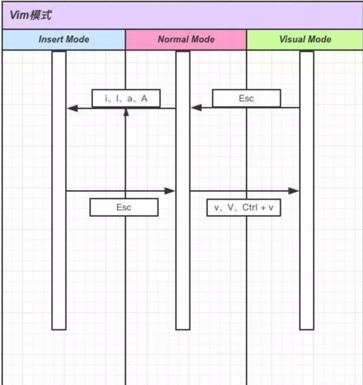

[toc]

# 源码安装及卸载

## 怎么卸载用 make install 编译安装的软件？

https://www.zhihu.com/question/20092756/answer/245869742

在linux 中用 ./configure && make && make install 后,如果想删除这个软件我应该怎么删除呢?
好像有一个叫"make uninstall"的东西,但是没有发现

一般来说，make install完了目录下会有一个install_mainfest.txt的文件记录了安装的所有内容，

然后xargs rm < install_manifest.txt就可以了。

如果没有这个文件，可以自己重新make install，从log中过滤出install信息了。

# vim

## 助记符

### 正则表达式相关

- $ ： 移动光标到行尾
- ^ : 移动光标到当前行的第一个字母位置。

### 移动类（motion）

h（左）、l（右）、j（下）、k（上）、f（front）、b（back）、u（up）

### 操作类（operator）

d（delete）、i（insert）、a（append）、c（change）、y（copy）、p（paste）

### 一般的缩写

w（word）、s（sentence）

## 理解 vim 中三种常用模式

vim 里面有好几种模式，但是因为我这里介绍的是在目前的编辑器里面装 插件，所以像命令模式这种用来保存文件、退出文件的就不介绍了。

1. Nomal mode（默认模式，因为使用该模式场景最多，所有定为默认模式）。
2. Insert mode （插入模式--少用，用了它 vim 就成 「哑巴」了）。
3. Visual mode（可视模式，取名叫光标模式或者选择模式可能还比较好理解）

### 三种模式之间的转换关系



## 教程篇

### Nomal mode

当我们记住上面的助记符之后，我们就可以像写英文短语一样操作了。

> vim 快捷键语法：operator[motion]，例如 删两个单词就是

d2w，operator 和 motion 我已经在前面给出来一些了。

#### 移动光标

##### 最基本的 h、j、k、l

最基本的上下左右移动（跟键盘上下左右的键盘效果相同，但是往往方向键在键盘的右下方，离主键盘区较远，这个也相对比较有优势）：

- h：光标向左移动
- j：光标向下移动
- k：光标向上移动
- l：光标向右移动

移动属于 motion，所以在前面加上「count」就可以移动多行了，比如向上移动 10 行，就可以 10k。往往编辑器会有行号，定位需要做个加减法，如果采用的是相对行号，用这个就比较方便。不懂相对行号的同学看下图就懂了。

[Vim如何使用相对行号实现一切操作详解 - 云+社区 - 腾讯云 (tencent.com)](https://cloud.tencent.com/developer/article/1722577)

#### 快速移动

b：光标往前移动一个词
w：光标向后移动一个词
0：移动光标到当前行首
^：移动光标到当前行的第一个字母位置(注意与 0 的区别)
$：移动光标到行尾
fx：移动光标到当前行的下一个 x 处（x为任意字母）
tx：和上面一个命令类似，移动到 x 的左边一个位置
)：移动光标到下一个句子
( ：移动光标到上一个句子
{：移动光标到上一段
}：移动光标到下一段

#### 快速定位

在刚才介绍了通过相对行号来进行移动到行的光标，还有采用绝对定位来移动的。那就是 gg。
语法： [num]gg

- 2gg : 光标移动到第 2 行
- gg： 光标移动到文件首部
- G：移动到文件尾部
- H：移动到屏幕上面
- M：移动到屏幕中间
- L：移动到屏幕下面

书签功能：这个功能也是很方便，很少有编辑器有的功能，单独列出来讲，强烈推荐。

- m`<x>`：给当前行加入书签，x 为任意字母（m 是 mark ）
- ` `<x>`： 单引号加上刚才 m 之后的字母，就会调整到刚才标记的那一行

#### 屏幕滚动

- Ctrl + b：向上移动一屏（Foward首字母小写）
- Ctrl + f：向下移动一屏（Backward首字母小写）
- Ctrl + d：向下滚动半屏内容（Down首字母小写）
- Ctrl + u：向上滚动半屏内容（Up首字母小写）

#### 剪切、复制、粘贴

- d[n]w：剪切后面 n 个单词的内容，dw 是剪切当前单词
- [n]dd：剪切n行的内容, dd 为剪切当前行
- D：剪切光标后到行尾的内容
- yy/Y：复制当前行的内容
- p：粘贴到光标后
- P：粘贴到光标前

在 normal 模式下是没有删除操作的，d 这种删除也是剪切。

> 以上全是 normal 模式

#### 全选复制 、删除

**全选（高亮显示**）：按esc后，然后ggvG或者ggVG

**全部复制：**按esc后，然后ggyG

**全部删除：**按esc后，然后dG

解析：

**gg：**是让光标移到首行，在**vim**才有效，vi中无效

**v ：** 是进入Visual(可视）模式

**G ：**光标移到最后一行

**选**中内容以后就可以其他的操作了，比如：
**d** 删除**选**中内容
**y** 复制**选**中内容到0号寄存器
**"+y** 复制**选**中内容到＋寄存器，也就是系统的剪贴板，供其他程序用

### Insert mode

在前面也说了，进入编辑模式也就变成了「哑巴」vim 了，就跟一般的编辑器没什么区别了。很多人就知道用 i 可以进入，还有很多命令可以让你聪明的进入。

- i：在光标处插入（insert首字母小写）
- I：在行首插入（insert首字母大写）
- a：在光标处后一个字符插入（append首字母小写）
- A：在行尾插入（append首字母大写）
- o：在上一行插入
- O：在下一行插入
- s：清除当前字符并进入插入模式
- cc/S：清除当前行并进入插入模式
- cw: 清除当前单词并进入插入模式

### Visual mode

要是前面都学会了，可视模式就比较简单了，而且你将会经常用到这个模式。我会把这个模式称做「选择模式」，接下来我们就来探索一下是如果选择的。

其实也就两个关键的点：v（字符选择）、V（行选择）

#### v（小写 v）

在 normal 模式下，按一下 v，然后可以按 l，重复按 l，你会发现右边的在一直被选中（高亮的部分）。同样的操作，按了 v，然后再练习一下按 h、j、k。

选中的目的是什么呢？就是为了进行一些编辑操作，比如删除 d (实质是剪切)、复制 y。

> 小提示，常常选中之后用 c 也是比较好的选择哦，剪切并进入插入模式。

#### V（大写 V）

V 就是选中行，也很简单。按了 V 之后，然后按 j、k，就可以上下选择行了，然后一次性删除 d、复制 y，就比较方便。

#### 组合操作

这个功能就比较强悍了，很适用，强烈推荐。
先来记公式：operator + i|a + scope

> operator 就是我们前面提到的插入（c）、剪切（d）、复制（y）以及选择（v），i 表示 scope 范围内，a 表示包含 scope 标签，scope 就是操作的范围了。

实例：
以下如果将 i 换成 a，则会将符号也包含进去

- vib（选中小括号内的内容）
- viB（选中大括号内的内容）
- vi"（选中双引号内的内容）
- vi'（选中单引号内的内容）
- vi<（选中尖括号内的内容）

### 撤回、查找、替换

- u： 撤回上次操作(效果跟 command + z 效果一样)
- /|?xxx：表示在整篇文档中搜索匹配xxx的字符串, / 表示向下查找, ? 表示向上查找.其中xxx可以是正规表达式。查找到以后, 再输入 n 查找下一个匹配处, 输入 N 反方向查找.
- :%s/original/replacement：检索第一个 “original” 字符串并将其替换成 “replacement”
- :%s/original/replacement/g： 检索并将所有的 “original” 替换为 “replacement”
- :%s/original/replacement/gc：检索出所有的 “original” 字符串，但在替换成 “replacement” 前，先询问是否替换

这些操作一般编辑器都自带有很好的快捷键，记不住也没啥

我写这篇文章的目的不是为了总结什么知识点（其实当你 vim 用熟了，这些命令完全形成肌肉记忆了，根本不用记下来），或者说想发篇文章之类的，仅仅是想给 vim 做一个宣传，让更多的人接触 vim，让更多的开发者在开发上效率更高。如果你觉得这篇文章对你有帮助，请转发给更多的人让他们都了解了解。

最后想提醒的就是，对于这些快捷键，死记是很难记完的，根据我总结的一些语义话的方式去记，有公式的记公式，可能要快一点，然后就是多实践，敲多了自己就记住了。我刚开始学的时候，还不知道有那些助记符，基本完全靠死记硬背，我就是用一张纸，然后把命令手写抄到纸上，放在我的电脑旁，忘了就马上拿来看看，别说，效果还挺好的。

祝你们好运！

来源：[vim 入坑指南 - 知乎 (zhihu.com)](https://zhuanlan.zhihu.com/p/34763625)

## vim保存/退出

:w保存文件但不退出vi 编辑

:w! 强制保存，不退出vi 编辑

:w file将修改另存到file中，不退出vi 编辑

:wq保存文件并退出vi 编辑

:wq!强制保存文件并退出vi 编辑

q:不保存文件并退出vi 编辑

:q!不保存文件并强制退出vi 编辑

:e!放弃所有修改，从上次保存文件开始在编辑

# emacs

# 其他

## 显示文件目录

[(3条消息) CentOS之Tree显示目录结构-yellowcong_狂飙的yellowcong的博客-CSDN博客_centos tree查看目录结构](https://blog.csdn.net/yelllowcong/article/details/77399632)

## linux重复上一条命令的参数

## 搜索

[(3条消息) linux在vim中搜索文件,技术|超酷的 Vim 搜索技巧_weixin_39834780的博客-CSDN博客](https://blog.csdn.net/weixin_39834780/article/details/116890822)

搜索：`:/s`

取消搜索：`:/nohl`

## 自动匹配括号

[设置自动匹配括号和引号](https://www.cnblogs.com/a-flydog/p/5431815.html)

[Vim 配置自动成对的括号 - 知乎 (zhihu.com)](https://zhuanlan.zhihu.com/p/62353081)

```
vim ~/.vimrc

在.vimrc中添加一下几行

inoremap ( () <LEFT>

inoremap { {} <LEFT>

inoremap [ [] <LEFT>

inoremap ' '' <LEFT>

inoremap " "" <LEFT>

:wq
```

## 设置vim缩进为4个空格

[(3条消息) vim设置tab为4个空格_远近长安的博客-CSDN博客_vim设置tab为四个空格](https://blog.csdn.net/qq_33141353/article/details/122062168)

```
 vim /etc/vimrc

末尾添加
set ts=4
```

# LunarVim

[Installation | LunarVim Docs](https://www.lunarvim.org/01-installing.html#prerequisites)
