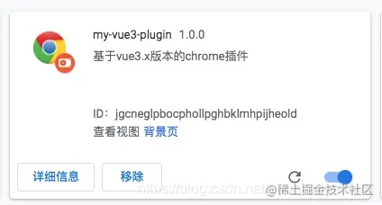
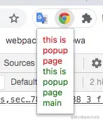
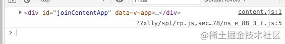
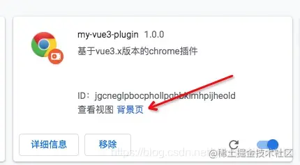
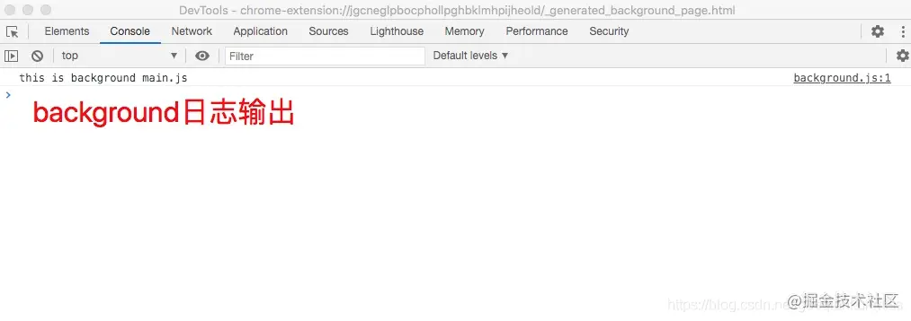
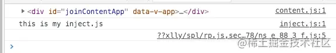
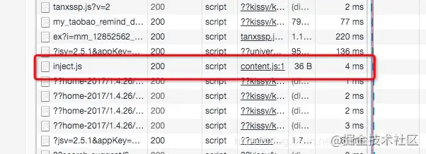
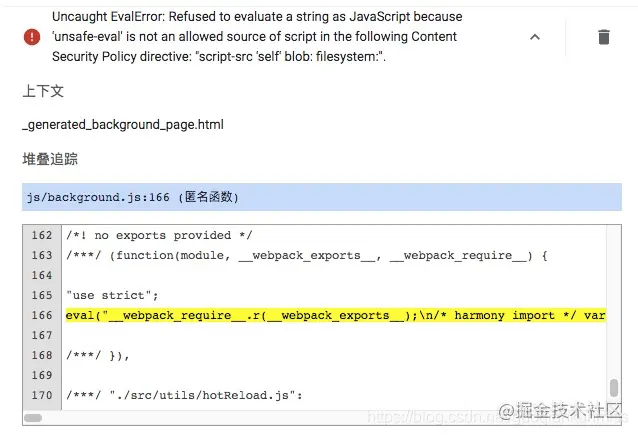
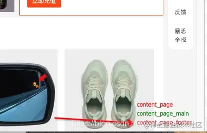

# 15000字大章带你一步一步使用Vue3开发chrome浏览器插件 | 掘金年度征文


> 之前写过一篇 chrome 浏览器插件开发的文章 [全方面手把手从0到1带你开发谷歌浏览器插件](https://juejin.cn/post/6902306686716313614) ，但是不是 `vue/react` 这种第三方框架的，是原生和 `jquery` 混合的，但是那种开发前端方式比较麻烦，所以下面是用 `vue` 来开发插件。

> 文章有点长，建议先收藏再一步步来进行实操


> [github地址：https://github.com/18055975947/my-vue3-plugin](https://link.juejin.cn/?target=https%3A%2F%2Fgithub.com%2F18055975947%2Fmy-vue3-plugin)

> [码云地址：https://gitee.com/guoqiankun/my-vue3-plugin](https://link.juejin.cn/?target=https%3A%2F%2Fgitee.com%2Fguoqiankun%2Fmy-vue3-plugin)
>
> 

## 一、创建 Vue 项目

使用 `vue-cli` 创建 `vue3.x` 版本的 `vue` 项目 `vue create my-vue3-plugin` 如果在创建项目的时候报错，报错内容如下：

```text
error Couldn't find package "postcss-normalize-string@^4.0.2" required by "cssnano-preset-default@^4.0.0" on the "npm" registry.
Error: Couldn't find package "@vue/cli-overlay@^4.5.9" required by "@vue/cli-service@~4.5.0" on the "npm" registry.
    at MessageError.ExtendableBuiltin (/usr/local/lib/node_modules/yarn/lib/cli.js:243:66)
    at new MessageError (/usr/local/lib/node_modules/yarn/lib/cli.js:272:123)
    at PackageRequest.<anonymous> (/usr/local/lib/node_modules/yarn/lib/cli.js:38988:17)
    at Generator.throw (<anonymous>)
    at step (/usr/local/lib/node_modules/yarn/lib/cli.js:92:30)
    at /usr/local/lib/node_modules/yarn/lib/cli.js:105:13
    at process._tickCallback (internal/process/next_tick.js:68:7)
 ERROR  command failed: yarn 

```

可以参考 [使用 `vue-cli` 创建 `vue3.x` 版本项目报错](https://juejin.cn/post/6911974908025110536) 文章来处理 此时文件目录为：

```text
.
├── README.md
├── babel.config.js
├── package.json
├── public
│   ├── favicon.ico
│   └── index.html
├── src
│   ├── App.vue
│   ├── assets
│   │   └── logo.png
│   ├── components
│   │   └── HelloWorld.vue
│   └── main.js
└── yarn.lock

```

## 二、修改项目

因为我们要开发 `chrome` 插件项目，而这种生成的 `vue` 项目里面的文件夹和文件很多我们不需要，所以我们需要处理下：

1. 在根目录下创建 `vue.config.js` 的 `vue` 配置文件；
2. 把 `src` 文件夹下面的 `app.vue、components` 文件夹删除
3. 在 `assets` 文件中创建 `images` 文件夹，并在 `images` 文件夹里面添加自己插件的 `icon`
4. 删除根目录下的 `public` 文件夹
5. 在 `src` 文件夹下 创建 `background、content、plugins、popup、utils` 文件夹
6. 在 `background` 文件夹下创建 `main.js`
7. 在 `content` 文件夹下创建 `components` 文件夹和 `main.js`，`components` 文件夹下创建 `app.vue`
8. 在 `plugins` 文件夹下创建 `inject.js、manifest.json` 文件
9. 在 `popup` 文件夹下创建 `components` 文件夹 `main.js` 和 `index.html`，`components` 文件夹下创建 `app.vue`

**步骤解析：**

- `vue.config.js` 是 `vue` 项目的打包、运行、等的配置文件，我们需要生成插件项目，这个文件需要创建并且自行配置
- 删除多余的文件，我们插件里面目前只有 需要一个 `popup` 页面，不需要 外部的 `app.vue` 和 组件
- 自己的插件 `icon`，按照 `16 * 16、48 * 48、128 * 128` 三个尺寸
- 不需要 `public` 文件夹里面的 `index.html`
- 创建我们插件需要的 `background.js、content.js、popup页面、插件配置` 等
- 创建 `background.js` 文件
- 创建 `content.js` 文件
- 创建 `popup.js、popup.html` 文件

此时文件目录：

```text
.
├── README.md
├── babel.config.js
├── package.json
├── src
│   ├── assets
│   │   ├── images
│   │   │   ├── icon128.png
│   │   │   ├── icon16.png
│   │   │   └── icon48.png
│   │   └── logo.png
│   ├── background
│   │   └── main.js
│   ├── content
│   │   ├── components
│   │   │   └── app.vue
│   │   └── main.js
│   ├── main.js
│   ├── plugins
│   │   ├── inject.js
│   │   └── manifest.json
│   ├── popup
│   │   ├── components
│   │   │   └── app.vue
│   │   ├── index.html
│   │   └── main.js
│   └── utils
├── vue.config.js
└── yarn.lock

```

## 三、配置项目

### 1、`plugins/manifest.json` 文件配置

先配置 `manifest.json` 文件，在按照此文件配置 `vue.config.js` 文件

```json
{
	"manifest_version": 2,
	"name": "my-vue3-plugin",
	"description": "基于vue3.x版本的chrome插件",
	"version": "1.0.0",
	"browser_action": {
		"default_title": "my-vue3-plugin",
		"default_icon": "assets/images/icon48.png",
		"default_popup": "popup.html"
	},
	"permissions": [],
	"background": {
		"scripts": ["js/background.js"]
	},
	"icons": {
		"16": "assets/images/icon16.png",
		"48": "assets/images/icon48.png",
		"128": "assets/images/icon128.png"
	},
	"content_scripts": [
		{
			"matches": ["https://*.taobao.com/*"],
			"css": ["css/content.css"],
			"js": ["js/content.js"],
			"run_at": "document_idle"
		}
	],
	"web_accessible_resources": ["js/inject.js"]
}

```

#### 解析：

1. `browser_action` 中的 `default_popup` 配置为 和 `manifest.json` 文件一级的 `popup.html`
2. `browser_action` 中的 `default_icon` 配置为 `assets/images/icon48.png`
3. `background` 配置为 `js/background.js`
4. `icons` 文件进行 项目的配置
5. `content_scripts` 配置对应的 `js、css、和 matches`
6. `web_accessible_resources` 配置网页内置 `js/inject.js`

### 2、配置 `vue.config.js` 文件

通过上面的 `manifest.json` 文件可以看出，我们需要配置 `js` 文件夹，`css` 文件夹，`popup.html` 文件，`background.js` 文件，`inject.js` 文件，`content.js` 文件，`content.css` 文件；

#### 1. 添加 `copy-webpack-plugin` 模块，用于复制文件

我们需要把 `plugins` 文件夹下的文件复制到打包之后的 `dist` 文件中

**安装：**

```text
yarn add copy-webpack-plugin@6.0.2 --dev

```

#### 2. 文件内容

```js
const CopyWebpackPlugin = require("copy-webpack-plugin");
const path = require("path");

// 复制文件到指定目录
const copyFiles = [
	{
    	from: path.resolve("src/plugins/manifest.json"),
    	to: `${path.resolve("dist")}/manifest.json`
  	},
  	{
    	from: path.resolve("src/assets"),
    	to: path.resolve("dist/assets")
  	},
  	{
	    from: path.resolve("src/plugins/inject.js"),
	    to: path.resolve("dist/js")
  	}
];

// 复制插件
const plugins = [
  	new CopyWebpackPlugin({
    	patterns: copyFiles
  	})
];

// 页面文件
const pages = {};
// 配置 popup.html 页面
const chromeName = ["popup"];

chromeName.forEach(name => {
  	pages[name] = {
    	entry: `src/${name}/main.js`,
    	template: `src/${name}/index.html`,
    	filename: `${name}.html`
  	};
});

module.exports = {
	pages,
	productionSourceMap: false,
	// 配置 content.js background.js
	configureWebpack: {
		entry: {
			content: "./src/content/main.js",
			background: "./src/background/main.js"
		},
		output: {
			filename: "js/[name].js"
		},
		plugins
	},
	// 配置 content.css
	css: {
		extract: {
			filename: "css/[name].css"
		}
	}
}

```

#### 3. 解析：

1. `copyFiles` 是复制文件的字段
2. `pages` 是配置多页面的文件字段
3. `configureWebpack` 来配置 `content.js`、`background.js` 文件
4. `css` 配置 `content.css` 文件

### 3、`popup` 文件夹修改

从上面的配置我们知道了，`popup` 文件夹是用来生成 `browser_action` 的 `popup.html` 文件的，所以此时我们来写入 `popup` 文件夹

#### 1. `popup/index.html`

`popup` 文件夹下的 `index.html` 文件，因为这个是 `html` 文件，我们就只需要按照 `vue create` 生成的项目中的 `public` 文件夹下的 `index.html` 文件内容拷贝过来即可，顺便把 `favicon` 删除，把 `title` 修改下

```html
<!DOCTYPE html>
<html lang="en">
  <head>
    <meta charset="utf-8">
    <meta http-equiv="X-UA-Compatible" content="IE=edge">
    <meta name="viewport" content="width=device-width,initial-scale=1.0">
    <title>my-vue-chrome-plugin</title>
  </head>
  <body>
    <noscript>
      <strong>We're sorry but <%= htmlWebpackPlugin.options.title %> doesn't work properly without JavaScript enabled. Please enable it to continue.</strong>
    </noscript>
    <div id="app"></div>
    <!-- built files will be auto injected -->
  </body>
</html>

```

#### 2. `popup/main.js`

这个是 `vue` 项目的入口配置文件，就按照 `src` 下面的 `main.js` 复制过来即可，别忘了改下 大小写

```js
import { createApp } from 'vue'
import app from './components/app.vue'

createApp(app).mount('#app')

```

#### 3. `popup/components/app.vue`

此文件就是正常的 `vue` 文件，按照平时写 `vue` 项目开发即可

```html
<template>
	<div class="popup_page">
		this is popup page
		<div class="popup_page_main">
			this is popup page main
		</div>
	</div>
</template>

<script>
	export default {

	}
</script>

<style></style>

```

### 4、`content` 文件夹修改

`content` 文件夹下是对应 `chrome` 插件的 `content.js`，这个可以在嵌入页面里面渲染页面，我们也可以用 `vue` 开发

#### 1. `content/components/app.vue`

正常的 `vue` 开发

```html
<template>
	<div class="content_page">
		content_page
		<div class="content_page_main">
			content_page_main
		</div>
	</div>
</template>

<script>
	export default {

	}
</script>

<style>
	
</style>

```

#### 2. `content/main.js`

`main.js` 这个文件是**比较重要**的，是通过这个文件引入 `vue` 组件以及使用 `vue` 开发 `content` 页面的，所以这个页面，需要在插件嵌入的页面，增加一个 `dom` 元素，并把这个插件的 `content` 页面，渲染进去。

```js
import { createApp } from 'vue'
import app from './components/app.vue'

joinContent(app)

function joinContent (element) {
	const div = document.createElement('div')
	div.id = 'joinContentApp'
	document.body.appendChild(div)
	console.log(div)
	createApp(element).mount('#joinContentApp')
}

```

**解析：**

1. 引入 `vue3` 的 `createApp`
2. 引入 `app` 组件
3. 创建一个 `id` 为 `joinContentApp` 的 `dom` 元素，把此元素插入 `body` 中，并把应用实例挂载到此 `dom` 上

### 5、`background` 文件夹

此文件夹是对应的 `background.js` 文件，可以只写一个简单的日志打印即可

```js
console.log('this is background main.js')

```

### 6、`yarn run build` 打包

此时，先进行 `run build` 打包，如果你报错了，是 `eslint` 报错，可以进行在 `.eslintrc.js` 文件中进行配置，添加一些我常用的 `eslint` 配置

```js
module.exports = {
  root: true,
  env: {
    node: true
  },
  extends: [
    'plugin:vue/vue3-essential',
    '@vue/standard'
  ],
  parserOptions: {
    parser: 'babel-eslint'
  },
  rules: {
    "generator-star-spacing": "off",
    "object-curly-spacing": "off",
    "no-var": "error",
    "semi": 0,
    "eol-last": "off",
    "no-tabs": "off",
    "indent": "off",
    "quote-props": 0,
    "no-mixed-spaces-and-tabs": "off",
    "no-trailing-spaces": "off",
    "arrow-parens": 0,
    "spaced-comment": "off",
    "space-before-function-paren": "off",
    "no-empty": "off",
    "no-else-return": "off",
    "no-unused-vars": [2, {"vars": "all", "args": "after-used"}],
    "no-console": "off",
    'no-debugger': process.env.NODE_ENV === 'production' ? 'warn' : 'off'
  }
}

```

然后在进行打包

此时的文件内容

```text
.
├── README.md
├── babel.config.js
├── dist
│   ├── assets
│   │   ├── images
│   │   │   ├── icon128.png
│   │   │   ├── icon16.png
│   │   │   └── icon48.png
│   │   └── logo.png
│   ├── js
│   │   ├── background.js
│   │   ├── chunk-vendors.fa86ccee.js
│   │   ├── content.js
│   │   ├── inject.js
│   │   └── popup.js
│   ├── manifest.json
│   └── popup.html
├── package.json
├── src
│   ├── assets
│   │   ├── images
│   │   │   ├── icon128.png
│   │   │   ├── icon16.png
│   │   │   └── icon48.png
│   │   └── logo.png
│   ├── background
│   │   └── main.js
│   ├── content
│   │   ├── components
│   │   │   └── app.vue
│   │   └── main.js
│   ├── main.js
│   ├── plugins
│   │   ├── inject.js
│   │   └── manifest.json
│   ├── popup
│   │   ├── components
│   │   │   └── app.vue
│   │   ├── index.html
│   │   └── main.js
│   └── utils
├── vue.config.js
└── yarn.lock

```

此时我们可以看到 `dist` 文件夹下已经按照我们需要的内容进行打包了，但是没有 `css` 文件夹那是因为我们没有写入 `css`

### 7、引入 `less`

我们写页面少不了使用 `css`，现在都是使用预处理器，我比较倾向于 `less`，所以我使用 `less、less-loader`

#### 1. 引入 `less less-loader`

```text
yarn add less less-loader --dev

```

#### 2. 修改 `app.vue` 文件

然后我们在 `content/components/app.vue` 和 `popup/components/app.vue` 文件中写入 `css` 样式

**`content/components/app.vue`**

```html
<template>
	<div class="content_page">
		content_page
		<div class="content_page_main">
			content_page_main
		</div>
	</div>
</template>

<script>
	export default {

	}
</script>

<style lang="less" scoped>
	.content_page{
		color: red;
		position: fixed;
		z-index: 100001;
		right: 10px;
		bottom: 10px;
		.content_page_main{
			color: green;
		}
	}
</style>

```

**`popup/components/app.vue`**

```html
<template>
	<div class="popup_page">
		this is popup page
		<div class="popup_page_main">
			this is popup page main
		</div>
	</div>
</template>

<script>
	export default {

	}
</script>

<style lang="less" scoped>
	.popup_page{
		color: red;
		.popup_page_main{
			color: green;
		}
	}
</style>

```

#### 3. `yarn run build` 打包

此时 `tree dist` 查看 `dist` 文件夹内容

```text
dist
├── assets
│   ├── images
│   │   ├── icon128.png
│   │   ├── icon16.png
│   │   └── icon48.png
│   └── logo.png
├── css
│   ├── content.css
│   └── popup.css
├── js
│   ├── background.js
│   ├── chunk-vendors.4f73d0d4.js
│   ├── content.js
│   ├── inject.js
│   └── popup.js
├── manifest.json
└── popup.html

```

我们可以看到，我们通过 `vue.config.js` 文件配置的内容都已经生成到 `dist` 文件夹中了

## 四、导入插件项目

### 1、在谷歌拓展程序中打开我们的插件

点击 **加载已解压的拓展程序**，选择我们的 `dist` 文件夹，此时我们的插件就被引入进来了



### 2、打开 [淘宝首页](https://link.juejin.cn/?target=https%3A%2F%2Fwww.taobao.com%2F)

#### 1. 为什么打开淘宝首页呢？

因为我们在 `manifest.json` 中的 `content_scripts` 中配置 `"matches": ["https://*.taobao.com/*"]`

#### 2. 点击右上角的插件 `icon`

 

我们可以看到我们的 `popup` 页面已经我们给它写的样式

### 3、我们的 `content` 文件呢？

我们在 `content` 文件中配置的 `main.js` 和 `app.vue` 也写入了样式，也挂载到 `dom` 实例上了，但是为什么没有渲染，也没有打印

```js
function joinContent (element) {
	const div = document.createElement('div')
	div.id = 'joinContentApp'
	document.body.appendChild(div)
	console.log(div)
	createApp(element).mount('#joinContentApp')
}

```

我们在 `js` 文件中有个 `console.log` 日志输入，但是可以看到淘宝页面的控制台并没有输入

#### 1. 为什么没有输出

因为我们是用的 `vue` 开发项目，在 `main.js` 中是用的 `vue` 开发，所以我们得引入 `vue` 文件，得在 `content` 中引入 `vue` 才可以

#### 2. 解决方法，引入 `vue`

我们可以看到 `dist` 文件夹下面有一个 `chunk-vendors.4f73d0d4.js`，这个就是 `vue` 打包之后的文件，我们先在 `dist` 中的 `manifest.json` 文件先把它引入进来先看下

`dist/manifest.json` 文件下的 `content_scripts` 字段

```json
"content_scripts": [
	{
		"matches": ["https://*.taobao.com/*"],
		"css": ["css/content.css"],
		"js": ["js/chunk-vendors.4f73d0d4.js", "js/content.js"],
		"run_at": "document_idle"
	}
],

```

此时，拓展程序页面刷新插件，并刷新淘宝首页，可以看到


  


此时可以看到我们的 `content` 文件已经输出了。

### 4、`background.js` 文件

还记得我们在 `background` 文件夹下中的 `main.js` 写入日志输出吗？

```js
console.log('this is background main.js')

```

我们打开拓展程序，找到我们的插件，点击 **背景页** 按钮

 

此时，背景页的控制台就出来，我们可以看到我们的日志输出，好像并没有输出我们的日志？？？

#### 1. 原因

此问题的原因和上面的 `content` 文件的原因是一致的，也是没有引入 `vue` 文件

#### 2. 解决，引入 `vue`

`dist/manifest.json` 中 `background` 字段

```json
"background": {
	"scripts": ["js/chunk-vendors.4f73d0d4.js", "js/background.js"]
},

```

此时，刷新插件，可以看到日志输出 



### 5、引入 `inject` 文件

#### 1. 首先我们在 `plugins/inject.js` 文件中输出日志

```js
console.log('this is my inject.js')

```

#### 2. 然后在 `content/main.js` 文件中引入 `inject.js`

```js
import { createApp } from 'vue'
import app from './components/app.vue'

joinContent(app)
injectJsInsert()

function joinContent (element) {
	const div = document.createElement('div')
	div.id = 'joinContentApp'
	document.body.appendChild(div)
	console.log(div)
	createApp(element).mount('#joinContentApp')
}

function injectJsInsert () {
	document.addEventListener('readystatechange', () => {
		const injectPath = 'js/inject.js'
		const script = document.createElement('script')

		script.setAttribute('type', 'text/javascript')
		script.src = chrome.extension.getURL(injectPath)
		document.body.appendChild(script)
	})
}

```

#### 3. `yarn run build` 打包

此时打包可以发现报错了

```powershell
yarn run v1.22.10
$ vue-cli-service build

⠼  Building for production...

 ERROR  Failed to compile with 1 error                              上午11:12:48

 error  in ./src/content/main.js

Module Error (from ./node_modules/thread-loader/dist/cjs.js):

/Users/guoqiankun/work/chromePlugin/my-vue3-plugin/src/content/main.js
  21:16  error  'chrome' is not defined  no-undef

✖ 1 problem (1 error, 0 warnings)


 ERROR  Build failed with errors.
error Command failed with exit code 1.
info Visit https://yarnpkg.com/en/docs/cli/run for documentation about this command.

error 'chrome' is not defined no-undef
```

我们在上面插入 `jnject` 文件使用的 `chrome` 未定义，那我们就定义一下；

#### 4. 修改 `.eslintrc.js` 文件

```js
root: true,
globals: {
  chrome: true,
},
env: {
  node: true
},

```

增加一个 `globals` 字段，里面 `chrome: true`

然后在进行 `yarn run build` 打包

然后我们可以看到 `dist/manifest.json` 文件中的 `content_scripts` 和 `background/scripts` 已经没有引入 `vue` 了，所以我们不能在 `dist` 文件夹中修改，我们要在 `plugins/manifest.json` 文件中修改

但是我们可以看到，我们每次打包生成的 `chunk-vendors.js` 会跟一个 `hash`，因为我们此时没有修改别的文件，所以 `hash` 后缀没有变化，但是如果我们改了内容之后在 `yarn run build` 呢？此时 `hash` 就会变化，总不能在改一次 `manifest.json` 再打一次包吧...

### 6、修改 `vue.config.js` 文件，让打包时生成的 `chunk-vendors.js` 不带 `hash`

#### 1. 配置 `chainWebpack` 字段

配置 `chainWebpack` 字段，对 `config` 内容进行处理

```js
module.exports = {
	pages,
	productionSourceMap: false,
	// 配置 content.js background.js
	configureWebpack: {
		entry: {
			content: "./src/content/main.js",
			background: "./src/background/main.js"
		},
		output: {
			filename: "js/[name].js"
		},
		plugins
	},
	// 配置 content.css
	css: {
		extract: {
			filename: "css/[name].css"
		}
	},
	chainWebpack: config => {
		if (process.env.NODE_ENV === 'production') {
			config.output.filename('js/[name].js').end()
			config.output.chunkFilename('js/[name].js').end()
		}
	}
}

```

#### 2. 修改 `plugin/manifest.json` 文件

在此文件中引入 `chunk-vendors.js`

```
plugin/manifest.json
"background": {
	"scripts": ["js/chunk-vendors.js", "js/background.js"]
},
"icons": {
	"16": "assets/images/icon16.png",
	"48": "assets/images/icon48.png",
	"128": "assets/images/icon128.png"
},
"content_scripts": [
	{
		"matches": ["https://*.taobao.com/*"],
		"css": ["css/content.css"],
		"js": ["js/chunk-vendors.js", "js/content.js"],
		"run_at": "document_idle"
	}
],

```

#### 3. `yarn run build` 打包

```text
dist
├── assets
│   ├── images
│   │   ├── icon128.png
│   │   ├── icon16.png
│   │   └── icon48.png
│   └── logo.png
├── css
│   ├── content.css
│   └── popup.css
├── js
│   ├── background.js
│   ├── chunk-vendors.js
│   ├── content.js
│   ├── inject.js
│   └── popup.js
├── manifest.json
└── popup.html

```

#### 4. 刷新插件，刷新页面

属性插件，刷新页面，之后可以看到 

 




## 五、热加载

此时我们的 `vue` 开发插件项目已经基本上可以了，剩下的就是按照需求开发插件页面，按照需求添加 `manifest.json` 字段即可，但是我们不能每一次想看样式就打个包，然后属性插件，刷新页面看下，这样也可以，但是我们是开发，这样效率比较低，我不服...

**所以我们需要添加一下热加载**

### 1、热加载

在 `utils` 文件夹下创建 `hotReload.js` 文件

写入

```js
// 加载文件

const filesInDirectory = dir =>
  new Promise(resolve =>
    dir.createReader().readEntries(entries => {
      Promise.all(
          entries
          .filter(e => e.name[0] !== '.')
          .map(e =>
            e.isDirectory ? filesInDirectory(e) : new Promise(resolve => e.file(resolve))
          )
        )
        .then(files => [].concat(...files))
        .then(resolve);
    })
  );

// 遍历插件目录，读取文件信息，组合文件名称和修改时间成数据
const timestampForFilesInDirectory = dir =>
  filesInDirectory(dir).then(files =>
    files.map(f => f.name + f.lastModifiedDate).join()
  );

// 刷新当前活动页
const reload = () => {
  window.chrome.tabs.query({
      active: true,
      currentWindow: true
    },
    tabs => {
      // NB: see https://github.com/xpl/crx-hotreload/issues/5
      if (tabs[0]) {
        window.chrome.tabs.reload(tabs[0].id);
      }
      // 强制刷新页面
      window.chrome.runtime.reload();
    }
  );
};

// 观察文件改动
const watchChanges = (dir, lastTimestamp) => {
  timestampForFilesInDirectory(dir).then(timestamp => {
    // 文件没有改动则循环监听watchChanges方法
    if (!lastTimestamp || lastTimestamp === timestamp) {
      setTimeout(() => watchChanges(dir, timestamp), 1000); // retry after 1s
    } else {
      // 强制刷新页面
      reload();
    }
  });
};

const hotReload = () => {
  window.chrome.management.getSelf(self => {
    if (self.installType === 'development') {
      // 获取插件目录，监听文件变化
      window.chrome.runtime.getPackageDirectoryEntry(dir => watchChanges(dir));
    }
  });
};

export default hotReload;

```

### 2、引入

在 `bckground/main.js` 中 引入

```js
import hotReload from '@/utils/hotReload'

hotReload()
console.log('this is background main.js')

```

### 3、修改 `package.json` 中的 `scripts`

#### 1. 增加一个 `watch` 用来监听打包

```json
"scripts": {
  "watch": "vue-cli-service build --watch",
  "serve": "vue-cli-service serve",
  "build": "vue-cli-service build",
  "lint": "vue-cli-service lint"
},

```

#### 2. 此时运行 `yarn run watch`

```powershell
yarn run v1.22.10
$ vue-cli-service build --watch

⠙  Building for development...

 DONE  Compiled successfully in 3956ms                                           上午11:39:00

  File                        Size                          Gzipped

  dist/js/chunk-vendors.js    668.79 KiB                    122.48 KiB
  dist/js/content.js          26.47 KiB                     3.71 KiB
  dist/js/popup.js            26.23 KiB                     3.55 KiB
  dist/js/background.js       15.57 KiB                     3.30 KiB
  dist/js/inject.js           0.04 KiB                      0.05 KiB
  dist/css/content.css        0.18 KiB                      0.14 KiB
  dist/css/popup.css          0.11 KiB                      0.09 KiB

  Images and other types of assets omitted.

 DONE  Build complete. Watching for changes...

```

可以看到一直在监听改变

#### 3. 然后我们刷新插件和页面

发现有一个报错

```powershell
Uncaught EvalError: Refused to evaluate a string as JavaScript because 'unsafe-eval' is not an allowed source of script in the following Content Security Policy directive: "script-src 'self' blob: filesystem:".

```



#### 4. 按照错误解决问题：

在 `plugins/manifest.json` 中添加：

```json
"content_security_policy": "script-src 'self' 'unsafe-eval'; object-src 'self'",

```

#### 5. 重新运行 `yarn run bild`

#### 6. 清除插件错误、刷新插件、淘宝页面

### 4、修改 `content/components/app.vue` 文件

```html
<template>
	<div class="content_page">
		content_page
		<div class="content_page_main">
			content_page_main
		</div>
		<div class="content_page_footer">
			content_page_footer
		</div>
	</div>
</template>

```

保存

然后发现插件自动刷新、浏览器页面自动刷新。

此时浏览器页面右下角我们新加的内容就展示在上面了。 




## 六、总结

1. 使用 `vue` 开发插件，要先想一下我们要做成什么样
2. 针对性的修改对应的文件，按照我们的需求去配置
3. 遇到问题先想一下哪一步的问题，为什么出现，可以自己先想想，最后在寻求帮助
4. 完结🎉🎉🎉

## 七、源码地址

[github地址：https://github.com/18055975947/my-vue3-plugin](https://link.juejin.cn/?target=https%3A%2F%2Fgithub.com%2F18055975947%2Fmy-vue3-plugin)

[码云地址：https://gitee.com/guoqiankun/my-vue3-plugin](https://link.juejin.cn/?target=https%3A%2F%2Fgitee.com%2Fguoqiankun%2Fmy-vue3-plugin)

##### 参考资料

- [vue3 API](https://link.juejin.cn/?target=https%3A%2F%2Fvue3js.cn%2Fdocs%2Fzh%2Fapi%2F)
- [vue-cli配置](https://link.juejin.cn/?target=https%3A%2F%2Fcli.vuejs.org%2Fzh%2Fconfig)