[toc]

来源：https://juejin.cn/post/7035782439590952968

# 简单小插件

Chrome插件并没有很严格的项目结构要求，比如src、public、components等等，因此我们如果去看很多插件的源码，会发现每个插件的项目结构，甚至项目下的文件名称都大相径庭；

但是在根目录下我们都会找到一个`manifest.json`文件，这是插件的配置文件，说明了插件的各种信息；它的作用等同于小程序的`app.json`和前端项目的`package.json`。

我们在项目中创建一个最简单的manifest.json配置文件：

```json
{
    // 插件名称
    "name": "Hello Extensions",
    // 插件的描述
    "description" : "Base Level Extension",
    // 插件的版本
    "version": "1.0",
    // 配置插件程序的版本号，主流版本是2，最新是3
    "manifest_version": 2
}

```

实际导入时，要把注释都删掉。

我们经常会点击右上角插件图标时弹出一个小窗口的页面，焦点离开时就关闭了，一般做一些临时性的交互操作；在配置文件中新增`browser_action`字段，配置`popup`弹框：

```json
{
    "name": "Hello Extensions",
    "description" : "Base Level Extension",
    "version": "1.0",
    "manifest_version": 2,
    // 新增popup弹框
    "browser_action": {
      "default_popup": "popup.html",
      "default_icon": "popup.png"
    }
}

```

此时目录结构如下：

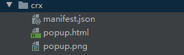

popup.html

```html
<!doctype html>
<html lang="en">
<head>
  <meta charset="UTF-8">
  <meta name="viewport"
        content="width=device-width, user-scalable=no, initial-scale=1.0, maximum-scale=1.0, minimum-scale=1.0">
  <meta http-equiv="X-UA-Compatible" content="ie=edge">
  <title>Document</title>
</head>
<body>
  <h1>Hello Extensions</h1>
</body>
</html>
```

导入后效果：

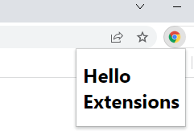

为了用户方便点击，我们还可以在`manifest.json`中设置一个键盘快捷键的命令，通过快捷键来弹出popup页面：

```json
{
  "name": "Hello Extensions",
  "description" : "Base Level Extension",
  "version": "1.0",
  "manifest_version": 2,
  "browser_action": {
    "default_popup": "popup.html",
    "default_icon": "popup.png"
  },
  // 新增命令
  "commands": {
    "_execute_browser_action": {
      "suggested_key": {
        "default": "Ctrl+Shift+F",
        "mac": "MacCtrl+Shift+F"
      },
      "description": "Opens popup.html"
    }
  }
}

```

每次更新文件后，浏览器端需要重新加载下：

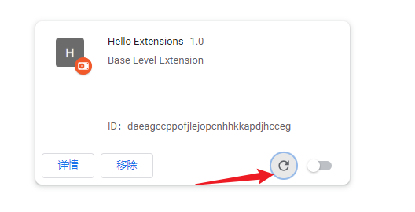

快捷键好像不支持`Alt`：

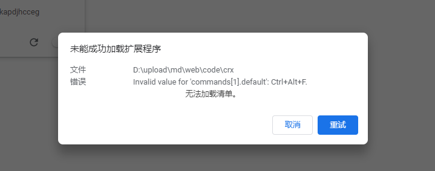

## 后台background

我们的插件安装后，popup页面也运行了；但是我们也发现了，popup页面只能做临时性的交互操作，用完就关了，不能存储信息或者和其他标签页进行交互等等；

这时就需要用到background（后台），它是一个常驻的页面，它的生命周期是插件中所有类型页面中最长的；它随着浏览器的打开而打开，随着浏览器的关闭而关闭，所以通常把需要一直运行的、启动就运行的、全局的代码放在background里面。

background也是需要在`manifest.json`中进行配置，可以通过page指定一张网页，**或者**通过scripts直接指定一个js数组，Chrome会自动为js生成默认网页：

```json
{
  "background": {
    // "page": "background.html",
    "scripts": ["background.js"],
    "persistent": true
  }
}

```

效果如下：

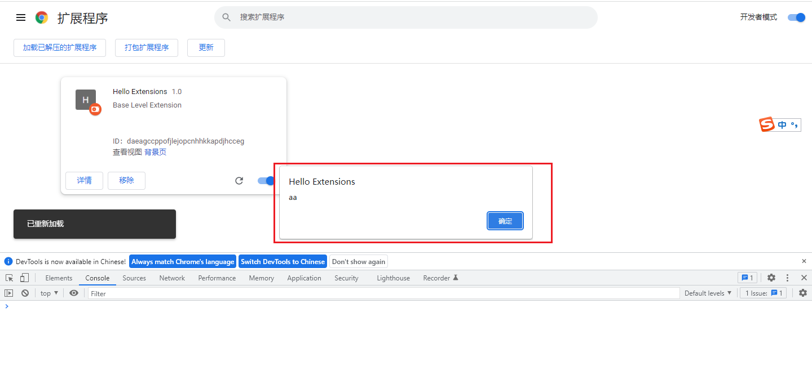

但是控制台，没有在当前页面打印，因为两者不是一个页面。

我们给background设置一个监听事件，当插件安装时打印日志：

background.js

```javascript
// background.js
chrome.runtime.onInstalled.addListener(function () {
  console.log("插件已被安装");
});

```

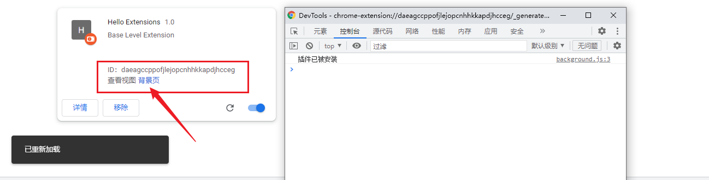


点击后chrome会弹出一个新的，针对background.js页面的控制台


拓展：

- 直接打印chrome对象

  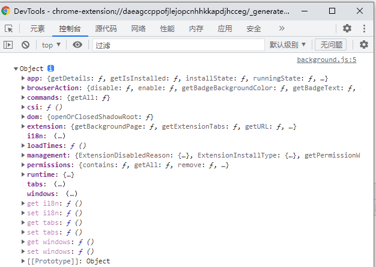

  所调用的方法，都是在chrome对象上的

## storage存储

我们在插件安装时在storage中设置一个值，这将允许多个插件组件访问该值并进行更新操作：

```javascript
//background.js
chrome.runtime.onInstalled.addListener(function () {
  // storage中设置值
  chrome.storage.sync.set({ color: "#3aa757" }, function () {
    console.log("storage init color value");
  });
  // 为特定的网址显示图标
  chrome.declarativeContent.onPageChanged.removeRules(undefined, function () {
    chrome.declarativeContent.onPageChanged.addRules([
      {
        conditions: [
          new chrome.declarativeContent.PageStateMatcher({
            pageUrl: { hostEquals: "baidu.com" },
          }),
        ],
        actions: [new chrome.declarativeContent.ShowPageAction()],
      },
    ]);
  });
});

```

`chrome.declarativeContent`用于精确地控制什么时候显示我们的页面按钮，或者需要在用户单击它之前更改它的外观以匹配当前标签页。

这里调用的`chrome.storage`和我们常用的`localStorage`和`sessionStorage`不是一个东西。

值得注意得是，我们需要在manifest中给插件注册使用的权限，否则chrome对象中，将没有`storage`和`declarativeContent`

```json
{
  // 新增
  "permissions": ["storage", "declarativeContent"],
  "background": {
    "scripts": ["background.js"],
    "persistent": true
  }
}

```

再次查看背景页的视图，我们就能看到打印的日志了；

既然可以存储，那也能取出来，我们在`popup`中添加事件进行获取，首先我们新增一个触发的button：

popup.html

```html
<!doctype html>
<html lang="en">
<head>
  <meta charset="UTF-8">
  <meta name="viewport"
        content="width=device-width, user-scalable=no, initial-scale=1.0, maximum-scale=1.0, minimum-scale=1.0">
  <meta http-equiv="X-UA-Compatible" content="ie=edge">
  <title>Document</title>
  <style>
    button {
      width: 60px;
      height: 30px;
      outline: none;
    }
  </style>
</head>
<body>
  <h1>Hello Extensions</h1>
  <button id="changeColor">change</button>
  <script src="./popup.js"></script>
</body>
</html>
```

我们再创建一个`popup.js`的文件，用来从storage存储中拿到颜色值，并将此颜色作为按钮的背景色：

popup.js

```javascript
let changeColor = document.getElementById("changeColor");

changeColor.onclick = function (el) {
    chrome.storage.sync.get("color", function (data) {
        changeColor.style.backgroundColor = data.color;
    });
};

```

效果：

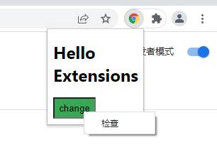

> 如果需要调试popup页面，可以在弹框中右击 => 检查，在DevTools中进行调试查看。


## 获取浏览器tabs

现在，我们获取到了storage中的值，需要逻辑来进一步与用户交互；更新popup.js中的交互代码：

```javascript
// popupjs
changeColor.onclick = function (el) {
  chrome.storage.sync.get("color", function (data) {
    let { color } = data;
    chrome.tabs.query({ active: true, currentWindow: true }, function (tabs) {
      chrome.tabs.executeScript(tabs[0].id, {
        code: 'document.body.style.backgroundColor = "' + color + '";',
      });
    });
  });
};

```

`chrome.tabs`的API主要是和浏览器的标签页进行交互，通过query找到当前的激活中的tab，然后使用`executeScript`向标签页注入脚本内容。

`manifest`同样需要`activeTab`的权限，来允许我们的插件使用tabs的API。

```json
{
  "name": "Hello Extensions",
  // ...
  "permissions": ["storage", "declarativeContent", "activeTab"],
}

```

效果如下：

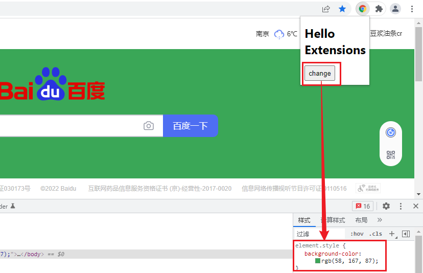


## 颜色选项页面

现在我们的插件功能还比较单一，只能让用户选择唯一的颜色；我们可以在插件中加入选项页面，以便用户更好的自定义插件的功能。

在程序目录新增一个options.html文件：

options.html

```html
<!DOCTYPE html>
<html>
  <head>
    <style>
      button {
        height: 30px;
        width: 30px;
        outline: none;
        margin: 10px;
      }
    </style>
  </head>
  <body>
    <div id="buttonDiv"></div>
    <div>
      <p>选择一个不同的颜色</p>
    </div>
  </body>
  <script src="options.js"></script>
</html>

```

然后添加选择页面的逻辑代码options.js：

```javascript
let page = document.getElementById("buttonDiv");
const kButtonColors = ["#3aa757", "#e8453c", "#f9bb2d", "#4688f1"];
function constructOptions(kButtonColors) {
  for (let item of kButtonColors) {
    let button = document.createElement("button");
    button.style.backgroundColor = item;
    button.addEventListener("click", function () {
      chrome.storage.sync.set({ color: item }, function () {
        console.log("color is " + item);
      });
    });
    page.appendChild(button);
  }
}
constructOptions(kButtonColors);

```

上面代码中预设了四个颜色选项，通过onclick事件监听，生成页面上的按钮；当用户单击按钮时，将更新storage中存储的颜色值。

options页面完成后，我们可以将其在manifest的options_page进行注册：

```json
{
  "name": "Hello Extensions",
  //...
  "options_page": "options.html",
  //...
  "manifest_version": 2
}

```

重新加载我们的插件，点击详情，滚动到底部，点击`扩展程序选项`来查看选项页面。或者可以在浏览器右上角插件图标上`右击 => 选项`。

此时可以选择背景色，效果如下：

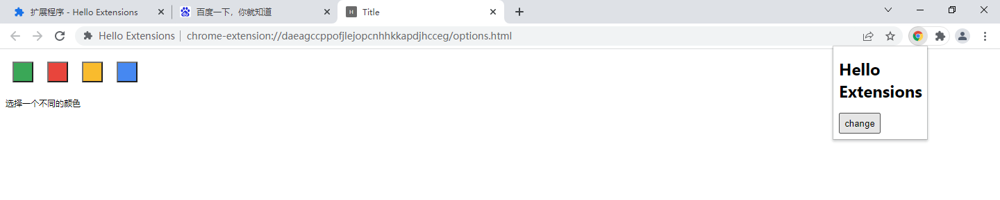

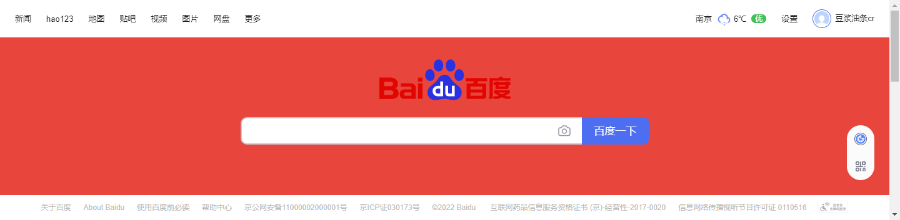


我的理解，options.html提供了一个，可针对插件配置的一个页面

# 插件功能进阶

通过上面一个简单的小插件，相信大家对插件的功能和组件都有了一个大致的了解，知道了每个组件在其中发挥的作用；

但这还只是插件的一小部分功能，下面我们对插件每个部分的功能以及组件做一个更深入的了解。

## 使用background管理事件

background是插件的事件处理程序，它包含对插件很重要的浏览器事件的监听器。

background处于休眠状态，直到触发事件，然后执行指示的逻辑；

一个好的background仅在需要时加载，并在空闲时卸载。


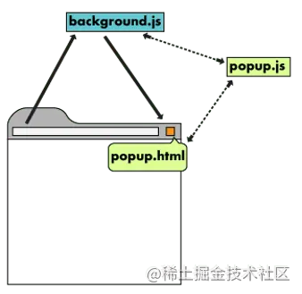

background监听的一些浏览器事件包括：

- 插件程序首次安装或更新为新版本。
- 后台页面正在监听事件，并且已调度该事件
- 内容脚本或其他插件发送消息
- 插件中的另一个视图（例如弹出窗口）调用runtime.getBackgroundPage

加载完成后，只要触发某个事件，background就会保持运行状态；在上面manifest中，我们还指定了一个persistent属性：

```json
{
  "background": {
    "scripts": ["background.js"],
    "persistent": true
  }
}

```

persistent属性定义了插件常驻后台的方式；

当其值为true时，表示插件将一直在后台运行，无论其是否正在工作；

当其值为false时，表示插件在后台按需运行，这就是Chrome后来提出的Event Page（非持久性后台）。

Event Page是基于事件驱动运行的，只有在事件发生的时候才可以访问；

这样做的目的是为了能够有效减小插件对内存的消耗，如非必要，请将persistent设置为false。

> persistent属性的默认值为true

### alarms

一些基于DOM页面的计时器（例如window.setTimeout或window.setInterval），如果在非持久后台休眠时进行了触发，可能不会按照预定的时间运行：

```javascript
let timeout = 1000 * 60 * 3;  // 3 minutes in milliseconds
window.setTimeout(function() {
  alert('Hello, world!');
}, timeout);

```

Chrome提供了另外的API，alarms：

```javascript
chrome.alarms.create({delayInMinutes: 3.0})

chrome.alarms.onAlarm.addListener(function() {
  alert("Hello, world!")
});

```

## browserAction

我们知道了browser_action字段用来配置popup的页面，在其他的一些文档中还给出了page_action字段的配置，不过page_action并不

是所有的页面都能够使用；

不过随着Chrome的版本更新，这两者的功能也越来越相近；在Chrome 48版本之后，page_action也从原来的地址栏中移出来，和插件

放在一起；笔者在配置page_action的时候没有发现有什么比较大的区别，因此下面以browser_action为主。


在browserAction的配置中，我们可以提供多种尺寸的图标，Chrome会选择最接近的图标并将其缩放到适当的大小来填充；如果没有提

供确切的大小，这种缩放会导致图标丢失细节或看起来模糊。

```json
{
  // ...
  "browser_action": {
    "default_icon": {                // optional
      "16": "images/icon16.png",     // optional
      "24": "images/icon24.png",     // optional
      "32": "images/icon32.png"      // optional
    },
    "default_title": "hello popup",  // optional
    "default_popup": "popup.html"    // optional
  },
}

```

也可以通过调用`browserAction.setPopup`动态设置弹出窗口。

```javascript
chrome.browserAction.setPopup({popup: 'popup_new.html'});
```

### Tooltip

要设置提示文案，使用default_title字段，或者在`background.js`中调用`browserAction.setTitle`函数

```javascript
chrome.browserAction.setTitle({ title: "New Tooltip" });

```

如果两者都设置了，以函数设置的显示为准。

### Badge

Badge（徽章）就是在图标上显示的一些文本内容，用来详细显示插件的提示信息；

由于Bage的空间有限，因此最多显示4个英文字符或者2个函数；

badge无法通过配置文件来指定，必须通过代码实现，设置badge文字和颜色可以分别使用`browserAction.setBadgeText()`和

`browserAction.setBadgeBackgroundColor()`：

```javascript
chrome.browserAction.setBadgeText({ text: "new" });
chrome.browserAction.setBadgeBackgroundColor({ color: [255, 0, 0, 255] });
// or 颜色字符串
// chrome.action.setBadgeBackgroundColor({color: '#4688F1'});

```

效果如下：

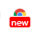


## content-scripts

content-scripts（内容脚本）是在网页上下文中运行的文件。通过使用标准的文档对象模型(DOM)，它能够读取浏览器访问的网页的详细

信息，对其进行更改，并将信息传递给其父级插件。内容脚本相对于background还是有一些访问API上的限制，它可以直接访问以下

chrome的API：

- i18n
- storage
- runtime:
  - connect
  - getManifest
  - getURL
  - id
  - onConnect
  - onMessage
  - sendMessage


内容脚本运行于一个独立、隔离的环境，它不会和`主页面的脚本`或者`其他插件的内容脚本`发生冲突，当然也不能调用其上下文和变量。假

设我们在主页面中定义了变量和函数：

```html
<html lang="en">
  <head>
    <title>Document</title>
  </head>
  <body>
    <script>
      const a = { a: 1, b: "2" };
      const b = { a: 1, b: "2", c: [] };
      function add(a, b){ return a + b };
    </script>
  </body>
</html>

```

由于隔离的机制，在内容脚本中调用add函数会报错：`Uncaught ReferenceError: add is not defined`。

内容脚本分为以代码方式或声明方式注入。

### 代码方式注入

对于需要在特定情况下运行的代码，我们需要使用代码注入的方式；

在上面的popup页面中，我们就是将内容脚本以代码的方式进行注入到页面中：

```javascript
chrome.tabs.executeScript(tabs[0].id, {
  code: 'document.body.style.backgroundColor = "red";',
});

```

或者可以注入整个文件：

```javascript
chrome.tabs.executeScript(tabs[0].id, {
  file: "contentScript.js",
});

```

### 声明式注入

在指定页面上自动运行的内容脚本，我们可使用声明式注入的方式；

以声明方式注入的脚本需注册在manifest文件的content_scripts属性下。它们可以包括JS文件或CSS文件。

```json
{
  "content_scripts": [
    {
      // 必需。指定此内容脚本将被注入到哪些页面。
      "matches": ["https://*.baidu.com/*"],
      "css": ["myStyles.css"],
      "js": ["contentScript.js"]
    }
  ]
}

```

声明式注入除了matches必须外，还可以包含以下字段，来自定义指定页面匹配：

| **Name**        | **Type**   | **Description**                                              |
| --------------- | ---------- | ------------------------------------------------------------ |
| exclude_matches | 字符串数组 | 可选。排除此内容脚本将被注入的页面。                         |
| include_globs   | 字符串数组 | 可选。 在 matches 后应用，以匹配与此 glob 匹配的URL。旨在模拟 @exclude 油猴关键字。 |
| exclude_globs   | 字符串数组 | 可选。 在 matches 后应用，以排除与此 glob 匹配的URL。旨在模拟 @exclude 油猴关键字。 |

声明匹配URL可以使用Glob属性，Glob属性遵循更灵活的语法。

可接受的Glob字符串可能包含“通配符”星号和问号的URL。星号*匹配任意长度的字符串，包括空字符串，而问号？匹配任何单个字符。

```json
{
  "content_scripts": [
    {
      "matches": ["https://*.xieyufei.com/*"],
      "exclude_matches": ["*://*/*business*"],
      "include_globs": ["*xieyufei.com/???s/*"],
      "exclude_globs": ["*science*"],
      "js": ["contentScript.js"]
    }
  ]
}

```

将JS文件注入网页时，还需要控制文件注入的时机，由`run_at`字段控制；

首选的默认字段是`document_idle`，但如果需要，也可以指定为 “document_start” 或“document_end”。

```json
{
  "content_scripts": [
    {
      "matches": ["https://*.xieyufei.com/*"],
      "run_at": "document_idle",
      "js": ["contentScript.js"]
    }
  ]
}

```

三个字段注入的时机区别如下：

| **Name**       | **Type** | **Description**                                              |
| -------------- | -------- | ------------------------------------------------------------ |
| document_idle  | string   | 首选。 尽可能使用 “document_idle”。浏览器选择一个时间在 “document_end” 和window.onload 事件触发后立即注入脚本。 注入的确切时间取决于文档的复杂程度以及加载所需的时间，并且已针对页面加载速度进行了优化。在 “document_idle” 上运行的内容脚本不需要监听 window.onload 事件，因此可以确保它们在 DOM 完成之后运行。如果确实需要在window.onload 之后运行脚本，则扩展可以使用 document.readyState 属性检查 onload 是否已触发。 |
| document_start | string   | 在 css 文件之后，但在构造其他 DOM 或运行其他脚本前注入。     |
| document_end   | string   | 在 DOM 创建完成后，但在加载子资源（例如 images 和 frames ）之前，立即注入脚本。 |

### 消息通信

尽管内容脚本的执行环境和托管它们的页面是相互隔离的，但是它们共享对页面DOM的访问；如果内容脚本想要和插件通信，可以通过

`onMessage`和`sendMessage`

```javascript
// contentScript.js
chrome.runtime.onMessage.addListener(function (message, sender, sendResponse) {
  console.log("content-script收到的消息", message);
  sendResponse("我收到了你的消息！");
});

chrome.runtime.sendMessage(
  { greeting: "我是content-script呀，我主动发消息给后台！" },
  function (response) {
    console.log("收到来自后台的回复：" + response);
  }
);

```

更多消息通信的在后面我们会进行详细的总结。

## contextMenus

`contextMenus`可以自定义浏览器的右键菜单（也有叫上下文菜单的），主要是通过`chrome.contextMenusAPI`实现；在manifest中添加权限来开启菜单权限：

```json
{
  // ...
  "permissions": ["contextMenus"],
  "icons": {
    "16": "contextMenus16.png",
    "48": "contextMenus48.png",
    "128": "contextMenus128.png"
   }
}

```

通过icons字段配置`contextMenus`菜单旁边的图标

我们可以在background中调用`contextMenus.create`来创建菜单，这个操作应该在`runtime.onInstalled`监听回调执行：

```javascript
chrome.contextMenus.create({
  id: "1",
  title: "Test Context Menu",
  contexts: ["all"],
});
//分割线
chrome.contextMenus.create({
  type: "separator",
});
// 父级菜单
chrome.contextMenus.create({
  id: "2",
  title: "Parent Context Menu",
  contexts: ["all"],
});
chrome.contextMenus.create({
  id: "21",
  parentId: "2",
  title: "Child Context Menu1",
  contexts: ["all"],
});
// ...

```

效果如下：

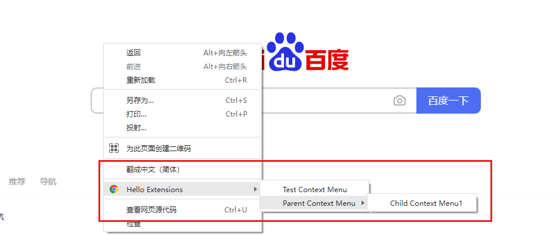


如果我们的插件创建多个右键菜单，则Chrome会自动将其折叠为一个父菜单。

`contextMenus`创建对象的属性可以在附录里面找到；

我们看到在title属性中有一个`%s`的标识符，当`contexts`为`selection`，使用`%s`来表示选中的文字；我们通过这个功能可以实现一个

选中文字调用百度搜索的小功能，效果如下：

（没出来效果，暂时跳过）

`contextMenus`还有一些API可以调用：

```javascript
// 删除某一个菜单项
chrome.contextMenus.remove(menuItemId)；
// 删除所有自定义右键菜单
chrome.contextMenus.removeAll();
// 更新某一个菜单项
chrome.contextMenus.update(menuItemId, updateProperties);
// 监听菜单项点击事件
chrome.contextMenus.onClicked.addListener(function(OnClickData info, tabs.Tab tab) {...});

```

## override

覆盖页面（override）是一种将Chrome默认的特定页面替换为插件程序中的HTML文件。

除了HTML之外，覆盖页面通常还有CSS和JS代码。

插件可以替换以下Chrome的页面。

- 书签管理器

  - 当用户从 Chrome 菜单中选择书签管理器菜单项或在 Mac 上从书签菜单中选择书签管理器项时出现的页面。您也可以通过输入 

    URL chrome://bookmarks来访问此页面。

- 历史记录

  - 当用户从 Chrome 菜单中选择历史记录菜单项或在 Mac 上从历史记录菜单中选择显示完整历史记录项时出现的页面。您也可以

    通过输入URL chrome://history来访问此页面。

- 新标签
  - 当用户创建新标签或窗口时出现的页面。您也可以通过输入 URL chrome://newtab来访问此页面。

需要注意的是：单个插件只能覆盖某一个页面。例如，插件程序不能同时覆盖书签管理器和历史记录页面。


在manifest进行如下配置：

```json
{
  "chrome_url_overrides": {
    "newtab": "newtab.html",
    // "history": "history.html",
    // "bookmarks": "bookmarks.html"
  }
}

```

如果我们覆盖多个特定页面，Chrome加载插件时会直接报错：

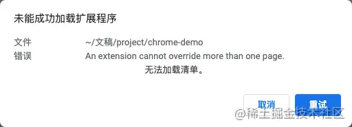

## storage

用户在操作时，会产生一些用户数据，插件需要在本地存储这些数据，在需要调用的时候再拿出来；

Chrome推荐使用`chrome.storage`的API，该API经过优化，提供和localStorage相同的存储功能；不推荐直接存在`localStorage`中，两者主要有以下区别：

- 用户数据使用`chrome.storage`存储可以和Chrome的同步功能自动同步。
- 插件的内容脚本可以直接访问用户数据，而无需background。
- chrome.storage可以直接存储对象，而localStorage是存储字符串，需要再次转换

如果要使用storage的自动同步，我们可以使用`storage.sync`：

```javascript
chrome.storage.sync.set({key: value}, function() {
  console.log('Value is set to ' + value);
});

chrome.storage.sync.get(['key'], function(result) {
  console.log('Value currently is ' + result.key);
});

```

当Chrome离线时，Chrome会将数据存储在本地。

下次浏览器在线时，Chrome会同步数据。即使用户禁用同步，storage.sync仍将工作。

不需要同步的数据可以用`storage.local`进行存储：

```javascript
chrome.storage.local.set({key: value}, function() {
  console.log('Value is set to ' + value);
});

chrome.storage.local.get(['key'], function(result) {
  console.log('Value currently is ' + result.key);
});

```

如果我们想要监听`storage`中的数据变化，可以用`onChanged`添加监听事件；

每当存储中的数据发生变化时，就会触发该事件：

```javascript
// background.js

chrome.storage.onChanged.addListener(function (changes, namespace) {
  for (let [key, { oldValue, newValue }] of Object.entries(changes)) {
    console.log(
      `Storage key "${key}" in namespace "${namespace}" changed.`,
      `Old value was "${oldValue}", new value is "${newValue}".`
    );
  }
});

```

## devtools

用过`Vue`或者`React`的`devtools`的童鞋应该见过这样新增的扩展面板：

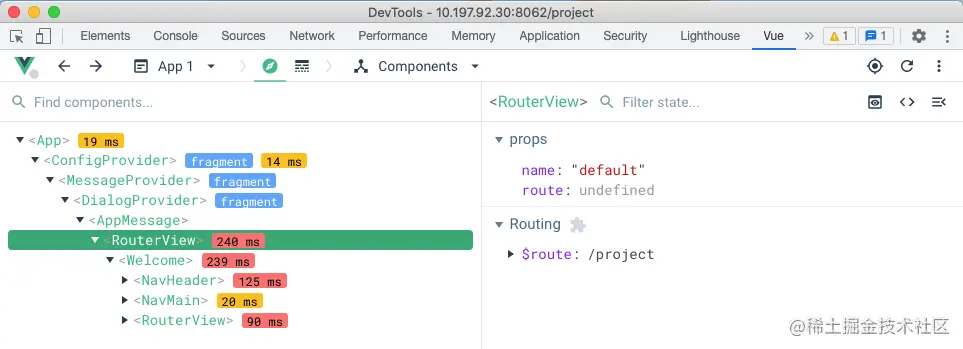

`DevTools`可以为Chrome的`DevTools`添加功能，它可以添加新的UI面板和侧边栏，与检查的页面交互，获取有关网络请求的信息等等；

它可以访问以下特定的API：

- devtools.inspectedWindow
- devtools.network
- devtools.panels

DevTools扩展的结构与任何其他扩展一样：它可以有一个背景页面、内容脚本和其他项目。

此外，每个DevTools扩展都有一个DevTools页面，可以访问DevTools的API。

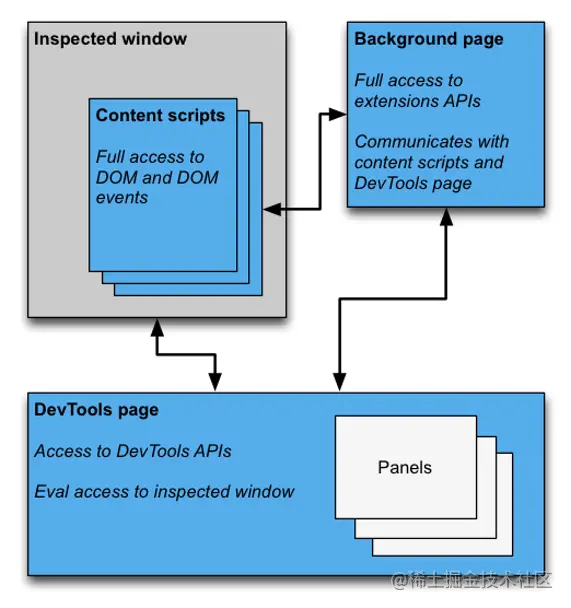

配置devtools不需要权限，只要在manifest中配置一个`devtools.html`：

```json
{
  "devtools_page": "devtools.html",
}

```

devtools.html中只引用了devtools.js，如果写了其他内容也不会展示：

```html
<!DOCTYPE html>
<html lang="en">
  <head> </head>
  <body>
    <script type="text/javascript" src="./devtools.js"></script>
  </body>
</html>

```

新建devtools.js

```javascript
// devtools.js
// 创建扩展面板
chrome.devtools.panels.create(
  // 扩展面板显示名称
  "DevPanel",
  // 扩展面板icon，并不展示
  "panel.png",
  // 扩展面板页面
  "Panel.html",
  function (panel) {
    console.log("自定义面板创建成功！");
  }
);

// 创建自定义侧边栏
chrome.devtools.panels.elements.createSidebarPane(
  "Sidebar",
  function (sidebar) {
    sidebar.setPage("sidebar.html");
  }
);

```

这里调用create创建扩展面板，`createSidebarPane`创建侧边栏，每个扩展面板和侧边栏都是一个单独的HTML页面，其中可以包含其他资源（JavaScript、CSS、图像等）。

### DevPanel

DevPanel面板是一个顶级标签，和Element、Source、Network等是同一级，在一个devtools.js可以创建多个；在`Panel.html`中我们先

设置2个按钮：

Panel.html

```html
<!DOCTYPE html>
<html lang="en">
  <head></head>
  <body>
    <div>dev panel</div>
    <button id="check_jquery">检查jquery</button>
    <button id="get_all_resources">获取所有资源</button>
    <script src="panel.js"></script>
  </body>
</html>

```

`panel.js`中我们使用`devtools.inspectedWindow`的`API`来和被检查窗口进行交互：

```javascript
// panel.js
document.getElementById("check_jquery").addEventListener("click", function () {
  chrome.devtools.inspectedWindow.eval(
    "jQuery.fn.jquery",
    function (result, isException) {
      if (isException) {
        console.log("the page is not using jQuery");
      } else {
        console.log("The page is using jQuery v" + result);
      }
    }
  );
});

document
  .getElementById("get_all_resources")
  .addEventListener("click", function () {
    chrome.devtools.inspectedWindow.getResources(function (resources) {
      console.log(resources);
    });
  });

```

`eval`函数为插件提供了在被检查页面的上下文中执行JS代码的能力，而`getResources`获取页面上所有加载的资源；

我们找到一个页面，然后右击检查打开调试工具，发现在最右侧多了一个`DevPanel`的tab页，

效果如下：

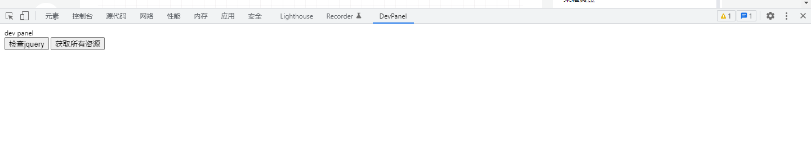

点击我们的调试按钮，那么日志在哪里能看到呢？

我们在调试工具上右击检查，再开一个调试工具，这个就是调试工具的调试工具。

最终两个调试工具的效果如下：

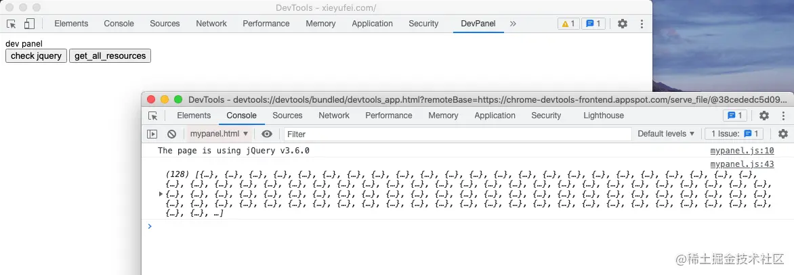


（实操中，在panel面板中，右击时并没有出来检查菜单栏）

### Sidebar

回到`devtools.js`，我们使用`createSidebarPane`创建了侧边栏面板，并且设置为`sidebar.html`，最终呈现在`Element`面板的最右侧：

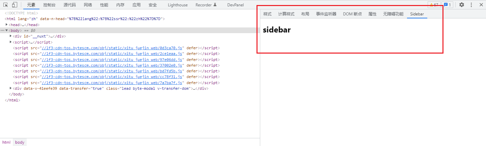

有几种方法可以在侧边栏中显示内容：

- HTML内容。调用setPage以指定要在窗格中显示的 HTML 页面。
- JSON数据。将JSON对象传递给setObject.
- JavaScript表达式。将表达式传递给setExpression

通过JS表达式，我们可以很方便进行页面查询，比如，查询页面上所有的img元素：

```javascript
chrome.devtools.panels.elements.createSidebarPane(
  "All Images",
  function (sidebar) {
    sidebar.setExpression('document.querySelectorAll("img")', "All Images");
  }
);
```

效果如下：

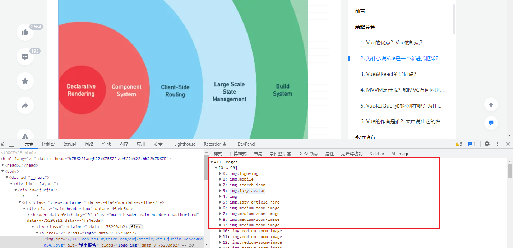

另外，我们可以通过`elements.onSelectionChanged`监听事件，在Element面板选中元素更改后，更新侧边栏面板的状态；

例如，可以将我们关心的一些元素的样式进行实时展示在侧边面板，方便查看：

```javascript
var page_getProperties = function () {
  if ($0 instanceof HTMLElement) {
    return {
      tag: $0.tagName.toLocaleLowerCase(),
      class: $0.classList,
      width: window.getComputedStyle($0)["width"],
      height: window.getComputedStyle($0)["height"],
      margin: window.getComputedStyle($0)["margin"],
      padding: window.getComputedStyle($0)["padding"],
      color: window.getComputedStyle($0)["color"],
      fontSize: window.getComputedStyle($0)["fontSize"],
    };
  } else {
    return {};
  }
};

chrome.devtools.panels.elements.createSidebarPane(
  "Select Element",
  function (sidebar) {
    function updateElementProperties() {
      sidebar.setExpression(
        "(" + page_getProperties.toString() + ")()",
        "select element"
      );
    }
    updateElementProperties();
    chrome.devtools.panels.elements.onSelectionChanged.addListener(
      updateElementProperties
    );
  }
);

```

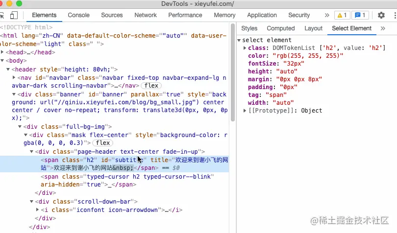


备注：浏览器自带的devtools已经有这样的功能了


## notifications

Chrome提供`chrome.notifications`的API来推送桌面通知；同样也需要现在`manifest`中注册权限：

```json
{
  "permissions": [
    "notifications"
  ],
}

```

在background调用创建即可

```javascript
// background.js
chrome.notifications.create(null, {
  type: "basic",
  iconUrl: "drink.png",
  title: "喝水小助手",
  message: "看到此消息的人可以和我一起来喝一杯水",
});

```

## webRequest

通过`webRequest`的`API`可以对浏览器发出的任何HTTP请求进行拦截、组织或者修改；

可以拦截的请求还包括脚本、样式的GET请求以及图片的链接；

我们也需要在manifest中配置权限才能使用API：

```json
{
  //...
  "permissions": [
    "webRequest",
    "webRequestBlocking",
    "*://*.xieyufei.com/"
  ],
}

```

权限中还需要声明拦截请求的URL，如果你想拦截所有的URL，可以使用`*://*/*`（不过不推荐这么做，数据会非常多），如果我们想以

阻塞方式使用Web请求API，则需要用到`webRequestBlocking`权限。

比如我们可以对拦截的请求进行取消：

```javascript
chrome.webRequest.onBeforeRequest.addListener(
  function (detail) {
    return {cancel: details.url.indexOf("example.com") != -1};;
  },
  { urls: ["<all_urls>"] },
  ["blocking"]
);

```

# 组件消息通信

不同组件之间经常需要进行消息通信来进行数据的传递，我们来看下他们之间是如何进行通信的：

## background和popup通信

`background`和`popup`之间的通信比较简单，在`popup`中，我们可以通过`extension.getBackgroundPage`直接获取到`background`对

象，直接调用对象上的方法即可：

```javascript
// popup.js
var bg = chrome.extension.getBackgroundPage();
bg.someMethods()

```

而`background`访问`popup`上则通过`extension.getViews`来访问，不过前提是`popup`弹框已经展示，否则获取到的`views`是空数组：

```javascript
//background.js
var views = chrome.extension.getViews({type:'popup'});
if(views.length > 0) {
  // 相当于popup的windows对象
	console.log(views[0].location.href);
}

```

## background和内容脚本通信

在`background`和`内容脚本`通信，我们可以使用简单直接的`runtime.sendMessage`或者`tabs.sendMessage`发送消息，消息内容可以是

JSON数据

从内容脚本发送消息如下：

```javascript
// content-script.js
chrome.runtime.sendMessage(
  { greeting: "hello，我是content-script，主动发消息给后台！" },
  function (response) {
    console.log("收到来自后台的回复：" + response);
  }
);

```

而从后台发送消息到内容脚本时，由于有多个标签页，我们需要指定发送到某个标签页：

```javascript
// background.js
chrome.tabs.query({ active: true, currentWindow: true }, function (tabs) {
  chrome.tabs.sendMessage(
    tabs[0].id,
    { greeting: "hello，我是后台，主动发消息给content-script" },
    function (response) {
      console.log(response.farewell);
    }
  );
});

```

而不管是在后台，还是在内容脚本中，我们都使用`runtime.onMessage`监听消息的接收事件，不同的是回调函数中的`sender`，标识不同的发送方：

```javascript
chrome.runtime.onMessage.addListener(
  function(request, sender, sendResponse) {
    console.log(sender.tab ?
      "from a content script:" + sender.tab.url :
      "from the extension");
    if (request.greeting.indexOf("hello") !== -1){
      sendResponse({farewell: "goodbye"});
    }
  });

```

## 长链接

上面的`runtime.sendMessage`和`tabs.sendMessage`都属于短链接，所谓的短连接，就是类似于`HTTP`请求，如果接收方不在线，就会

出现请求失败的情况；但有些情况下，需要持续对话，这时候就需要用到长链接，类似于`websocket`，可以在通信双方之间进行持久链

接。

长链接使用`runtime.connect`或`tabs.connect`来打开长生命周期通道，通道可以有一个名称，以便区分不同类型的连接。

```javascript
// content-script.js
// 设置通道名称
var port = chrome.runtime.connect({name: "knockknock"});
port.postMessage({joke: "Knock knock"});
port.onMessage.addListener(function(msg) {
  if (msg.question == "Who's there?")
    port.postMessage({answer: "Madame"});
  else if (msg.question == "Madame who?")
    port.postMessage({answer: "Madame... Bovary"});
});

```

从background向内容脚本发送消息也类似，不同之处在于需要指定连接的tab页，将`runtime.connect`改为`tabs.connect`。

　　在接收端，我们需要设置`onConnect`的事件监听器，当发送端调用`connect`进行连接时触发该事件，以及通过连接发送和接收消息的`port`对象：

```javascript
//background.js
chrome.runtime.onConnect.addListener(function(port) {
  console.assert(port.name == "knockknock");
  port.onMessage.addListener(function(msg) {
    if (msg.joke == "Knock knock")
      port.postMessage({question: "Who's there?"});
    else if (msg.answer == "Madame")
      port.postMessage({question: "Madame who?"});
    else if (msg.answer == "Madame... Bovary")
      port.postMessage({question: "I don't get it."});
  });
});

```


