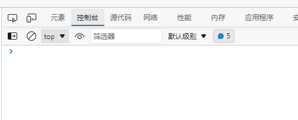
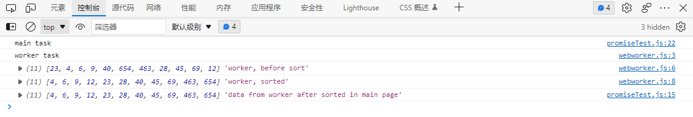

# JavaScript高级程序设计（第3版）

### JS简介

- JS简史

- JS实现

  - ECMAScript

  - DOM

    通过 DOM 创建的这个表示文档的树形图，开发人员获得了控制页面内容和结构的主动权。借助DOM 提供的 API，开发人员可以轻松自如地删除、添加、替换或修改任何节点。

    请读者注意，DOM 并不只是针对 JavaScript 的，很多别的语言也都实现了 DOM。

    不过，在 Web 浏览器中，基于 ECMAScript 实现的 DOM 的确已经成为 JavaScript 这门语言的一个重要组成部分。

  - BOM

    开发人员使用 BOM 可以控制浏览器显示的页面以外的部分。

- 小结

  - JavaScript 是一种专为与网页交互而设计的脚本语言，由下列三个不同的部分组成：

    - ECMAScript，由 ECMA-262 定义，提供核心语言功能；
    - 文档对象模型（DOM），提供访问和操作网页内容的方法和接口；
    - 浏览器对象模型（BOM），提供与浏览器交互的方法和接口。

## 第25章 新兴的API

### 25.6 Web Worker

#### 25.6.1 使用worker

index.html

```html
<!DOCTYPE html>
<html lang="en">
<head>
    <meta charset="UTF-8">
    <meta http-equiv="X-UA-Compatible" content="IE=edge">
    <meta name="viewport" content="width=device-width, initial-scale=1.0">
    <title>Document</title>
</head>
<body>
    <script src="./promiseTest.js"></script>
</body>
</html>
```

promiseTest.js

```javascript
// webworker Testcode

var worker = new Worker('webworker.js')
worker.postMessage({
	type: "command",
	message: "start！"
})
worker.onmessage = function(event) {
	var data = event.data
	console.log(data)
}
worker.onerror = function(event) {
	console.log("ERROR: " + event.filename + " ( " + event.lineno + " ) " + event.message)
}

console.log('main task')
// worker.terminate()
```

webworker.js

```javascript
setTimeout(function() {
	console.log('worker task')
}, 2000);
```

效果：main task先被打印出来，两秒后，worker task再被打印出来，main task不会被阻塞




#### 25.6.2 Worker全局作用域

promiseTest.js

```javascript
// webworker Testcode

// main page data
var data = [23,4,6,9,40,654,463,28,45,69,12],
// worker object
	worker = new Worker('./webworker.js')

// send data to worker object by postMessage event handler
worker.postMessage(data)

// main page's worker object which has onmessage event handler to deal data which form worker object
worker.onmessage = function(event) {
	var data = event.data
	// operate sorted data
	console.log(data, 'data from worker after sorted in main page')
}

worker.onerror = function(event) {
	console.log("ERROR: " + event.filename + " (line " + event.lineno + " ) " + event.message)
}

console.log('main task')
// worker.terminate()
```

webworker.js

```javascript

// onmessage event handler
console.log('worker task')
self.onmessage = function(event) {
	var data = event.data
	console.log(data, 'worker, before sort')
	data.sort((a, b) => a - b)
	console.log(data, 'worker, sorted')
	// worker task done, return data to main page by postMessage
	self.postMessage(data)
}

// self.close()
```

效果：



#### 25.6.3 包含其他脚本

```javascript
//Web Worker 内部的代码
importScripts("file1.js", "file2.js");
```

#### 25.6.4 Web Workers的未来

本节所讨论的 Worker 目前被称为“专用 Worker” （dedicated worker），因为它们是专门为某个特定的页面服务的，不能在页面间共享。该规范的另外一个
概念是“共享 Worker”（shared worker），这种 Worker 可以在浏览器的多个标签中打开的同一个页面间共享。


书籍外拓展：[Web Workers API - Web API 接口参考 | MDN (mozilla.org)](https://developer.mozilla.org/zh-CN/docs/Web/API/Web_Workers_API)

## prototype

首次出现：5.5.3

## 引用数据类型

[JS的基本数据类型和引用数据类型 - 掘金 (juejin.cn)](https://juejin.cn/post/6992460438902423589)


堆、栈：[「前端进阶」JS中的栈内存堆内存 - 掘金 (juejin.cn)](https://juejin.cn/post/6844903873992196110)


# JavaScript DOM编程艺术

## JS简史


## JS语法

