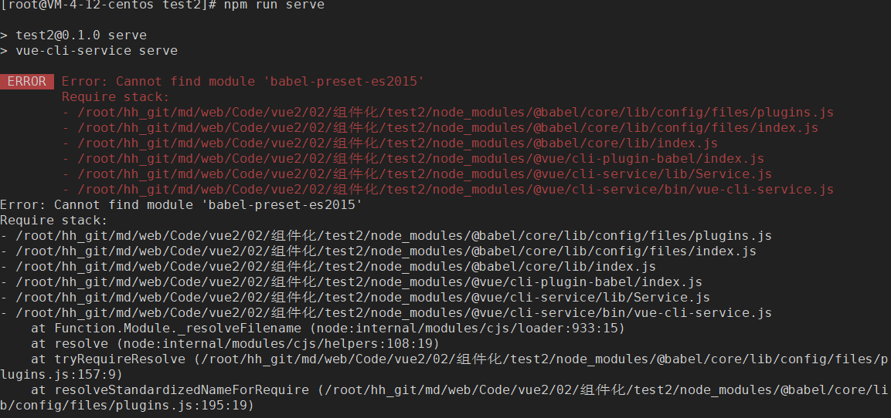
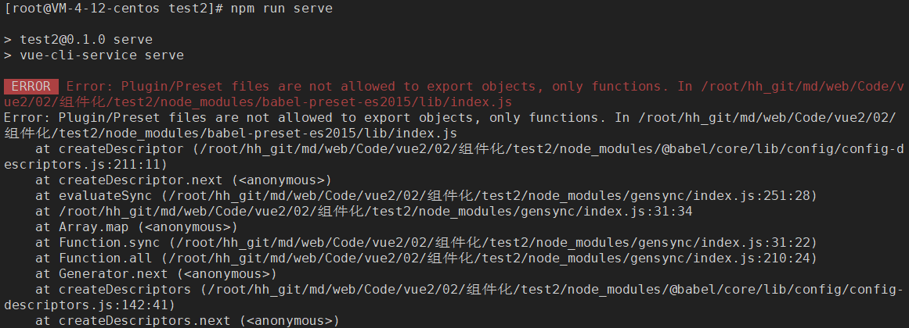
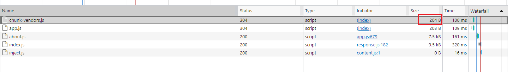
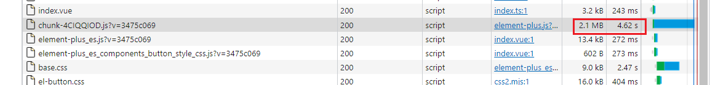
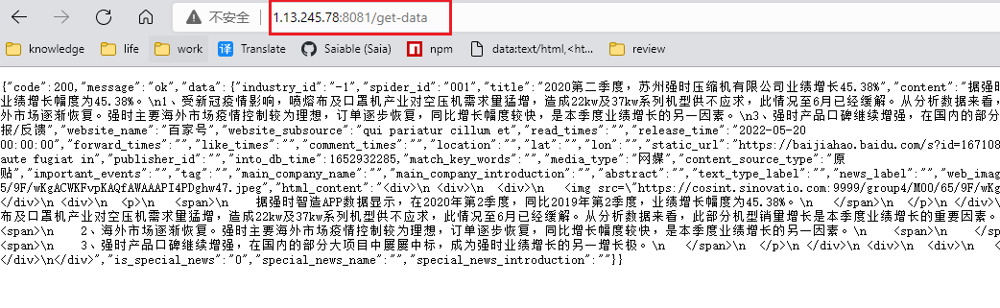
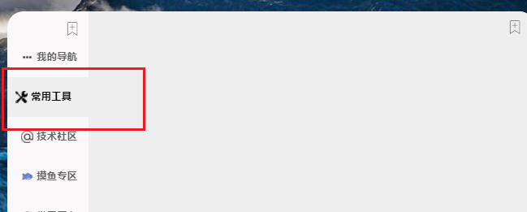
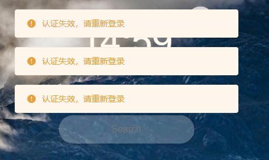
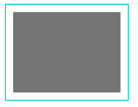
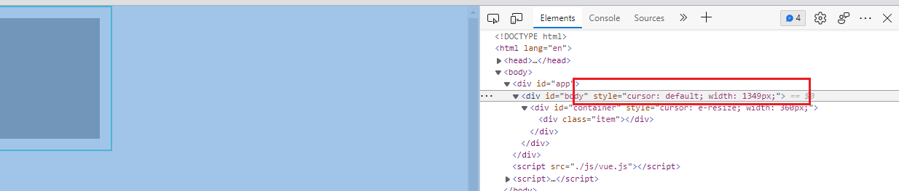
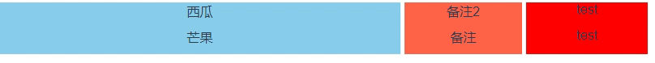

# 工程化开发基本流程


## `vite`安装与使用

安装`vite`

`vite`依赖的`node`版本 `>=` 12.0.0

打开终端，查看`npm`版本：`npm -v`

`npm`版本在`6.x`及以下使用如下命令

- `aribnb-ssr`表示项目名称

- `template`表示预设模板（技术栈）

```bash
npm init vite@latest airbnb-ssr --template vue-ts
```

`npm`版本在`7`及`7+`使用如下命令

```bash
npm init vite@latest airbnb-ssr -- --template vue-ts
```

切换到文件夹下，安装依赖

```bash
cd airbnb-ssr
npm i -D
```

### `vite`构建基本配置

由于是在`linux`环境下，运行启动命令前，改下`package.json`的配置

```json
    "dev": "vite --host 0.0.0.0 --port 8081", // 指定ip和开放的端口号
```

`vite`和`webapck`的不同：

- 没有`vendor`文件，利用的是浏览器原生的`esModule`


### 配置`@`别名

`vite.config.ts`

```tsx
import { defineConfig } from 'vite'
import vue from '@vitejs/plugin-vue'
import path from 'path'
// https://vitejs.dev/config/
export default defineConfig({
  plugins: [vue()],
  resolve: {
    // 配置路径别名
    alias: {
      '@': path.resolve(__dirname, './src'),
    },
  },
})

```

`tsconfig.json`

```json
{
  "compilerOptions": {
      
    "baseUrl": ".",
    "paths": {
      "@/*": [
        "src/*"
      ]
    }
      
  },
```

### 目录结构解析

相比较于常规`vue2`目录，`index.html`抽离出来了，`<scipt>`标签上多了`type="module"`属性，使用了`main.ts`作为项目的入口文件

## 安装`less-loader`

- 此时自己下载的`vue-cli`，用到`webpack`的版本为`5`版本（`node_modules`文件夹找`webapck`文件夹，查看`package.json`文件），这个时候装`less-loader`是没有问题的，因为默认安装的是最新版的`less-loader`，新版本是为了迎合`webpakc5`

- 如果`vue-cli`用的`webpack`为`4`版本，则要`less-loader`版本降级以兼容`webpack4`

  - 查看所有版本：`npm view less-loader versions`
  - 试一下不那么新的版本：`npm i less-loader@7.0.0 -D` 
    - `8`及以上的版本就是为`webpack4`服务的了

- 使用

  ```less
  <style lang="less" scoped>
  .outer {
      .inner {
          
      }
  }
  </style>
  ```

## 安装`vue-router`

### 安装

```bash
npm i vue-router@next -D
```

安装的是`4.0.13`版本

### 引入

新建`router`目录，并新建`router.ts`

`router.ts`

```ts
import home from '@/views/home/index.vue';
import mine from '@/views/mine/index.vue';
import {createRouter, createMemoryHistory, createWebHistory, createWebHashHistory} from 'vue-router';
const routes = [
    {
        path: '/home',
        name: 'home',
        component: home,
        meta: {
            title: '',
            keepAlive: false
        }
    },
    {
        path: '/mine',
        name: 'mine',
        component: mine,
        meta: {
            title: '',
            keepAlive: false
        }
    }
]

const router = createRouter({
    history: createWebHistory(),
    routes
})

export default router
```

`main.ts`中使用`vue-router`插件

```ts
import { createApp } from 'vue'
import App from './App.vue'
import router from './router'

const app = createApp(App)
app.use(router)
app.mount('#app')

```

### 使用

组件中使用`router`

`App.vue`

```vue
<script setup lang="ts">
import {useRouter} from 'vue-router'
const router = useRouter()
</script>

<template>

  <button @click="() => router.push({path: '/home'})">首页</button>
  <button @click="() => router.push({path: '/mine'})">个人中心</button>
  <router-view/>
</template>

<style>

</style>

```

`@/views/home/index.vue`

```vue
<script setup lang="ts">
import {useRouter,useRoute} from 'vue-router'
const router = useRouter()
const route = useRoute()
console.log(route.params)
</script>

<template>
  首页
  <button @click="() => router.push({path: '/mine', query: {id: 1}})">跳转到个人中心</button>

</template>

<style>

</style>

```

`@/views/mine/index.vue`

```vue
<script setup lang="ts">
import {useRouter, useRoute} from 'vue-router'
const router = useRouter()
const route = useRoute()

console.log(route.query)
</script>

<template>
  个人中心
  <button @click="() => router.push({name: 'home', params: {id: 2}})">回到首页</button>

</template>

<style>

</style>

```

## 安装`element-ui`

### 安装

官网：https://element.eleme.io/#/zh-CN/component/installation

```bash
npm i element-ui -D
```

当前项目是基于`vue-cli5`安装的`vue2`的项目，提示`core-js`版本过低

```
npm WARN deprecated core-js@2.6.12: core-js@<3.4 is no longer maintained and not recommended for usage due to the number of issues. Because of the V8 engine whims, feature detection in old core-js versions could cause a slowdown up to 100x even if nothing is polyfilled. Please, upgrade your dependencies to the actual version of core-js.

```

但实际上`package.json`中的`core-js`版本是`3.8.3`，可能是`element-ui`中用到的版本吧，暂时跳过这一问题

### 引入

#### 全量引入（不推荐）

`main.js`

```js
import Vue from 'vue'
import App from './App.vue'
import router from './router'
import store from './store'

import ElementUI from 'element-ui'; // 引入element组件库
import 'element-ui/lib/theme-chalk/index.css'; // 引入element全部样式

Vue.config.productionTip = false

Vue.use(ElementUI); // 应用element

new Vue({
  router,
  store,
  render: h => h(App)
}).$mount('#app')

```

#### 按需引入

借助 `babel-plugin-component`，我们可以只引入需要的组件，以达到减小项目体积的目的。

`main.js`

```bash
npm install babel-plugin-component -D
```

然后，将 `.babelrc` 修改为：

```js
{
  "presets": [["es2015", { "modules": false }]],
  "plugins": [
    [
      "component",
      {
        "libraryName": "element-ui",
        "styleLibraryName": "theme-chalk"
      }
    ]
  ]
}
```

如果没有`.babelrc`，应该有`babel.config.js`

原来的内容

```js
module.exports = {
  presets: [
    '@vue/cli-plugin-babel/preset'
  ]
}
```

修改如下：

```js
module.exports = {
  presets: [
    '@vue/cli-plugin-babel/preset',
    ["es2015", { "modules": false }]
  ],
  plugins: [ // 这里是js文件，去掉key的引号
    [
      "component",
      {
        "libraryName": "element-ui",
        "styleLibraryName": "theme-chalk"
      }
    ]
  ]
}

```

### 使用

#### 全量引入使用

直接使用

看文档上哪个适合用的，复制然后改吧改吧

```vue
<el-row>
  <el-button>默认按钮</el-button>
  <el-button type="primary">主要按钮</el-button>
  <el-button type="success">成功按钮</el-button>
  <el-button type="info">信息按钮</el-button>
  <el-button type="warning">警告按钮</el-button>
  <el-button type="danger">危险按钮</el-button>
</el-row>
```

#### 按需引入使用

接下来，如果你只希望引入部分组件，那么需要在 `main.js` 中写入以下内容：

```js
import Vue from 'vue'
import App from './App.vue'
import router from './router'
import store from './store'


import { Button, Row } from 'element-ui'; // 注意引入的时候，是没有`el`的，然后第一个字母大写

Vue.config.productionTip = false

Vue.component(Button.name, Button);  // 第一个参数，就是自定义的一个名称
Vue.component(Row.name, Row);
// 那么样式怎么把控呢？
// element会根据引入的组件库，自己分析依赖的样式
// Vue.use(Button)

new Vue({
  router,
  store,
  render: h => h(App)
}).$mount('#app')

```

值得注意的是，组件库的配置和脚手架的配置要合并起来的，如果脚手架更新了，但组件库的配置写法没更新，就会有问题

很明显的一个例子就是，`.babelrc`文件都换成了`babel.config.js`

如上写法，会提示如下错误：



按照提示，安装下对应的包

```bash
npm i babel-preset-es2015 -D
```

虽然安装成功了，但人家`babel-preset-es2015`更新改名了

```bash
[root@VM-4-12-centos test2]# npm i babel-preset-es2015 -D
npm WARN deprecated babel-preset-es2015@6.24.1: 🙌  Thanks for using Babel: we recommend using babel-preset-env now: please read https://babeljs.io/env to update!

```

再重新启动下项目，报如下错误



由于人家`es2015`改名了，所以配置文件得修改：

```js
module.exports = {
  presets: [
    '@vue/cli-plugin-babel/preset',
    ["@babel/preset-env", { "modules": false }] // 更正一下包名
  ],
  plugins: [
    [
      "component",
      {
        "libraryName": "element-ui",
        "styleLibraryName": "theme-chalk"
      }
    ]
  ]
}

```

造成这些问题的原因在于，`element`没有及时更新

如果不说怎么改，要真想解决这个问题，需要研究下`babel-plugin-component`文档，看看目前针对最新的脚手架，它的配置是怎么样的

按需引入后的资源大小



## 安装`element-plus`

### 安装

```bash
npm i element-plus -D
```

### 引入

按需引入

先下载依赖，实现自动导入

```bash
npm i -D unplugin-vue-components unplugin-auto-import
```

在`vite.config.ts`中新增配置

```ts
import { defineConfig } from 'vite'
import vue from '@vitejs/plugin-vue'
import path from 'path'
// 新增
import AutoImport from 'unplugin-auto-import/vite'
import Components from 'unplugin-vue-components/vite'
import {ElementPlusResolver} from 'unplugin-vue-components/resolvers'

export default defineConfig({
  plugins: [
      vue(),
      // 新增
      AutoImport({
        resolvers: [ElementPlusResolver()]
      }),
      Components({
        resolvers: [ElementPlusResolver()]
      })
  ],
  resolve: {
    alias: {
      '@': path.resolve(__dirname, './src'),
    },
  },
})

```

在入口文件中导入，并挂载

```ts
import { createApp } from 'vue'
import App from './App.vue'
import router from './router'
import ElementPlus from 'element-plus'
import 'element-plus/dist/index.css'

const app = createApp(App)
app.use(router)
app.use(ElementPlus)
app.mount('#app')

```

### 使用

`home/index.vue`

```vue
<script setup lang="ts">
import {useRouter,useRoute} from 'vue-router'
const router = useRouter()
const route = useRoute()
console.log(route.params)
</script>

<template>
  首页
  <button @click="() => router.push({path: '/mine', query: {id: 1}})">跳转到个人中心</button>
  <el-button type="primary">Primary</el-button>
</template>

<style>

</style>

```

可以看到，后台只引入了`button`相关的样式


前台：

- `eleme-plus`是主包
- `base.css`是基本样式文件
- `el-button`是按钮相关样式


可以看到，`UI`库占用的体积很小，这个就是按需加载的好处

我们再引入一下消息提示的组件

```vue
<script setup lang="ts">
import {useRouter,useRoute} from 'vue-router'
import { h } from 'vue'
import { ElMessage } from 'element-plus'

const router = useRouter()
const route = useRoute()
console.log(route.params)

const openVn = () => {
  ElMessage({
    message: h('p', null, [
      h('span', null, 'Message can be '),
      h('i', { style: 'color: teal' }, 'VNode'),
    ]),
  })
}
</script>

<template>
  首页
  <button @click="() => router.push({path: '/mine', query: {id: 1}})">跳转到个人中心</button>
  <el-button type="primary">Primary</el-button>
  <el-button :plain="true" @click="openVn">VNode</el-button>
</template>

<style>

</style>

```

相比较于`button`，消息提示框的组件，我们全局可能都会用到，可以在全局引入

使用`vm`实例上的`config.globalProperty.XXX = YYY`来配置全局属性

`main.ts`

```ts
import { createApp } from 'vue'
import App from './App.vue'
import router from './router'
import ElementPlus, {ElMessage} from 'element-plus'
import 'element-plus/dist/index.css'

const app = createApp(App)
app.config.globalProperties.$message = ElMessage// 新增
app.use(router)
app.use(ElementPlus)
app.mount('#app')

```

在组件中，使用`vue`的上下文来使用`$message`

```vue
<script setup lang="ts">
import {useRouter,useRoute} from 'vue-router'
import { h, getCurrentInstance} from 'vue'

const router = useRouter()
const route = useRoute()
console.log(route.params)

const {proxy}:any = getCurrentInstance() // vue3中没有this，获取上下文
const openVn = () => {
  proxy.$message({
    message: h('p', null, [
      h('span', null, 'Message can be '),
      h('i', { style: 'color: teal' }, 'VNode'),
    ]),
  })
}
</script>

<template>
  首页
  <button @click="() => router.push({path: '/mine', query: {id: 1}})">跳转到个人中心</button>
  <el-button type="primary">Primary</el-button>
  <el-button :plain="true" @click="openVn">VNode</el-button>
</template>

<style>

</style>

```

### 吐槽

为啥还会有个`element-plus`的`chunk`文件，`2M`多！！




## 安装`eslint`

### 安装

```bash
npm i eslint -D
```

安装完之后，执行一下`eslint`

`npx eslint --init`或`npm init @eslint/config`

- 备注：`npm5.2`之后，内置了`npx`包，可以直接运行了（找自己的`node_modules`）

```bash
[root@VM-4-12-centos airbnb-ssr]# npm init @eslint/config
Need to install the following packages:
  @eslint/create-config
Ok to proceed? (y) y
✔ How would you like to use ESLint? · style
✔ What type of modules does your project use? · esm
✔ Which framework does your project use? · vue
✔ Does your project use TypeScript? · No / Yes
✔ Where does your code run? · browser, node
✔ How would you like to define a style for your project? · guide
✔ Which style guide do you want to follow? · standard
✔ What format do you want your config file to be in? · JavaScript
Checking peerDependencies of eslint-config-standard@latest
The config that you've selected requires the following dependencies:

eslint-plugin-vue@latest @typescript-eslint/eslint-plugin@latest eslint-config-standard@latest eslint@^8.0.1 eslint-plugin-import@^2.25.2 eslint-plugin-n@^15.0.0 eslint-plugin-promise@^6.0.0 @typescript-eslint/parser@latest
✔ Would you like to install them now? · No / Yes
✔ Which package manager do you want to use? · npm
Installing eslint-plugin-vue@latest, @typescript-eslint/eslint-plugin@latest, eslint-config-standard@latest, eslint@^8.0.1, eslint-plugin-import@^2.25.2, eslint-plugin-n@^15.0.0, eslint-plugin-promise@^6.0.0, @typescript-eslint/parser@latest

added 96 packages, and audited 291 packages in 19s

82 packages are looking for funding
  run `npm fund` for details

found 0 vulnerabilities
Successfully created .eslintrc.js file in /root/hh_git/vue-project/airbnb-ssr

```

安装完毕后，会根据我们的选择，生成`.eslintrc.js`配置文件

```js
module.exports = {
  env: {
    browser: true,
    es2021: true,
    node: true
  },
  extends: [
    // 'plugin:vue/essential',
    // 我们的项目是基于vue3的，改成vue3/essential，可以看下eslint官网，关于vue3的配置推荐
    'plugin:vue3/essential',
    'standard' // 使用单引号
  ],
  parserOptions: {
    ecmaVersion: 'latest',
    parser: '@typescript-eslint/parser',
    sourceType: 'module'
  },
  plugins: [
    'vue',
    '@typescript-eslint'
  ],
  rules: {
      // 自定义规则
  }
}

```

### 使用

如果是在本地开发

- 我们导入了未使用的组件，则会出现错误提示
- 统一变量定义等

自定义规则：

- 函数名和括号间不想强制加空格

```js
  rules: {
      // 自定义规则
      'space-before-function-paren': 0
  }
```

搭配`vscode`插件：`eslint`使用更佳

如果`eslint`未生效，就要检查`vscode`之前有没有安装过类似的格式化工具、自动美化的一些插件


如果是在`linux`远程开发，暂时没办法

## 安装`Saas`


## 创建react项目


## 创建小程序项目


## `mock`流程

### 最方便的

使用`json-server`，见`ajax`的文章

### 简单`mock`

以`vue`为例，`src`目录下新建`mock`文件夹

文件夹结构如下：

```
mock
|----data
|----index.js
```

安装`express`：`npm i express -D`

`data`可以放一些假的返回数据，之后在`index.js`中定义接口并返回数据

`index.js`

```js
const express = require('express')
const app = express()
const url = require('url')
const getdata = require('./data/spider/getdata.json')

app.get('/get-data',(req, res) => {
    res.send(getdata) 
})

app.listen(8081, () => {
    console.log('8081在运行')
})
```

然后使用`node`运行：`node index.js`

如果配置的端口是可以访问外网的话，输入`ip+接口路径`，即可正常返回数据：



在后台接口还没有或不便于调试时，可以先用本地数据来开发，只要返回的数据格式一致即可

### 稍微复杂点的`mock`

`mockjs`基本使用

```
npm i mockjs -D
```

创建`src/mock`文件夹，新建相应的`json`文件以及入口文件`mockServer.js`

```js
import Mock from 'mockjs'
import banner from './banner.json'

Mock.mock("/mock/banner",{code: 200, message: "0k", data: banner})
```

`main.js`中引入

```js
import '@/mock/mockServer.js'
```

对于`mock`的请求地址，使用`axios`时，要新建个`axios`封装的文件（之前的是`request.js`，现在复制一下改个名）

https://blog.csdn.net/weixin_46670795/article/details/109129987

```js
//使用axios发送  ajax
cnpm install axios --save
//使用mockjs产生随机数据
cnpm install mockjs --save-dev
//使用json5解决json文件,无法添加注释问题
cnpm install json5 --save-dev

```


## 文件服务器搭建流程

https://www.jianshu.com/p/2b3b03368249

```bash
npm i express cors multer
```


```js
const express = require('express')
const app = express()
const cors = require('cors')
const multer = require('multer')
const fs = require('fs')
const path = require('path')

// multer插件配置：
//注册一个对象，dest里放的是上传的文件存储的位置，可以在当前目录下，建立一个static目录，上传的文件都放在这里
const upload = multer({dest: './static/'})
//使用中间件，没有挂载路径，应用的每个请求都会执行该中间件。any表示接受一切，具体参考文档。
app.use(upload.any())

// body
app.use(express.json()) // for parsing application/json
app.use(express.urlencoded({ extended: true })) 

// 跨域
app.use(cors())

app.get('/', (req, res) => {
  res.send('ok')
})

app.post('/upload', (req, res) => {
  console.log(req.files)

  //拿到后缀名
  var extname = path.extname(req.files[0].originalname);

  //拼接新的文件路径，文件加上后缀名
  var newPath = req.files[0].path + extname;

  //重命名
  fs.rename(req.files[0].path, newPath, function(err){
    if(err){
      res.send('上传失败')
    }else{
      res.send('上传成功')
    }
  })
})

app.listen(80, () => console.log('server running!'))
```


# CSS解决方案

## 点击事件记录样式

- 背景，现在是hover状态下，加深背景色，希望点击时，也能加深背景色，以提示用户目前操作的是哪一个菜单栏



- 思路：

  - 数据基于v-for渲染，已经存在一个index的列表

  - 每次点击存一个currentIndex，同时根据index的current是否相等，动态绑定所有item子元素的样式

    - 对于点击的元素，currentIndex和index肯定是相等的
    - 点击未点击的元素，两者的判断返回结果就是false

  - 核心代码如下

    ```vue
    <template>
    	<div v-for=""(item, index) in navigations" @click="this.currentIndex=index" :class={'menu-item-click': currentIndex==index}>                                                             
        </div>
                                                                               
    </template>
    <script>
    	export default {
            data() {
                return {
                    currentIndex: 0, // 初始化
                }
            }
        }
    </script>
    <style scoped>
        .menu-item.click {
            background-color: grey;
        }
    </style>
    
    ```

    可以适当的进行封装

    ```vue
    <template>
    	<div v-for=""(item, index) in navigations" @click="getIndex(index)" :class="bindStyle(index)">                                                           
        </div>                                                                        
    </template>
    <script>
    	export default {
            data() {
                return {
                    currentIndex: 0, // 初始化
                }
            },
            methods: {
            	getIndex(index) {
                	this.currentIndex = index
            	},
                bindStyle(index) {
                    return {
                        'menu-item-click': this.currentIndex == index
                    }
                }
            }
        }
    </script>
    <style scoped>
        .menu-item.click {
            background-color: grey;
        }
    </style>
    
    ```

    

## 布局的依赖性问题

- 背景，如何避免改一个地方的样式，其他地方的样式还要跟着改


## `vue-cli`中引入公共样式

- 公共样式资源放在`public`目录，在`index.html`中引入

  ```html
  <link rel="stylesheet" href="<%= BASE_URL %>css/bootstrap.css"
  ```

- 公共资源放在`src`目录，在入口文件中引入

  ```js
  require 'bootstrap.css'
  ```


## 轮播图解决方案

使用`swiper.js`

```
  npm i swiper@5 -D
```

`main.js`中引入

```
import 'swiper/css/swiper.css'
```


https://www.swiper.com.cn/

在`new swiper`实例之前，页面必须要有`dom`结构，多以要`watch`和`$nextTick`配合使用

`html`部分

```html
 <!--banner轮播-->
        <div class="swiper-container" ref="mySwiper">
          <div class="swiper-wrapper">
            <div class="swiper-slide" v-for="(carousel, index) in bannerList" :key="carousel.id">
              
            </div>
          </div>
          <!-- 如果需要分页器 -->
          <div class="swiper-pagination"></div>

          <!-- 如果需要导航按钮 -->
          <div class="swiper-button-prev"></div>
          <div class="swiper-button-next"></div>
        </div>
```

`js`部分

引入：

```js
import Swiper from 'swiper'
```


使用：

```js
watch: {
    bannerList: {
      handler(newValue, oldValue) {
        this.$nextTick(() => {
          let mySwiper = new Swiper(this.$refs.mySwiper,{
            loop: true,
            // 如果需要分页器
            pagination: {
              el: ".swiper-pagination",
              clickable: true // 点击小球的时候也可以切换图片
            },
            // 如果需要前进后退按钮
            navigation: {
              nextEl: ".swiper-button-next",
              prevEl: ".swiper-button-prev"
            }
          })
        })
      }
    }
  }
```


# 常见UI库解决方案

## ElementUI

### el-popover

- 可以单向绑定类名，或者直接指定类名

# 网络请求常见处理

## 取消请求发送

https://www.jianshu.com/p/22b49e6ad819

场景：搜索时，例如输入abc，尽管做了节流处理，但是在退格删除全部时，如果参数a的返回的数据量很大，即使一开始置空了，还是会回填参数a的结果，所以需要对输入间隔的时间戳进行判断，小于某个阈值时，取消axios请求


# 常见异常处理

## axios异常处理

- 场景：支持多端登陆，但多端用到的token是存在redis的一个键值里的，某一端注销导致redis清掉token之后，另一端报401错误。- 

  - 我们可以在响应拦截器中，加上错误状态码的处理，进行重定向，如下：
  - 备注：状态码的判断逻辑，是写在onFullfilled里还是onRejected里，取决于后台咋写的，注意下。

  ```javascript
      instance.interceptors.response.use(res => {
          return res.data
      }, err => {
          if (err.response) {
              switch (err.response.status) {
                  case 401:
                      store.commit(LOGIN_OUT)
                      window.alert('您已在其他地方登陆，认证失效') // 将会被重复调用
                      window.location.href = '/#/home'
                      
                      break
                  default:
                      break
              }
          }
          console.log(err)
          Promise.reject(error)
      })
  ```

- 拓展：我们还希望给用户一个提示

  - 问题：一个页面不只一个接口会用到认证，也就是说onRejected的回调会被多次捕获到，会导致多次弹窗

    

  - 相似场景：

    - 获取所有的el-message，判断长度：https://blog.csdn.net/qq_36070288/article/details/105553009
    - 自定义变量，只执行第一次的弹窗：https://blog.csdn.net/m0_46156566/article/details/113976916

  - 结果：**没解决**，所有的判断变量在刷新首页时，又被重新定义了

## 图片资源异常处理

参考链接：https://blog.csdn.net/mouday/article/details/107190403

**利用onerror 事件处理img标签中的src图片加载失败**

如果 `img`标签中的src图片`logo.png`加载失败，原来的图片位置会被`error.png` 替换

```html


<script type="text/javascript">
  function handleImageError() {
    console.log(event);
    var img = event.target;
    img.src = "error.png";
    // 控制它不循环;
    img.onerror = null;
  }
</script>
```

如果`logo.png`不存在会触发 onerror事件，指定图片`error.png` 去替补，

如果替补图片`error.png` 还不存在，还会继续触发onerror事件，

需要使用`img.onerror=null` 取消事件处理

**Vue处理方式**

```vue
<template>
  
</template>

<script>
/**
 * 有错误处理的图片
 */
export default {
  name: "MoImage",

  data() {
    return {
      // 默认值
      defaultImage: require("@/assets/image/image-default.png"),
    };
  },

  methods: {
    // 错误值处理
    handleError(event) {
      event.target.src = this.defaultImage;
      // 控制不要一直跳动
      event.target.onerror = null;
    },
  },
};
</script>

```

# 交互方案

新增交互时，要考虑到

- 新增前用户可能停留的页面情况，在新增交互结束后，要能还原
- 交互周期
  - 交互前
    - 释放信号，通知用户新的交互已经开始
    - 明确新增元素
    - 明确新增元素和已有元素的依存关系
      - 互斥：`v-if/v-show`
      - 依赖：定位
  - 交互中
    - 交互频率
      - 单次交互
      - 多次交互
      - 连续交互
    - 输入反馈
  - 交互后
    - 交互测试
      - 大数据量测试
      - 交互循环测试
        - 可以有效测出哪些结束状态量需要清除
    - 对于没有不符合预期的交互，要给出提示
      - 如新增操作，不允许用户新增同类字段，要给出提示
  - 结束
    - 提供结束交互入口
      - 通常在释放交互信号时，就要考虑交互结束的入口
    - 结束交互时，要考虑是否要清除当前的状态量
      - 对于结束状态量的变化，要进行代码健壮性考虑
        - 如：input输入框结束时进行清空值的操作，watch时对于oldValue为空的情况，就要进行处理

# 常见代码重构方案

## 条件嵌套重构方案

参考链接：https://juejin.cn/post/6844904006154715143

### 背景

日常开发经常会遇到复杂的条件判断, 一般做法就是用`if`/`else`, 或者优雅一点用`switch`来实现多个条件的判断. 如果条件越来越多, 会导致代码越来越臃肿, 如何使用更优雅的方式来实现呢?

### 基本代码-if/elseif/else

```javascript
const clickHandler = (status) => {
  if(status === 1) {
    sendLog('processing')
    jumpTo('IndexPage')
  } else if(status === 2) {
    sendLog('fail')
    jumpTo('FailPage')
  } else if(status === 3) {
    sendLog('fail')
    jumpTo('FailPage')
  } else if(status === 4) {
    sendLog('success')
    jumpTo('SuccessPage')
  } else if(status === 5) {
    sendLog('cancel')
    jumpTo('CancelPage')
  } else {
    sendLog('other')
    jumpTo('Index')
  }
}

```

### 优化1-switch

通过以上代码, 可以看出该函数的作用是: 根据`status`状态的不同, 发送日志和跳转到对应的页面.

大家可以轻易的使用`switch`来进行重构:

```javascript
const clickHandler = (status) => {
    switch (status) {
        case 1:
            sendLog('processing')
            jumpTo('IndexPage')
            break
        case 2:
        case 3:
            sendLog('fail')
            jumpTo('FailPage')
            break
        case 4:
            sendLog('success')
            jumpTo('SuccessPage')
            break
        case 5:
            sendLog('cancel')
            jumpTo('CancelPage')
            break
        default:
            sendLog('other')
            jumpTo('Index')
    }
}

```

这样看起来比`if / else`清晰多了. 细心的你一定会发现`case2`, `case3`的逻辑是一样的,

### 优化2

在日常的代码开发中, 基本上大多数同学都是这样写. 这样写固然可以, 但也不太优雅. 有一观点是: **编程的本质, `数据结构` + `算法`, 任何算法都包含两部分, `Logic` + `Control`**

- Logic部分就是真正意义上的算法
- Control部分只是影响解决问题的效率.

如果我们能将 `Logic` 和 `Control`部分有效地分开, 那么代码将会变得更加容易维护和改进.

比如, 我们试着用下面的办法去分离代码:


```javascript
const actions = {
    '1': ['processing', 'IndexPage'],
    '2': ['fail', 'FailPage'],
    '3': ['fail', 'FailPage'],
    '4': ['success', 'SuccessPage'],
    '5': ['cancel', 'CancelPage'],
    'default': ['other', 'Index']
}

const clickHandler = (status) => {
    let action = actions[status] || actions['default'],
        LogName = action[0],
        pageName = action[1]
    sendLog(LogName)
    jumpTo(pageName)
}

```

这样的形式, 其实就是`DSL(Domain Specific Language)`解析器.

` DSL`的描述是一个Logic, 函数`clickHandler`就是`Control`部分, 代码大大简化。


由此可以总结出如下思想:

- State Machine
  - 状态定义
  - 状态变迁条件
  - 状态的action
- DSL - Domain Specific Language
  - HTML,  SQL, 正则表达式......
- 编程范式
  - 面向对象:  委托, 桥接, 修饰, MVC.......
  - 函数式编程: 修饰, 管道, 拼接
  - 逻辑推导式编程

// TODO

# 文件导入导出

## HTML转JSON

```vue
<template>
  <div class="box">
    <input type="file" ref="fileItem">
    <button id="btn" @click="submit">确定</button>
  </div>
</template>

<style scoped>
  body {
    margin: 0;
  }
</style>

<script>
    export default {
        data() {
            return {

            };
        },
        methods: {
            submit() {
                let file = this.$refs.fileItem.files.item(0)
                if (file.name.indexOf(".html") < 0) {
                    // 不处理非html的文件类型
                    this.alertErr()
                    return
                }
                // 获取文件里面的文本信息
                file.text().then(res => {
                    // 内容转成dom对象
                    let doms = this.parseToDOM(res);
                    for (const dom of doms) {
                        // 从dom对象中获取DL标签
                        if (dom.tagName == 'DL') {
                            let result = this.textHandle(dom, null);
                            this.exportRaw('data.json', JSON.stringify(result.children))
                        }
                    }
                })
            },
            alertErr() {
                alert("请不要上传非浏览器书签文件")
            },
            /**
             * 把String转为DOM对象
             * @param str
             * @returns {NodeListOf<ChildNode>}
             */
            parseToDOM(str) {
                let div = document.createElement("div");
                if (typeof str == "string") {
                    div.innerHTML = str;
                }
                return div.childNodes;
            },
            /**
             *
             * @param dl
             * @param temp
             * @returns {*}
             */
            textHandle(dl, temp) {
                // 先获取DL 下面的DT
                let dts = this.getDts(dl);
                if (dts.length > 0) {
                    // 判断DT下面是否有DL标签
                    for (var i in dts) {
                        let dt = dts[i], hdl = this.getTag(dt, "DL");
                        if (hdl != null) {
                            let h = this.getTag(dt, "H3");
                            let returns = this.textHandle(hdl, {name: h.textContent, children: [], web: []})
                            if (temp == null) {
                                temp = returns;
                            } else {
                                temp.children.push(returns);
                            }
                        } else {
                            var a = this.getTag(dt, "A");
                            temp.web.push({
                                url: a.href,
                                title: a.textContent,
                                desc: a.textContent,
                                logo: a.getAttribute("ICON")
                            })
                        }
                    }
                }
                return temp;
            },
            /**
             * 获取DL下面的DT标签
             * @param dl
             * @returns {[]}
             */
            getDts(dl) {
                let dlcs = dl.children, arr = [];
                if (dlcs.length < 1) {
                    return arr;
                }
                for (let dlc of dlcs) {
                    if ((dlc.tagName.toUpperCase()) == 'DT') {
                        arr.push(dlc)
                    }
                }
                return arr;
            },
            /**
             * 获取dt下面的标签
             *
             * @param dl
             * @return
             */
            getTag(dt, tagname) {
                let dtcs = dt.children, obj = null;
                if (dtcs.length < 1) {
                    return obj
                }
                for (let dtc of dtcs) {
                    if ((dtc.tagName.toUpperCase()) == tagname) {
                        obj = dtc;
                        break;
                    }
                }
                return obj;
            },
            /**
             * 导出为文件
             */
            exportRaw(name, data) {
                var urlObject = window.URL || window.webkitURL || window;
                var export_blob = new Blob([data]);
                var save_link = document.createElementNS("http://www.w3.org/1999/xhtml", "a")
                save_link.href = urlObject.createObjectURL(export_blob);
                save_link.download = name;
                var ev = document.createEvent("MouseEvents");
                ev.initMouseEvent("click", true, false, window, 0, 0, 0, 0, 0, false, false, false, false, 0, null);
                save_link.dispatchEvent(ev);
            }

        }
    };
</script>
```

# 文件上传


# 可拖拽方案

## sortabeljs

http://www.sortablejs.com/index.html

## 鼠标拖拽调整div大小

### Javascript基本原理

- 根据鼠标位置改变鼠标样式
- 当鼠标在div的边缘和四个角时显示不同的样式，通过cursor修改
- 当鼠标在div的边缘和四个角按下时记录具体坐标点位置， 并开始根据鼠标的移动修改div的尺寸
- 鼠标松开时结束尺寸修改



```html
<!DOCTYPE html>
<html lang="en">
<head>
 <meta charset="UTF-8">
 <title>Title</title>
 <style>
  body, html {
   width: 100%;
   height: 100%;
   margin: 0;
  }
 
  #container {
   width: 200px;
   height: 200px;
   padding: 15px;
   border: #00cdcd 2px solid;
   box-sizing: border-box;
  }
 
  .item {
   cursor: default;
   width: 100%;
   height: 100%;
   background: #757575;
  }
 </style>
</head>
<body id="body">
<div id="container">
 <div class="item"></div>
</div>
<script>
 //需要调整尺寸的div
 let c = document.getElementById('container')
 // body监听移动事件
 document.getElementById('body').addEventListener('mousemove', move)
 // 鼠标按下事件
 c.addEventListener('mousedown', down)
 // 鼠标松开事件
 document.getElementById('body').addEventListener('mouseup', up)
 
 // 是否开启尺寸修改
 let resizeable = false
 // 鼠标按下时的坐标，并在修改尺寸时保存上一个鼠标的位置
 let clientX, clientY
 // div可修改的最小宽高
 let minW = 8, minH = 8
 // 鼠标按下时的位置，使用n、s、w、e表示
 let direc = ''
 
 // 鼠标松开时结束尺寸修改
 function up() {
  resizeable = false
 }
 
 // 鼠标按下时开启尺寸修改
 function down(e) {
  let d = getDirection(e)
  // 当位置为四个边和四个角时才开启尺寸修改
  if (d !== '') {
   resizeable = true
   direc = d
   clientX = e.clientX
   clientY = e.clientY
  }
 }
 
 // 鼠标移动事件
 function move(e) {
  let d = getDirection(e)
  let cursor
  if (d === '') cursor = 'default';
  else cursor = d + '-resize';
  // 修改鼠标显示效果
  c.style.cursor = cursor;
  // 当开启尺寸修改时，鼠标移动会修改div尺寸
  if (resizeable) {
   // 鼠标按下的位置在右边，修改宽度
   if (direc.indexOf('e') !== -1) {
    c.style.width = Math.max(minW, c.offsetWidth + (e.clientX - clientX)) + 'px'
    clientX = e.clientX
   }
 
   // 鼠标按下的位置在上部，修改高度
   if (direc.indexOf('n') !== -1) {
    c.style.height = Math.max(minH, c.offsetHeight + (clientY - e.clientY)) + 'px'
    clientY = e.clientY
   }
   // 鼠标按下的位置在底部，修改高度
   if (direc.indexOf('s') !== -1) {
    c.style.height = Math.max(minH, c.offsetHeight + (e.clientY - clientY)) + 'px'
    clientY = e.clientY
   }
 
   // 鼠标按下的位置在左边，修改宽度
   if (direc.indexOf('w') !== -1) {
    c.style.width = Math.max(minW, c.offsetWidth + (clientX - e.clientX)) + 'px'
    clientX = e.clientX
   }
 
  }
 }
 
 // 获取鼠标所在div的位置
 function getDirection(ev) {
  let xP, yP, offset, dir;
  dir = '';
 
  xP = ev.offsetX;
  yP = ev.offsetY;
  offset = 10;
 
  if (yP < offset) dir += 'n';
  else if (yP > c.offsetHeight - offset) dir += 's';
  if (xP < offset) dir += 'w';
  else if (xP > c.offsetWidth - offset) dir += 'e';
 
  return dir;
 }
</script>
</body>
</html>
```

### Vue实现

这个是自己的思路，很明显有问题，请看下一节

会有卡顿，在`vue`中还是用原生`js`实现：

[ vue @mousemove实现拖动，鼠标移动过快拖动卡顿_木荣小逗比的博客-CSDN博客_@mousemove](https://blog.csdn.net/u012699754/article/details/103643421)

卡顿的原因，在于事件绑定的元素有没有对上，上述的`move`事件，在`vue`中的实现，如果能拿到`container`的`$event`就不会出现卡顿了

如下代码，向右拉时，会卡顿，向左拉，由于事件冒泡到了子元素，所以向左拉是正常的

```vue
<!DOCTYPE html>
<html lang="en">
	<head>
		<meta charset="UTF-8">
		<title>Title</title>
		<style>
			div#body {
				width: 100vw;
				height: 100vh;
				margin: 0;
			}

			#container {
				width: 200px;
				height: 200px;
				padding: 15px;
				border: #00cdcd 2px solid;
				box-sizing: border-box;
			}

			.item {
				cursor: default;
				width: 100%;
				height: 100%;
				background: #757575;
			}
			body {
				margin: 0;
				/* padding: 100px; */
			}
		</style>
	</head>
	<body>
		<div id="app">
			<div id="body" @mouseup="up()"   @mousemove.capture="move($event)" >
				<div id="container" @mousedown.self="down($event)">
					<div class="item"></div>
				</div>
			</div>
		</div>

		<script src="./js/vue.js"></script>
		<script>
			const app = new Vue({
				el: "#app",
				data() {
					return {
						resizeable: false,
						clientX: 0, // 鼠标像素点到浏览器边缘的距离
						clientY: 0,
						minW: 8,
						minH: 8,
						direc: '',
						body: null,
						container: null,
					}
				},
				created() {
					this.$nextTick(() => {
						
					})
				},
				methods: {
					getDirection(ev) {
						let xP, yP, offset, dir;
						dir = '';

						xP = ev.offsetX;
						yP = ev.offsetY;
						offset = 10;

						if (yP < offset) dir += 'n';
						else if (yP > ev.target.offsetHeight - offset) dir += 's';
						if (xP < offset) dir += 'w';
						else if (xP > ev.target.offsetWidth - offset) dir += 'e';
						// console.log('方向为：',dir)
						return dir;
					},
					down($event) {
						let d = this.getDirection($event)
						
						// console.log($event.offsetX, $event.offsetY)
						// console.log($event.target.offsetWidth, $event.target.offsetHeight)
						// console.log($event.clientX, $event.clientY)
						// 当位置为四个边和四个角时才开启尺寸修改
						if (d !== '') {
							this.resizeable = true
							this.direc = d
							this.clientX = $event.clientX
							this.clientY = $event.clientY
						}
					},
					up() {
						this.resizeable = false
					},
					move($event) {
						let d = this.getDirection($event)
						console.log(d)
						let cursor
						if (d === '') cursor = 'default';
						else cursor = d + '-resize';
						// 修改鼠标显示效果
						$event.target.style.cursor = cursor;
						// 当开启尺寸修改时，鼠标移动会修改div尺寸
						if (this.resizeable) {
							// 鼠标按下的位置在右边，修改宽度
							if (this.direc.indexOf('e') !== -1) {
								$event.target.style.width = Math.max(this.minW, $event.target.offsetWidth + ($event.clientX - this.clientX)) + 'px'
								this.clientX = $event.clientX
							}

							// 鼠标按下的位置在上部，修改高度
							if (this.direc.indexOf('n') !== -1) {
								$event.target.style.height = Math.max(this.minH, $event.target.offsetHeight + (this.clientY - $event.clientY)) + 'px'
								this.clientY = $event.clientY
							}
							// 鼠标按下的位置在底部，修改高度
							if (this.direc.indexOf('s') !== -1) {
								$event.target.style.height = Math.max(this.minH, $event.target.offsetHeight + ($event.clientY - this.clientY)) + 'px'
								this.clientY = $event.clientY
							}

							// 鼠标按下的位置在左边，修改宽度
							if (this.direc.indexOf('w') !== -1) {
								$event.target.style.width = Math.max(this.minW, $event.target.offsetWidth + (this.clientX - $event.clientX)) + 'px'
								this.clientX = $event.clientX
							}

						}
					}

				}
			})
		</script>
	</body>
</html>

```

向右拉会修改外层元素的width：



`move`方法需要绑定在外层元素，因为要监听整个`move`过程，但`event`对象希望拿到子元素的

如下：

```javascript
getEvent(e) {
    console.log(e)
    // e.target 是你当前点击的元素
    // e.currentTarget 是你绑定事件的元素
	// 请打开控制台核实，看哪个属性有值
    
    // 获得点击元素的前一个元素
    // e.currentTarget.previousElementSibling.innerHTML

    // 获得点击元素的第一个子元素
    // e.currentTarget.firstElementChild

    // 获得点击元素的下一个元素
    // e.currentTarget.nextElementSibling

    // 获得点击元素中id为string的元素
    // e.currentTarget.getElementById("string")

    // 获得点击元素的string属性
    // e.currentTarget.getAttributeNode('string')

    // 获得点击元素的父级元素
    // e.currentTarget.parentElement

    // 获得点击元素的前一个元素的第一个子元素的HTML值
    // e.currentTarget.previousElementSibling.firstElementChild.innerHTML
}

```

这种方法行不通，根本还是在于事件冒泡的机制

### 三区域拖动

需求效果：



原理：拖动效果的实现基本都是dom操作来实现的，通过拖动分隔线，计算分隔线与浏览器边框的距离(left)，来实现拖动之后的不同宽度的计算；当拖动分隔线1时，计算元素框left和mid；当拖动分隔线2时，计算元素框mid和right；同时设置元素框最小值以防止元素框拖没了（其实是被遮住了）。使用SetCapture() 和 ReleaseCapture()的函数功能指定窗口里设置鼠标捕获。

在vuejs中使用，methods设置方法，mounted钩子挂载：

html部分代码：

```html
<template>
<div>
  <ul class="box" ref="box">
    <li class="left" ref="left">西瓜</li>
    <li class="resize" ref="resize"></li>
    <li class="mid" ref="mid">备注2</li>
    <li class="resize2" ref="resize2"></li>
     <li class="right" ref="right">test</li>
  </ul>
  <ul class="box" ref="box">
    <li class="left" ref="left">芒果</li>
    <li class="resize" ref="resize"></li>
    <li class="mid" ref="mid">备注</li>
    <li class="resize2" ref="resize2"></li>
    <li class="right" ref="right">test</li>
  </ul>
</div>
</template>
```

js部分代码：

```js
<script>
export default {
  mounted () {
    this.dragControllerDiv();
  },
  methods: {
    dragControllerDiv: function () {
      var resize = document.getElementsByClassName('resize');
      var resize2 = document.getElementsByClassName('resize2');
      var left = document.getElementsByClassName('left');
      var right = document.getElementsByClassName('right');
      var mid = document.getElementsByClassName('mid');
      var box = document.getElementsByClassName('box');
      for (let i = 0; i < resize.length; i++) {
        resize[i].onmousedown = function (e) {
          var startX = e.clientX;
          resize[i].left = resize[i].offsetLeft;
          document.onmousemove = function (e) {
            var endX = e.clientX;
            var rightW = right[i].offsetWidth;
            var moveLen = resize[i].left + (endX - startX);
            var maxT = box[i].clientWidth - resize[i].offsetWidth;
            if (moveLen < 150) moveLen = 150; 
            if (moveLen > maxT - rightW - 150) moveLen = maxT - rightW - 150;

            resize[i].style.left = moveLen;

            for (let j = 0; j < left.length; j++) {
              left[j].style.width = moveLen + 'px';
              mid[j].style.width = (box[i].clientWidth - moveLen - rightW - 10) + 'px';
            }
          }
          document.onmouseup = function (evt) {
            document.onmousemove = null;
            document.onmouseup = null; 
            resize[i].releaseCapture && resize[i].releaseCapture();
          }
          resize[i].setCapture && resize[i].setCapture();
          return false;
        }
      }
      for (let i = 0; i < resize2.length; i++) {
        resize2[i].onmousedown = function (e) {
          var startX = e.clientX;
          resize2[i].left = resize2[i].offsetLeft;
          document.onmousemove = function (e) {
            var endX = e.clientX;
            var leftW = left[i].offsetWidth;
            var moveLen = resize2[i].left + (endX - startX) - leftW;
            var maxT = box[i].clientWidth - resize2[i].offsetWidth - 5;
            if (moveLen < 150) moveLen = 150; 
            if (moveLen > maxT - leftW - 150) moveLen = maxT - leftW - 150;

            resize2[i].style.left = moveLen;
            for (let j = 0; j < right.length; j++) {
              mid[j].style.width = moveLen + 'px';
              right[j].style.width = (box[i].clientWidth - moveLen - leftW - 10) + 'px';
            }
          }
          document.onmouseup = function (evt) {
            document.onmousemove = null;
            document.onmouseup = null; 
            resize2[i].releaseCapture && resize2[i].releaseCapture();
          }
          resize2[i].setCapture && resize2[i].setCapture();
          return false;
        }
      }
    }
  }
}
</script>
```

style部分：

```css
<style scoped>
ul,li{
  list-style: none;
  display: block;
  margin:0;
  padding:0;
}
.box{
  width:800px;
  height:32px;
  overflow:hidden;
}
.left{
  width:calc(30% - 10px);
  height:100%;  
  background:skyblue;
  float:left;
}

.resize{
  width:5px;
  height:100%;
  cursor: w-resize;
  float:left;
}

.resize2{
  width:5px;
  height:100%;
  cursor: w-resize;
  float:left;
}

.right{
  float:left;
  width:35%;
  height:100%;  
  background:tomato;
}
.mid{
  float:left;
  width:35%;
  height:100%;  
  background:#f00;
}
</style>
```


相关链接：

[vue项目拖动实现修改左右宽度 - SegmentFault 思否](https://segmentfault.com/a/1190000023324536)

### 双区域拖动

```vue
<!DOCTYPE html>
<html>
	<head>
		<meta charset="utf-8">
		<title></title>
		<style scoped>
			ul,
			li {
				list-style: none;
				display: block;
				margin: 0;
				padding: 0;
			}

			.box {
				width: 100%;
				height: 32px;
				overflow: hidden;
			}

			.left {
				width: calc(30% - 5px);
				height: 100%;
				background: skyblue;
				float: left;
			}

			.resize {
				width: 5px;
				height: 100%;
				cursor: w-resize;
				float: left;
			}

			.right {
				float: left;
				width: 1%;
				height: 100%;
				background: tomato;
			}

			.mid {
				float: left;
				width: 70%;
				height: 100%;
				background: #f00;
			}
		</style>
	</head>
	<body>
		<div id="app">

			<ul class="box" ref="box">
				<li class="left" ref="left">西瓜</li>
				<li class="resize" ref="resize"></li>
				<li class="mid" ref="mid">备注2</li>

			</ul>

		</div>

		<script src="./js/vue.js"></script>
		<script>
			new Vue({
				el: "#app",
				mounted() {
					this.dragControllerDiv();
				},
				methods: {
					dragControllerDiv: function() {
						var resize = document.getElementsByClassName('resize');
						var left = document.getElementsByClassName('left');
						var mid = document.getElementsByClassName('mid');
						var box = document.getElementsByClassName('box');
						for (let i = 0; i < resize.length; i++) {
							resize[i].onmousedown = function(e) {
								var startX = e.clientX; // 获取分隔线，距离浏览器左边的距离
								resize[i].left = resize[i].offsetLeft; // 
								console.log(resize[i].offsetLeft)
								document.onmousemove = function(e) {
									var endX = e.clientX;
									var moveLen = resize[i].left + (endX - startX);
									var maxT = box[i].clientWidth - resize[i].offsetWidth - 500;
									if (moveLen < 150) moveLen = 150;
									if (moveLen > maxT - 150) moveLen = maxT  - 150;

									resize[i].style.left = moveLen;

									for (let j = 0; j < left.length; j++) {
										left[j].style.width = moveLen + 'px';
										mid[j].style.width = (box[i].clientWidth - moveLen -  10) + 'px';
									}
								}
								document.onmouseup = function(evt) {
									document.onmousemove = null;
									document.onmouseup = null;
									resize[i].releaseCapture && resize[i].releaseCapture();
								}
								resize[i].setCapture && resize[i].setCapture();
								return false;
							}
						}
						
					}
				}
			})
		</script>
	</body>
</html>

```

# 历史记录方案

之前写过一遍了，同步的时候没注意丢掉了

## 导航历史记录

将`localStorage`的读取，结合`vuex`，利用数据代理封装成响应式

使用`v-if/v-else`来设计好`历史记录`和`搜集结果`之间的结构，并处理好状态变更的交互

添加存储历史记录的逻辑，并控制好存储数量、去重操作、新浏览的记录更新至第一位，最后提交将序列化好的数据格式提交`mutations`

- 存储
  - 搜索记录的结果，点击时需要存储
  - 普通浏览时，点击时需要存储

- 新浏览的记录更新至第一位

  - 当`localStorage`的值的数据结构数组内套对象时为

    ```
    [
    	{},
    	{},
    	{}
    ]
    
    ```

    判断相等的逻辑，不能直接取数组数据中的对象和原对象比较（很明显这两个不是一个对象），需要取两个对象内部的标识，如`id`，且不能使用全等`===`，使用`==`即可

- 去重操作

  由于数据结构的问题，操作的是对象，正常页面和搜索结果页面，如果点击的是同一个，底层上时不同的对象，仍需要根据`id`来处理
  
  ```js
  
  let arr = [
      {id:1,name:'sai'},
      {id:2,name:'hikaru'},
      {id:3,name:'akira'},
  ]
  
  let id = 4 // 入参
  let filterNum = 0
  for(let value of arr) {
      if(id !== value.id) {
          filterNum++
      }
  }
  // 也可以用forEach
  // arr.forEach(item => {
  //     if(item.id !== id) {
  //         filterNum++
  //     }
  // })
  
  if(filterNum == arr.length) {
      console.log('执行保存操作')
  } else {
      console.log('已经有值了，啥也不做')
  }
  ```
  
  

异常结果的考虑

未搜到结果的提示，不应该被记录下来

添加删除历史记录`UI`界面及逻辑


