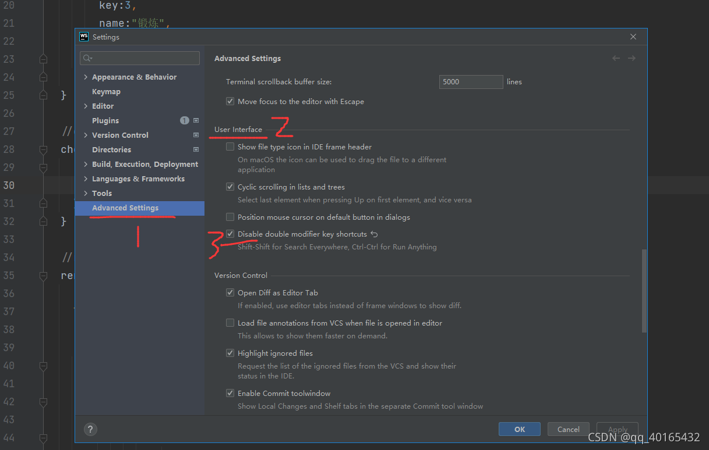
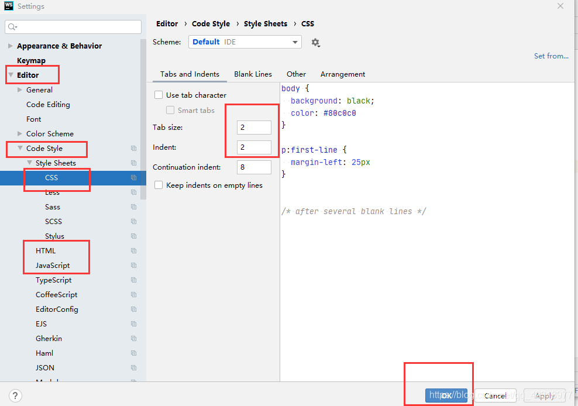
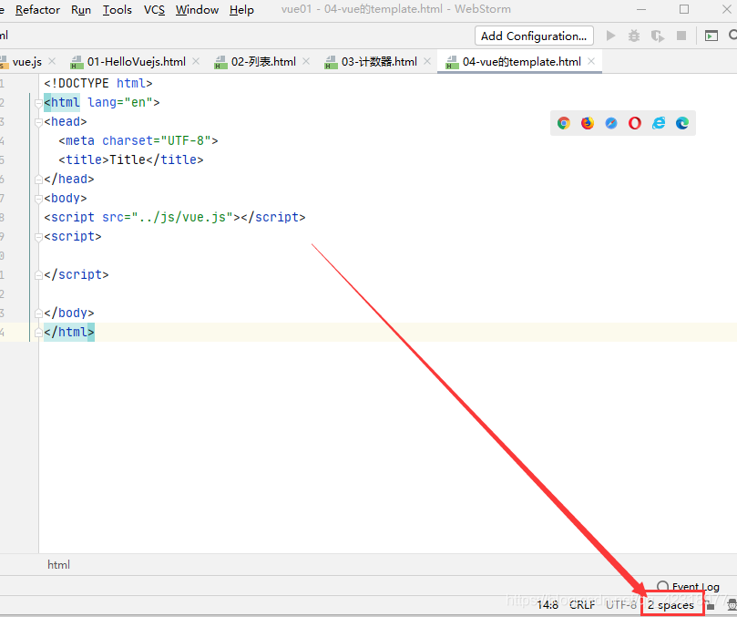

# webstorm

绿色版下载：网盘上

配置：

- 破解插件
  - 插件市场搜索`IDE Eval Reset`，`description:zhile.io`

- 设置`Ctrl` + 鼠标滚轮改变字体大小
  - `Ctrl+Alt+s`
  - Editor->General，选择Change font size (Zoom) with Ctrl+Mouse Wheel；

- 关掉使用`webstorm`连续按两次Shift键弹出的全局搜索：

  
  
- 设置缩进为两个空格

  

  


# 其他

## `doc`转`docx`

```
一、doc转docx文件linux库安装
1、环境要求：服务器需要能连外网
2、在root用户下，运行如下两行命令安装doc转换库（遇到需要交互确认的地方，输入 y 后回车确认）：
yum install libreoffice-headless
yum install libreoffice-writer

如何确认是否安装成功：
上传一个需要转换的doc文件，运行如下命令：
soffice --headless --convert-to docx:"MS Word 2007 XML" docx <doc文件路径>
其中<doc文件路径> 替换为所上传的真实doc文件路径，运行命令后，看当前运行命令的目录下有没有生成相应的docx文件。
```

