# **过渡阵容推荐**

## **1、驯龙拼多多**

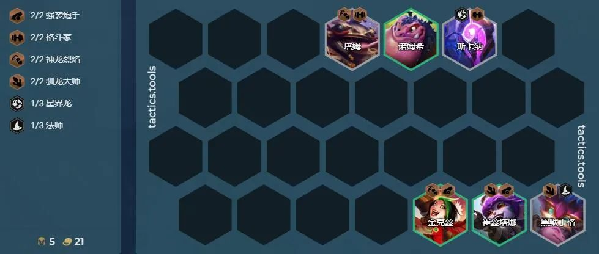

**小炮、大头**开出**2驯龙**是核心，围绕这2张核心卡拼羁绊

后续低费卡逐步换成高费卡，比如补**璐璐**3驯龙

或者金克斯换赛娜、塔姆换慎补3怒翼等

**过渡思路原理：**

驯龙大师类似于S6.5的发明家，羁绊效果是召唤一个可成长的“诺姆希”，且3张驯龙牌大头、小炮、璐璐都是**1-3费的低费卡**，所以只要前期胡这几张卡就可以考虑用驯龙打工，前期多一个单位就是很强的战斗力，后续在一些阵容里驯龙牌也是可以**直接用到底**的。

**后续阵容推荐：**

驯龙95、驯龙炮手等

## **2、4格斗拼**

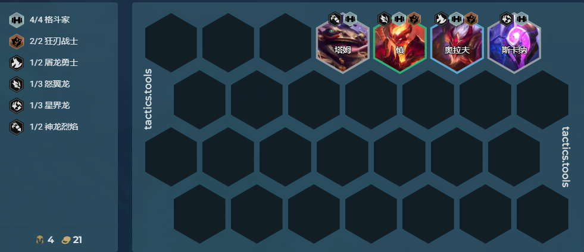

**4格斗**为核心

后续可以补一些后排输出，比如**金克斯+小炮**2炮手2神龙烈焰，**韦鲁斯+老鼠**2迅捷射手（俄洛伊换塔姆多3星界龙）等

**过渡思路原理：**

4斗在S7提供300额外生命值加成（格斗家翻倍），再配合塔姆、蝎子和慎的技能，**前排非常非常肉**，补个日炎2阶段很容易连胜，但缺点是**有输出能力**的斗士很少、日炎伤害也削了，所以后续3阶段想继续连胜的话必须补出后排C位，最常规的就是2炮手或者2迅捷射手。

**后续阵容推荐：**

高斗赛芬、屠龙拉夫等

## **3、玉龙拼神龙**

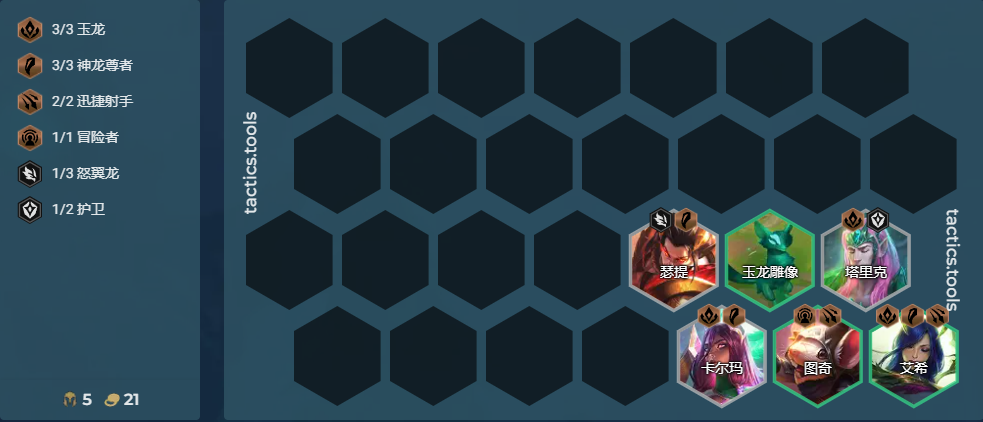

**卡尔玛+艾希**同样是神龙尊者+玉龙为核心，围绕这2张核心卡拼羁绊

腕豪、宝石后续需要换高费神龙和玉龙牌，**否则3阶段容易没伤害**

比如乌鸦+纳尔多2换形，或者腕豪换狗熊补输出

**过渡思路原理：**

前期有**重叠羁绊**的低费英雄可以说是设计师钦点的过渡阵容，比较经典的就是S5.5的**光明哨兵奥拉夫+刀妹**，虽然卡尔玛+艾希的**单卡强度有点鸡肋**，比奥拉夫刀妹差远了，但3神龙+3玉龙只要整体2星多有质量、配合装备2阶段还是可以连胜的，3阶段之后则要看后续piao卡了。

**后续阵容推荐：**

玉龙95、拼多多狗熊等

## **4、怒翼拼神龙**

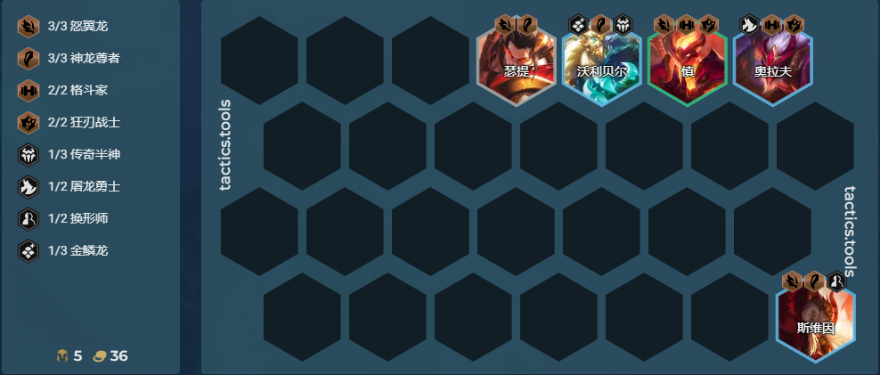

**腕豪+乌鸦**同样是怒翼龙+神龙尊者为核心，围绕这2张核心卡拼羁绊，根据另外一张怒翼和神龙牌选择怎么拼。

其中S7的**乌鸦**为**后排输出**，可以带羊刀正义之类的常规后排C位装备打工，数量特别多的话也可以直接赌

**过渡思路原理：**

和前一套玉龙神龙类似，也是靠乌鸦+腕豪的重叠羁绊来保证前期打工强度，乌鸦和腕豪的**单卡质量都很高**，且1个前排+1个后排的组合也更加合理、后续能补充的羁绊又多，2星多的话轻松过渡上7上8没问题。

**后续阵容推荐：**

赌乌鸦、怒翼霞等

## **5、金麟龙拼怒翼神龙**

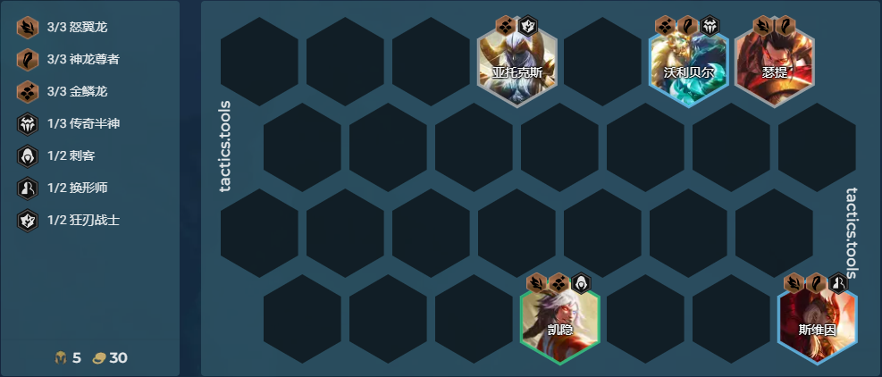

开局有3金鳞（狗熊凯隐剑魔）时优先考虑

**过渡思路原理：**

其实跟前一套一样，也是怒翼神龙的过渡变种，单独拎出来的原因是**思路核心不一样**，这套的核心在于**3金鳞**，金麟龙这个羁绊是会发一件装备的，提升战力的同时有些装备还能刷钱，怪有质量的话能一直**滚经济雪球**。

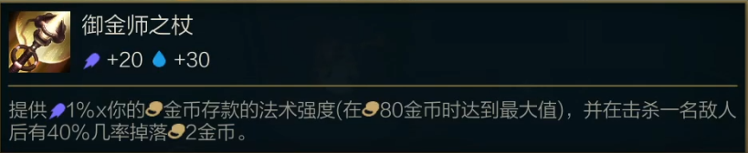

每局游戏的金鳞龙装备是不一样的，像**坚定投资器**这种也是越早来越好，所以开局有3金麟龙的话一定要先丢上去看看金麟龙装备是什么，能**有额外发育**的话就尽量直接用金麟龙过渡。

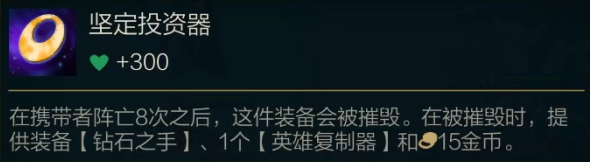

**后续阵容推荐：**

敖兴95

## **6、护卫拼输出**

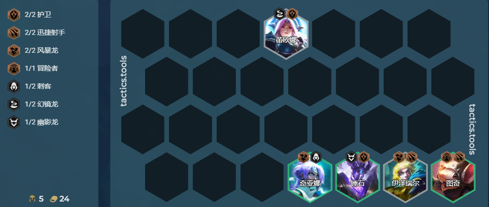

**低费2星护卫**（曙光、宝石、布隆等）为核心

后排可以补**炮手、迅捷射手、刺客**等C位输出

也可以根据不同护卫拼其他羁绊，比如曙光可以拼幻境（永恩），锤石可以拼其他幽影（塞拉斯蜘蛛），布隆可以拼屠龙（皎月奥拉夫）

**过渡思路原理：**

和4格斗的思路差不多，但护卫的优势在于不需要开4护卫，只要2星了开2护卫坦度就是OK的，配合后排输出也能大概率走出连胜，但**3阶段之后**这些1、2费的护卫就有些乏力了，很难直接上8，所以这套过渡在赌永恩、赌皎月等**低人口阵容**中更为常见。

**后续阵容推荐：**

赌永恩、屠龙皎月等

# 赌小炮/运营飞机

**阵容简介**

**赌小炮**

## **基础阵容：**

**3炮手3神龙烈焰3金鳞2驯龙2护卫2魔导1龙神**

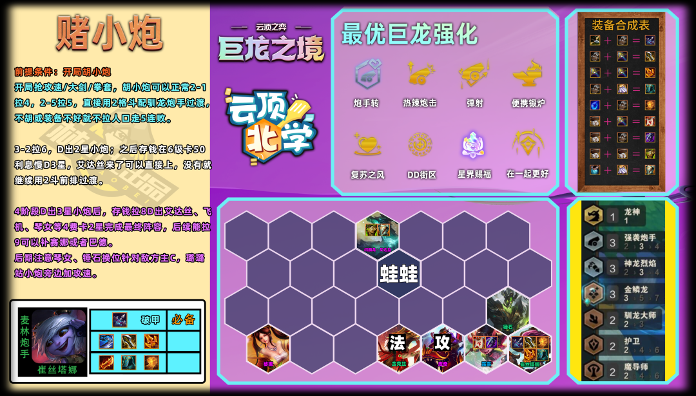

上9补**赛娜**4炮手或者**巴德**2秘术1冒险

也可以不要**艾达丝+锤石**，换成**塔姆+奥恩+赛娜**，还有多余人口可以挂**巴德**

先说下这套中选择**艾达丝**配2护卫作为前排的原因：

1、**坦度更高**：传统小炮只带2斗前排坦度是不够的，而艾达丝在中期非常肉，只要前排能扛住炮手就不缺伤害，大后期还可以考虑换成龙女。

2、**棋子特性更契合阵容**：艾达丝技能可以给团队提供护盾和攻速加成，配合2护卫大幅提升阵容容错；另外搭配的锤石也可以和琴女共同限制敌方站位。

3、艾达丝自带3金麟**多一件装备**能提升战力，且同时金麟龙的装备可以提供经济，让阵容更容易上9大成。

## **装备：**

**小炮****：轻语必备、****无尽/杀人刀/巨杀、羊刀/水银**

***\**\*艾达丝：\*\*\*\*狂徒、石像鬼等任意肉装\*\**\***

**璐璐：****旗子、伏击等功能装**

***\*飞机：\**\**多余AD输出装\****

***\**\*\*\*3星金克丝/琴女：\*\*\*\*\*******\**\*\*\*多余AP输出装+青龙刀\*\*\*\*\****

## **阵容站位：**

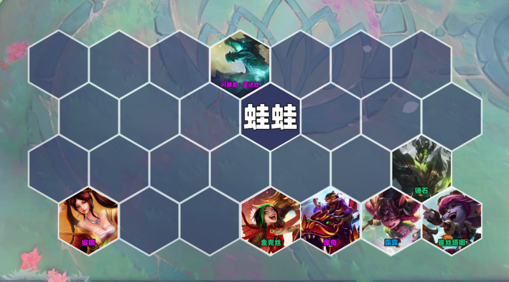

**
**

**推荐的巨龙之境强化：**

***\**\*\*\*\*\*炮手转，热辣炮击，弹射，DD街区等D牌类，在一起更好，星界赐福，便携锻炉等装备类，狩猎律动，复苏之风等\*\*\*\*\*\**\***

**阵容解读：**

炮手是一个**过渡平滑、输出稳定**且非常灵活的阵容，后排既可以赌低费**小炮**、又可以拉人口运营**飞机**，前排也可以选择用**斗士**从头打到底，或者根据情况搭配不同的**高费龙神**让阵容更加扎实。

比起飞机主C来说，赌小炮的中期输出会更稳定，且后期**飞机捡垃圾**也能补不错的伤害，所以赌小炮的上限更高，只要开局胡小炮时就推荐大家玩，不是特别霉的情况下都能至少保证烂分，能否吃鸡则看后续质量跟不跟得上。

星躺星

## **实战运营**

开局抢**攻速/大剑/拳套**，胡小炮且装备对可以正常连胜玩，**2-1**拉4，**2-5**拉5，直接用**2格斗前排搭配后排炮手**过渡即可，装备比较差也可以2阶段不拉人口先走连败，卖血拿小炮装备。

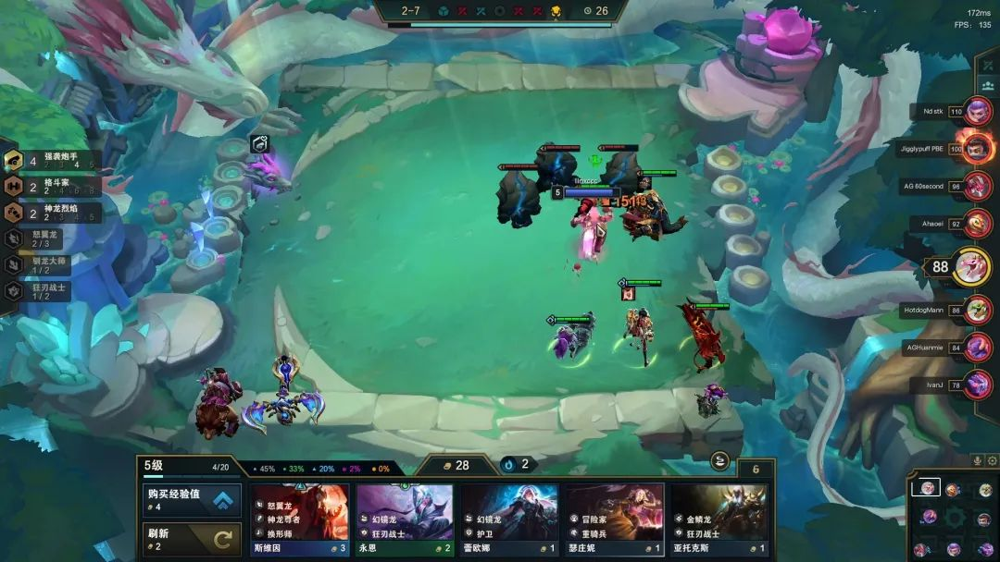

**3-2**拉6启动，D出**2星小炮**，来艾达丝可以直接上，没有艾达丝就继续用2斗搭配驯龙当前排过渡。艾达丝来得越早越好，因为所有金麟龙的装备都可以**发育经济**，不管玩什么阵容3阶段piao到都是可以先用的。

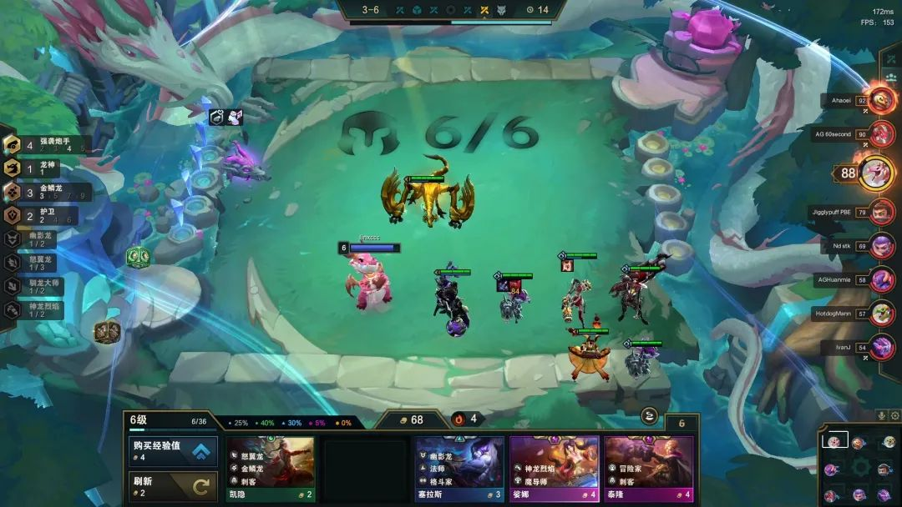

3阶段到4阶段，存钱按常规2费赌狗节奏，在**6级卡50利息慢D**小炮3星即可，金克丝、锤石和璐璐来得多可以顺便追一下。如果小炮特别少或者6级D到了飞机，也可以先**拉7开羁绊**，再看情况继续赌小炮或者换飞机当主C。

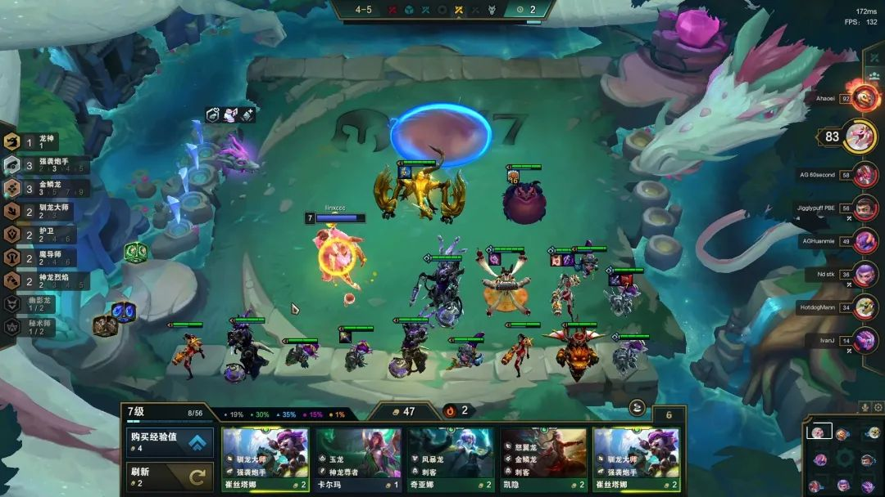

4阶段追出3星小炮后，存钱拉8D**2星飞机、琴女**和**艾达丝**完成最终阵容，艾达丝不2、金麟龙装备又比较差的时候可以丢掉，换成2星奥恩+塞拉斯，人口充裕上赛芬也可以，具体还是**看来牌和实际需求**。注意用琴女和锤石换位去限制敌方主C，璐璐则保证在小炮旁边加攻速。

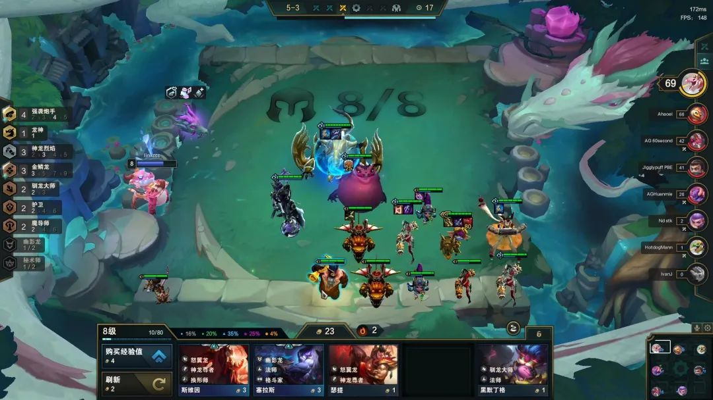

金麟龙装备好的情况下，胡的小炮很容易迅速拉8拉9大成，但阵容还是有赌狗的老缺点，**后期上限不够**，毕竟炮手输出需要时间，而大成的后期阵容比如**敖兴**，只要启动一个技能就能把你所有后排炮手杀完，人口多的话可以换高秘术针对一下，不是终极大成的话还是有机会赢的。

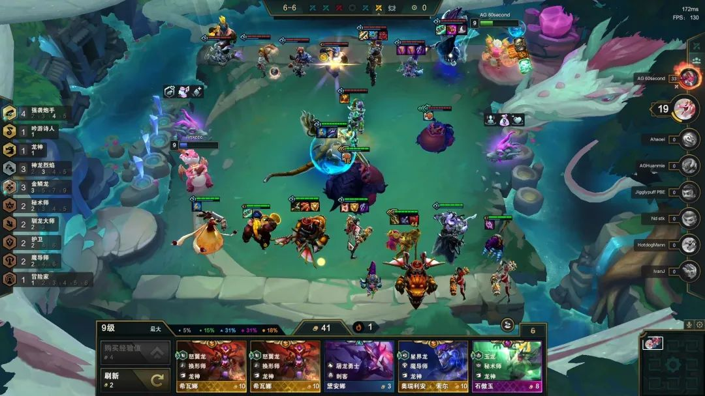

# 4幽影4格斗2迅捷射手（赌韦鲁斯）

## **基础阵容：**

**4幽影4格斗2迅捷射手2风暴1龙神**

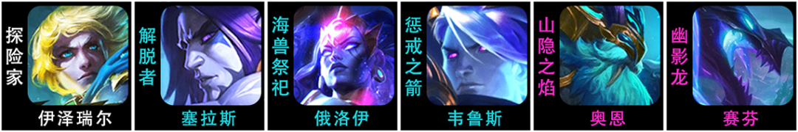

利用星界龙的机制，7级慢D**韦鲁斯**和**俄洛伊**3星即可

8人口有格斗转补**蝎子**6斗，有射手转补**霞**4射手

无转职则单挂**巴德**等任意高费

## **装备：**

**韦鲁斯****：羊刀必备、****巨杀/无尽/杀人刀、青龙刀/水银/正义**

**赛芬：****饮血、泰坦、水银/泰坦**

***\*俄洛伊：\**\**石像鬼、狂徒等任意肉装\****

***\**\*\*\*EZ：\*\*\*\*旗子、伏击等功能装\*\*\*\*\****

韦鲁斯**羊刀**必备保证持续输出，剩下2件比较随意，任意**输出装、续航装**和**水银**都可以看情况考虑做，但**不推荐做轻语**，因为S7轻语只有50%的破甲，而赛芬+塞拉斯的幽影龙羁绊自带40%破双抗，只要站位和韦鲁斯集火一边就可以替代轻语了。

## **阵容站位：**

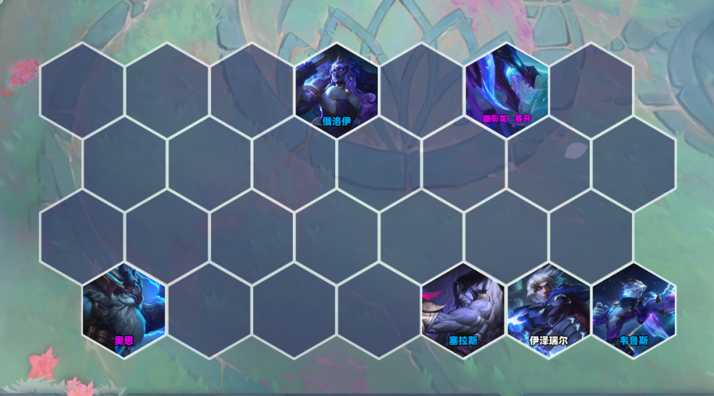

**
**

**推荐的巨龙之境强化：**

***\**\*\*\*\*\*格斗转，迅捷射手转，强攻，DD街区，复苏之风，星界赐福，狩猎律动，飞升，最佳好友，便携锻炉，组件百宝袋，伺机待发，在一起更好，器械专家等\*\*\*\*\*\**\***

**阵容解读：**

阵容的核心思路在于利用**星界龙**的机制、快速D出主C韦鲁斯和主坦俄洛伊的三星，配合奥恩和风暴的控制以及赛芬的收割，**中期非常强势**，只要7级双三星阵容成型就可以保证吃分、**运营也很简单**。

缺点则在于阵容**上限一般，**后期斗士过于笨重，尤其是目前测试服的环境下，后期对上龙王/敖兴等大成的法系大核阵容还是不好打，**吃鸡比较难**。

星躺星

## **实战运营**

开局抢**攻速**，**2-1**拉4，**2-5**拉5，最好是野怪爆或拉4后piao了一张韦鲁斯的情况下去玩，前期直接用**2格斗2迅捷射手**过渡即可，5人口可以补奇亚娜或盲僧和EZ组成**2风暴**。

运气好既有韦鲁斯又有俄洛伊、配合蝎子可以直接3星界，但不要上一波星界又下掉，这样会**重置星界刷新次数**；没有的话就用**老鼠**先带韦鲁斯装备打工。还有一种情况下是开局吃3星界不拉人口**连败去玩**，对局节奏不快的话也是可行的、不过中期D牌压力会比较大。

**3-2**拉6补充羁绊，可以上4斗或者4射手，一般情况下6级都不D，原因是阵容成型需要**上7找一张赛芬**，只有当纯连败开局、3-2剩50-60血压力特别大的时候才会在6级直接启动D俄洛伊和韦鲁斯2星。

**4-1**拉7后，D出2星俄洛伊和韦鲁斯以及1星赛芬稳血，D牌前要注意先**把3星界丢上去**（跟S6.5上3执事D牌原理差不多），D完牌战斗回合开始前再换回标准阵容。

一般情况下就是蝎子和奥恩的对换，更高端一点可以D牌时上**6星界**、但没龙王的话**操****作难度太高**了，备战席格子也容易不够用，且6星界收益只比3星界多1-2块钱所以没啥必要，操作失误反而得不偿失。

接下来就是存钱在**7级慢慢卡利息D**俄洛伊/韦鲁斯3星以及赛芬/奥恩2星，钱特别多的话塞拉斯也可以追一下，不用急着拉人口因为没转职的话拉8没什么大提升。由于星界龙的机制很好追3，一般**5-2**左右就可以大D一波找到3星韦鲁斯和俄洛伊。

俄洛伊和韦鲁斯3星之后，就可以继续**存钱拉8拉9**了，根据转职情况补**6斗/4射**或者挂**巴德等高费控制卡**即可。后期需要**注意韦鲁斯的站位**，有锤石不站角，有琴女躲对角，有刺客就缩角，有巴德则尽量分散。

S7的控制技能以及英雄特别多，所以到后期斗士这种比较笨重的阵容强度会不够，决赛打**法系阵容**感觉没机会的话，可以针对性开**高秘术**看看，实在打不过也没什么办法，毕竟阵容上限就这样了。

# **怒翼腕豪阵容**

这套阵容以腕豪为核心构筑，不得不说腕豪这张卡也是超模到离谱，自带双抗和普攻加成，神龙和怒翼龙的双羁绊更是让他输出爆炸的同时身板也很硬，怒翼羁绊还解决了传统C位无法兼顾续航和伤害的问题，下面小编就带来云顶之弈S7怒翼腕豪阵容推荐，一起来看看吧。

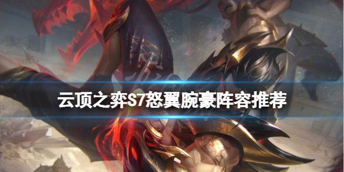

　　**怒翼腕豪**

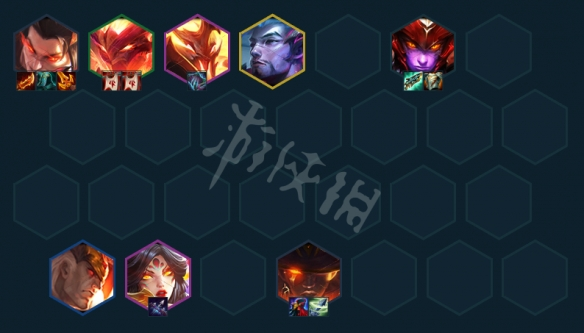

## 阵容组成

(从左到右，从上到下)：

　　瑟提(1)、慎(2)、赫卡里姆(4)、亚索(5)

　　希瓦娜(10)、斯维因(3)、霞(4)、赛娜(1)

　　羁绊组成：

　　9怒翼3神龙2狂刃2换形1龙神

　　强化符文推荐：

　　战力类：焦灼、伺机待发、实战训练、勃然大怒、鼓舞、羽量级选手

　　功能类：怒翼龙or神龙尊者之心/徽/冕、存心失利、纷乱头脑、DD街区

## **装备选择**

　　**主C：腕豪—瑟提**

　　鬼索的狂暴之刃：反曲之弓+无用大棒

　　水银：拳套+负极斗篷

　　死亡之刃：暴风大剑+暴风大剑

　　备选装备：泰坦>巨杀>饮血

　　羊刀和水银是腕豪的核心装备，羊刀越A越快的被动非常契合腕豪主要用平A打输出的机制，水银可以说是这版本c位必备的免控神器，更别说这种近战c位。杀人剑能提供高额的物理面板，能大幅提高平A伤害。

　　**副C：逆羽—霞**

　　最后的轻语：反曲之弓+拳套

　　无尽之刃：暴风大剑+拳套

　　备选装备：飓风、正义、水银

　　霞经过设计师的多次削弱过后多用于后期补充输出，轻语是比较关键的装备必做，可以帮助腕豪破甲。有能力可以给无尽+水银，有三件套的二星霞战斗力依旧很恐怖!

　　**工具人：暮光之眼—慎**

　　基克的先驱：巨人腰带+暴风大剑

　　慎是瑟提的工具人，旗子、圣杯、冰心等功能装备都可以给。

　　多余装备：人马给本鬼书和肉装，龙女法系装备和肉装都能给。赛娜和乌鸦都可以带法衣、吹风等功能装备。后期看情况给高费卡找装备，霞可以补充输出。

**运营思路**

　　开局抢：攻速>大剑>拳套

　　开局抢反曲弓大剑都可以，羊刀和杀人剑都是核心装备，没有就拳套，优先做瑟提装备没有再考虑肉装或是功能装。

　　强化符文：

　　优先焦灼/实战训练/伺机待发

　　【怒翼龙】们的每第5段伤害多造成50%伤害并转化为真实伤害。提供1个【凯隐】。

　　解析：焦灼一直是怒翼龙最优选海克斯，真实伤害是这个游戏最猛的输出，实战训练击杀单位永久加攻击力，伺机待发是备战席的英雄每回合都会永久获得法强和攻击力，都是能提高瑟提和整体阵容上限的强化符文。

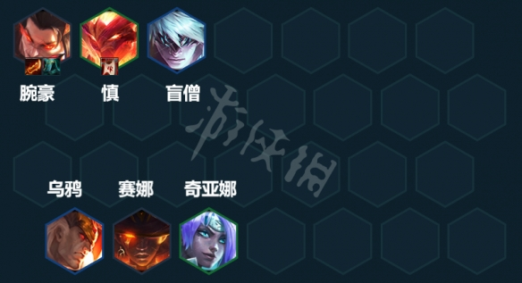

　　**前期过渡**

　　运营节奏是连败搜3星瑟提，前期特别胡瑟提装备合适且有实战训练时可以考虑连胜，其它情况一律无脑连败，2-3自然四人口精致五连败进野怪，备战席留瑟提，不卡利息的情况下赛娜、慎也可以留。选秀先做羊刀和水银，没有再考虑杀人剑或是功能装。

　　3-3自然5人口直接开搜找3星瑟提，手上瑟提比较多/场上有同行可以视情况提早梭哈，赛娜/慎来的多也可以追，瑟提三星后直接上六，凑齐3神龙尊者3怒翼龙的基础阵容，任意神龙单位都可以，记得使用【神龙尊者赐福】道具来选择瑟提作为【英豪】就行。

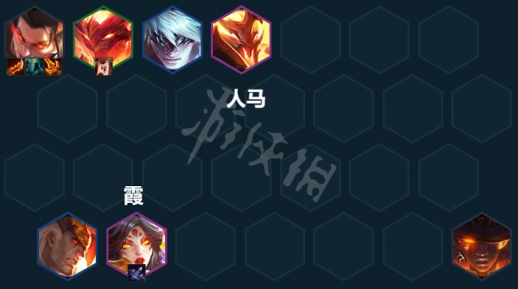

　　**中期运营**

　　四阶段拉七，一般需要搜出至少一张人马/霞+凯隐开出6怒翼龙的羁绊，如果外界战力一般也可以考虑根据阵容补充羁绊战力混到八级再搜。选秀有亚索、巴德可以无脑拿。

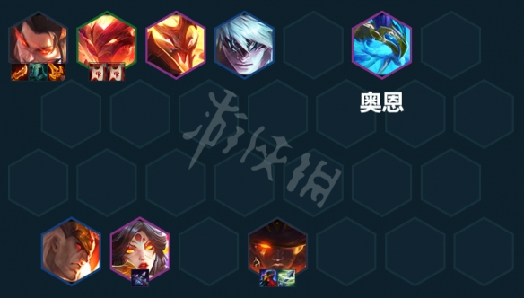

　　**后期变阵**

　　尽快上八，以6怒翼龙3神龙尊者为基础找龙女/奥恩或是其他高费控制卡，龙女是最好选择，龙神自带3羁绊可以拆掉盲僧开出9怒翼龙腕豪直接无敌，自身也是一张不错的前排输出卡。

　　奥恩则是提供一个羊来的控制以及和盲僧开出的2风暴的控制效果，其他如亚索、巴德、派克都可以单挂。后续可以在八级搜一下阵容质量稳定局势后考虑上九追阵容上限，补充亚索和龙女开出9怒翼3神龙尊者的最强羁绊。当然作为一个低费赌狗阵容，想要吃鸡还需要看高费卡和海克斯的质量。

　　站位上来说，腕豪推荐从侧边切入(上赛季的狼人玩家应该会很熟悉)，慎站在腕豪旁边剑阵辅助。阵容成型后视觉效果非常好，腕豪像个战神一样一路平A拳拳到肉根本死不了，享受来自拳王的暴力美学吧~

　　以上就是云顶之弈S7怒翼腕豪阵容推荐，想要了解更多相关攻略的小伙伴可以持续关注游侠网，这里每天会为大家推送最新最全的攻略，一定不要错过哦。

# 怒翼换形乌鸦

## **基础阵容：**

**6怒翼4换形3神龙尊者3玉龙2迅捷射手1龙神**

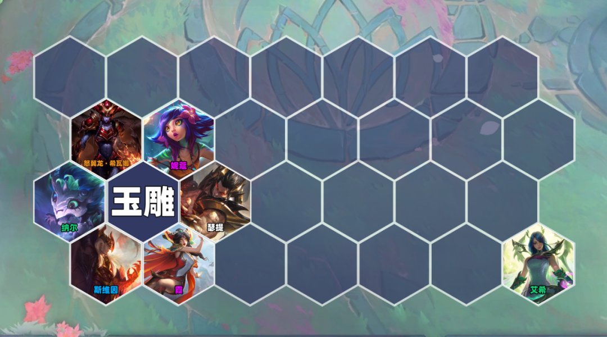

上9之后可以把腕豪换慎，补**亚索**

或者单挂其他五费橙卡

## **装备：**

**乌鸦****：****大天使、羊刀、科技枪/水银/泰坦/饮血**

**妮蔻：****日炎、离子、狂徒、石像鬼等肉装**

***\*霞：\**\**多余AD输出装或旗子伏击等功能装\****

***\**\*\*\*龙女：\*\*\*\*后期肉装输出装捡垃圾\*\*\*\*\****

这赛季的乌鸦是远程主C，三件套中**羊刀+大天使**必备保证持续输出，最后一件可以灵活选择；虽然怒翼龙自带吸血，但在龙女来之前只有3怒翼不太够用，所以最好还是补个续航装**科技枪**或者**饮血**，没有的话可以考虑**水银、泰坦**或者**电刀**。

## **阵容站位：**

**推荐的巨龙之境强化：**

***\**\*\*\*\*\*换形转/神龙尊者转（视情况调整羁绊），焦灼，鼓舞，便携锻炉，飞升，复苏之风，DD街区等D牌类，星界赐福，珠光莲花，组件百宝袋等装备类，潘多拉的备战席\*\*\*\*\*\**\***

**阵容解读：**

乌鸦这个阵容羁绊非常完美，一个都不多，且**过渡十分平滑**，像腕豪、寒冰都是可以从头用到尾的棋子，前期直接搭配神龙玉龙过渡也非常舒服，只要**开局有一只乌鸦**就可以不D牌轻松上7甚至上8，整体质量高的话靠**2星乌鸦**就有机会吃分。

后期阵容三星乌鸦大成之后，对上各种主流阵容都能一战，只有打各种**大成95**可能是劣势，但只要龙女等橙卡有质量也有机会打。

星躺星

## **实战运营**

开局抢**大棒**，**2-1**拉4，**2-5**拉5，最好是小兵或者拉4之后直接piao到一张乌鸦的时候玩，因为只要有1张乌鸦带**羊刀大天使**、阵容前中期就很有强度，搭配卡尔玛+寒冰用3神龙3玉龙过渡即可。

实在没有乌鸦但有阵容底子想硬玩的话，装备可以先给其他**低费AP英雄**带，比如卡尔玛、EZ（S7技能是AP伤害）、盲僧等。

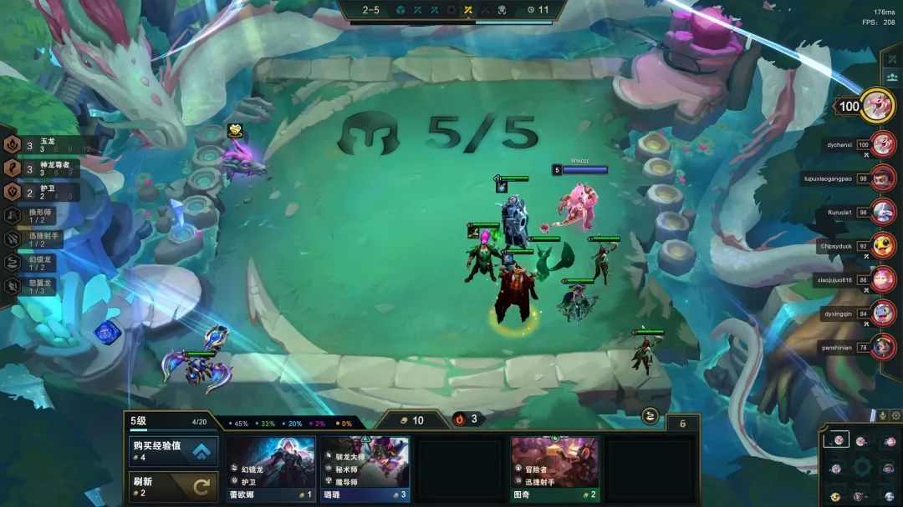

**3-2**拉6，对子多听牌、或者想保连胜可以**小D**提质量，最完美的是能直接D出2星乌鸦，但不要上头，**留个20-30块**，否则后面是会没钱追三星以及上8找龙女的。钱比较少或者没对子稳健一点就不D，卡50利息慢慢拉人口。

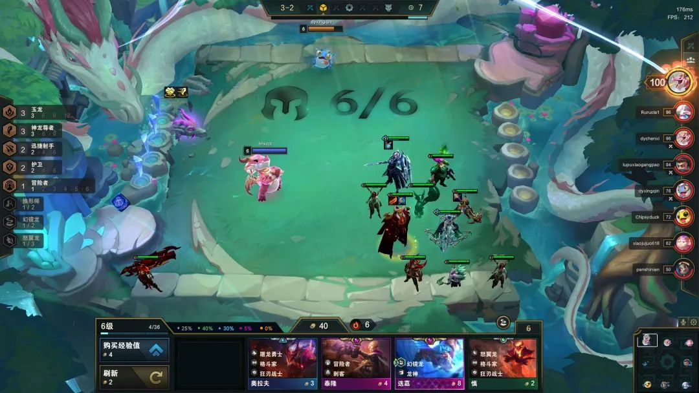

**4-1**拉7，大D找**2星乌鸦**，有妮蔻和蜘蛛可以开4换形，没有的话继续用玉龙神龙怒翼拼羁绊过渡。3到4阶段如果D到玉龙**石傲玉**、金麟龙**艾达丝**都是可以拿来过渡的。金麟龙坦度高、弥补没2星妮蔻前排不足的问题，且装备可以用来发育；石傲玉能直接开6玉龙中期也比较强势。

接下来**存钱到5-1拉8**，一般来说只有在乌鸦来得特别多（至少5只以上）的情况下才会选择在7级追，因为有大天使其实2星乌鸦的输出在4到5阶段都够用了，拉8找2星妮蔻和1只龙女、**补充前排质量**对阵容的提升更稳定。

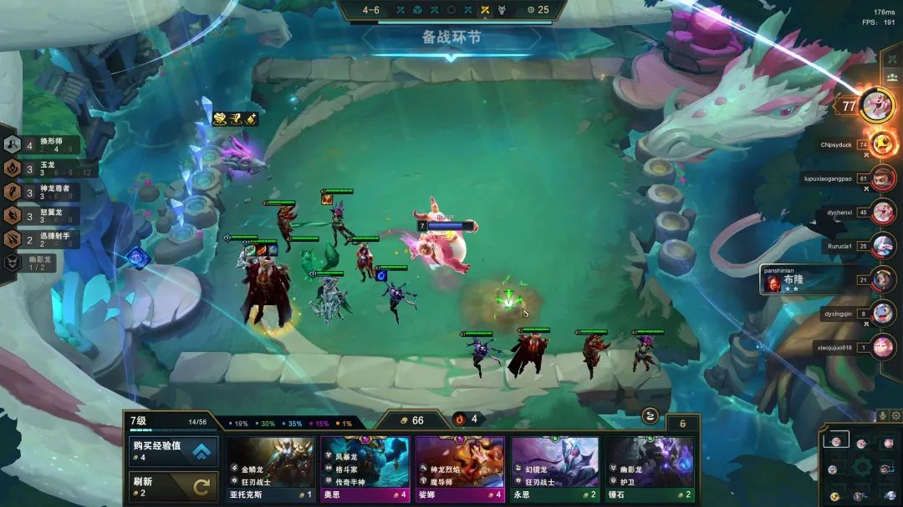

**5-1**拉8，先D出**2星妮蔻**保证前排坦度，然后再慢慢追乌鸦3星，能D到1张龙女就可以直接完成8人口阵容，没有就继续用蜘蛛+任意高费牌混着。如果你是满足开局有乌鸦且装备合适的情况下去玩、过渡顺利其实2星就可以有分了。

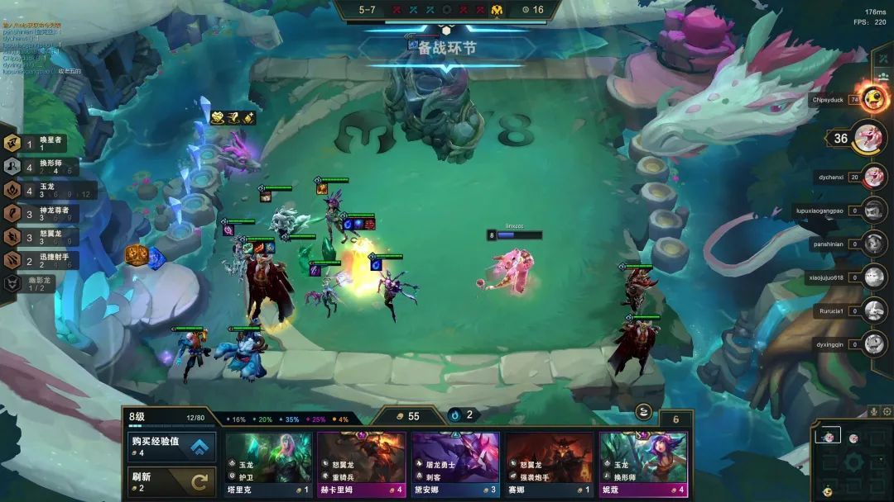

有同行或者乌鸦数量实在太少感觉**追不了3**，也可以靠2星乌鸦直接拉9，找2星的**龙女**和**亚索**靠橙卡质量打后期、2星乌鸦负责补伤害和收割，同样有吃鸡的强度。

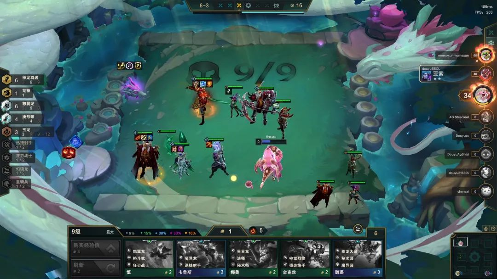

决赛圈需要注意的就是站位上不要再贪3玉龙的羁绊效果了，妮蔻该前置就前置，抱团很容易被**巴德**之类的英雄针对，玉雕的效果只要保证让几个主C吃到就可以。

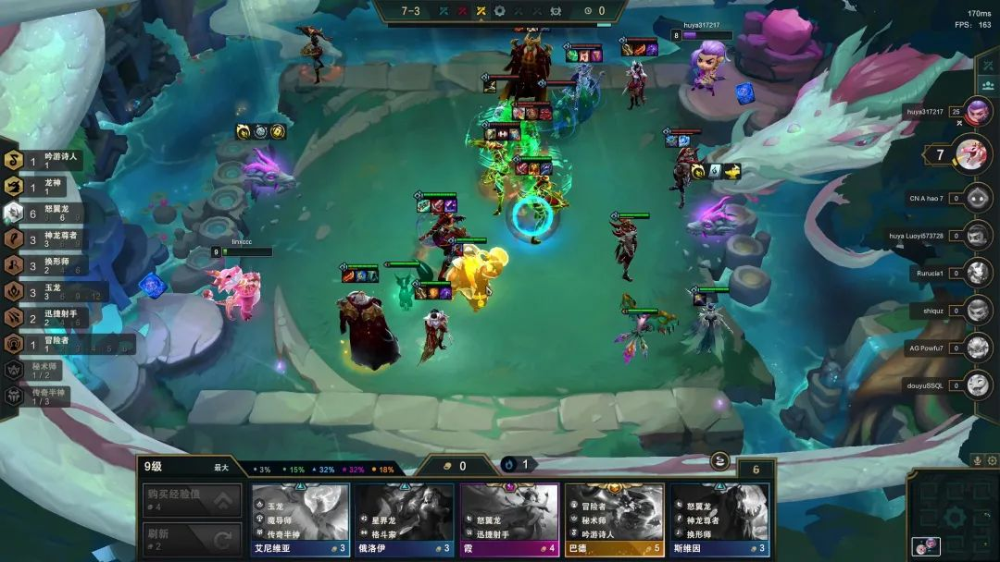

# **屠龙拉夫**

## **基础阵容：**

**4屠龙4狂刃2格斗2重骑2幻境**

亚索没来前用剑魔

有狂刃转或多余人口可以补**派克**2刺客

主C奥拉夫优先追3，其他人数量多均可追

## **装备：**

**奥拉夫****：****饮血、无尽、水银最佳，火炮、泰坦、飓风备选**

**人马/3星布隆：\**狂徒、反甲、龙牙、日炎等肉装\****

**皎月：****冰心**

**亚索：****后期多余AD输出装**

奥拉夫的完美三神装，**饮血**保证续航；**无尽**提供输出；**水银**免控，这3件最好都不要替换；实在没有水银，可以换成**刺转**或者**火炮**保障输出环境；如果有星界赐福等续航海克斯，也可以把饮血换成**泰坦、飓风**等进一步提升输出。

## **阵容站位：**

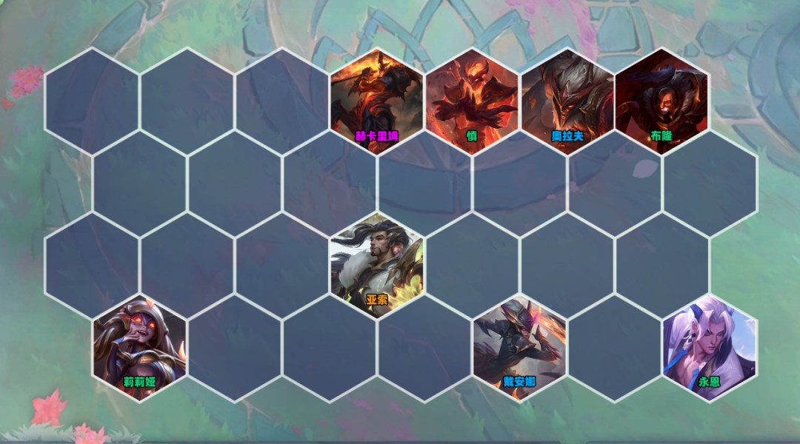

**推荐的巨龙之境强化：**

***\**\*\*\*\*\*狂刃战士转、游牧者、实战训练、最佳好友、源计划植入/甲壳、小巨人、代谢、三费之力、DD街区、星界赐福、便携锻炉等\*\*\*\*\*\**\***

**阵容解读：**

奥拉夫在测试服当前版本的强度也是偏高的，**开局有就等于直接吃分**，但没有像高神龙的狗熊/乌鸦那么夸张，且由于死亡叠攻击力的特殊机制存在，我们判断就算设计师后续削弱也**不会砍到完全不能玩**的程度，再加上阵容的整体组成和运营都**比较简单**，所以作为开赛前学习的第一套3费赌狗阵容非常合适。

星躺星

## **实战运营**

开局抢**大剑**，注意一定是要**拉夫来得早**才能玩，最好是小兵就直接爆2-1开始叠层数，最晚也要在**2阶段选秀**之前，比如这把素材本来是想玩别的，但是4级一D两张拉夫，那么肯定就直接转了。

前期**常规连败节奏**，不拉人口卖血拿装备，**不卡利息**的话可以适当留一点屠龙和狂刃基础牌。尽量保证拉夫每波都死，有2只拉夫是可以同时丢上去送的，现在合成后攻击力会叠加。

S7虽然没有了约德尔和赏金，但幻境龙有一个效果是**海盗**，2幻境很容易凑出来（曙光永恩）且目前的**经济收益是比S6约德尔人要高的**，所以开局还是要跟S6一样留意一下幻境（相当于S6的变异）的效果，现在也不用特意找怪看了、右下角就有图标可以显示。

**3-2**拉6，小D找4狂刃2屠龙提质量，**血量压力大**的话可以直接D出2星拉夫转连胜，血多就不急让拉夫多死几次叠层数，**2星太快反而可能不是好事**，虽然3阶段肯定能锁、但4阶段没叠几层攻击力的2星拉夫强度就不够了，后期也会影响阵容上限。

**4-1**拉7，D出4狂刃4屠龙全员2星的标准阵容，拉夫神装就可以稳血了；然后就是存钱，**没同行**的话直接在**7级慢D3星拉夫**，布隆、莉莉娅、永恩之类的2费卡来得多就顺带追一下。有同行或者拉夫数量实在太少，也可以选择先拉8补高费卡质量。

**5阶段**D出3星拉夫并拉8补个人马，装备也对就基本稳定前三了。然后继续存钱到**6阶段**拉9，D2星亚索和派克的质量完成最终的提升。

阵容的上限除了**三星数量**和**橙卡质量**外，还取决于拉夫前期叠了多少攻击力，以及是否有战斗海克斯的加成。当前版本来说，只要你的拉夫**攻击力够高**（前期叠了很多、或者有实战训练的海克斯），只要2星就可以一路连胜拉9，配合亚索派克的质量一样可以吃鸡。

这局素材最后没打过**6神龙****的****2星焦灼乌鸦**，这也是为什么后来**把6神龙的乌鸦以及狗熊BAN掉了**，加强后的6神龙实在太猛了、后续大概率会回调，**2星3费**搭配契合的海克斯和装备就可以直接连胜上9，只要有1-2家玩这种超模阵容就没办法测其他阵容强度，中期压力太大了。

# 屠龙刺转拉夫

**前提：有刺客转、拉夫来得早**

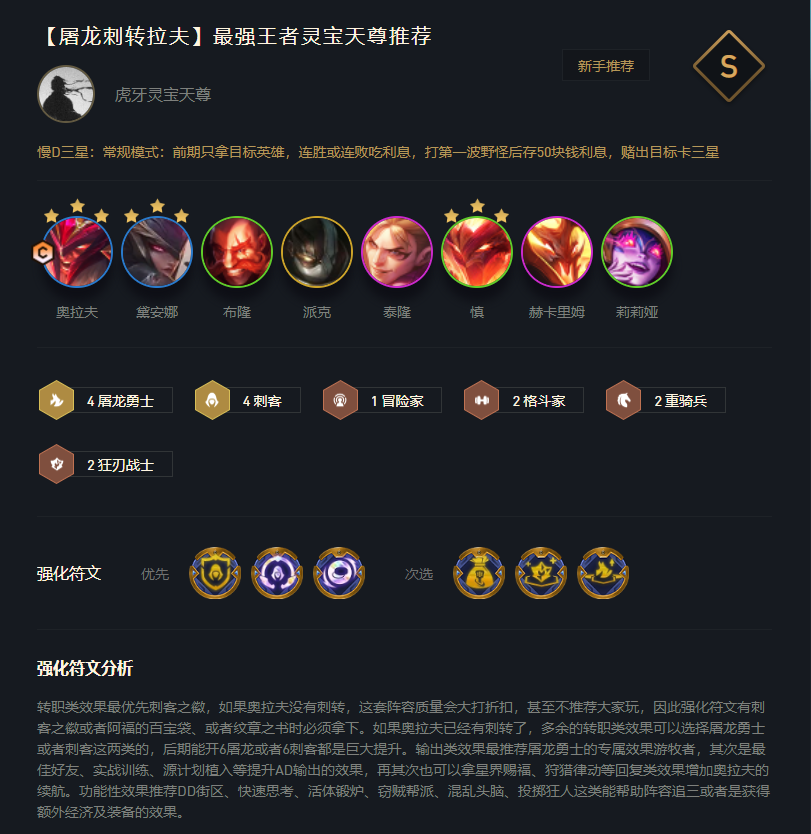

刺客之徽、刺客之冕、快速思考

阿福的百宝袋、提亚马特、游牧者

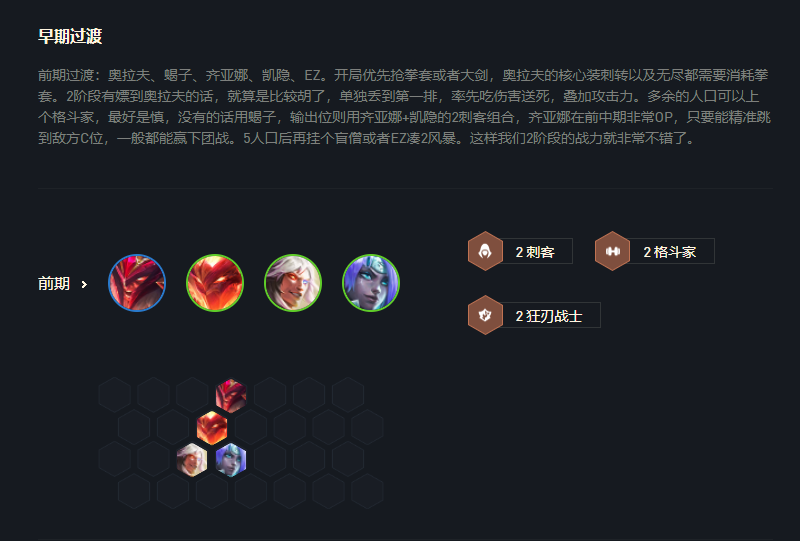

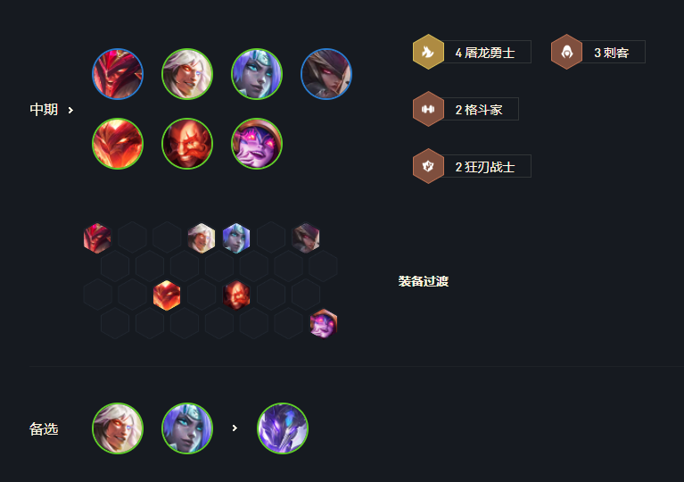

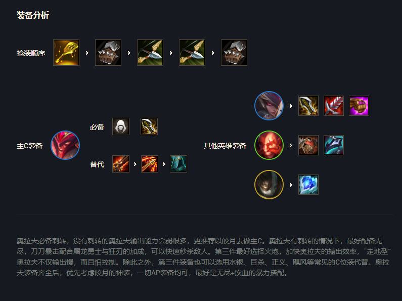

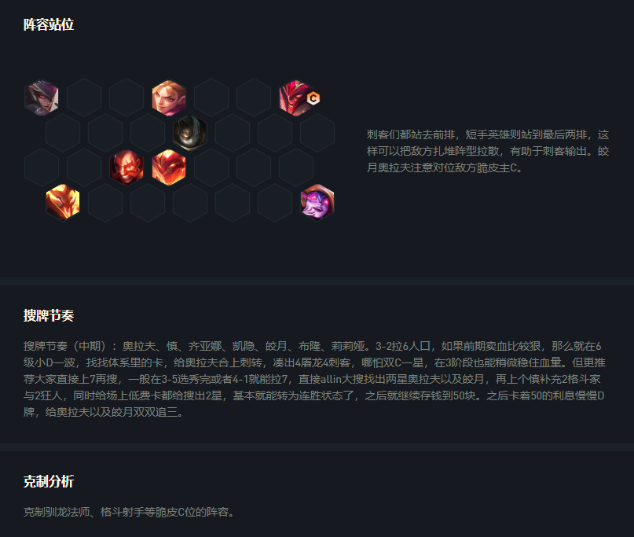

# 【风暴敖兴九五】4风暴3法师2驯龙

# 驯龙敖兴95

## **基础阵容：**

**4风暴3法师2驯龙2格斗2秘术2幽影1冒险1吟游诗人1窃法巧手1龙神**

**佐伊、塞拉斯、派克**这3张卡可以灵活替换

比如换**慎+亚索**开2狂刃养亚索

挂**妮蔻**复制奥恩补前排坦度

或者上**琴女**2魔导补控制

## **装备：**

**敖兴****：****青龙刀、科技枪/饮血、大天使/帽子**

**奥恩：\**狂徒、反甲、龙牙等传统肉装或日炎、离子等前期过渡装\****

**佐伊：****圣杯等功能装**

**其他五费卡巴德/派克/亚索等：****后期成装捡垃圾**

敖兴的三神装，**青龙刀**提供启动；**科技枪/饮血**保证续航，虽然都是全能吸血，但科技枪能奶队友、饮血多个盾，所以还是有区别的；最后一件**大天使/帽**子提升法强，需要注意的是S7大天使改动，目前版本开局就有30法强，战斗**10秒**收益就基本跟帽子持平，所以暂时大多数阵容里都推荐大天使＞帽子（后续可能还会改动）。

## **阵容站位：**

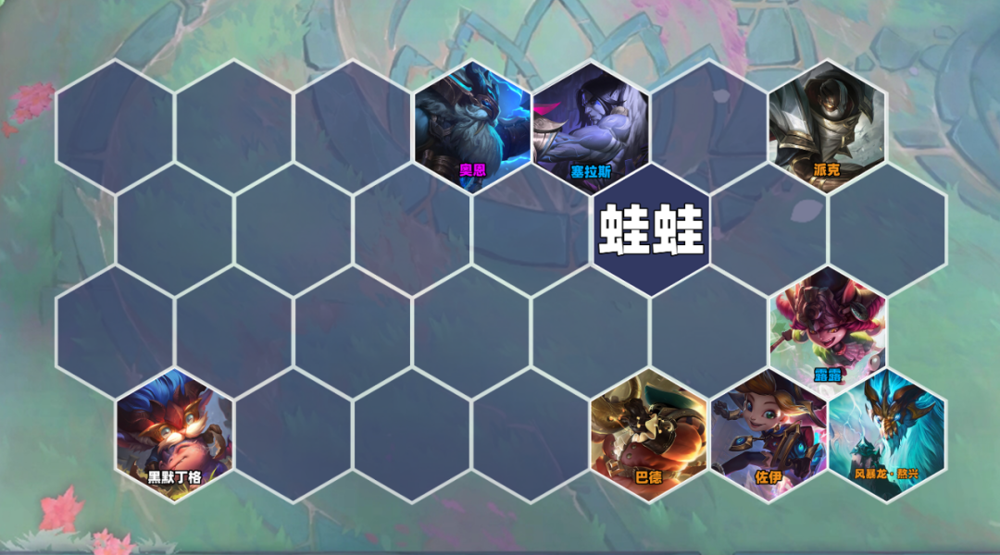

**推荐的海克斯强化：**

***\**\*\*\*\*\*升级喽、利滚利、后期专家等经济类、便携锻炉等装备类、\*\*\*\*\*\**\******\**\*\*\*\*\*源计划链路、在一起更好、珠光莲花、星界赐福、虚假前线、应急护甲、复苏之风等\*\*\*\*\*\**\***

**阵容解读：**

阵容虽然理论上是驯龙95，需要**2驯龙来得早**才能养，但实际上驯龙来得晚也可以直接丢掉不要，大头可以换瑞兹多2冒险变成纯95。不过这样阵容就会比较缺坦度，诺姆希的**后期成长属性**还是很高的。

因为S7的高费卡以**龙神**为主，没有龙神联盟等特定海克斯的情况下，95阵容能搭的高费卡选择不多，这套算是测试服当前版本最稳定也是构筑最合理的了，后期除了**比较怕大成刺客**以外，打其他任何常规阵容都是优势。

星躺星

## **实战运营**

开局抢**腰带**，优先做**日炎**等前期连胜装备过渡，日炎在S7小重做，基础提供400生命值，前期的过渡优先级又回归了。几套新赛季比较强势的过渡公式，大家可以看这篇，赛季初大部分人对羁绊熟悉度不够、过渡得好能轻松上8甚至直接吃分。

[北学：S7前期用谁打工？6套过渡光速上手](http://mp.weixin.qq.com/s?__biz=MzIzNDM2MDI4Ng==&mid=2247502245&idx=1&sn=763fc5e5bfa19ddb634f6f5eb301e152&chksm=e8f51514df829c02fa8fc9d44299f57e4ecef06d208a4877586f675e76371ab871d86d3fbedb&scene=21#wechat_redirect)

**2-1**拉4，**2-5**拉5，前期最平滑的过渡是直接用**2驯龙**拼其他羁绊打工，比如拼塔姆+金克丝+斗士，但平滑的代价就是会牺牲一定战斗力，因为**大头**是一张控制卡本身没有强度，金克丝带AP装的输出也不稳定，一直要等到中期**瑞兹**来了带敖兴的装备、配合3法才有强度。

正常前期想高连胜的话还是尽量看来牌用其他方式比如**3神龙**拼怒翼、玉龙、金鳞等过渡，按照常规节奏**3-2**拉6，**4-1**拉7，8级前都不D牌。

前中期能方便过渡的装备都直接做，因为阵容后期除了**敖兴三件套**以外其他都不刚需，有秘宝库保底怎么都能补出来；前期血量和经济至少要保证一个，否则很容易见不到敖兴就出局了，实在过渡不了可以玩**法系的下位代替阵容**，瑞兹或者冰鸟，具体的攻略等之后会慢慢发。

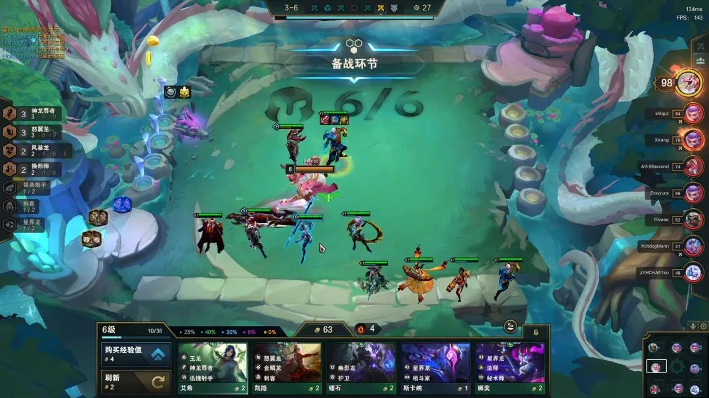

**4-5**左右拉8，血多可以不急慢慢D顺便等piao，因为敖兴是10费卡、阵容想成型需要大量的经济，所以**切忌直接把钱D完**，阵容质量一点一点慢慢换，piao到一定的质量能稳血也可以考虑直接拉9。

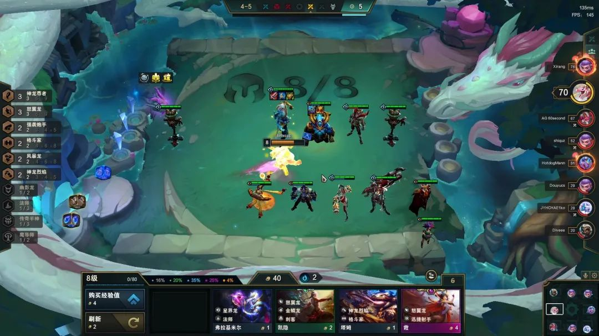

血少压力比较大的话，就需要**5阶段在8级大D**提质量，找前排的**2星奥恩**以及后排的**2星璐璐瑞兹**，2星瑞兹可以完美穿敖兴装备打工，**龙王**来得早的话也能用，但要注意阵容**前排质量特别重要**，至少要有个2星满装备奥恩，有条件的话可以再找个2星妮蔻，阵容大成前不管是瑞兹还是龙王都是需要前排肉才能打伤害。

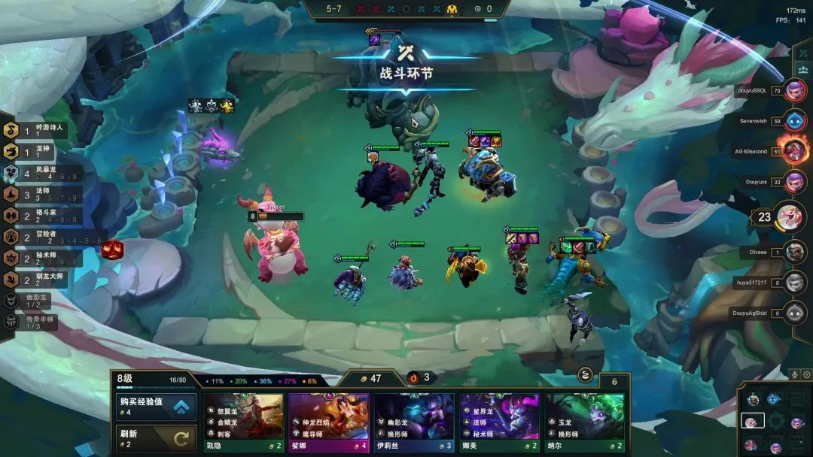

**6阶段**拉9，找敖兴和整体2星完成最终阵容。阵容大成实在太贵了，光2星敖兴就要30块，还得除去拉9的经济，但实际90%的局里都不需要全2就可以吃鸡。除了主C敖兴以外的五费卡，**只有巴德是不可缺少的**、能给敖兴提供启动和控制，其他英雄比如佐伊、派克都是可以替换的，比如亚索2星单挂都很强。

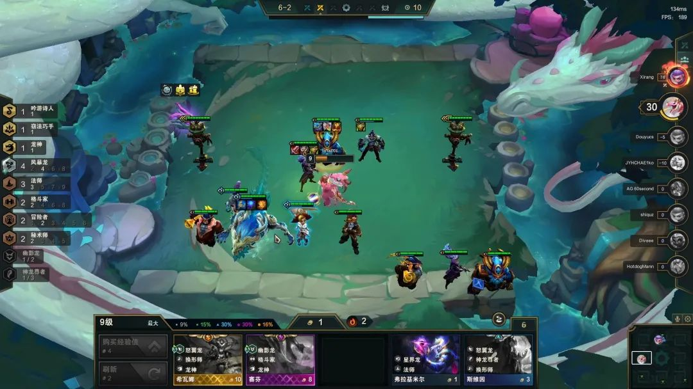

后期阵容需要注意的站位细节就是要保护好敖兴，敖兴只要放出技能就有一段霸体时间、不会被打断，所以一般情况下缩角即可；遇到**特别大成的刺客**，抱团被巴德控，分散站又会被切，站位会特别困难，只能前置第一排，实在打不过也没办法。

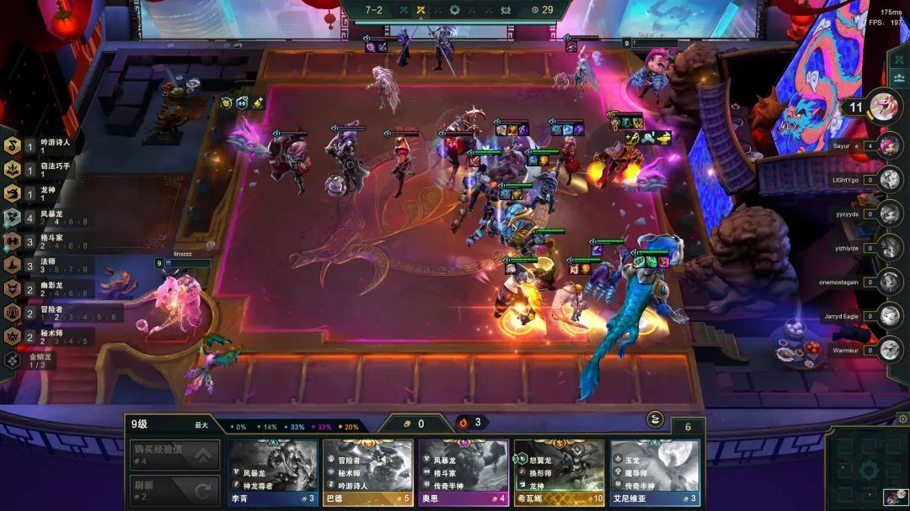

# 魔导龙王95

## **基础阵容：**

**4魔导3玉龙3星界2驯龙2秘术2换形1冒险1龙神1吟游诗人**

有法转龙王的话可以巴德换佐伊，或者妮蔻纳尔换奥恩塞拉斯开3法

## **装备：**

**龙王****：科技枪****、大天使+法转或任意输出/保命装**

**妮蔻：****日炎、离子、狂徒、石像鬼等肉装**

***\*巴德：\**\**旗子、圣杯等功能装\****

***\**\*\*\*凤凰/琴女：\*\*\*\*多余输出装捡垃圾\*\*\*\*\****

龙王加强后蓝条变短且有4魔导，目前是**不需要出回蓝装**的（后续如果削弱可能会有调整），一件**续航装**（科技枪＞饮血正义）+一件**输出装**（大天使＞帽子法爆）是标配，第三件可以根据情况选择。

## **阵容站位：**

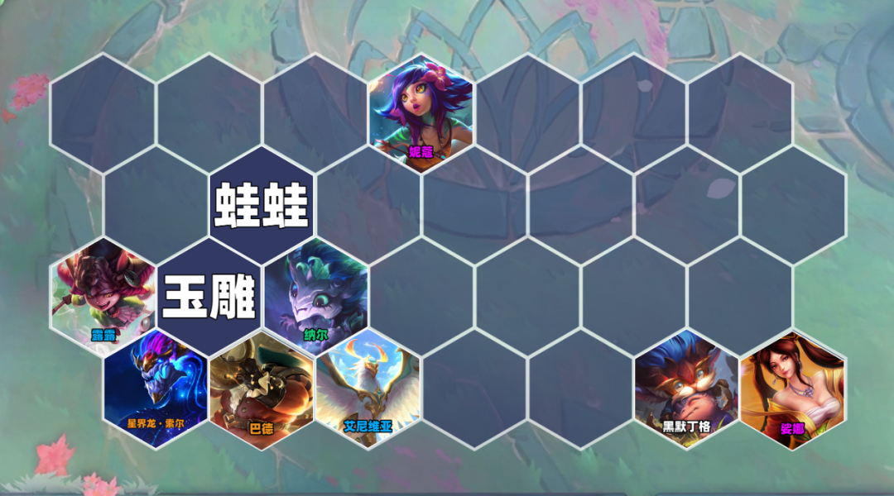

**推荐的巨龙之境强化：**

***\**\*\*\*\*\*法师转，摄魂夺魄，阿福的百宝袋，便携锻炉，飞升，复苏之风，星界赐福，珠光莲花，卢登的回声，升级喽/后期专家等经济类，虚假前线，源计划链路等\*\*\*\*\*\**\***

**阵容解读：**

龙王的技能在每次施放之后会**增加范围和伤害**，类似于s6.5的狐狸，虽然前几个技能没伤害，但他本身羁绊是**魔导师能回蓝**叠得很快，还有法转的上限加成，法转龙王放第二个技能时**不锁蓝**，所以技能施放频率很高（不清楚算不算BUG），有法转的龙王只要15-20秒就可以把技能叠到全屏，这样就不怕假赛了、强度非常高。

星躺星

## **实战运营**

开局抢**腰带**，先做**日炎、狂徒、传送门**等前排装更容易连胜，而且阵容后期本身也是需要足够前排质量来让龙王叠技能的，S7的高费前排除了龙神之外就只有**妮蔻/奥恩/人马**，没装备都不行，所以肉装非常重要，输出装可以靠后续秘宝库来补。

**
**

**2-1**拉4，**2-5**拉5，有2驯龙开局最佳前期可以直接开始养，没有的话过渡公式就是任意2星的**2格斗/2护卫/2重骑**撑前排，后排**2炮手/2射手/3法**补输出，或者用**3神龙**的各种混搭过渡也可以，只要前排有肉装就有强度。

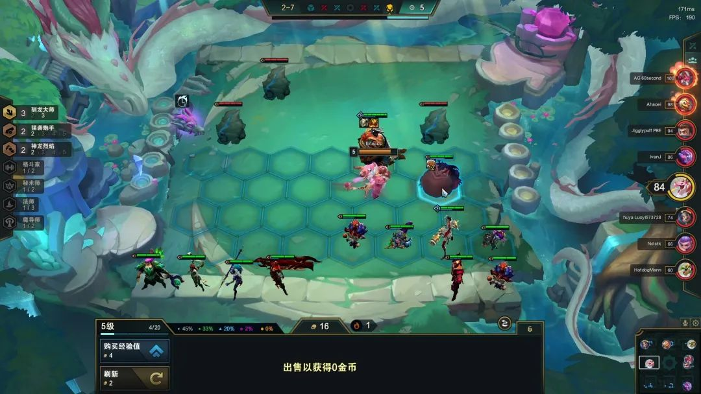

**3-2**拉6，**4-1**拉7，均不D牌补充质量，有驯龙就养、把打工牌往体系内靠。前期只要是先做肉装过渡，piao卡不太差都可以至少保证80以上的血量，如果**实在过渡不了**那么就提前考虑转2、3费的赌狗阵容。

现在很少会有阵容在**4-1**拉7启动大D，一是因为目前基本没有4费卡能玩，2、3费阵容6级就直接D了、高费一般要等到拉8才D；二是因为第三个海克斯提前到了**4-2**刷新，所以就算你打算7级D，也可以**忍一波等海克斯**，看看有没有什么变数（比如快速思考、或者来个龙神联盟/部落直接转）。

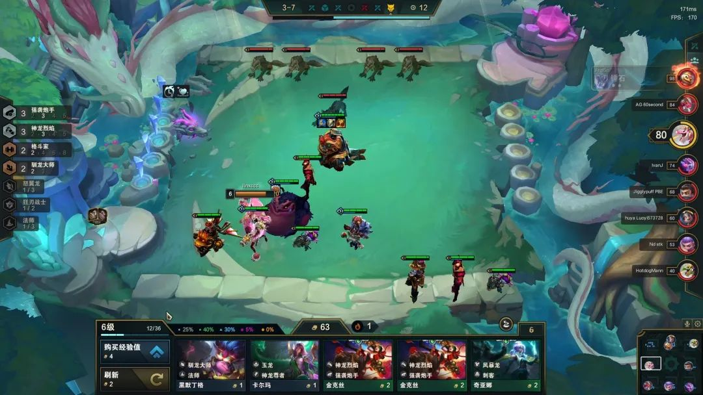

**4-5**左右拉8，花几个回合慢慢D牌继续**提升过渡阵容强度**，优先上体系内的牌，没有的话前排D到**奥恩、艾达丝、赛芬**都可以先用，后排则一般是2星**凤凰**、**瑞兹**或者炮手混搭。主C缺装备的话就靠4-7秘宝库补齐，不缺装备则能用就直接拿，不要花太多钱去D、否则上不了9了。

玩95阵容一定要记住，8级D牌的目的是为了**提质量稳血上9**而不是非要直接D出5费主C，实在D牌太霉、或者钱少判定上不去9就在8级玩到底，只要D出一张龙王、前排有质量就有强度。过渡顺利的话则在**5-5**或者**6阶段**拉9，继续D牌完成最终阵容。

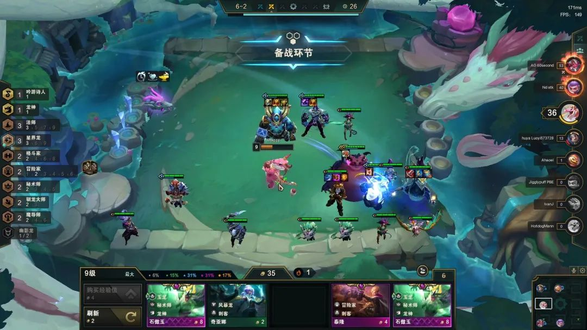

D出**2****星龙王**、装备海克斯不太拉胯就基本等于吃鸡了，有法转的话会更稳，法转本质和魔导一样都是**提升技能频率**。因为阵容属于95、后期**变阵很灵活**，肉装做的是传送门就不要妮蔻+纳尔，省下来的人口可以针对性地开点羁绊比如**秘术**或者单挂其他质量高费卡。

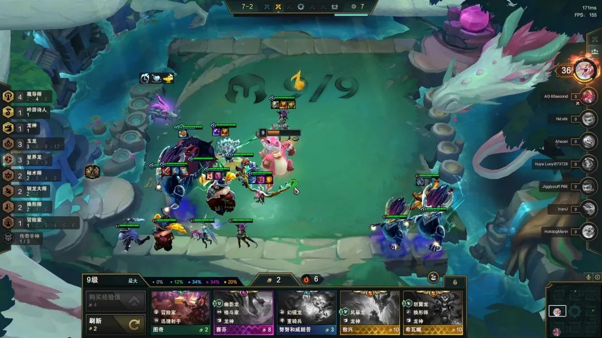

# **魔导法转索尔阵容推荐**

　　**阵容一览**

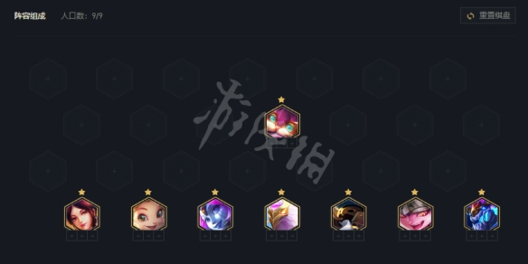

　　索尔，琴女，佐伊，娜美，凤凰，巴德，露露，大头。

　　**强化符文选择**

　　优先：阿福的百宝袋2+，意外之财++，摄魂夺魄。

　　次选：蓝电池，升级咯，利滚利加强版。

## 　　**装备选择**

　　索尔：法转，青龙刀，法爆。

　　露露：女妖，圣杯，电刀。

　　大头：传送门。

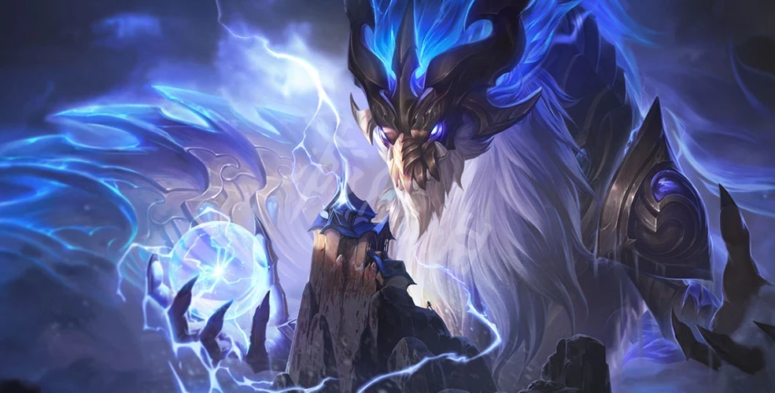

　　**阵容玩法**

　　出门拿眼泪或者大剑大棒。前期用驯龙大师加炮手或者驯龙加斗士过渡都可以。主要是为了让诺姆希进化更快后期需要诺姆希当前排。

　　前期尽量不搜牌，可以卖血上8找龙王。如果上不去可以在6人口或者7人口适当D一点质量。前期有魔法师转职或者魔导师转职是必拿的，有了这两个转职基本就有大分吃，法师转可以给索尔。

　　如果是魔导转职我们可以8人口换敖兴然后上奥恩或者单挂索子哥。有法师转职可以不上佐伊挂索子哥当前排。这套阵容版本T0特别强势但是高费卡较多，所以前期尽量能连胜就走连胜。保持血量健康8人口D到敖兴或者索尔就可以存钱上9。

# 双龙进阶教学

虽然能玩的阵容非常多

但后期想吃鸡大概率还是得靠双龙

**敖兴95**或者**法转索尔**

这2套阵容其实是**非常相似**的

在大多数情况下都可以互转

手把手视频的敖兴部分

初版文案中也提到了与法转索尔的互转运营

不过因为当时感觉法转索尔**不锁蓝BUG修复**后

应该即使有法转也很弱

所以后来删掉了

现在看来，法转索尔虽然确实没有那么强了

但还是能玩的

**大成吃鸡率也依然很高**

今天这篇文章我们就来详细展开一下

敖兴与索尔这两条龙玩法的一些进阶细节

基础部分大家可以看这两篇

[S7冲分必学阵容第一套：驯龙敖兴95](http://mp.weixin.qq.com/s?__biz=MzIzNDM2MDI4Ng==&mid=2247502263&idx=1&sn=aedbf7e7628c2c001bf0c920f9cc8264&chksm=e8f51506df829c1065c1d8719d5165d38348e4573684321ce166be1a943225312e30b9d8a17a&scene=21#wechat_redirect)

[S7冲分必学阵容第五套：魔导龙王95](http://mp.weixin.qq.com/s?__biz=MzIzNDM2MDI4Ng==&mid=2247502349&idx=1&sn=42ac2e2d1cfccb8378dd8522010a5bce&chksm=e8f516bcdf829faa9f97e246e43efca94e576e52ed674541c5db187ad861ffead2abe7014a08&scene=21#wechat_redirect)

其中魔导龙王的阵容组成有变化

这个文章里会提到

**敖兴/索尔进阶教学**

## **1、双龙阵容的互转思路**

敖兴和索尔都是10费法系大C，核心装备接近（都需要科技枪+大天使），过渡思路、成型阵容组成都基本一样。想从标准的敖兴95转成法转索尔，只需要把**敖兴+琴女**2张牌替换成**索尔+娜美**就可以了，非常简单。

这里涉及到目前法转龙王的构筑问题，测试服时期**4魔导3法**是一定大于**2魔导5法**的，当时2/4魔导回蓝是5/8，现在一方面魔导削成了3/6，另一方面魔导内的重要体系卡**琴女**也在正式服上线前被大削，再加上冰鸟本来就是挂件，所以现在**裸挂4魔导收益很低**，5法的体系牌则功能性更强。

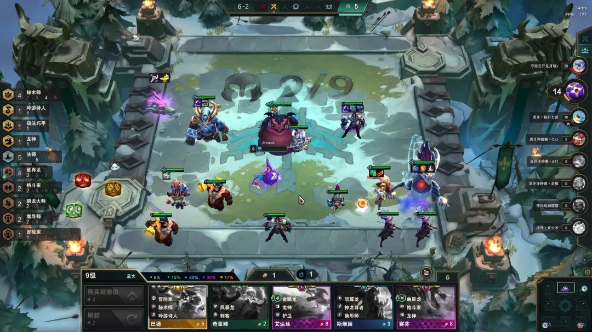

## **2、敖兴优先级大于法转索尔** 

测试服最后一次更新对敖兴和索尔都进行了削弱，且后续索尔又增加了锁蓝热补丁，现在没有法转的索尔强度是很低的，**有法转的索尔优先级也不如敖兴**。

原因是国服的环境是**韦鲁斯**以及**双龙内战**比较多，敖兴只要启动一波就能稳定打死韦鲁斯，对面开秘术也无非是多打一波；而索尔**技能不稳定**，前排不够硬或者韦鲁斯打死人走位空技能就输了。

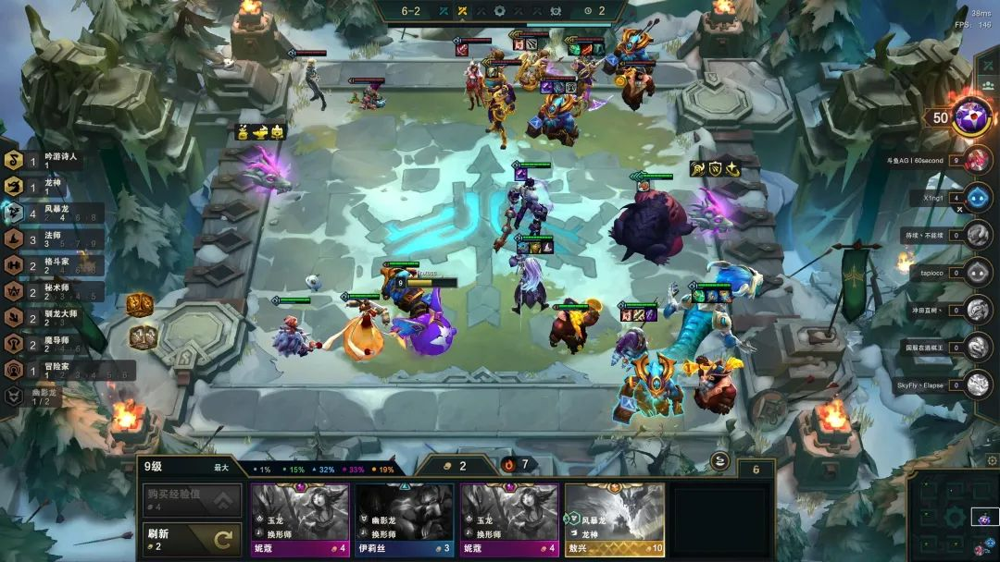

敖兴和龙王内战也是敖兴优势，因为敖兴**施放技能时免控**，一波打死其他杂鱼，第二波打死索尔，即使索尔能开出高秘术也最多就是五五开。大多数情况下，有选择空间时一定优先考虑敖兴。

## **3、敖兴的出装细节**

因为敖兴是一个95阵容，开局一般会选择**先抢肉装过渡**，所以尽管有秘宝库后期也不能每把都保证100%完美神装，但其实95阵容重要的是**整体质量**，光主C强是没用的，整体质量高的话装备差不多就可以。

除非是打**高秘术**的阵容，否则大天使可以被帽子法爆等其他法强装代替；科技枪可以用饮血/正义替代，**青龙刀也可以用羊刀替代**。（10费卡**基础攻速高**，敖兴200蓝青龙刀也要A很多下所以效果差不多）


## ***\*4、双龙的后期变阵\****

95阵容后期变化复杂，不要局限于公式，后期高费卡2星都可以用，前排的**妮蔻/人马/奥恩**，补输出的**亚索/派克**等。尤其**亚索**这张卡只要2星在双龙阵容中后期单挂都很好用，不吃羁绊、不需求特定装备，给肉装可以当前排用、给输出装可以帮助C位补伤害。

## ***\*5、双龙的过渡思路与下位替代阵容\****

最理想的过渡一定是**开局有2驯龙**，配神龙烈焰斗炮（金克斯/小炮带装备）、或者直接配3/5法师打工，诺姆希正式服上线的版本**基础生命值从700削成了500**，如果开局不来的话后面其实很难养起来。

版本最强的过渡思路就是**法师和卢登的联动**，法师本身就是版本强势、双重施法又能触发2次卢登实在是太无解了，只要无脑做肉装、后排输出装捡垃圾就可以轻松大连胜。


中期过渡不了玩不成95时，最佳的下位阵容选择有2种。一种是你2到3阶段就发现自己可能烂了上不了8，那么就直接在**6级开D冲娜美**。娜美是外服流行的阵容，但在国服的环境一般，属于被迫无奈情况下的一个烂分选择。


另一种是2/3阶段过渡得还可以，但4阶段压力特别大、8级必须要花钱大D，这个时候可以考虑玩**幻境迭嘉**（非海盗、雷霆幻境就可以玩），装备差不多能用。虽然目前强度同样偏向烂分，但你也可以用2星迭嘉上9后再换双龙。


娜美、迭嘉以及其他新阵容的攻略之后都会慢慢发出来，目前来说**上分优先考虑过渡玩双龙**一定是没错的，祝大家新赛季上分愉快！

游戏的S7版本近期上线，游戏中新增了许多羁绊。配合法师和冒险者羁绊，瑞兹在这个版本中如果能够获取合适装备就能够打出非常可观的输出，下面小编就带来云顶之弈S7瑞兹冒险法阵容推荐，一起来看看吧。


# **【瑞兹】冒险法**

　　**符文法师——瑞兹**

　　**英雄技能**

　　超负荷 主动

　　瑞兹向目标投掷1颗奥术法球，每颗法球造成0.00魔法伤害(200/300/500最大法力值)。每次施放都会使他的最大法力值提升20并使法球数量提升1。

## **阵容推荐**

　　阵容组成(从左到右，从上到下)：


　　瑟庄妮(1)、莉莉娅(2)、塞拉斯(3)、赫卡里姆(4)

　　娜美(2)

　　巴德(5)、佐伊(5)、瑞兹(3)

　　**羁绊组成**

　　3冒险家1吟游诗人1窃法巧手5法师3重骑兵2秘术师

　　海克斯推荐：法师、冒险者相关海克斯，蓝电池，珠光莲花，经济类，其余通用类

## 　　**主c：符文法师——瑞兹**

　　朔极之矛：女神之泪+暴风大剑

　　大天使之拥：女神之泪+大棒

　　海克斯科技枪刃：大棒+暴风大剑

　　备选装备：其他ap类，帽子，蓝buff等。

　　瑞兹是阵容中的主c，青龙刀必备保证技能回转，科技枪增加队伍续航，大天使增加法强，其他ap类装备也可以考虑。


　　**主t：解脱者——塞拉斯**

　　荆棘背心：锁子甲+锁子甲

　　巨龙之爪：负极斗篷+负极斗篷

　　备选装备：狂徒、板甲等肉装都可以合给塞拉斯，增加前排坦度

　　**运营思路**

　　开局抢眼泪>大剑=大棒

　　开局装备需要优先考虑阵容里的主要输出ap装备，优先拿瑞兹装备，能抢到眼泪最好。游戏过程中有冒险者转必拿，冒险者羁绊强度可以增加瑞兹的输出能力。

## 　　**前期过渡**


　　冒险法阵容主要考虑使用冒险者和法师相关体系来进行前期的过渡，2-1升4，2-5升5。具体过渡阵容看自身来牌选择，如果前期可以合成瑞兹装备但是人还没来，可以考虑先给大头打工，保证过渡平滑后期转给瑞兹。

　　3-1/3-2上六卡不d牌，仅补充体系内羁绊提升棋子质量，最好能找到瑞兹和塞拉斯。质量足够则停手攒钱准备上七。

　　**中期运营**


　　3-5/4-1拉7，3阶段结束如果血量经济都健康可以考虑提早拉7。这里需要根据血量选择，如果不健康需要在7级d找出2星瑞兹和2星塞拉斯保证阵容质量,至少需要找到3冒险家。也可以卡50利息慢慢找瑞兹和塞拉斯。由于巴德对冒险法有很大的提升，如果过渡顺利则最好攒钱准备上8再补充阵容。

　　**后期变阵**

　　拉8尽量找到巴德和佐伊锁血。5-1前需要d出三星瑞兹并且上8。如果塞拉斯没有来很多3星比较困难，但是找到了人马就可以考虑更换后期的主t。升9后可以考虑补充其他5费卡来增加阵容控制和输出，也可以尽量开冒险者羁绊，对瑞兹的提升还是比较大的。

# 【瑞兹】驯龙7法


# 一图流

## 赌小炮 一图流

## **一拳超人石傲玉**


# **赌豹女**

6换形3玉龙3怒翼

# 6幻境4狂战2重骑（养永恩）


# 玉龙护卫EZ（赌EZ）

## 海克斯：

蓝电池、羽量级选手、复苏之风

DD街区、珠光莲花


# 9神龙蜘蛛


# 赌腕豪

**最终阵容：9怒翼3神龙2换形2狂刃1龙神**


龙女、亚索没来前，8级可以先用**盲僧+奥恩**

## **装备：**

**腕豪****：水银必备、羊刀、杀人刀/巨杀**

**慎：****旗子、圣杯、传送门等功能装**

**人马：****后期多余肉装**

**龙女：****后期多余肉装/AP装**

**亚索/霞：****后期多余AD装**

## **阵容站位：**


**推荐的巨龙之境强化：**

**怒翼转、DD街区、羽量级、勃然大怒、焦灼、复苏之风、鼓舞、星界赐福、狩猎律动、便携锻炉等**

**阵容解读：**

和之前赛季的各种一费拼多多赌狗不同的是，赌腕豪成型非常简单，目前的强度是**只需要腕豪一张牌三星**，就可以无脑拉人口一路上9了。

中期3星神装腕豪配6怒翼3神龙非常强势，后期阵容也有**龙女、亚索**等高费卡的上限提升，只有面对特别大成的敖兴95等阵容时可能打不过，但作为赌狗阵容来说强度已经相当不错了。

## **实战运营**

开局有腕豪抢腕豪，没腕豪抢**大剑**，最好是**腕豪来得多**或者**2-1****有D牌海克斯**再考虑玩，因为腕豪的3星时间节点非常重要，3星早可以稳吃分争吃鸡，但三星晚了也很容易第八。

2阶段不拉人口走连败，只留腕豪，其他牌卡利息就全卖。S7玩连败的时候开局注意看一下幻境，如果**幻境是海盗**的话前期可以上曙光+永恩吃经济，虽然正式服上线海盗削了一次但也总比没有好。

打完石头人根据腕豪数量，**5张以上**可以选择在4级大D直接冲出3星，比较少就3阶段自然升5后卡50利息慢D，**赛娜、慎**来得多可以顺带追一下。

常规局3-5左右（这局因为骰子所以3-2）大D出3星腕豪之后，这个阵容的运营就基本结束了，剩下就是**一直存钱拉人口**，补高怒翼羁绊就完事了，非常简单无脑。

因为腕豪是一张1费主C，**2星和3星的差距特别大**，其他人初期没装备也没战斗力，所以当你开局决定了赌腕豪，一旦后面D崩了、腕豪不3的局很容易烂掉。

比如这把就是开局DD街区，装备合了也没有同行，但D到3-5还是只有3张腕豪，这种情况就很难救了。如果你能提前意识到腕豪3不了，唯一的活法是拉7硬D出2星霞，**靠霞吃个烂分**；但处理不好依然还是可能会老八。

4阶段拉7之后，需要再D一波牌找一张霞或者人马补出**6怒翼3神龙**，然后继续存钱拉人口。神龙牌最好用**盲僧**，一是可以处理前排、二是8人口能补奥恩或者奇亚娜羁绊很舒服。

中期**腕豪没神装**，或者**D不到6怒翼**的话有可能会输几波，需要等秘宝库补充质量；但运气好piao卡顺利能继续连胜的话，不D牌直接拉8甚至拉9也是很常见的。

对局节奏慢、或者4到5阶段能继续连胜，血量高可以考虑拉9；感觉上不去9就在8级硬D一张**龙女**，虽然8级没转职开不出9怒翼3神龙，但6怒翼也足够吃分了，赌狗阵容本身运营简单、**想吃鸡条件还是比较苛刻的**。

后期主要注意腕豪的**左右换位**抓对位即可，从弱侧切入到后排就可以赢，对上**前排有大肉**（比如龙神联盟/部落中的艾达丝）的阵容绕不过去就很难打，需要亚索、龙女等**高费卡质量跟上**才有机会。

# 【金鳞龙】7金鳞龙3怒翼3神龙


海克斯：

复苏之风、利滚利、三费小组

最佳好友、源计划甲壳、应急护甲


# 【追三星界龙法】9星界龙3法师2格斗


推荐星界龙之魂、后排之迅和粉碎器。

输出方面可以拿：珠光莲花、大天使之拥、卢登的回声，能增强AP输出的强化优先。

功能性强化推荐DD街区、灌铅骰子和黄金门票，只要是有利于追3星的经济类强化都可以拿。


# 【屠龙狂刃】4屠龙4狂刃2幻镜龙（养拉夫）


强化符文

DD街区、掷骰狂人、星界赐福

大哥罩我、实战训练、背水一战


# 幽影刺（养派克）

# 【六幽影赛芬】6幽影龙4格斗2狂刃


# 【3322冒险刀霞】3冒险3怒翼2狂刃


强攻、并肩作战、射手之冕

最佳好友、实战训练、迅捷射手


# 6星界带星界转

海克斯优先纹章之书，开出星界转稳了


# 【狂战追三永恩】6幻镜4狂战2重骑


战斗强化推荐：实战训练、短兵之利、直击弱点、珠光莲花、星界赐福、狩猎律动等等，通用的AD强化都可以拿。转职方面，推荐幻影龙、骑士和狂战士职业相关都可以拿，后期能上9级都可以做大羁绊。功能性强化推荐赌狗效果，参考：DD街区、存心失利、利滚利、灌铅骰子等等，有利于追3星的效果都可以。


# **金鳞龙实战运营**

## **前期运营：**

首先需要明确一点，开出9金麟龙需要2个转职，所以尽量是**第****一个海克斯出金鳞转**时再考虑玩。金鳞牌一共只有5张，除去8费**艾达丝**和5费**佐伊**，低费3张分别是**剑魔**（狂刃）、**凯隐**（怒翼+刺客）和**沃利贝尔**（神龙），前期的过渡选择也基本围绕他们的羁绊展开。

以下是几种具体前期过渡方式推荐：

1、围绕凯隐搭配3怒翼/刺客

慎为狂刃+格斗+怒翼，完美羁绊连接牌，后排搭**赛娜/乌鸦**可以带德莱文之斧/投机者之刃/御金师之杖刷钱。

**金鳞龙装备解析**

金鳞龙一共有7件专属装备（投资器和钻石之手算一件），3/5/7/9金鳞当前版本分别会提供1/2/4/5金鳞专属装备，每一局的金鳞龙装备随机，但同一局里所有人获得金鳞龙装备的顺序是一样的。

**1、大亨之铠**

装备效果：在承受伤害时提供2护甲、2魔抗和15生命值，至多叠加30次。满层时提供2金币。

肉装，前期拿到效果一般，因为有可能叠不满就没钱；前中期一般丢给2星的护卫、格斗等前排单顶，后期给艾达丝。

**2、德莱文之斧**

装备效果：提供1*你的金币存款的攻击力（在80金币时达到最大值）。每次攻击时提供1个层数，至多至100层，满层时提供8金币和1件基础装备。

AD输出装，来得早的德莱文之斧发育能力太强了，所以这版本对金币收益进行了削弱。早期发现金鳞龙第一件装备是德莱文之斧时，可以**优先做羊刀**进行联动，羊刀+德莱文之斧配合射手叠得很快，后期可以霞打到底或者给亚索。

**3、坚定投资器/钻石之手**

装备效果：在携带者阵亡7次之后，这件装备会被摧毁。在被摧毁时，提供装备【钻石之手】、1个【英雄复制器】和15金币。

钻石之手装备效果：每场战斗仅触发一次：当携带者降至66%和33%生命值时，获得持续2秒的伤害免疫效果和1金币。

当金鳞龙第一件装备是坚定投资器时，往往有很多人会优先选择金鳞过渡；即使最后你不选择玩金鳞相关阵容，1个妮蔻+15块钱也是很香的。但一般情况下大家都不会浪费钻石之手，用**艾达丝搭任意后排**的阵容（金鳞霞、金鳞炮、金鳞刺、金鳞95等）打到底，后期钻石之手看情况给前排或者后排带都可以。

**4、投机者之刃**

装备效果：提供1*你的金币存款的攻击速度（在80金币时达到最大值）。每次攻击时有6%几率掉落1金币。

攻速装，这件装备相对来说是比较鸡肋的、远不如德莱文之斧；不过版本内有一个机制加强，避免了投机者之刃一直不掉落金币的情况，理论上前中期刷钱概率提升。

