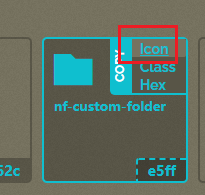
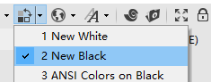
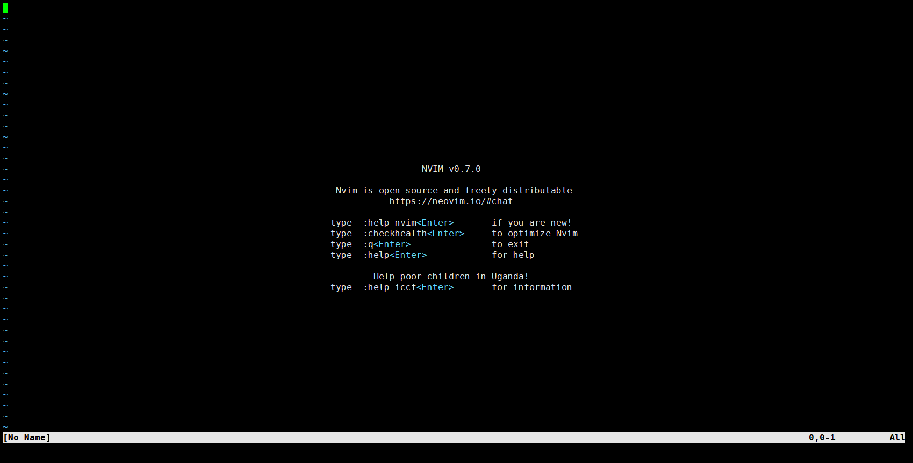
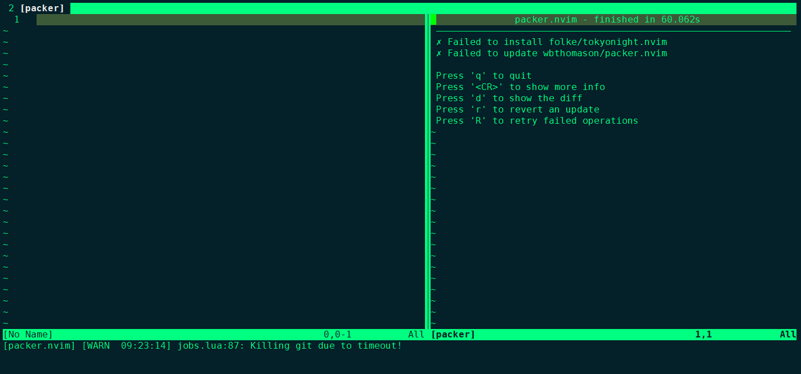

# 下载安装

## 准备字体文件

下载：[Nerd Fonts - Iconic font aggregator, glyphs/icons collection, & fonts patcher](https://www.nerdfonts.com/)

选择字体：Agave Nerd Font

下载下来后，在windows系统上安装，然后xshell上设置一下：


复制该链接上的`Icon`:https://www.nerdfonts.com/cheat-sheet



粘贴到终端上，没问题的话，就会显示图标了：


xhsell我还额外应用了主题，可能回合`neo-vim`的主题色冲突，建议使用默认的即可



## centos环境

参考：[Installing Neovim · neovim/neovim Wiki (github.com)](https://github.com/neovim/neovim/wiki/Installing-Neovim)

这里选择`AppImage`格式进行安装，操作以`root`用户，在`/root`目录下进行的

**AppImage ("universal" Linux package)**

The [Releases](https://github.com/neovim/neovim/releases) page provides an [AppImage](https://appimage.org/) that runs on most Linux systems. No installation is needed, just download `nvim.appimage` and run it. (It might not work if your Linux distribution is more than 4 years old.)

```
curl -LO https://github.com/neovim/neovim/releases/latest/download/nvim.appimage
chmod u+x nvim.appimage
./nvim.appimage
```

If the `./nvim.appimage` command fails, try:

```
./nvim.appimage --appimage-extract
./squashfs-root/AppRun --version

# Optional: exposing nvim globally.
mv squashfs-root /
ln -s /squashfs-root/AppRun /usr/bin/nvim
nvim
```

`chmod u+x nvim.appimage`执行之后，我们挪一下位置，并且配置环境变量

```
mkdir /usr/bin/nvim
mv nvim.appimage /usr/bin/nvim/

cd /usr/bin/nvim/
ln -s /usr/bin/nvim/nvim.appimage nvim
```

编辑`/etc/profile`

```
export PATH=$PATH:/usr/bin/nvim
```

重新加载下配置文件：`soruce /etc/profile`

此时可以直接执行`nvim`，效果如下：



输出`nvim`版本：`nvim --version`

```
NVIM v0.7.0
Build type: RelWithDebInfo
LuaJIT 2.1.0-beta3
Compilation: /usr/bin/gcc-11 -U_FORTIFY_SOURCE -D_FORTIFY_SOURCE=1 -DNVIM_TS_HAS_SET_MATCH_LIMIT -DNVIM_TS_HAS_SET_ALLOCATOR -O2 -g -Og -g -Wall -Wextra -pedantic -Wno-unused-parameter -Wstrict-prototypes -std=gnu99 -Wshadow -Wconversion -Wdouble-promotion -Wmissing-noreturn -Wmissing-format-attribute -Wmissing-prototypes -Wimplicit-fallthrough -Wsuggest-attribute=pure -Wsuggest-attribute=const -Wsuggest-attribute=malloc -Wsuggest-attribute=cold -Wvla -fstack-protector-strong -fno-common -fdiagnostics-color=always -DINCLUDE_GENERATED_DECLARATIONS -D_GNU_SOURCE -DNVIM_MSGPACK_HAS_FLOAT32 -DNVIM_UNIBI_HAS_VAR_FROM -DMIN_LOG_LEVEL=3 -I/home/runner/work/neovim/neovim/build/config -I/home/runner/work/neovim/neovim/src -I/home/runner/work/neovim/neovim/.deps/usr/include -I/usr/include -I/home/runner/work/neovim/neovim/build/src/nvim/auto -I/home/runner/work/neovim/neovim/build/include
Compiled by runner@fv-az316-460

Features: +acl +iconv +tui
See ":help feature-compile"

   system vimrc file: "$VIM/sysinit.vim"
  fall-back for $VIM: "
/home/runner/work/neovim/neovim/build/nvim.AppDir/usr/share/nvim"

Run :checkhealth for more info

```

替换默认的 vim （也可以不加）

`nvim ~/.bashrc`，添加别名：

```
alias vim='nvim'
alias vi='nvim'
alias v='nvim'
```

## 配置文件

`nvim`配置文件入口：`~/.config/nvim/init.lua`，如果没有可以新建

init.lua

```lua
require('basic')
```

新建`~/.config/nvim/lua/basic.lua`

`vim lua/basic.lua`


## 更新插件

如果出现如下报错，是因为git clone时，github连不上：



尝试更改`plugin.lua`的测试代码

```lua
return require('packer').startup(function()
  use 'wbthomason/packer.nvim'
end)

```

尝试手动安装插件：

```
cd ~/.local/share/nvim/site/pack/packer/start
git clone --depth 1 https://github.com/folke/tokyonight.nvim.git
```

检查`packer.nvim`

```lua
local fn = vim.fn
local install_path = fn.stdpath('data')..'/site/pack/packer/start/packer.nvim'
if fn.empty(fn.glob(install_path)) > 0 then
  packer_bootstrap = fn.system({'git', 'clone', '--depth', '1', 'https://github.com/wbthomason/packer.nvim', install_path})
end

return require('packer').startup(function(use)
  -- My plugins here
  -- use 'foo1/bar1.nvim'
  -- use 'foo2/bar2.nvim'

  -- Automatically set up your configuration after cloning packer.nvim
  -- Put this at the end after all plugins
  if packer_bootstrap then
    require('packer').sync()
  end
end)
```

额外配置项

```
config = {
  git = {
    cmd = 'git', -- The base command for git operations
    subcommands = { -- Format strings for git subcommands
      update         = 'pull --ff-only --progress --rebase=false',
      install        = 'clone --depth %i --no-single-branch --progress',
      fetch          = 'fetch --depth 999999 --progress',
      checkout       = 'checkout %s --',
      update_branch  = 'merge --ff-only @{u}',
      current_branch = 'branch --show-current',
      diff           = 'log --color=never --pretty=format:FMT --no-show-signature HEAD@{1}...HEAD',
      diff_fmt       = '%%h %%s (%%cr)',
      get_rev        = 'rev-parse --short HEAD',
      get_msg        = 'log --color=never --pretty=format:FMT --no-show-signature HEAD -n 1',
      submodules     = 'submodule update --init --recursive --progress'
    },
    depth = 1, -- Git clone depth
    clone_timeout = 60, -- Timeout, in seconds, for git clones
    default_url_format = 'https://github.com/%s' -- Lua format string used for "aaa/bbb" style plugins
  },
}
```

记得最后在`init.lua`引入`lua/colorscheme.lua`！！

安装的话，即使是手动安装，也可以用


# 自定义快捷键

```lua
-- save buffer
map('n', '<C-s>', ':w<cr>', opt)
map('i', '<C-s>', '<Esc>:w<cr>', opt)
```

