[toc]

# 静态页面

## 物料准备

### **标注图**

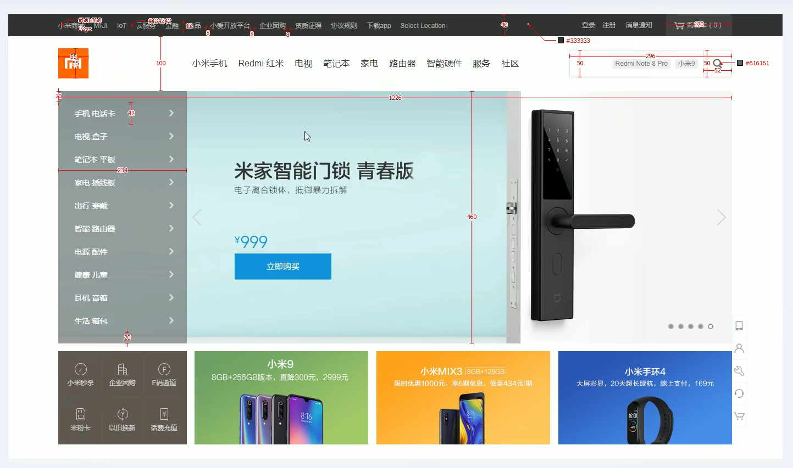

​	[VisBug - Crx4Chrome插件下载](http://www.crx4.com/16519.html) 可以用这个插件来获取尺寸

### 获取静态页面的图片

由于是别人的网站，需要下载

使用AIX智能下载器-crx插件即可 [AIX智能下载器 7.0.30-Chrome浏览器插件扩展 (fkxz.cn)](https://www.fkxz.cn/ddicoofdkbcdkkeecgafcoabogcgicfp/#J_DLIPPCont) 或者https://www.aliyundrive.com/s/cQfUBARdm2v

下载选项设置下载地址和取消询问

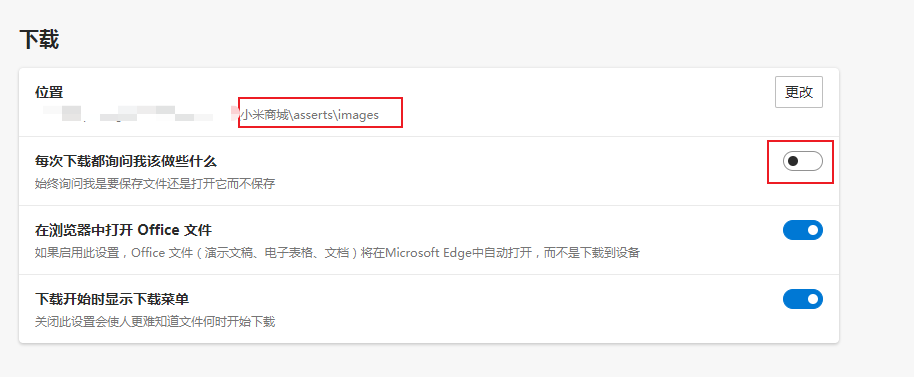

记得把该页面所有的内容看一下，先缓存一下

如下：

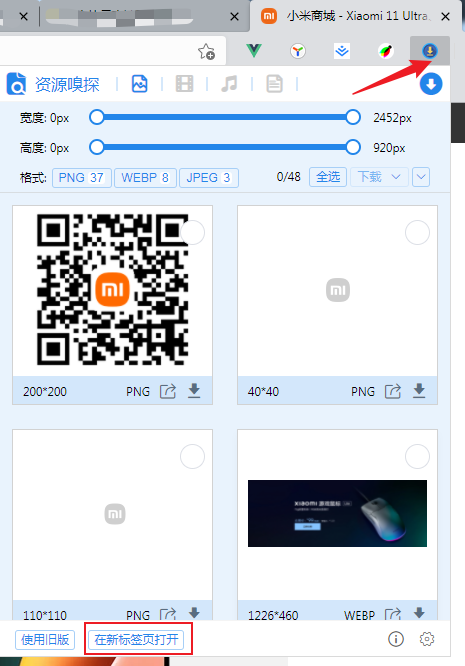

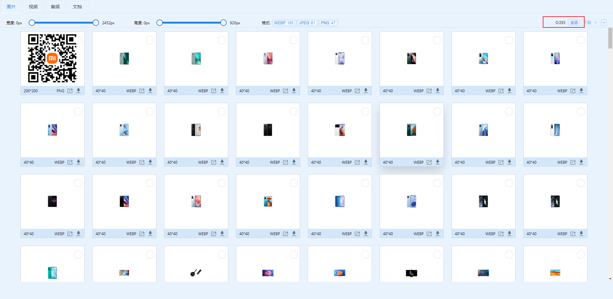

这里建议，用到哪个就选哪个下载

### 图标

- 使用阿里图标库，注重图标素材积累

- 在线引入

  ```html
      <link rel="stylesheet" href="http://at.alicdn.com/t/font_3144739_ot22wco7hul.css">
  ```

### css格式化

### 取色工具

使用edge浏览器自带的CSS概述，但复制不了

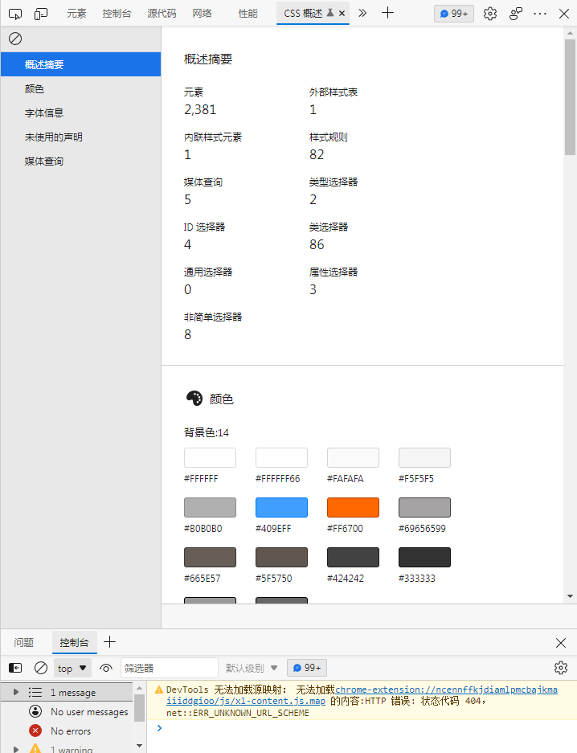

下载TakeColor取色工具：https://sz7wfp-www-xbox361-com-r1om96n7lqsxhn.fgongbi02.cn/fded021e91ba35cd55ccf96f2b52264a.TakeColor.zip

`Alt + C`保存一组色值

有些元素如果hover的时候，发生了改变，先截图即可，截图工具推荐Snipaste

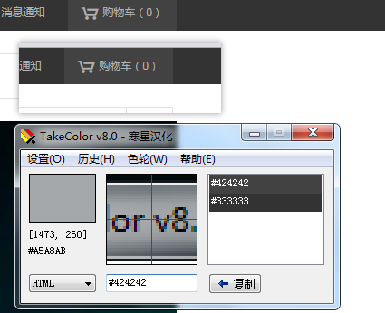

也可以下载插件：[FeHelper - Awesome (baidufe.com)](https://www.baidufe.com/fehelper/index/index.html)

### css代码组织规范

[组织CSS - 学习 Web 开发 | MDN (mozilla.org)](https://developer.mozilla.org/zh-CN/docs/Learn/CSS/Building_blocks/Organizing)

## 手写_小米商城

### 首页

## 手写_淘宝商城

## 手写_京东商城

## 手写_华为商城

## 手写_荣耀商城

## 手写静态页面积累

- 使用css变量来保存网站的主题色 
- 先写结构，后写交互
  - 把所有交互中，可能出现的结构，都写出来
  - 一个好的结构分布，会简化交互的代码实现


# 购物车

### 购物车作业的回顾和实现

v-for中，点击切换颜色

```
<!DOCTYPE html><html lang="en"><head>    <meta charset="UTF-8">    <title>Title</title>    <style>        .active{            color :red;        }    </style></head><body><div id="app">    <h2>{{message}}</h2>    <ul>        <li v-for="(item,index) in books" :class="{active: currentIndex === index}" @click = liClick(index)>{{index + 1}} - {{item}}</li>    </ul></div><script src="js/vue.js"></script><script>    const app = new Vue({        //用于挂载需要管理的元素        el: '#app',        //定义数据        data: {            message: 'hello world',            books :['人民的名义','论持久战','天上最亮的星星','黑洞','Java语言精粹'],            active : "active",            currentIndex : 0        },        methods : {            liClick (index) {                this.currentIndex = index//不能写成this.index ，这个的值是undefined            }        }    })</script></body></html>
```

- 购物车案例-界面搭建
- 过滤器的使用
- 购物车案例-改变购买数量
- 高阶函数

```
<!doctype html>
<html lang="en">
<head>
    <meta charset="UTF-8">
    <meta name="viewport"
          content="width=device-width, user-scalable=no, initial-scale=1.0, maximum-scale=1.0, minimum-scale=1.0">
    <meta http-equiv="X-UA-Compatible" content="ie=edge">
    <title>Document</title>
    <style>
        [v-cloak] {
            display: none !important;
        }

        table{
            border: 1px solid #e9e9e9;
            border-spacing: 0;
            border-collapse: collapse;
        }

        th, td{
            border: 1px solid #e9e9e9;
            padding: 8px 16px;
            text-align: center;
        }
        th{
            font-weight: 600;
            background-color: grey;
            color: white;
        }
    </style>

</head>
<body>
    <div id="app" v-cloak>
        <table>
            <thead>
                <tr>
                    <th></th>
                    <th>名称</th>
                    <th>发布时间</th>
                    <th>价格</th>
                    <th>数量</th>
                    <th>操作</th>
                </tr>

            </thead>
            <tbody>
                <tr v-for="(item,index) in books">
                    <td>{{item.id}}</td>
                    <td>{{item.name}}</td>
                    <td>{{item.publishTime}}</td>
                    <td>{{item.price | getPrice}}</td>
                    <td>
                        <button @click="decre(idnex)" :disabled="item.count <= 1">-</button>
                        {{item.count}}
                        <button @click="incre(index)">+</button>
                    </td>
                    <td>
                        <button @click="rmData(index)">移除</button>
                    </td>
                </tr>
            </tbody>
        </table>
        <h2>总价格：{{totalPrice | getPrice}}</h2>
    </div>
    <script src="js/vue.js"></script>
    <script>
        const app = new Vue({
            el: "#app",
            data: {
                books: [
                    {id:1,name:'aa',publishTime:'1990-01',price:40,count:1},
                    {id:1,name:'bb',publishTime:'1990-01',price:40,count:1},
                    {id:1,name:'cc',publishTime:'1990-01',price:40,count:1},
                    {id:1,name:'dd',publishTime:'1990-01',price:40,count:1},
                ]
            },
            filters : {
                getPrice(price) {
                    return "￥" + price.toFixed(2)
                }
            },
            computed: {
                totalPrice() {
                    return this.books.reduce(function (preValue, book) {
                        return preValue + book.count * book.price
                    },0)
                }
            },
            methods: {
                decre(index) {
                    this.books[index].count--
                },
                incre(index) {
                    this.books[index].count++
                },
                rmData(index) {
                    this.books.splice(index,1)
                }
            }
        })
    </script>
</body>
</html>
```

### 购物车案例_界面搭建

### 购物车案例_过滤器的使用

### 购物车案例_改变购买数量

### 购物车案例_移除按钮、最终价格

### 购物车案例_高阶函数的使用-


# 手机商城

### 接口文档

```
vue create mall
```

### 准备

#### 创建项目和项目托管

```
git remote add origin https://gitee.com/mindcons/vue_supermall.git
git push -u origin master
```

#### 划分目录结构

- src/

- assets

- components

  - common  通用组件
  - content  业务相关的组件

- views

- network

- common

  - common.js
  - utils.js
  - mixin.js

- store

- router 路由管理

  ```
  
  ```

  

#### 初始化CSS文件的引入 

- base.css

  ```css
  @import "./normalize.css";
  ```

  

- normalize.css

  在App.vue中的style标签中引用

  在`css`中`import`需要加`@`，最后要加一个分号的

  ```vue
  <style>  @import "./assets/css/normalize.css";</style>
  ```

base.css

```css
@import "./normalize.css";/*:root -> 获取根元素html*/:root {    --color-text: #666;    --color-high-text: #ff5777;    --color-tint: #ff8198;    --color-background: #fff;    --font-size: 14px;    --line-height: 1.5;}*,*::before,*::after {    margin: 0;    padding: 0;    box-sizing: border-box;}body {    font-family: "Helvetica Neue", Helvetica, "PingFang SC", "Hiragino Sans GB", "Microsoft YaHei", "微软雅黑", Arial, sans-serif;    user-select: none; /* 禁止用户鼠标在页面上选中文字/图片等 */    -webkit-tap-highlight-color: transparent; /* webkit是苹果浏览器引擎，tap点击，highlight背景高亮，color颜色，颜色用数值调节 */    background: var(--color-background);    color: var(--color-text);    /* rem vw/vh */    width: 100vw;}a {    color: var(--color-text);    text-decoration: none;}.clear-fix::after {    clear: both;    content: '';    display: block;    width: 0;    height: 0;    visibility: hidden;}.clear-fix {    zoom: 1;}.left {    float: left;}.right {    float: right;}
```

normalize.css

```css
/*! normalize.css v8.0.1 | MIT License | github.com/necolas/normalize.css */

/* Document
   ========================================================================== */

/**
 * 1. Correct the line height in all browsers.
 * 2. Prevent adjustments of font size after orientation changes in iOS.
 */

html {
    line-height: 1.15; /* 1 */
    -webkit-text-size-adjust: 100%; /* 2 */
}

/* Sections
   ========================================================================== */

/**
 * Remove the margin in all browsers.
 */

body {
    margin: 0;
}

/**
 * Render the `main` element consistently in IE.
 */

main {
    display: block;
}

/**
 * Correct the font size and margin on `h1` elements within `section` and
 * `article` contexts in Chrome, Firefox, and Safari.
 */

h1 {
    font-size: 2em;
    margin: 0.67em 0;
}

/* Grouping content
   ========================================================================== */

/**
 * 1. Add the correct box sizing in Firefox.
 * 2. Show the overflow in Edge and IE.
 */

hr {
    box-sizing: content-box; /* 1 */
    height: 0; /* 1 */
    overflow: visible; /* 2 */
}

/**
 * 1. Correct the inheritance and scaling of font size in all browsers.
 * 2. Correct the odd `em` font sizing in all browsers.
 */

pre {
    font-family: monospace, monospace; /* 1 */
    font-size: 1em; /* 2 */
}

/* Text-level semantics
   ========================================================================== */

/**
 * Remove the gray background on active links in IE 10.
 */

a {
    background-color: transparent;
}

/**
 * 1. Remove the bottom border in Chrome 57-
 * 2. Add the correct text decoration in Chrome, Edge, IE, Opera, and Safari.
 */

abbr[title] {
    border-bottom: none; /* 1 */
    text-decoration: underline; /* 2 */
    text-decoration: underline dotted; /* 2 */
}

/**
 * Add the correct font weight in Chrome, Edge, and Safari.
 */

b,
strong {
    font-weight: bolder;
}

/**
 * 1. Correct the inheritance and scaling of font size in all browsers.
 * 2. Correct the odd `em` font sizing in all browsers.
 */

code,
kbd,
samp {
    font-family: monospace, monospace; /* 1 */
    font-size: 1em; /* 2 */
}

/**
 * Add the correct font size in all browsers.
 */

small {
    font-size: 80%;
}

/**
 * Prevent `sub` and `sup` elements from affecting the line height in
 * all browsers.
 */

sub,
sup {
    font-size: 75%;
    line-height: 0;
    position: relative;
    vertical-align: baseline;
}

sub {
    bottom: -0.25em;
}

sup {
    top: -0.5em;
}

/* Embedded content
   ========================================================================== */

/**
 * Remove the border on images inside links in IE 10.
 */

img {
    border-style: none;
}

/* Forms
   ========================================================================== */

/**
 * 1. Change the font styles in all browsers.
 * 2. Remove the margin in Firefox and Safari.
 */

button,
input,
optgroup,
select,
textarea {
    font-family: inherit; /* 1 */
    font-size: 100%; /* 1 */
    line-height: 1.15; /* 1 */
    margin: 0; /* 2 */
}

/**
 * Show the overflow in IE.
 * 1. Show the overflow in Edge.
 */

button,
input { /* 1 */
    overflow: visible;
}

/**
 * Remove the inheritance of text transform in Edge, Firefox, and IE.
 * 1. Remove the inheritance of text transform in Firefox.
 */

button,
select { /* 1 */
    text-transform: none;
}

/**
 * Correct the inability to style clickable types in iOS and Safari.
 */

button,
[type="button"],
[type="reset"],
[type="submit"] {
    -webkit-appearance: button;
}

/**
 * Remove the inner border and padding in Firefox.
 */

button::-moz-focus-inner,
[type="button"]::-moz-focus-inner,
[type="reset"]::-moz-focus-inner,
[type="submit"]::-moz-focus-inner {
    border-style: none;
    padding: 0;
}

/**
 * Restore the focus styles unset by the previous rule.
 */

button:-moz-focusring,
[type="button"]:-moz-focusring,
[type="reset"]:-moz-focusring,
[type="submit"]:-moz-focusring {
    outline: 1px dotted ButtonText;
}

/**
 * Correct the padding in Firefox.
 */

fieldset {
    padding: 0.35em 0.75em 0.625em;
}

/**
 * 1. Correct the text wrapping in Edge and IE.
 * 2. Correct the color inheritance from `fieldset` elements in IE.
 * 3. Remove the padding so developers are not caught out when they zero out
 *    `fieldset` elements in all browsers.
 */

legend {
    box-sizing: border-box; /* 1 */
    color: inherit; /* 2 */
    display: table; /* 1 */
    max-width: 100%; /* 1 */
    padding: 0; /* 3 */
    white-space: normal; /* 1 */
}

/**
 * Add the correct vertical alignment in Chrome, Firefox, and Opera.
 */

progress {
    vertical-align: baseline;
}

/**
 * Remove the default vertical scrollbar in IE 10+.
 */

textarea {
    overflow: auto;
}

/**
 * 1. Add the correct box sizing in IE 10.
 * 2. Remove the padding in IE 10.
 */

[type="checkbox"],
[type="radio"] {
    box-sizing: border-box; /* 1 */
    padding: 0; /* 2 */
}

/**
 * Correct the cursor style of increment and decrement buttons in Chrome.
 */

[type="number"]::-webkit-inner-spin-button,
[type="number"]::-webkit-outer-spin-button {
    height: auto;
}

/**
 * 1. Correct the odd appearance in Chrome and Safari.
 * 2. Correct the outline style in Safari.
 */

[type="search"] {
    -webkit-appearance: textfield; /* 1 */
    outline-offset: -2px; /* 2 */
}

/**
 * Remove the inner padding in Chrome and Safari on macOS.
 */

[type="search"]::-webkit-search-decoration {
    -webkit-appearance: none;
}

/**
 * 1. Correct the inability to style clickable types in iOS and Safari.
 * 2. Change font properties to `inherit` in Safari.
 */

::-webkit-file-upload-button {
    -webkit-appearance: button; /* 1 */
    font: inherit; /* 2 */
}

/* Interactive
   ========================================================================== */

/*
 * Add the correct display in Edge, IE 10+, and Firefox.
 */

details {
    display: block;
}

/*
 * Add the correct display in all browsers.
 */

summary {
    display: list-item;
}

/* Misc
   ========================================================================== */

/**
 * Add the correct display in IE 10+.
 */

template {
    display: none;
}

/**
 * Add the correct display in IE 10.
 */

[hidden] {
    display: none;
}

```

#### 配置vue.config.js和.editorconfig

cli3的配置隐藏在了modules中了，配置**别名**

在**项目根目录**下，需要创建vue.config.js

```javascript
export default {    configureWebpack: {        resolve: {            alias: {                // '@': 'src'// 默认的配置                'assets': '@/assets',                'common': '@/common',                'components': '@/components',                'network': '@/network',                'views': '@views'            }        }    }}
```

**别名语法已经修改了，需要注意下**

若上述配置未生效，请自行搜索`vue-cli3配置别名`

```javascript
const path = require('path');function resolve(dir) {  return path.join(__dirname, dir);}console.log(__dirname)console.log(path.join(__dirname,'src/assets'))module.exports = {  lintOnSave: true,  chainWebpack: (config) => {    config.resolve.alias      .set('@',resolve('src'))      .set('assets',resolve('src/assets'))      .set('common',resolve('src/common'))      .set('components',resolve('src/components'))      .set('network',resolve('src/network'))      .set('views',resolve('src/views'))  }};
```

另外，修改别名后，在webstorm会出现按`CTRL`+左键无法跳转的情况，可以进行以下配置

这时，我们只需要在项目根目录创建一个文件 `alias.config.js`：

```javascript
/** * 由于 Vue CLI 3 不再使用传统的 webpack 配置文件，故 WebStorm 无法识别别名 * 本文件对项目无任何作用，仅作为 WebStorm 识别别名用 * 进入 WebStorm preferences -> Language & Framework -> JavaScript -> Webpack，选择这个文件即可 * */const resolve = dir => require('path').join(__dirname, dir);module.exports = {  resolve: {    alias: {      '@': resolve('src'),      'assets': '@/assets',      'common': '@/common',      'components': '@/components',      'network': '@/network',      'views': '@views'    }  }};
```

如果以上不生效，可以把wepack configuration file配置成类似`d:\project-name\node_modules\_@vue_cli-service@3.12.1@@vue\cli-service\alias.config.js`的形式

这里的配置还是得写成老语法


mall/.editorconfig

```
root = true[*]charset = utf-8indent_style = spaceindent_size = 2end_of_line = lfinsert_final_newline = truetrim_trailing_whitespace = true
```

### 功能模块

这个是一开始单独开发的组件，用的是vue-cli2创建项目的方式

```
vue init webpack tabbar
```


#### 导航栏开发

##### 实现思路

1.如果在下方有一个单独的TabBar组件，如何封装

- 自定义TabBar组件，在App中使用
- 让TabBar处于底部，并且设置相关样式

2.TabBar中显示的**内容由外部决定** 

- 定义插槽 
- flex布局平分TabBar

3.自定义TabBaritem，**可以传入**图片和文字

- 自定义TabBarItem，并且定义两个插槽：图片、文字 

- 给两个插槽外层包装div，用于设置样式 
- 填充插槽，实现底部TabBar效果

4.传入高亮图片 

- 定义另一个插槽，插入active-icon的数据 
- 定义一个变量isActive，通过v-show来决定是否显示对象的icon

5.TabBarItem绑定路由数据 

- 安装路由：

  ```
  npm install vue-router --save
  ```

- 完成router/index.js的内容，以及创建对应的组件 

- main.js中注册router 

- App中加入组件

6.点击item跳转到对应路由，并且动态决定isActive 

- 监听item的点击，通过this.route.replace()替换路由路径 
- 通过this.route.path.indexOf(this.link) !== -1 来判断是否是active

7.动态计算active样式 

- 封装新的计算属性：this.isActive ? {'color':'red"'}:{}

```
vue init webpack TabBar
```

##### tabbar 基本结构搭建

App.vue

```vue
<template>  
<div id="app">    
    <div id="tab-bar">      
        <div class="tab-bar-item">首页</div>      
        <div class="tab-bar-item">首页</div>      
        <div class="tab-bar-item">首页</div>      
        <div class="tab-bar-item">首页</div>    
    </div>  
    </div>
</template>
<script>export default {  
        name: 'App'}
</script>
<style>  
    @import './assets/css/base.css';  
    #tab-bar {    
        display: flex;    
        height: 49px;    
        background-color: #f6f6f6;    
        position: fixed;    
        left: 0;    
        bottom: 0;    
        right: 0;    
        box-shadow: 0 -1px 1px rgba(100,100,100,.2);  }  .tab-bar-item {    flex: 1;  }</style>
```

```
num run dev
```

测试效果如下：


##### tabbar TabBar和TabBarItem组件的封装

components文件夹下，应该对每个功能，单独新建文件夹，新建tabbar文件

将上述的业务代码，剪切，至tabbar/TabBar.vue文件中，

tabbar/TabBar.vue

```vue
<template>  
<div id="tab-bar">    
    <div class="tab-bar-item">首页</div>    
    <div class="tab-bar-item">首页</div>    
    <div class="tab-bar-item">首页</div>    
    <div class="tab-bar-item">首页</div>  
    </div>
</template>
<script>  
    export default {    
        name: 'tabBar'  }
</script>
<style>  
    #tab-bar {    
        display: flex;    
        height: 49px;    
        background-color: #f6f6f6;    
        position: fixed;    
        left: 0;    
        bottom: 0;    
        right: 0;    
        box-shadow: 0 -1px 1px rgba(100, 100, 100, .2);  
    }  
    .tab-bar-item {    
        flex: 1;  
    }
</style>
```

在App.vue中导入、挂载并使用TabBar组件

App.vue

```vue
<template>  
<div id="app">    
    <tab-bar></tab-bar>  
    </div></template>
<script>  
    import TabBar from './components/tabbar/TabBar'
    export default {  
        name: 'App',  
        components: {    
            TabBar  
        }}
</script>
<style>  
    @import './assets/css/base.css';
</style>
```

我们的tabbar还要用到图片，创建对应的文件夹

asserts/img/tabbar

在tabbar组件新增图片，并且设置样式

tabbar/TabBar.vue

```vue
<template>
  <div id="tab-bar">
      <div class="tab-bar-item">
        
          首页
      </div>
      <div class="tab-bar-item">
        
          首页
      </div>
      <div class="tab-bar-item">
        
          首页
      </div>
      <div class="tab-bar-item">
        
          首页
      </div>
  </div>
</template>

<script>
  export default {
    name: 'tabBar'
  }
</script>

<style>
  #tab-bar {
    display: flex;
    height: 49px;
    background-color: #f6f6f6;

    position: fixed;
    left: 0;
    bottom: 0;
    right: 0;

    box-shadow: 0 -1px 1px rgba(100, 100, 100, .2);
  }

  .tab-bar-item {
    flex: 1;
  }
  .tab-bar-item img{
    width: 24px;
    height: 24px;
  }
</style>

```

但是我们发现，此时这里面的东西有点乱，item相关的东西，不应该交给tabbar来管理

所以，我们给tabbar整一个插槽，让别人在用我的时候，自己指定内容就可以了

TabBar.vue:

```vue
<template>
  <div id="tab-bar">
    <slot></slot>
  </div>
</template>
```

App.vue

注意，此时的img的路径，引用是要修改的，就很麻烦

后面我们会讲到文件路径的引用问题

```vue
<template>
  <div id="app">
    <tab-bar>
      <div class="tab-bar-item">
        
          首页
      </div>
      <div class="tab-bar-item">
        
          首页
      </div>
      <div class="tab-bar-item">
        
          首页
      </div>
      <div class="tab-bar-item">
        
          首页
      </div>
    </tab-bar>
  </div>
</template>

<script>
  import TabBar from './components/tabbar/TabBar'
export default {
  name: 'App',
  components: {
    TabBar
  }
}
</script>

<style>
  @import './assets/css/base.css';

  .tab-bar-item {
    flex: 1;
  }
  .tab-bar-item img{
    width: 24px;
    height: 24px;
  }
</style>

```

但是，此时App.vue里面的代码，又变得臃肿起来了

所以，我们就可以再封装一个组件：   tabbaritem

并且，给文字包一个div，使其与图片上下显示

此时

tabbar/TabBarItem.vue

```vue
<template>
  <div class="tab-bar-item">
    
    <div>
        首页
    </div>
  </div>
</template>

<script>
  export default {
    name: 'TabBarItem'
  }
</script>

<style>
  .tab-bar-item {
    flex: 1;
  }

  .tab-bar-item img {
    width: 24px;
    height: 24px;
    margin-top: 3px;
    vertical-align: middle;
    margin-bottom: 2px;
  }
</style>

```

在App.vue中，引入tabbaritem，然后在tabbar的插槽中，使用4次即可

APP.vue

```vue
<template>  <div id="app">    <tab-bar>      <tab-bar-item></tab-bar-item>      <tab-bar-item></tab-bar-item>      <tab-bar-item></tab-bar-item>      <tab-bar-item></tab-bar-item>    </tab-bar>  </div></template><script>  import TabBar from './components/tabbar/TabBar'  import TabBarItem from "./components/tabbar/TabBarItem";export default {  name: 'App',  components: {    TabBar,    TabBarItem,  }}</script><style>  @import './assets/css/base.css';</style>
```

但是，很明显我们将tabbaritem里面的内容那个写死了，

需要改成具名插槽，在APP.vue中使用的时候，再指定slot即可

效果如下：


App.vue

```vue
<template>  <div id="app">    <tab-bar>      <tab-bar-item>                <div slot="item-text">首页</div>      </tab-bar-item>      <tab-bar-item>                <div slot="item-text">分类</div>      </tab-bar-item>      <tab-bar-item>                <div slot="item-text">购物车</div>      </tab-bar-item>      <tab-bar-item>                <div slot="item-text">我的</div>      </tab-bar-item>    </tab-bar>  </div></template><script>  import TabBar from './components/tabbar/TabBar'  import TabBarItem from "./components/tabbar/TabBarItem";  export default {    name: 'App',    components: {      TabBar,      TabBarItem,    }  }</script><style>  @import './assets/css/base.css';</style>
```

TabBar.vue

```vue
<template>  <div id="tab-bar">    <slot></slot>  </div></template><script>  export default {    name: 'tabBar'  }</script><style>  #tab-bar {    display: flex;    height: 49px;    background-color: #f6f6f6;    position: fixed;    left: 0;    bottom: 0;    right: 0;    box-shadow: 0 -1px 1px rgba(100, 100, 100, .2);  }</style>
```

TabBarItem.vue

```vue
<template>  <div class="tab-bar-item">    <slot name="item-icon"></slot>    <slot name="item-text"></slot>  </div></template><script>  export default {    name: 'TabBarItem'  }</script><style>  .tab-bar-item {    flex: 1;    text-align: center;    height: 49px;    font-size: 14px;  }  .tab-bar-item img {    width: 24px;    height: 24px;    margin-top: 3px;    vertical-align: middle;    margin-bottom: 2px;  }</style>
```

##### 给TabBarItem传入active图片

当处于活跃状态时，更改图片状态

我们需要先将，激活与未激活的图片都放在对应的位置

TabBarItem.vue中再整一个插槽，App.vue中传入激活的图片

TabBarItem.vue

```vue
<template>  <div class="tab-bar-item">    <slot name="item-icon"></slot>    <slot name="item-icon-activate"></slot>    <slot name="item-text"></slot>  </div></template>
```

App.vue

注意，两个插槽的slot不一样的

```vue
<template>  <div id="app">    <tab-bar>      <tab-bar-item>                        <div slot="item-text">首页</div>      </tab-bar-item>      <tab-bar-item>                        <div slot="item-text">分类</div>      </tab-bar-item>      <tab-bar-item>                        <div slot="item-text">购物车</div>      </tab-bar-item>      <tab-bar-item>                        <div slot="item-text">我的</div>      </tab-bar-item>    </tab-bar>  </div></template>
```

效果如下：

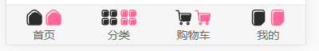

此时我们需要定义一个变量，控制激活的状态

TabBarItem.vue

```vue
<template>  <div class="tab-bar-item">    <slot v-if="!isActive" name="item-icon"></slot>    <slot v-else name="item-icon-activate"></slot>    <slot name="item-text"></slot>  </div></template><script>  export default {    name: 'TabBarItem',    data() {      return {        isActive: false      }    }  }</script>
```

此时效果v-if的判断是true，只显示item-icon的插槽：


如果我们将isActive的值，改为true，则v-else条件激活：

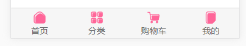

我们发现，字体的颜色，是没有跟着改变的，我们要动态的决定，要不要给文字的div加某一个类，用v-bind

TabBarItem.vue / template

```vue
    <slot :class="{active:isActive}" name="item-text"></slot>
```

TabBarItem.vue / style

```css
  .active {    color: pink;  }
```

我们给tabbaritem的插槽，动态绑定了class，但是看前台，字体并没有更改颜色

因为插槽最后，是被App.vue中的内容完全替换掉了

解决方案：把插槽放在一个div内，给这个div动态绑定class

TabBarItem.vue / template

```vue
    <div :class="{active:isActive}" >      <slot name="item-text"></slot>    </div>
```

最后渲染的页面，div是没有被替换的，效果如下：

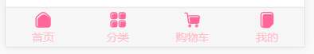

同理，我们将所有的插槽，都包装一个div

TabBarItem.vue / template

```vue
<template>  <div class="tab-bar-item">    <div v-if="!isActive">      <slot name="item-icon"></slot>    </div>    <div v-else >      <slot name="item-icon-activate"></slot>    </div>    <div :class="{active:isActive}" >      <slot name="item-text"></slot>    </div>  </div></template>
```

##### TabBarItem和路由结合效果

我们在前台的点击事件，要和路由跳转对应起来

之前创建项目的时候，没有选中的话，可以手动安装vue-router

```
npm install vue-router@3.0.1 --save
```

 详细步骤看vue-router那一小节

然后src下创建views文件夹，再分别创建home/category/cart/profile四个文件夹，同时创建Home.vue、Category.vue、Cart.vue、Profile.vue

如下结构：

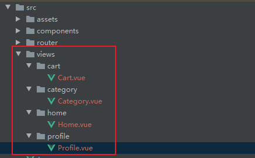

各自的temaplate做一下标识：

```vue
<template>  <h2>Profile</h2></template>
```

有了组件之后，

在main.js中挂载router

然后在router/index.js中创建映射关系

同时更改路由模式为history

/router/index.js

```javascript
import Vue from 'vue'import Router from 'vue-router'const Home = () => import('../views/home/Home')const Category = () => import('../views/category/Category')const Cart = () => import('../views/cart/Cart')const Profile = () => import('../views/profile/Profile')Vue.use(Router)const routes = [  {    path: '/',    redirect: '/home',  },  {    path: '/home',    component: Home  },  {    path: '/category',    component: Category  },  {    path: '/cart/',    component: Cart  },  {    path: '/profile',    component: Profile  }]export default new Router({  routes,  mode: 'history',})
```

我们需要监听点击事件，不用在App.vue中监听，直接到TabBarItem组件内部监听即可

监听点击的目的，是为了获得所点击的path，我们可以在tabbaritem中，定义props，之后在app.vue中使用的会后，给其传参即可

TabBarItem.vue / script

```vue
<script>  export default {    name: 'TabBarItem',    data() {      return {        isActive: true      }    },    props: {      path: String    },    methods: {      itemClick() {        this.$router.replace(this.path)      }    }  }</script>
```

App.vue中，传递固定的字符串给path

App.vue / template

加一个router-view

```vue
<template>  <div id="app">    <router-view></router-view>    <tab-bar>      <tab-bar-item path="/home">                        <div slot="item-text">首页</div>      </tab-bar-item>      <tab-bar-item path="/category">                        <div slot="item-text">分类</div>      </tab-bar-item>      <tab-bar-item path="/cart">                        <div slot="item-text">购物车</div>      </tab-bar-item>      <tab-bar-item path="/profile">                        <div slot="item-text">我的</div>      </tab-bar-item>    </tab-bar>  </div></template>
```

解释一下，path属性是在tabbaritem的props中定义好的，所以会进行传递

如果是一个没有定义的变量，最终渲染时，只会原样输出

```vue
     <tab-bar-item path="/home" path_test="/home_test">
```

前台渲染效果如下：


就不就相当于，给html标签，整个自定义类名么，不难理解


##### TabBarItem的颜色动态控制

上面的isActive是写死的，我们用计算属性，判断当前的路由，和传递过来的路由是否一致

TabBarItem.vue

```vue
<template>  <div class="tab-bar-item" @click="itemClick">    <div v-if="!isActive">      <slot name="item-icon"></slot>    </div>    <div v-else >      <slot name="item-icon-activate"></slot>    </div>    <div :class="{active:isActive}" >      <slot name="item-text"></slot>    </div>  </div></template><script>  export default {    name: 'TabBarItem',    data() {      return {      }    },    props: {      path: String    },    methods: {      itemClick() {        console.log(this.$route.path)        console.log(this.path)        this.$router.replace(this.path)      }    },    computed :{      isActive() {        return this.$route.path.indexOf(this.path) !== -1      }    }  }</script><style>  .tab-bar-item {    flex: 1;    text-align: center;    height: 49px;    font-size: 14px;  }  .tab-bar-item img {    width: 24px;    height: 24px;    margin-top: 3px;    vertical-align: middle;    margin-bottom: 2px;  }  .active {    color: pink;  }</style>
```

效果如下：


控制台打印两个路由：

```javascript
        console.log(this.$route.path)        console.log(this.path)
```

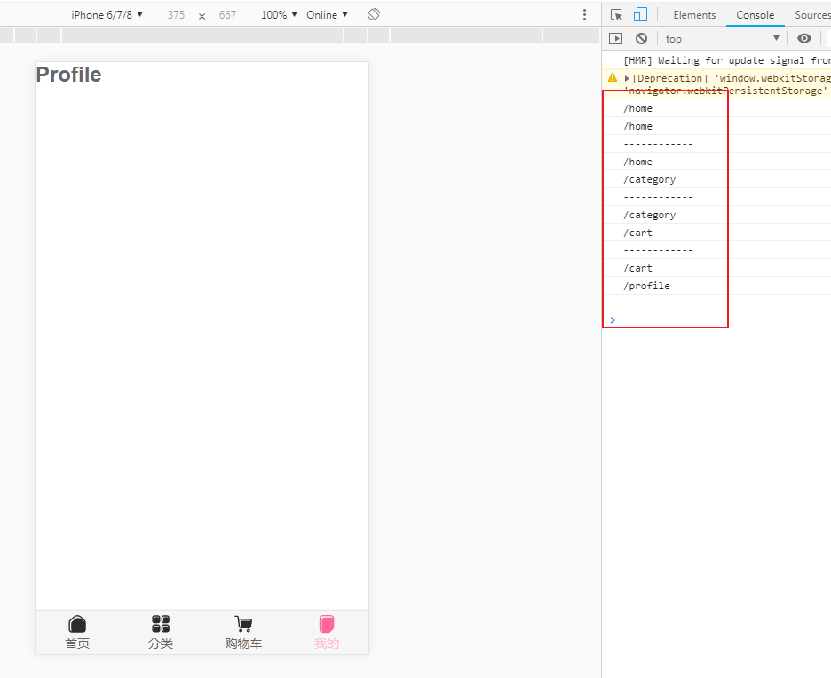


此时还有另外一个问题，就是字体的颜色，也不希望写死，希望我在使用的时候，能够自己指定

在tabbaritem中，定义一个activeColor的props属性，给一个默认值，然后动态绑定style即可

TabBarItem.vue / template

```vue
    <div :style="activeStyle" >      <slot name="item-text"></slot>    </div>
```

TabBarItem.vue / script

```javascript
    props: {      path: String,      activeColor: {        type: String,        default: 'red',      }    },    	computed: {      isActive() {        return this.$route.path.indexOf(this.path) !== -1      },      activeStyle() {        return this.isActive ? {color: this.activeColor} : {}      }    }
```

App.vue

 默认的颜色是red，使用的时候可以指定文字的激活颜色

```vue
<tab-bar-item path="/home" active-color="pink">
```

此时，我们看到App.vue的文件中，又有很多代码，我们再做一层抽象

components/中新建MainTabBar.vue，因为这一层代码是业务相关的，所以放在components目录下即可

MainTabBar.vue

```vue
<template>
    <tab-bar>
      <tab-bar-item path="/home" active-color="pink">
        
        
        <div slot="item-text">首页</div>
      </tab-bar-item>
      <tab-bar-item path="/category" active-color="pink">
        
        
        <div slot="item-text">分类</div>
      </tab-bar-item>
      <tab-bar-item path="/cart" active-color="pink">
        
        
        <div slot="item-text">购物车</div>
      </tab-bar-item>
      <tab-bar-item path="/profile" active-color="pink">
        
        
        <div slot="item-text">我的</div>
      </tab-bar-item>
    </tab-bar>
</template>

<script>
  import TabBar from './TabBar'
  import TabBarItem from "./TabBarItem";
  export default {
    name: 'MainTabBar',
    components: {
      TabBar,
      TabBarItem,
    },

  }
</script>

<style>

</style>

```

此时的App.vue中，代码量就非常少了

App.vue

```vue
<template>
  <div id="app">
    <router-view></router-view>
    <main-tab-bar></main-tab-bar>
  </div>
</template>

<script>
  import MainTabBar from "./components/tabbar/MainTabBar";
  import router from './router'
  export default {
    name: 'App',
    components: {
      MainTabBar
    },
    router,
  }
</script>

<style>
  @import './assets/css/base.css';

</style>

```

##### 文件路径的引用问题

build/webpack.base.config.js

```javascript
  resolve: {    
      extensions: ['.js', '.vue', '.json'],    
          alias: {      
              '@': resolve('src'),      
              'asserts': resolve('src/asserts'),      
              'components': resolve('src/components'),      
              'views': resolve('src/views')    
          }  
  },
```

如果是import里的路径引用，则可以直接用别名，

```

```


如果是html里的src路径引用，则需要加波浪号`~`

```

```

vue-cli2中配置了，使用时没有生效，直接用@代替了src目录即可

```vue
        
```


##### 其他项目中引入tabbar

封装的tabbar文件夹，放在components/common文件夹下

与业务相关的MainTabBar.vue放在components/content/mainTabBar文件夹下

注意各种导入路径的问题即可

这里还是写相对路径吧，别名问题暂时没有解决

##### favicon.ico小图标的修改

我们换成自己小图标就可以了

mall/public/favicon.ico

备注：public文件夹，会原封不到的打包到dist文件夹下的，相当于复制

#### 首页页面开发

##### 首页-导航栏的封装和使用（nav-bar）

在components/common下新建navbar/NavBar.vue	

```vue
<template>
  <div class="nav-bar">
    <div class="left">
      <slot name="left"></slot>
    </div>
    <div class="center">
      <slot name="center"></slot>
    </div>
    <div class="right">

    </div>
  </div>

</template>

<script>
    export default {
        name: "NavBar.vue"
    }
</script>

<style scoped>
  .nav-bar {
    display: flex;
    line-height: 44px;
  }
  .right, .left {
    width: 60px;
  }
  .center {
    flex: 1;
    background-color: pink;
  }
</style>

```

在views/Home.vue中引用

```vue
<template>  <div id="home">    <nav-bar></nav-bar>  </div></template><script>  import NavBar from "../../components/common/navbar/NavBar";    export default {        name: "Home",      components: {          NavBar      }    }</script><style scoped></style>
```

我们发现啥也没有显示，要学会调试，

先用vuedevtools看组件有没有出来，然后看具体的元素有没有被渲染出来

经过排查发现，是navbar没有给高度，设置后出来了

```css
  .nav-bar {    display: flex;    line-height: 44px;    height: 44px;         text-align: center;  }
```


Home.vue中使用插槽，并设置样式：

Home.vue

```vue
<template>  <div id="home">    <nav-bar class="home-nav">      <div slot="center">购物街</div>    </nav-bar>  </div></template><script>  import NavBar from "../../components/common/navbar/NavBar";    export default {        name: "Home",      components: {          NavBar      }    }</script><style scoped>  .home-nav {    /*background-color: var(--color-tint);*/    background-color: pink;    color: white;  }</style>
```

效果如下：


##### 首页-请求首页的多个数据

network/request.js

安装axios

request.js

```javascript
import axios from 'axios'export function request(config) {  //1.创建axios的实例  const instance = axios.create({    baseURL: 'http://152.136.185.210:7878/api/m5',    timeout: 5000  })  //2.axios的拦截器  //请求拦截  instance.interceptors.request.use(config => {    return config  },err => {    // console.log(err)  })  //响应拦截  instance.interceptors.response.use(res => {    return res.data  }, err => {    console.log(err)  })  //3.发送真正的网络请求  return instance(config)}
```

再封装一层home.js

```javascript
import {request} from "./request"export function getHomeMultidata() {  return request({url: '/home/multidata'})}
```

在Home.vue中导入 

````vue
import {getHomeMultidata} from 'network/home'
````

那么什么时候发送请求呢？

Home.vue中使用生命周期函数，来发送请求：

```javascript
        created() {            			//1. 请求多个数据            			getHomeMultidata().then(res => {                				console.log(res)            			})        		}
```

第一反应是，创建result用来接收数据

```javascript
        data() {            			return {                				result: null            			}        		},        		created() {            			//1. 请求多个数据            			getHomeMultidata.then(res= => {                				console.log(res)                				this.result = res            			})        		}
```

但一般情况下，不会用一个变量来保存：

```javascript
        data() {                    	return {                                // result: null                                banners: [],                                recommends: []                    	}                },                created() {                    	//1. 请求多个数据                    	getHomeMultidata.then(res= => {                                // console.log(res)                                // this.result = res                                this.banners = res.data.banner.list                                this.recommends = res.data.recommend.list                    	})                }
```

#### 九、首页-轮播图的展示[¶](#-_2)

轮播图的封装，导入轮播图组件，并挂载组件

```
import {Swiper, SwiperItem} from 'components/common/swiper'
```

vue有很多UI库，可以直接使用，但在学习阶段中，不建议直接使用，得自己学会封装

在home.vue的template中使用轮播图组件

```
  <swiper>    <swiper-item v-for="item in banners">      <a :href="item.link">              </a>    </swiper-item>  </swiper>
```

但是，我们一般还是会抽离出单独的组件

新建home/childrenComponents/HomeSwiper.vue

```
<template>  <swiper>    <swiper-item v-for="item in banners">      <a :href="item.link">              </a>    </swiper-item>  </swiper></template><script>  import {Swiper, SwiperItem} from 'components/common/swiper'  export default {        name: "HomeSwiper",        components: {          Swiper,          SwiperItem        },        props: {          banners: {            type: Array,            default() {              return []            }          }        }    }</script><style scoped></style>
```

#### 十、首页-推荐信息的展示[¶](#-_3)

childrenComponens/HomeRecommendView.vue

```
<template>  <div class="recommend">    <div v-for="item in recommends" class="recommend-item">      <a :href="item.link">                <div>{{item.title}}</div>      </a>    </div>  </div></template><script>    export default {        name: "HomeRecomendView",        props: {          recommends: {            type: Array,            default() {              return []            }          }        }    }</script><style scoped>  .recommend{    display: flex;    width: 100%;    text-align: center;    font-size: 12px;    padding: 10px 0 20px;    border-bottom: 8px solid #eee;  }  .recommend-item{    flex: 1;  }  .recommend-item img{    width: 80%;    margin-bottom: 10px;  }</style>
```

#### 十之一、首页-FeatureView的封装[¶](#-featureview)

childrenComponents/FeatureView.vue

```
<template>  <div class="feature">    <a href="#">          </a>  </div></template><script>    export default {        name: "FeatureView"    }</script><style scoped>  .feature img{    width: 100%;  }</style>
```

#### 十之二、首页-TabControl的封装[¶](#-tabcontrol)

- 只是文字不一样的情况下，没有必要用插槽
- 点击切换颜色
- 吸顶效果

```
<template>  <div class="tab-control">    <div v-for="(item,index) in titles"         class="tab-control-item"         :class="{active: index === currentIndex}" @click="itemClick(index)">      <span>        {{item}}      </span>    </div>  </div></template><script>    export default {        name: "TabControl",        props: {          titles: {            type: Array,            default() {              return []            }          }        },        data() {          return {            currentIndex: 0          }        },        methods: {          itemClick(index) {            this.currentIndex = index          }        }    }</script><style scoped>  .tab-control{    display: flex;    text-align: center;    /*justify-content: center   ;*/    height: 44px;    line-height: 44px;    font-size: 15px;  }  .tab-control-item{    flex: 1;  }  .tab-control-item span {    padding-bottom: 5px;  }  .active{    color: var(--color-high-text);  }  .active span{    border-bottom: 3px solid var(--color-tint)  }</style>
```

#### 十之三、首页-保存商品的数据结构设计[¶](#-_4)

数据保存的模型

```
goods: {    'pop': {page: 0, list: []},    'news': {page: 0, list: []},    'sell': {page: 0, list: []}}
```

#### 十之四、首页-数据的请求和保存[¶](#-_5)

home.js

```
import {request} from "./request"export function getHomeMultidata() {  return request({    url: '/home/multidata'  })}export function getHomeGoods(type,page) {  return request({    url: 'home/data',    params: {      type,      page    }  })}
```

Home.vue

```
<template>  <div id="home">    <nav-bar class="home-nav"><div slot="center">购物街</div></nav-bar>    <home-swiper :banners="banners"></home-swiper>    <home-recomend-view :recommends="recommends"></home-recomend-view>    <feature-view></feature-view>    <tab-control :titles="['流行','新款','精选']"                 class="tab-control"></tab-control>    <div class="temp"></div>  </div></template><script>  import NavBar from "components/common/navBar/NavBar";  import TabControl from "@/components/common/tabControl/TabControl";  import HomeSwiper from "views/home/childrenComponents/HomeSwiper";  import HomeRecomendView from "@/views/home/childrenComponents/HomeRecomendView";  import FeatureView from "@/views/home/childrenComponents/FeatureView";  import {getHomeMultidata, getHomeGoods} from 'network/home';    export default {        name: "Home",        components: {          NavBar,          TabControl,          HomeSwiper,          HomeRecomendView,          FeatureView,        },        data() {          return{            banners: [],            recommends: [],            goods: {              'pop': {page: 0, list: []},              'new': {page: 0, list: []},              'sell': {page: 0, list: []}            }          }        },        created() {          //1. 请求多个数据          this.getHomeMultidata()          //2.请求goods数据          this.getHomeGoods('pop')          this.getHomeGoods('new')          this.getHomeGoods('sell')        },        methods: {          getHomeMultidata() {            getHomeMultidata().then(res => {              // console.log(res)              this.banners = res.data.banner.list              this.recommends = res.data.recommend.list            })          },          getHomeGoods(type) {            const page = this.goods[type].page + 1            getHomeGoods(type,page).then(res => {              // console.log(res)              this.goods[type].list.push(...res.data.list)              this.goods[type].page += 1            })          }        }    }</script><style scoped>  #home{    padding-top: 44px;  }  .home-nav {    background-color: var(--color-tint);    color: white;    position: fixed;    top: 0;    left: 0;    right: 0;    z-index: 9;  }  .temp {    height: 900px;  }  .tab-control{    position: sticky;    top: 44px;    background-color: #ffffff;  }</style>
```

#### 十之五、首页商品的展示[¶](#_4)

GoodList.vue

```
<template>  <div class="goods">    <good-list-item v-for="item in goods" :goods-item="item"></good-list-item>  </div></template><script>    import GoodListItem from "@/components/content/goods/GoodListItem";    export default {        name: "GoodsList",        props: {          goods: {            type: Array,            default() {              return []            }          }        },        components: {          GoodListItem        }    }</script><style scoped>  .goods {    /*width: 100%;*/    display: flex;    flex-wrap: wrap;    justify-content: space-evenly;  }</style>
```

GoodListItem.vue

```
<template>  <div class="goods-item">        <div class="goods-info">      <p>{{goodsItem.title}}</p>      <span class="price">{{goodsItem.price}}</span>      <span class="collect">{{goodsItem.cfav}}</span>    </div>  </div></template><script>    export default {        name: "GoodListItem",        props: {          goodsItem: {            type: Object,            default() {              return {}            }          }        }    }</script><style scoped>  .goods-item{    padding-bottom: 40px;    position: relative;    width: 48%;  }  .goods-item img{    width: 100%;    border-radius: 5px;  }  .goods-info {    font-size: 12px;    position: absolute;    left: 0;    right: 0;    bottom: 5px;    overflow: hidden;    text-align: center;  }  .goods-info p{    overflow: hidden;    text-overflow: ellipsis;    white-space: nowrap;    margin-bottom: 3px;  }  .goods-info .price{    color: var(--color-high-text);    margin-right: 20px;  }  .goods-info .collect{    position: relative;  }  .goods-info .collect::before{    content: '';    position: absolute;    left: -15px;    top: -1px;    width: 14px;    height: 14px;    background: url("~@/assets/img/common/collect.svg") 0 0/14px 14px;  }</style>
```

#### 十之六、首页-TabControl点击切换商品[¶](#-tabcontrol_1)

```
          /**           * 事件监听相关的方法           */          tabClick(index) {            // console.log(index)            switch (index) {              case 0:                this.currentType = 'pop'                break              case 1:                this.currentType = 'new'                break              case 2:                this.currentType = 'sell'                break            // this.currentType = Object.keys(this.goods)[index]            }          },
```

#### 十之七、首页-Scroll的安装和使用[¶](#-scroll)

```
npm install better-scroll@1.13.2 --save
```

备注：不能再created()函数中那tamplate的dom元素

#### 十之八、Better-scroll的基本使用解析[¶](#better-scroll)

使用两个进行嵌套，再把需要滚动的内容放在里面

```
<div>    <div class="content">        ul>li{列表数据$}*100    </div></div><script src="bscroll.js"></script><script>    const bscroll = new Bscroll(document.querySelector(".content"))</script>
```

**监听用户滚动到哪个位置**

probeType

- 0/1：都是不侦测
- 2：在手指滚动的过程中侦测，手指离开后的惯性滚动不侦测
- 3：只要是滚动，都侦测

```
  const bscroll = new BScroll(document.querySelector('.content'),{    probeType: 2  })  bscroll.on('scroll',(position) => {    console.log(position)  })
```

**click**

- better-scroll会默认阻止浏览器的原生click事件，当设置为true时，会派发一个click事件，我们会给派发的event参数加一个私有属性_constructed，值为true

**pullUpload**

- 上拉加载更多

```
{    pullUpload:true}bscroll.on('pullingup',() => {    console.log('上拉加载更多')    //请求数据并展示完成    setTimeout(() =>{        bscroll.finishPullUp()    },2000)})
```

#### 十之九、首页-Scroll在Vue中项目中使用过程[¶](#-scrollvue)

为了防止有一天BetterScroll不再维护了，需要对其进行封装

#### 十之十、首页-BScroll的封装以及使用[¶](#-bscroll)

在vue中，如果明确的想要拿到某一个元素，用ref，不要用query

100vh： 100%视口高度

scroll.vue

```
<template>  <div class="wrapper" ref="wrapper">    <div class="content">      <slot></slot>    </div>  </div></template><script>    import BScroll from 'better-scroll'    export default {        name: "Scroll",        data() {          return {            scroll: null          }        },        mounted() {          this.scroll = new BScroll(this.$refs.wrapper, {          })        }    }</script><style scoped></style>
```

在home.vue中需要调整外层的高度

```
  #home{    padding-top: 44px;    height: 100vh;    position: relative;  }    .content{    /*height: calc(100% - 93px);*/    /*overflow: hidden;*/    /*margin-top: 44px;*/    /*height: 300px;*/    overflow: hidden;    position: absolute;    top: 44px;    bottom: 49px;    left: 0;    right: 0;  }
```

#### 十之十一、首页-BackTop组件的封装和使用[¶](#-backtop)

组件是不能直接监听点击的，需要加.native修饰符

```
//在home中通过$refs属性，拿到scroll组件，再调用scroll对象中的方法this.$refs.scroll.scroll.scrollTo(0,0,500)
```

#### 十之十二、首页-BackTop的显示和隐藏[¶](#-backtop_1)

子传父，监听滚动的y坐标，对指定高度进行布尔值判断传给v-show属性

```
          //监听滚动的位置          this.scroll.on('scroll', (position) => {            // console.log(position)            this.$emit('scroll',position)          })
```

#### 十之十三、首页- 完成上拉加载更多[¶](#-_6)

```
          loadMore(){            // console.log('aa')            this.getHomeGoods(this.currentType)            this.$refs.scroll.scroll.refresh()          }
```

#### 十之十四、首页-滚动区域的Bug分析和解决[¶](#-bug)

监听图片是否加载完成

- 原生js

```
javascript img.onload = function() {}
```

- vue中

```
@load = "方法名"          //3.监听item中图片加载完成          this.$bus.$on('itemImageLoad', () => {            // console.log('111')            this.$refs.scroll.refresh()          })
```

#### 十之十五、首页-refresh函数找不到的bug[¶](#-refreshbug)

在mouted中监听图片是否加载完

使用&&操作符，检测scroll对象是否存在

```
        mounted() {          //3.监听item中图片加载完成          this.$bus.$on('itemImageLoad', () => {            this.$refs.scroll && this.$refs.scroll.refresh()          })        },
```

#### 十之十六、首页-刷新频繁的防抖函数的处理[¶](#-_7)

```
          debounce(func, delay) {            let timer = null            return function(...args) {              if(timer) clearTimeout(timer)              timer = setTimeout(() => {                func.apply(this.args)              },delay)            }        mounted() {          const refresh = this.debounce(this.$refs.scroll && this.$refs.scroll.refresh)          //3.监听item中图片加载完成          this.$bus.$on('itemImageLoad', () => {            console.log('111')            refresh()          })
```

#### 十之十七、首页-上拉加载更多的完成[¶](#-_8)

监听底部的滚动

scroll默认加载一次，需要在获取完数据后，执行一次finishPullUp

#### 十之十八、首页-tabControl的offsetTop的获取[¶](#-tabcontroloffsettop)

```
          //获取tabControl的offsetTop          //所有组件都有一个$el属性，用于获取元素的          console.log(this.$refs.tabControl.$el.offsetTop)
```

#### 十之十九、首页-tabControl的吸顶效果[¶](#-tabcontrol_2)

- 获取offsetTop

```
swiperImageLoad() { //获取tabControl的offsetTop //所有组件都有一个$el属性，用于获取元素的 // console.log(this.$refs.tabControl.$el.offsetTop) this.tabOffsetTop = this.$refs.tabControl.$el.offsetTop },
```

- 监听滚动，并且同步两个tabControl的状态

```
vue this.$refs.tabControl1.currentType = index this.$refs.tabControl2.currentType = index
```

#### 十之二十、首页-Home离开时记录状态[¶](#-home)

- keep-alive
- 离开时保存一个位置信息，进来时设置回去

```
        activated() {          // this.$refs.scroll.scrollTo(0,this.saveY,0)          // this.$refs.scroll.scrollTo(0,this.saveY,0)          // this.$refs.scroll.refresh()          // console.log('activated')          this.$refs.scroll.refresh()          this.$refs.scroll.scrollTo(0,this.saveY,0)        },        deactivated() {          // this.saveY = this.$refs.scroll.getScrollY()          // console.log('deactivated')          this.saveY = this.$refs.scroll.getScrollY()        },
```

#### 十之二十一、跳转到详情页并且携带id[¶](#id)

创建detail.vue路由

```
<template>    <div>  {{iid}}    </div></template><script>    export default {        name: "Detail",        data(){          return {            iid: null          }        },        created() {          this.iid = this.$route.params.iid        }    }</script><style scoped></style>
```

#### 十之二十二、导航栏的封装[¶](#_5)

DetailNavBar.vue

```
<template>  <nav-bar>    <div slot="left" class="back" @click="backClick">          </div>    <div slot="center" class="title">      <div v-for="(item,index) in titles"           class="title-item"           :class="{active: index === currentIndex}" @click="titleClick(index)">        {{item}}      </div>    </div>  </nav-bar></template><script>  import NavBar from "@/components/common/navBar/NavBar";  export default {        name: "DetailNavBar",        components: {          NavBar        },        data() {          return {            titles: ['商品','参数','评论','推荐'],            currentIndex:0          }        },        methods:{          titleClick(index) {            this.currentIndex = index          },          backClick() {            this.$router.back()          }        }    }</script><style scoped>  .title{    display: flex;    font-size: 14px;  }  .title-item{    flex: 1;  }  .active{    color: var(--color-high-text);  }  .back img{    vertical-align: middle;  }</style>
```

#### 十之二十三、数据请求以及轮播图展示[¶](#_6)

DetailSwiper.vue

```
<template>    <swiper class="detail-swipper">      <swiper-item v-for="item in topImages">              </swiper-item>    </swiper></template><script>    import {Swiper, SwiperItem} from 'components/common/swiper'    export default {        name: "DetailSwiper",        components: {          Swiper,          SwiperItem        },        props: {          topImages: {            type: Array,            default() {              return []            }          }        }    }</script><style scoped>.detail-swipper{  height: 300px;  overflow: hidden;}</style>
```

#### 十之二十四、商品基本信息的展示&店铺信息的解析[¶](#_7)

封装对应的组件即可

#### 十之二十五、加入滚动效果的scroll[¶](#scroll)

引入betterscroll，并设置顶部nav的样式

#### 十之二十六、商品详情页数据展示[¶](#_8)

#### 十之二十七、商品参数信息的展示[¶](#_9)

#### 十之二十八、从首页跳转到详情页[¶](#_10)

# 书签

## 接口文档

使用的是Yapi来管理接口的

## 准备规划

### 划分目录结构

- src/
- assets
- components
  - common  通用组件
    - Background.vue
  - content  业务相关的组件
- views
- network
- common
  - common.js
  - utils.js
  - mixin.js
- store
- router 路由管理

### 各模块抽象原则

所有的模块，都是App.vue的子组件，需要初始化的网络请求，如背景图片的加载、导航数据的加载，在App.vue组件的created函数中，就发请求，并传给子组件；

以背景图片模块为例

### UI配色

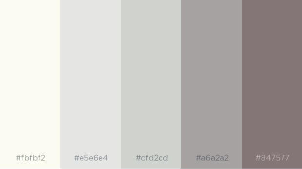

- #fbfbf2
- #e5e6e4
- #cfd2cd
- #a6a2a2
- #847577


## 功能模块

#### 背景图模块

-  获取背景图
  - 定义axios基础配置
  - 编写img样式
  - 在BackGround.vue组件创建时，发送请求，获取背景图片数据
-  背景图在点击输入框时，高斯模糊
   - 废弃
-  图片背景图过大
   - 暂缓解决

request.js

```javascript
import axios from 'axios'

export function request(config) {
  //1.创建axios的实例
  const instance = axios.create({
    // baseURL: 'http://1.116.68.249:6011',
    baseURL: 'http://127.0.0.1:8199',
    // timeout: 5000
  })
  //2.axios的拦截器
  //请求拦截
  instance.interceptors.request.use(config => {
    return config
  },err => {
    // console.log(err)
  })

  //响应拦截
  instance.interceptors.response.use(res => {
    return res.data
  }, err => {
    console.log(err)
  })

  //3.发送真正的网络请求
  return instance(config)
}

```

##### background.js

```javascript
import {request} from "./request"

export function getBackgroundData() {
  return request({url: '/img/get'})
}

```

##### Background.vue

```vue
<template>
  <div>
    <!---->
    
  </div>
</template>

<script>
  import "@/assets/css/background/background.css"
  import {getBackgroundData} from '@/network/background'

  export default {
    name: 'BackGround',
    data() {
      return {
        // 背景图片数据的响应格式
        backgroundData: {
          createAt: '',
          id: 0,
          imgBase: '',
          imgName: '',
          updateAt: '',
        },
        clickFocus: false,

      }
    },
    created() {
      getBackgroundData().then(res => {
        this.backgroundData = res.data
      })
    },
    computed: {
      getBase: function () {
        return this.backgroundData.imgBase
      },
      // focusActive() {
      //   return {
      //     'focus': this.$store.state.inputActive
      //   }
      // }
    },

  }
</script>

<style>

</style>

```


#### 搜索模块

- 搭建input结构
  - input结构，展示Input
  - input-content结构，展示搜索的结果列表
  - input交互
    - hover状态
    - focus/click状态
      - 触发背景图片高斯模糊
- 搭建三个搜索引擎结构


#### 时间模块

点击事件

- 控制Nav的show
- 控制input的隐藏
- 控制Nav中的margin的初始状态恢复


#### Cover层

- 完全透明

#### 导航模块

##### 拖拽排序功能

- 实例化方法，要在父导航数据对应的`dom`节点，完全生成了才能调用，使用`$netxTick`
- 实例化`SortableJs`，`el`的选择要用`querySelector`，不能用`ref`，设计到加载先后的问题
- 导航的数据，在`v-for`渲染时，要将`userid`为`-1`的添加自定义类，并且`SortableJS`的配置对象中，添加过滤类名
- 父导航数据初始化时，存储id，移动后，根据提供索引值，调用自定义方法（功能：根据索引交换数组的值），得到变化后的`id`列表
- 同步数据库时
- 交互处理


- 问题
  - 操作过快时，存在延迟写入的问题

#### 侧边栏模块

##### 天气

#### 书签模块

##### 侧边栏拖拽改变宽度

基于dom的事件，核心代码见《前端常见场景解决方案》


## 更新日志

### 2022年4月1日

- 【修复】修复侧边栏淡入淡出，与头像框淡入淡出不同步问题
  - 给父元素添加`overflow: hidden;`，视觉效果同步了
  - 但出现了新问题：修改`overflow: hidden`后，菜单栏被覆盖
    - 取消菜单栏，将个人中心入口放在头像，侧边栏新增退出入口
  - 每个图标添加`alt`提示文字
- 【修复】视觉问题
  - 调整搜索结果字体颜色
    - 直接通过控制台进行调整，取得最佳视觉效果后修改
- 【修复】修复书签页中点击搜索框跳转到首页
  - `click`事件加到父级元素了，该打
- 导入书签后，应该出现滚动条，方便拖动
  - 但设置`overflow: scroll`并未出现滚动条
  - 将问题转化为：vue项目中el-tree 支持横向和纵向滚动条设置
    - 我卡住了啊
    - 给`el-tree`套了一层`el-scrollbar`后，设置`.el-tree`的`display: inline-block`，的确会出现横向滚动条，但是吧，一旦全部收起后，`hover`时的背景色就不再独占一行了
      - 横向滚动栏，似乎必要性不大，实际并不会有太多太多的嵌套，可以适当的把左侧栏拉长点。
      - 竖向滚动栏
        - **放弃**
- 【修复】修复插件版本，多个窗口下，其中一个窗口注销后，另一个窗口token失效跳转报错的问题
  - 使用`window.location.reload()`替代`window.location.href = '/'`
    - 这种方案会有问题，如果插件版本在书签栏，则在网页端注销后，再刷新插件版本，会重复回调
    - 本来打算用路由的前置钩子，还是有一点问题
    - 最后用`window.history.back(-1)`替代`window.location.reload()`
- 第三方天气插件，文件转成本地
  - 在dev环境中正常
  - 单在crx环境中，资源成功请求到，但是页面没有加载出来
  - `crx`中重新引入线上文件
    - 涉及到`csp`的概念，将问题转化为：`csp`中`script-src`设置允许多个源

### 2022年4月2日

- 【修复】input长度限制
  - 由于前后新增了`icon`图标，增大左右内边距即可
- 【功能新增】搜索引擎可配置（参考掘金的交互）
  - 进度，准备监听url获取Logo

### 2022年4月6日

- 【接口优化】默认搜索引擎接口调试

### 2022年4月7日

- 【代码优化】登出后认证失效，应该重新请求下默认搜索引擎数渲染
  - 计算属性获取和`store`绑定的`localstorage`的值，再`watch`监听，直接赋值给`data`是获取不到变化的
- 【交互优化】
  - 默认只展示5个，加一个显示更多的按钮，如果未登录，则隐藏该按钮
    - 从数据层入手，只取前5个，不论是不是自定义的
      - `v-for`限制渲染数量

### 2022年4月20日

- 【功能新增】搜索引擎可配置（参考掘金的交互）
  - 进度，准备监听url获取Logo
  - 已完成

### 2022年4月28/29日

- 【功能新增】书签页的左侧栏支持拖拽调整大小


- 搜索结果磨砂效果，需要颗粒感，不用内阴影+透明度的那种效果

  - 暂缓

- 书签高亮

- 书签导出

- 书签键盘交互
  - 书签中的搜索enter

- 插件的新增url时，是否已新增需要记录

- 资源响应时间过长，但有的时候响应很快，可能单纯是网络问题吧

  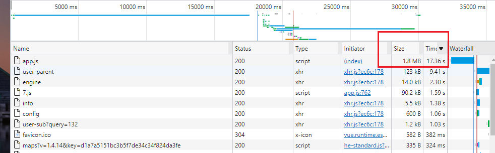

  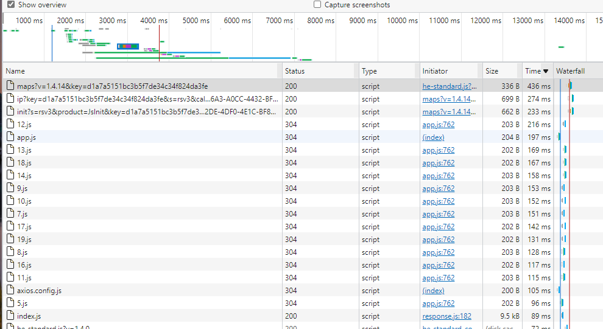

  

### 2022年5月5日

- 【功能新增】书签导出功能
  - 接口已提供

### 2022年5月13日

- 【功能新增】导航浏览记录


## `bug`修复日志

### 2022年5月6日-多个`a`标签的`href`值更新问题

- 【bug】问题代码

  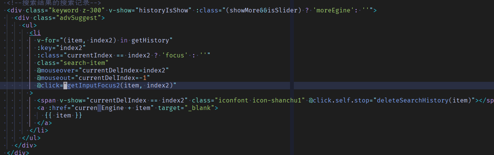

- 前台

  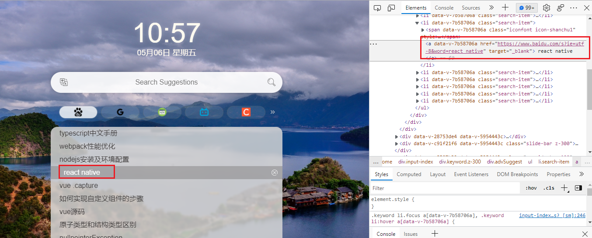

- 问题描述：`html`渲染是没有问题的，问题在于`click`时，由于要实现最新点击的搜索记录在第一行，所以要更新`v-for`的数据源，而这会导致`a`标签的`item`发生变化，所以在点击的一瞬间，`item`变成了点击之前的上一条记录

  - 直观上的感受是，`click`时调用的`update`操作，比浏览器`a`标签的跳转要快

- 解决方案

  - `setTImeout`

    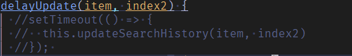

    - 问题：由于是跳转到新的标签页，跳转后，setTimeoout就不执行了，只有重新回到原来的标签页后，才会执行，即使设置了`delay`为0，仍有延迟更新的停顿感。

  - 使用`window.open()`替代`a`标签，这样保证可以在跳转时`item`是对的

### 2022年5月16日-多端`token`失效跳转问题

多端登陆后，其中一端注销，redist中token失效，对于其他端的处理是跳转到首页。

但这种处理方式对于`crx`不行，不是跳转不跳转的问题，对于`crx`，路径`chrome://newtab`才是新的标签页路径，不是一个维度的问题

问题代码：

```js
 instance.interceptors.response.use(res => {
        return res.data
    }, err => {
        if (err.response) {
            switch (err.response.status) {
                case 401:
                    store.commit(LOGIN_OUT)
                    Message({
                        message: '认证失效，请重新登录',
                        type: 'warning'
                    })
                    //window.location.href = '/'
                    //window.location.reload()
                    // 适配插件里的问题，但多浏览器端登录会有问题
                    window.history.back(-1)

                    break
                default:
                    break
            }
        }
        console.log(err)
        Promise.reject(error)
    })
```

解决方案：获取当前访问的`url`然后拼接，因为`crx`和`web`环境的`url`是不一样的

- 插件的打印结果

  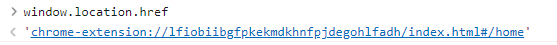

- `web`的打印结果

  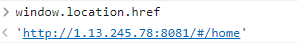

```js
 instance.interceptors.response.use(res => {
        return res.data
    }, err => {
        if (err.response) {
            switch (err.response.status) {
                case 401:
                    store.commit(LOGIN_OUT) // 清除前端token
                    Message({
                        message: '认证失效，请重新登录',
                        type: 'warning'
                    })
                    //window.location.href = '/'
                    //window.location.reload()
                    // 适配插件里的问题，但多浏览器端登录会有问题
                    //window.history.back(-1)
                    let href = window.location.href
                    console.log('href', href)
                    let suffixUrl = href.split('#/')
                    let wholeUrl = suffixUrl[0] + '#/home'
                    console.log(wholeUrl)
                    window.location.href= wholeUrl
                    break
                default:
                    break
            }
        }
        console.log(err)
        Promise.reject(error)
    })
```

### 2022年5月23日-`crx`引入第三方`js`问题

问题：第三方的天气插件，无法加载

报错信息如下

```
22.11ce897335d8ea0956a4.js:1 
        
       Refused to load the script 'https://widget.qweather.net/standard/static/js/he-standard-common.js?v=2.0' because it violates the following Content Security Policy directive: "script-src 'self' 'unsafe-eval'". Note that 'script-src-elem' was not explicitly set, so 'script-src' is used as a fallback.
```

解决方案：

- 将第三方的`js`等资源文件，全部下载至本地后打包

  ```js
  //引用线上插件
  export function weather() {
      window.WIDGET = {
          "CONFIG": {
              "layout": "2",
              "width": "400",
              "height": "295",
              "background": "5",
              "dataColor": "FFFFFF",
              "borderRadius": "5",
              "key": "c0de456ad3ff436f83ace3bf82b98b5d"
          }
      }
  
      const s = document.createElement('script')
      s.type = 'text/JavaScript';
      s.src = 'https://widget.qweather.net/standard/static/js/he-standard-common.js?v=2.0';
      document.body.appendChild(s);
  
  
  }
  // 引用本地插件
  export function linkLocalWeather() {
      window.WIDGET = {
          "CONFIG": {
              "layout": "2",
              "width": "400",
              "height": "295",
              "background": "5",
              "dataColor": "FFFFFF",
              "borderRadius": "5",
              "key": "c0de456ad3ff436f83ace3bf82b98b5d"
          }
      }
  
      var c = document.createElement('link');
      c.rel = 'stylesheet';
      c.href = '../../../../static/weather/he-standard.css';
      // c.href = 'https://widget.heweather.net/standard/static/css/he-standard.css?v=1.4.0'
      var s = document.createElement('script');
      s.src = '../../../../static/weather/he-standard.js';
      // s.src = 'https://widget.heweather.net/standard/static/js/he-standard.js?v=1.4.0'
      var sn = document.getElementsByTagName('script')[0];
      sn.parentNode.insertBefore(c, sn);
      sn.parentNode.insertBefore(s, sn);
  }
  ```

  值得注意的是，即使初始资源转成了本地资源，但初始资源内部可能还会请求其他外部资源，需要都转成本地：

  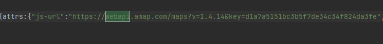

  但问题在于，你不知道新的外部资源，有没有再次引用

- 方案二：

  - 利用`crx`的插件协议：

    - [内容安全策略(CSP) - chrome插件中文开发文档(非官方) (getxhr.com)](http://docs.getxhr.com/ChromeExtensionDocument/contentSecurityPolicy.html)
    - https://blog.csdn.net/weixin_39940770/article/details/111786868

  - 看外部有哪些链接，配置`csp`字段

    - `unsafe-eval`：允许用`eval`函数
    - `unsafe-inline`：允许内嵌脚本，再添加访问的外部域名

    ```json
      "content_security_policy": "script-src 'self' 'unsafe-eval' 'unsafe-inlie' https://webapi.amap.com https://cdn.qweather.com/ https://restapi.amap.com ; object-src 'self'"
    ```

    

## 知识点小结


# `pc`商城

## 项目概述

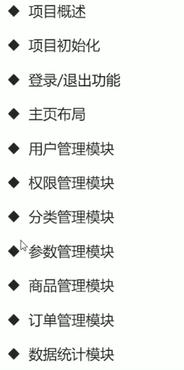

### 业务概述

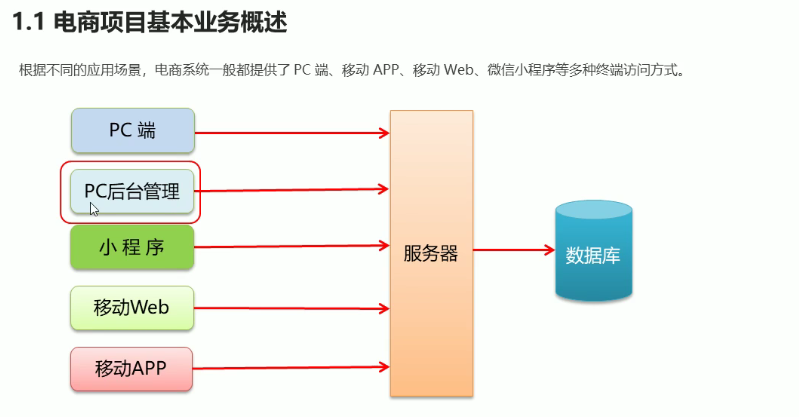

### 功能概述

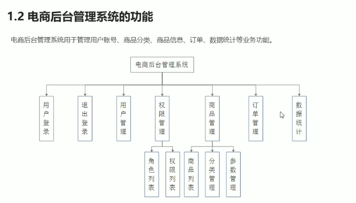

### 开发模式

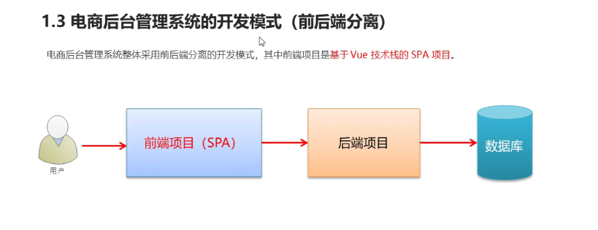

### 技术选型

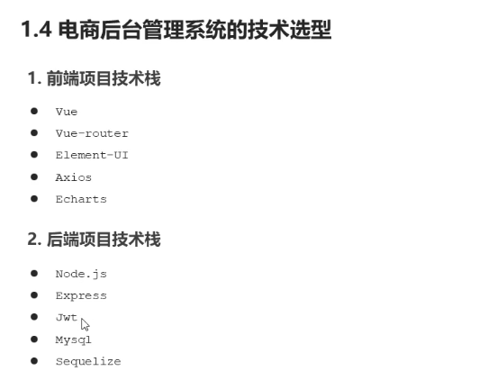

## 项目初始化

### 前端项目初始化步骤

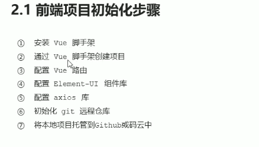

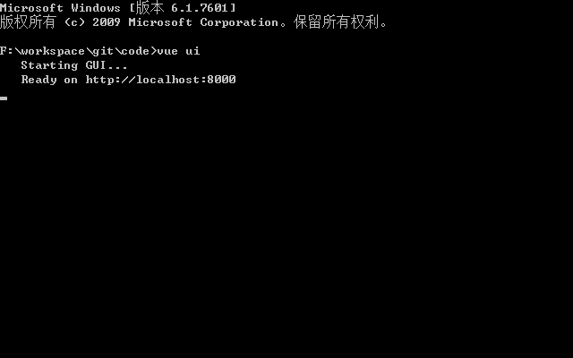


安装当前项目的依赖vue版本，

ssh配置git

后台环境安装

- mysql
- node

## 登陆/退出功能

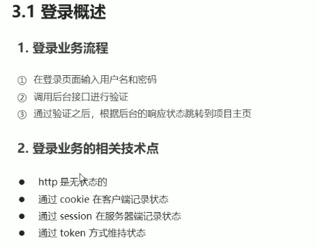

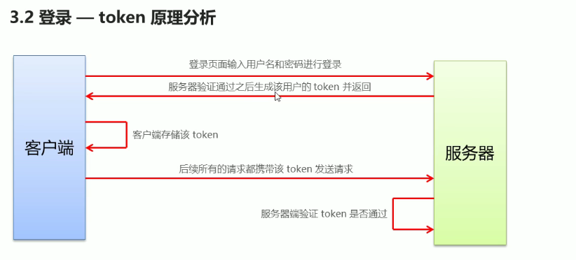

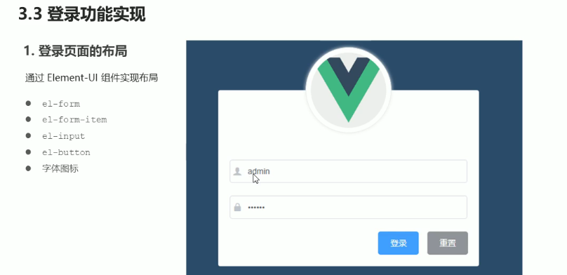

```
"@vue/cli-plugin-babel": "~4.5.0",
"@vue/cli-plugin-router": "~4.5.0",
"@vue/cli-plugin-vuex": "~4.5.0",
"@vue/cli-service": "~4.5.0",
"@vue/compiler-sfc": "^3.0.0",
"less": "^3.9.0",
"less-loader": "^4.1.0"
```

## 主页布局

### 头部布局

Login.vue

```vue
<template>
    <div class="login-container">
        <div class="login-box">
            <div class="avator-box">
                
            </div>
        </div>
    </div>
</template>

<script>
    export default {
        name: "Login"
    }
</script>

<style lang="less" scoped>
    .login-container {
        background-color: #2b4b6b;
        height: 100%;
    }
    .login-box {
        width: 450px;
        height: 300px;
        background-color: #fff;
        border-radius: 3px;
        position: absolute;
        left: 50%;
        top: 50%;
        transform: translate(-50%,-50%);

        .avator-box {
            width: 130px;
            height: 130px;
            border: 1px solid #eee;
            border-radius: 50%;
            padding: 10px;
            box-shadow: 0 0 10px #ddd;

            position: absolute;
            left: 50%;
            transform: translate(-50%,-50%);
            background-color: #fff;
            img {
                width: 100%;
                height: 100%;
                border-radius: 50%;
                /*background-color: #eee;*/
            }
        }
    }

</style>
```

效果：

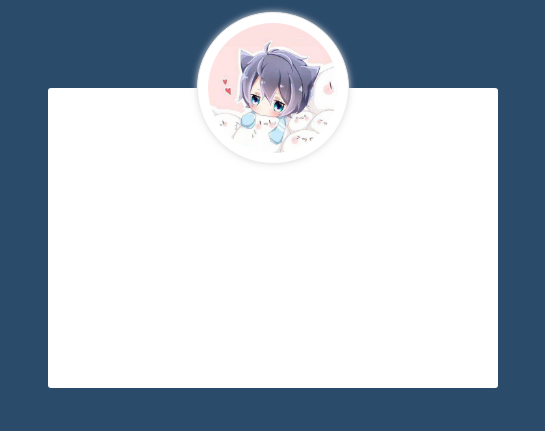


## 用户管理模块


## 权限管理模块


## 分离管理模块


## 参数管理模块


## 商品列表模块


## 订单管理模块


## 数据统计模块

# `pc`商城前后台

来源：https://www.bilibili.com/video/BV1Vf4y1T7bw

## 1.简介

- 前台项目：
  - 技术架构：`vue + webapck + vuex + vue-router + axios + less`
  - 封装通用组件
  - 登录注册
  - `token`
  - 守卫
  - 购物车
  - 支付
  - 项目性能优化
  - `...`
- 后台项目：
  - 技术架构：`vue + webpack + vuex + vue-router + axios + scss + elementUI...`
  - `elementUI`
  - 菜单按钮
  - 按钮权限
  - 数据可视化
  - `...`


# `Vue3`+`Nuxt3`开发房源网站

## `nvm`安装与使用

`NVM`是一个非常方便的`node`包管理工具，可以实现在`NodeJS` 各个不同版本之间自由的进行切换。

下面，介绍用`root`权限安装`NVM`工具。到2022年6月，`nvm`的最新版本为`v0.39`。

`vite`依赖的`node`版本 `>=` 12.0.0

`nuxt3`依赖的`node`版本`>=`14.16.0

### 安装`nvm`

下载

```bash
wget https://github.com/nvm-sh/nvm/archive/refs/tags/v0.39.1.tar.gz
```

解压

```bash
mkdir -p /root/.nvm
tar -zxvf v0.39.1.tar.gz -C /root/.nvm
```

配置环境，打开`~/.bashrc`

```bash
vim ~/.bashrc
```

在末尾添加

```bash
# nvm path env
export NVM_DIR="$HOME/.nvm/nvm-0.39.1"
[ -s "$NVM_DIR/nvm.sh" ] && \. "$NVM_DIR/nvm.sh"  # This loads nvm
[ -s "$NVM_DIR/bash_completion" ] && \. "$NVM_DIR/bash_completion"  # This loads nvm bash_completion

```

保存退出并使配置生效

```bash
source ~/.bashrc
```

### 使用`nvm`安装`node`

 列出已经安装的版本

```bash
nvm ls
```

安装指定版本`nodejs`

```bash
nvm install 16.14.0
```

卸载指定版本`nodejs`

```bash
nvm uninstall 16.14.0
```

切换到其他版本`nodejs`

```bash
nvm use 14.17.3
```

切换到`iojs`

```bash
nvm use iojs-v3.2.0
```

## `vite`安装与使用

安装`vite`

`vite`依赖的`node`版本 `>=` 12.0.0

打开终端，查看`npm`版本：`npm -v`

`npm`版本在`6.x`及以下使用如下命令

- `aribnb-ssr`表示项目名称

- `template`表示预设模板（技术栈）

```bash
npm init vite@latest airbnb-ssr --template vue-ts
```

`npm`版本在`7`及`7+`使用如下命令

```bash
npm init vite@latest airbnb-ssr -- --template vue-ts
```

切换到文件夹下，安装依赖

```bash
cd airbnb-ssr
npm i -D
```

### `vite`构建基本配置

由于是在`linux`环境下，运行启动命令前，改下`package.json`的配置

```json
    "dev": "vite --host 0.0.0.0 --port 8081", // 指定ip和开放的端口号
```

`vite`和`webapck`的不同：

- 没有`vendor`文件，利用的是浏览器原生的`esModule`


### 配置`@`别名

`vite.config.ts`

```tsx
import { defineConfig } from 'vite'
import vue from '@vitejs/plugin-vue'
import path from 'path'
// https://vitejs.dev/config/
export default defineConfig({
  plugins: [vue()],
  resolve: {
    // 配置路径别名
    alias: {
      '@': path.resolve(__dirname, './src'),
    },
  },
})

```

`tsconfig.json`

```json
{
  "compilerOptions": {
      
    "baseUrl": ".",
    "paths": {
      "@/*": [
        "src/*"
      ]
    }
      
  },
```

### 目录结构解析

相比较于常规`vue2`目录，`index.html`抽离出来了，`<scipt>`标签上多了`type="module"`属性，使用了`main.ts`作为项目的入口文件

## 项目技术选型

### `vue-router`

#### 安装

```bash
npm i vue-router@next -D
```

安装的是`4.0.13`版本

#### 引入

新建`router`目录，并新建`router.ts`

`router.ts`

```ts
import home from '@/views/home/index.vue';
import mine from '@/views/mine/index.vue';
import {createRouter, createMemoryHistory, createWebHistory, createWebHashHistory} from 'vue-router';
const routes = [
    {
        path: '/home',
        name: 'home',
        component: home,
        meta: {
            title: '',
            keepAlive: false
        }
    },
    {
        path: '/mine',
        name: 'mine',
        component: mine,
        meta: {
            title: '',
            keepAlive: false
        }
    }
]

const router = createRouter({
    history: createWebHistory(),
    routes
})

export default router
```

`main.ts`中使用`vue-router`插件

```ts
import { createApp } from 'vue'
import App from './App.vue'
import router from './router'

const app = createApp(App)
app.use(router)
app.mount('#app')

```

#### 使用

组件中使用`router`

`App.vue`

```vue
<script setup lang="ts">
import {useRouter} from 'vue-router'
const router = useRouter()
</script>

<template>

  <button @click="() => router.push({path: '/home'})">首页</button>
  <button @click="() => router.push({path: '/mine'})">个人中心</button>
  <router-view/>
</template>

<style>

</style>

```

`@/views/home/index.vue`

```vue
<script setup lang="ts">
import {useRouter,useRoute} from 'vue-router'
const router = useRouter()
const route = useRoute()
console.log(route.params)
</script>

<template>
  首页
  <button @click="() => router.push({path: '/mine', query: {id: 1}})">跳转到个人中心</button>

</template>

<style>

</style>

```

`@/views/mine/index.vue`

```vue
<script setup lang="ts">
import {useRouter, useRoute} from 'vue-router'
const router = useRouter()
const route = useRoute()

console.log(route.query)
</script>

<template>
  个人中心
  <button @click="() => router.push({name: 'home', params: {id: 2}})">回到首页</button>

</template>

<style>

</style>

```

### `element-plus`

#### 安装

```bash
npm i element-plus -D
```

#### 引入

按需引入

先下载依赖，实现自动导入

```bash
npm i -D unplugin-vue-components unplugin-auto-import
```

在`vite.config.ts`中新增配置

```ts
import { defineConfig } from 'vite'
import vue from '@vitejs/plugin-vue'
import path from 'path'
// 新增
import AutoImport from 'unplugin-auto-import/vite'
import Components from 'unplugin-vue-components/vite'
import {ElementPlusResolver} from 'unplugin-vue-components/resolvers'

export default defineConfig({
  plugins: [
      vue(),
      // 新增
      AutoImport({
        resolvers: [ElementPlusResolver()]
      }),
      Components({
        resolvers: [ElementPlusResolver()]
      })
  ],
  resolve: {
    alias: {
      '@': path.resolve(__dirname, './src'),
    },
  },
})

```

在入口文件中导入，并挂载

```ts
import { createApp } from 'vue'
import App from './App.vue'
import router from './router'
import ElementPlus from 'element-plus'
import 'element-plus/dist/index.css'

const app = createApp(App)
app.use(router)
app.use(ElementPlus)
app.mount('#app')

```

#### 使用

`home/index.vue`

```vue
<script setup lang="ts">
import {useRouter,useRoute} from 'vue-router'
const router = useRouter()
const route = useRoute()
console.log(route.params)
</script>

<template>
  首页
  <button @click="() => router.push({path: '/mine', query: {id: 1}})">跳转到个人中心</button>
  <el-button type="primary">Primary</el-button>
</template>

<style>

</style>

```

可以看到，后台只引入了`button`相关的样式

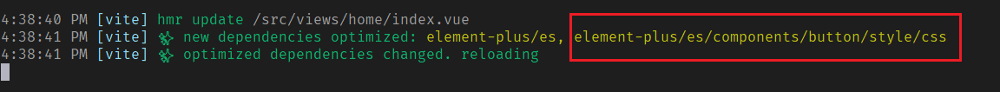

前台：

- `eleme-plus`是主包
- `base.css`是基本样式文件
- `el-button`是按钮相关样式

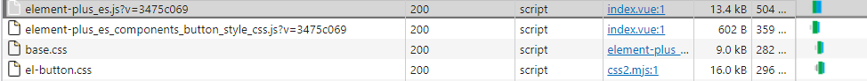

可以看到，`UI`库占用的体积很小，这个就是按需加载的好处

我们再引入一下消息提示的组件

```vue
<script setup lang="ts">
import {useRouter,useRoute} from 'vue-router'
import { h } from 'vue'
import { ElMessage } from 'element-plus'

const router = useRouter()
const route = useRoute()
console.log(route.params)

const openVn = () => {
  ElMessage({
    message: h('p', null, [
      h('span', null, 'Message can be '),
      h('i', { style: 'color: teal' }, 'VNode'),
    ]),
  })
}
</script>

<template>
  首页
  <button @click="() => router.push({path: '/mine', query: {id: 1}})">跳转到个人中心</button>
  <el-button type="primary">Primary</el-button>
  <el-button :plain="true" @click="openVn">VNode</el-button>
</template>

<style>

</style>

```

相比较于`button`，消息提示框的组件，我们全局可能都会用到，可以在全局引入

使用`vm`实例上的`config.globalProperty.XXX = YYY`来配置全局属性

`main.ts`

```ts
import { createApp } from 'vue'
import App from './App.vue'
import router from './router'
import ElementPlus, {ElMessage} from 'element-plus'
import 'element-plus/dist/index.css'

const app = createApp(App)
app.config.globalProperties.$message = ElMessage// 新增
app.use(router)
app.use(ElementPlus)
app.mount('#app')

```

在组件中，使用`vue`的上下文来使用`$message`

```vue
<script setup lang="ts">
import {useRouter,useRoute} from 'vue-router'
import { h, getCurrentInstance} from 'vue'

const router = useRouter()
const route = useRoute()
console.log(route.params)

const {proxy}:any = getCurrentInstance() // vue3中没有this，获取上下文
const openVn = () => {
  proxy.$message({
    message: h('p', null, [
      h('span', null, 'Message can be '),
      h('i', { style: 'color: teal' }, 'VNode'),
    ]),
  })
}
</script>

<template>
  首页
  <button @click="() => router.push({path: '/mine', query: {id: 1}})">跳转到个人中心</button>
  <el-button type="primary">Primary</el-button>
  <el-button :plain="true" @click="openVn">VNode</el-button>
</template>

<style>

</style>

```

#### 吐槽

为啥还会有个`element-plus`的`chunk`文件，`2M`多！！

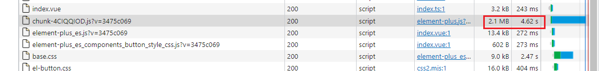


### `eslint`

#### 安装

```bash
npm i eslint -D
```

安装完之后，执行一下`eslint`

`npx eslint --init`或`npm init @eslint/config`

- 备注：`npm5.2`之后，内置了`npx`包，可以直接运行了（找自己的`node_modules`）

```bash
[root@VM-4-12-centos airbnb-ssr]# npm init @eslint/config
Need to install the following packages:
  @eslint/create-config
Ok to proceed? (y) y
✔ How would you like to use ESLint? · style
✔ What type of modules does your project use? · esm
✔ Which framework does your project use? · vue
✔ Does your project use TypeScript? · No / Yes
✔ Where does your code run? · browser, node
✔ How would you like to define a style for your project? · guide
✔ Which style guide do you want to follow? · standard
✔ What format do you want your config file to be in? · JavaScript
Checking peerDependencies of eslint-config-standard@latest
The config that you've selected requires the following dependencies:

eslint-plugin-vue@latest @typescript-eslint/eslint-plugin@latest eslint-config-standard@latest eslint@^8.0.1 eslint-plugin-import@^2.25.2 eslint-plugin-n@^15.0.0 eslint-plugin-promise@^6.0.0 @typescript-eslint/parser@latest
✔ Would you like to install them now? · No / Yes
✔ Which package manager do you want to use? · npm
Installing eslint-plugin-vue@latest, @typescript-eslint/eslint-plugin@latest, eslint-config-standard@latest, eslint@^8.0.1, eslint-plugin-import@^2.25.2, eslint-plugin-n@^15.0.0, eslint-plugin-promise@^6.0.0, @typescript-eslint/parser@latest

added 96 packages, and audited 291 packages in 19s

82 packages are looking for funding
  run `npm fund` for details

found 0 vulnerabilities
Successfully created .eslintrc.js file in /root/hh_git/vue-project/airbnb-ssr

```

安装完毕后，会根据我们的选择，生成`.eslintrc.js`配置文件

```js
module.exports = {
  env: {
    browser: true,
    es2021: true,
    node: true
  },
  extends: [
    // 'plugin:vue/essential',
    // 我们的项目是基于vue3的，改成vue3/essential，可以看下eslint官网，关于vue3的配置推荐
    'plugin:vue3/essential',
    'standard' // 使用单引号
  ],
  parserOptions: {
    ecmaVersion: 'latest',
    parser: '@typescript-eslint/parser',
    sourceType: 'module'
  },
  plugins: [
    'vue',
    '@typescript-eslint'
  ],
  rules: {
      // 自定义规则
  }
}

```

#### 使用

如果是在本地开发

- 我们导入了未使用的组件，则会出现错误提示
- 统一变量定义等

自定义规则：

- 函数名和括号间不想强制加空格

```js
  rules: {
      // 自定义规则
      'space-before-function-paren': 0
  }
```

搭配`vscode`插件：`eslint`使用更佳

如果`eslint`未生效，就要检查`vscode`之前有没有安装过类似的格式化工具、自动美化的一些插件


如果是在`linux`远程开发，暂时没办法

### `Sass`

#### 安装

```bash
npm i sass -D
```

#### 引入

`vite.config.js`


# `Vue`前后台项目-尚品汇

链接：https://www.bilibili.com/video/BV1Vf4y1T7bw

前言：不以`html`+`css`为主，主要搞业务，所以静态页面直接拿来用

## 初始化项目及配置

- 配置`src`别名
- 配置浏览器自动打开
- 关闭`eslint`语法检查
- 安装`less`预处理器，也可以在项目初始化的时候选择

## 路由分析

- 路由组件：首页、登录
- 非路由组件：头部、底部

### 完成非路由组件

实际开发流程：

- 书写静态页面
- 拆分组件
- 获取服务器数据动态展示
- 完成相应的动态业务逻辑


`components/Header/index.vue`

`components/Footer/index.vue`

### 完成路由组件

- 安装`vue-router`，可以直接在项目初始化时选中
- 新建路由并配置
- 配置重定向
- 配置路由跳转

- `Footer`组件的显示与隐藏


