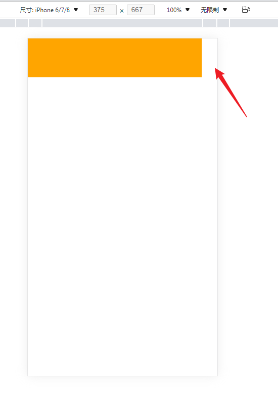
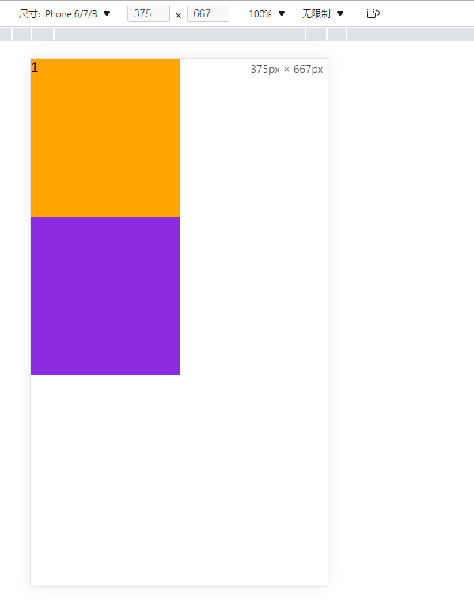
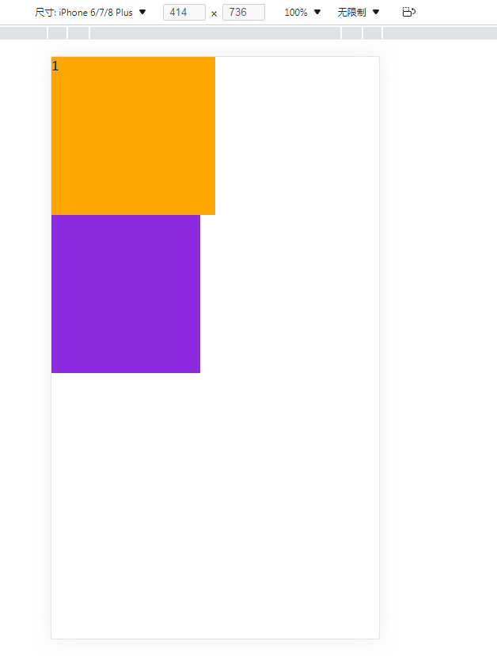

# 视口理论

 [viewport](https://developer.mozilla.org/zh-CN/docs/Glossary/Viewport) 

## Web开发：布局视口、视觉视口、理想视口

拓展：https://juejin.cn/post/6844904007756939271


## 移动端视口理论

拓展：[浅谈移动端中的视口（viewport） - 掘金 (juejin.cn)](https://juejin.cn/post/6844903687240810509)

### 像素

屏幕是由一个一个发光的小点构成的，这一个一个小点就是像素

在前端开发中，像素分两种情况讨论：物理像素和css像素

#### 物理像素

物理像素就是上述所说的小点点

#### css像素

编写网页时，我们用到的像素都是css像素

浏览器在显示网页时，需要将css像素转换成物理像素，然后再呈现

那么，一个css像素最终由几个物理像素组成，是由浏览器决定的：

`默认`情况下，一个css像素 = 一个物理像素


CSS像素和物理像素之间的比例取决于屏幕的特性（是否为高密度）以及用户进行的缩放，由浏览器自行换算。

### 视口(viewport)

视口就是屏幕中，显示网页的区域；简单说，视口就是浏览器的窗口

视口是可以拖拽，即大小是可以改变的

可以通过查看视口的大小，来观察css像素和物理像素的比值

```
打开浏览器，查看html元素的宽度，即为视口的长度（一般只看宽度）
```

默认情况下，审查元素查看html元素宽度：

```
视口宽度：1920px(css像素)
        1920px(物理像素)
```

放大网页时，可视区域变小，视口变小

放大两倍的情况，审查元素查看html元素宽度：

```
视口宽度：960px(css像素)
        1920px(物理像素)
        此时，css像素:物理像素 = 1:2
```

在放大两倍的情况下，创建一个100px的正方形盒子，用截图工具量取物理像素时，是200px

要理解的是，css像素和物理像素不一样；我们可以通过改变视口的大小，来改变css像素和物理像素的比值

### 手机像素

在不同的屏幕，单位像素的大小是不一样的，像素越小屏幕越清晰

```
以电脑为例，24寸 1920 x 1080 px，可以算出一寸有多少像素
iphone6,4.7寸 750 x 1334 px
```

这里关注移动端，[查看不同手机机型的分辨率](http://blog.chengyunfeng.com/devices/)

智能手机的像素点，远远小于计算机的像素点

问题：一个宽度为900px的网页，在iphone6中要如何显示呢？

```
创建宽为900px的盒子，审查元素调为手机端，查看iphone6机型的显示模式，发现还没有把宽度撑满

上述的750px是物理像素，900px是css像素，两者不能直接比较，应该看视口大小

查看iphone6的视口大小，为980px（一般移动端的视口大小都是980px），以确保没有做手机适配的网页，在手机端可以完整展示（以前的电脑端网页宽度一般不会超过1000px）
当把创建的盒子的长度，设置为980px时，移动端刚好撑满

但是如果网页端的宽度超过了980px，移动端的浏览器会自动缩放，以保证一次性可以把网页看全，比如腾讯新闻网:https://news.qq.com/

所以基本上大部分的pc端网页都可以在移动端正常访问，但往往不会有好的体验，为了解决这个问题，大部分网站都会专门为移动端设计网页
```



### 完美视口

移动端默认的（布局）视口大小是980px（css像素）

对于iphone6而言，移动端的像素比就是`css像素/物理像素`


`980/750 = 1/0.77`，表示一个css像素，占0.77个物理像素 

如果直接在网页中编写移动端代码，这样在980视口下，像素比非常不好，导致网页中的内容非常小

所以，编写移动端页面时，必须确保有一个比较合理的像素比

```
1 css像素 对应 2 物理像素
1 css像素 对应 3 物理像素
```

那么，怎么调整像素比呢？

```
可以通过改变视口的大小，来改变css像素和物理像素的比值
```

那么，怎么调整视口大小呢？

```html
可以通过meta标签，来设置视口大小

name:属性名
content:属性值
//设置视口的大小为100px
<meta name = "viewport“ content="width=100px">

此时再设置盒子宽为100px,手机端正好可以把屏幕撑满

此时像素比是100/750，此时一个css像素就占7.5个物理像素，而此时移动设备的分辨率是750像素，所以只要设置100px的css像素，即可撑满手机屏幕
<!DOCTYPE html>
<html>
    <head>
        <meta charset="utf-8">
        <meta name="viewport" content="width=100px"/>
        <title></title>
        <style>
            *{
                margin: 0;
                padding: 0;
            }
            .box1{
                width: 100px;
                height: 100px;
                background-color: red;
            }
        </style>
    </head>
    <body>
        <div class="box1"></div>
    </body>
</html>
```

#### 完美视口

那么，css像素究竟写多少，像素比究竟是多少才最合适呢

每一款移动设备设计时，都会有一个最佳的像素比

一般我们只需将像素比设置为该值即可得到一个最佳效果，以iphone6为例，[查看不同手机机型的分辨率](http://blog.chengyunfeng.com/devices/) ，**发现iphone6的最佳像素比为2**，算出视口大小为375px，这样的视口刚好和iphone6实际的硬件宽度一致。

所以我们将像素比设置为最佳像素比的视口大小称为`完美视口`

那么，375px是iphone6的完美视口，会是其他机型的完美视口吗？

答案是否定的。

所以设置`content = device-width`，`device-width`是浏览器提供的变量，表示设备的宽度，即完美视口

设置完美视口

```html
<meta name="viewport" content="width=device-width, initial-scale=1.0">
所谓的完美视口，就是对于不同的移动设备来说，使其布局视口依赖于自己的设备宽度，这样我们如果想要撑满某个机型的宽度，只需要设置刚好等于其宽度的css值即可（虽然可以通过width:100%来设置）

```

#### 结论

以后再写移动端的页面，就把上面的代码写上。

### vw单位

不同的设备，完美视口的大小是不一样的（硬件本身的设备宽度就不一样，导致了在css渲染时依赖的布局视口宽度不一样）

```
iphone6 -- 375
iphon6plus -- 414
```

由于不同设备视口和像素比不同，所以同样的375像素在不同的设备下，意义是不一样的

```
比如在iphone6,375就是全屏，
而到了iphon6plus中375就会缺一块
```

完美视口的设置，只解决布局视口的依赖问题，但没有解决同一个css像素，在像素比下的呈现问题。

所以在移动端开发中，就不能再使用px来进行布局了

`vw`表示的是视口宽度(viewport width)

- 100vw = 一个视口宽度
- 1vw = 1/100 = 1% 视口宽度

vw这个单位永远相当于视口宽度进行计算

```
在学习js之前，移动端可以用vw来进行适配
```

px与vw单位的比较

```html
<!--
 * @Author: your name
 * @Date: 2022-01-13 20:46:18
 * @LastEditTime: 2022-01-15 10:21:33
 * @LastEditors: Please set LastEditors
 * @Description: 打开koroFileHeader查看配置 进行设置: https://github.com/OBKoro1/koro1FileHeader/wiki/%E9%85%8D%E7%BD%AE
 * @FilePath: \布局\视口.html
-->
<!DOCTYPE html>
<html lang="en">
<head>
    <meta charset="UTF-8">
    <meta http-equiv="X-UA-Compatible" content="IE=edge">
    <meta name="viewport" content="width=device-width">
    <title>Document</title>
    <style>
        body {
            margin: 0;
            padding: 0;
            
        }

        .outer .inner {

            width: 50vw;
            height: 200px;
            background-color: orange;
        }
        .outer .inner2 {
            width: calc(375px / 2);
            height: 200px;
            background-color: blueviolet;
        }
    </style>
</head>
<body>
    <div class="outer">
        <div class="inner">1</div>
        <div class="inner2"></div>
    </div>
    <script>
        var cWidth = document.documentElement.clientWidth
        console.log(cWidth)
    </script>
</body>
</html>
```

iphone6机型



iphone6 plus机型



可以看到，在以vw为单位时，不同机型的呈现效果是同步的，因为是基于视口宽度动态计算的，而375px的盒子宽度，在iphone6上（布局视口750）是占据了一半，但在iphone plus（布局视口414）上并没有占据一般，所以对于移动端，单位不能用px写死，其本质是即使动态设置了布局视口，但不同机型的分辨率不一样，导致渲染的最终结果就不一样，不如让单位也动态计算。

#### 设计图的宽度

现在一般设计图的宽度，都是按照苹果的375px的布局视口来做的

现在的设计图都是375的倍数

```
2倍图：750px3倍图：1125px
```

| 设计图宽度 | 单位 |
| ---------- | ---- |
| 750px      | vw   |


现在想创建一个48 x 35 大小的元素（设计图里的大小）

```
100vw = 750px  ---->   1px = 100/750vw = 0.13333vw
?vw = 48px     ---->   100*48/750 = 6.4 vw
 同理35px = 4.667vw
```

#### em和rem

`1em` = 一个字体大小

`1rem` = 一个html的字体大小


em单位为一个相对的度量单位，它通过寻找父标签的font-size。然后通过计算得出自身的font-size。利用em单位设置便签的width或者height等属性原理也一样。

rem是一个灵活的、可扩展的单位，由浏览器转化像素并显示。与em单位不同，rem单位无论嵌套层级如何，都只相对于浏览器的根元素（HTML元素）的font-size。默认情况下，html元素的font-size为16px。

可以借助rem来存储上述的比值；

```
  html{        
    <!--font-size:100px;-->        
    font-size:0.1333333vw;
    //0.1333333vw = 1px    
    }    
    
  .box{        
  	width:750rem;
  	
  	//  750rem = 750 * 1个html字体大小 = 750 * 0.13333vw = 750 * 1px = 750px        
  	height:4.667vw;        
  	background-color:orange;    
  	}
```

那么，现在想创建一个48 x 35 大小的元素（设计图里的大小）

可以写成下述形式吗

```
    html{
        font-size:0.1333333vw;
    }
    .box{
        width:48rem;// 6.24px
        height:35rem;// 4.55px
        background-color:orange;
    }
```

不能，因为网页字体大小，最小是12px，不能设置一个比12px还小的值（除了0），否则，字体自动设置为12px;

```
所以，当设置html{font-size:0.1333333vw}时，默认的值大小其实是12px;,所以实际展示的是盒子大小是 576 x 420px

可以在指定font-size时，扩大倍数，在指定宽高时，再除以对应的倍数；
```

